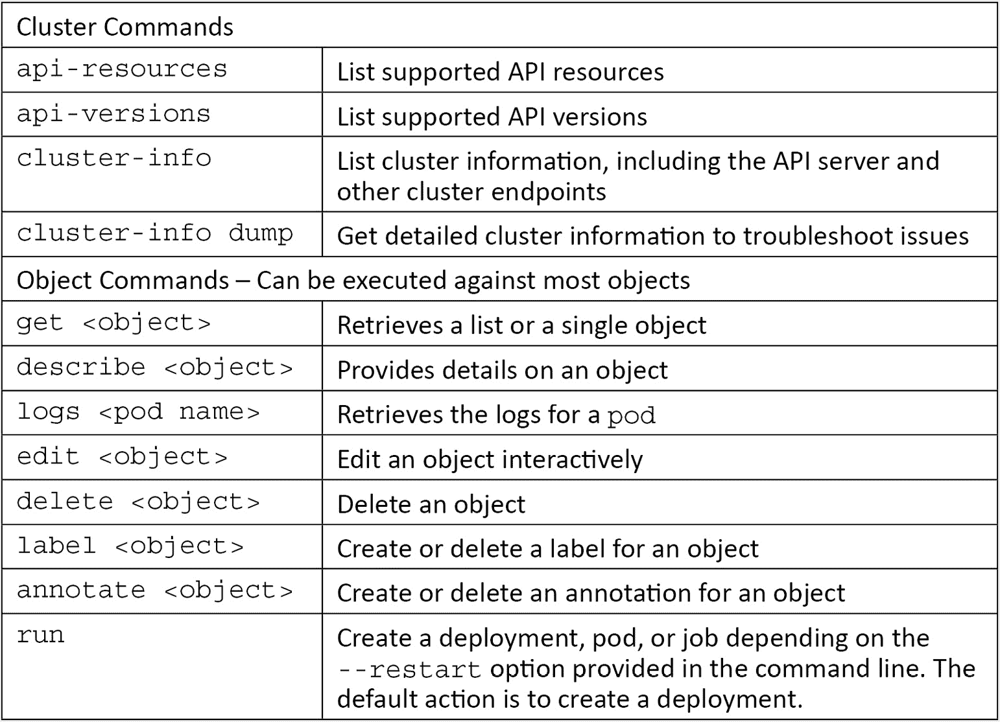
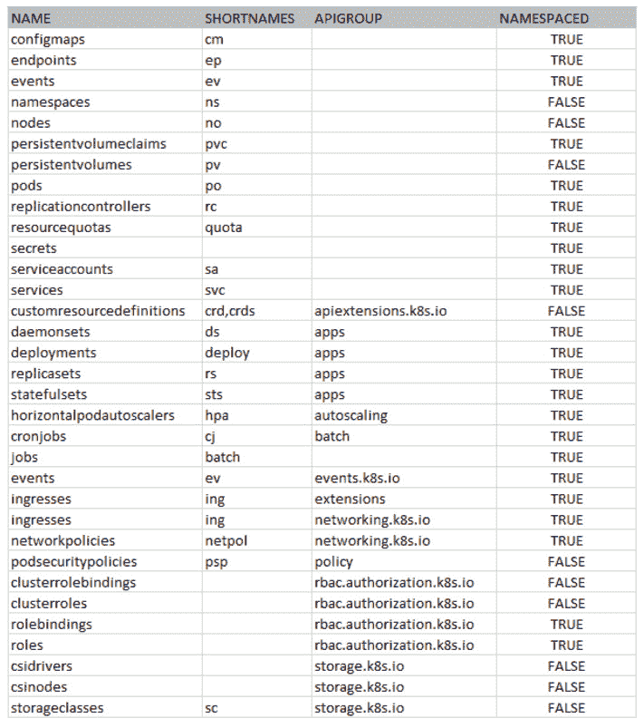

# 第五章：Kubernetes 训练营

我们相信你们中的许多人在某种程度上使用过 Kubernetes——您可能在生产环境中运行集群，或者您可能使用过 kubeadm、Minikube 或 Docker Desktop 进行试验。我们的目标是超越 Kubernetes 的基础知识，因此我们不想重复 Kubernetes 的所有基础知识。相反，我们添加了这一章作为一个训练营，供那些可能对 Kubernetes 还不熟悉，或者可能只是稍微玩过一下的人参考。

由于这是一个训练营章节，我们不会深入讨论每个主题，但到最后，您应该对 Kubernetes 的基础知识有足够的了解，以理解剩下的章节。如果您对 Kubernetes 有很强的背景，您可能仍然会发现本章对您有用，因为它可以作为一个复习，我们将在第六章《服务、负载均衡和外部 DNS》开始讨论更复杂的主题。

在这一章中，我们将介绍运行中的 Kubernetes 集群的组件，包括控制平面和工作节点。我们将详细介绍每个 Kubernetes 对象及其用例。如果您以前使用过 Kubernetes，并且熟悉使用 kubectl 并完全了解 Kubernetes 对象（如 DaemonSets，StatefulSets，ReplicaSets 等），您可能希望跳转到第六章《服务、负载均衡和外部 DNS》，在那里我们将使用 KinD 安装 Kubernetes。

在本章中，我们将涵盖以下主题：

+   Kubernetes 组件概述

+   探索控制平面

+   了解工作节点组件

+   与 API 服务器交互

+   介绍 Kubernetes 对象

# 技术要求

本章有以下技术要求：

+   具有至少 4GB 随机存取内存（RAM）的 Ubuntu 18.04 服务器

+   一个 KinD Kubernetes 集群

您可以在以下 GitHub 存储库中访问本章的代码：[`github.com/PacktPublishing/Kubernetes-and-Docker-The-Complete-Guide`](https://github.com/PacktPublishing/Kubernetes-and-Docker-The-Complete-Guide)。

# Kubernetes 组件概述

在任何基础设施中，了解系统如何共同提供服务总是一个好主意。如今有这么多安装选项，许多 Kubernetes 用户并不需要了解 Kubernetes 组件如何集成。

短短几年前，如果您想运行一个 Kubernetes 集群，您需要手动安装和配置每个组件。安装一个运行的集群是一个陡峭的学习曲线，经常导致挫折，让许多人和公司说“Kubernetes 太难了”。手动安装的优势在于，您真正了解每个组件是如何交互的，如果安装后您的集群遇到问题，您知道要查找什么。

如今，大多数人会在云服务提供商上点击一个按钮，几分钟内就可以拥有一个完全运行的 Kubernetes 集群。本地安装也变得同样简单，谷歌、红帽、牧场等提供了选项，消除了安装 Kubernetes 集群的复杂性。我们看到的问题是，当安装后遇到问题或有疑问时。由于您没有配置 Kubernetes 组件，您可能无法向开发人员解释 Pod 是如何在工作节点上调度的。最后，由于您正在运行第三方提供的安装程序，他们可能启用或禁用您不知道的功能，导致安装可能违反您公司的安全标准。

要了解 Kubernetes 组件如何协同工作，首先必须了解 Kubernetes 集群的不同组件。以下图表来自**Kubernetes.io**网站，显示了 Kubernetes 集群组件的高级概述：

图 5.1 - Kubernetes 集群组件

正如您所看到的，Kubernetes 集群由多个组件组成。随着我们在本章中的进展，我们将讨论这些组件及它们在 Kubernetes 集群中的作用。

# 探索控制平面

顾名思义，控制平面控制集群的每个方面。如果您的控制平面崩溃，您可能可以想象到您的集群将遇到问题。没有控制平面，集群将没有任何调度能力，这意味着正在运行的工作负载将保持运行，除非它们被停止和重新启动。由于控制平面非常重要，因此建议您至少有三个主节点。许多生产安装运行超过三个主节点，但安装节点的数量应始终是奇数。让我们看看为什么控制平面及其组件对运行中的集群如此重要，通过检查每个组件。

## Kubernetes API 服务器

在集群中要理解的第一个组件是**kube-apiserver**组件。由于 Kubernetes 是**应用程序编程接口**（**API**）驱动的，进入集群的每个请求都经过 API 服务器。让我们看一个简单的使用 API 端点的**获取节点**请求，如下所示：

**https://10.240.100.100:6443/api/v1/nodes?limit=500**

Kubernetes 用户常用的一种与 API 服务器交互的方法是 kubectl 实用程序。使用 kubectl 发出的每个命令在幕后调用一个 API 端点。在前面的示例中，我们执行了一个**kubectl get nodes**命令，该命令将一个 API 请求发送到端口**6443**上的**10.240.100.100**上的**kube-apiserver**进程。API 调用请求了**/api/vi/nodes**端点，返回了集群中节点的列表，如下截图所示：

图 5.2 - Kubernetes 节点列表

没有运行的 API 服务器，集群中的所有请求都将失败。因此，可以看到，始终运行**kube-apiserver**组件非常重要。通过运行三个或更多的主节点，我们可以限制失去主节点的任何影响。

注意

当运行多个主节点时，您需要在集群前面放置一个负载均衡器。Kubernetes API 服务器可以由大多数标准解决方案，包括 F5、HAProxy 和 Seesaw。

## Etcd 数据库

毫不夸张地说，Etcd 就是您的 Kubernetes 集群。Etcd 是一个快速且高可用的分布式键值数据库，Kubernetes 使用它来存储所有集群数据。集群中的每个资源在数据库中都有一个键。如果您登录到运行 Etcd 的节点或 Pod，您可以使用**etcdctl**可执行文件查看数据库中的所有键。以下代码片段显示了运行 KinD 集群的示例：

EtcdCTL_API=3 etcdctl --endpoints=https://127.0.0.1:2379 --cacert=/etc/kubernetes/pki/etcd/ca.crt --key=/etc/kubernetes/pki/etcd/server.key --cert=/etc/kubernetes/pki/etcd/server.crt get / --prefix --keys-only

前面命令的输出包含太多数据，无法在本章中列出。基本的 KinD 集群将返回大约 317 个条目。所有键都以**/registry/<object>**开头。例如，返回的键之一是**cluster-admin**键的**ClusterRole**，如下所示：**/registry/clusterrolebindings/cluster-admin**。

我们可以使用键名使用**etcdctl**实用程序检索值，稍微修改我们之前的命令，如下所示：

EtcdCTL_API=3 etcdctl --endpoints=https://127.0.0.1:2379 --cacert=/etc/kubernetes/pki/etcd/ca.crt --key=/etc/kubernetes/pki/etcd/server.key --cert=/etc/kubernetes/pki/etcd/server.crt get /registry/clusterrolebindings/cluster-admin

输出将包含您的 shell 无法解释的字符，但您将了解存储在 Etcd 中的数据。对于**cluster-admin**键，输出显示如下：

！

图 5.3 - etcdctl ClusterRoleBinding 输出

我们解释 Etcd 中的条目是为了提供 Kubernetes 如何使用它来运行集群的背景。您已经从数据库直接查看了**cluster-admin**键的输出，但在日常生活中，您将使用**kubectl get clusterrolebinding cluster-admin -o yaml**查询 API 服务器，它将返回以下内容：

！

图 5.4 - kubectl ClusterRoleBinding 输出

如果您查看**kubectl**命令的输出并将其与**etcdctl**查询的输出进行比较，您将看到匹配的信息。当您执行**kubectl**命令时，请求将发送到 API 服务器，然后 API 服务器将查询 Etcd 数据库以获取对象的信息。

## kube-scheduler

正如其名称所示，**kube-scheduler**组件负责调度运行中的 Pod。每当集群中启动一个 Pod 时，API 服务器会接收请求，并根据多个标准（包括主机资源和集群策略）决定在哪里运行工作负载。

## kube-controller-manager

**kube-controller-manager**组件实际上是一个包含多个控制器的集合，包含在一个单一的二进制文件中。将四个控制器包含在一个可执行文件中可以通过在单个进程中运行所有四个来减少复杂性。**kube-controller-manager**组件中包含的四个控制器是节点、复制、端点以及服务账户和令牌控制器。

每个控制器为集群提供独特的功能，每个控制器及其功能在此列出：

每个控制器都运行一个非终止的控制循环。这些控制循环监视每个资源的状态，进行任何必要的更改以使资源的状态正常化。例如，如果您需要将一个部署从一个节点扩展到三个节点，复制控制器会注意到当前状态有一个 Pod 正在运行，期望状态是有三个 Pod 正在运行。为了将当前状态移动到期望状态，复制控制器将请求另外两个 Pod。

## cloud-controller-manager

这是一个您可能没有遇到的组件，这取决于您的集群如何配置。与**kube-controller-manager**组件类似，这个控制器在一个单一的二进制文件中包含了四个控制器。包含的控制器是节点、路由、服务和卷控制器，每个控制器负责与其各自的云服务提供商进行交互。

# 了解工作节点组件

工作节点负责运行工作负载，正如其名称所示。当我们讨论控制平面的**kube-scheduler**组件时，我们提到当新的 Pod 被调度时，**kube-scheduler**组件将决定在哪个节点上运行 Pod。它使用来自工作节点的信息来做出决定。这些信息不断更新，以帮助在集群中分配 Pod 以有效利用资源。以下是工作节点组件的列表。

## kubelet

您可能会听到将工作节点称为**kubelet**。**kubelet**是在所有工作节点上运行的代理，负责运行实际的容器。

## kube-proxy

与名称相反，**kube-proxy**根本不是代理服务器。**kube-proxy**负责在 Pod 和外部网络之间路由网络通信。

## 容器运行时

这在图片中没有体现，但每个节点也需要一个容器运行时。容器运行时负责运行容器。您可能首先想到的是 Docker。虽然 Docker 是一个容器运行时，但它并不是唯一的运行时选项。在过去的一年里，其他选项已经可用，并且正在迅速取代 Docker 成为首选的容器运行时。最突出的两个 Docker 替代品是 CRI-O 和 containerd。

在书的练习中，我们将使用 KinD 创建一个 Kubernetes 集群。在撰写本文时，KinD 只提供对 Docker 作为容器运行时的官方支持，并对 Podman 提供有限支持。

# 与 API 服务器交互

正如我们之前提到的，您可以使用直接的 API 请求或**kubectl**实用程序与 API 服务器进行交互。在本书中，我们将重点介绍使用**kubectl**进行大部分交互，但在适当的情况下，我们将介绍使用直接的 API 调用。

## 使用 Kubernetes kubectl 实用程序

**kubectl**是一个单个可执行文件，允许您使用**命令行界面**（**CLI**）与 Kubernetes API 进行交互。它适用于大多数主要操作系统和架构，包括 Linux、Windows 和 Mac。

大多数操作系统的安装说明位于 Kubernetes 网站的[`kubernetes.io/docs/tasks/tools/install-kubectl/`](https://kubernetes.io/docs/tasks/tools/install-kubectl/)。由于我们在书中的练习中使用 Linux 作为操作系统，我们将介绍在 Linux 机器上安装**kubectl**的步骤：

1.  要下载**kubectl**的最新版本，您可以运行一个**curl**命令来下载它，如下所示：

**curl -LO https://storage.googleapis.com/kubernetes-release/release/`curl -s https://storage.googleapis.com/kubernetes-release/release/stable.txt`/bin/linux/amd64/kubectl**

1.  下载后，您需要通过运行以下命令使文件可执行：

**chmod +x ./kubectl**

1.  最后，我们将将可执行文件移动到您的路径，如下所示：

**sudo mv ./kubectl /usr/local/bin/kubectl**

您现在在系统上拥有最新的 **kubectl** 实用程序，并且可以从任何工作目录执行 **kubectl** 命令。

Kubernetes 每 3 个月更新一次。这包括对基本 Kubernetes 集群组件和 **kubectl** 实用程序的升级。您可能会遇到集群和 **kubectl** 命令之间的版本不匹配，需要您升级或下载 **kubectl** 可执行文件。您可以通过运行 **kubectl version** 命令来随时检查两者的版本，该命令将输出 API 服务器和 **kubectl** 客户端的版本。版本检查的输出如下代码片段所示：

客户端版本：version.Info{Major:"1", Minor:"17", GitVersion:"v1.17.1", GitCommit:"d224476cd0730baca2b6e357d144171ed74192d6", GitTreeState:"clean", BuildDate:"2020-01-14T21:04:32Z", GoVersion:"go1.13.5", Compiler:"gc", Platform:"linux/amd64"}

服务器版本：version.Info{Major:"1", Minor:"17", GitVersion:"v1.17.0", GitCommit:"70132b0f130acc0bed193d9ba59dd186f0e634cf", GitTreeState:"clean", BuildDate:"2020-01-14T00:09:19Z", GoVersion:"go1.13.4", Compiler:"gc", Platform:"linux/amd64"}

从输出中可以看出，**kubectl** 客户端正在运行版本 **1.17.1**，而集群正在运行 **1.17.0**。两者之间的次要版本差异不会引起任何问题。事实上，官方支持的版本差异在一个主要版本发布之内。因此，如果您的客户端运行的是版本 1.16，而集群运行的是 1.17，您将在支持的版本差异范围内。虽然这可能得到支持，但这并不意味着如果您尝试使用高版本中包含的任何新命令或对象，就不会遇到问题。通常情况下，您应该尽量保持集群和客户端版本同步，以避免任何问题。

在本章的其余部分，我们将讨论 Kubernetes 对象以及您如何与 API 服务器交互来管理每个对象。但在深入讨论不同对象之前，我们想提到 **kubectl** 实用程序的一个常被忽视的选项：**verbose** 选项。

## 理解 verbose 选项

当您执行**kubectl**命令时，默认情况下您只会看到对您的命令的任何直接响应。如果您要查看**kube-system**命名空间中的所有 Pod，您将收到所有 Pod 的列表。在大多数情况下，这是期望的输出，但是如果您发出**get Pods**请求并从 API 服务器收到错误，该怎么办？您如何获取有关可能导致错误的更多信息？

通过将**冗长**选项添加到您的**kubectl**命令中，您可以获得有关 API 调用本身以及来自 API 服务器的任何回复的额外详细信息。通常，来自 API 服务器的回复将包含可能有助于找到问题根本原因的额外信息。

**冗长**选项有多个级别，从 0 到 9 不等；数字越高，输出越多。以下截图来自 Kubernetes 网站，详细说明了每个级别和输出内容：

图 5.5 - 冗长描述

您可以通过向任何**kubectl**命令添加**-v**或**--v**选项来尝试不同级别。

## 常规 kubectl 命令

CLI 允许您以命令式和声明式方式与 Kubernetes 进行交互。使用命令式命令涉及告诉 Kubernetes 要做什么-例如，**kubectl run nginx –image nginx**。这告诉 API 服务器创建一个名为**nginx**的新部署，运行一个名为**nginx**的镜像。虽然命令式命令对开发和快速修复或测试很有用，但在生产环境中，您将更频繁地使用声明式命令。在声明式命令中，您告诉 Kubernetes 您想要什么。要使用声明式命令，您将一个通常用**YAML Ain't Markup Language**（**YAML**）编写的清单发送到 API 服务器，声明您要 Kubernetes 创建什么。

**kubectl**包括可以提供一般集群信息或对象信息的命令和选项。以下表格包含了命令的速查表以及它们的用途。我们将在未来的章节中使用许多这些命令，因此您将在整本书中看到它们的实际应用：

通过了解每个 Kubernetes 组件以及如何使用命令与 API 服务器进行交互，我们现在可以继续学习 Kubernetes 对象以及如何使用**kubectl**来管理它们。

# 介绍 Kubernetes 对象

本节将包含大量信息，由于这是一个训练营，我们不会深入讨论每个对象的细节。正如您可以想象的那样，每个对象都可能在一本书中有自己的章节，甚至多个章节。由于有许多关于 Kubernetes 的书籍详细介绍了基本对象，我们只会涵盖每个对象的必要细节，以便了解每个对象。在接下来的章节中，我们将在构建集群时包含对象的附加细节。

在我们继续了解 Kubernetes 对象的真正含义之前，让我们首先解释一下 Kubernetes 清单。

## Kubernetes 清单

我们将用来创建 Kubernetes 对象的文件称为清单。清单可以使用 YAML 或**JavaScript 对象表示法**（**JSON**）创建——大多数清单使用 YAML，这也是我们在整本书中将使用的格式。

清单的内容将根据将要创建的对象或对象而变化。至少，所有清单都需要包含**apiVersion**、对象**KinD**和**metadata**字段的基本配置，如下所示：

apiVersion：apps/v1

KinD：部署

元数据：

标签：

应用：grafana

名称：grafana

命名空间：监控

前面的清单本身并不完整；我们只是展示了完整部署清单的开头。正如您在文件中所看到的，我们从所有清单都必须具有的三个必需字段开始：**apiVersion**、**KinD**和**metadata**字段。

您可能还注意到文件中有空格。YAML 非常具体格式，如果任何行的格式偏离了一个空格，您在尝试部署清单时将收到错误。这需要时间来适应，即使创建清单已经很长时间，格式问题仍然会不时出现。

## Kubernetes 对象是什么？

当您想要向集群添加或删除某些内容时，您正在与 Kubernetes 对象进行交互。对象是集群用来保持所需状态列表的东西。所需状态可能是创建、删除或扩展对象。根据对象的所需状态，API 服务器将确保当前状态等于所需状态。

检索集群支持的对象列表，可以使用**kubectl api-resources**命令。API 服务器将回复一个包含所有对象的列表，包括任何有效的简称、命名空间支持和支持的 API 组。基本集群包括大约 53 个基本对象，但以下截图显示了最常见对象的缩略列表：

图 5.6 - Kubernetes API 资源

由于本章是一个训练营，我们将简要回顾列表中的许多对象。为了确保您能够跟随剩余的章节，我们将提供每个对象的概述以及如何与它们交互的概述。一些对象也将在未来的章节中更详细地解释，包括**Ingress**、**RoleBindings**、**ClusterRoles**、**StorageClasses**等等。

## 审查 Kubernetes 对象

为了使本节更容易理解，我们将按照**kubectl api-services**命令提供的顺序呈现每个对象。

集群中的大多数对象都在命名空间中运行，要创建/编辑/读取它们，您应该向任何**kubectl**命令提供**-n <namespace>**选项。要查找接受命名空间选项的对象列表，可以参考我们之前**get api-server**命令的输出。如果对象可以由命名空间引用，命名空间列将显示**true**。如果对象只能由集群级别引用，命名空间列将显示**false**。

### ConfigMaps

ConfigMap 以键值对的形式存储数据，提供了一种将配置与应用程序分开的方法。ConfigMaps 可以包含来自文字值、文件或目录的数据。

这是一个命令式的例子：

kubectl create configmap <name> <data>

**name**选项将根据 ConfigMap 的来源而变化。要使用文件或目录，您需要提供**--from-file**选项和文件路径或整个目录，如下所示：

kubectl create configmap config-test --from-file=/apps/nginx-config/nginx.conf

这将创建一个名为**config-test**的新 ConfigMap，其中**nginx.conf**键包含**nginx.conf**文件的内容作为值。

如果您需要在单个 ConfigMap 中添加多个键，可以将每个文件放入一个目录中，并使用目录中的所有文件创建 ConfigMap。例如，您在位于**~/config/myapp**的目录中有三个文件，每个文件都包含数据，分别称为**config1**，**config2**和**config3**。要创建一个 ConfigMap，将每个文件添加到一个键中，您需要提供**--from-file**选项并指向该目录，如下所示：

kubectl create configmap config-test --from-file=/apps/config/myapp

这将创建一个新的**ConfigMap**，其中包含三个键值，分别称为**config1**，**config2**和**config3**。每个键将包含与目录中每个文件内容相等的值。

为了快速显示一个**ConfigMap**，使用从目录创建**ConfigMap**的示例，我们可以使用 get 命令检索**ConfigMap**，**kubectl get configmaps config-test**，得到以下输出：

名称 数据 年龄 config-test 3 7s

我们可以看到 ConfigMap 包含三个键，显示为**DATA**列下的**3**。为了更详细地查看，我们可以使用相同的**get**命令，并通过将**-o yaml**选项添加到**kubectl get configmaps config-test -o yaml**命令来输出每个键的值作为 YAML，得到以下输出：

图 5.7 - kubectl ConfigMap 输出

从前面的输出中可以看到，每个键都与文件名匹配，每个键的值都包含各自文件中的数据。

您应该记住 ConfigMaps 的一个限制是，数据对于具有对象权限的任何人都很容易访问。正如您从前面的输出中所看到的，一个简单的**get**命令显示了明文数据。由于这种设计，您不应该在 ConfigMap 中存储诸如密码之类的敏感信息。在本节的后面，我们将介绍一个专门设计用于存储敏感信息的对象，称为 Secret。

### 终端

端点将服务映射到一个 Pod 或多个 Pod。当我们解释**Service**对象时，这将更有意义。现在，您只需要知道您可以使用 CLI 通过使用**kubectl get endpoints**命令来检索端点。在一个新的 KinD 集群中，您将在默认命名空间中看到 Kubernetes API 服务器的值，如下面的代码片段所示：

命名空间 名称 终端 年龄

默认 kubernetes 172.17.0.2:6443 22 小时

输出显示集群有一个名为**kubernetes**的服务，在**Internet Protocol**（**IP**）地址**172.17.0.2**的端口**6443**上有一个端点。稍后，当查看端点时，您将看到它们可用于解决服务和入口问题。

### 事件

**事件**对象将显示命名空间的任何事件。要获取**kube-system**命名空间的事件列表，您将使用**kubectl get events -n kube-system**命令。

### 命名空间

命名空间是将集群划分为逻辑单元的对象。每个命名空间允许对资源进行细粒度管理，包括权限、配额和报告。

**命名空间**对象用于命名空间任务，这些任务是集群级别的操作。使用**命名空间**对象，您可以执行包括**创建**、**删除**、**编辑**和**获取**在内的命令。

该命令的语法是**kubectl <动词> ns <命名空间名称>**。

例如，要描述**kube-system**命名空间，我们将执行**kubectl describe namespaces kube-system**命令。这将返回命名空间的信息，包括任何标签、注释和分配的配额，如下面的代码片段所示：

名称：kube-system

标签：<无>注释：<无>

状态：活动

没有资源配额。

没有 LimitRange 资源。

在上述输出中，您可以看到该命名空间没有分配任何标签、注释或资源配额。

此部分仅旨在介绍命名空间作为多租户集群中的管理单元的概念。如果您计划运行具有多个租户的集群，您需要了解如何使用命名空间来保护集群。

### 节点

**节点**对象是用于与集群节点交互的集群级资源。此对象可用于各种操作，包括**获取**、**描述**、**标签**和**注释**。

要使用**kubectl**检索集群中所有节点的列表，您需要执行**kubectl get nodes**命令。在运行简单单节点集群的新 KinD 集群上，显示如下：

名称 状态 角色 年龄 版本

KinD-control-plane 就绪 主节点 22 小时 v1.17.0

您还可以使用 nodes 对象使用**describe**命令获取单个节点的详细信息。要获取先前列出的 KinD 节点的描述，我们可以执行**kubectl describe node KinD-control-plane**，这将返回有关节点的详细信息，包括消耗的资源、运行的 Pods、IP **无类域间路由**（**CIDR**）范围等。

### 持久卷索赔

我们将在后面的章节中更深入地描述**持久卷索赔**（**PVCs**），但现在您只需要知道 PVC 用于 Pod 消耗持久存储。PVC 使用**持久卷**（**PV**）来映射存储资源。与我们讨论过的大多数其他对象一样，您可以对 PVC 对象发出**get**、**describe**和**delete**命令。由于它们被 Pods 使用，它们是一个**命名空间**对象，并且必须在与将使用 PVC 的 Pod 相同的命名空间中创建。

### 持久卷

PVs 被 PVCs 使用，以在 PVC 和底层存储系统之间创建链接。手动维护 PVs 是一项混乱的任务，在现实世界中应该避免，因为 Kubernetes 包括使用**容器存储接口**（**CSI**）管理大多数常见存储系统的能力。正如在**PVC**对象部分提到的，我们将讨论 Kubernetes 如何自动创建将与 PVCs 链接的 PVs。

### Pods

Pod 对象用于与运行您的容器的 Pod 进行交互。使用**kubectl**实用程序，您可以使用**get**、**delete**和**describe**等命令。例如，如果您想要获取**kube-system**命名空间中所有 Pods 的列表，您将执行一个**kubectl get Pods -n kube-system**命令，该命令将返回命名空间中的所有 Pods，如下所示：

图 5.8 - kube-system 命名空间中的所有 Pods

虽然您可以直接创建一个 Pod，但除非您正在使用 Pod 进行快速故障排除，否则应避免这样做。直接创建的 Pod 无法使用 Kubernetes 提供的许多功能，包括扩展、自动重启或滚动升级。您应该使用部署，或在一些罕见情况下使用**ReplicaSet**对象或复制控制器，而不是直接创建 Pod。

### 复制控制器

复制控制器将管理运行中的 Pod 的数量，始终保持指定数量的副本运行。如果创建一个复制控制器并将副本计数设置为**5**，则控制器将始终保持应用程序的五个 Pod 运行。

复制控制器已被**ReplicaSet**对象取代，我们将在其专门部分讨论。虽然您仍然可以使用复制控制器，但应考虑使用部署或**ReplicaSet**对象。

### 资源配额

在多个团队之间共享 Kubernetes 集群变得非常普遍，称为多租户集群。由于您将在单个集群中有多个团队工作，因此应考虑创建配额，以限制单个租户在集群或节点上消耗所有资源的潜力。可以对大多数集群对象设置限制，包括以下内容：

+   中央处理器（CPU）

+   内存

+   PVC

+   配置映射

+   部署

+   Pod 和更多

设置限制将在达到限制后阻止创建任何其他对象。如果为命名空间设置了 10 个 Pod 的限制，并且用户创建了一个尝试启动 11 个 Pod 的新部署，则第 11 个 Pod 将无法启动，并且用户将收到错误。

创建内存和 CPU 配额的基本清单文件将如下所示：

apiVersion：v1

KinD：ResourceQuota

元数据：

名称：base-memory-cpu

规范：

硬：

requests.cpu："2"

requests.memory：8Gi

limits.cpu："4"

limits.memory：16Gi

这将限制命名空间可以用于 CPU 和内存请求和限制的总资源量。

创建配额后，您可以使用**kubectl describe**命令查看使用情况。在我们的示例中，我们将**ResourceQuota**命名为**base-memory-cpu**。要查看使用情况，我们将执行**kubectl get resourcequotas base-memory-cpu**命令，结果如下：

名称：base-memory-cpu

命名空间：默认

已使用的资源硬件

-------- ---- ----

limits.cpu 0 4

limits.memory 0 16Gi

requests.cpu 0 2

requests.memory 0 8Gi

**ResourceQuota**对象用于控制集群的资源。通过为命名空间分配资源，您可以保证单个租户将拥有运行其应用程序所需的 CPU 和内存，同时限制糟糕编写的应用程序可能对其他应用程序造成的影响。

### 秘密

我们之前描述了如何使用**ConfigMap**对象存储配置信息。我们提到**ConfigMap**对象不应该用于存储任何类型的敏感数据。这是 Secret 的工作。

Secrets 以 Base64 编码的字符串形式存储，这不是一种加密形式。那么，为什么要将 Secrets 与**ConfigMap**对象分开呢？提供一个单独的对象类型可以更容易地维护访问控制，并且可以使用外部系统注入敏感信息。

Secrets 可以使用文件、目录或文字字符串创建。例如，我们有一个要执行的 MySQL 镜像，并且我们希望使用 Secret 将密码传递给 Pod。在我们的工作站上，我们有一个名为**dbpwd**的文件，其中包含我们的密码。使用**kubectl**命令，我们可以通过执行**kubectl create secret generic mysql-admin --from-file=./dbpwd**来创建一个 Secret。

这将在当前命名空间中创建一个名为**mysql-admin**的新 Secret，其中包含**dbpwd**文件的内容。使用**kubectl**，我们可以通过运行**kubectl get secret mysql-admin -o yaml**命令来获取 Secret 的输出，该命令将输出以下内容：

apiVersion: v1

data:

dbpwd: c3VwZXJzZWNyZXQtcGFzc3dvcmQK

KinD: Secret

metadata:

creationTimestamp: "2020-03-24T18:39:31Z"

name: mysql-admin

namespace: default

resourceVersion: "464059"

selfLink: /api/v1/namespaces/default/secrets/mysql-admin

uid: 69220ebd-c9fe-4688-829b-242ffc9e94fc

type: Opaque

从前面的输出中，您可以看到**data**部分包含我们文件的名称，然后是从文件内容创建的 Base64 编码值。

如果我们从 Secret 中复制 Base64 值并将其传输到**base64**实用程序，我们可以轻松解码密码，如下所示：

echo c3VwZXJzZWNyZXQtcGFzc3dvcmQK | base64 -d

supersecret-password

提示

在使用**echo**命令对字符串进行 Base64 编码时，添加**-n**标志以避免添加额外的**\n**。而不是**echo 'test' | base64**，使用**echo -n 'test' | base64**。

所有内容都存储在 Etcd 中，但我们担心有人可能能够入侵主服务器并窃取 Etcd 数据库的副本。一旦有人拿到数据库的副本，他们可以轻松使用**etcdctl**实用程序浏览内容以检索我们所有的 Base64 编码的 Secrets。幸运的是，Kubernetes 添加了一个功能，可以在将 Secrets 写入数据库时对其进行加密。

对许多用户来说，启用此功能可能相当复杂，虽然听起来是个好主意，但在实施之前，它确实存在一些潜在问题，您应该考虑这些问题。如果您想阅读有关在休息时加密您的秘密的步骤，您可以在 Kubernetes 网站上查看[`kubernetes.io/docs/tasks/administer-cluster/encrypt-data/`](https://kubernetes.io/docs/tasks/administer-cluster/encrypt-data/)。

保护秘密的另一个选择是使用第三方秘密管理工具，如 HashiCorp 的 Vault 或 CyberArk 的 Conjur。

### 服务账户

Kubernetes 使用服务账户来为工作负载启用访问控制。当您创建一个部署时，可能需要访问其他服务或 Kubernetes 对象。由于 Kubernetes 是一个安全系统，应用程序尝试访问的每个对象或服务都将评估基于角色的访问控制（RBAC）规则以接受或拒绝请求。

使用清单创建服务账户是一个简单的过程，只需要在清单中添加几行代码。以下代码片段显示了用于为 Grafana 部署创建服务账户的服务账户清单：

apiVersion：v1

KinD：ServiceAccount

元数据：

名称：grafana

namespace：监控

您将服务账户与角色绑定和角色结合在一起，以允许访问所需的服务或对象。

### 服务

为了使在 Pod(s)中运行的应用程序对网络可用，您需要创建一个服务。服务对象存储有关如何公开应用程序的信息，包括运行应用程序的 Pods 以及到达它们的网络端口。

每个服务在创建时都分配了一个网络类型，其中包括以下内容：

+   ClusterIP：一种只能在集群内部访问的网络类型。这种类型仍然可以用于使用入口控制器的外部请求，这将在后面的章节中讨论。

+   NodePort：一种网络类型，将服务公开到端口 30000-32767 之间的随机端口。通过定位集群中的任何工作节点，可以访问此端口。创建后，集群中的每个节点都将接收端口信息，并且传入请求将通过 kube-proxy 路由。

+   **LoadBalancer**：这种类型需要一个附加组件才能在集群内部使用。如果您在公共云提供商上运行 Kubernetes，这种类型将创建一个外部负载均衡器，为您的服务分配一个 IP 地址。大多数本地安装的 Kubernetes 不包括对**LoadBalancer**类型的支持，但一些提供商，如谷歌的 Anthos 确实支持它。在后面的章节中，我们将解释如何向 Kubernetes 集群添加一个名为**MetalLB**的开源项目，以提供对**LoadBalancer**类型的支持。

+   **ExternalName**：这种类型与其他三种不同。与其他三种选项不同，这种类型不会为服务分配 IP 地址。相反，它用于将内部 Kubernetes**域名系统**（**DNS**）名称映射到外部服务。

例如，我们部署了一个在端口**80**上运行 Nginx 的 Pod。我们希望创建一个服务，使得该 Pod 可以在集群内从端口**80**接收传入请求。以下代码显示了这个过程：

api 版本：v1

KinD：服务

元数据：

标签：

应用：nginx-web-frontend

名称：nginx-web

规范：

端口：

- 名称：http

端口：80

目标端口：80

选择器：

应用：nginx-web

在我们的清单中，我们创建了一个标签，其值为**app**，并分配了一个值**nginx-web-frontend**。我们将服务本身称为**nginx-web**，并将服务暴露在端口**80**上，目标是**80**端口的 Pod。清单的最后两行用于分配服务将转发到的 Pod，也称为端点。在此清单中，任何在命名空间中具有标签**app**值为**nginx-web**的 Pod 都将被添加为服务的端点。

### 自定义资源定义

**自定义资源定义**（**CRD**）允许任何人通过将应用程序集成到集群中作为标准对象来扩展 Kubernetes。创建 CRD 后，您可以使用 API 端点引用它，并且可以使用标准**kubectl**命令与之交互。

### 守护进程集

**DaemonSet**允许您在集群中的每个节点或节点子集上部署一个 Pod。**DaemonSet**的常见用途是部署日志转发 Pod，如 FluentD 到集群中的每个节点。部署后，**DaemonSet**将在所有现有节点上创建一个 FluentD Pod。由于**DaemonSet**部署到所有节点，一旦将节点添加到集群中，就会启动一个 FluentD Pod。

### 部署

我们之前提到过，您永远不应该直接部署 Pod，并且我们还介绍了 ReplicationContoller 对象作为创建 Pod 的替代方法。虽然这两种方法都会创建您的 Pod，但每种方法都有以下限制：直接创建的 Pod 无法扩展，并且无法使用滚动更新进行升级。

由 ReplicationController 创建的 Pod 可以进行扩展，并可以执行滚动更新。但是，它们不支持回滚，并且无法以声明方式进行升级。

部署为您提供了一些优势，包括以声明方式管理升级的方法以及回滚到先前版本的能力。创建部署实际上是由 API 服务器执行的一个三步过程：创建部署，创建一个 ReplicaSet 对象，然后为应用程序创建 Pod(s)。

即使您不打算使用这些功能，也应该默认使用部署，以便在将来利用这些功能。

### ReplicaSets

ReplicaSets 可用于创建一个 Pod 或一组 Pod（副本）。与 ReplicationController 对象类似，ReplicaSet 对象将维护对象中定义的副本计数的一组 Pod。如果 Pod 太少，Kubernetes 将协调差异并创建缺少的 Pod。如果 ReplicaSet 有太多的 Pod，Kubernetes 将删除 Pod，直到数量等于对象中设置的副本计数为止。

一般来说，您应该避免直接创建 ReplicaSets。相反，您应该创建一个部署，它将创建和管理一个 ReplicaSet。

### StatefulSets

在创建 Pod 时，StatefulSets 提供了一些独特的功能。它们提供了其他 Pod 创建方法所没有的功能，包括以下内容：

+   已知的 Pod 名称

+   有序部署和扩展

+   有序更新

+   持久存储创建

了解 StatefulSet 的优势的最佳方法是查看 Kubernetes 网站上的示例清单，如下截图所示：

图 5.9 - StatefulSet 清单示例

现在，我们可以看一下 StatefulSet 对象创建的对象。

清单指定应该有三个名为**nginx**的 Pod 副本。当我们获取 Pod 列表时，您会看到使用**nginx**名称创建了三个 Pod，另外带有一个破折号和递增的数字。这就是我们在概述中提到的 Pod 将使用已知名称创建的意思，如下面的代码片段所示：

名称 准备状态 状态 重启 年龄

web-0 1/1 运行中 0 4m6s

web-1 1/1 运行中 0 4m2s

web-2 1/1 运行中 0 3m52s

Pod 也是按顺序创建的——**web-0**必须在创建**web-1**之前完全部署，然后最后是**web-2**。

最后，对于这个示例，我们还在清单中使用**VolumeClaimTemplate**为每个 Pod 添加了一个 PVC。如果您查看**kubectl get pvc**命令的输出，您会看到创建了三个 PVC，名称与我们预期的相同（请注意，由于空间原因，我们删除了**VOLUME**列），如下面的代码片段所示：

名称 状态 容量 访问模式 存储类 年龄

www-web-0 已绑定 1Gi RWO nfs 13m

www-web-1 已绑定 1Gi RWO nfs 13m

www-web-2 已绑定 1Gi RWO nfs 12m

在清单的**VolumeClaimTemplate**部分，您会看到我们将名称**www**分配给了 PVC 声明。当您在 StatefulSet 中分配卷时，PVC 名称将结合在声明模板中使用的名称，与 Pod 的名称结合在一起。使用这种命名，您可以看到为什么 Kubernetes 分配了 PVC 名称**www-web-0**、**www-web-1**和**www-web-2**。

### HorizontalPodAutoscalers

在 Kubernetes 集群上运行工作负载的最大优势之一是能够轻松扩展您的 Pod。虽然您可以使用**kubectl**命令或编辑清单的副本计数来进行扩展，但这些都不是自动化的，需要手动干预。

**HorizontalPodAutoscalers**（**HPAs**）提供了根据一组条件扩展应用程序的能力。使用诸如 CPU 和内存使用率或您自己的自定义指标等指标，您可以设置规则，在需要更多 Pod 来维持服务水平时扩展您的 Pod。冷却期后，Kubernetes 将应用程序缩减到策略中定义的最小 Pod 数。

要快速为**nginx**部署创建 HPA，我们可以使用**autoscale**选项执行**kubectl**命令，如下所示：

kubectl autoscale deployment nginx --cpu-percent=50 --min=1 --max=5

您还可以创建一个 Kubernetes 清单来创建您的 HPAs。使用与我们在 CLI 中使用的相同选项，我们的清单将如下所示：

api 版本：autoscaling/v1

KinD：HorizontalPodAutoscaler

元数据：

名称：nginx-deployment

规范：

最大副本数：5

最小副本数：1

scaleTargetRef：

api 版本：apps/v1

KinD：部署

名称：nginx-deployment

targetCPU 利用率百分比：50

这两个选项都将创建一个 HPA，当部署达到 50%的 CPU 利用率时，将使我们的**nginx-deployment nginx**部署扩展到五个副本。一旦部署使用率低于 50％并且达到冷却期（默认为 5 分钟），副本计数将减少到 1。

### Cron 作业

如果您以前使用过 Linux cron 作业，那么您已经知道 Kubernetes **CronJob**对象是什么。如果您没有 Linux 背景，cron 作业用于创建定期任务。另一个例子，如果您是 Windows 用户，它类似于 Windows 定期任务。

创建**CronJob**的示例清单如下所示：

api 版本：batch/v1beta1

KinD：CronJob

元数据：

名称：hello-world

规范：

计划：“*/1 * * * *”

作业模板：

规范：

模板：

规范：

容器：

- 名称：hello-world

图像：busybox

参数：

- /bin/sh

- -c

- 日期；回声你好，世界！

重启策略：失败时

**计划**格式遵循标准**cron**格式。从左到右，每个*****代表以下内容：

+   分钟（0-59）

+   小时（0-23）

+   日期（1-31）

+   月份（1-12）

+   一周的日期（0-6）（星期日= 0，星期六= 6）

Cron 作业接受步骤值，允许您创建可以每分钟、每 2 分钟或每小时执行的计划。

我们的示例清单将创建一个每分钟运行名为**hello-world**的图像的**cronjob**，并在 Pod 日志中输出**Hello World!**。

### 作业

作业允许您执行特定数量的 Pod 或 Pod 的执行。与**cronjob**对象不同，这些 Pod 不是按照固定的时间表运行的，而是它们一旦创建就会执行。作业用于执行可能只需要在初始部署阶段执行的任务。

一个示例用例可能是一个应用程序，可能需要在主应用程序部署之前创建必须存在的 Kubernetes CRD。部署将等待作业执行成功完成。

### 事件

事件对象存储有关 Kubernetes 对象的事件信息。您不会创建事件；相反，您只能检索事件。例如，要检索**kube-system**命名空间的事件，您将执行**kubectl get events -n kube-system**，或者要显示所有命名空间的事件，您将执行**kubectl get events --all-namespaces**。

### 入口

您可能已经注意到我们的 api-server 输出中**Ingress**对象被列两次。随着 Kubernetes 的升级和 API 服务器中对象的更改，这种情况会发生。在 Ingress 的情况下，它最初是扩展 API 的一部分，并在 1.16 版本中移至**networking.k8s.io** API。该项目将在废弃旧的 API 调用之前等待几个版本，因此在我们的示例集群中运行 Kubernetes 1.17 时，使用任何 API 都可以正常工作。在 1.18 版本中，他们计划完全废弃 Ingress 扩展。

### 网络策略

**NetworkPolicy**对象允许您定义网络流量如何在集群中流动。它们允许您使用 Kubernetes 本机构造来定义哪些 Pod 可以与其他 Pod 通信。如果您曾经在**Amazon Web Services**（**AWS**）中使用安全组来锁定两组系统之间的访问权限，那么这是一个类似的概念。例如，以下策略将允许来自任何带有**app.kubernetes.io/name: ingress-nginx**标签的命名空间的 Pod 上的端口**443**的流量（这是**nginx-ingress**命名空间的默认标签）到**myns**命名空间中的 Pod：

api 版本：networking.k8s.io/v1

KinD：网络策略

元数据：

名称：allow-from-ingress

命名空间：myns

规范：

Pod 选择器：{}

策略类型：

- 入口

入口：

- 来自：

- 命名空间选择器：

匹配标签：

app.kubernetes.io/name：ingress-nginx 端口：

- 协议：TCP

端口：443

**NetworkPolicy**对象是另一个可以用来保护集群的对象。它们应该在所有生产集群中使用，但在多租户集群中，它们应该被视为保护集群中每个命名空间的**必备**。

### Pod 安全策略

**Pod 安全策略**（**PSPs**）是集群如何保护节点免受容器影响的方式。它们允许您限制 Pod 在集群中可以执行的操作。一些示例包括拒绝访问 HostIPC 和 HostPath，并以特权模式运行容器。

我们将在*第十章*中详细介绍 PSPs，*创建 Pod 安全策略*。关于 PSPs 要记住的关键点是，如果没有它们，您的容器几乎可以在节点上执行任何操作。

### ClusterRoleBindings

一旦您定义了**ClusterRole**，您可以通过**ClusterRoleBinding**将其绑定到主题。**ClusterRole**可以绑定到用户、组或 ServiceAccount。

我们将在*第八章**，RBAC Policies and Auditing*中探讨**ClusterRoleBinding**的细节。

### 集群角色

**ClusterRole**结合了一组权限，用于与集群的 API 交互。**ClusterRole**将动词或操作与 API 组合在一起，以定义权限。例如，如果您只希望您的**持续集成/持续交付**（**CI/CD**）流水线能够修补您的部署，以便它可以更新您的图像标记，您可以使用这样的**ClusterRole**：

apiVersion：rbac.authorization.k8s.io/v1

KinD：ClusterRole

元数据：

名称：patch-deployment

规则：

- apiGroups：["apps/v1"]

资源：["deployments"]

动词：["get", "list", "patch"]

**ClusterRole**可以适用于集群和命名空间级别的 API。

### RoleBindings

**RoleBinding**对象是您如何将角色或**ClusterRole**与主题和命名空间关联起来的。例如，以下**RoleBinding**对象将允许**aws-codebuild**用户将**patch-openunison** ClusterRole 应用于**openunison**命名空间：

apiVersion：rbac.authorization.k8s.io/v1

KinD：RoleBinding

元数据：

名称：patch-openunison

命名空间：openunison

主题：

- KinD：用户

名称：aws-codebuild

apiGroup：rbac.authorization.k8s.io

roleRef：

KinD：ClusterRole

名称：patch-deployment

apiGroup：rbac.authorization.k8s.io

即使这引用了**ClusterRole**，它只适用于**openunison**命名空间。如果**aws-codebuild**用户尝试在另一个命名空间中修补部署，API 服务器将阻止它。

### 角色

与**ClusterRole**一样，角色将 API 组和操作组合起来，以定义可以分配给主题的一组权限。**ClusterRole**和**Role**之间的区别在于**Role**只能在命名空间级别定义资源，并且仅适用于特定命名空间。

### CsiDrivers

Kubernetes 使用**CsiDriver**对象将节点连接到存储系统。

您可以通过执行**kubectl get csidriver**命令列出集群中所有可用的 CSI 驱动程序。在我们的一个集群中，我们使用 Netapp 的 SolidFire 进行存储，因此我们的集群安装了 Trident CSI 驱动程序，如下所示：

名称 创建于

csi.trident.netapp.io 2019-09-04T19:10:47Z

### CsiNodes

为了避免在节点 API 对象中存储存储信息，**CSINode**对象被添加到 API 服务器中，用于存储 CSI 驱动程序生成的信息。存储的信息包括将 Kubernetes 节点名称映射到 CSI 节点名称、CSI 驱动程序的可用性和卷拓扑。

### StorageClasses

存储类用于定义存储端点。每个存储类都可以分配标签和策略，允许开发人员为其持久数据选择最佳存储位置。您可以为具有所有**非易失性内存表达**（**NVMe**）驱动器的后端系统创建一个存储类，将其命名为**fast**，同时为运行标准驱动器的 Netapp **网络文件系统**（**NFS**）卷分配一个不同的类，使用名称**standard**。

当请求 PVC 时，用户可以分配他们希望使用的**StorageClass**。当 API 服务器接收到请求时，它会找到匹配的名称，并使用**StorageClass**配置来使用 provisioner 在存储系统上创建卷。

在非常高的层面上，**StorageClass**清单不需要太多的信息。以下是一个使用 Kubernetes 孵化器项目中的 provisioner 提供 NFS 自动配置卷的存储类的示例：

apiVersion: storage.k8s.io/v1 KinD: StorageClass

元数据：

名称：nfs

provisioner: nfs

存储类允许您为用户提供多种存储解决方案。您可以为更便宜、更慢的存储创建一个类，同时为高数据需求提供高吞吐量支持的第二类。通过为每个提供不同的类，您允许开发人员为其应用程序选择最佳选择。

# 摘要

在这一章中，你被投入了一个 Kubernetes 训练营，短时间内呈现了大量的技术材料。试着记住，随着你更深入地了解 Kubernetes 世界，这一切都会变得更容易。我们意识到这一章包含了许多对象的信息。许多对象将在后面的章节中使用，并且将会有更详细的解释。

你了解了每个 Kubernetes 组件以及它们如何相互作用来创建一个集群。有了这些知识，你就有了查看集群中的错误并确定哪个组件可能导致错误或问题的必要技能。我们介绍了集群的控制平面，其中**api-server**、**kube-scheduler**、Etcd 和控制管理器运行。控制平面是用户和服务与集群交互的方式；使用**api-server**和**kube-scheduler**将决定将你的 Pod(s)调度到哪个工作节点上。你还了解了运行**kubelet**和**kube-proxy**组件以及容器运行时的 Kubernetes 节点。

我们介绍了**kubectl**实用程序，你将用它与集群进行交互。你还学习了一些你将在日常使用的常见命令，包括**logs**和**describe**。

在下一章中，我们将创建一个开发 Kubernetes 集群，这将成为剩余章节的基础集群。在本书的其余部分，我们将引用本章介绍的许多对象，通过在实际示例中使用它们来解释它们。

# 问题

1.  Kubernetes 控制平面不包括以下哪个组件？

A. **api-server**

B. **kube-scheduler**

C. Etcd

D. Ingress 控制器

1.  哪个组件负责保存集群的所有信息？

A. **api-server**

B. 主控制器

C. **kubelet**

D. Etcd

1.  哪个组件负责选择运行工作负载的节点？

A. **kubelet**

B. **api-server**

C. **kube-scheduler**

D. **Pod-scheduler**

1.  你会在**kubectl**命令中添加哪个选项来查看命令的额外输出？

A. **冗长**

B. **-v**

C. **–verbose**

D. **-log**

1.  哪种服务类型会创建一个随机生成的端口，允许分配端口的任何工作节点上的传入流量访问该服务？

A. **LoadBalancer**

B. **ClusterIP**

C. 没有—这是所有服务的默认设置

D. **NodePort**

1.  如果你需要在 Kubernetes 集群上部署一个需要已知节点名称和控制每个 Pod 启动的应用程序，你会创建哪个对象？

A. **StatefulSet**

B. **Deployment**

C. **ReplicaSet**

D. **ReplicationController**
