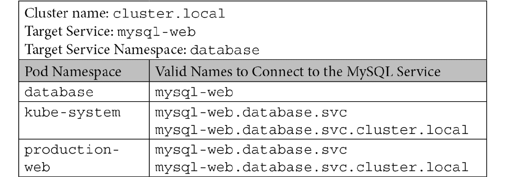
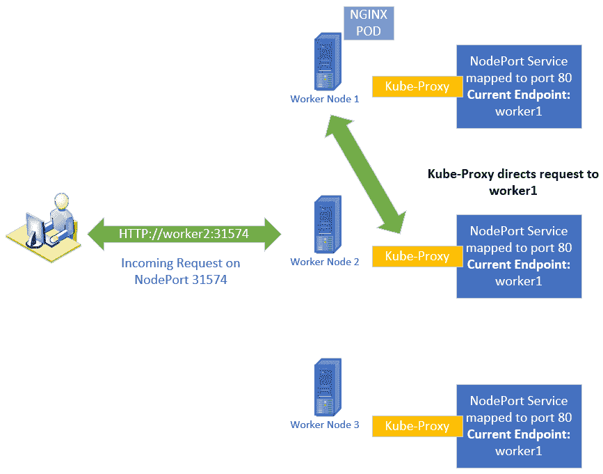
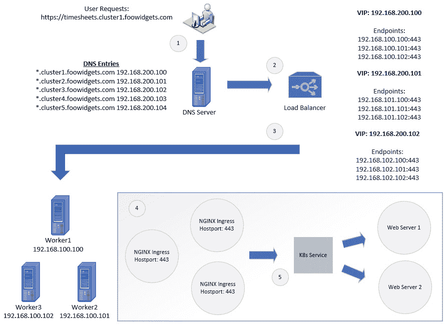
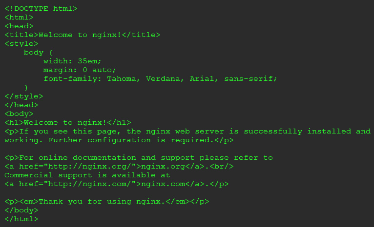
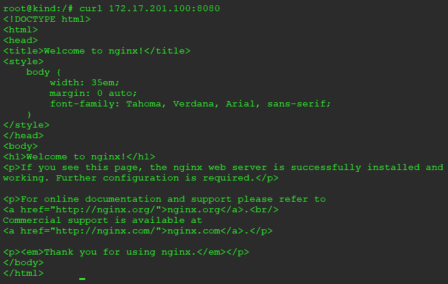
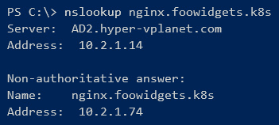

# *第六章*：服务、负载均衡和外部 DNS

当您将应用程序部署到 Kubernetes 集群时，您的 pod 将被分配临时 IP 地址。由于分配的地址可能会随着 pod 的重新启动而更改，您不应该使用 pod IP 地址来定位服务；相反，您应该使用一个服务对象，它将基于标签将服务 IP 地址映射到后端 pod。如果您需要向外部请求提供服务访问，您可以部署一个 Ingress 控制器，它将根据每个 URL 公开您的服务以接受外部流量。对于更高级的工作负载，您可以部署一个负载均衡器，它将为您的服务提供外部 IP 地址，从而允许您将任何基于 IP 的服务暴露给外部请求。

我们将解释如何通过在我们的 KinD 集群上部署它们来实现这些功能。为了帮助我们理解 Ingress 的工作原理，我们将在集群中部署一个 NGINX Ingress 控制器并公开一个 Web 服务器。由于 Ingress 规则是基于传入的 URL 名称的，我们需要能够提供稳定的 DNS 名称。在企业环境中，这将通过使用标准 DNS 来实现。由于我们使用的是没有 DNS 服务器的开发环境，我们将使用 nip.io 的流行服务。

在本章结束时，我们将解释如何使用 Kubernetes 孵化器项目 external-dns 动态注册服务名称，使用 ETCD 集成的 DNS 区域。

在本章中，我们将涵盖以下主题：

+   将工作负载暴露给请求

+   负载均衡器简介

+   第 7 层负载均衡器

+   第 4 层负载均衡器

+   使服务名称在外部可用

# 技术要求

本章具有以下技术要求：

+   一个新的 Ubuntu 18.04 服务器，至少有 4GB 的 RAM。

+   使用*第四章*中的配置部署 KinD 的集群。

您可以在 GitHub 存储库[`github.com/PacktPublishing/Kubernetes-and-Docker-The-Complete-Guide`](https://github.com/PacktPublishing/Kubernetes-and-Docker-The-Complete-Guide)中访问本章的代码。

# 将工作负载暴露给请求

在 Kubernetes 中最被误解的三个对象是服务、Ingress 控制器和负载均衡器。为了暴露您的工作负载，您需要了解每个对象的工作原理以及可用的选项。让我们详细看看这些。

## 了解服务的工作原理

正如我们在介绍中提到的，任何运行工作负载的 pod 在启动时都被分配一个 IP 地址。许多事件会导致部署重新启动一个 pod，当 pod 重新启动时，它可能会收到一个新的 IP 地址。由于分配给 pod 的地址可能会改变，您不应直接针对 pod 的工作负载。

Kubernetes 提供的最强大的功能之一是能够扩展您的部署。当部署被扩展时，Kubernetes 将创建额外的 pod 来处理任何额外的资源需求。每个 pod 都将有一个 IP 地址，正如您可能知道的，大多数应用程序只针对单个 IP 地址或名称。如果您的应用程序从一个 pod 扩展到十个 pod，您将如何利用额外的 pod？

服务使用 Kubernetes 标签来创建服务本身与运行工作负载的 pod 之间的动态映射。在启动时，运行工作负载的 pod 被标记。每个 pod 都具有与部署中定义的相同的标签。例如，如果我们在部署中使用 NGINX web 服务器，我们将创建一个具有以下清单的部署：

api 版本：apps/v1

类型：部署

元数据：

创建时间戳：null

标签：

run: nginx-frontend

名称：nginx-frontend

规范：

副本：3

选择器：

匹配标签：

run: nginx-frontend

策略：{}

模板：

元数据：

标签：

run: nginx-frontend

规范：

容器：

- 镜像：bitnami/nginx

名称：nginx-frontend

此部署将创建三个 NGINX 服务器，每个 pod 将被标记为**run=nginx-frontend**。我们可以通过使用 kubectl 列出 pod 并添加**--show-labels**选项来验证 pod 是否正确标记，**kubectl get pods --show-labels.**

这将列出每个 pod 和任何相关的标签：

**nginx-frontend-6c4dbf86d4-72cbc           1/1     Running            0          19s    pod-template-hash=6c4dbf86d4,run=nginx-frontend**

**nginx-frontend-6c4dbf86d4-8zlwc           1/1     Running            0          19s    pod-template-hash=6c4dbf86d4,run=nginx-frontend**

**nginx-frontend-6c4dbf86d4-xfz6m           1/1     Running            0          19s    pod-template-hash=6c4dbf86d4,run=nginx-frontend**

从上面的输出中可以看到，每个 pod 都有一个标签**run=nginx-frontend**。在为应用程序创建服务时，您将使用此标签，配置服务以使用标签创建端点。

### 创建服务

现在您知道服务将如何使用标签来创建端点，让我们讨论一下 Kubernetes 中我们拥有的服务选项。

本节将介绍每种服务类型，并向您展示如何创建服务对象。每种类型将在一般介绍之后的各自部分中详细介绍。

Kubernetes 服务可以使用四种类型之一创建：

表 6.1：Kubernetes 服务类型

要创建一个服务，您需要创建一个包括**类型**、**选择器**、**类型**和将用于连接到服务的任何**端口**的服务对象。对于我们的 NGINX 部署，我们希望在端口 80 和 443 上公开服务。我们使用**run=nginx-frontend**标记了部署，因此在创建清单时，我们将使用该名称作为我们的选择器：

api 版本：v1

类型：服务

元数据：

标签：

运行：nginx-frontend

名称：nginx-frontend

规范：

选择器：

运行：nginx-frontend

端口：

- 名称：http

端口：80

协议：TCP

目标端口：80

- 名称：https

端口：443

协议：TCP

目标端口：443

类型：ClusterIP

如果服务清单中未定义类型，Kubernetes 将分配默认类型**ClusterIP**。

现在已经创建了一个服务，我们可以使用一些**kubectl**命令来验证它是否被正确定义。我们将执行的第一个检查是验证服务对象是否已创建。要检查我们的服务，我们使用**kubectl get services**命令：

名称                   类型          集群 IP      外部 IP      端口                          年龄 nginx-frontend   ClusterIP   10.43.142.96  <none>            80/TCP,443/TCP   3m49s

在验证服务已创建后，我们可以验证端点是否已创建。使用 kubectl，我们可以通过执行**kubectl get ep <service name>**来验证端点：

名称                  端点                                                                                            年龄

nginx-frontend   10.42.129.9:80,10.42.170.91:80,10.42.183.124:80 + 3 more...   7m49s

我们可以看到服务显示了三个端点，但在端点列表中还显示了**+3 more**。由于输出被截断，get 的输出是有限的，无法显示所有端点。由于我们无法看到整个列表，如果我们描述端点，我们可以获得更详细的列表。使用 kubectl，您可以执行**kubectl describe ep <service name>**命令：

名称：nginx-frontend

命名空间：默认

标签: run=nginx-frontend

注释: endpoints.kubernetes.io/last-change-trigger-time: 2020-04-06T14:26:08Z

子集:

地址: 10.42.129.9,10.42.170.91,10.42.183.124

NotReadyAddresses: <none>

端口:

名称 端口 协议

---- ---- --------

http 80 TCP

https 443 TCP

事件: <none>

如果您比较我们的**get**和**describe**命令的输出，可能会发现端点不匹配。**get**命令显示了总共六个端点：它显示了三个 IP 端点，并且因为它被截断了，它还列出了**+3**，总共六个端点。**describe**命令的输出只显示了三个 IP 地址，而不是六个。为什么这两个输出似乎显示了不同的结果？

**get**命令将在地址列表中列出每个端点和端口。由于我们的服务被定义为公开两个端口，每个地址将有两个条目，一个用于每个公开的端口。地址列表将始终包含服务的每个套接字，这可能会多次列出端点地址，每个套接字一次。

**describe**命令以不同的方式处理输出，将地址列在一行上，下面列出所有端口。乍一看，**describe**命令可能看起来缺少三个地址，但由于它将输出分成多个部分，它只会列出地址一次。所有端口都在地址列表下面分开列出；在我们的示例中，它显示端口 80 和 443。

这两个命令显示相同的数据，但以不同的格式呈现。

现在服务已经暴露给集群，您可以使用分配的服务 IP 地址来连接应用程序。虽然这样可以工作，但是如果服务对象被删除并重新创建，地址可能会更改。您应该使用在创建服务时分配给服务的 DNS，而不是针对 IP 地址。在下一节中，我们将解释如何使用内部 DNS 名称来解析服务。

### 使用 DNS 解析服务

在物理机和虚拟服务器的世界中，您可能已经针对 DNS 记录以与服务器通信。如果服务器的 IP 地址更改了，那么假设您启用了动态 DNS，它对应用程序不会产生任何影响。这就是使用名称而不是 IP 地址作为端点的优势。

当您创建一个服务时，将创建一个内部 DNS 记录，其他工作负载可以查询该记录。如果所有 pod 都在同一个命名空间中，那么我们可以使用简单的短名称如**mysql-web**来定位服务；但是，您可能有一些服务将被多个命名空间使用，当工作负载需要与自己命名空间之外的服务通信时，必须使用完整的名称来定位服务。以下是一个示例表格，显示了如何从命名空间中定位服务：

表 6.2：内部 DNS 示例

从前面的表格中可以看出，您可以使用标准命名约定*.<namespace>.svc.<cluster name>*来定位另一个命名空间中的服务。在大多数情况下，当您访问不同命名空间中的服务时，您不需要添加集群名称，因为它应该会自动添加。

为了加强对一般服务概念的理解，让我们深入了解每种类型的细节以及如何使用它们来访问我们的工作负载。

## 理解不同的服务类型

创建服务时，您需要指定服务类型。分配的服务类型将配置服务如何向集群或外部流量暴露。

### ClusterIP 服务

最常用且被误解的服务类型是 ClusterIP。如果您回顾一下我们的表格，您会看到 ClusterIP 类型的描述指出该服务允许从集群内部连接到该服务。ClusterIP 类型不允许任何外部流量进入暴露的服务。

将服务仅暴露给内部集群工作负载的概念可能会让人感到困惑。为什么要暴露一个只能被集群中的工作负载使用的服务呢？

暂时忘记外部流量。我们需要集中精力关注当前的部署以及每个组件如何相互交互来创建我们的应用程序。以 NGINX 示例为例，我们将扩展部署以包括为 Web 服务器提供服务的后端数据库。

我们的应用程序将有两个部署，一个用于 NGINX 服务器，一个用于数据库服务器。 NGINX 部署将创建五个副本，而数据库服务器将由单个副本组成。 NGINX 服务器需要连接到数据库服务器，以获取网页数据。

到目前为止，这是一个简单的应用程序：我们已经创建了部署，为 NGINX 服务器创建了一个名为 web frontend 的服务，以及一个名为**mysql-web**的数据库服务。为了从 Web 服务器配置数据库连接，我们决定使用一个 ConfigMap，该 ConfigMap 将针对数据库服务。我们在 ConfigMap 中使用什么作为数据库的目的地？

您可能会认为，由于我们只使用单个数据库服务器，我们可以简单地使用 IP 地址。虽然这一开始可能有效，但是对 Pod 的任何重启都会更改地址，Web 服务器将无法连接到数据库。即使只针对单个 Pod，也应始终使用服务。由于数据库部署称为 mysql-web，我们的 ConfigMap 应该使用该名称作为数据库服务器。

通过使用服务名称，当 Pod 重新启动时，我们不会遇到问题，因为服务针对的是标签而不是 IP 地址。我们的 Web 服务器将简单地查询 Kubernetes DNS 服务器以获取服务名称，其中将包含具有匹配标签的任何 Pod 的端点。

### NodePort 服务

NodePort 服务将在集群内部和网络外部公开您的服务。乍一看，这可能看起来像是要公开服务的首选服务。它会向所有人公开您的服务，但它是通过使用称为 NodePort 的东西来实现的，对于外部服务访问，这可能变得难以维护。对于用户来说，使用 NodePort 或记住何时需要通过网络访问服务也非常令人困惑。

要创建使用 NodePort 类型的服务，您只需在清单中将类型设置为 NodePort。我们可以使用之前用于从 ClusterIP 示例中公开 NGINX 部署的相同清单，只需将**类型**更改为**NodePort**：

api 版本：v1

种类：服务

元数据：

标签：

运行：nginx-frontend

名称：nginx-frontend

规范：

选择器：

运行：nginx-frontend

端口：

- 名称：http

端口：80

协议：TCP

目标端口：80

- 名称：https

端口：443

协议：TCP

目标端口：443

类型：NodePort

我们可以以与 ClusterIP 服务相同的方式查看端点，使用 kubectl。运行**kubectl get services**将显示新创建的服务：

名称 类型 CLUSTER-IP 外部 IP 端口 年龄

nginx-frontend NodePort 10.43.164.118 <none> 80:31574/TCP,443:32432/TCP 4s

输出显示类型为 NodePort，并且我们已公开了服务 IP 地址和端口。如果您查看端口，您会注意到，与 ClusterIP 服务不同，NodePort 服务显示两个端口而不是一个。第一个端口是内部集群服务可以定位的公开端口，第二个端口号是从集群外部可访问的随机生成的端口。

由于我们为服务公开了 80 端口和 443 端口，我们将分配两个 NodePort。如果有人需要从集群外部定位服务，他们可以定位任何带有提供的端口的工作节点来访问服务：

图 6.1 - 使用 NodePort 的 NGINX 服务

每个节点维护 NodePorts 及其分配的服务列表。由于列表与所有节点共享，您可以使用端口定位任何运行中的节点，Kubernetes 将将其路由到运行中的 pod。

为了可视化流量流向，我们创建了一个图形，显示了对我们的 NGINX pod 的 web 请求：

图 6.2 - NodePort 流量流向概述

在使用 NodePort 公开服务时，有一些问题需要考虑：

+   如果您删除并重新创建服务，则分配的 NodePort 将更改。

+   如果您瞄准的节点处于离线状态或出现问题，您的请求将失败。

+   对于太多服务使用 NodePort 可能会令人困惑。您需要记住每个服务的端口，并记住服务没有与之关联的*外部*名称。这可能会让瞄准集群中的服务的用户感到困惑。

由于这里列出的限制，您应该限制使用 NodePort 服务。

### 负载均衡器服务

许多刚开始使用 Kubernetes 的人会阅读有关服务的信息，并发现 LoadBalancer 类型将为服务分配外部 IP 地址。由于外部 IP 地址可以被网络上的任何计算机直接寻址，这对于服务来说是一个有吸引力的选项，这就是为什么许多人首先尝试使用它的原因。不幸的是，由于许多用户首先使用本地 Kubernetes 集群，他们在尝试创建 LoadBalancer 服务时遇到了麻烦。

LoadBalancer 服务依赖于与 Kubernetes 集成的外部组件，以创建分配给服务的 IP 地址。大多数本地 Kubernetes 安装不包括这种类型的服务。当您尝试在没有支持基础设施的情况下使用 LoadBalancer 服务时，您会发现您的服务在**EXTERNAL-IP**状态列中显示**<pending>**。

我们将在本章后面解释 LoadBalancer 服务以及如何实现它。

### ExternalName 服务

ExternalName 服务是一种具有特定用例的独特服务类型。当您查询使用 ExternalName 类型的服务时，最终端点不是运行在集群中的 pod，而是外部 DNS 名称。

为了使用您可能在 Kubernetes 之外熟悉的示例，这类似于使用**c-name**来别名主机记录。当您在 DNS 中查询**c-name**记录时，它会解析为主机记录，而不是 IP 地址。

在使用此服务类型之前，您需要了解它可能对您的应用程序造成的潜在问题。如果目标端点使用 SSL 证书，您可能会遇到问题。由于您查询的主机名可能与目标服务器证书上的名称不同，您的连接可能无法成功，因为名称不匹配。如果您发现自己处于这种情况，您可能可以使用在证书中添加**主题替代名称**（**SAN**）的证书。向证书添加替代名称允许您将多个名称与证书关联起来。

为了解释为什么您可能希望使用 ExternalName 服务，让我们使用以下示例：

基于要求，使用 ExternalName 服务是完美的解决方案。那么，我们如何实现这些要求呢？（这是一个理论练习；您不需要在您的 KinD 集群上执行任何操作）

1.  第一步是创建一个清单，将为数据库服务器创建 ExternalName 服务：

api 版本：v1

种类：服务

元数据：

名称：sql-db

命名空间：财务

规范：

类型：ExternalName

externalName: sqlserver1.foowidgets.com

1.  创建了服务之后，下一步是配置应用程序以使用我们新服务的名称。由于服务和应用程序在同一个命名空间中，您可以配置应用程序以定位名称**sql-db**。

1.  现在，当应用程序查询**sql-db**时，它将解析为**sqlserver1.foowidgets.com**，最终解析为 IP 地址 192.168.10.200。

这实现了最初的要求，即仅使用 Kubernetes DNS 服务器将应用程序连接到外部数据库服务器。

也许你会想知道为什么我们不直接配置应用程序使用数据库服务器名称。关键在于第二个要求，即在将 SQL 服务器迁移到容器时限制任何重新配置。

由于在将 SQL 服务器迁移到集群后无法重新配置应用程序，因此我们将无法更改应用程序设置中 SQL 服务器的名称。如果我们配置应用程序使用原始名称**sqlserver1.foowidgets.com**，则迁移后应用程序将无法工作。通过使用 ExternalName 服务，我们可以通过将 ExternalHost 服务名称替换为指向 SQL 服务器的标准 Kubernetes 服务来更改内部 DNS 服务名称。

要实现第二个目标，请按照以下步骤进行：

1.  删除**ExternalName**服务。

1.  使用名称**ext-sql-db**创建一个新的服务，该服务使用**app=sql-app**作为选择器。清单看起来像这样：

api 版本：v1

类型：服务

元数据：

标签：

app: sql-db

名称：sql-db

命名空间：财务

端口：

- 端口：1433

协议：TCP

目标端口：1433

名称：sql

选择器：

应用程序：sql-app

类型：ClusterIP

由于我们为新服务使用相同的服务名称，因此无需对应用程序进行任何更改。该应用程序仍将以**sql-db**为目标名称，现在将使用集群中部署的 SQL 服务器。

现在您已经了解了服务，我们可以继续讨论负载均衡器，这将允许您使用标准 URL 名称和端口外部公开服务。

# 负载均衡器简介

在讨论不同类型的负载均衡器之前，重要的是要了解**开放式系统互联**（**OSI**）模型。了解 OSI 模型的不同层将帮助您了解不同解决方案如何处理传入请求。

## 了解 OSI 模型

当您听到有关在 Kubernetes 中暴露应用程序的不同解决方案时，您经常会听到对第 7 层或第 4 层负载均衡的引用。这些指示是指它们在 OSI 模型中的操作位置。每一层提供不同的功能；在第 7 层运行的组件提供的功能与第 4 层的组件不同。

首先，让我们简要概述一下七层，并对每一层进行描述。在本章中，我们对两个突出显示的部分感兴趣，**第 4 层和第 7 层**：

表 6.3 OSI 模型层

您不需要成为 OSI 层的专家，但您应该了解第 4 层和第 7 层负载均衡器提供的功能以及如何在集群中使用每一层。

让我们深入了解第 4 层和第 7 层的细节：

+   **第 4 层**：正如图表中的描述所述，第 4 层负责设备之间的通信流量。在第 4 层运行的设备可以访问 TCP/UPD 信息。基于第 4 层的负载均衡器为您的应用程序提供了为任何 TCP/UDP 端口服务传入请求的能力。

+   **第 7 层**：第 7 层负责为应用程序提供网络服务。当我们说应用程序流量时，我们指的不是诸如 Excel 或 Word 之类的应用程序；而是指支持应用程序的协议，如 HTTP 和 HTTPS。

在下一节中，我们将解释每种负载均衡器类型以及如何在 Kubernetes 集群中使用它们来暴露您的服务。

# 第 7 层负载均衡器

Kubernetes 以 Ingress 控制器的形式提供第 7 层负载均衡器。有许多解决方案可以为您的集群提供 Ingress，包括以下内容：

+   NGINX

+   Envoy

+   Traefik

+   Haproxy

通常，第 7 层负载均衡器在其可执行的功能方面受到限制。在 Kubernetes 世界中，它们被实现为 Ingress 控制器，可以将传入的 HTTP/HTTPS 请求路由到您暴露的服务。我们将在*创建 Ingress 规则*部分详细介绍如何实现 NGINX 作为 Kubernetes Ingress 控制器。

## 名称解析和第 7 层负载均衡器

要处理 Kubernetes 集群中的第 7 层流量，您需要部署一个 Ingress 控制器。Ingress 控制器依赖于传入的名称来将流量路由到正确的服务。在传统的服务器部署模型中，您需要创建一个 DNS 条目并将其映射到一个 IP 地址。

部署在 Kubernetes 集群上的应用程序与此无异-用户将使用 DNS 名称访问应用程序。

通常，您将创建一个新的通配符域，将其定位到 Ingress 控制器，通过外部负载均衡器，如 F5、HAproxy 或 SeeSaw。

假设我们的公司叫 FooWidgets，我们有三个 Kubernetes 集群，由多个 Ingress 控制器端点作为前端的外部负载均衡器。我们的 DNS 服务器将为每个集群添加条目，使用通配符域指向负载均衡器的虚拟 IP 地址：

表 6.4 Ingress 的通配符域名示例

以下图表显示了请求的整个流程：

图 6.3 - 多名称 Ingress 流量

图 6.3 中的每个步骤在这里详细说明：

1.  使用浏览器，用户请求 URL [`timesheets.cluster1.foowidgets.com`](https://timesheets.cluster1.foowidgets.com)。

1.  DNS 查询被发送到 DNS 服务器。DNS 服务器查找**cluster1.foowidgets.com**的区域详细信息。DNS 区域中有一个单一条目解析为该域的负载均衡器分配的 VIP。

1.  **cluster1.foowidgets.com**的负载均衡器 VIP 分配了三个后端服务器，指向我们部署了 Ingress 控制器的三个工作节点。

1.  使用其中一个端点，请求被发送到 Ingress 控制器。

1.  Ingress 控制器将请求的 URL 与 Ingress 规则列表进行比较。当找到匹配的请求时，Ingress 控制器将请求转发到分配给 Ingress 规则的服务。

为了帮助加强 Ingress 的工作原理，创建 Ingress 规则并在集群上查看它们的运行情况将会有所帮助。现在，关键要点是 Ingress 使用请求的 URL 将流量定向到正确的 Kubernetes 服务。

## 使用 nip.io 进行名称解析

大多数个人开发集群，例如我们的 KinD 安装，可能没有足够的访问权限来向 DNS 服务器添加记录。为了测试 Ingress 规则，我们需要将唯一主机名定位到由 Ingress 控制器映射到 Kubernetes 服务的 IP 地址的本地主机文件中，而不需要 DNS 服务器。

例如，如果您部署了四个 Web 服务器，您需要将所有四个名称添加到您的本地主机。这里显示了一个示例：

**192.168.100.100 webserver1.test.local**

**192.168.100.100 webserver2.test.local**

**192.168.100.100 webserver3.test.local**

**192.168.100.100 webserver4.test.local**

这也可以表示为单行而不是多行：

**192.168.100.100 webserver1.test.local webserver2.test.local webserver3.test.local webserver4.test.local**

如果您使用多台机器来测试您的部署，您将需要编辑每台机器上的 host 文件。在多台机器上维护多个文件是一场管理噩梦，并将导致问题，使测试变得具有挑战性。

幸运的是，有免费的服务可用，提供了 DNS 服务，我们可以在 KinD 集群中使用，而无需配置复杂的 DNS 基础设施。

Nip.io 是我们将用于 KinD 集群名称解析需求的服务。使用我们之前的 Web 服务器示例，我们将不需要创建任何 DNS 记录。我们仍然需要将不同服务器的流量发送到运行在 192.168.100.100 上的 NGINX 服务器，以便 Ingress 可以将流量路由到适当的服务。Nip.io 使用包含 IP 地址在主机名中的命名格式来将名称解析为 IP。例如，假设我们有四台我们想要测试的 Web 服务器，分别为 webserver1、webserver2、webserver3 和 webserver4，Ingress 控制器运行在 192.168.100.100 上。

正如我们之前提到的，我们不需要创建任何记录来完成这个任务。相反，我们可以使用命名约定让 nip.io 为我们解析名称。每台 Web 服务器都将使用以下命名标准的名称：

**<desired name>.<INGRESS IP>.nip.io**

所有四台 Web 服务器的名称列在下表中：

表 6.5–Nip.io 示例域名

当您使用任何上述名称时，nip.io 将把它们解析为 192.168.100.100。您可以在以下截图中看到每个名称的 ping 示例：

图 6.4–使用 nip.io 进行名称解析的示例

这看起来好像没有什么好处，因为您在名称中提供了 IP 地址。如果您知道 IP 地址，为什么还需要使用 nip.io 呢？

请记住，Ingress 规则需要一个唯一的名称来将流量路由到正确的服务。虽然对于您来说可能不需要知道服务器的 IP 地址，但是对于 Ingress 规则来说，名称是必需的。每个名称都是唯一的，使用完整名称的第一部分——在我们的示例中，即**webserver1**、**webserver2**、**webserver3**和**webserver4**。

通过提供这项服务，nip.io 允许您在开发集群中使用任何名称的 Ingress 规则，而无需拥有 DNS 服务器。

现在您知道如何使用 nip.io 来解析集群的名称，让我们解释如何在 Ingress 规则中使用 nip.io 名称。

## 创建 Ingress 规则

记住，Ingress 规则使用名称来将传入的请求路由到正确的服务。以下是传入请求的图形表示，显示了 Ingress 如何路由流量：

图 6.5 – Ingress 流量流向

图 6.5 显示了 Kubernetes 如何处理传入的 Ingress 请求的高级概述。为了更深入地解释每个步骤，让我们更详细地介绍一下五个步骤。使用图 6.5 中提供的图形，我们将详细解释每个编号步骤，以展示 Ingress 如何处理请求：

1.  用户在其浏览器中请求名为 webserver1.192.168.200.20.nio.io 的 URL。DNS 请求被发送到本地 DNS 服务器，最终发送到 nip.io DNS 服务器。

1.  nip.io 服务器将域名解析为 IP 地址 192.168.200.20，并返回给客户端。

1.  客户端将请求发送到运行在 192.168.200.20 上的 Ingress 控制器。请求包含完整的 URL 名称**webserver1.192.168.200.20.nio.io**。

1.  Ingress 控制器在配置的规则中查找请求的 URL 名称，并将 URL 名称与服务匹配。

1.  服务端点将用于将流量路由到分配的 pod。

1.  请求被路由到运行 web 服务器的端点 pod。

使用前面的示例流量流向，让我们来看看需要创建的 Kubernetes 对象：

1.  首先，我们需要在一个命名空间中运行一个简单的 web 服务器。我们将在默认命名空间中简单部署一个基本的 NGINX web 服务器。我们可以使用以下**kubectl run**命令快速创建一个部署，而不是手动创建清单：

**kubectl run nginx-web --image bitnami/nginx**

1.  使用**run**选项是一个快捷方式，它将在默认命名空间中创建一个名为**nginx-web**的部署。您可能会注意到输出会给出一个警告，即 run 正在被弃用。这只是一个警告；它仍然会创建我们的部署，尽管在将来的 Kubernetes 版本中使用**run**创建部署可能不起作用。

1.  接下来，我们需要为部署创建一个服务。同样，我们将使用 kubectl 命令**kubectl expose**创建一个服务。Bitnami NGINX 镜像在端口 8080 上运行，因此我们将使用相同的端口来暴露服务：

**kubectl expose deployment nginx-web --port 8080 --target-port 8080**

这将为我们的部署创建一个名为 nginx-web 的新服务，名为 nginx-web。

1.  现在我们已经创建了部署和服务，最后一步是创建 Ingress 规则。要创建 Ingress 规则，您需要使用对象类型**Ingress**创建一个清单。以下是一个假设 Ingress 控制器正在运行在 192.168.200.20 上的示例 Ingress 规则。如果您在您的主机上创建此规则，您应该使用**您的 Docker 主机的 IP 地址**。

创建一个名为**nginx-ingress.yaml**的文件，其中包含以下内容：

apiVersion: networking.k8s.io/v1beta1

kind: Ingress

metadata:

name: nginx-web-ingress

spec:

规则：

- host: webserver1.192.168.200.20.nip.io

http:

paths:

- path: /

后端：

serviceName: nginx-web

servicePort: 8080

1.  使用**kubectl apply**创建 Ingress 规则：

**kubectl apply -f nginx-ingress.yaml**

1.  您可以通过浏览到 Ingress URL **http:// webserver1.192.168.200.20.nip.io** 来从内部网络上的任何客户端测试部署。

1.  如果一切创建成功，您应该看到 NGINX 欢迎页面：

图 6.6 - 使用 nip.io 创建 Ingress 的 NGINX web 服务器

使用本节中的信息，您可以使用不同的主机名为多个容器创建 Ingress 规则。当然，您并不局限于使用像 nip.io 这样的服务来解析名称；您可以使用您在环境中可用的任何名称解析方法。在生产集群中，您将拥有企业 DNS 基础设施，但在实验环境中，比如我们的 KinD 集群，nip.io 是测试需要适当命名约定的场景的完美工具。

我们将在整本书中使用 nip.io 命名标准，因此在继续下一章之前了解命名约定非常重要。

许多标准工作负载使用第 7 层负载均衡器，例如 NGINX Ingress，比如 Web 服务器。将有一些部署需要更复杂的负载均衡器，这种负载均衡器在 OIS 模型的较低层运行。随着我们向模型下移，我们获得了更低级别的功能。在下一节中，我们将讨论第 4 层负载均衡器。

注意

如果您在集群上部署了 NGINX 示例，应删除服务和 Ingress 规则：

• 要删除 Ingress 规则，请执行以下操作：**kubectl delete ingress nginx-web-ingress**

• 要删除服务，请执行以下操作：**kubectl delete service nginx-web**

您可以让 NGINX 部署在下一节继续运行。

# 第 4 层负载均衡器

OSI 模型的第 4 层负责 TCP 和 UDP 等协议。在第 4 层运行的负载均衡器根据唯一的 IP 地址和端口接受传入的流量。负载均衡器接受传入请求，并根据一组规则将流量发送到目标 IP 地址和端口。

在这个过程中有一些较低级别的网络操作超出了本书的范围。HAproxy 在他们的网站上有术语和示例配置的很好总结，网址为[`www.haproxy.com/fr/blog/loadbalancing-faq/`](https://www.haproxy.com/fr/blog/loadbalancing-faq/)。

## 第 4 层负载均衡器选项

如果您想为 Kubernetes 集群配置第 4 层负载均衡器，可以选择多种选项。其中一些选项包括以下内容：

+   HAproxy

+   NGINX Pro

+   秋千

+   F5 网络

+   MetalLB

+   等等...

每个选项都提供第 4 层负载均衡，但出于本书的目的，我们认为 MetalLB 是最好的选择。

## 使用 MetalLB 作为第 4 层负载均衡器

重要提示

请记住，在*第四章* *使用 KinD 部署 Kubernetes*中，我们有一个图表显示了工作站和 KinD 节点之间的流量流向。因为 KinD 在嵌套的 Docker 容器中运行，所以在涉及网络连接时，第 4 层负载均衡器会有一定的限制。如果没有在 Docker 主机上进行额外的网络配置，您将无法将 LoadBalancer 类型的服务定位到 Docker 主机之外。

如果您将 MetalLB 部署到运行在主机上的标准 Kubernetes 集群中，您将不受限于访问主机外的服务。

MetalLB 是一个免费、易于配置的第 4 层负载均衡器。它包括强大的配置选项，使其能够在开发实验室或企业集群中运行。由于它如此多才多艺，它已成为需要第 4 层负载均衡的集群的非常受欢迎的选择。

在本节中，我们将专注于在第 2 层模式下安装 MetalLB。这是一个简单的安装，适用于开发或小型 Kubernetes 集群。MetalLB 还提供了使用 BGP 模式部署的选项，该选项允许您建立对等伙伴以交换网络路由。如果您想阅读 MetalLB 的 BGP 模式，请访问 MetalLB 网站 [`metallb.universe.tf/concepts/bgp/`](https://metallb.universe.tf/concepts/bgp/)。

### 安装 MetalLB

要在您的 KinD 集群上部署 MetalLB，请使用 MetalLB 的 GitHub 存储库中的清单。要安装 MetalLB，请按照以下步骤进行：

1.  以下将创建一个名为**metallb-system**的新命名空间，并带有**app: metallb**的标签：

**kubectl apply -f https://raw.githubusercontent.com/metallb/metallb/v0.9.3/manifests/namespace.yaml**

1.  这将在您的集群中部署 MetalLB。它将创建所有必需的 Kubernetes 对象，包括**PodSecurityPolicies**，**ClusterRoles**，**Bindings**，**DaemonSet**和一个**deployment**：

**kubectl apply -f https://raw.githubusercontent.com/metallb/metallb/v0.9.3/manifests/metallb.yaml**

1.  最后一个命令将在**metalb-system**命名空间中创建一个具有随机生成值的秘密。MetalLB 使用此秘密来加密发言者之间的通信：

**kubectl create secret generic -n metallb-system memberlist --from-literal=secretkey="$(openssl rand -base64 128)"**

现在 MetalLB 已部署到集群中，您需要提供一个配置文件来完成设置。

### 理解 MetalLB 的配置文件

MetalLB 使用包含配置的 ConfigMap 进行配置。由于我们将在第 2 层模式下使用 MetalLB，所需的配置文件相当简单，只需要一个信息：您想为服务创建的 IP 范围。

为了保持配置简单，我们将在 KinD 正在运行的 Docker 子网中使用一个小范围。如果您在标准 Kubernetes 集群上运行 MetalLB，您可以分配任何在您的网络中可路由的范围，但我们在 KinD 集群中受到限制。

要获取 Docker 正在使用的子网，我们可以检查我们正在使用的默认桥接网络：

**docker 网络检查桥接**

在输出中，您将看到分配的子网，类似于以下内容：

**"子网"："172.17.0.0/16"**

这是一个完整的 B 类地址范围。我们知道我们不会使用所有 IP 地址来运行容器，因此我们将在 MetalLB 配置中使用子网中的一个小范围。

让我们创建一个名为**metallb-config.yaml**的新文件，并将以下内容添加到文件中：

apiVersion：v1

种类：ConfigMap

元数据：

命名空间：metallb-system

名称：config

数据：

配置：|

地址池：

- 名称：默认

协议：layer2

地址：

- 172.17.200.100-172.17.200.125

该清单将在**metallb-system**命名空间中创建一个名为**config**的 ConfigMap。配置文件将设置 MetalLB 的模式为第 2 层，使用名为**default**的 IP 池，为负载均衡器服务使用 172.16.200-100 到 172.16.200.125 的范围。

您可以根据配置名称分配不同的地址。我们将在解释如何创建负载均衡器服务时展示这一点。

最后，使用 kubectl 部署清单：

**kubectl apply -f metallb-config.yaml**

要了解 MetalLB 的工作原理，您需要了解安装的组件以及它们如何相互作用来为服务分配 IP 地址。

### MetalLB 组件

部署中的第二个清单是安装 MetalLB 组件到集群的清单。它部署了一个包含 speaker 镜像的 DaemonSet 和一个包含 controller 镜像的 DaemonSet。这些组件相互通信，以维护服务列表和分配的 IP 地址：

#### 发言者

发言者组件是 MetaLB 用来在节点上宣布负载均衡器服务的组件。它部署为 DaemonSet，因为部署可以在任何工作节点上，因此每个工作节点都需要宣布正在运行的工作负载。当使用负载均衡器类型创建服务时，发言者将宣布该服务。

如果我们从节点查看发言者日志，我们可以看到以下公告：

**{"caller":"main.go:176","event":"startUpdate","msg":"start of service update","service":"my-grafana-operator/grafana-operator-metrics","ts":"2020-04-21T21:10:07.437231123Z"}**

**{"caller":"main.go:189","event":"endUpdate","msg":"end of service update","service":"my-grafana-operator/grafana-operator-metrics","ts":"2020-04-21T21:10:07.437516541Z"}**

**{"caller":"main.go:176","event":"startUpdate","msg":"start of service update","service":"my-grafana-operator/grafana-operator-metrics","ts":"2020-04-21T21:10:07.464140524Z"}**

**{"caller":"main.go:246","event":"serviceAnnounced","ip":"10.2.1.72","msg":"service has IP, announcing","pool":"default","protocol":"layer2","service":"my-grafana-operator/grafana-operator-metrics","ts":"2020-04-21T21:10:07.464311087Z"}**

**{"caller":"main.go:249","event":"endUpdate","msg":"end of service update","service":"my-grafana-operator/grafana-operator-metrics","ts":"2020-04-21T21:10:07.464470317Z"}**

前面的公告是为 Grafana。在公告之后，您可以看到它被分配了 IP 地址 10.2.1.72。

#### 控制器

控制器将从每个工作节点的扬声器接收公告。使用先前显示的相同服务公告，控制器日志显示了公告和控制器为服务分配的 IP 地址：

**{"caller":"main.go:49","event":"startUpdate","msg":"start of service update","service":"my-grafana-operator/grafana-operator-metrics","ts":"2020-04-21T21:10:07.437701161Z"}**

**{"caller":"service.go:98","event":"ipAllocated","ip":"10.2.1.72","msg":"IP address assigned by controller","service":"my-grafana-operator/grafana-operator-metrics","ts":"2020-04-21T21:10:07.438079774Z"}**

**{"caller":"main.go:96","event":"serviceUpdated","msg":"updated service object","service":"my-grafana-operator/grafana-operator-metrics","ts":"2020-04-21T21:10:07.467998702Z"}**

在日志的第二行中，您可以看到控制器分配了 IP 地址 10.2.1.72。

## 创建一个 LoadBalancer 服务

现在您已经安装了 MetalLB 并了解了组件如何创建服务，让我们在我们的 KinD 集群上创建我们的第一个 LoadBalancer 服务。

在第 7 层负载均衡器部分，我们创建了一个运行 NGINX 的部署，并通过创建服务和 Ingress 规则来公开它。在本节的末尾，我们删除了服务和 Ingress 规则，但保留了 NGINX 部署。如果您按照 Ingress 部分的步骤并且尚未删除服务和 Ingress 规则，请在创建 LoadBalancer 服务之前这样做。如果您根本没有创建部署，则需要一个 NGINX 部署来完成本节：

1.  您可以通过执行以下命令快速创建一个 NGINX 部署：

kubectl run nginx-web --image bitnami/nginx

1.  要创建一个将使用 LoadBalancer 类型的新服务，您可以创建一个新的清单，或者只使用 kubectl 公开部署。

要创建一个清单，请创建一个名为**nginx-lb.yaml**的新文件，并添加以下内容：

apiVersion: v1

kind: Service

metadata:

名称：nginx-lb

spec:

端口：

- 端口：8080

targetPort: 8080

selector:

run: nginx-web

type: LoadBalancer

1.  使用 kubectl 将文件应用到集群：

**kubectl apply -f nginx-lb.yaml**

1.  要验证服务是否正确创建，请使用**kubectl get services**列出服务：

图 6.7 - Kubectl 服务输出

您将看到使用 LoadBalancer 类型创建了一个新服务，并且 MetalLB 从我们之前创建的配置池中分配了一个 IP 地址。

快速查看控制器日志将验证 MetalLB 控制器分配了 IP 地址给服务：

**{"caller":"service.go:114","event":"ipAllocated","ip":"172.16.200.100","msg":"IP address assigned by controller","service":"default/nginx-lb","ts":"2020-04-25T23:54:03.668948668Z"}**

1.  现在您可以在 Docker 主机上使用**curl**来测试服务。使用分配给服务的 IP 地址和端口 8080，输入以下命令：

**curl 172.17.200.100:8080**

您将收到以下输出：

图 6.8 - Curl 输出到运行 NGINX 的 LoadBalancer 服务

将 MetalLB 添加到集群中，允许您暴露其他情况下无法使用第 7 层负载均衡器暴露的应用程序。在集群中添加第 7 层和第 4 层服务，允许您暴露几乎任何类型的应用程序，包括数据库。如果您想要为服务提供不同的 IP 池怎么办？在下一节中，我们将解释如何创建多个 IP 池，并使用注释将其分配给服务，从而允许您为服务分配 IP 范围。

## 向 MetalLB 添加多个 IP 池

可能有一些情况下，您需要为集群上的特定工作负载提供不同的子网。一个情况可能是，当您为您的服务在网络上创建一个范围时，您低估了会创建多少服务，导致 IP 地址用尽。

根据您使用的原始范围，您可能只需增加配置中的范围。如果无法扩展现有范围，则需要在创建任何新的 LoadBalancer 服务之前创建一个新范围。您还可以向默认池添加其他 IP 范围，但在本例中，我们将创建一个新池。

我们可以编辑配置文件，并将新的范围信息添加到文件中。使用原始的 YAML 文件**metallb-config.yaml**，我们需要在以下代码中添加粗体文本：

apiVersion：v1

种类：ConfigMap

元数据：

命名空间：metallb-system

名称：配置

数据：

配置：|

地址池：

- 名称：默认

协议：layer2

地址：

- 172.17.200.100-172.17.200.125

- 名称：subnet-201

协议：layer2

地址：

- 172.17.200.100-172.17.200.125

应用使用**kubectl**更新 ConfigMap：

**kubectl apply -f metallb-config.yaml**

更新后的 ConfigMap 将创建一个名为 subnet-201 的新池。MetalLB 现在有两个池，可以用来为服务分配 IP 地址：默认和 subnet-201。

如果用户创建了一个 LoadBalancer 服务，但没有指定池名称，Kubernetes 将尝试使用默认池。如果请求的池中没有地址，服务将处于挂起状态，直到有地址可用。

要从第二个池创建一个新服务，您需要向服务请求添加注释。使用我们的 NGINX 部署，我们将创建一个名为**nginx-web2**的第二个服务，该服务将从 subnet-201 池请求一个 IP 地址：

1.  创建一个名为**nginx-lb2.yaml**的新文件，其中包含以下内容：

apiVersion：v1

种类：服务

元数据：

名称：nginx-lb2

注释：

metallb.universe.tf/address-pool: subnet-201

规范：

端口：

- 端口：8080

目标端口：8080

选择器：

运行：nginx-web

类型：负载均衡器

1.  要创建新服务，请使用 kubectl 部署清单：

**kubectl apply -f nginx-lb2.yaml**

1.  要验证服务是否使用了子网 201 地址池中的 IP 地址创建，请列出所有服务：

**kubectl get services**

您将收到以下输出：

图 6.9 - 使用 LoadBalancer 的示例服务

列表中的最后一个服务是我们新创建的**nginx-lb2**服务。我们可以确认它已被分配了一个外部 IP 地址 172.17.20.100，这是来自子网 201 地址池的。

1.  最后，我们可以通过在 Docker 主机上使用**curl**命令，连接到分配的 IP 地址的 8080 端口来测试服务：

图 6.10 - 在第二个 IP 池上使用 Curl NGINX 的负载均衡器

拥有提供不同地址池的能力，允许您为服务分配已知的 IP 地址块。您可以决定地址池 1 用于 Web 服务，地址池 2 用于数据库，地址池 3 用于文件传输，依此类推。一些组织这样做是为了根据 IP 分配来识别流量，使跟踪通信更容易。

向集群添加第 4 层负载均衡器允许您迁移可能无法处理简单第 7 层流量的应用程序。

随着更多应用程序迁移到容器或进行重构，您将遇到许多需要单个服务的多个协议的应用程序。如果您尝试创建同时具有 TCP 和 UDP 端口映射的服务，您将收到一个错误，即服务对象不支持多个协议。这可能不会影响许多应用程序，但为什么您应该被限制为单个协议的服务呢？

### 使用多个协议

到目前为止，我们的所有示例都使用 TCP 作为协议。当然，MetalLB 也支持使用 UDP 作为服务协议，但如果您有一个需要同时使用两种协议的服务呢？

## 多协议问题

并非所有服务类型都支持为单个服务分配多个协议。以下表格显示了三种服务类型及其对多个协议的支持：

表 6.6 - 服务类型协议支持

如果你尝试创建一个同时使用两种协议的服务，你将会收到一个错误信息。我们已经在下面的错误信息中突出显示了这个错误：

服务"kube-dns-lb"是无效的：spec.ports: 无效的值: []core.ServicePort{core.ServicePort{Name:"dns", Protocol:"UDP", Port:53, TargetPort:intstr.IntOrString{Type:0, IntVal:53, StrVal:""}, NodePort:0}, core.ServicePort{Name:"dns-tcp", Protocol:"TCP", Port:53, TargetPort:intstr.IntOrString{Type:0, IntVal:53, StrVal:""}, NodePort:0}}: **无法创建混合协议的外部负载均衡器**

我们试图创建的服务将使用 LoadBalancer 服务将我们的 CoreDNS 服务暴露给外部 IP。我们需要在端口 50 上同时为 TCP 和 UDP 暴露服务。

MetalLB 包括对绑定到单个 IP 地址的多个协议的支持。这种配置需要创建两个不同的服务，而不是一个单一的服务，这一开始可能看起来有点奇怪。正如我们之前所展示的，API 服务器不允许你创建一个具有多个协议的服务对象。绕过这个限制的唯一方法是创建两个不同的服务：一个分配了 TCP 端口，另一个分配了 UDP 端口。

使用我们的 CoreDNS 例子，我们将逐步介绍创建一个需要多个协议的应用程序的步骤。

## 使用 MetalLB 的多个协议

为了支持一个需要 TCP 和 UDP 的应用程序，你需要创建两个单独的服务。如果你一直在关注服务的创建方式，你可能已经注意到每个服务都会得到一个 IP 地址。逻辑上讲，这意味着当我们为我们的应用程序创建两个服务时，我们将得到两个不同的 IP 地址。

在我们的例子中，我们想要将 CoreDNS 暴露为一个 LoadBalancer 服务，这需要 TCP 和 UDP 协议。如果我们创建了两个标准服务，一个定义了每种协议，我们将会得到两个不同的 IP 地址。你会如何配置一个需要两个不同 IP 地址的 DNS 服务器的连接？

简单的答案是，**你不能**。

但是我们刚告诉你，MetalLB 支持这种类型的配置。跟着我们走——我们首先要解释 MetalLB 将为我们解决的问题。

当我们之前创建了从 subnet-201 IP 池中提取的 NGINX 服务时，是通过向负载均衡器清单添加注释来实现的。 MetalLB 通过为**shared-IPs**添加注释来添加对多个协议的支持。

## 使用共享 IP

现在您了解了 Kubernetes 中多协议支持的限制，让我们使用 MetalLB 来将我们的 CoreDNS 服务暴露给外部请求，同时使用 TCP 和 UDP。

正如我们之前提到的，Kubernetes 不允许您创建具有两种协议的单个服务。要使单个负载均衡 IP 使用两种协议，您需要为两种协议创建一个服务，一个用于 TCP，另一个用于 UDP。每个服务都需要一个 MetalLB 将使用它来为两个服务分配相同 IP 的注释。

对于每个服务，您需要为**metallb.universe.tf/allow-shared-ip**注释设置相同的值。我们将介绍一个完整的示例来公开 CoreDNS 以解释整个过程。

重要说明

大多数 Kubernetes 发行版使用 CoreDNS 作为默认的 DNS 提供程序，但其中一些仍然使用了 kube-dns 作为默认 DNS 提供程序时的服务名称。 KinD 是其中一个可能会让你感到困惑的发行版，因为服务名称是 kube-dns，但请放心，部署正在使用 CoreDNS。

所以，让我们开始：

1.  首先，查看**kube-system**命名空间中的服务：

图 6.11- kube-system 的默认服务列表

我们唯一拥有的服务是默认的**kube-dns**服务，使用 ClusterIP 类型，这意味着它只能在集群内部访问。

您可能已经注意到该服务具有多协议支持，分配了 UDP 和 TCP 端口。请记住，与 LoadBalancer 服务不同，ClusterIP 服务**可以**分配多个协议。

1.  为了为我们的 CoreDNS 服务器添加 LoadBalancer 支持的第一步是创建两个清单，每个协议一个。

我们将首先创建 TCP 服务。创建一个名为**coredns-tcp.yaml**的文件，并添加以下示例清单中的内容。请注意，CoreDNS 的内部服务使用**k8s-app：kube-dns**选择器。由于我们正在公开相同的服务，这就是我们在清单中将使用的选择器：

apiVersion：v1

种类：服务

元数据：

名称：coredns-tcp

命名空间：kube-system

注释：

metallb.universe.tf/allow-shared-ip: "coredns-ext"

规范：

选择器：

k8s-app：kube-dns

端口：

- 名称：dns-tcp

端口：53

协议：TCP

targetPort: 53

类型：负载均衡器

这个文件现在应该很熟悉了，唯一的例外是注释中添加了**metallb.universe.tf/allow-shared-ip**值。当我们为 UDP 服务创建下一个清单时，这个值的用途将变得清晰。

1.  创建一个名为**coredns-udp.yaml**的文件，并添加以下示例清单中的内容。

api 版本：v1

种类：服务

元数据：

名称：coredns-udp

命名空间：kube-system

注释：

metallb.universe.tf/allow-shared-ip: "coredns-ext"

规范：

选择器：

k8s-app：kube-dns

端口：

- 名称：dns-tcp

端口：53

协议：UDP

targetPort: 53

类型：负载均衡器

请注意，我们从 TCP 服务清单中使用了相同的注释值**metallb.universe.tf/allow-shared-ip: "coredns-ext"**。这是 MetalLB 将使用的值，即使请求了两个单独的服务，也会创建一个单一的 IP 地址。

1.  最后，我们可以使用**kubectl apply**将这两个服务部署到集群中：

**kubectl apply -f coredns-tcp.yaml kubectl apply -f coredns-udp.yaml**

1.  一旦部署完成，获取**kube-system**命名空间中的服务，以验证我们的服务是否已部署：

图 6.12 - 使用 MetalLB 分配多个协议

您应该看到已创建了两个新服务：**coredns-tcp**和**coredns-udp**服务。在**EXTERNAL-IP**列下，您可以看到这两个服务都被分配了相同的 IP 地址，这允许服务在同一个 IP 地址上接受两种协议。

将 MetalLB 添加到集群中，使用户能够部署任何可以容器化的应用程序。它使用动态分配 IP 地址的 IP 池，以便立即为外部请求提供服务。

一个问题是 MetalLB 不为服务 IP 提供名称解析。用户更喜欢以易记的名称为目标，而不是在访问服务时使用随机 IP 地址。Kubernetes 不提供为服务创建外部可访问名称的能力，但它有一个孵化器项目来启用此功能。

在下一节中，我们将学习如何使用 CoreDNS 使用一个名为 external-dns 的孵化器项目在 DNS 中创建服务名称条目。

# 使服务名称在外部可用

您可能一直在想为什么我们在测试我们创建的 NGINX 服务时使用 IP 地址，而在 Ingress 测试中使用域名。

虽然 Kubernetes 负载均衡器为服务提供了标准的 IP 地址，但它并不为用户创建外部 DNS 名称以连接到服务。使用 IP 地址连接到集群上运行的应用程序并不是非常有效，手动为 MetalLB 分配的每个 IP 注册 DNS 名称将是一种不可能维护的方法。那么，如何为我们的负载均衡器服务添加名称解析提供更类似云的体验呢？

类似于维护 KinD 的团队，有一个名为**external-dns**的 Kubernetes SIG 正在开发这个功能。主项目页面位于 SIG 的 Github 上[`github.com/kubernetes-sigs/external-dns`](https://github.com/kubernetes-sigs/external-dns)。

在撰写本文时，**external-dns**项目支持一长串兼容的 DNS 服务器，包括以下内容：

+   谷歌的云 DNS

+   亚马逊的 Route 53

+   AzureDNS

+   Cloudflare

+   CoreDNS

+   RFC2136

+   还有更多...

正如您所知，我们的 Kubernetes 集群正在运行 CoreDNS 以提供集群 DNS 名称解析。许多人不知道 CoreDNS 不仅限于提供内部集群 DNS 解析。它还可以提供外部名称解析，解析由 CoreDNS 部署管理的任何 DNS 区域的名称。

## 设置外部 DNS

目前，我们的 CoreDNS 只为内部集群名称解析名称，因此我们需要为我们的新 DNS 条目设置一个区域。由于 FooWidgets 希望所有应用程序都进入**foowidgets.k8s**，我们将使用它作为我们的新区域。

## 集成外部 DNS 和 CoreDNS

向我们的集群提供动态服务注册的最后一步是部署并集成**external-dns**与 CoreDNS。

要配置**external-dns**和 CoreDNS 在集群中工作，我们需要配置每个使用 ETCD 的新 DNS 区域。由于我们的集群正在运行预安装的 ETCD 的 KinD，我们将部署一个专用于**external-dns**区域的新 ETCD pod。

部署新 ETCD 服务的最快方法是使用官方 ETCD 操作员 Helm 图表。使用以下单个命令，我们可以安装操作员和一个三节点的 ETCD 集群。

首先，我们需要安装 Helm 二进制文件。我们可以使用 Helm 团队提供的脚本快速安装 Helm：

curl -fsSL -o get_helm.sh https://raw.githubusercontent.com/helm/helm/master/scripts/get-helm-3

chmod 700 get_helm.sh

./get_helm.sh

现在，使用 Helm，我们可以创建与 CoreDNS 集成的 ETCD 集群。以下命令将部署 ETCD 运算符并创建 ETCD 集群：

helm install etcd-dns --set customResources.createEtcdClusterCRD=true stable/etcd-operator --namespace kube-system

部署运算符和 ETCD 节点需要几分钟的时间。您可以通过查看**kube-system**命名空间中的 pod 的状态来检查状态。安装完成后，您将看到三个 ETCD 运算符 pod 和三个 ETCD 集群 pod：

图 6.13 - ETCD 运算符和节点

部署完成后，查看**kube-system**命名空间中的服务，以获取名为**etcd-cluster-client**的新 ETCD 服务的 IP 地址：

图 6.14 - ETCD 服务 IP

我们将需要分配的 IP 地址来配置**external-dns**和下一节中的 CoreDNS 区文件。

## 向 CoreDNS 添加 ETCD 区域

**external-dns**需要将 CoreDNS 区存储在 ETCD 服务器上。早些时候，我们为 foowidgets 创建了一个新区域，但那只是一个标准区域，需要手动添加新服务的新记录。用户没有时间等待测试他们的部署，并且使用 IP 地址可能会导致代理服务器或内部策略出现问题。为了帮助用户加快其服务的交付和测试，我们需要为他们的服务提供动态名称解析。要为 foowidgets 启用 ETCD 集成区域，请编辑 CoreDNS configmap，并添加以下粗体行。

您可能需要将**端点**更改为在上一页检索到的新 ETCD 服务的 IP 地址：

apiVersion: v1

数据：

Corefile: |

.:53 {

errors

健康 {

lameduck 5s

}

准备

kubernetes cluster.local in-addr.arpa ip6.arpa {

pods insecure

fallthrough in-addr.arpa ip6.arpa

ttl 30

}

prometheus :9153

forward . /etc/resolv.conf

**etcd foowidgets.k8s {**

**stubzones**

**路径/skydns**

**端点 http://10.96.181.53:2379**

**}**

cache 30

循环

重新加载

负载平衡

}

kind: ConfigMap

下一步是将**external-dns**部署到集群中。

我们在 GitHub 存储库的**chapter6**目录中提供了一个清单，该清单将使用您的 ETCD 服务端点修补部署。您可以通过在**chapter6**目录中执行以下命令来使用此清单部署**外部 DNS**。以下命令将查询 ETCD 集群的服务 IP，并使用该 IP 创建一个部署文件作为端点。

然后，新创建的部署将在您的集群中安装**外部 DNS**：

ETCD_URL=$(kubectl -n kube-system get svc etcd-cluster-client -o go-template='{{ .spec.clusterIP }}')

cat external-dns.yaml | sed -E "s/<ETCD_URL>/${ETCD_URL}/" > external-dns-deployment.yaml

kubectl apply -f external-dns-deployment.yaml

要手动将**外部 DNS**部署到您的集群中，请创建一个名为**external-dns-deployment.yaml**的新清单，并在最后一行使用您的 ETCD 服务 IP 地址的以下内容：

apiVersion: rbac.authorization.k8s.io/v1beta1

类型：ClusterRole

元数据：

名称：外部 DNS

规则：

- apiGroups: [""]

资源：["services","endpoints","pods"]

动词：["get","watch","list"]

- apiGroups: ["extensions"]

资源：["ingresses"]

动词：["get","watch","list"]

- apiGroups: [""]

资源：["nodes"]

动词：["list"]

---

apiVersion: rbac.authorization.k8s.io/v1beta1

类型：ClusterRoleBinding

元数据：

名称：外部 DNS 查看器

角色引用：

apiGroup: rbac.authorization.k8s.io

类型：ClusterRole

名称：外部 DNS

主题：

- 类型：ServiceAccount

名称：外部 DNS

命名空间：kube-system

---

apiVersion: v1

类型：ServiceAccount

元数据：

名称：外部 DNS

命名空间：kube-system

---

apiVersion: apps/v1

类型：Deployment

元数据：

名称：外部 DNS

命名空间：kube-system

规范：

策略：

类型：重新创建

选择器：

匹配标签：

应用：外部 DNS

模板：

元数据：

标签：

应用：外部 DNS

规范：

服务账户名称：外部 DNS

容器：

- 名称：外部 DNS

镜像：registry.opensource.zalan.do/teapot/external-dns:latest

参数：

- --source=service

- --provider=coredns

- --log-level=info

环境：

- 名称：ETCD_URLS

值：http://10.96.181.53:2379

请记住，如果您的 ETCD 服务器 IP 地址不是 10.96.181.53，请在部署清单之前更改它。

使用**kubectl apply -f external-dns-deployment.yaml**部署清单。

## 创建具有外部 DNS 集成的负载均衡器服务

您应该仍然拥有本章开头时运行的 NGINX 部署。它有一些与之相关的服务。我们将添加另一个服务，以向您展示如何为部署创建动态注册：

1.  要在 CoreDNS 区域中创建动态条目，您需要在服务清单中添加一个注释。创建一个名为**nginx-dynamic.yaml**的新文件，内容如下：

api 版本：v1

种类：服务

元数据：

**注释：**

**external-dns.alpha.kubernetes.io/hostname: nginx.foowidgets.k8s**

名称：nginx-ext-dns

命名空间：默认

规范：

端口：

- 端口：8080

协议：TCP

目标端口：8080

选择器：

运行：nginx-web

类型：负载均衡器

注意文件中的注释。要指示**external-dns**创建记录，您需要添加一个具有键**external-dns.alpha.kubernetes.io/hostname**的注释，其中包含服务的所需名称 - 在本例中为**nginx.foowidgets.k8s**。

1.  使用**kubectl apply -f nginx-dynamic.yaml**创建服务。

**external-dns**大约需要一分钟来获取 DNS 更改。

1.  要验证记录是否已创建，请使用**kubectl logs -n kube-system -l app=external-dns**检查**external-dns**的 pod 日志。一旦**external-dns**捕获到记录，您将看到类似以下的条目：

**time="2020-04-27T18:14:38Z" level=info msg="Add/set key /skydns/k8s/foowidgets/nginx/03ebf8d8 to Host=172.17.201.101, Text=\"heritage=external-dns,external-dns/owner=default,external-dns/resource=service/default/nginx-lb\", TTL=0"**

1.  确认**external-dns**完全工作的最后一步是测试与应用程序的连接。由于我们使用的是 KinD 集群，我们必须从集群中的一个 pod 进行测试。我们将使用 Netshoot 容器，就像我们在本书中一直在做的那样。

重要提示

在本节的最后，我们将展示将 Windows DNS 服务器与我们的 Kubernetes CoreDNS 服务器集成的步骤。这些步骤旨在让您完全了解如何将企业 DNS 服务器完全集成到我们的 CoreDNS 服务中。

1.  运行 Netshoot 容器：

**kubectl run --generator=run-pod/v1 tmp-shell --rm -i --tty --image nicolaka/netshoot -- /bin/bash**

1.  要确认条目已成功创建，请在 Netshoot shell 中执行**nslookup**以查找主机：

图 6.15 - Nslookup 的新记录

我们可以确认正在使用的 DNS 服务器是 CoreDNS，基于 IP 地址，这是分配给**kube-dns**服务的 IP 地址。（再次强调，服务是**kube-dns**，但是 pod 正在运行 CoreDNS）。

172.17.201.101 地址是分配给新 NGINX 服务的 IP 地址；我们可以通过列出默认命名空间中的服务来确认这一点：

图 6.16 – NGINX 外部 IP 地址

1.  最后，让我们通过使用名称连接到容器来确认连接到 NGINX 是否有效。在 Netshoot 容器中使用**curl**命令，curl 到端口 8080 上的 DNS 名称：

图 6.17 – 使用 external-dns 名称进行 Curl 测试

**curl**输出确认我们可以使用动态创建的服务名称访问 NGINX Web 服务器。

我们意识到其中一些测试并不是非常令人兴奋，因为您可以使用标准浏览器进行测试。在下一节中，我们将把我们集群中运行的 CoreDNS 与 Windows DNS 服务器集成起来。

### 将 CoreDNS 与企业 DNS 集成

本节将向您展示如何将**foowidgets.k8s**区域的名称解析转发到运行在 Kubernetes 集群上的 CoreDNS 服务器。

注意

本节包括了一个示例，演示如何将企业 DNS 服务器与 Kubernetes DNS 服务集成。

由于外部要求和额外的设置，提供的步骤仅供参考，**不应**在您的 KinD 集群上执行。

对于这种情况，主 DNS 服务器运行在 Windows 2016 服务器上。

部署的组件如下：

+   运行 DNS 的 Windows 2016 服务器

+   一个 Kubernetes 集群

+   Bitnami NGINX 部署

+   创建了 LoadBalancer 服务，分配的 IP 为 10.2.1.74

+   CoreDNS 服务配置为使用 hostPort 53

+   部署了附加组件，使用本章的配置，如 external-dns，CoreDNS 的 ETCD 集群，添加了 CoreDNS ETCD 区域，并使用地址池 10.2.1.60-10.2.1.80 的 MetalLB

现在，让我们按照配置步骤来集成我们的 DNS 服务器。

#### 配置主 DNS 服务器

第一步是创建一个有条件的转发器到运行 CoreDNS pod 的节点。

在 Windows DNS 主机上，我们需要为**foowidgets.k8s**创建一个新的有条件的转发器，指向运行 CoreDNS pod 的主机。在我们的示例中，CoreDNS pod 已分配给主机 10.240.100.102：

图 6.18 - Windows 条件转发器设置

这将配置 Windows DNS 服务器，将对**foowidgets.k8s**域中主机的任何请求转发到 CoreDNS pod。

#### 测试 DNS 转发到 CoreDNS

为了测试配置，我们将使用主网络上已配置为使用 Windows DNS 服务器的工作站。

我们将运行的第一个测试是对 MetalLB 注释创建的 NGINX 记录进行**nslookup**：

从命令提示符中，我们执行**nslookup nginx.foowidgets.k8s**：

图 6.19 - 注册名称的 Nslookup 确认

由于查询返回了我们期望的记录的 IP 地址，我们可以确认 Windows DNS 服务器正确地将请求转发到 CoreDNS。

我们可以从笔记本电脑的浏览器进行一次额外的 NGINX 测试：

图 6.20 - 使用 CoreDNS 从外部工作站成功浏览

一个测试确认了转发的工作，但我们不确定系统是否完全正常工作。

为了测试一个新的服务，我们部署了一个名为 microbot 的不同 NGINX 服务器，该服务具有一个注释，分配了名称**microbot.foowidgets.k8s**。MetalLB 已经分配了该服务的 IP 地址为 10.2.1.65。

与之前的测试一样，我们使用 nslookup 测试名称解析：

图 6.21 - 用于额外注册名称的 Nslookup 确认

为了确认 Web 服务器是否正常运行，我们从工作站浏览到 URL：

图 6.22 - 使用 CoreDNS 从外部工作站成功浏览

成功！我们现在已将企业 DNS 服务器与在 Kubernetes 集群上运行的 CoreDNS 服务器集成在一起。这种集成使用户能够通过简单地向服务添加注释来动态注册服务名称。

# 总结

在本章中，您了解了 Kubernetes 中两个重要的对象，这些对象将您的部署暴露给其他集群资源和用户。

我们开始本章时讨论了服务和可以分配的多种类型。三种主要的服务类型是 ClusterIP、NodePort 和 LoadBalancer。选择服务类型将配置应用程序的访问方式。

通常，仅使用服务并不是提供对在集群中运行的应用程序的访问的唯一对象。您通常会使用 ClusterIP 服务以及 Ingress 控制器来提供对使用第 7 层的服务的访问。一些应用程序可能需要额外的通信，第 7 层负载均衡器无法提供这种通信。这些应用程序可能需要第 4 层负载均衡器来向用户公开其服务。在负载均衡部分，我们演示了 MetalLB 的安装和使用，这是一个常用的开源第 7 层负载均衡器。

在最后一节中，我们解释了如何使用条件转发将动态 CoreDNS 区集成到外部企业 DNS 服务器。集成这两个命名系统提供了一种方法，允许在集群中动态注册任何第 4 层负载均衡服务。

现在您知道如何向用户公开集群上的服务，那么我们如何控制谁可以访问集群来创建新服务呢？在下一章中，我们将解释如何将身份验证集成到您的集群中。我们将在我们的 KinD 集群中部署一个 OIDC 提供程序，并与外部 SAML2 实验室服务器连接以获取身份。

# 问题

1.  服务如何知道应该使用哪些 pod 作为服务的端点？

A. 通过服务端口

B. 通过命名空间

C. 由作者

D. 通过选择器标签

1.  哪个 kubectl 命令可以帮助您排除可能无法正常工作的服务？

A. **kubectl get services <service name>**

B. **kubectl get ep <service name>**

C. **kubectl get pods <service name>**

D. **kubectl get servers <service name>**

1.  所有 Kubernetes 发行版都支持使用**LoadBalancer**类型的服务。

A. 真

B. 错误

1.  哪种负载均衡器类型支持所有 TCP/UDP 端口并接受数据包内容？

A. 第 7 层

B. Cisco 层

C. 第 2 层

D. 第 4 层

1.  在没有任何附加组件的情况下，您可以使用以下哪种服务类型来使用多个协议？

A. **NodePort**和**ClusterIP**

B. **LoadBalancer**和**NodePort**

C. **NodePort**、**LoadBalancer**和**ClusterIP**

D. **负载均衡器**和**ClusterIP**
