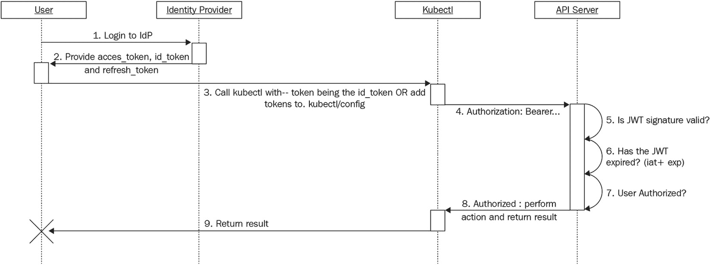
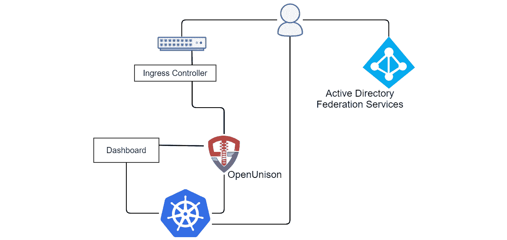
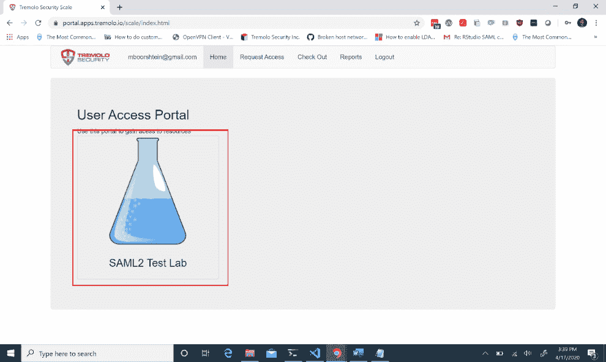
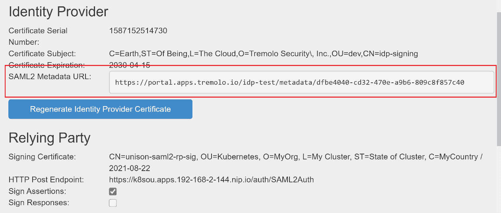
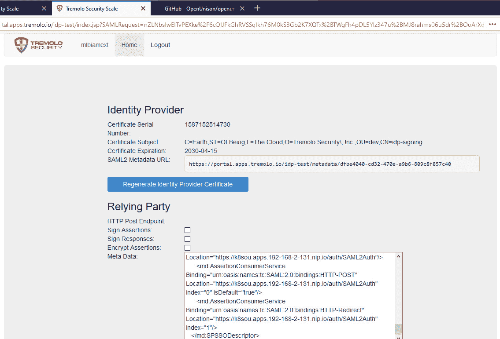
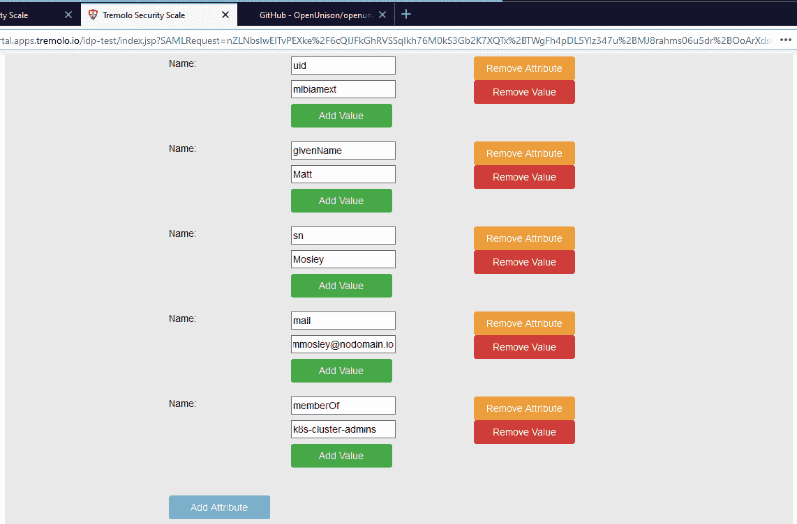
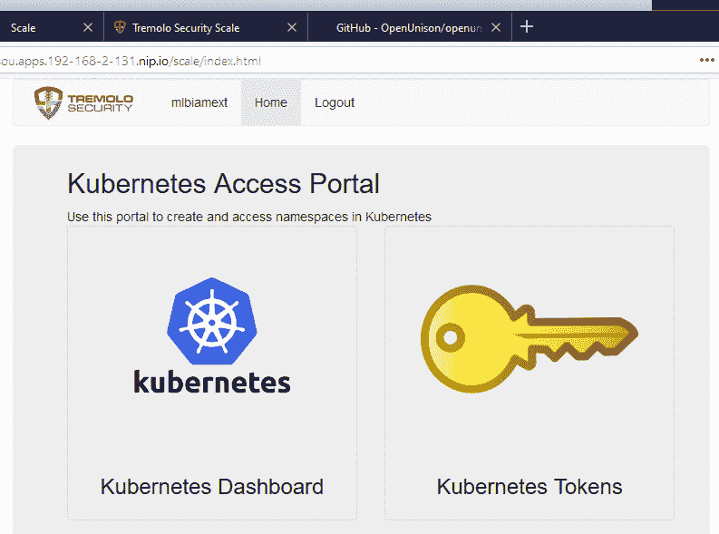
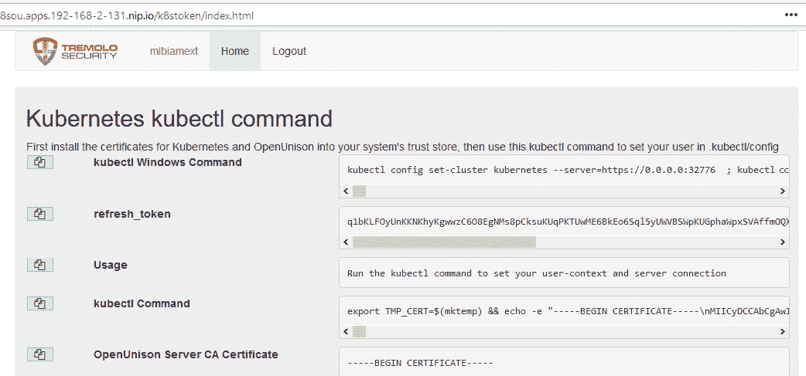
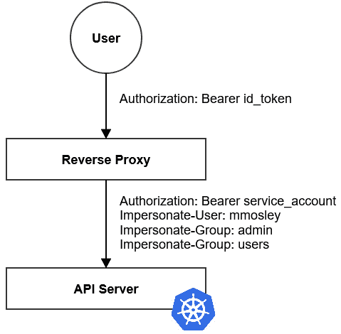
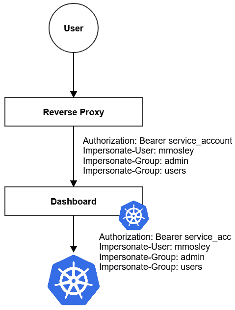

# *第七章*：将身份验证集成到您的集群中

一旦集群建立完成，用户将需要安全地与之交互。对于大多数企业来说，这意味着对个别用户进行身份验证，并确保他们只能访问他们工作所需的内容。在 Kubernetes 中，这可能是具有挑战性的，因为集群是一组 API，而不是具有可以提示进行身份验证的前端的应用程序。

在本章中，您将学习如何使用 OpenID Connect 协议和 Kubernetes 模拟将企业身份验证集成到您的集群中。我们还将涵盖几种反模式，并解释为什么您应该避免使用它们。

在本章中，我们将涵盖以下主题：

+   了解 Kubernetes 如何知道你是谁

+   了解 OpenID Connect

+   其他选项是什么？

+   配置 KinD 以进行 OpenID Connect

+   云 Kubernetes 如何知道你是谁

+   配置您的集群以进行模拟

+   在没有 OpenUnison 的情况下配置模拟

+   让我们开始吧！

# 技术要求

要完成本章的练习，您将需要以下内容：

+   一个拥有 8GB RAM 的 Ubuntu 18.04 服务器

+   使用*第五章*中的配置运行的 KinD 集群，*使用 KinD 部署集群*

您可以在以下 GitHub 存储库中访问本章的代码：[`github.com/PacktPublishing/Kubernetes-and-Docker-The-Complete-Guide/tree/master/chapter7`](https://github.com/PacktPublishing/Kubernetes-and-Docker-The-Complete-Guide/tree/master/chapter7)。

# 了解 Kubernetes 如何知道你是谁

没有勺子

- 《黑客帝国》，1999

在 1999 年的科幻电影《黑客帝国》中，尼奥在等待见奥拉克时与一个孩子谈论矩阵。孩子向他解释，操纵矩阵的诀窍是意识到“没有勺子”。

这是查看 Kubernetes 中的用户的绝佳方式，因为他们并不存在。除了我们稍后将讨论的服务账户之外，在 Kubernetes 中没有称为“用户”或“组”的对象。每个 API 交互必须包含足够的信息，以告诉 API 服务器用户是谁以及用户是哪些组的成员。这种断言可以采用不同的形式，具体取决于您计划如何将身份验证集成到您的集群中。

在本节中，我们将详细介绍 Kubernetes 可以将用户与集群关联的不同方式。

## 外部用户

从集群外部访问 Kubernetes API 的用户通常会使用两种认证方法之一：

+   证书：您可以使用包含有关您的信息的客户端证书来断言您的身份，例如您的用户名和组。该证书用作 TLS 协商过程的一部分。

+   Bearer token：嵌入在每个请求中，Bearer token 可以是一个自包含的令牌，其中包含验证自身所需的所有信息，或者可以由 API 服务器中的 webhook 交换该信息的令牌。

您还可以使用服务账户来访问集群外的 API 服务器，尽管这是强烈不建议的。我们将在“还有哪些选项？”部分讨论使用服务账户的风险和关注点。

## Kubernetes 中的组

不同的用户可以被分配相同的权限，而无需为每个用户单独创建 RoleBinding 对象，通过组来实现。Kubernetes 包括两种类型的组：

+   系统分配的：这些组以 system:前缀开头，并由 API 服务器分配。一个例子是 system:authenticated，它被分配给所有经过认证的用户。系统分配的其他示例包括 system:serviceaccounts:namespace 组，其中 Namespace 是包含命名组中命名的命名空间的名称。

+   用户断言的组：这些组是由认证系统在提供给 API 服务器的令牌中断言的，或者通过认证 webhook 进行断言的。对于这些组的命名没有标准或要求。就像用户一样，组在 API 服务器中并不存在为对象。组是由外部用户在认证时断言的，并且对于系统生成的组在本地进行跟踪。在断言用户的组时，用户唯一 ID 和组之间的主要区别在于唯一 ID 预期是唯一的，而组不是。

您可能被授权访问组，但所有访问仍然基于您的用户唯一 ID 进行跟踪和审计。

## 服务账户

服务账户是存在于 API 服务器中的对象，用于跟踪哪些 pod 可以访问各种 API。服务账户令牌称为 JSON Web Tokens，或 JWTs。根据令牌生成的方式，有两种获取服务账户的方式：

+   第一种是来自 Kubernetes 在创建服务账户时生成的一个密钥。

+   第二种方法是通过**TokenRequest** API，该 API 用于通过挂载点将秘钥注入到 Pod 中，或者从集群外部使用。所有服务账户都是通过在请求中将令牌作为标头注入到 API 服务器中来使用的。API 服务器将其识别为服务账户并在内部进行验证。

与用户不同，服务账户**不能**分配给任意组。服务账户是预先构建的组的成员，但您不能创建特定服务账户的组以分配角色。

现在我们已经探讨了 Kubernetes 如何识别用户的基本原理，我们将探讨这个框架如何适用于**OpenID Connect**（**OIDC**）协议。OIDC 提供了大多数企业需要的安全性，并且符合标准，但 Kubernetes 并不像许多网络应用程序那样使用它。了解这些差异以及 Kubernetes 为何需要它们是将集群整合到企业安全环境中的重要步骤。

# 了解 OpenID Connect

OpenID Connect 是一种标准的身份联合协议。它建立在 OAuth2 规范之上，并具有一些非常强大的功能，使其成为与 Kubernetes 集群交互的首选选择。

OpenID Connect 的主要优势如下：

+   **短期令牌**：如果令牌泄露，比如通过日志消息或违规行为，您希望令牌尽快过期。使用 OIDC，您可以指定令牌的生存时间为 1-2 分钟，这意味着令牌在攻击者尝试使用时很可能已经过期。

+   **用户和组成员资格**：当我们开始讨论授权时，我们很快就会发现按组管理访问权限比直接引用用户进行访问权限管理更为重要。OIDC 令牌可以嵌入用户的标识符和他们的组，从而更容易进行访问管理。

+   刷新令牌受到超时策略的限制：使用短期令牌时，您需要能够根据需要刷新它们。刷新令牌的有效时间可以根据企业的网络应用程序空闲超时策略进行限定，从而使您的集群符合其他基于网络的应用程序的规定。

+   **kubectl**不需要插件：**kubectl**二进制文件原生支持 OpenID Connect，因此不需要任何额外的插件。如果您需要从跳板机或虚拟机访问集群，但无法直接在工作站上安装**命令行界面**（**CLI**）工具，这将非常有用。

+   **更多多因素身份验证选项**：许多最强大的多因素身份验证选项需要使用 Web 浏览器。例如，使用硬件令牌的 FIDO U2F 和 WebAuth。

OIDC 是一个经过同行评审的标准，已经使用了几年，并迅速成为身份联合的首选标准。

重要提示

身份联合是用来描述断言身份数据和认证的术语，而不共享用户的机密密码。身份联合的经典示例是登录到员工网站并能够访问您的福利提供者，而无需再次登录。您的员工网站不会与福利提供者共享您的密码。相反，您的员工网站*断言*您在特定日期和时间登录，并提供一些关于您的信息。这样，您的帐户就可以在两个独立的系统（您的员工网站和福利门户）之间*联合*，而无需让您的福利门户知道您的员工网站密码。

## OpenID Connect 协议

正如您所看到的，OIDC 有多个组件。为了充分理解 OIDC 的工作原理，让我们开始 OpenID 连接协议。

我们将重点关注 OIDC 协议的两个方面：

+   使用**kubectl**和 API 服务器的令牌

+   刷新令牌以保持令牌的最新状态

我们不会过多关注获取令牌。虽然获取令牌的协议遵循标准，但登录过程并不是。根据您选择实现 OIDC**身份提供者**（**IdP**）的方式，从身份提供者获取令牌的方式会有所不同。

OIDC 登录过程生成了三个令牌：

+   **access_token**：此令牌用于向身份提供者提供的 Web 服务进行经过身份验证的请求，例如获取用户信息。它**不**被 Kubernetes 使用，可以丢弃。

+   **id_token**：这是一个 JWT 令牌，包含您的身份信息，包括您的唯一标识（sub）、组和关于您的到期信息，API 服务器可以使用它来授权您的访问。JWT 由您的身份提供者的证书签名，并且可以通过 Kubernetes 简单地检查 JWT 的签名来验证。这是您传递给 Kubernetes 以进行身份验证的令牌。

+   **refresh_token**：**kubectl**知道如何在令牌过期后自动为您刷新**id_token**。为此，它使用**refresh_token**调用您的 IdP 的令牌端点以获取新的**id_token**。**refresh_token**只能使用一次，是不透明的，这意味着作为令牌持有者的您无法看到其格式，对您来说并不重要。它要么有效，要么无效。*refresh_token 永远不会传递到 Kubernetes（或任何其他应用程序）。它只在与 IdP 的通信中使用。*

一旦您获得了您的令牌，您可以使用它们来与 API 服务器进行身份验证。使用您的令牌的最简单方法是将它们添加到**kubectl**配置中，使用命令行参数：

kubectl config set-credentials username --auth-provider=oidc --auth-provider-arg=idp-issuer-url=https://host/uri --auth-provider-arg=client-id=kubernetes --auth-provider-arg=refresh-token=$REFRESH_TOKEN --auth-provider-arg=id-token=$ID_TOKEN

**config set-credentials**有一些需要提供的选项。我们已经解释了**id-token**和**refresh_token**，但还有两个额外的选项：

+   **idp-issuer-url**：这与我们将用于配置 API 服务器的 URL 相同，并指向用于 IdP 发现 URL 的基本 URL。

+   **客户端 ID**：这是由您的 IdP 用于识别您的配置。这是 Kubernetes 部署中的唯一标识，不被视为机密信息。

OpenID Connect 协议有一个可选元素，称为**client_secret**，它在 OIDC 客户端和 IdP 之间共享。它用于在进行任何请求之前“验证”客户端，例如刷新令牌。虽然 Kubernetes 支持它作为一个选项，但建议不使用它，而是配置您的 IdP 使用公共端点（根本不使用密钥）。

客户端密钥没有实际价值，因为您需要与每个潜在用户共享它，并且由于它是一个密码，您企业的合规框架可能要求定期轮换，这会导致支持方面的麻烦。总的来说，它不值得在安全方面承担任何潜在的不利影响。

重要说明

Kubernetes 要求您的身份提供者支持发现 URL 端点，这是一个 URL，提供一些 JSON 告诉您可以在哪里获取用于验证 JWT 的密钥和各种可用的端点。取任何发行者 URL 并添加**/.well-known/openid-configuration**以查看此信息。

## 遵循 OIDC 和 API 的交互

一旦**kubectl**被配置，所有 API 交互将遵循以下顺序：

图 7.1 - Kubernetes/kubectl OpenID Connect 序列图

上述图表来自 Kubernetes 的认证页面，网址为[`kubernetes.io/docs/reference/access-authn-authz/authentication/#openid-connect-tokens`](https://kubernetes.io/docs/reference/access-authn-authz/authentication/#openid-connect-tokens)。认证请求涉及以下操作：

1.  **登录到您的身份提供者（IdP）**：对于每个 IdP 都会有所不同。这可能涉及在 Web 浏览器中向表单提供用户名和密码，多因素令牌或证书。这将针对每个实现具体实现。

1.  **向用户提供令牌**：一旦经过身份验证，用户需要一种方式来生成**kubectl**访问 Kubernetes API 所需的令牌。这可以是一个应用程序，使用户可以轻松地将它们复制并粘贴到配置文件中，或者可以是一个新的可下载文件。

1.  这一步是将**id_token**和**refresh_token**添加到**kubectl**配置中。如果令牌在浏览器中呈现给用户，它们可以手动添加到配置中。如果提供了新的配置以便下载，也可以这样做。还有**kubectl**插件，将启动一个 Web 浏览器来开始认证过程，并在完成后为您生成配置。

1.  **注入 id_token**：一旦调用了**kubectl**命令，每个 API 调用都包括一个额外的标头，称为**Authorization**标头，其中包括**id_token**。

1.  JWT 签名验证：一旦 API 服务器从 API 调用接收到 id_token，它将使用身份提供者提供的公钥验证签名。API 服务器还将验证发行者是否与 API 服务器配置的发行者匹配，以及接收者是否与 API 服务器配置的客户端 ID 匹配。

1.  检查 JWT 的过期时间：令牌只在有限的时间内有效。API 服务器确保令牌尚未过期。

1.  授权检查：现在用户已经通过身份验证，API 服务器将确定由提供的 id_token 标识的用户是否能够执行所请求的操作，方法是将用户的标识符和断言的组与内部策略进行匹配。

1.  执行 API：所有检查都已完成，API 服务器执行请求，生成一个将发送回 kubectl 的响应。

1.  用户的响应格式：一旦 API 调用完成（或一系列 API 调用），JSON 将由 kubectl 为用户格式化。

重要提示

一般来说，身份验证是验证您的过程。当我们在网站上输入用户名和密码时，大多数人都会遇到这种情况。我们在证明我们是谁。在企业世界中，授权随后成为我们是否被允许做某事的决定。首先，我们进行身份验证，然后进行授权。围绕 API 安全构建的标准并不假设身份验证，而是直接基于某种令牌进行授权。不假设调用者必须被识别。例如，当您使用物理钥匙打开门时，门不知道您是谁，只知道您有正确的钥匙。这些术语可能会变得非常令人困惑，所以如果您有点迷茫，不要感到难过。您并不孤单！

id_token 是自包含的；API 服务器需要了解有关您的所有信息都包含在该令牌中。API 服务器使用身份提供者提供的证书验证 id_token，并验证令牌是否已过期。只要一切都符合，API 服务器将根据其自身的 RBAC 配置继续授权您的请求。我们将在稍后介绍该过程的详细信息。最后，假设您已获得授权，API 服务器将提供响应。

请注意，Kubernetes 从不会看到您的密码或任何其他只有您知道的秘密信息。唯一共享的是**id_token**，而且它是短暂的。这导致了几个重要的观点：

+   由于 Kubernetes 从不会看到您的密码或其他凭据，它无法 compromise 它们。这可以节省您与安全团队合作的大量时间，因为所有与保护密码相关的任务都可以跳过！

+   **id_token**是自包含的，这意味着如果它被 compromise，除非重新生成您的身份提供者密钥，否则无法阻止它被滥用。这就是为什么您的**id_token**的寿命如此重要。在 1-2 分钟内，攻击者能够获取**id_token**，意识到它是什么，并滥用它的可能性非常低。

如果在执行其调用时，**kubectl**发现**id_token**已过期，它将尝试通过调用 IdP 的令牌端点使用**refresh_token**来刷新它。如果用户的会话仍然有效，IdP 将生成新的**id_token**和**refresh_token**，**kubectl**将为您存储在 kubectl 配置中。这将自动发生，无需用户干预。此外，**refresh_token**只能使用一次，因此如果有人尝试使用先前使用过的**refresh_token**，您的 IdP 将失败刷新过程。

重要提示

这是不可避免的。有人可能需要立即被锁定。可能是因为他们被走出去了，或者他们的会话已经被 compromise。这取决于您的 IdP，因此在选择 IdP 时，请确保它支持某种形式的会话撤销。

最后，如果**refresh_token**已过期或会话已被撤销，API 服务器将返回**401 Unauthorized**消息，表示它将不再支持该令牌。

我们花了大量时间研究 OIDC 协议。现在，让我们深入了解**id_token**。

### id_token

**id_token**是一个经过 base64 编码和数字签名的 JSON web token。JSON 包含一系列属性，称为 claims，在 OIDC 中。**id_token**中有一些标准的 claims，但大部分时间您最关心的 claims 如下：

+   **iss**：发行者，必须与 kubectl 配置中的发行者一致

+   **aud**：您的客户端 ID

+   **sub**：您的唯一标识符

+   **groups**：不是标准声明，但应填充与您的 Kubernetes 部署相关的组

重要提示

许多部署尝试通过您的电子邮件地址来识别您。这是一种反模式，因为您的电子邮件地址通常基于您的姓名，而姓名会发生变化。sub 声明应该是一个不可变的唯一标识符，永远不会改变。这样，即使您的电子邮件地址发生变化，也不重要，因为您的姓名发生了变化。这可能会使调试“cd25d24d-74b8-4cc4-8b8c-116bf4abbd26 是谁？”变得更加困难，但会提供一个更清晰、更易于维护的集群。

还有其他一些声明，指示**id_token**何时不再被接受。这些声明都是以秒为单位从纪元时间（1970 年 1 月 1 日）的 UTC 时间计算的：

+   **exp**：**id_token**过期时间

+   **iat**：**id_token**创建时间

+   **nbf**：**id_token**允许的绝对最早时间

为什么令牌不只有一个过期时间？

创建**id_token**的系统上的时钟不太可能与评估它的系统上的时钟完全相同。通常会有一些偏差，取决于时钟的设置，可能会有几分钟。除了过期时间之外，还有一个不早于时间，可以为标准时间偏差提供一些余地。

**id_token**中还有其他一些声明，虽然并不重要，但是为了提供额外的上下文。例如，您的姓名、联系信息、组织等。

尽管令牌的主要用途是与 Kubernetes API 服务器进行交互，但它们不仅限于 API 交互。除了访问 API 服务器，webhook 调用也可能接收您的**id_token**。

您可能已经在集群上部署了 OPA 作为验证 webhook。当有人提交 pod 创建请求时，webhook 将接收用户的**id_token**，这可以用于其他决策。

一个例子是，您希望确保 PVC 基于提交者的组织映射到特定的 PV。组织包含在**id_token**中，传递给 Kubernetes，然后传递到 OPA webhook。由于令牌已传递到 webhook，因此信息可以在您的 OPA 策略中使用。

## 其他身份验证选项

在这一部分，我们专注于 OIDC，并提出了它是身份验证的最佳机制的原因。当然，这并不是唯一的选择，我们将在本节中涵盖其他选项以及它们的适用性。

### 证书

这通常是每个人第一次对 Kubernetes 集群进行身份验证的经历。

一旦 Kubernetes 安装完成，将创建一个预先构建的 kubectl **config**文件，其中包含证书和私钥，并准备好使用。此文件应仅在“紧急情况下打破玻璃”情况下使用，在其他形式的身份验证不可用时。它应受到组织对特权访问的标准控制。当使用此配置文件时，它不会识别用户，并且很容易被滥用，因为它不允许轻松的审计跟踪。

虽然这是证书认证的标准用例，但并不是证书认证的唯一用例。当正确使用时，证书认证是行业中公认的最强凭据之一。

美国联邦政府在其最重要的任务中使用证书认证。在高层次上，证书认证涉及使用客户端密钥和证书来协商与 API 服务器的 HTTPS 连接。API 服务器可以获取您用于建立连接的证书，并根据**证书颁发机构**（**CA**）证书对其进行验证。验证后，它将证书中的属性映射到 API 服务器可以识别的用户和组。

为了获得证书认证的安全性好处，私钥需要在隔离的硬件上生成，通常以智能卡的形式，并且永远不离开该硬件。生成证书签名请求并提交给签署公钥的 CA，从而创建一个安装在专用硬件上的证书。在任何时候，CA 都不会获得私钥，因此即使 CA 被 compromise，也无法获得用户的私钥。如果需要撤销证书，它将被添加到一个吊销列表中，可以从 LDAP 目录、文件中提取，或者可以使用 OCSP 协议进行检查。

这可能看起来是一个吸引人的选择，那么为什么不应该在 Kubernetes 中使用证书呢？

+   智能卡集成使用一个名为 PKCS11 的标准，**kubectl**或 API 服务器都不支持。

+   API 服务器无法检查证书吊销列表或使用 OCSP，因此一旦证书被颁发，就无法撤销，以便 API 服务器可以使用它。

此外，正确生成密钥对的过程很少使用。它需要构建一个复杂的接口，用户很难使用，结合需要运行的命令行工具。为了解决这个问题，证书和密钥对是为您生成的，您可以下载它或者通过电子邮件发送给您，从而抵消了该过程的安全性。

您不应该为用户使用证书身份验证的另一个原因是很难利用组。虽然您可以将组嵌入到证书的主题中，但无法撤销证书。因此，如果用户的角色发生变化，您可以给他们一个新的证书，但无法阻止他们使用旧的证书。

在本节的介绍中提到，使用证书在“紧急情况下打破玻璃”的情况下进行身份验证是证书身份验证的一个很好的用途。如果所有其他身份验证方法都出现问题，这可能是进入集群的唯一方法。

### 服务帐户

服务帐户似乎提供了一种简单的访问方法。创建它们很容易。以下命令创建了一个服务帐户对象和一个与之配套的密钥，用于存储服务帐户的令牌：

kubectl create sa mysa -n default

接下来，以下命令将以 JSON 格式检索服务帐户的令牌，并仅返回令牌的值。然后可以使用此令牌访问 API 服务器：

kubectl get secret $(kubectl get sa mysa -n default -o json | jq -r '.secrets[0].name') -o json | jq -r '.data.token' | base64 -d

为了展示这一点，让我们直接调用 API 端点，而不提供任何凭据：

curl -v --insecure https://0.0.0.0:32768/api

您将收到以下内容：

.

.

.

{

“kind”: “状态”，

“apiVersion”: “v1”，

“metadata”:{

},

“status”: “失败”,

“message”: “禁止：用户“system:anonymous”无法获取路径“/api””,

“原因”:“禁止”，

“details”:{

},

“code”: 403

*连接到主机 0.0.0.0 的连接已保持不变

默认情况下，大多数 Kubernetes 发行版不允许匿名访问 API 服务器，因此我们收到了*403 错误*，因为我们没有指定用户。

现在，让我们将我们的服务帐户添加到 API 请求中：

export KUBE_AZ=$(kubectl get secret $(kubectl get sa mysa -n default -o json | jq -r '.secrets[0].name') -o json | jq -r '.data.token' | base64 -d)

curl -H“Authorization: Bearer $KUBE_AZ” --insecure https://0.0.0.0:32768/api

{

“kind”: “APIVersions”，

“versions”:[

“v1”

],

“serverAddressByClientCIDRs”:[

{

“clientCIDR”: “0.0.0.0/0”，

“serverAddress”: “172.17.0.3:6443”

}

]

}

成功！这是一个简单的过程，所以您可能会想，“为什么我需要担心所有复杂的 OIDC 混乱呢？”这个解决方案的简单性带来了多个安全问题：

+   **令牌的安全传输**：服务账户是自包含的，不需要任何内容来解锁它们或验证所有权，因此如果令牌在传输中被获取，您无法阻止其使用。您可以建立一个系统，让用户登录以下载其中包含令牌的文件，但现在您拥有的是一个功能较弱的 OIDC 版本。

+   **无过期时间**：当您解码服务账户令牌时，没有任何告诉您令牌何时过期的信息。这是因为令牌永远不会过期。您可以通过删除服务账户并重新创建来撤销令牌，但这意味着您需要一个系统来执行此操作。再次，您构建了一个功能较弱的 OIDC 版本。

+   **审计**：一旦所有者检索到密钥，服务账户就可以轻松地被分发。如果有多个用户使用单个密钥，很难审计账户的使用情况。

除了这些问题，您无法将服务账户放入任意组中。这意味着 RBAC 绑定要么直接绑定到服务账户，要么使用服务账户是成员的预建组之一。当我们谈论授权时，我们将探讨为什么这是一个问题，所以现在只需记住这一点。

最后，服务账户从未设计用于在集群外部使用。这就像使用锤子来打螺丝。通过足够的力量和激怒，您可以将其打入，但这不会很漂亮，也不会有人对结果感到满意。

### TokenRequest API

在撰写本文时，**TokenRequest** API 仍然是一个**beta**功能。

**TokenRequest** API 允许您请求特定范围的短期服务账户。虽然它提供了稍微更好的安全性，因为它将会过期并且范围有限，但它仍然绑定到服务账户，这意味着没有组，并且仍然存在安全地将令牌传递给用户并审计其使用的问题。

由**TokenRequest** API 生成的令牌是为其他系统与您的集群通信而构建的；它们不是用于用户使用的。

### 自定义认证 webhook

如果你已经有一个不使用现有标准的身份平台，那么自定义身份验证 webhook 将允许你集成它，而无需定制 API 服务器。这个功能通常被托管托管 Kubernetes 实例的云提供商所使用。

你可以定义一个身份验证 webhook，API 服务器将使用令牌调用它来验证并获取有关用户的信息。除非你管理一个具有自定义 IAM 令牌系统的公共云，你正在构建一个用于 Kubernetes 分发的，不要这样做。编写自己的身份验证就像编写自己的加密 - 不要这样做。我们看到的每个自定义身份验证系统最终都归结为 OIDC 的苍白模仿或“传递密码”。就像用锤子拧螺丝的类比一样，你可以这样做，但这将非常痛苦。这主要是因为你更有可能把螺丝钉拧进自己的脚而不是木板。

### Keystone

熟悉 OpenStack 的人会认识 Keystone 这个身份提供者的名字。如果你不熟悉 Keystone，它是 OpenStack 部署中使用的默认身份提供者。

Keystone 托管处理身份验证和令牌生成的 API。OpenStack 将用户存储在 Keystone 的数据库中。虽然使用 Keystone 更常与 OpenStack 相关联，但 Kubernetes 也可以配置为使用 Keystone 进行用户名和密码身份验证，但有一些限制：

+   将 Keystone 作为 Kubernetes 的 IdP 的主要限制是它只能与 Keystone 的 LDAP 实现一起使用。虽然你可以使用这种方法，但你应该考虑只支持用户名和密码，因此你正在创建一个使用非标准协议进行身份验证的身份提供者，而任何 OIDC IdP 都可以直接执行此操作。

+   你不能利用 Keystone 使用 SAML 或 OIDC，尽管 Keystone 支持 OpenStack 的这两种协议，这限制了用户的身份验证方式，因此使你无法使用多种多因素选项。

+   很少有应用程序知道如何在 OpenStack 之外使用 Keystone 协议。你的集群将有多个应用程序组成你的平台，而这些应用程序不知道如何与 Keystone 集成。

使用 Keystone 当然是一个吸引人的想法，特别是如果您正在部署 OpenStack，但最终，它非常有限，您可能需要花费与使用 OIDC 一样多的工作来集成 Keystone。

下一节将把我们在这里探讨的细节应用到集成身份验证的集群中。当您在实施过程中，您将看到**kubectl**、API 服务器和您的身份提供者是如何相互作用以提供对集群的安全访问的。我们将把这些特性与常见的企业需求联系起来，以说明理解 OpenID Connect 协议的细节为什么重要。

# 配置 KinD 以进行 OpenID Connect

对于我们的示例部署，我们将使用我们客户 FooWidgets 的一个场景。FooWidgets 有一个 Kubernetes 集群，他们希望使用 OIDC 进行集成。提出的解决方案需要满足以下要求：

+   Kubernetes 必须使用我们的中央身份验证系统 Active Directory 联合身份验证服务。

+   我们需要能够将 Active Directory 组映射到我们的 RBAC **RoleBinding**对象。

+   用户需要访问 Kubernetes 仪表板。

+   用户需要能够使用 CLI。

+   必须满足所有企业合规性要求。

让我们详细探讨每一个，并解释我们如何满足客户的需求。

## 满足需求

我们企业的需求需要多个内部和外部的组件。我们将检查每个组件以及它们与构建经过身份验证的集群的关系。

### 使用 Active Directory 联合身份验证服务

今天，大多数企业都使用微软™的 Active Directory 来存储有关用户及其凭据的信息。根据您企业的规模，拥有多个用户所在的域或森林并不罕见。如果您的 IdP 与微软的 Kerberos 环境很好地集成在一起，它可能知道如何浏览这些不同的系统。大多数非微软应用程序不是这样的，包括大多数身份提供者。**Active Directory 联合身份验证服务**（**ADFS**）是微软的 IdP，支持 SAML2 和 OpenID Connect，并且知道如何浏览企业实施的域和森林。在许多大型企业中很常见。

与 ADFS 相关的下一个决定是是否使用 SAML2 还是 OpenID Connect。在撰写本文时，SAML2 更容易实现，并且大多数使用 ADFS 的企业环境更喜欢使用 SAML2。SAML2 的另一个好处是它不需要我们的集群与 ADFS 服务器之间建立连接；所有重要信息都通过用户的浏览器传输。这减少了需要实施的潜在防火墙规则，以便让我们的集群正常运行。

重要提示

不用担心-你不需要 ADFS 准备好就可以运行这个练习。我们有一个方便的 SAML 测试身份提供者，我们将使用它。您不需要安装任何东西来在您的 KinD 集群中使用 SAML2。

### 将 Active Directory 组映射到 RBAC RoleBindings

当我们开始讨论授权时，这将变得重要。这里要指出的重要一点是，ADFS 有能力将用户的组成员资格放入 SAML 断言中，然后我们的集群可以消耗它。

### Kubernetes 仪表板访问

仪表板是一种快速访问集群信息并进行快速更新的强大方式。正确部署时，仪表板不会创建任何安全问题。部署仪表板的正确方式是不赋予任何特权，而是依赖用户自己的凭据。我们将通过一个反向代理来实现这一点，该代理会在每个请求中注入用户的 OIDC 令牌，仪表板在调用 API 服务器时将使用该令牌。使用这种方法，我们将能够以与任何其他 Web 应用程序相同的方式限制对我们仪表板的访问。

有几个原因说明为什么使用 kubectl 内置代理和端口转发不是访问仪表板的好策略。许多企业不会在本地安装 CLI 实用程序，迫使您使用跳板机来访问诸如 Kubernetes 之类的特权系统，这意味着端口转发不起作用。即使您可以在本地运行 kubectl，打开回环（127.0.0.1）上的端口意味着您的系统上的任何东西都可以使用它，而不仅仅是您从浏览器中。虽然浏览器有控件可以阻止您使用恶意脚本访问回环上的端口，但这不会阻止您的工作站上的其他任何东西。最后，这只是一个不太好的用户体验。

我们将深入探讨这是如何以及为什么工作的细节，详情请参阅*第九章**，部署安全的 Kubernetes 仪表板*。

### Kubernetes CLI 访问

大多数开发人员希望能够访问**kubectl**和其他依赖**kubectl**配置的工具。例如，Visual Studio Code Kubernetes 插件不需要任何特殊配置。它只使用**kubectl**内置配置。大多数企业严格限制您能够安装的二进制文件，因此我们希望尽量减少我们想要安装的任何额外工具和插件。

### 企业合规要求

成为云原生并不意味着您可以忽视企业的合规要求。大多数企业都有要求，例如 20 分钟的空闲超时，可能需要特权访问的多因素身份验证等。我们提出的任何解决方案都必须通过控制电子表格才能上线。另外，毋庸置疑，但一切都需要加密（我是指一切）。

### 将所有内容整合在一起

为了满足这些要求，我们将使用 OpenUnison。它具有预构建的配置，可与 Kubernetes、仪表板、CLI 和 SAML2 身份提供者（如 ADFS）一起使用。部署速度也相当快，因此我们不需要专注于特定提供程序的实现细节，而是专注于 Kubernetes 的配置选项。我们的架构将如下所示：

图 7.2 – 认证架构

对于我们的实现，我们将使用两个主机名：

+   **k8s.apps.X-X-X-X.nip.io**：访问 OpenUnison 门户，我们将在那里启动登录并获取我们的令牌

+   **k8sdb.apps.X-X-X-X.nip.io**：访问 Kubernetes 仪表板

重要提示

作为一个快速提醒，**nip.io**是一个公共 DNS 服务，将返回嵌入在您主机名中的 IP 地址。在实验环境中，设置 DNS 可能很麻烦，这真的很有用。在我们的示例中，X-X-X-X 是您的 Docker 主机的 IP。

当用户尝试访问 https://k8s.apps.X-X-X-X.nip.io/时，他们将被重定向到 ADFS，ADFS 将收集他们的用户名和密码（甚至可能是多因素身份验证令牌）。 ADFS 将生成一个断言，该断言将被数字签名并包含我们用户的唯一 ID，以及他们的组分配。这个断言类似于我们之前检查的 id_token，但它不是 JSON，而是 XML。这个断言被发送到用户的浏览器中的一个特殊网页中，该网页包含一个表单，该表单将自动将断言提交回 OpenUnison。在那时，OpenUnison 将在 OpenUnison 命名空间中创建用户对象以存储用户信息并创建 OIDC 会话。

早些时候，我们描述了 Kubernetes 没有用户对象。Kubernetes 允许您使用自定义资源定义（CRD）扩展基本 API。OpenUnison 定义了一个用户 CRD，以帮助实现高可用性，并避免需要在数据库中存储状态。这些用户对象不能用于 RBAC。

一旦用户登录到 OpenUnison，他们可以获取他们的 kubectl 配置，以使用 CLI 或使用 Kubernetes 仪表板来从浏览器访问集群。一旦用户准备好，他们可以注销 OpenUnison，这将结束他们的会话并使他们的 refresh_token 失效，从而使他们无法再次使用 kubectl 或仪表板，直到他们再次登录。如果他们离开桌子吃午饭而没有注销，当他们回来时，他们的 refresh_token 将会过期，因此他们将无法再与 Kubernetes 交互而不重新登录。

现在我们已经了解了用户如何登录并与 Kubernetes 交互，我们将部署 OpenUnison 并将其集成到集群中进行身份验证。

## 部署 OIDC

我们已经包含了两个安装脚本来自动化部署步骤。这些脚本 install-oidc-step1.sh 和 install-oidc-step2.sh 位于本书的 GitHub 存储库中的 chapter7 目录中。

本节将解释脚本自动化的所有手动步骤。

重要提示

如果您使用脚本安装 OIDC，您必须遵循这个过程才能成功部署：

步骤 1：运行./install-oidc-step1.sh 脚本。

第 2 步：按照*注册 SAML2 测试实验室*部分的步骤注册 SAML2 测试实验室。

第 3 步：运行**./install-oidc-step2.sh**脚本完成 OIDC 部署。

使用 OpenUnison 在 Kubernetes 集群中部署 OIDC 是一个五步过程：

1.  部署仪表板。

1.  部署 OpenUnison 运算符。

1.  创建一个秘密。

1.  创建一个**values.yaml**文件。

1.  部署图表。

让我们一步一步地执行这些步骤。

### 部署 OpenUnison

仪表板是许多用户喜欢的功能。它提供了资源的快速视图，而无需使用 kubectl CLI。多年来，它因不安全而受到一些负面评价，但是当正确部署时，它是非常安全的。您可能读过或听过的大多数故事都来自未正确设置的仪表板部署。我们将在*第九章**，保护 Kubernetes 仪表板*中涵盖这个主题：

1.  首先，我们将从 https://github.com/kubernetes/dashboard 部署仪表板：

**kubectl apply -f https://raw.githubusercontent.com/kubernetes/dashboard/v2.0.0/aio/deploy/recommended.yaml**

**namespace/kubernetes-dashboard created**

**serviceaccount/kubernetes-dashboard created**

**service/kubernetes-dashboard created**

**secret/kubernetes-dashboard-certs created**

**secret/kubernetes-dashboard-csrf created**

**secret/kubernetes-dashboard-key-holder created**

**configmap/kubernetes-dashboard-settings created**

**role.rbac.authorization.k8s.io/kubernetes-dashboard created**

**clusterrole.rbac.authorization.k8s.io/kubernetes-dashboard created**

**rolebinding.rbac.authorization.k8s.io/kubernetes-dashboard created**

**clusterrolebinding.rbac.authorization.k8s.io/kubernetes-dashboard created**

**deployment.apps/kubernetes-dashboard created**

**service/dashboard-metrics-scraper created**

**deployment.apps/dashboard-metrics-scraper created**

1.  接下来，我们需要将包含 OpenUnison 的存储库添加到我们的 Helm 列表中。要添加 Tremolo 图表存储库，请使用**Helm repo add**命令：

Helm repo add tremolo https://nexus.tremolo.io/repository/Helm/

**https://nexus.tremolo.io/repository/Helm/"tremolo"已添加到您的存储库**

重要提示

Helm 是 Kubernetes 的包管理器。Helm 提供了一个工具，可以将“Chart”部署到您的集群，并帮助您管理部署的状态。我们正在使用 Helm v3，它不需要您在集群中部署任何组件，如 Tiller，才能工作。

1.  添加后，您需要使用**Helm repo update**命令更新存储库：

**helm repo update**

在我们从图表存储库中获取最新信息时，请稍等片刻...

...成功从“tremolo”图表存储库获取更新

更新完成。祝您使用 Helm 愉快！

现在，您可以使用 Helm 图表部署 OpenUnison 运算符。

1.  首先，我们希望在一个名为**openunison**的新命名空间中部署 OpenUnison。在部署 Helm 图表之前，我们需要创建命名空间：

**kubectl create ns openunison**

**namespace/openunison created**

1.  有了创建的命名空间，您可以使用 Helm 将图表部署到命名空间中。要使用 Helm 安装图表，请使用**Helm install <name> <chart> <options>**：

**helm install openunison tremolo/openunison-operator --namespace openunison**

**NAME: openunison**

**LAST DEPLOYED: Fri Apr 17 15:04:50 2020**

**NAMESPACE: openunison**

**STATUS: deployed**

**REVISION: 1**

**TEST SUITE: None**

运算符将需要几分钟来完成部署。

重要提示

运算符是由 CoreOS 首创的一个概念，旨在封装管理员可能执行的许多可以自动化的任务。运算符通过观察特定 CRD 的更改并相应地采取行动来实现。OpenUnison 运算符寻找 OpenUnison 类型的对象，并将创建所需的任何对象。一个包含 PKCS12 文件的密钥被创建；还创建了 Deployment、Service 和 Ingress 对象。当您对 OpenUnison 对象进行更改时，运算符会根据需要更新 Kubernetes 对象。例如，如果您更改了 OpenUnison 对象中的图像，运算符会更新 Deployment，从而触发 Kubernetes 滚动部署新的 pod。对于 SAML，运算符还会监视元数据，以便在更改时导入更新的证书。

1.  一旦运算符部署完成，我们需要创建一个存储 OpenUnison 内部使用的密码的密钥。确保在此密钥中使用您自己的键的值（记得对它们进行 base64 编码）：

**kubectl create -f - <<EOF**

**apiVersion: v1**

**type: Opaque**

**metadata:**

**name: orchestra-secrets-source**

**namespace: openunison**

**data:**

**K8S_DB_SECRET: cGFzc3dvcmQK**

**unisonKeystorePassword: cGFzc3dvcmQK**

**kind: Secret**

**EOF**

**secret/orchestra-secrets-source created**

重要提示

从现在开始，我们将假设您正在使用 Tremolo Security 的测试身份提供者。该工具将允许您自定义用户的登录信息，而无需搭建目录和身份提供者。注册，请访问 https://portal.apps.tremolo.io/并单击**注册**。

为了提供 OIDC 环境的帐户，我们将使用 SAML2 测试实验室，因此请确保在继续之前注册。

1.  首先，我们需要通过访问[`portal.apps.tremolo.io/`](https://portal.apps.tremolo.io/)并单击**SAML2 测试实验室**徽章来登录测试身份提供者：

图 7.3 – SAML2 测试实验徽章

1.  点击徽章后，将显示一个屏幕，显示您的测试 IdP 元数据 URL：

图 7.4 – 测试身份提供者页面，突出显示 SAML2 元数据 URL

复制此值并将其存储在安全的地方。

1.  现在，我们需要创建一个**values.yaml**文件，用于在部署 OpenUnison 时提供配置信息。本书的 GitHub 存储库中包含**chapter7**目录中的基本文件：

网络：

openunison_host："k8sou.apps.XX-XX-XX-XX.nip.io"

dashboard_host："k8sdb.apps.XX-XX-XX-XX.nip.io"

api_server_host：""

session_inactivity_timeout_seconds：900

k8s_url：https://0.0.0.0:6443

cert_template：

ou："Kubernetes"

o："MyOrg"

l："我的集群"

st："集群状态"

c："MyCountry"

镜像："docker.io/tremolosecurity/openunison-k8s-login-saml2:latest"

myvd_config_path："WEB-INF/myvd.conf"

k8s_cluster_name：kubernetes

enable_impersonation：false

仪表板：

命名空间："kubernetes-dashboard"

cert_name："kubernetes-dashboard-certs"

标签："k8s-app=kubernetes-dashboard"

service_name：kubernetes-dashboard

证书：

use_k8s_cm：false

trusted_certs：[]

监控：

prometheus_service_account：system:serviceaccount:monitoring:prometheus-k8s

saml：

idp_url：https://portal.apps.tremolo.io/idp-test/metadata/dfbe4040-cd32-470e-a9b6-809c840

metadata_xml_b64：""

您需要更改部署的以下值：

+   **网络：openunison_host：**此值应使用集群的 IP 地址，即 Docker 主机的 IP 地址；例如，**k8sou.apps.192-168-2=131.nip.io**。

+   **网络：dashboard_host**：此值应使用集群的 IP 地址，即 Docker 主机的 IP 地址；例如，**k8sdb.apps.192-168-2-131.nip.io**。

+   **saml：idp url**：此值应该是您从上一步中的 SAML2 实验室页面检索到的 SAML2 元数据 URL。

在使用您自己的条目编辑或创建文件后，保存文件并继续部署您的 OIDC 提供者。

1.  要使用您的**values.yaml**文件部署 OpenUnison，执行一个使用**-f**选项指定**values.yaml**文件的**Helm install**命令：

**helm install orchestra tremolo/openunison-k8s-login-saml2 --namespace openunison -f ./values.yaml**

**名称：管弦乐队**

**上次部署：2020 年 4 月 17 日星期五 16:02:00**

**命名空间：openunison**

**状态：已部署**

**修订版本：1**

**测试套件：无**

1.  几分钟后，OpenUnison 将启动并运行。通过获取**openunison**命名空间中的 pod 来检查部署状态：

**kubectl get pods -n openunison**

**名称                                    准备就绪    状态    重启次数    年龄**

**openunison-operator-858d496-zzvvt       1/1    运行中   0          5d6h**

**openunison-orchestra-57489869d4-88d2v   1/1     运行中   0          85s**

您还需要执行一步才能完成 OIDC 部署：您需要更新 SAML2 实验室的依赖方以完成部署。

1.  现在 OpenUnison 正在运行，我们需要使用**values.yaml**文件中的**network.openunison_host**主机和**/auth/forms/saml2_rp_metadata.jsp**路径从 OpenUnison 获取 SAML2 元数据：

**curl --insecure https://k8sou.apps.192-168-2-131.nip.io/auth/forms/saml2_rp_metadata.jsp**

**<?xml version="1.0" encoding="UTF-8"?><md:EntityDescriptor xmlns:md="urn:oasis:names:tc:SAML:2.0:metadata" ID="fc334f48076b7b13c3fcc83d1d116ac2decd7d665" entityID="https://k8sou.apps.192-168-2-131.nip.io/auth/SAML2Auth">**

**.**

**.**

**.**

1.  复制输出，粘贴到测试身份提供者的“元数据”处，然后点击“更新依赖方”：

图 7.5-使用依赖方元数据测试身份提供者

1.  最后，我们需要为我们的测试用户添加一些属性。添加以下截图中显示的属性：

图 7.6-身份提供者测试用户配置

1.  接下来，点击**更新测试用户数据**以保存您的属性。有了这个，你就可以登录了。

1.  您可以使用分配的 nip.io 地址在网络上的任何计算机上登录 OIDC 提供程序。由于我们将使用仪表板进行访问测试，您可以使用任何带有浏览器的计算机。在**values.yaml**文件中将您的浏览器导航到**network.openunison_host**。如果需要，输入您的测试身份提供者凭据，然后在屏幕底部点击**完成登录**。您现在应该已经登录到 OpenUnison：

图 7.7 - OpenUnison 主屏幕

1.  让我们通过点击**Kubernetes 仪表板**链接来测试 OIDC 提供程序。当您查看初始仪表板屏幕时不要惊慌 - 您会看到类似以下内容：

图 7.8 - 在 API 服务器完成 SSO 集成之前的 Kubernetes 仪表板

看起来像是很多错误！我们在仪表板上，但似乎没有被授权。这是因为 API 服务器尚不信任 OpenUnison 生成的令牌。下一步是告诉 Kubernetes 信任 OpenUnison 作为其 OpenID Connect 身份提供者。

### 配置 Kubernetes API 使用 OIDC

此时，您已经部署了 OpenUnison 作为 OIDC 提供程序，并且它正在工作，但是您的 Kubernetes 集群尚未配置为使用它作为提供程序。要配置 API 服务器使用 OIDC 提供程序，您需要向 API 服务器添加 OIDC 选项，并提供 OIDC 证书，以便 API 信任 OIDC 提供程序。

由于我们正在使用 KinD，我们可以使用一些**kubectl**和**docker**命令添加所需的选项。

要向 API 服务器提供 OIDC 证书，我们需要检索证书并将其复制到 KinD 主服务器上。我们可以在 Docker 主机上使用两个命令来完成这个任务：

1.  第一个命令从其密钥中提取 OpenUnison 的 TLS 证书。这是 OpenUnison 的 Ingress 对象引用的相同密钥。我们使用**jq**实用程序从密钥中提取数据，然后对其进行 base64 解码：

**kubectl get secret ou-tls-certificate -n openunison -o json | jq -r '.data["tls.crt"]' | base64 -d > ou-ca.pem**

1.  第二个命令将把证书复制到主服务器的**/etc/Kubernetes/pki**目录中：

**docker cp ou-ca.pem cluster01-control-plane:/etc/kubernetes/pki/ou-ca.pem**

1.  正如我们之前提到的，要将 API 服务器与 OIDC 集成，我们需要为 API 选项准备 OIDC 值。要列出我们将使用的选项，请在 **openunison** 命名空间中描述 **api-server-config** ConfigMap：

**kubectl describe configmap api-server-config -n openunison**

**名称:         api-server-config**

**命名空间:    openunison**

**标签:       <无>**

**注释:  <无>**

**数据**

**====**

**oidc-api-server-flags:**

**----**

**--oidc-issuer-url=https://k8sou.apps.192-168-2-131.nip.io/auth/idp/k8sIdp**

**--oidc-client-id=kubernetes**

--oidc-username-claim=sub

**--oidc-groups-claim=groups**

**--oidc-ca-file=/etc/kubernetes/pki/ou-ca.pem**

1.  接下来，编辑 API 服务器配置。通过更改 API 服务器上的标志来配置 OpenID Connect。这就是为什么托管的 Kubernetes 通常不提供 OpenID Connect 作为选项，但我们将在本章后面介绍。每个发行版处理这些更改的方式都不同，因此请查阅您供应商的文档。对于 KinD，请进入控制平面并更新清单文件：

**docker exec -it cluster-auth-control-plane bash**

**apt-get update**

**apt-get install vim**

**vi /etc/kubernetes/manifests/kube-apiserver.yaml**

1.  在 **command** 下查找两个选项，分别为 **--oidc-client** 和 **–oidc-issuer-url**。用前面命令产生的 API 服务器标志的输出替换这两个选项。确保在前面加上空格和破折号（**-**）。完成后应该看起来像这样：

- --kubelet-preferred-address-types=InternalIP,ExternalIP,Hostname

- --oidc-issuer-url=https://k8sou.apps.192-168-2-131.nip.io/auth/idp/k8sIdp

- --oidc-client-id=kubernetes

- --oidc-username-claim=sub

- --oidc-groups-claim=groups

- --oidc-ca-file=/etc/kubernetes/pki/ou-ca.pem

- --proxy-client-cert-file=/etc/kubernetes/pki/front-proxy-client.crt

1.  退出 vim 和 Docker 环境（*ctl+d*），然后查看 **api-server** pod：

kubectl get pod kube-apiserver-cluster-auth-control-plane -n kube-system

名称                      准备   状态    重启  年龄 kube-apiserver-cluster-auth-control-plane   1/1  运行中 0 73 秒

注意它只有 **73 秒**。这是因为 KinD 看到清单有变化，所以重新启动了 API 服务器。

重要提示

API 服务器 pod 被称为“静态 pod”。这个 pod 不能直接更改；它的配置必须从磁盘上的清单中更改。这为您提供了一个由 API 服务器作为容器管理的过程，但如果出现问题，您不需要直接在 EtcD 中编辑 pod 清单。

### 验证 OIDC 集成

一旦 OpenUnison 和 API 服务器集成完成，我们需要测试连接是否正常：

1.  要测试集成，请重新登录 OpenUnison，然后再次单击**Kubernetes 仪表板**链接。

1.  单击右上角的铃铛，您会看到一个不同的错误：

图 7.9 - 启用 SSO，但用户未被授权访问任何资源

OpenUnison 和您之间的 SSO，您会发现 Kubernetes 正在工作！但是，新错误**service is forbidden: User https://...**是一个授权错误，**而不是**身份验证错误。API 服务器知道我们是谁，但不允许我们访问 API。

1.  我们将在下一章详细介绍 RBAC 和授权，但现在，请创建此 RBAC 绑定：

**kubectl create -f - <<EOF**

api 版本：rbac.authorization.k8s.io/v1

类型：ClusterRoleBinding

元数据：

   名称：ou-cluster-admins

主题：

- 类型：组

   名称：k8s-cluster-admins

   api 组：rbac.authorization.k8s.io

角色引用：

   类型：ClusterRole

   名称：cluster-admin

   api 组：rbac.authorization.k8s.io

EOF

clusterrolebinding.rbac.authorization.k8s.io/ou-cluster-admins 已创建

1.  最后，返回仪表板，您会发现您对集群拥有完全访问权限，所有错误消息都已消失。

API 服务器和 OpenUnison 现在已连接。此外，已创建了一个 RBAC 策略，以使我们的测试用户能够作为管理员管理集群。通过登录 Kubernetes 仪表板验证了访问权限，但大多数交互将使用**kubectl**命令进行。下一步是验证我们能够使用**kubectl**访问集群。

### 使用您的令牌与 kubectl

重要说明

本节假定您的网络中有一台计算机，上面有一个浏览器和正在运行的**kubectl**。

使用仪表板有其用例，但您可能会在大部分时间内使用**kubectl**与 API 服务器进行交互，而不是使用仪表板。在本节中，我们将解释如何检索您的 JWT 以及如何将其添加到 Kubernetes 配置文件中：

1.  您可以从 OpenUnison 仪表板中检索令牌。转到 OpenUnison 主页，单击标有**Kubernetes Tokens**的密钥。您将看到以下屏幕：

图 7.10 – OpenUnison kubectl 配置工具

OpenUnison 提供了一个命令行，您可以将其复制并粘贴到主机会话中，以将所有必需的信息添加到您的配置中。

1.  首先，点击**kubectl**命令旁边的双文档按钮，将**kubectl**命令复制到缓冲区中。将网页浏览器保持在后台打开。

1.  在从 OpenUnison 粘贴**kubectl**命令之前，您可能希望备份原始配置文件：

cp .kube/config .kube/config.bak

export KUBECONFIG=/tmp/k

kubectl get nodes

**W0423 15:46:46.924515    3399 loader.go:223] Config not found: /tmp/k error: no configuration has been provided, try setting KUBERNETES_MASTER environment variable**

1.  然后，转到主机控制台，并将命令粘贴到控制台中（以下输出已经被缩短，但您的粘贴将以相同的输出开头）：

export TMP_CERT=$(mktemp) && echo -e "-----BEGIN CER. . .

已设置集群"kubernetes"。

上下文"kubernetes"已修改。

**用户"mlbiamext"已设置。**

已切换到上下文"kubernetes"。

1.  现在，验证您是否可以使用**kubectl get nodes**查看集群节点：

kubectl get nodes

**名称                         状态   角色    年龄   版本**

**cluster-auth-control-plane   就绪    主节点   47 分钟   v1.17.0**

**cluster-auth-worker          就绪    <none>   46 分钟   v1.17.0**

1.  您现在使用登录凭据而不是主证书！在您工作时，会话将会刷新。注销 OpenUnison 并观察节点列表。一两分钟内，您的令牌将过期并且不再起作用：

**$ kubectl get nodes**

**无法连接到服务器：无法刷新令牌：oauth2：无法获取令牌：401 未经授权**

恭喜！您现在已设置好您的集群，使其可以执行以下操作：

+   使用 SAML2 进行身份验证，使用您企业现有的身份验证系统。

+   使用来自集中式身份验证系统的组来授权对 Kubernetes 的访问（我们将在下一章中详细介绍）。

+   使用集中式凭据为用户提供对 CLI 和仪表板的访问权限。

+   通过提供一种超时的方式，维护企业的合规性要求，以提供短暂的令牌。

+   从用户的浏览器到 Ingress Controller，再到 OpenUnison、仪表板，最后到 API 服务器，所有内容都使用 TLS。

接下来，您将学习如何将集中身份验证集成到托管的集群中。

# 引入冒充以将身份验证与云托管集群集成

使用来自谷歌、亚马逊、微软和 DigitalOcean 等云供应商的托管 Kubernetes 服务非常受欢迎（还有许多其他供应商）。在使用这些服务时，通常非常快速启动，并且它们都有一个共同的特点：它们不支持 OpenID Connect。

在本章的前面，我们谈到了 Kubernetes 通过 webhook 支持自定义身份验证解决方案，并且除非您是公共云提供商或其他 Kubernetes 系统的主机，否则绝对不要使用这种方法。事实证明，几乎每个云供应商都有自己的方法来使用这些 webhook，使用他们自己的身份和访问管理实现。在这种情况下，为什么不使用供应商提供的呢？有几个原因您可能不想使用云供应商的 IAM 系统：

+   **技术**：您可能希望以安全的方式支持云供应商未提供的功能，比如仪表板。

+   **组织**：将对托管的 Kubernetes 的访问与云的 IAM 紧密耦合会给云团队增加额外负担，这意味着他们可能不想管理对您的集群的访问。

+   **用户体验**：您的开发人员和管理员可能需要跨多个云进行工作。提供一致的登录体验可以让他们更容易，并且需要学习更少的工具。

+   **安全和合规性**：云实施可能不提供符合企业安全要求的选择，比如短暂的令牌和空闲超时。

尽管如此，可能有理由使用云供应商的实现。但您需要权衡需求。如果您想继续在托管的 Kubernetes 中使用集中身份验证和授权，您需要学习如何使用冒充。

## 什么是冒充？

Kubernetes 模拟登录是一种告诉 API 服务器您是谁的方式，而不知道您的凭据或强制 API 服务器信任 OpenID Connect IdP。当您使用**kubectl**时，API 服务器不会直接接收您的**id_token**，而是会接收一个服务账户或标识证书，该证书将被授权模拟用户，以及一组标头，告诉 API 服务器代理是代表谁在操作：

图 7.11 – 用户在使用模拟登录时与 API 服务器交互的示意图

反向代理负责确定如何从用户提供的**id_token**（或者其他任何令牌）映射到**模拟用户**和**模拟组**HTTP 标头。仪表板永远不应该部署具有特权身份，模拟登录的能力属于特权。要允许 2.0 仪表板进行模拟登录，使用类似的模型，但是不是直接到 API 服务器，而是到仪表板：

图 7.12 – 带有模拟登录的 Kubernetes 仪表板

用户与反向代理的交互就像任何 Web 应用程序一样。反向代理使用自己的服务账户并添加模拟登录标头。仪表板通过所有请求将此信息传递给 API 服务器。仪表板从不具有自己的身份。

## 安全考虑

服务账户具有某种超级权限：它可以被用来模拟**任何人**（取决于您的 RBAC 定义）。如果您从集群内部运行反向代理，那么服务账户是可以的，特别是如果与**TokenRequest** API 结合使用以保持令牌的短暂性。在本章的前面，我们谈到**ServiceAccount**对象没有过期时间。这里很重要，因为如果您将反向代理托管在集群外部，那么如果它被 compromise，某人可以使用该服务账户以任何人的身份访问 API 服务。确保您经常更换该服务账户。如果您在集群外运行代理，最好使用较短寿命的证书而不是服务账户。

在集群上运行代理时，您希望确保它被锁定。至少应该在自己的命名空间中运行。也不是**kube-system**。您希望最小化谁有访问权限。使用多因素身份验证进入该命名空间总是一个好主意，以及控制哪些 Pod 可以访问反向代理的网络策略。

根据我们刚刚学到的有关模拟的概念，下一步是更新我们集群的配置，以使用模拟而不是直接使用 OpenID Connect。您不需要云托管的集群来使用模拟。

# 为模拟配置您的集群

让我们为我们的集群部署一个模拟代理。假设您正在重用现有的集群，我们首先需要删除我们的 orchestra Helm 部署（这不会删除操作员；我们要保留 OpenUnison 操作员）。所以，让我们开始：

1.  运行以下命令以删除我们的**orchestra** Helm 部署：

**$ helm delete orchestra --namespace openunison**

**释放"orchestra"已卸载**

**openunison**命名空间中唯一运行的 Pod 是我们的操作员。请注意，当 orchestra Helm 图表部署时，操作员创建的所有 Secrets、Ingress、Deployments、Services 和其他对象都已消失。

1.  接下来，重新部署 OpenUnison，但这次更新我们的 Helm 图表以使用模拟。编辑**values.yaml**文件，并添加以下示例文件中显示的两行粗体线：

网络：

openunison_host："k8sou.apps.192-168-2-131.nip.io"

dashboard_host："k8sdb.apps.192-168-2-131.nip.io"

** api_server_host："k8sapi.apps.192-168-2-131.nip.io"**

会话不活动超时秒数：900

k8s_url：https://192.168.2.131:32776

cert_template：

ou："Kubernetes"

o："我的组织"

l："我的集群"

st："集群状态"

c："我的国家"

image："docker.io/tremolosecurity/openunison-k8s-login-saml2:latest"

myvd_config_path："WEB-INF/myvd.conf"

k8s_cluster_name：kubernetes

**enable_impersonation：true**

仪表板：

命名空间："kubernetes-dashboard"

cert_name："kubernetes-dashboard-certs"

标签："k8s-app=kubernetes-dashboard"

service_name："kubernetes-dashboard"

证书：

use_k8s_cm：false

trusted_certs：[]

监控：

prometheus_service_account：system:serviceaccount:monitoring:prometheus-k8s

saml：

idp_url：https://portal.apps.tremolo.io/idp-test/metadata/dfbe4040-cd32-470e-a9b6-809c8f857c40

metadata_xml_b64：""

我们在这里做了两个更改：

+   为 API 服务器代理添加一个主机

+   启用模拟

这些更改启用了 OpenUnison 的冒充功能，并生成了一个额外的 RBAC 绑定，以在 OpenUnison 的服务帐户上启用冒充。

1.  使用新的**values.yaml**文件运行 Helm 图表：

**helm install orchestra tremolo/openunison-k8s-login-saml2 –namespace openunison -f ./values.yaml**

**名称：orchestra**

**上次部署：2020 年 4 月 23 日星期四 20:55:16**

**命名空间：openunison**

**状态：已部署**

**修订版：1**

**测试套件：无**

1.  就像我们与 Kubernetes 的 OpenID Connect 集成一样，完成与测试身份提供者的集成。首先，获取元数据：

**$ curl --insecure https://k8sou.apps.192-168-2-131.nip.io/auth/forms/saml2_rp_metadata.jsp**

**<?xml version="1.0" encoding="UTF-8"?><md:EntityDescriptor xmlns:md="urn:oasis:names:tc:SAML:2.0:metadata" ID="f4a4bacd63709fe486c30ec536c0f552a506d0023" entityID="https://k8sou.apps.192-168-2-131.nip.io/auth/SAML2Auth">**

**<md:SPSSODescriptor WantAssertionsSigned="true" protocolSupportEnumeration="urn:oasis:names:tc:SAML:2.0:**

**协议">**

**。**

**。**

**。**

1.  接下来，登录到[`portal.apps.tremolo.io/`](https://portal.apps.tremolo.io/)，选择测试身份提供者，并将生成的元数据复制并粘贴到测试身份提供者的**元数据**位置。

1.  最后，点击**更新 Relying Party**以更新更改。

新的 OpenUnison 部署配置为 API 服务器的反向代理，并已重新集成到我们的 SAML2 身份提供者。没有需要设置的集群参数，因为冒充不需要任何集群端配置。下一步是测试集成。

## 测试冒充

现在，让我们测试我们的冒充设置。按照以下步骤进行：

1.  在浏览器中输入您的 OpenUnison 部署的 URL。这是您用于初始 OIDC 部署的相同 URL。

1.  登录到 OpenUnison，然后单击仪表板。您应该记得，第一次打开初始 OpenUnison 部署的仪表板时，直到创建了新的 RBAC 角色，才能访问集群，您会收到很多错误。

启用冒充并打开仪表板后，即使提示了新证书警告并且没有告诉 API 服务器信任您在仪表板上使用的新证书，您也不应该看到任何错误消息。

1.  单击右上角的小圆形图标，查看您登录的身份。

1.  接下来，返回到主 OpenUnison 仪表板，然后单击**Kubernetes Tokens**徽章。

请注意，传递给 kubectl 的**--server**标志不再具有 IP。相反，它具有**values.yaml**文件中**network.api_server_host**的主机名。这就是模拟。现在，您不再直接与 API 服务器交互，而是与 OpenUnison 的反向代理进行交互。

1.  最后，让我们将**kubectl**命令复制并粘贴到 shell 中：

export TMP_CERT=$(mktemp) && echo -e "-----BEGIN CERTIFI...

**集群"kubernetes"设置。**

**上下文"kubernetes"已创建。**

**用户"mlbiamext"设置。**

**切换到上下文"kubernetes"。**

1.  要验证您是否有访问权限，请列出集群节点：

kubectl get nodes

**名称                         状态   角色    年龄    版本**

**cluster-auth-control-plane   Ready    master   6h6m   v1.17.0**

**cluster-auth-worker          Ready    <none>   6h6m   v1.17.0**

1.  就像当您集成原始的 OpenID Connect 部署时一样，一旦您登出 OpenUnison 页面，一两分钟内，令牌将过期，您将无法刷新它们：

kubectl get nodes

**无法连接到服务器：刷新令牌失败：oauth2：无法获取令牌：401 未经授权**

您现在已经验证了您的集群是否正确地使用模拟工作。现在，模拟反向代理（OpenUnison）将所有请求转发到具有正确模拟标头的 API 服务器，而不是直接进行身份验证。通过提供登录和注销过程以及集成您的 Active Directory 组，您仍然满足企业的需求。

# 在没有 OpenUnison 的情况下配置模拟

OpenUnison 运算符自动化了一些关键步骤，使得模拟工作起来更加容易。还有其他专门为 Kubernetes 设计的项目，比如 JetStack 的 OIDC 代理（[`github.com/jetstack/kube-oidc-proxy`](https://github.com/jetstack/kube-oidc-proxy)），旨在使模拟更加容易。您可以使用任何能够生成正确标头的反向代理。在自己进行此操作时，有两个关键要理解的项目。

## 模拟 RBAC 策略

RBAC 将在下一章中介绍，但目前，授权服务帐户进行模拟的正确策略如下：

apiVersion：rbac.authorization.k8s.io/v1

种类：ClusterRole

元数据：

名称：模拟器

规则：

- apiGroups：

- ""

资源：

- 用户

- 组

动词：

- 模拟

为了限制可以模拟的帐户，将**resourceNames**添加到您的规则中。

## 默认组

当模拟用户时，Kubernetes 不会将默认组**system:authenticated**添加到模拟组列表中。当使用不知道如何为该组添加标头的反向代理时，需要手动配置代理以添加它。否则，简单的操作，如调用**/api**端点，将对除集群管理员之外的任何人都是未经授权的。

# 摘要

本章详细介绍了 Kubernetes 如何识别用户以及他们的成员所在的组。我们详细介绍了 API 服务器如何与身份交互，并探讨了几种身份验证选项。最后，我们详细介绍了 OpenID Connect 协议以及它如何应用于 Kubernetes。

学习 Kubernetes 如何认证用户以及 OpenID Connect 协议的细节是构建集群安全性的重要部分。了解细节以及它们如何适用于常见的企业需求将帮助您决定最佳的集群身份验证方式，并提供关于为什么应该避免我们探讨的反模式的理由。

在下一章中，我们将将我们的身份验证流程应用于授权访问 Kubernetes 资源。知道某人是谁并不足以保护您的集群。您还需要控制他们可以访问什么。

## 问题

1.  OpenID Connect 是一个标准协议，经过广泛的同行评审和使用。

A. 正确

B. 错误

1.  Kubernetes 使用哪个令牌来授权您访问 API？

A. **access_token**

B. **id_token**

C. **refresh_token**

D. **certificate_token**

1.  在哪种情况下，证书身份验证是一个好主意？

A. 管理员和开发人员的日常使用

B. 来自外部 CI/CD 流水线和其他服务的访问

C. 紧急情况下打破玻璃，当所有其他身份验证解决方案不可用时

1.  您应该如何识别访问您的集群的用户？

A. 电子邮件地址

B. Unix 登录 ID

C. Windows 登录 ID

D. 不基于用户名称的不可变 ID

1.  在 Kubernetes 中，OpenID Connect 配置选项设置在哪里？

A. 取决于发行版

B. 在 ConfigMap 对象中

C. 在一个 Secret 中

D. 设置为 Kubernetes API 服务器可执行文件的标志

1.  在使用模拟与您的集群时，您的用户带来的组是唯一需要的组。

A. 正确

B. 错误

1.  仪表板应该有自己的特权身份才能正常工作。

A. 正确

B. 错误
