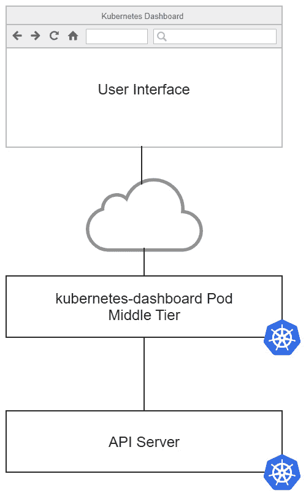
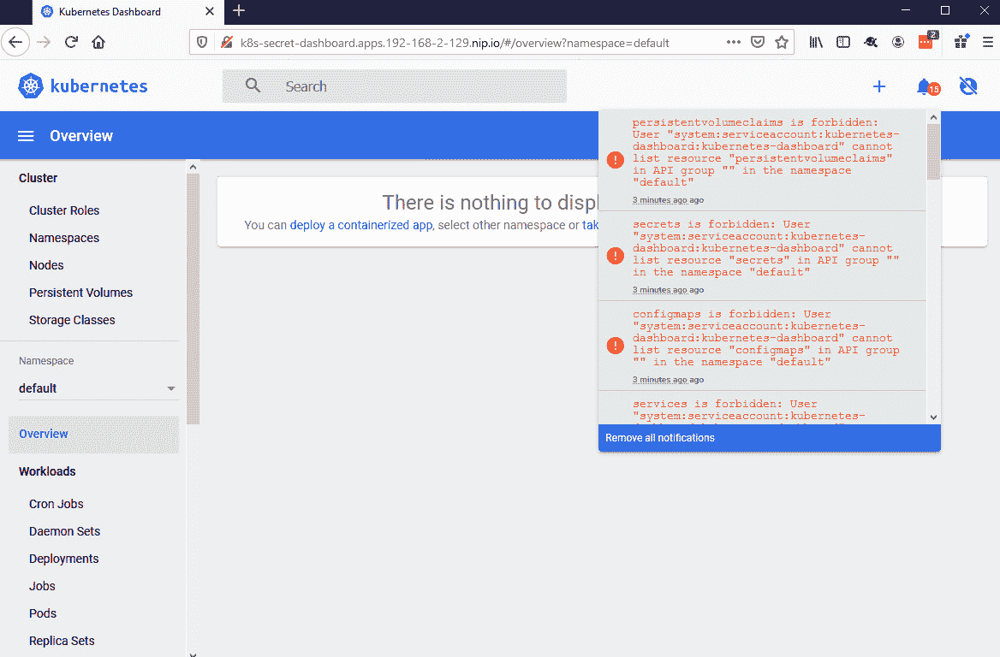
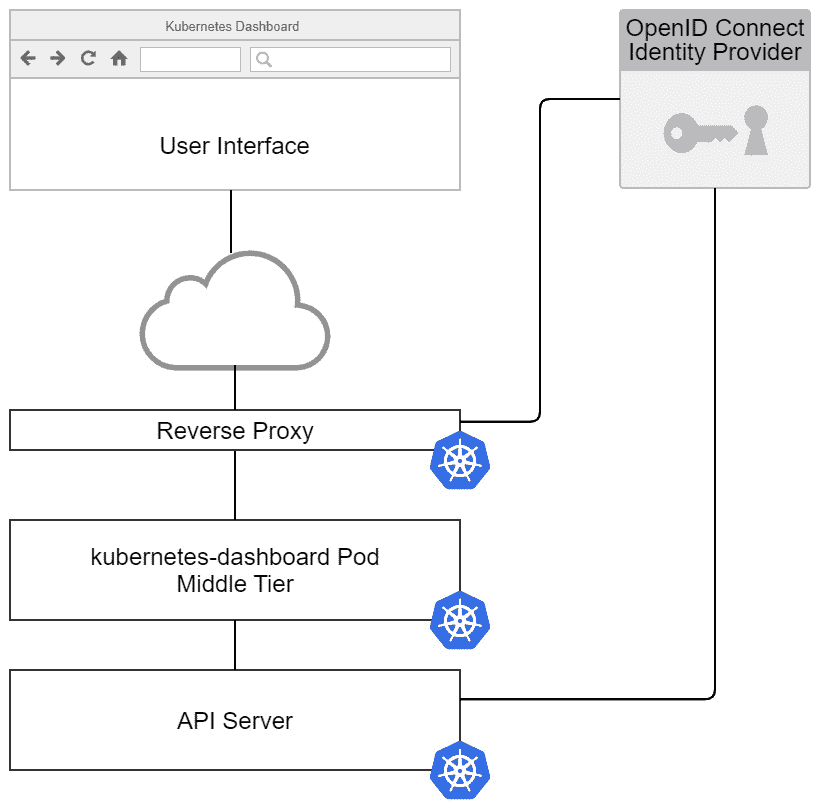
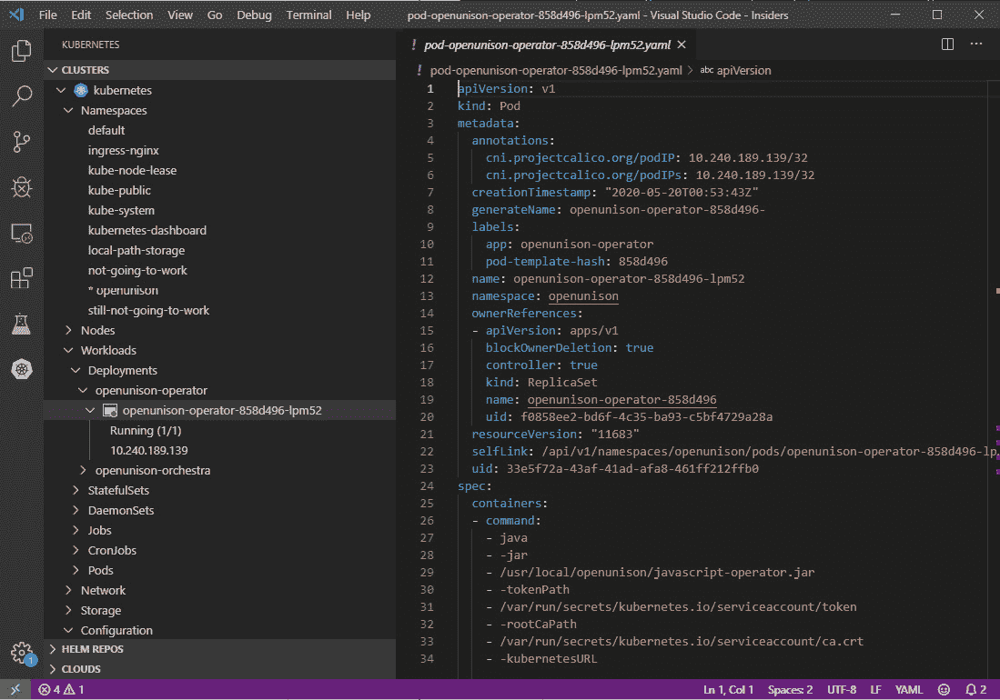
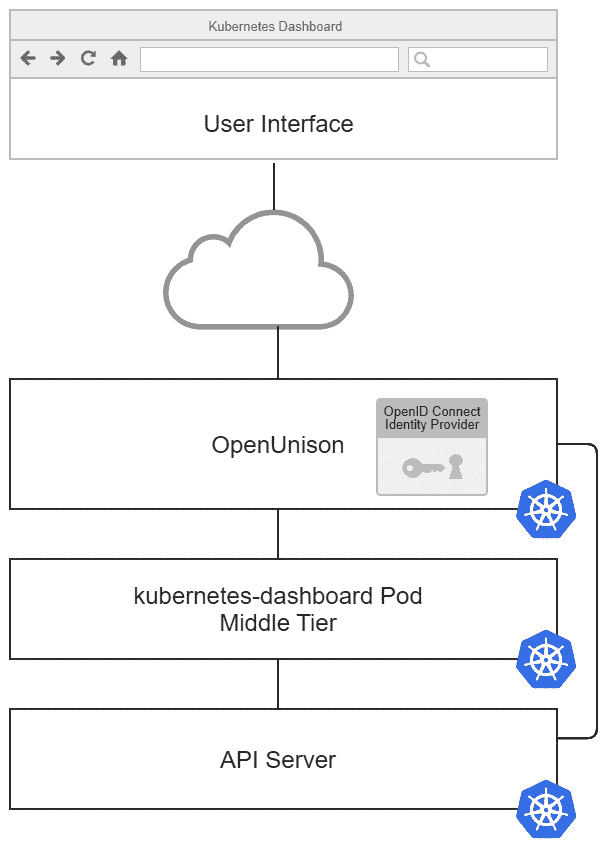

# *第九章*：部署安全的 Kubernetes 仪表板

Kubernetes 集群不仅由 API 服务器和 kubelet 组成。集群通常由需要进行安全保护的其他应用程序组成，例如容器注册表、源代码控制系统、流水线服务、GitOps 应用程序和监控系统。您的集群用户通常需要直接与这些应用程序进行交互。

许多集群都专注于对面向用户的应用程序和服务进行身份验证，但集群解决方案并未受到同等重视。用户通常被要求使用 kubectl 的端口转发或代理功能来访问这些系统。从安全和用户体验的角度来看，这种访问方法是一种反模式。用户和管理员将首次接触到这种反模式的是 Kubernetes 仪表板。本章将详细介绍为什么这种访问方法是一种反模式，以及如何正确访问仪表板。我们将指出如何不部署安全的 Web 应用程序，并指出其中的问题和风险。

我们将使用 Kubernetes 仪表板来学习有关 Web 应用程序安全性以及如何在自己的集群中应用这些模式。这些课程不仅适用于仪表板，还适用于其他集群重点应用程序，如 Istio 的 Kiali 仪表板、Grafana、Prometheus 和其他集群管理应用程序。

最后，我们将花一些时间讨论本地仪表板以及如何评估它们的安全性。这是一个流行的趋势，但并非普遍适用。了解这两种方法的安全性非常重要，我们将在本章中探讨它们。

在本章中，我们将涵盖以下主题：

+   仪表板如何知道你是谁？

+   仪表板是否不安全？

+   使用反向代理部署仪表板

+   将仪表板与 OpenUnison 集成

# 技术要求

要完成本章的练习，您需要一个运行 OIDC 集成的 KinD 集群。我们在《第七章》*第七章**《将身份验证集成到您的集群中》*中创建了这个集群。

您可以在以下 GitHub 存储库中访问本章的代码：[`github.com/PacktPublishing/Kubernetes-and-Docker-The-Complete-Guide`](https://github.com/PacktPublishing/Kubernetes-and-Docker-The-Complete-Guide)。

# 仪表板如何知道你是谁？

Kubernetes 仪表板是一个强大的 Web 应用程序，可以快速从浏览器内部访问您的集群。它允许您浏览命名空间并查看节点的状态，甚至提供一个您可以使用来直接访问 Pod 的 shell。使用仪表板和 kubectl 之间存在根本的区别。作为 Web 应用程序，仪表板需要管理您的会话，而 kubectl 不需要。这导致在部署过程中出现一组不同的安全问题，通常没有考虑到，导致严重后果。在本节中，我们将探讨仪表板如何识别用户并与 API 服务器进行交互。

## 仪表板架构

在深入了解仪表板如何对用户进行身份验证之前，了解仪表板的基本工作原理非常重要。从高层次来看，仪表板有三个层次：

+   **用户界面**：这是在浏览器中显示并与之交互的 Angular + HTML 前端。

+   **中间层**：前端与仪表板容器中托管的一组 API 进行交互，将前端的调用转换为 Kubernetes API 调用。

+   **API 服务器**：中间层 API 直接与 Kubernetes API 服务器进行交互。

Kubernetes 仪表板的这种三层架构可以在以下图表中看到：

图 9.1 – Kubernetes 仪表板架构

当用户与仪表板交互时，用户界面会调用中间层，中间层再调用 API 服务器。仪表板不知道如何收集凭证，大多数应用程序用户通常会获得访问权限。没有地方放用户名或密码。它有一个基于 cookie 的非常简单的会话机制系统，但在大多数情况下，仪表板实际上并不知道或关心当前登录的用户是谁。仪表板关心的唯一事情是在与 API 服务器通信时使用什么令牌。

那么，仪表板如何知道你是谁呢？

## 认证方法

仪表板可以确定用户身份的三种方式：

+   **无凭证**：可以告诉仪表板不收集任何令牌或凭证。当这种情况发生时，仪表板将使用容器自己的服务帐户与 API 服务器进行交互，具有通过 RBAC 分配的任何特权。

+   **来自登录/上传 kubectl 配置的令牌**：仪表板可以提示用户提供他们的 kubectl 配置文件或一个用于使用的令牌。一旦提供了令牌（或从上传到仪表板的配置文件中提取出来），就会创建一个加密的 cookie 来存储令牌。这个 cookie 会被中间层解密，里面的令牌会被传递给 API 服务器。

+   **来自反向代理的令牌**：如果用户界面向中间层发出的请求中包含一个包含令牌的授权头，则中间层将在向 API 服务器发出请求时使用该令牌。这是最安全的选项，也是本章将详细介绍的实现方式。

在本章的其余部分，将探讨访问仪表板的前两个选项作为反模式，并解释为什么反向代理模式是从安全和用户体验的角度来看访问集群仪表板实现的最佳选项。

# 了解仪表板安全风险

在设置新集群时，仪表板的安全性问题经常被提出。保护仪表板归结为仪表板的部署方式，而不是仪表板本身是否安全。回到仪表板应用程序的架构，没有安全性的概念被构建进去。中间层只是简单地将令牌传递给 API 服务器。

在谈论任何类型的 IT 安全时，重要的是通过“深度防御”的视角来看待。这是任何系统都应该有多层安全的理念。如果一层失败，就有其他层来填补漏洞，直到失败的层得到解决。单一的失败不会直接给攻击者提供访问权限。

与仪表板安全性相关的最常引用的事件是 2018 年加密货币挖矿者入侵特斯拉的事件。攻击者能够访问特斯拉集群中运行的 Pods，因为仪表板没有得到保护。集群的 Pods 可以访问提供攻击者访问特斯拉云供应商的令牌，攻击者在那里运行他们的加密挖矿系统。

总的来说，仪表板通常是攻击向量，因为它们很容易找到攻击者寻找的内容，并且很容易被不安全地部署。为了说明这一点，在 KubeCon NA 2019 上展示了一个“夺旗”（CTF）活动，其中一个场景是开发人员“意外”暴露了集群的仪表板。

注意

CTF 可作为家庭实验室在[`securekubernetes.com/`](https://securekubernetes.com/)上使用。这是一个非常推荐的资源，供任何学习 Kubernetes 安全的人使用。除了具有教育意义和可怕之外，它也非常有趣！

自特斯拉遭受攻击以来，部署仪表板而不需要凭据变得更加困难。这不再是默认设置，需要更新仪表板和集群。为了演示这样做有多危险，让我们来看看可以造成什么样的损害。

经历这些步骤可能会让人想到“有人真的会经历所有这些步骤来进入仪表板吗？”答案可能是没有人愿意谈论的事情。在上一章中，讨论了授权访问集群和设计多租户的多个选项。其中一个选项是在集群层面进行租户管理，其中每个租户都有自己的集群。不幸的是，许多这些部署包括租户的集群管理员访问权限，这将使他们能够执行这些步骤。集群管理员离谷歌搜索指令只有几步之遥，就能轻松绕过那些开发人员不喜欢在家中使用的烦人 VPN。

## 部署一个不安全的仪表板

虽然这听起来很疯狂，但我们在野外经常看到这种情况。推荐的仪表板安装多次声明不要在隔离的开发实验室之外使用这种类型的配置。不足之处在于，由于它确实使部署仪表板变得如此简单，许多新的管理员使用它，因为它易于设置，并且他们经常在生产集群中使用相同的部署。

现在，让我们展示一下部署时没有考虑安全性的仪表板有多容易受到攻击：

1.  第一步是告诉仪表板允许用户绕过身份验证。编辑**kubernetes-dashboard**命名空间中的**kubernetes-dashboard**部署：

**kubectl edit deployment kubernetes-dashboard -n kubernetes-dashboard**

1.  查找容器的**args**选项，添加**- --enable-skip-login**，然后保存：

图 9.2 - 在仪表板上启用跳过登录

1.  现在我们需要通过创建新的 Ingress 规则将仪表板暴露给网络。使用以下 YAML 创建一个名为**insecure-dashboard.yaml**的新 Ingress 清单。记得用你的 Docker 主机 IP 地址替换**host**部分的 IP 地址：

apiVersion: networking.k8s.io/v1beta1

种类：Ingress

元数据：

名称：dashboard-external-auth

命名空间：kubernetes-dashboard

注释：

kubernetes.io/ingress.class: nginx

nginx.ingress.kubernetes.io/affinity: cookie

nginx.ingress.kubernetes.io/backend-protocol: https

nginx.ingress.kubernetes.io/secure-backends: "true"

nginx.org/ssl-services: kubernetes-dashboard

规格：

规则：

- host: k8s-secret-dashboard.apps.192-168-2-129.nip.io

http：

路径：

- 后端：

serviceName: kubernetes-dashboard

servicePort: 443

路径：/

1.  通过使用**kubectl**部署清单来创建 Ingress 规则。由于我们在清单中添加了命名空间值，因此需要在 kubectl 命令中添加**-n**：

**kubectl create -f insecure-dashboard.yaml**

1.  创建 Ingress 后，打开浏览器，使用 Ingress 规则的**host**部分指定的 Nip.io 名称访问您的 secret 仪表板。

1.  您将看到一个要求令牌或 Kubeconfig 文件的身份验证屏幕，但由于我们在编辑仪表板时启用了跳过登录的选项，您可以通过单击**跳过**来简单地跳过登录：

图 9.3 - 禁用登录的 Kubernetes 仪表板

1.  一旦进入仪表板，默认服务账户将无法访问任何内容：

图 9.4 - 默认服务账户的 Kubernetes 仪表板

到目前为止，这可能看起来还不错。您将看到*访问被禁止*的错误，所以目前仪表板不会允许您造成任何损害。不幸的是，许多人到达这一点并采取额外的步骤来更改默认服务账户在集群上的权限。

1.  目前，服务账户未被授权访问集群，因此通过创建新的**ClusterRoleBinding**到 cluster-admin **ClusterRole**来更改。

创建一个名为**dashboard-role.yaml**的新文件，内容如下：

apiVersion: rbac.authorization.k8s.io/v1

种类：ClusterRoleBinding

元数据：

名称：secret-dashboard-cluster-admin

roleRef:

apiGroup: rbac.authorization.k8s.io

种类：ClusterRole

名称：cluster-admin

主题：

- apiGroup: ""

kind: ServiceAccount

命名空间：kubernetes-dashboard

名称：kubernetes-dashboard

1.  通过使用 kubectl 应用它来创建新的**ClusterRoleBinding**：

**kubectl create -f dashboard-role.yaml**

恭喜！秘密仪表板现在可以供任何想要使用它的人使用！

现在，你可能会想*"谁能找到我的仪表板？他们需要知道 URL，而我不会告诉任何人。"* 你感到安全，因为没有其他人知道你的仪表板的 URL 或 IP 地址。这被称为安全性通过混淆，通常被认为是一种糟糕的保护系统的方法。

让我们用一个场景来说明，有人可能在你不知情的情况下利用仪表板。

你是 Reddit 的忠实粉丝，有一天你看到了一个 Reddit 帖子，标题是*这是一个用于保护你的 Kubernetes 仪表板的好工具*。这个帖子看起来很正规，你很兴奋地想测试一下这个新工具。阅读完帖子后，你看到了底部的链接和运行它的命令：你可以从[`raw.githubusercontent.com/PacktPublishing/Kubernetes-and-Docker-The-Complete-Guide/master/chapter9/kubectl-secure-my-dashboard.go`](https://raw.githubusercontent.com/PacktPublishing/Kubernetes-and-Docker-The-Complete-Guide/master/chapter9/kubectl-secure-my-dashboard.go)下载它来试试看！

为了完全体验这个例子，你可以在你的 KinD 集群上运行这个工具，通过在**chapter9**目录下的克隆存储库中执行以下命令。确保将 URL 更改为你的仪表板的 Ingress 主机：

go run kubectl-secure-my-dashboard.go https://k8s-secret-dashboard.apps.192-168-2-129.nip.io

**在 https://k8s-secret-dashboard.apps.192-168-2-129.nip.io 上运行分析**

**你的仪表板已经得到了保护！**

现在，让我们回顾一下刚刚发生的事情。打开浏览器，进入你的秘密仪表板网站，查看发生了什么变化：

图 9.5 - 显示部署恶意软件的 Kubernetes 仪表板

看来我们的加固插件是一个部署比特币矿工的诡计。太无礼了！

现在你已经看到了一个不安全的仪表板是如何容易被利用的，使用 kubectl 删除部署。

虽然这种攻击可以通过预授权具有批准图像的注册表来减轻（当**OpenPolicyAgent**在*第十一章*中介绍时，*使用 Open Policy Manager 扩展安全性*将涉及到这个话题），但在那时安全性是被动的，试图应对威胁而不是预防它们。使用准入控制器也无法阻止某人从仪表板中提取机密信息。

虽然这是以最简单的方式不安全地访问仪表板的方法，但并不是唯一的方法。kubectl 实用程序包括两个功能，可以使访问仪表板变得容易。端口转发实用程序通常用于在集群内部创建到 pod 的隧道。该实用程序创建到 pod 上特定端口的 TCP 流，使其可以被本地主机访问（或者更多，如果你想的话）。这仍然绕过了仪表板中的身份验证，要求仪表板的服务账户通过 RBAC 具有执行所需任务的访问权限。虽然用户必须具有 RBAC 授权才能将端口转发到 pod，但这样会使仪表板通过两个攻击向量开放：

+   **外部**：运行在用户本地工作站上的任何脚本都可以访问转发的网络隧道。

+   **内部**：集群内部的任何 pod 都可以访问仪表板 pod。

对于内部访问，可以使用网络策略来限制哪些命名空间和 Pod 可以访问仪表板的 API。最好一开始就使用网络策略，但在这种情况下这是一个单点故障。一个配置错误的策略将会使仪表板暴露于攻击之下。

外部来源的威胁可能以您（或您使用的其他工具）决定运行的脚本的形式出现。Web 浏览器无法访问从本地系统外部托管的页面通过端口转发打开的端口，但是您工作站上运行的任何脚本都可以。例如，虽然您可以通过打开浏览器并直接转到该端口来访问转发的主机，但是从远程站点加载的恶意 JavaScript 的网页无法打开到您本地主机的连接。尝试对转发的端口运行之前在本节中运行的加固脚本，将会产生相同的结果，即在您的基础设施上出现一个不需要的 pod。

提供访问的另一种技术是使用 API 服务器的集成代理实用程序。运行**kubectl proxy**会创建一个到 API 服务器的本地网络隧道，然后可以用于代理 HTTP 请求到任何 Pod，包括仪表盘。这与**kubectl port-forward**具有相同的缺点，并且会使您的集群面临来自本地运行的任何脚本的攻击。

这些方法中的共同点是它们在安全性上存在单一故障点。即使采取了限制可以部署的图像的措施，一个不安全的仪表盘仍然可以用于访问秘密对象、删除部署，甚至通过仪表盘中集成的终端远程进入 Pod。

在探讨了如何绕过仪表盘上的所有身份验证及其影响之后，接下来我们将看看如何向仪表盘提供令牌，而无需部署额外的基础设施。

## 使用令牌登录

用户可以将令牌或 kubectl 配置文件上传到仪表盘作为登录，以避免秘密仪表盘的危险。正如前面讨论的，仪表板将获取用户的令牌并将其与对 API 服务器的所有请求一起使用。虽然这似乎解决了为仪表盘提供特权服务帐户的问题，但它也带来了自己的问题。仪表盘不是 kubectl，并不知道如何在令牌过期时刷新令牌。这意味着令牌需要相当长的生命周期才能发挥作用。这将要求创建可以使用的服务帐户，或者使您的 OpenID Connect **id_tokens**更长寿。这两种选择都会抵消通过利用 OpenID Connect 进行身份验证所实施的大部分安全性。

到目前为止，我们只关注了错误的部署仪表盘的方法。虽然了解这一点很重要，但正确的方法是什么？在下一节中，我们将详细介绍使用反向代理部署仪表盘的正确方法。

# 使用反向代理部署仪表盘

代理是 Kubernetes 中常见的模式。在 Kubernetes 集群的每一层都有代理。代理模式也被大多数 Kubernetes 上的服务网格实现所使用，创建将拦截请求的 sidecar。这里描述的反向代理与这些代理的区别在于它们的意图。微服务代理通常不携带会话，而 Web 应用程序需要会话来管理状态。

以下图表显示了带有反向代理的 Kubernetes 仪表板的架构：

图 9.6 – 带有反向代理的 Kubernetes 仪表板

图 9.6 中显示的反向代理执行三个角色：

+   **身份验证**：反向代理拦截未经身份验证的请求（或过期会话），并触发使用 OpenID Connect 身份提供者进行用户身份验证的过程。

+   **会话管理**：Kubernetes 的仪表板是一个面向用户的应用程序。它应该具有典型的控件，以支持会话超时和撤销。要注意的是，存储所有会话数据的反向代理在 cookie 中。这些方法很难撤销。

+   **身份注入**：一旦代理已经对用户进行了身份验证，它需要能够在每个请求上注入一个 HTTP 授权头，该头是一个 JWT，用于标识已登录的用户，由相同的 OpenID Connect 身份提供者签名，并且具有与 API 服务器相同的发行者和接收者。唯一的例外是使用模拟，正如在*第七章*中讨论的那样，将特定的头部注入到请求中。

反向代理不需要在集群上运行。根据您的设置，这样做可能是有利的，特别是在利用集群进行模拟时。在使用模拟时，反向代理使用服务账户的令牌，因此最好让该令牌永远不要离开集群。

本章的重点是 Kubernetes 项目的仪表板。仪表板功能有多种选择。接下来，我们将探讨这些仪表板如何与 API 服务器交互以及如何评估它们的安全性。

## 本地仪表板

第三方仪表板的一个共同主题是在您的工作站上本地运行，并使用 Kubernetes SDK 与 API 服务器进行交互，就像 kubectl 一样。这些工具的好处在于不需要部署额外的基础设施来保护它们。

Visual Studio Code 的 Kubernetes 插件是一个利用直接 API 服务器连接的本地应用程序的例子。当启动插件 Visual Studio Code 访问您当前的 kubectl 配置，并使用该配置与 API 服务器交互。甚至在 OpenID Connect 令牌过期时，它会刷新该令牌：

图 9.7 - Visual Studio Code 与 Kubernetes 插件

Visual Studio Code 的 Kubernetes 插件能够刷新其 OpenID Connect 令牌，因为它是使用 client-go SDK 构建的，这与 kubectl 使用的客户端库相同。在评估客户端仪表板时，请确保它与您的身份验证类型配合使用，即使它不是 OpenID Connect。许多 Kubernetes 的 SDK 不支持 OpenID Connect 令牌的刷新。截至本书出版日期，Java 和 Python SDK 最近才开始支持刷新 OpenID Connect 令牌，就像 client-go SDK 一样。在评估本地仪表板时，请确保它能够利用您的短期令牌，并在需要时刷新它们，就像 kubectl 一样。

## 其他集群级应用程序

本章介绍了集群除 Kubernetes 之外还由多个应用程序组成。其他应用程序可能会遵循与仪表板相同的安全模型，而反向代理方法比 kubectl 端口转发更适合暴露这些应用程序，即使应用程序没有内置安全性。以常见的 Prometheus 堆栈为例。Grafana 支持用户身份验证，但 Prometheus 和 Alert Manager 则不支持。如果使用端口转发，您将如何跟踪谁访问了这些系统，或者它们何时被访问？

未提供用户上下文。使用反向代理，每个 URL 的日志和用于访问 URL 的用户可以被转发到中央日志管理系统，并由安全信息和事件管理器（SIEM）进行分析，提供对集群使用的额外可见性层。

与仪表板一样，使用反向代理提供了分层安全方法。它可以从相关应用程序中卸载会话管理，并提供增强的身份验证措施，如多因素身份验证和会话撤销的能力。这些好处将导致一个更安全、更易于使用的集群。

# 将仪表板与 OpenUnison 集成

OpenUnison 使用模拟的方式注入身份标头的主题在*第七章**，将身份验证集成到您的集群*中进行了讨论，但没有讨论 OpenUnison 如何将用户的身份注入到集成了 OpenID Connect 的集群的仪表板中。它起作用，但没有解释。本节将使用 OpenUnison 实现作为一个示例，说明如何为仪表板构建一个反向代理。使用本节的信息来更好地理解 API 安全性，或者为仪表板身份验证构建自己的解决方案。

OpenUnison 部署包括两个集成应用程序：

+   **OpenID Connect 身份提供者和登录门户**：该应用程序托管登录过程和 API 服务器用于获取验证**id_token**所需密钥的发现 URL。它还托管了您可以获取 kubectl 令牌的屏幕。

+   **仪表板**：一个反向代理应用程序，对集成的 OpenID Connect 身份提供程序进行身份验证，并将用户的**id_token**注入到每个请求中。

该图显示了仪表板的用户界面如何与其服务器端组件进行交互，反向代理注入用户的**id_token**：

图 9.8 - OpenUnison 与仪表板的集成

仪表板使用与 API 服务器相同的 OpenID Connect 身份提供程序，但不使用其提供的**id_token**。相反，OpenUnison 有一个插件，将独立于身份提供者生成一个新的**id_token**，其中包含用户的身份数据。OpenUnison 可以做到这一点，因为用于为 OpenID Connect 身份提供者生成**id_token**的密钥，被存储在 OpenUnison 中。

生成一个新的、短暂的令牌，与 kubectl 一起使用的 OpenID Connect 会话分开。这样，令牌可以独立于 kubectl 会话进行刷新。这个过程提供了 1 到 2 分钟令牌寿命的好处，同时又具有直接登录过程的便利性。

如果您对安全有所了解，您可能会指出这种方法在安全模型中存在一个明显的单点故障，即用户的凭据！就像本章前面构建的 Secret 仪表板一样，在*了解仪表板安全风险部分*，攻击者通常只需要要求凭据就能获取到它们。这通常是通过电子邮件进行的，称为网络钓鱼攻击，攻击者向受害者发送一个看起来像他们登录页面的链接，但实际上只是收集凭据。这就是为什么多因素认证对基础设施系统如此重要。

在 2019 年的一项研究中，谷歌显示多因素认证可以阻止 99%的自动化和网络钓鱼攻击（https://security.googleblog.com/2019/05/new-research-how-effective-is-basic.html）。将多因素认证添加到身份提供者 OpenUnison 进行认证，或直接集成到 OpenUnison 中，是保护仪表板和集群的最有效方法之一。

# 总结

在本章中，我们详细探讨了 Kubernetes 仪表板的安全性。首先，我们介绍了架构以及仪表板如何将您的身份信息传递给 API 服务器。然后，我们探讨了仪表板如何被 compromise，最后我们详细介绍了如何正确地安全部署仪表板。

有了这些知识，您现在可以为用户提供一个安全的工具。许多用户更喜欢通过 Web 浏览器访问仪表板的简单性。添加多因素认证可以增加额外的安全层和安心感。当您的安全团队质疑仪表板的安全性时，您将有所需的答案来满足他们的担忧。

前三章着重讨论了 Kubernetes API 的安全性。接下来，我们将探讨如何保护每个 Kubernetes 部署的软肋，即节点！

# 问题

1.  仪表板不安全。

A. 真

B. 假

1.  仪表板如何识别用户？

A. 选项要么是无认证，要么是从反向代理注入的令牌

B. 用户名和密码

C. ServiceAccount

D. 多因素认证

1.  仪表板如何跟踪会话状态？

A. 会话存储在 etcd 中。

B. 会话存储在称为**DashboardSession**的自定义资源对象中。

C. 没有会话。

D. 如果上传了令牌，它将被加密并存储在浏览器中作为 cookie。

1.  使用令牌时，仪表板可以多久刷新一次？

A. 每分钟一次

B. 每 30 秒

C. 当令牌过期时

D. 以上都不是

1.  部署仪表板的最佳方式是什么？

A. 使用**kubectl 端口转发**

B. 使用**kubectl 代理**

C. 使用秘密的入口主机

D. 在反向代理后面

1.  仪表板不支持冒充。

A. 正确

B. 错误

1.  OpenUnison 是唯一支持仪表板的反向代理。

A. 正确

B. 错误
