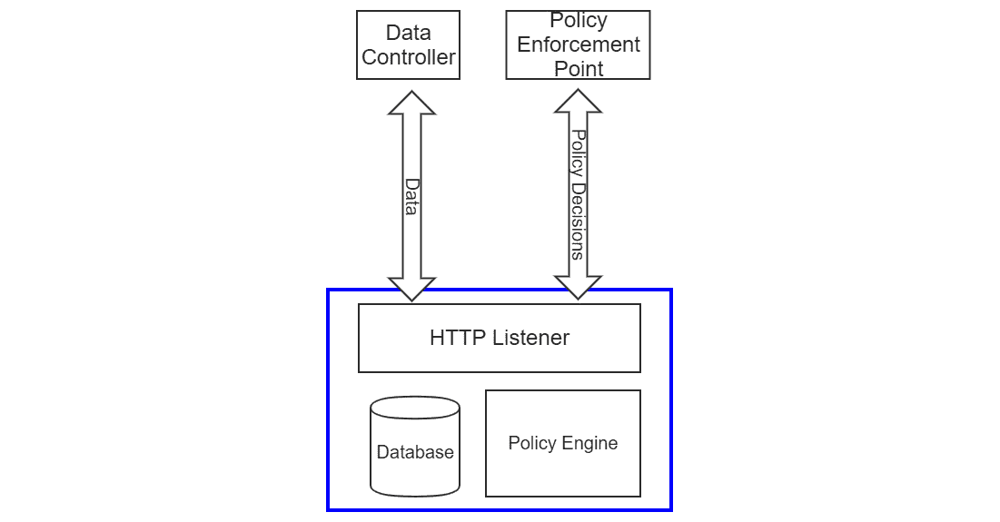
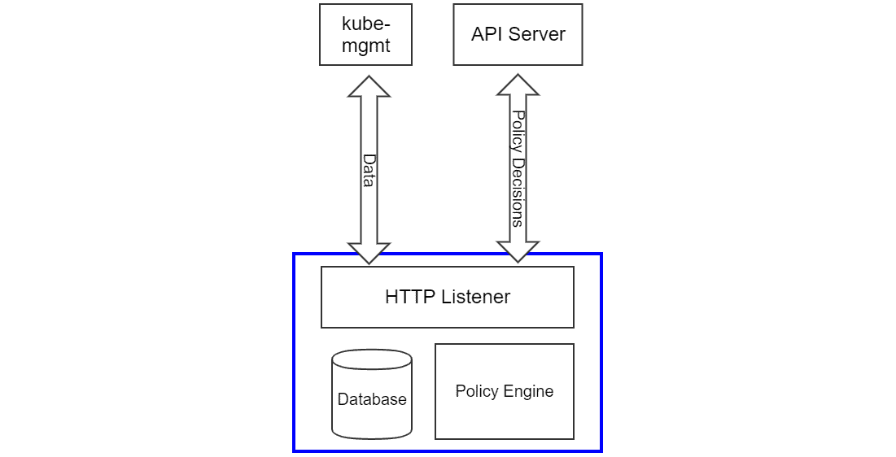
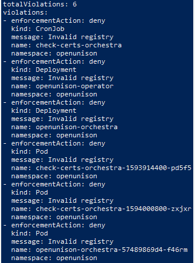

# 第十一章：使用 Open Policy Agent 扩展安全性

到目前为止，我们已经介绍了 Kubernetes 内置的身份验证和授权功能，这有助于保护集群。虽然这将涵盖大多数用例，但并非所有用例都能涵盖。Kubernetes 无法处理的几个安全最佳实践包括预授权容器注册表以及确保资源请求在所有**Pod**对象上。

这些任务留给外部系统，称为动态准入控制器。**Open Policy Agent**（**OPA**）及其 Kubernetes 本地子项目 GateKeeper 是处理这些用例的最流行方式之一。本章将详细介绍 OPA 和 GateKeeper 的部署方式，其架构以及如何开发策略。

在本章中，我们将涵盖以下主题：

+   验证 Webhook 简介

+   OPA 是什么以及它是如何工作的？

+   使用 Rego 编写策略

+   强制内存约束

+   使用 OPA 强制执行 Pod 安全策略

# 技术要求

要完成本章的实践练习，您需要一个运行着来自*第八章*的配置的 Ubuntu 18.04 服务器，运行着一个 KinD 集群，*RBAC Policies and Auditing*。

您可以在以下 GitHub 存储库中访问本章的代码：[`github.com/PacktPublishing/Kubernetes-and-Docker-The-Complete-Guide/tree/master/chapter11.`](https://github.com/PacktPublishing/Kubernetes-and-Docker-The-Complete-Guide/tree/master/chapter11 )

# 动态准入控制器简介

有两种扩展 Kubernetes 的方式：

+   构建自定义资源定义，以便您可以定义自己的对象和 API。

+   实现一个监听来自 API 服务器的请求并以必要信息响应的 Webhook。您可能还记得在*第七章*中，*将身份验证集成到您的集群*，我们解释了使用自定义 Webhook 来验证令牌。

从 Kubernetes 1.9 开始，可以将 Webhook 定义为动态准入控制器，在 1.16 中，动态准入控制器 API 变为**通用可用**（**GA**）。

该协议非常简单。一旦为特定对象类型注册了动态准入控制器，每当创建或编辑该类型的对象时，Webhook 就会被调用进行 HTTP post。然后期望 Webhook 返回代表是否允许的 JSON。

重要说明

截至 1.16 版本，**admission.k8s.io/v1**已经是 GA。所有示例将使用 API 的 GA 版本。

提交给 webhook 的请求由几个部分组成：

+   对象标识符：**资源**和**subResource**属性标识对象、API 和组。如果对象的版本正在升级，则会指定**requestKind**、**requestResource**和**requestSubResource**。此外，还提供了**namespace**和**operation**，以了解对象所在的位置以及它是**CREATE**、**UPDATE**、**DELETE**还是**CONNECT**操作。

+   **提交者标识符**：**userInfo**对象标识提交者的用户和组。提交者和创建原始请求的用户并不总是相同的。例如，如果用户创建了一个**Deployment**，那么**userInfo**对象将不是为创建原始**Deployment**的用户而是为**ReplicaSet**控制器的服务账户，因为**Deployment**创建了一个创建**Pod**的**ReplicaSet**。

+   **对象**：**object**表示正在提交的对象的 JSON，其中**oldObject**表示如果这是一个更新，则被替换的内容。最后，**options**指定了请求的附加选项。

来自 webhook 的响应将简单地具有两个属性，即来自请求的原始**uid**和**allowed**，可以是**true**或**false**。

**userInfo**对象可能会很快产生复杂性。由于 Kubernetes 通常使用多层控制器来创建对象，因此很难跟踪基于与 API 服务器交互的用户创建的使用情况。基于 Kubernetes 中的对象（如命名空间标签或其他对象）进行授权要好得多。

一个常见的用例是允许开发人员拥有一个“沙盒”，他们是其中的管理员，但容量非常有限。与其尝试验证特定用户不会请求太多内存，不如使用限制注释个人命名空间，这样准入控制器就有具体的参考对象，无论用户提交**Pod**还是**Deployment**。这样，策略将检查**命名空间**上的**注释**，而不是个别用户。为了确保只有拥有命名空间的用户能够在其中创建东西，使用 RBAC 来限制访问。

关于通用验证 Webhook 的最后一点是：没有办法指定密钥或密码。这是一个匿名请求。虽然从理论上讲，验证 Webhook 可以用于实现更新，但不建议这样做。

现在我们已经介绍了 Kubernetes 如何实现动态访问控制器，我们将看看 OPA 中最受欢迎的选项之一。

# OPA 是什么，它是如何工作的？

OPA 是一个轻量级的授权引擎，在 Kubernetes 中表现良好。它并不是从 Kubernetes 开始的，但它在那里找到了家园。在 OPA 中没有构建动态准入控制器的要求，但它非常擅长，并且有大量资源和现有策略可用于启动您的策略库。

本节概述了 OPA 及其组件的高级概述，本章的其余部分将深入介绍在 Kubernetes 中实施 OPA 的细节。

## OPA 架构

OPA 由三个组件组成-HTTP 监听器、策略引擎和数据库：

图 11.1-OPA 架构

OPA 使用的数据库是内存和临时的。它不会保留用于制定策略决策的信息。一方面，这使得 OPA 非常可扩展，因为它本质上是一个授权微服务。另一方面，这意味着每个 OPA 实例必须自行维护，并且必须与权威数据保持同步：

图 11.2-OPA 在 Kubernetes 中

在 Kubernetes 中使用时，OPA 使用一个名为*kube-mgmt*的 side car 来填充其数据库，该 side car 在您想要导入到 OPA 的对象上设置监视。当对象被创建、删除或更改时，*kube-mgmt*会更新其 OPA 实例中的数据。这意味着 OPA 与 API 服务器是“最终一致”的，但它不一定是 API 服务器中对象的实时表示。由于整个 etcd 数据库基本上是一遍又一遍地被复制，因此需要非常小心，以免在 OPA 数据库中复制敏感数据，例如**Secrets**。

## Rego，OPA 策略语言

我们将在下一节详细介绍 Rego 的细节。这里要提到的主要观点是，Rego 是一种策略评估语言，而不是通用编程语言。对于习惯于支持复杂逻辑的开发人员来说，这可能有些困难，比如 Golang、Java 或 JavaScript 等语言，这些语言支持迭代器和循环。Rego 旨在评估策略，并且被简化为这样。例如，如果您想在 Java 中编写代码来检查**Pod**中所有以注册表列表中的一个开头的容器图像，它看起来会像下面这样：

public boolean validRegistries(List<Container> containers,List<String> allowedRegistries) {

for (Container c : containers) {

boolean imagesFromApprovedRegistries = false;

for (String allowedRegistry : allowedRegistries) {

imagesFromApprovedRegistries =  imagesFromApprovedRegistries  || c.getImage().startsWith(allowedRegistry);

}

if (! imagesFromApprovedRegistries) {

return false;

}

}

return true;

}

此代码遍历每个容器和每个允许的注册表，以确保所有图像符合正确的策略。在 Rego 中相同的代码要小得多：

invalidRegistry {

ok_images = [image | startswith(input_images[j],input.parameters.registries[_]) ; image = input_images[j] ]

count(ok_images) != count(input_images)

}

如果容器中的任何图像来自未经授权的注册表，则前面的规则将评估为 true。我们将在本章后面详细介绍此代码的工作原理。理解此代码之所以如此紧凑的关键在于，Rego 中推断了许多循环和测试的样板文件。第一行生成一个符合条件的图像列表，第二行确保符合条件的图像数量与总图像数量相匹配。如果它们不匹配，那么一个或多个图像必须来自无效的注册表。编写紧凑的策略代码的能力使 Rego 非常适合准入控制器。

## GateKeeper

到目前为止，讨论的内容都是关于 OPA 的通用性。在本章的开头提到，OPA 并非起源于 Kubernetes。早期的实现中有一个边车，它将 OPA 数据库与 API 服务器同步，但您必须手动创建**ConfigMap**对象作为策略，并手动为 webhook 生成响应。2018 年，微软推出了 GateKeeper，[`github.com/open-policy-agent/gatekeeper`](https://github.com/open-policy-agent/gatekeeper)，以提供基于 Kubernetes 的体验。

除了从**ConfigMap**对象转移到适当的自定义资源之外，GateKeeper 还添加了一个审计功能，让您可以针对现有对象测试策略。如果对象违反策略，那么将创建一个违规条目来跟踪它。这样，您可以快速了解集群中现有策略违规情况的快照，或者在 GateKeeper 因升级而停机期间是否有遗漏的情况。

GateKeeper 和通用的 OPA 之间的一个主要区别是，在 GateKeeper 中，OPA 的功能不是通过任何人都可以调用的 API 公开的。OPA 是嵌入式的，GateKeeper 直接调用 OPA 来执行策略并保持数据库更新。决策只能基于 Kubernetes 中的数据或在评估时拉取数据。

### 部署 GateKeeper

使用的示例将假定使用 GateKeeper 而不是通用的 OPA 部署。根据 GateKeeper 项目的指示，使用以下命令：

$ kubectl apply -f https://raw.githubusercontent.com/open-policy-agent/gatekeeper/master/deploy/gatekeeper.yaml

这将启动 GateKeeper 命名空间的**Pods**，并创建验证 webhook。部署完成后，继续下一节。我们将在本章的其余部分介绍如何使用 GateKeeper 的详细信息。

## 自动化测试框架

OPA 具有内置的自动化测试框架，用于测试您的策略。这是 OPA 最有价值的方面之一。在部署之前能够一致地测试策略可以节省您大量的调试时间。在编写策略时，有一个与策略文件同名的文件，但名称中带有**_test**。例如，要将测试用例与**mypolicies.rego**关联，将测试用例放在同一目录中的**mypolicies_test.rego**中。运行**opa test**将运行您的测试用例。我们将在下一节中展示如何使用这个功能来调试您的代码。

在介绍了 OPA 及其构造基础之后，下一步是学习如何使用 Rego 编写策略。

# 使用 Rego 编写策略

Rego 是一种专门用于编写策略的语言。它与您可能编写过代码的大多数语言不同。典型的授权代码看起来可能是以下内容：

//假定失败

boolean allowed = false;

//在某些条件下允许访问

如果（someCondition）{

allowed = true;

}

//我们被授权了吗？

如果（allowed）{

doSomething();

}

授权代码通常会默认为未经授权，必须发生特定条件才能允许最终操作获得授权。Rego 采用了不同的方法。Rego 通常编写为授权一切，除非发生特定一组条件。

Rego 和更一般的编程语言之间的另一个主要区别是没有明确的“if”/“then”/“else”控制语句。当 Rego 的一行代码要做出决定时，代码被解释为“如果这行是假的，停止执行”。例如，Rego 中的以下代码表示“如果图像以**myregistry.lan/**开头，则停止执行策略并通过此检查，否则生成错误消息”：

不以(image，“myregistry.lan/”)开头

msg := sprintf("image '%v' comes from untrusted registry", [image])

在 Java 中，相同的代码可能如下所示：

如果（！image.startsWith("myregistry.lan/")）{

throw new Exception("image " + image + " comes from untrusted registry");

}

推断控制语句和显式控制语句之间的差异通常是学习 Rego 时最陡峭的部分。尽管这可能产生比其他语言更陡峭的学习曲线，但 Rego 通过以自动化和可管理的方式轻松测试和构建策略来弥补这一点。

OPA 可用于自动化测试策略。在编写集群安全性依赖的代码时，这非常重要。自动化测试将有助于加快您的开发速度，并通过新的工作代码捕获先前工作代码中引入的任何错误，从而提高您的安全性。接下来，让我们来学习编写 OPA 策略、测试它并将其部署到我们的集群的生命周期。

## 开发 OPA 策略

OPA 的一个常见示例是限制 Pod 可以来自哪些注册表。这是集群中常见的安全措施，可以帮助限制哪些 Pod 可以在集群上运行。例如，我们已经多次提到比特币矿工。如果集群不接受除了您自己内部注册表之外的 Pod，那么这就是需要采取的另一步措施，以防止不良行为者滥用您的集群。首先，让我们编写我们的策略，取自 OPA 文档网站（https://www.openpolicyagent.org/docs/latest/kubernetes-introduction/）：

k8sallowedregistries 包

invalidRegistry {

input_images[image]

not startswith(image, "quay.io/")

}

input_images[image] {

image := input.review.object.spec.containers[_].image

}

input_images[image] {

image := input.review.object.spec.template.spec.containers[_].image

}

此代码的第一行声明了我们策略所在的包。在 OPA 中，所有内容都存储在一个包中，包括数据和策略。OPA 中的包类似于文件系统上的目录。当您将策略放入包中时，一切都是相对于该包的。在这种情况下，我们的策略在 k8sallowedregistries 包中。

接下来的部分定义了一个规则。如果我们的 Pod 具有来自 quay.io 的镜像，这个规则最终将是未定义的。如果 Pod 没有来自 quay.io 的镜像，规则将返回 true，表示注册表无效。GateKeeper 将把这解释为失败，并在动态准入审查期间对 API 服务器返回 false。

接下来的两个规则看起来非常相似。input_images 规则中的第一个规则是“针对对象的 spec.container 中的每个容器评估调用规则”，直接匹配直接提交给 API 服务器的 Pod 对象，并提取每个容器的 image 值。第二个 input_images 规则说明：“针对对象的 spec.template.spec.containers 中的每个容器评估调用规则”，以短路 Deployment 对象和 StatefulSets。

最后，我们添加了 GateKeeper 需要通知 API 服务器评估失败的规则：

violation[{"msg": msg, "details": {}}] {

invalidRegistry

msg := "无效的注册表"

}

如果注册表有效，此规则将返回一个空的 msg。将代码分解为制定策略的代码和响应反馈的代码是一个好主意。这样可以更容易进行测试，接下来我们将进行测试。

## 测试 OPA 策略

编写策略后，我们希望设置自动化测试。与测试任何其他代码一样，重要的是您的测试用例涵盖预期和意外的输入。测试积极和消极的结果也很重要。仅证实我们的策略允许正确的注册表是不够的；我们还需要确保它能阻止无效的注册表。以下是我们代码的八个测试用例：

package k8sallowedregistries

test_deployment_registry_allowed {

输入为{"apiVersion"...的 invalidRegistry

}

test_deployment_registry_not_allowed {

输入为{"apiVersion"...的 invalidRegistry

}

test_pod_registry_allowed {

输入为{"apiVersion"...的 invalidRegistry

}

test_pod_registry_not_allowed {

输入为{"apiVersion"...的 invalidRegistry

}

test_cronjob_registry_allowed {

输入为{"apiVersion"...的 invalidRegistry

}

test_cronjob_registry_not_allowed {

输入为{"apiVersion"...的 invalidRegistry

}

test_error_message_not_allowed {

control := {"msg":"无效的注册表","details":{}}

result = 违规，输入为{"apiVersion":"admissi…

result[_] == control

}

test_error_message_allowed {

result = 违规，输入为{"apiVersion":"admissi…

control := {"msg":"无效的注册表","details":{}}

}

总共有八个测试；两个测试确保在出现问题时返回正确的错误消息，六个测试涵盖了三种输入类型的两个用例。我们正在测试简单的**Pod**定义，**Deployment**和**CronJob**。为了验证预期的成功或失败，我们已包含了具有**docker.io**和**quay.io**的**image**属性的定义。代码已经缩写打印，但可以从[`github.com/PacktPublishing/Kubernetes-and-Docker-The-Complete-Guide/tree/master/chapter11/simple-opa-policy/rego/`](https://github.com/PacktPublishing/Kubernetes-and-Docker-The-Complete-Guide/tree/master/chapter11/simple-opa-policy/rego/)下载。

要运行测试，首先按照 OPA 网站上的说明安装 OPA 命令行可执行文件-https://www.openpolicyagent.org/docs/latest/#running-opa。下载后，转到**simple-opa-policy/rego**目录并运行测试：

$ opa test .

data.kubernetes.admission.test_cronjob_registry_not_allowed：失败（248ns）

--------------------------------------------------------------

通过：7/8

失败：1/8

七个测试通过了，但**test_cronjob_registry_not_allowed**失败了。作为**input**提交的**CronJob**不应该被允许，因为它的**image**使用了*docker.io*。它能够通过的原因是因为**CronJob**对象遵循与**Pod**和**Deployment**不同的模式，因此我们的两个**input_image**规则不会加载**CronJob**中的任何容器对象。好消息是，当**CronJob**最终提交**Pod**时，GateKeeper 将不会对其进行验证，从而阻止其运行。坏消息是，直到**Pod**应该运行时，没有人会知道这一点。确保我们除了其他包含容器的对象外，还会捕捉**CronJob**对象，这将使调试变得更加容易，因为**CronJob**将不会被接受。

为了使所有测试通过，向 Github 存储库中的**limitregistries.rego**文件添加一个新的**input_container**规则，该规则将匹配**CronJob**使用的容器：

input_images[image] {

image := input.review.object.spec.jobTemplate.spec.template.spec.containers[_].image

}

现在，运行测试将显示一切都通过了：

$ opa 测试。

通过：8/8

经过测试的策略，下一步是将策略集成到 GateKeeper 中。

## 将策略部署到 GateKeeper

我们创建的策略需要部署到 GateKeeper 中，GateKeeper 提供了策略需要加载的 Kubernetes 自定义资源。第一个自定义资源是**ConstraintTemplate**，其中存储了我们策略的 Rego 代码。此对象允许我们指定与策略执行相关的参数，接下来我们将介绍这一点。为了保持简单，创建一个没有参数的模板：

apiVersion：templates.gatekeeper.sh/v1beta1

种类：ConstraintTemplate

元数据：

名称：k8sallowedregistries

规范：

crd：

规范：

名称：

种类：K8sAllowedRegistries

listKind：K8sAllowedRegistriesList

复数形式：k8sallowedregistries

单数形式：k8sallowedregistries

验证：{}

目标：

- 目标：admission.k8s.gatekeeper.sh

rego：|

包 k8sallowedregistries

。

。

。

此模板的整个源代码可在[`raw.githubusercontent.com/PacktPublishing/Kubernetes-and-Docker-The-Complete-Guide/master/chapter11/simple-opa-policy/yaml/gatekeeper-policy-template.yaml`](https://raw.githubusercontent.com/PacktPublishing/Kubernetes-and-Docker-The-Complete-Guide/master/ch)找到。

一旦创建，下一步是通过创建基于模板的约束来应用策略。约束是基于**ConstraintTemplate**的 Kubernetes 对象的配置的对象。请注意，我们的模板定义了自定义资源定义。这将添加到**constraints.gatekeeper.sh** API 组。如果您查看集群上的 CRD 列表，您将看到**k8sallowedregistries**列出：

图 11.3 - 由 ConstraintTemplate 创建的 CRD

创建约束意味着创建模板中定义的对象的实例。

为了避免在我们的集群中造成太多混乱，我们将限制此策略到**openunison**命名空间：

apiVersion: constraints.gatekeeper.sh/v1beta1

种类：K8sAllowedRegistries

元数据：

name: restrict-openunison-registries

规格：

匹配：

种类：

- apiGroups: [""]

种类：["Pod"]

- apiGroups: ["apps"]

种类：

- StatefulSet

- Deployment

- apiGroups: ["batch"]

种类：

- CronJob

命名空间：["openunison"]

parameters: {}

该约束限制了我们编写的策略只针对 OpenUnison 命名空间中的**Deployment**、**CronJob**和**Pod**对象。一旦创建，如果我们尝试杀死**openunison-operator** Pod，它将无法成功地由副本集控制器重新创建，因为镜像来自**dockerhub.io**，而不是**quay.io**：

图 11.4 - 由于 GateKeeper 策略而无法创建 Pod

接下来，查看策略对象。您将看到对象的**status**部分中存在几个违规行为：

图 11.5 - 违反镜像注册表策略的对象列表

部署了您的第一个 GateKeeper 策略后，您可能很快就会注意到它存在一些问题。首先是注册表是硬编码的。这意味着我们需要为每次注册表更改复制我们的代码。它也不适用于命名空间。Tremolo Security 的所有镜像都存储在**docker.io/tremolosecurity**，因此我们可能希望为每个命名空间提供灵活性，并允许多个注册表，而不是限制特定的注册表服务器。接下来，我们将更新我们的策略以提供这种灵活性。

## 构建动态策略

我们当前的注册表策略是有限的。它是静态的，只支持单个注册表。Rego 和 GateKeeper 都提供了构建动态策略的功能，可以在我们的集群中重复使用，并根据各个命名空间的要求进行配置。这使我们可以使用一个代码库进行工作和调试，而不必维护重复的代码。我们将要使用的代码在[`github.com/packtpublishing/Kubernetes-and-Docker-The-Complete-Guide/blob/master/chapter11/parameter-opa-policy/`](https://github.com/packtpublishing/Kubernetes-and-Docker-The-Complete-Guide/blob/master/chapter11/pa)中。

当检查**rego/limitregistries.rego**时，**parameter-opa-policy**和**simple-opa-policy**中代码的主要区别在于**invalidRegistry**规则：

invalidRegistry {

ok_images = [image | startswith(input_images[i],input.parameters.registries[_]) ; image = input_images[i] ]

count(ok_images) != count(input_images)

}

规则的第一行的目标是使用推理确定来自批准注册表的图像。推理提供了一种根据某些逻辑构建集合、数组和对象的方法。在这种情况下，我们只想将以**input.parameters.registries**中任何允许的注册表开头的图像添加到**ok_images**数组中。

要阅读一个推理，从大括号的类型开始。我们的推理以方括号开始，因此结果将是一个数组。对象和集合也可以生成。在开放方括号和管道字符（**|**）之间的单词称为头部，这是如果满足右侧条件将添加到我们的数组中的变量。管道字符（**|**）右侧的所有内容都是一组规则，用于确定**image**应该是什么，以及是否应该有值。如果规则中的任何语句解析为未定义或假，执行将退出该迭代。

我们理解的第一个规则是大部分工作都是在这里完成的。**startswith**函数用于确定我们的每个图像是否以正确的注册表名称开头。我们不再将两个字符串传递给函数，而是传递数组。第一个数组有一个我们尚未声明的变量**i**，另一个使用下划线（**_**）代替索引。**i**被 Rego 解释为“对数组中的每个值执行此操作，递增 1 并允许在整个理解过程中引用它。”下划线在 Rego 中是“对所有值执行此操作”的速记。由于我们指定了两个数组，每个数组的所有组合都将被用作**startswith**函数的输入。这意味着如果有两个容器和三个潜在的预批准注册表，那么**startswith**将被调用六次。当任何组合从**startswith**返回**true**时，将执行下一个规则。这将**image**变量设置为带有索引**i**的**input_image**，这意味着该图像将被添加到**ok_images**。在 Java 中，相同的代码看起来可能是这样的：

ArrayList<String> okImages = new ArrayList<String>();

对于（int i=0;i<inputImages.length;i++）{

对于（int j=0;j<registries.length;j++）{

如果（inputImages[i].startsWith(registries[j]）{

okImages.add(inputImages[i]);

}

}

}

Rego 的一行消除了大部分基本代码的七行。

规则的第二行将**ok_images**数组中的条目数与已知容器图像的数量进行比较。如果它们相等，我们就知道每个容器都包含一个有效的图像。

通过我们更新的 Rego 规则来支持多个注册表，下一步是部署一个新的策略模板（如果您还没有这样做，请删除旧的**k8sallowedregistries** **ConstraintTemplate**和**restrict-openunison-registries** **K8sAllowedRegistries**）。这是我们更新的**ConstraintTemplate**：

apiVersion：templates.gatekeeper.sh/v1beta1

种类：ConstraintTemplate

元数据：

名称：k8sallowedregistries

规范：

crd：

规范：

名称：

种类：K8sAllowedRegistries

listKind：K8sAllowedRegistriesList

复数：k8sallowedregistries

单数：k8sallowedregistries

验证：

**openAPIV3Schema:**

**          properties:**

**            registries:**

**              type: array**

**              items: string**

目标：

- 目标：admission.k8s.gatekeeper.sh

rego：|

package k8sallowedregistries

。

。

。

除了包含我们的新规则，突出显示的部分显示我们向模板添加了一个模式。这将允许模板以特定参数进行重用。这个模式进入了将要创建的**CustomResourceDefenition**，并用于验证我们将创建的**K8sAllowedRegistries**对象的输入，以强制执行我们预先授权的注册表列表。

最后，让我们为**openunison**命名空间创建我们的策略。由于在这个命名空间中运行的唯一容器应该来自 Tremolo Security 的**dockerhub.io**注册表，我们将使用以下策略将所有 Pod 限制为**docker.io/tremolosecurity/**：

apiVersion: constraints.gatekeeper.sh/v1beta1

种类：K8sAllowedRegistries

元数据：

名称：restrict-openunison-registries

规格：

匹配：

种类：

- apiGroups：[""]

种类：["Pod"]

- apiGroups：["apps"]

种类：

- StatefulSet

- Deployment

- apiGroups：["batch"]

种类：

- CronJob

命名空间：["openunison"]

参数：

注册表：["docker.io/tremolosecurity/"]

与我们之前的版本不同，这个策略指定了哪些注册表是有效的，而不是直接将策略数据嵌入到我们的 Rego 中。有了我们的策略，让我们尝试在**openunison**命名空间中运行**busybox**容器以获取一个 shell：

图 11.6 – 失败的 busybox shell

使用这个通用的策略模板，我们可以限制命名空间能够从哪些注册表中拉取。例如，在多租户环境中，您可能希望将所有**Pods**限制为所有者自己的注册表。如果一个命名空间被用于商业产品，您可以规定只有那个供应商的容器可以在其中运行。在转向其他用例之前，重要的是要了解如何调试您的代码并处理 Rego 的怪癖。

## 调试 Rego

调试 Rego 可能是具有挑战性的。与 Java 或 Go 等更通用的编程语言不同，没有办法在调试器中逐步执行代码。以刚刚为检查注册表编写的通用策略为例。所有的工作都是在一行代码中完成的。逐步执行它不会有太大的好处。

为了使 Rego 更容易调试，OPA 项目在命令行上设置了详细输出时提供了所有失败测试的跟踪。这是使用 OPA 内置测试工具的另一个很好的理由。

为了更好地利用这个跟踪，Rego 有一个名为 **trace** 的函数，它接受一个字符串。将这个函数与 **sprintf** 结合使用，可以更容易地跟踪代码未按预期工作的位置。在 **chapter11/paramter-opa-policy-fail/rego** 目录中，有一个将失败的测试。还有一个添加了多个跟踪选项的 **invalidRegistry** 规则：

invalidRegistry {

跟踪(sprintf("input_images : %v",[input_images]))

ok_images = [image |

trace(sprintf("image %v",[input_images[j]]))

startswith(input_images[j],input.parameters.registries[_]) ;

image = input_images[j]

]

trace(sprintf("ok_images %v",[ok_images]))

trace(sprintf("ok_images size %v / input_images size %v",[count(ok_images),count(input_images)]))

count(ok_images) != count(input_images)

}

当测试运行时，OPA 将输出每个比较和代码路径的详细跟踪。无论在哪里遇到 **trace** 函数，跟踪中都会添加一个“注释”。这相当于在代码中添加打印语句进行调试。OPA 跟踪的输出非常冗长，包含的文本太多，无法包含在打印中。在此目录中运行 **opa test.** **-v** 将给你完整的跟踪，可以用来调试你的代码。

## 使用现有的政策

在进入更高级的 OPA 和 GateKeeper 的用例之前，了解 OPA 的构建和使用方式非常重要。如果你检查我们在上一节中工作过的代码，你可能会注意到我们没有检查 **initContainers**。我们只是寻找主要的容器。**initContainers** 是在预期 **Pod** 中列出的容器结束之前运行的特殊容器。它们通常用于准备卷挂载的文件系统和其他应在 **Pod** 的容器运行之前执行的“初始”任务。如果一个坏演员试图启动一个带有拉入比特币矿工（或更糟糕）的 **initContainers** 的 **Pod**，我们的策略将无法阻止它。

在设计和实施政策时非常详细是很重要的。确保在构建政策时不会遗漏任何东西的一种方法是使用已经存在并经过测试的政策。GateKeeper 项目在其 GitHub 存储库 https://github.com/open-policy-agent/gatekeeper/tree/master/library 中维护了几个经过预先测试的政策库以及如何使用它们。在尝试构建自己的政策之前，先看看那里是否已经存在一个。

本节概述了 Rego 及其在策略评估中的工作方式。它没有涵盖所有内容，但应该为您在使用 Rego 文档时提供一个良好的参考点。接下来，我们将学习如何构建依赖于我们请求之外的数据的策略，例如集群中的其他对象。

# 执行内存约束

到目前为止，在本章中，我们构建了自包含的策略。在检查图像是否来自预授权的注册表时，我们所需的唯一数据来自策略和容器。这通常不足以做出策略决策。在本节中，我们将致力于构建一个策略，依赖于集群中的其他对象来做出策略决策。

在深入实施之前，让我们谈谈用例。在提交到 API 服务器的任何 **Pod** 上至少包含内存要求是一个好主意。然而，有一些命名空间，这样做就没有太多意义。例如，**kube-system** 命名空间中的许多容器没有 CPU 和内存资源请求。

有多种方法可以处理这个问题。一种方法是部署一个约束模板，并将其应用到我们想要强制执行内存资源请求的每个命名空间。这可能会导致重复的对象，或者要求我们明确更新策略以将其应用于特定的命名空间。另一种方法是向命名空间添加一个标签，让 OPA 知道它需要所有 **Pod** 对象都具有内存资源请求。由于 Kubernetes 已经有了用于管理内存的 **ResourceQuota** 对象，我们还可以确定一个命名空间是否有 **ResourceQuota**，如果有的话，那么我们就知道应该有内存请求。

对于我们的下一个示例，我们将编写一个策略，该策略表示在具有 **ResourceQuota** 的命名空间中创建的任何 **Pod** 必须具有内存资源请求。策略本身应该非常简单。伪代码将看起来像这样：

if (hasResourceQuota(input.review.object.metdata.namespace) &&  containers.resource.requests.memory == null) {

生成错误;

}

这里的难点是要了解命名空间是否有**ResourceQuota**。Kubernetes 有一个 API，您可以查询，但这意味着要么将秘密嵌入到策略中，以便它可以与 API 服务器通信，要么允许匿名访问。这两个选项都不是一个好主意。另一个查询 API 服务器的问题是很难自动化测试，因为现在您依赖于一个 API 服务器在您运行测试的任何地方都可用。

我们之前讨论过，OPA 可以从 API 服务器复制数据到自己的数据库中。GateKeeper 使用这个功能来创建可以进行测试的对象的“缓存”。一旦这个缓存被填充，我们可以在本地复制它，为我们的策略测试提供测试数据。

## 启用 GateKeeper 缓存

通过在"gatekeeper-system"命名空间中创建一个**Config**对象来启用 GateKeeper 缓存。将此配置添加到您的集群中：

api 版本：config.gatekeeper.sh/v1alpha1

种类：Config

元数据：

名称：config

命名空间："gatekeeper-system"

规范：

同步：

仅同步：

- 组：""

版本："v1"

种类："命名空间"

- 组：""

版本："v1"

种类："ResourceQuota"

这将开始在 GateKeeper 的内部 OPA 数据库中复制**Namespace**和**ResourceQuota**对象。让我们创建一个带有**ResourceQuota**和一个不带**ResourceQuota**的**Namespace**： 

api 版本：v1

种类：命名空间

元数据：

名称：ns-with-no-quota

规范：{}

---

api 版本：v1

种类：命名空间

元数据：

名称：ns-with-quota

规范：{}

---

种类：ResourceQuota

api 版本：v1

元数据：

名称：memory-quota

命名空间：ns-with-quota

规范：

硬：

请求.memory：1G

限制.memory：1G

过一会儿，数据应该在 OPA 数据库中，并且准备好查询。

重要提示

GateKeeper 服务账户在默认安装中对集群中的所有内容都有读取权限。这包括秘密对象。在 GateKeeper 的缓存中复制什么要小心，因为在 Rego 策略内部没有安全控制。如果不小心，您的策略很容易记录秘密对象数据。另外，请确保控制谁可以访问**gatekeeper-system**命名空间。任何获得服务账户令牌的人都可以使用它来读取集群中的任何数据。

## 模拟测试数据

为了自动化测试我们的策略，我们需要创建测试数据。在之前的例子中，我们使用注入到**input**变量中的数据。缓存数据存储在**data**变量中。具体来说，为了访问我们的资源配额，我们需要访问**data.inventory.namespace["ns-with-quota"]["v1"]["ResourceQuota"]["memory-quota"]**。这是您在 GateKeeper 中从 Rego 查询数据的标准方式。就像我们对输入所做的那样，我们可以通过创建一个数据对象来注入这些数据的模拟版本。我们的 JSON 将如下所示：

{

"inventory": {

"namespace":{

"ns-with-no-quota" : {},

"ns-with-quota":{

"v1":{

"ResourceQuota": {

"memory-quota":{

"kind": "ResourceQuota",

"apiVersion": "v1",

"metadata": {

"name": "memory-quota",

"namespace": "ns-with-quota"

},

"spec": {

"hard": {

"requests.memory": "1G",

"limits.memory": "1G"

}}}}}}}}}

当您查看**chapter11/enforce-memory-request/rego/enforcememory_test.rego**时，您会看到测试中有**with input as {…} with data as {…}**，前面的文档作为我们的控制数据。这让我们能够测试我们的策略，使用 GateKeeper 中存在的数据，而无需在集群中部署我们的代码。

## 构建和部署我们的策略

就像以前一样，在编写策略之前，我们已经编写了测试用例。接下来，我们将检查我们的策略：

package k8senforcememoryrequests

违规[{"msg": msg, "details": {}}] {

invalidMemoryRequests

msg := "未指定内存请求"

}

invalidMemoryRequests {

数据。

库存

.namespace

[input.review.object.metadata.namespace]

["v1"]

["ResourceQuota"]

容器：= 输入审查对象规范容器

ok_containers = [ok_container |

containers[j].resources.requests.memory ;

ok_container = containers[j]  ]

count(containers) != count(ok_containers)

}

这段代码应该看起来很熟悉。它遵循了与我们先前策略相似的模式。第一个规则**violation**是 GateKeeper 的标准报告规则。第二个规则是我们测试**Pod**的地方。第一行将在指定**Pod**的命名空间不包含**ResourceQuota**对象时失败并退出。接下来的一行加载**Pod**的所有容器。之后，使用组合来构建具有指定内存请求的容器列表。最后，规则只有在符合条件的容器数量与总容器数量不匹配时才会成功。如果**invalidMemoryRequests**成功，这意味着一个或多个容器没有指定内存请求。这将强制**msg**被设置，并且**violation**通知用户存在问题。

要部署，请将**chapter11/enforce-memory-request/yaml/gatekeeper-policy-template.yaml**和**chapter11/enforce-memory-request/yaml/gatekeeper-policy.yaml**添加到您的集群中。要测试这一点，在我们的**ns-with-quota**和**ns-with-no-quota**命名空间中创建一个没有内存请求的**Pod**。

图 11.7 - 创建没有内存请求的 Pod

在**ns-with-quota**命名空间中创建**Pod**的第一次尝试失败，因为我们的**require-memory-requests**策略拒绝了它，因为**ns-with-quota**中有一个**ResourceQuota**。第二次尝试成功，因为它在没有**ResourceQuota**的命名空间中运行。

本章大部分时间都花在编写策略上。 OPA 的最终用例将专注于使用 GateKeeper 的预构建策略来替换 Pod 安全策略。

# 使用 OPA 执行 Pod 安全策略

在*第十章*，*创建 Pod 安全策略*中，我们讨论了 Kubernetes 现有的 Pod 安全策略实现永远不会成为"GA"的事实。使用 Kubernetes 实现的替代方案之一是使用 OPA 和 GateKeeper 来强制执行相同的策略，但是在 OPA 而不是在 API 服务器上。这个过程与 Kubernetes 的标准实现方式不同，但使用它可以使您的集群更加独立于供应商，并且不太容易受到 Kubernetes 的 Pod 安全策略未来变化的影响。

GateKeeper 的所有策略都发布在[`github.com/open-policy-agent/gatekeeper/tree/master/library/pod-security-policy`](https://github.com/open-policy-agent/gatekeeper/tree/master/library/pod-security-policy)。它们被构建为一系列**ConstraintTemplate**对象和示例约束。这种对 Pod 安全策略的方法导致了一些特定的差异，以及策略的实施方式。

第一个主要区别是使用 GateKeeper，您必须在 Pod 定义中声明所有内容，以便 GateKeeper 有东西可以进行审计。这在 Pod 安全策略中是不必要的，因为 Kubernetes 将改变 Pod 定义以符合策略。为了说明这一点，看看我们 KinD 集群中**openunison**命名空间中的**openunison-operator**的**Deployment**。没有声明**runAsUser**。现在看一下实际的 Pod 定义，您会看到**runAsUser**设置为**1**。GateKeeper 版本 3 目前还不支持 Pod 变异，因此为了确保**Deployment**或**Pod**具有设置**runAsUser**，需要一个单独的变异 webhook 来相应地设置**runAsUser**属性。

Kubernetes 标准策略实现和使用 GateKeeper 之间的下一个主要区别是 Pod 分配策略的方式。Kubernetes 标准实现使用 RBAC 的组合，利用提交者的帐户信息和**Pod**的**serviceAccount**，以及**Pod**请求的功能来确定使用哪个策略。这可能会导致一些意外的结果。相反，GateKeeper 提供了与 GateKeeper 实施的任何其他约束相同的匹配标准，使用命名空间和标签选择器。

例如，要使用特权约束来运行一个 Pod，您可以使用特定的**labelSelector**创建约束。然后，当提交 Pod 时，该标签需要在**Pod**上，这样 GateKeeper 就知道要应用它。这样可以更容易地明确地将策略应用于**Pod**。它并不涵盖如何强制执行资源的标记。您可能不希望某人能够将自己的**Pod**标记为特权。

最后，GateKeeper 的策略库被分解成多个部分，而不是作为一个对象的一部分。为了应用一个强制执行在特定用户范围内运行的非特权容器的策略，您需要两个单独的策略约束实现和两个单独的约束。

在撰写本文时，您无法在不进行重大额外工作的情况下复制我们在 *第十章* 中构建的内容，即 *创建 Pod 安全策略*。GateKeeper 项目的目标是在未来达到这一点。更完整的解决方案仍然是 Kubernetes 中 Pod 安全策略的标准实现。

# 总结

在本章中，我们探讨了如何使用 GateKeeper 作为动态准入控制器，在 Kubernetes 内置的 RBAC 能力之上提供额外的授权策略。我们看了 GateKeeper 和 OPA 的架构。最后，我们学习了如何在 Rego 中构建、部署和测试策略。

扩展 Kubernetes 的策略会增强集群的安全性配置，并且可以更加确信工作负载在集群上的完整性。使用 GateKeeper 也可以通过持续审计来帮助捕获先前被忽略的策略违规行为。利用这些功能将为您的集群提供更坚实的基础。

本章重点讨论了是否启动 **Pod**。在下一章中，我们将学习一旦激活，如何跟踪 **Pods** 的活动。

# 问题

1.  OPA 和 GateKeeper 是同一件事吗？

A. 是的。

B. 不是。

1.  Rego 代码存储在 GateKeeper 中的方式是什么？

A. 它被存储为被监视的 **ConfigMap** 对象。

B. Rego 必须挂载到 Pod 上。

C. Rego 需要存储为秘密对象。

D. Rego 被保存为 **ConstraintTemplate**。

1.  您如何测试 Rego 策略？

A. 在生产中

B. 使用直接内置到 OPA 中的自动化框架

C. 首先编译为 Web Assembly

1.  在 Rego 中，如何编写 **for** 循环？

A. 你不需要；Rego 将识别迭代步骤。

B. 使用 **for all** 语法。

C. 通过在循环中初始化计数器。

D. Rego 中没有循环。

1.  什么是调试 Rego 策略的最佳方法？

A. 使用 IDE 连接到集群中的 GateKeeper 容器。

B. 在生产中。

C. 向您的代码添加跟踪函数，并使用 **-v** 运行 **opa test** 命令以查看执行跟踪。

D. 包括 **System.out** 语句。

1.  所有约束都需要硬编码。

A. 真的。

B. 错误。

1.  GateKeeper 可以替代 Pod 安全策略。

A. 是的。

B. 错误。
