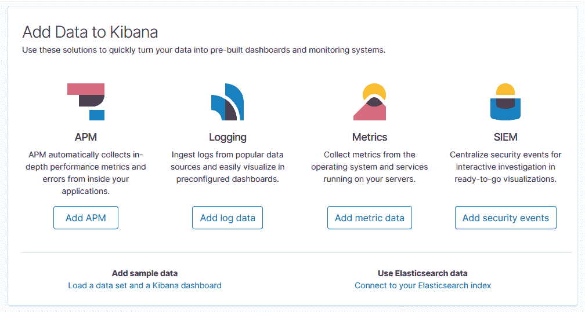
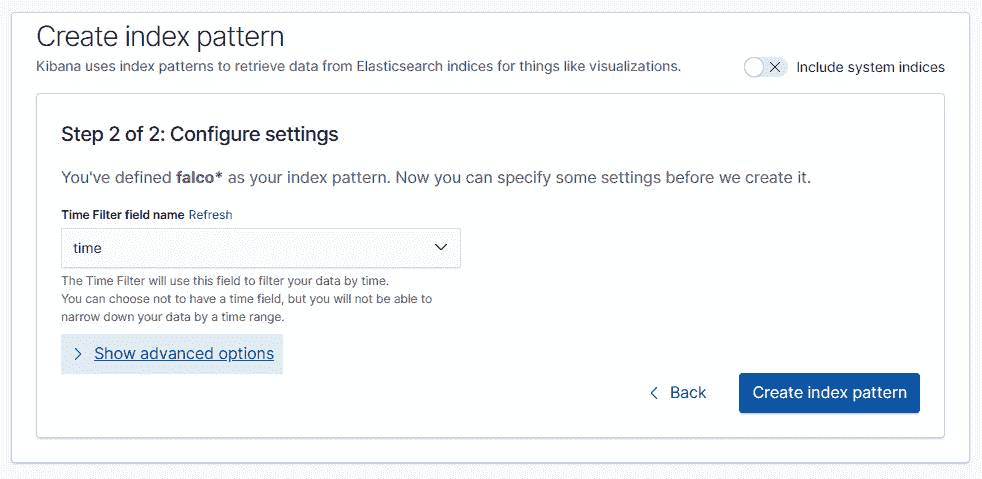
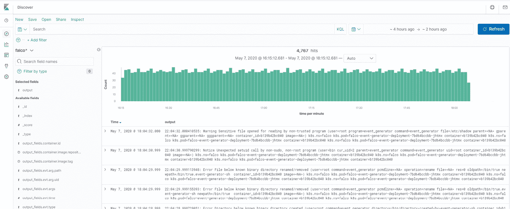
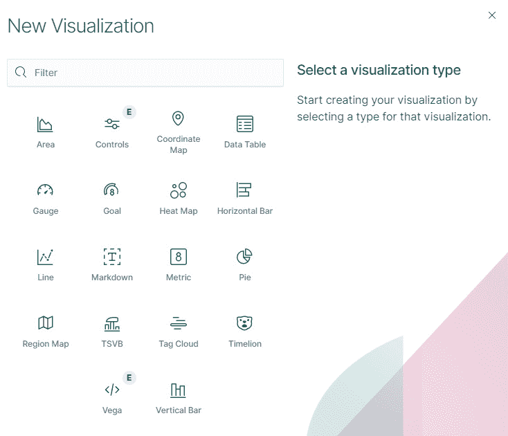
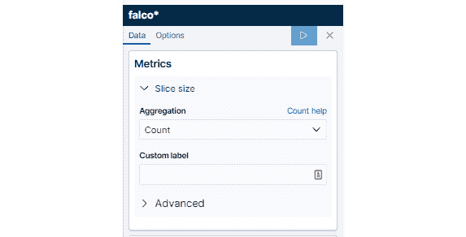
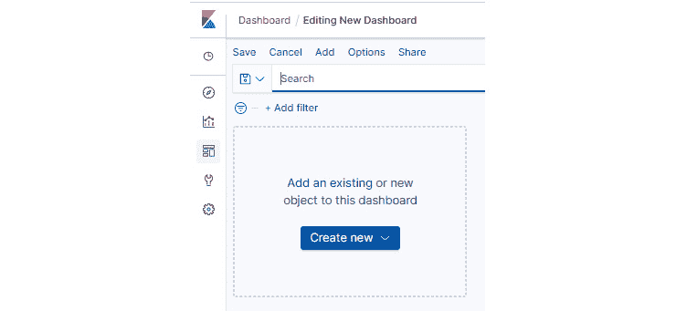
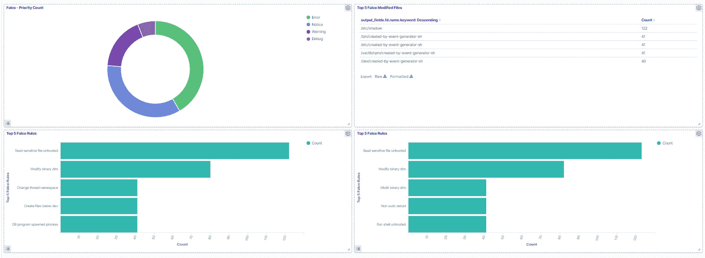
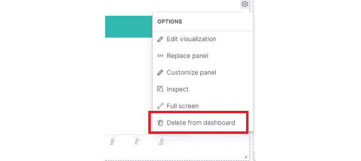
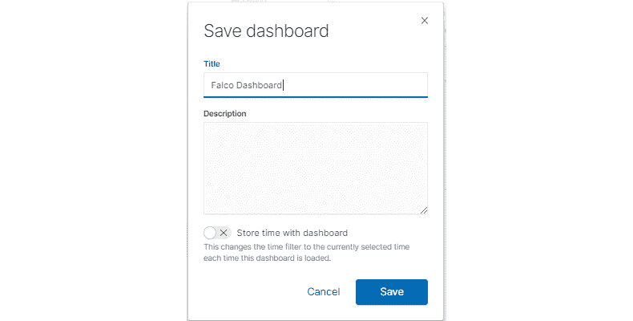

# 第十二章：使用 Falco 和 EFK 进行审计

坏人做坏事。

好人做坏事。

事故发生。

前述每个声明都有一个共同点：当其中任何一个发生时，您需要找出发生了什么。

太多时候，审计只有在我们考虑某种形式的攻击时才会被考虑。虽然我们当然需要审计来找到“坏人”，但我们也需要审计日常标准的系统交互。

Kubernetes 包括大多数重要系统事件的日志，您需要对其进行审计，但并不包括所有内容。正如我们在前几章中讨论的，系统将记录所有 API 交互，其中包括您需要审计的大部分事件。但是，用户执行的任务可能不会通过 API 服务器，并且如果您依赖 API 日志进行所有审计，可能会被忽略。

有工具可以解决本机日志功能中的差距。Falco 等开源项目将为您的 pod 提供增强的审计，提供 API 服务器记录的事件的详细信息。

没有日志系统的日志并不是很有用。与 Kubernetes 中的许多组件一样，有许多开源项目提供完整的日志系统。最受欢迎的系统之一是 EFK 堆栈，其中包括 Elasticsearch，Fluentd 和 Kibana。

本章将详细介绍所有这些项目。您将部署每个组件，以获得实践经验，并加强本章所涵盖的内容。

在本章中，我们将涵盖以下主题：

+   探索审计

+   介绍 Falco

+   探索 Falco 的配置文件

+   部署 Falco

+   Falco 内核模块

# 技术要求

要完成本章的练习，您需要满足以下技术要求：

+   一个 Ubuntu 18.04 服务器，至少有 8GB 的 RAM 和至少 5GB 的空闲磁盘空间用于 Docker 卷

+   使用*第四章*中的说明安装的 KinD 集群，*使用 KinD 部署 Kubernetes*

+   Helm3 二进制文件（也应该已经在*第四章*中安装，*使用 KinD 部署 Kubernetes*）

您可以在该书的 GitHub 存储库中访问本章的代码，网址为[`github.com/PacktPublishing/Kubernetes-and-Docker-The-Complete-Guide`](https://github.com/PacktPublishing/Kubernetes-and-Docker-The-Complete-Guide)。

# 探索审计。

在大多数运行 Kubernetes 集群的环境中，您需要建立一个审计系统。虽然 Kubernetes 具有一些审计功能，但它们通常对企业来说太有限，无法完全依赖于完整的审计轨迹，日志通常只存储在每个主机文件系统上。

为了关联事件，您需要在本地系统上提取所有您想要搜索的日志，并手动查看日志或将它们拉入电子表格，并尝试创建一些宏来搜索和关联信息。

幸运的是，Kubernetes 有许多第三方日志系统可用。像 Splunk 和 Datadog 这样的可选付费系统是流行的解决方案，包括 EFK 堆栈在内的开源系统通常与许多 Kubernetes 发行版一起使用。所有这些系统都包括某种形式的日志转发器，允许您集中您的 Kubernetes 日志，以便您可以创建警报、自定义查询和仪表板。

本地审计的另一个局限性是事件的范围有限，仅限于 API 访问。虽然审计 API 访问很重要，但大多数企业都需要扩展或定制基本的审计目标集，超出简单的 API 事件。扩展基本审计功能可能是一个挑战，大多数公司将没有专业知识或时间来创建自己的审计附加组件。

Kubernetes 缺少的审计领域之一涉及 Pod 事件。正如我们提到的，Kubernetes 的基本审计功能集中在 API 访问上。用户执行的大多数任务都会触发对 API 服务器的调用。让我们举一个例子，用户在 Pod 上执行 shell 以查看文件。用户将使用**kubectl exec -it <pod name> bash**在 Pod 上以交互模式生成一个 bash shell。这实际上发送了一个请求到 API 服务器，其中主要的调用是执行如下：

I0216 11:42:58.872949 13139 round_trippers.go:420] POST https://0.0.0.0:32771/api/v1/namespaces/ingress-nginx/pods/nginx-ingress-controller-7d6bf88c86-knbrx/exec?command=bash&container=nginx-ingress-controller&stdin=true&stdout=true&tty=true

查看事件，您可以看到一个**exec**命令被发送到**nginx-ingress-controller**的 Pod 上运行 bash 进程。

有可能有人运行 shell 的原因是合理的，例如查看错误日志或快速解决问题。但问题在于，一旦进入运行中的 pod，执行的任何命令都不会访问 Kubernetes API，因此，你将不会收到有关在 pod 中执行的操作的任何记录事件。对大多数企业来说，这是审计系统中的一个重大漏洞，因为如果容器中进行的操作是恶意的，就不会存在端到端的审计跟踪。

审计所有对 pod 的 shell 访问将导致许多误报，而且如果 pod 重新启动，你将丢失 pod 中的任何本地审计文件。相反，你可以忽略简单的 shell 访问，但是如果有人尝试从 shell 执行某些任务，比如修改**/etc/passwd**文件，你希望记录下这个事件。

所以，你可能会问，“*解决方案是什么？*” 答案是使用 Falco。

# 引入 Falco

Falco 是来自 Sysdig 的开源系统，为 Kubernetes 集群中的 pod 添加了异常检测功能。Falco 默认包含一组强大的、由社区创建的基本规则，可以监视许多潜在的恶意事件，包括以下内容：

+   当用户尝试修改**/etc**目录下的文件时

+   当用户在 pod 上生成一个 shell 时

+   当用户将敏感信息存储在 secret 中时

+   当 pod 尝试调用 Kubernetes API 服务器时

+   任何尝试修改系统 ClusterRole 的行为

+   或者你创建的其他自定义规则以满足你的需求

当 Falco 在 Kubernetes 集群上运行时，它会监视事件，并根据一组规则，在 Falco pod 上记录事件，这些事件可以被诸如 Fluentd 之类的系统捕获，然后将事件转发到外部日志系统。

在本章中，我们将使用 FooWidgets 公司场景的技术要求来解释 Falco 的配置。在本章结束时，你将了解如何在 Kubernetes 集群上使用自定义配置选项设置 Falco。你还将了解 Falco 使用的规则以及在需要审计不包含在基本规则中的事件时如何创建规则。最后，你将使用 Fluentd 将事件转发到 Elasticsearch，并使用 Kibana 来可视化 Falco 生成的事件。

# 探索 Falco 的配置文件

在安装 Falco 之前，您需要了解可用的配置选项，这始于将用于配置 Falco 如何创建事件的初始配置文件。

Falco 项目包括一组基本配置文件，您可以用于初始审计。您很可能希望更改基本配置以适应特定的企业要求。在本节中，我们将介绍 Falco 部署并提供对配置文件的基本理解。

Falco 是一个强大的系统，可以定制以适应您可能对安全性的任何要求。由于它是如此可扩展，不可能在单个章节中涵盖配置的每个细节，但像许多流行的项目一样，有一个活跃的 GitHub 社区[`github.com/falcosecurity/falco`](https://github.com/falcosecurity/falco)，您可以在那里发布问题或加入他们的 Slack 频道。

Falco 配置文件包括基本配置文件和包含系统将审计的事件的规则文件。基本配置文件是一个简单的 YAML 文件，其中包含每个配置选项的**键：值**对，以及其他使用**键：值**对的 YAML 文件，但它们包含审计事件的详细信息和配置。

有四个基本配置文件可用于配置部署，如下：

+   falco.yaml

+   falco_rules.yaml

+   falco_rules.local.yaml

+   k8s_audit_rules.yaml

包含的配置文件将立即运行，但您可能希望更改一些值以适应日志记录要求。在本节中，我们将详细解释最重要的配置选项。前三个配置文件是基本 Falco 部署的一部分，并将在本章中详细解释。最后一个配置文件对于基本 Falco 安装不是必需的。这是一个附加组件，可以启用以向 API 服务器添加额外的审计功能。

## falco.yaml 配置文件

您需要编辑的第一个文件是**基本配置文件**，用于配置 Falco 如何创建审计事件。它允许您自定义 Falco 的基本设置，包括事件输出格式、时间戳配置和端点目标，例如 Slack 频道。让我们详细了解这个文件，并逐步理解它。

配置文件中的第一部分是**rules_files**部分。该部分采用**rules_file**键的格式，以及带有破折号的规则文件的值。（这也可以表示为**rules_file: [file1, file2, file3, etc…]**。）

我们将在本章中解释每个规则文件的功能。在此示例配置中，我们告诉 Falco 使用三个文件作为规则，并且每个文件在安装期间都从 ConfigMap 中挂载：

rules_file:

- /etc/falco/falco_rules.yaml

- /etc/falco/falco_rules.local.yaml

- /etc/falco/k8s_audit_rules.yaml

下一组值将配置 Falco 如何输出事件，包括时间格式以及将事件输出为文本或 JSON 的选项。

默认情况下，**time_format_iso_8601**值设置为**false**，告诉 Falco 使用本地**/etc/localtime**格式。将值设置为**true**告诉 Falco 使用 YYYY-MM-DD 的日期格式，使用 24 小时制的时间格式，以及 UTC 时区为每个事件加上时间戳。

选择适当的格式是您组织的决定。如果您有一个全球组织，将所有日志设置为使用 ISO 8601 格式可能是有益的。但是，如果您有一个区域性组织，您可能更愿意使用本地日期和时间格式，因为您可能不需要担心将事件与其他时区的日志系统进行关联：

time_format_iso_8601: false

接下来的两行允许您将事件输出配置为文本或 JSON 格式。默认值设置为**false**，告诉 Falco 以文本格式输出事件。如果第一个键设置为**false**，则不会评估第二个值，因为未启用 JSON：

json_output: false

json_include_output_property: true

根据日志系统所需的格式，您可能需要以 JSON 格式输出事件。例如，如果您要将 Falco 事件发送到 Elasticsearch 服务器，您可能希望启用 JSON 以允许 Elasticsearch 解析警报字段。Elasticsearch 不需要以 JSON 格式发送事件，在本模块的实验中，我们将保持默认值**false**。

以下是相同类型事件的文本格式和 JSON 格式的一些示例：

+   Falco 文本日志输出如下：

**19:17:23.139089915: Notice A shell was spawned in a container with an attached terminal (user=root k8s.ns=default k8s.pod=falco-daemonset-9mrn4 container=0756e87d121d shell=bash parent=runc cmdline=bash terminal=34816 container_id=0756e87d121d image=<NA>) k8s.ns=default k8s.pod=falco-daemonset-9mrn4 container=0756e87d121d k8s.ns=default k8s.pod=falco-daemonset-9mrn4 container=0756e87d121d**

+   Falco JSON 日志输出如下：

**{"output":"20:47:39.535071657: Notice A shell was spawned in a container with an attached terminal (user=root k8s.ns=default k8s.pod=falco-daemonset-mjv2d container=daeaaf1c0551 shell=bash parent=runc cmdline=bash terminal=34816 container_id=daeaaf1c0551 image=<NA>) k8s.ns=default k8s.pod=falco-daemonset-mjv2d container=daeaaf1c0551 k8s.ns=default k8s.pod=falco-daemonset-mjv2d container=daeaaf1c0551","priority":"Notice","rule":"Terminal shell in container","time":"2020-02-13T20:47:39.535071657Z", "output_fields": {"container.id":"daeaaf1c0551","container.image.repository":null,"evt.time":1581626859535071657,"k8s.ns.name":"default","k8s.pod.name":"falco-daemonset-mjv2d","proc.cmdline":"bash","proc.name":"bash","proc.pname":"runc","proc.tty":34816,"user.name":"root"}}**

继续下去，接下来的两个选项告诉 Falco 将**Falco-level**事件记录到**stderr**和**syslog**中：

log_stderr: true

log_syslog: true

此设置不会影响规则文件监视的事件，而是配置了**Falco 系统事件**的日志记录方式：

log_stderr: true

log_syslog: true

log_level: info

两个选项的默认值都是**true**，因此所有事件都将被记录到**stderr**和**syslog**中。

接下来是您想要捕获的日志级别，接受的值包括**emergency**，**alert**，**critical**，**error**，**warning**，**notice**，**info**和**debug**。

接下来，优先级级别指定了 Falco 将使用的规则集。任何规则集的规则优先级等于或高于配置值的规则将由 Falco 评估以生成警报：

priority: debug

默认值为**debug**。可以设置的其他值包括**emergency**，**alert**，**critical**，**error**，**warning**，**notice**和**info**。

接下来是启用或禁用**buffered_output**的值。默认情况下，**buffered_outputs**设置为**false**：

buffered_outputs: false

为了传递系统调用，Falco 使用一个共享缓冲区，它可以填满，当值设置为**true**时，可以配置缓冲区告诉 Falco 如何做出反应。默认值通常是初始配置的良好起点。Falco 团队在其主要文档页面[`falco.org/docs/event-sources/dropped-events/`](https://falco.org/docs/event-sources/dropped-events/)上对丢弃的事件有详细解释。

**syscall_events_drops**设置可以设置为**ignore**、**log**、**alert**和**exit**。速率配置了 Falco 执行配置的操作的频率。该值是每秒的操作数，因此此示例告诉 Falco 每 30 秒执行一次操作。

syscall_event_drops:

actions:

- 日志

- 警报

rate: .03333

max_burst: 10

**outputs**部分允许您限制来自 Falco 的通知，包含两个值，**rate**和**max_burst**。

outputs:

rate: 1

max_burst: 1000

**syslog_output**部分告诉 Falco 将事件输出到 syslog。默认情况下，此值设置为**true**。

syslog_output:

enabled: true

在某些用例中，您可能希望配置 Falco 将事件输出到文件中，除了或替代 stdout。默认情况下，这被设置为**false**，但您可以通过将其设置为**true**并提供文件名来启用它。**keep_alive**值默认为**false**，这会配置 Falco 保持文件打开并连续写入数据而不关闭文件。如果设置为**false**，则会在每个事件发生时打开文件，并在事件写入后关闭文件。

file_output:

enabled: false

keep_alive: false

文件名: ./events.txt

默认情况下，Falco 将事件输出到**stdout**，因此它被设置为**true**。如果您需要禁用将事件记录到**stdout**，可以将此值更改为**false**。

stdout_output:

enabled: true

**webserver**配置用于将 Kubernetes 审计事件与 Falco 集成。默认情况下，它启用了使用 HTTP 监听端口**8765**。

您可以通过将**ssl_enabled**值更改为**true**并为**ssl_certificate**值提供证书来启用安全通信。

webserver:

enabled: true

listen_port: 8765

k8s_audit_endpoint: /k8s_audit

ssl_enabled: false

ssl_certificate: /etc/falco/falco.pem

Falco 可以配置警报发送到其他系统。在我们的示例配置中，他们展示了使用**jq**和**curl**发送警报到 Slack 频道的示例。默认情况下，此部分是**禁用**的，但如果您想在触发警报时调用外部程序，可以启用该选项并提供要执行的程序。与先前描述的文件输出类似，**keep_alive**选项默认为**false**，这告诉 Falco 对每个事件运行程序。

program_output:

enabled: false

keep_alive: false

program: "jq '{text: .output}' | curl -d @- -X POST https://hooks.slack.com/services/XXX"

Falco 可以将警报发送到 HTTP 端点。我们将部署一个名为**falcosidekick**的 Falco 附加组件，它运行一个 Web 服务器，用于接收来自 Falco pod 的请求。它默认情况下是禁用的，但我们已经启用它，并将其设置为稍后在部署**Falcosidekick**时将创建的服务的名称：

http_output:

enabled: true

url: http://falcosidekick:2801

文件的其余部分用于启用和配置 gRPC 服务器。这不是在 Kubernetes 中使用 Falco 时的常见配置，只是在基本的**falco.yaml**文件中提供，因为我们将在后面的章节中部署**Falcosidekick**时使用：

grpc:

enabled: false

bind_address: "0.0.0.0:5060"

threadiness: 8

private_key: "/etc/falco/certs/server.key"

cert_chain: "/etc/falco/certs/server.crt"

root_certs: "/etc/falco/certs/ca.crt"

grpc_output:

enabled: false

基本配置只是 Falco 部署的初始配置文件。它只设置 Falco 系统配置；它不创建任何规则，这些规则用于创建警报。在下一节中，我们将解释如何配置用于创建 Falco 警报的文件。

## Falco 规则配置文件

回想一下，在我们的配置文件中，第一部分有一个名为**rules_files**的键，该键可以有多个值。您提供的值将包含文件名，这些文件名使用**configmap**进行挂载，告诉 Falco 要审计什么以及如何警告我们有关给定事件的信息。

规则文件可以包含三种类型的元素：

+   **规则**：配置 Falco 警报

+   **宏**：创建一个可以缩短规则中定义的函数

+   **列表**：可以在规则中使用的项目集合

在接下来的小节中，我们将逐个讨论这些元素。

### 了解规则

Falco 包括一组示例 Kubernetes 规则，您可以直接使用，或者您可以修改现有规则以满足您的专门要求。

Falco 是一个强大的审计系统，可以增强集群安全性。与任何提供审计的系统一样，创建规则来监视系统可能变得复杂，而 Falco Kubernetes 也不例外。要有效使用 Falco，您需要了解它如何使用规则文件，以及如何正确定制规则以满足您的要求。

默认的 Falco 安装将包括三个规则集：

12.1 表 - 规则文件概述

每个规则文件都具有相同的语法，因此在更详细地解释每个文件之前，让我们解释一下规则、宏和列表如何共同工作以创建规则。

我们的第一个示例将在不属于 Kubernetes 本身的 pod 尝试联系 API 服务器时生成警报。这种活动可能表明攻击者正在寻求利用 Kubernetes API 服务器。为了实现最有效的警报，我们不希望从需要与 API 服务器通信的 Kubernetes 集群的 pod 生成警报。

包含的规则列表包括此事件。在**falco_rules.yaml**文件中，有一个用于 API 服务器通信的规则：

- 规则：从容器联系 K8S API 服务器

描述：检测容器尝试联系 K8S API 服务器

条件：evt.type=connect and evt.dir=< and (fd.typechar=4 or fd.typechar=6) and container and not k8s_containers and k8s_api_server

输出：容器意外连接到 K8s API 服务器（命令=%proc.cmdline %container.info image=%container.image.repository:%container.image.tag connection=%fd.name）

优先级：注意

标签：[网络，k8s，容器，mitre_discovery]

您可以看到规则可能包含多个条件和值。Falco 包括一大堆可以检查的条件，所以让我们从详细解释这个规则开始。

要解释此规则的工作原理，我们将在以下表中分解每个部分：

12.2 表 - Falco 规则的部分

大多数表格都很简单，但条件部分有一些复杂的逻辑，可能对您来说没有太多意义。与大多数日志系统一样，Falco 使用自己的语法来创建规则条件。

由于规则可能很难创建，Falco 社区提供了大量预制规则的详尽列表。许多人会发现社区规则完全满足他们的需求，但也有一些情况下，您可能需要创建自定义规则，或者需要更改现有规则以减少您可能不关心的事件的警报。在尝试创建或更改事件之前，您需要了解条件的完整逻辑。

涵盖 Falco 提供的所有逻辑和语法超出了本书的范围，但理解示例规则是创建或编辑现有规则的第一步。

### 理解条件（字段和值）

示例条件包含一些不同的条件，我们将在这里将其分解为三个部分，以步骤描述条件的每个部分。

条件的第一个组件是**类** **字段**。条件可以包含多个类字段，并可以使用标准的**和**、**非**或**等于**条件进行评估。分解示例条件，我们正在使用**事件（evt）**和**文件描述符（fd）**类字段：

图 12.1 – 类字段示例

每个类可能有一个**字段**值：

图 12.2 – 类字段值

最后，每个字段类型都将有一个**值**：

图 12.3 – 条件中的值

重要提示

您可以从 Falco 的网站[`falco.org/docs/rules/supported-fields/`](https://falco.org/docs/rules/supported-fields/)获取可用类的完整列表。

Falco 有许多规则的类字段和值。有太多的类无法在单独的章节中解释，但为了帮助您创建自己的自定义规则，我们提供了使用原始示例条件的解释：

条件：evt.type=connect and evt.dir=< and (fd.typechar=4 or fd.typechar=6) and container and not k8s_containers and k8s_api_server

以下表格解释了事件类及其值：

表 12.3 – 事件类示例

除了使用事件类，规则还使用了文件描述符类，其解释如下：

表 12.4 – 文件描述符示例

以**and container**值开头的规则的最后部分将包括任何容器。但是，由于我们不希望发送来自 Kubernetes 本身的有效通信的警报，值**and not k8s_containers and k8s_api_server**告诉条件省略 Kubernetes 容器和**api_server**。此示例中的值使用了在**falco_rules.yaml**文件中定义的宏。我们将在下一节讨论宏。

### 使用宏

宏允许您创建一个集合，以便更快、更容易地创建规则。在前面的示例中，条件使用了两个宏，**k8s_containers**和**k8s_api_server**。

**k8s_containers**宏已被定义为包含条件：

# 在本地/用户规则文件中，列出与 K8s API 服务器进行通信的命名空间或容器映像

# 允许从容器内部联系 K8s API 服务器。这

# 可能涵盖 K8s 基础设施本身正在运行的情况

# 在容器内。

- 宏：k8s_containers

条件：>

（container.image.repository in (gcr.io/google_containers/hyperkube-amd64，

gcr.io/google_containers/kube2sky，sysdig/agent，sysdig/falco，

sysdig/sysdig，falcosecurity/falco）或（k8s.ns.name = "kube-system"）

宏和规则一样，使用类来创建条件。要评估**k8s_containers**条件，宏使用两个类：

+   **container.image.repository** 类字段，用于验证条件的存储库。

+   **k8s.ns.name**类字段，用于包括在**kube-system**命名空间中运行的任何容器。

**k8s_api_server**已被定义为包含条件：

- 宏：k8s_api_server

条件：（fd.sip.name="kubernetes.default.svc.cluster.local"）

对于**k8s_api_server**条件，宏使用一个类字段来评估条件 - **fd.sip.name**类字段 - 用于检查**服务器 IP**（**SIP**）的域名。如果它等于**kubernetes.default.svc.cluster.local**，则被视为匹配。

使用前述两个宏来进行规则条件将阻止任何 Kubernetes 集群 pod 在与 API 服务器通信时生成警报。

### 了解列表

列表允许您将项目分组到一个单一的对象中，该对象可以在规则、宏中使用，或者嵌套在其他列表中。

规则文件中列表只需要两个键，**list** 和 **items**。例如，您可以将二进制文件分组到一个**列表**中，而不是在条件中列出多个二进制文件：

- 列表：编辑器

items：[vi，nano，emacs]

使用列表允许您使用单个条目，而不是在条件中包含多个项目。

规则可能具有挑战性，但随着您阅读更多包含的规则并开始创建自己的规则，它将变得更容易。到目前为止，我们已经介绍了如何创建规则、宏和列表的基础知识。在掌握了这些对象的基本理解之后，我们将继续下一个配置文件，您将在其中创建并附加 Falco 规则。

## 创建和附加自定义规则

Falco 自带许多基本规则，这些规则位于 **falco_rules.yaml** 文件中。永远不要编辑此文件 - 如果您需要更改或创建新规则，应编辑 **falco_rules.local.yaml** 文件。

### 附加到现有规则

重要说明

您不仅限于附加规则。Falco 允许您附加规则、宏和列表。

默认情况下，包含的 **falco_rules.local.yaml** 是空的。只有在需要修改或删除现有规则或添加新规则时，您才需要编辑此文件。由于该文件用于更改或添加值到基本的 **falco_rules.yaml** 文件，因此 Falco 使用文件的顺序非常重要。

Falco 将根据所有规则文件的名称构建规则。这些文件按照它们在基本 Falco 配置文件中被引用的顺序进行读取和评估。我们在本章开头使用的示例基本文件具有以下规则文件的顺序：

规则文件：

- /etc/falco/falco_rules.yaml

- /etc/falco/falco_rules.local.yaml

- /etc/falco/k8s_audit_rules.yaml

请注意，**falco.rules.local.yaml** 文件位于基本 **falco_rules.yaml** 文件之后。控制文件的顺序将帮助您跟踪规则的任何预期/非预期行为。

使用 Falco 文档中的示例，让我们看看如何附加到一个规则。

**falco_rules.yaml** 中的原始规则显示在以下代码块中：

- 规则：program_accesses_file

描述：跟踪一组程序何时打开文件

条件：proc.name in (cat, ls) and evt.type=open

输出：已跟踪程序打开了一个文件（用户=%user.name 命令=%proc.cmdline 文件=%fd.name）

优先级：信息

如描述所述，此规则将在一组程序打开文件时触发。当使用 **cat** 或 **ls** 打开文件时，条件将触发。

当前规则不会忽略任何用户的打开操作。您已经决定，您不需要知道 root 用户何时使用**cat**或**ls**打开文件，并且您希望阻止 Falco 为 root 生成警报。

在**falco_rules.local.yaml**文件中，您需要为现有规则创建一个**append**。要附加到规则，您必须使用相同的规则名称，然后添加**append: true**和您想要对规则进行的任何更改。以下代码段中显示了一个示例：

- rule: program_accesses_file

append: true

条件：并且用户名称不是 root

创建新规则比附加到现有规则更容易。让我们看看它是如何工作的。

### 创建新规则

由于您正在创建一个新规则，您只需要将标准规则添加到**falco_rules.local.yaml**中。作为一个新规则，它将简单地添加到 Falco 用于创建警报的规则列表中。

重要提示

Falco 的配置文件是从 ConfigMap 中读取的，因此如果更改了 ConfigMap 中的任何值，您将需要重新启动 Falco pods。

恭喜！这里向您呈现了大量信息，您可能希望看到 Falco 的实际操作以将您的知识付诸实践。在下一节中，我们将解释如何部署 Falco，您最终将看到它的实际操作。

# 部署 Falco

我们在 GitHub 存储库的**chapter12**文件夹中包含了一个用于部署 Falco 的脚本，名为**falco-install.sh**。

将 Falco 部署到 Kubernetes 集群的两种最流行的方法是使用官方 Helm 图表或来自 Falco 存储库的 DaemonSet 清单。对于本模块的目的，我们将使用书籍 GitHub 存储库中修改过的 DaemonSet 安装来部署 Falco。

使用包含的脚本部署 Falco，通过在**chapter12**文件夹中执行**./install-falco.sh**脚本来执行。我们还在同一目录中包含了一个名为**delete-falco.sh**的脚本，它将从集群中删除 Falco。

脚本执行的步骤在以下列表中详细说明，并将在本节中进一步详细解释。

该脚本在两个部分中执行以下任务：

在**第一部分**中，它创建了一个 Falco 探针并执行以下步骤：

1.  使用**apt**安装 Go

1.  拉取 Falco 的**driverkit-builder**容器

1.  从 Git 中拉取 driverkit 源代码并构建可执行文件

1.  使用 driverkit 创建一个 ubuntu-generic Falco 探针

1.  将**falco.ko**复制到**modules**文件夹中

1.  使用**modprobe**添加 Falco 探针

在**第二部分**中，它将 Falco 添加到集群中，执行以下步骤：

1.  创建一个 Falco 命名空间

1.  从**falco/falco-config**中的文件创建一个名为**falco-config**的 ConfigMap

1.  部署 Falco DaemonSet

为了更好地理解安装脚本以及为什么需要这些步骤，我们将从 Falco 探针开始解释安装细节。

# Falco 内核模块

Falco 部署一个内核模块来监视主机系统的系统调用。由于内核模块必须与主机内核兼容，因此您需要一个与工作节点的主机操作系统兼容的模块。

Falco 尝试以几种不同的方式加载或创建模块：

+   如果主机内核有预构建的模块可用，Falco 将自动下载并使用该模块。

+   如果工作节点的内核没有预先构建的模块，Falco 将尝试使用主机上安装的任何内核头来构建模块。

在撰写本文时，Falco 提供了一种早期访问替代方法来创建 Falco 探针，其中它们使用一个名为**driverkit**的实用程序创建。这个新实用程序自动根据主机机器的内核信息创建一个新的探针。使用 driverkit 创建探针的过程将被详细介绍，因为我们将使用它来为我们的 KinD 集群创建一个 Falco 探针。

重要提示

如果您的节点没有安装正确的内核头，Falco pods 将尝试下载与主机内核版本匹配的预编译探针。

您可以通过在主机上执行**uname -r**来查找您的内核信息，然后通过搜索以下链接中的可用探针来检查支持：

[`s3.amazonaws.com/download.draios.com/stable/sysdig-probe-binaries/index.html`](https://s3.amazonaws.com/download.draios.com/stable/sysdig-probe-binaries/index.html)

由于这需要互联网连接，因此在许多服务器在空隔离环境中运行的企业环境中，您可能无法使用此选项。在这种类型的环境中，更常见的是使用 driverkit 或内核头创建方法。

## 使用已安装的内核头创建内核模块

重要提示

正如我所提到的，我们将不使用此方法来创建内核模块。这节只是供您参考。相反，我们将使用 driverkit，这将在下一节中介绍

在标准的 Kubernetes 节点上，您可能需要或不需要安装 Linux 头文件。取决于您如何创建基本的 worker 节点，内核头文件可能已经包含在您的安装中。如果模块不可用，并且您在主机上没有安装头文件，Falco pods 将无法启动，并且 pods 将进入**crashloopback**状态。这意味着在部署 Falco 之前，您需要选择和配置好您的模块创建过程。

不同的 Linux 安装需要不同的必需包、版本和存储库。如果您打算在节点上安装头文件，您需要知道需要哪些模块，以及任何额外的存储库。由于我们一直在使用 Ubuntu 作为我们的实践分发，我们将提供为 Ubuntu 系统添加内核头文件的步骤。

## 使用头文件创建 Falco 模块

Falco 已经推出了一个叫做 DriverKit 的实用工具，我们将使用它来为我们的 KinD Falco 安装创建内核模块。我们包括使用 kernel-headers 的过程作为备用程序，以防 Falco DriverKit 可能不支持您的 Linux 发行版。

如果您计划使用头文件让 Falco 创建内核模块，第一步是为您的 Linux 发行版下载内核头文件。

要下载 Ubuntu 的正确头文件，您可以使用**uname -r**命令以及**apt get**来获取**linux-headers**。

**sudo apt install linux-headers-$(uname -r)**

**uname -r**将附加在主机上运行的内核版本，为**apt install**命令提供运行内核。在我们的示例主机上，运行的内核是**4.4.0-142-generic**，使我们的**apt install**命令为**sudo apt install linux-headers- linux-headers-4.4.0-142-generic**。

安装后，您可以通过查看**/lib/modules/**目录来验证是否已添加了头文件，您将看到一个以内核版本命名的目录；在我们的示例中，这是**4.4.0-142-generic**。

重要提示

头文件必须安装在每个将运行 Falco 的 worker 节点上。

现在头文件已经安装，Falco pods 将在启动时使用 worker 节点上安装的头文件构建内核模块。

如前所述，团队提出了一种新的方法，使用一个名为 driverkit 的实用程序。这个过程创建了一个内核模块，您可以使用 modprobe 添加到主机上。我们选择这个作为我们的探针创建过程，以使在 KinD 集群上部署 Falco 比使用头文件创建过程更容易。

## 使用 driverkit 创建内核模块

有专门的用例，安装内核头文件可能具有挑战性或不可能。如果您无法使用头文件构建模块，可以使用一个名为 driverkit 的 Falco 实用程序创建模块。

Driverkit 允许您为许多不同的 Linux 发行版创建内核模块。在撰写本文时，此实用程序目前支持以下发行版：

+   Ubuntu-generic

+   Ubuntu-aws

+   CentOS 8

+   CentOS 7

+   CentOS 6

+   AmazonLinux

+   AmazonLinux2

+   Debian

+   Vanilla Kernel

团队正在积极寻求其他发行版的建议，因此可以确保随着 driverkit 的开发，将添加其他发行版。

我们将详细介绍为 Ubuntu 创建模块的细节，使用 Ubuntu-generic 选项。

### Driverkit 要求

在使用 driverkit 创建模块之前，您需要满足一些先决条件：

+   正在运行的 Docker 守护程序。

+   应安装 Go（因为我们使用的是 Ubuntu，我们将使用**longsleep/golang-backports**）。

+   您的目标内核版本和内核修订版本。

如果您打算在 GitHub 存储库中使用安装脚本，所有构建和模块安装步骤都已处理，但为了更好地理解该过程，我们将在下一节中对其进行全面解释。

### 安装 Falco 的 driverkit

构建内核模块的第一步是安装 driverkit 所需的依赖项：

1.  第一个要求是安装 Go。由于我们使用的是 Ubuntu，我们可以使用**snap**安装 Go：

**sudo snap install --classic go**

您应该已经在您的配置文件中有来自 KinD 安装的 Go 变量*第五章**，Kubernetes Bootcamp*。如果您使用的是与您的 KinD 主机不同的机器，请添加任何所需的 Go 变量。

1.  我们选择使用 Docker 构建方法进行构建。在 driverkit 项目页面上记录了多种方法，您可以使用这些方法构建模块。我们将拉取 Docker 镜像，以便在运行构建时准备执行：

**docker pull falcosecurity/driverkit-builder**

1.  容器下载完成后，我们可以构建 driverkit 可执行文件。构建过程将从 GitHub 下载源代码，然后使用 Go 创建可执行文件。完整的过程将需要几分钟来完成：

**GO111MODULE="on" go get github.com/falcosecurity/driverkit**

1.  可执行文件将被创建在您的 Go 路径中。要验证 driverkit 可执行文件是否成功创建，请输入以下命令检查版本：

**driverkit -v**

1.  这可能返回一个版本号，或者在当前的早期版本中，它可能只返回以下内容：

**driverkit version -+**

如果 driverkit 命令返回**-+**或版本号，则成功创建。但是，如果在检查版本时收到**driverkit: command not found**错误，则构建可能失败，或者您的 Go 路径可能没有在环境变量中正确设置。如果在运行构建后找不到可执行文件，请验证您的 Go 环境变量是否正确，并重新运行 Go 构建步骤。

### 创建模块并将其添加到主机

使用 driverkit 构建和验证后，我们可以构建我们的模块并将其添加到主机。

在构建模块之前，我们需要知道主机的内核版本和发布版。在我们的示例中，我们将使用本书前几章中一直在使用的 KinD 集群。Linux 内置了一些命令来获取我们需要的这两个细节：

1.  要获取内核版本，执行**uname -v**，要获取发布版，执行**uname -r**：

图 12.4 - Docker 主机内核版本

版本是**#**符号后和破折号前的数字。在我们的主机上，我们有一个版本为 100。发布版是从**uname -r**命令返回的完整名称。您需要将这两者都提供给**driverkit**命令来构建内核模块。

1.  如果您正在使用安装脚本，我们会检索选项并自动提供它们。如果您正在手动执行此步骤，您可以使用以下两行代码将信息存储在变量中，以便传递给构建命令：

kernelversion=$(uname -v | cut -f1 -d'-' | cut -f2 -d'#')

kernelrelease=$(uname -r)

我们使用**cut**命令从**uname -v**命令中删除不必要的信息，并将其存储在名为**kernelversion**的变量中。我们还将**uname -r**命令的输出存储在名为**kernelrelease**的变量中。

1.  现在，您可以使用我们拉取的 Docker 镜像和 driverkit 可执行文件来创建模块：

**driverkit docker --output-module /tmp/falco.ko --kernelversion=$kernelversion --kernelrelease=$kernelrelease --driverversion=dev --target=ubuntu-generic**

1.  模块构建过程将需要一分钟，一旦构建完成，driverkit 将向您显示新模块的位置：

**INFO driver building, it will take a few seconds   processor=docker**

**INFO kernel module available                       path=/tmp/falco.ko**

1.  添加新模块的最后一步是将其复制到正确的位置并使用**modprobe**加载模块：

sudo cp /tmp/falco.ko /lib/modules/$kernelrelease/falco.ko

sudo depmod

sudo modprobe falco

1.  您可以通过运行**lsmod**来验证模块是否已添加：

**lsmod | grep falco**

如果加载成功，您将看到类似以下的输出：

**falco                 634880  4**

就是这样！您现在在主机上有了 Falco 模块，并且它将可用于您的 KinD 集群。

## 在集群上使用模块

在标准的 Kubernetes 集群上，Falco 部署将**/dev**挂载在 Falco 容器中，到主机的**/dev**挂载。通过挂载**/dev**，Falco pod 可以使用运行在工作节点主机操作系统上的内核模块。

## 在 KinD 中使用模块

您可能会问自己，将 Falco 模块添加到主机上如何使其对 KinD 集群可用？我们只是将其添加到主机本身，而 KinD 集群是在另一个 Docker 容器中运行的容器。那么，KinD pod 如何使用来自 Docker 主机的模块呢？

请记住，KinD 在启动 KinD 容器时有一个功能可以挂载额外的卷？在我们的安装中，我们为**/dev:/dev**添加了一个挂载点，这将在我们的容器内创建一个挂载点，挂载到主机的**/dev**文件系统。如果我们查看主机的**/dev**文件系统，我们将看到列表中有 Falco 条目，如下所示：

**cr--------  1 root root    244,   0 May  4 00:58 falco0**

这是 Falco pod 在启动时将使用的模块。

但等等！我们刚刚说过**/dev**在我们的 KinD 容器中被挂载，指向主机的**/dev**文件系统。那么 Kubernetes 集群中的容器如何访问**/dev**文件系统呢？

如果我们看一下接下来将在下一节中使用的 Falco DaemonSet 文件，我们将看到该清单为 pod 创建了一些挂载点。

其中一个**volumeMount**条目如下：

- mountPath: /host/dev

name: dev-fs

readOnly: true

**volumeMount**条目使用了在 DaemonSet 的*volumes*部分中声明的卷：

- name: dev-fs

hostPath:

path: /dev

当 Falco pod 启动时，它将把 pod 的**/dev**挂载到 KinD 容器的**/dev**。最后，KinD 容器的**/dev**挂载到 Docker 主机的**/dev**，Falco 模块位于其中。（记住套娃的比喻。）

在准备就绪的情况下，我们准备部署 Falco。

## 部署 Falco Daemonset

如果您要从 GitHub 存储库运行**install-falco.sh**脚本，Falco 将使用本节提供的相同步骤进行安装。在书的 GitHub 存储库中，所有 Falco 文件都位于**chapter12**目录中。

由于本章有一些不同的部分，下面提供了**chapter12**目录内容的描述：

图 12.5 - 书的 GitHub 存储库中**chapter12**目录的图表

请记住，Falco 包括一组标准规则，其中包括标准审计规则。我们已经将规则文件放在**falco/falco-config**目录中。我们从默认安装中改变的唯一值是日志格式，我们将其更改为 JSON，并另外设置了**http_output**的值以使用 Falcosidekick。

要手动部署 Falco DaemonSet，您需要部署**install**目录中的三个清单，并使用**falco-config**目录内容创建一个 secret。

### 创建 Falco 服务账户和服务

由于我们希望在专用命名空间中运行 Falco，我们需要在集群上创建一个名为**falco**的命名空间。运行以下命令：

kubectl create ns falco

像所有的 Kubernetes 应用程序一样，我们需要创建一个具有正确 RBAC 权限的账户，以便应用程序执行必要的任务。我们的第一步是创建该服务账户，该账户将用于在 DaemonSet 部署中分配 RBAC 权限：

1.  使用**kubectl**，创建服务账户：

**kubectl apply -f falco/install/falco-account.yaml -n falco**

1.  接下来，我们需要为 Falco 创建一个服务。包含的**falco-service.yaml**文件将在 TCP 端口**8765**上创建一个新的服务。使用 kubectl，应用清单：

**kubectl apply -f falco/install/falco-service.yaml -n falco**

1.  Falco 使用文件进行基本配置和规则。由于我们在 Kubernetes 中运行 Falco，我们需要将文件存储在 Kubernetes 对象中，以便它们可以被 Falco pod 使用。要将文件存储在 ConfigMap 中，请使用**falco-config**目录中的所有文件创建一个名为**falco-config**的新 ConfigMap：

**kubectl create configmap falco-config --from-file=falco/falco-config -n falco**

重要提示

如果您需要在部署 Falco 后修改任何配置文件，您应该删除 ConfigMap，并使用新更新的文件重新创建它。更新 ConfigMap 后，您还需要重新启动每个 Falco pod，以从 ConfigMap 重新加载更新的文件。

1.  最后一步是部署 DaemonSet：

**kubectl apply -f falco/install/falco-daemonset-configmap.yaml -n falco**

一旦 Falco pod 正在运行，您可以通过查看 pod 的日志来验证健康状况。输出将类似于以下输出（预期会有错误，Falco 正在尝试在所有位置找到内核模块，其中一些不存在，导致“错误”）：

图 12.6 – 成功启动的 Falco pod 日志

您现在已经设置了一个 Falco DaemonSet，它将审计您的 pod 中的事件。

重要提示

您可能会在 Falco pod 日志的最后一行收到错误，类似于以下示例：

**2020 年 5 月 5 日 20:38:14：运行时错误：打开设备/host/dev/falco0 时出错。确保您具有 root 凭据并且 falco-probe 模块已加载。退出。**

在这种情况下，您的 Falco 模块可能没有加载，所以回到 modprobe 步骤并再次执行它们。您不需要重新启动 Falco pod，因为一旦它可以在**/dev**目录中看到模块，更改就会生效，Falco 将开始记录日志。

当然，为了有用，我们需要将事件转发到中央日志系统。在默认部署中，Falco 日志仅在每个主机上运行的 pod 上可用。如果您有 30 个主机，您将在每个主机上有 30 个唯一的 Falco 日志。在分散式系统中查找事件就像俗话说的那样，就像在一堆草中找针一样困难。

Falco 日志使用标准输出，因此我们可以轻松地将日志转发到任何第三方日志系统。虽然有许多选项可供我们选择作为我们的日志服务器，但我们选择使用**Elasticsearch，Fluentd 和 Kibana**（**EFK**）以及 Falcosidekick 来转发我们的日志。

## 部署 EFK

我们的第一步将是部署**Elasticsearch**以接收事件数据。要安装 Elasticsearch，我们需要为数据提供持久存储。幸运的是，我们正在使用 KinD 集群，因此由于 Rancher 的本地提供程序，我们拥有持久存储。

为了使部署变得简单，我们将使用 Bitnami 的 Helm 图表来部署我们的堆栈，包括 Elasticsearch 和 Kibana。您需要安装 Helm 二进制文件才能将图表部署到集群中。如果您正在本书中进行练习，您应该已经从*第五章**，Kubernetes Bootcamp*中的 KinD 部署中安装了 Helm3。

通过运行**helm version**命令来验证您是否已安装并运行 Helm。如果 Helm 已安装在您的路径上，您应该会收到关于您正在运行的 Helm 版本的回复：

version.BuildInfo{Version:"v3.2.0", GitCommit:"e11b7ce3b12db2941e90399e874513fbd24bcb71", GitTreeState:"clean", GoVersion:"go1.13.10"}

如果收到错误消息，您需要在继续之前重新安装 Helm。

在 GitHub 仓库中，我们已经包含了一个部署 EFK 的脚本。该脚本名为**install-logging.sh**，位于**chapter12/logging**目录中。与之前的所有脚本一样，我们将详细介绍脚本和执行的命令。

### 创建一个新的命名空间

由于我们可能希望委派对集中日志团队的访问权限，我们将创建一个名为**logging**的新命名空间：

kubectl create ns logging

### 向 Helm 添加图表仓库

由于我们将使用 Helm 从 Bitnami 部署图表，我们需要将 Bitnami 图表仓库添加到 Helm 中。您可以使用**helm repo add <repo name> <repo url>**命令添加图表仓库：

helm repo add bitnami https://charts.bitnami.com/bitnami

您应该会收到 Bitnami 已添加的确认：

"bitnami"已添加到您的仓库

一旦 Bitnami 仓库被添加，您就可以开始从 Bitnami 仓库部署图表。

### 部署 Elasticsearch 图表

Elasticsearch 部署将在持久磁盘上存储数据。我们希望控制创建的磁盘的大小，因此我们在**helm install**命令中传递值来限制大小为 1GB。

要使用 Bitnami 的 Elasticsearch 部署选项，使用以下**helm install**命令。我们只为我们的安装设置了一些值，但像任何 Helm chart 一样，有一长串的选项可以让我们自定义安装。对于我们的示例部署，我们只设置了持久卷大小为 1GB 和数据副本数为**2**。我们还希望图表部署在**logging**命名空间中，因此我们还添加了**--namespace logging**选项：

helm install elasticsearch bitnami/elasticsearch --set master.persistence.size=1Gi,data.persistence.size=1Gi,data.replicas=2 --namespace logging

一旦开始部署图表，您将收到有关**vm.max_map_count**内核设置的警告。对于我们的 KinD 集群，包含的**initContainer**将在我们的工作节点上设置此值。在生产环境中，您可能不允许特权 pod 运行，这将导致 initContainer 失败。如果您不允许在集群中运行特权 pod（这是一个**非常**好的主意），您需要在部署 Elasticsearch 之前在每个主机上手动设置此值。

您可以通过检查**logging**命名空间中的 pod 来检查部署的状态。使用**kubectl**，在继续下一步之前，请验证所有的 pod 是否处于运行状态：

kubectl get pods -n logging

您应该收到以下输出：

图 12.7 - Elasticsearch pod 列表

正如我们所看到的，Helm chart 创建了一些 Kubernetes 对象。主要对象包括以下内容：

+   Elasticsearch 服务器 pod（**elasticsearch-elasticsearch-coordinating-only**）

+   Elasticsearch Data StatefulSet（**elasticsearch-elasticsearch-data-x**）

+   Elasticsearch Master StatefulSet（**elasticsearch-elasticsearch-master-x**）

每个 StatefulSet 创建了一个 1GB 的 PersistentVolumeClaim，用于创建的每个 pod。我们可以使用**kubectl get pvc -n logging**来查看 PVCs，产生以下输出：

图 12.8 - Elasticsearch 使用的 PVC 列表

由于 Elasticsearch 只会被其他 Kubernetes 对象使用，所以创建了三个 ClusterIP 服务。我们可以使用**kubectl get services -n logging**查看这些服务，产生以下输出：

图 12.9 – Elasticsearch 服务

通过查看 pod、服务和 PVC，我们可以确认图表部署成功，并且可以继续进行下一个组件，Fluentd。

### 部署 Fluentd

我们在 GitHub 存储库的**chapter12/logging**目录中包含了一个位于 Fluentd 部署的 Fluentd 部署。

Fluentd 是 Kubernetes 中常用的日志转发器，用于将日志转发到中心位置。我们正在安装它以将 Kubernetes 日志转发到 Elasticsearch，以提供 EFK 部署的完整示例。我们将使用 Falcosidekick 转发 Falco 事件。

将 Fluentd 部署到集群的第一步是应用 Fluentd 配置。**fluentd-config.yaml**文件将创建一个包含 Fluentd 部署配置选项的 ConfigMap。

配置 Fluentd 不在本书的范围之内。要使用 Fluentd 转发日志，我们确实需要解释 ConfigMap 的**output.conf**部分，该部分配置了 Fluentd 将日志发送到的主机。

在**fluentd-config.yaml**文件的底部，您将看到一个名为**output.conf**的部分：

图 12.10 – Fluentd 输出配置

您可以看到我们已经为**elasticsearch**的**id**和**type**设置了选项，并且主机设置已经设置为**elasticsearch-elasticsearch-coordinating-only.logging.svc**。如果您回到前面的几页并查看**kubectl get services -n logging**命令的输出，您将看到输出中有一个名为该名称的服务。这是与 Elasticsearch 部署交互时必须定位的服务：

elasticsearch-elasticsearch-coordinating-only   ClusterIP   10.107.207.18

请注意，我们还将命名空间和 svc 添加到主机名中。Fluentd DaemonSet 将安装到**kube-system**命名空间，因此要与另一个命名空间中的服务通信，我们需要为服务提供完整的名称。在我们的 KinD 集群中，我们不需要将集群名称添加到**主机名**值中。

我们可以使用**kubectl apply**来部署 ConfigMap：

kubectl apply -f fluentd-config.yaml

在 ConfigMap 之后，我们可以使用以下命令部署 DaemonSet：

kubectl apply -f fluentd-ds.yaml

通过检查**kube-system**命名空间中的 pod 来验证 Fluentd pod(s)是否正在运行：

kubectl get pods -n kube-system

由于我们只有一个节点，我们只看到一个 Fluentd pod：

图 12.11 - Fluentd DaemonSet pod 列表

Fluentd 将用于将**所有**容器日志转发到 Elasticsearch。

为了更容易使用我们将在本章后面介绍的 Kibana，我们希望将 Falco 日志转发而不包括其他容器日志。这样做的最简单方法是使用 Falco 团队的另一个项目，名为 Falcosidekick。

### 部署 Falcosidekick

Falco 有一个实用程序，可以格式化和转发 Falco 事件到不同的日志服务器。该项目位于 GitHub 上[`github.com/falcosecurity/falcosidekick`](https://github.com/falcosecurity/falcosidekick)。在撰写本文时，它支持 15 种不同的日志系统，包括 Slack、Teams、Datadog、Elasticsearch、AWS Lamda、SMTP 和 Webhooks。

由于 Falcosidekick 为各种不同的后端提供了一个简单的转发方法，我们将部署它来将 Falco 事件转发到 Elasticsearch。

要部署 Falcosidekick，我们将使用 Helm 从我们的 GitHub 存储库中使用本地副本部署图表。图表文件位于**chapter12/logging/falcosidekick**目录中：

1.  与所有图表一样，我们可以使用**values.yaml**文件来配置图表选项。我们提供了一个预配置文件，其中包含将 Falco 事件发送到我们的 Elasticsearch 部署所需的条目。我们配置的文件中的条目如下所示。我们必须配置主机端口以使用 HTTP 和端口**9200**来定位我们的 Elasticsearch 服务：

elasticsearch：

主机端口："http://elasticsearch-elasticsearch-coordinating-only.logging.svc:9200"

索引："falco"

类型："事件"

最低优先级：""

1.  部署图表的最简单方法是将工作目录更改为**falcosidkick**目录。一旦进入该目录，运行以下**helm install**命令来部署图表：

**helm install falcosidekick -f values.yaml . --namespace falco**

1.  为了验证图表是否正确部署，请从运行在**logging**命名空间中的 Falcosidekick 实例中获取日志：

kubectl logs falcosidekick-7656785f89-q2z6q -n logging

2020/05/05 23:40:25 [INFO] : 已启用输出：Elasticsearch

2020/05/05 23:40:25 [INFO] : Falco Sidekick 已启动并正在侦听端口 2801

1.  一旦 Falcosidekick pod 开始接收来自 Falco pods 的数据，日志文件将显示成功的 Elasticsearch Post 条目：

2020/05/05 23:42:40 [INFO] : Elasticsearch - Post OK (201)

2020/05/05 23:42:40 [INFO] : Elasticsearch - Post OK (201)

2020/05/05 23:42:40 [INFO] : Elasticsearch - Post OK (201)

2020/05/05 23:42:40 [INFO] : Elasticsearch - Post OK (201)

到目前为止，这给了我们什么？我们已经部署了 Elasticsearch 来存储 Fluentd 代理将从我们的工作节点转发的信息。现在，我们的工作节点正在使用 Fluentd 代理将其所有日志发送到 Elasticsearch 实例，并且 Falcosidekick 正在转发 Falco 事件。

Elasticsearch 将有大量信息需要整理以使数据有用。为了解析数据并为日志创建有用的信息，我们需要安装一个系统，我们可以使用它来创建自定义仪表板并搜索收集的数据。这就是 **EFK** 堆栈中的 **K** 所在的地方。我们部署的下一步是安装 Kibana。

### 部署 Kibana

下一个图表将安装 Kibana 服务器。我们选择使用仅通过 HTTP 提供 Kibana 而没有身份验证的部署。在生产环境中，您应该启用两者以增加安全性。当然，Kibana 目前无法在集群外部访问，因此我们需要创建一个 Ingress 规则，该规则将配置我们的 NGINX Ingress 以将流量定向到 pod：

1.  使用以下命令将 Kibana 部署到集群中的 Bitnami 图表：

helm install kibana --set elasticsearch.hosts[0]=elasticsearch-elasticsearch-coordinating-only -- elasticsearch.port=9200,persistence.size=1Gi --namespace logging bitnami/kibana

1.  一旦部署开始，您将看到来自 Helm 的一些输出，告诉您如何使用 kubectl 进行端口转发以访问 Kibana：

通过运行以下命令获取应用程序 URL：

export POD_NAME=$(kubectl get pods --namespace logging -l "app.kubernetes.io/name=kibana,app.kubernetes.io/instance=kibana" -o jsonpath="{.items[0].metadata.name}")

echo "访问 http://127.0.0.1:8080 使用您的应用程序"

**kubectl port-forward svc/kibana 8080:80**

您可以忽略这些说明，因为我们将使用 Ingress 规则暴露 Kibana，以便可以在您网络上的任何工作站上访问它。

### 为 Kibana 创建入口规则

对于入口规则，我们将基于 nip.io 域创建一个规则：

1.  要使用正确的 nip.io 名称创建入口规则，我们在 **chaper12/logging** 文件夹中提供了一个名为 **create-ingress.sh** 的脚本：

**ingressip=$(hostname  -I | cut -f1 -d' ')**

**ingress=`cat "kibana-ingress.yaml" | sed "s/{hostip}/$ingressip/g"`**

**echo "$ingress" | kubectl apply -f -**

脚本将查找 Docker 主机的 IP 地址，并使用 **kibana.w.x.y.z.nip.ip** 对入口清单进行修补（这里，**w.x.y.z** 将包含主机的 IP 地址）。

1.  一旦创建了入口规则，将显示访问 Kibana 仪表板的详细信息：

**您可以使用 http://kibana.10.2.1.107.nip.io 在本地网络上的任何浏览器中访问您的 Kibana 仪表板**

现在我们已经安装了 Kibana，我们可以打开 Kibana 仪表板来开始我们的配置。

### 使用 Kibana 仪表板

浏览到 Kibana 仪表板，按照以下步骤操作：

1.  从本地网络上的任何计算机上打开浏览器。

1.  使用从 **install-ingress.sh** 脚本中显示的入口名称。在我们的示例中，我们将浏览到 [`kibana.10.2.1.107.nip.io`](http://kibana.10.2.1.107.nip.io)。

1.  请求将返回到您的客户端，IP 地址为 **10.2.1.107**，并将被发送到端口 **80** 的 Docker 主机。

提示

请记住，我们将 KinD 工作节点的 Docker 容器暴露在端口 **80** 和 **443** 上。

1.  当您的 Docker 主机收到端口 **80** 上主机名的请求时，它将被转发到 Docker 容器，最终将命中 NGINX Ingress 控制器。

1.  NGINX 将寻找与主机名匹配的规则，并将流量发送到 Kibana pod。在您的浏览器中，您将看到 Kibana 欢迎屏幕。

图 12.12 – Kibana 欢迎屏幕

虽然您现在已经运行了一个完全功能的审计日志记录系统，但是要使用 Kibana 还需要进行最后一步：您需要创建一个默认索引。

#### 创建 Kibana 索引

要查看日志或创建可视化和仪表板，您需要创建一个索引。您可以在单个 Kibana 服务器上拥有多个索引，从而可以在单个位置查看不同的日志。在我们的示例服务器上，我们将有两组不同的传入日志，一组以 logstash 开头，另一组以 falco 开头。

logstash 文件容器中的数据包括 Kubernetes 日志文件，其中包括 Fluentd 转发器转发的所有日志。Falco 文件由 Falcosidekick 转发，并且仅包含来自 Falco pod 的警报。在本章中，我们将专注于 Falco 文件，因为它们只包含 Falco 数据。

1.  在 Kibana 中，单击左侧的设置工具以打开 Kibana 管理页面。

1.  要创建索引并将其设置为默认值，请单击浏览器左上部分的索引模式链接。

1.  接下来，单击右上角的按钮创建新的索引模式。

1.  由于我们只想创建一个包含 Falco 数据的索引，请在框中输入**falco***。这将创建一个包含所有当前和未来 Falco 日志的索引：

图 12.13 – Kibana 索引模式定义

1.  单击**下一步**按钮继续。

1.  在配置设置中，单击下拉菜单并选择**时间**，然后单击**创建索引模式**以创建模式：

图 12.14 – 创建索引

1.  最后，通过单击最终屏幕右上角的星号，将索引设置为默认索引：

图 12.15 – 设置默认索引

就是这样，您现在在集群上运行了一个完整的 Falco 日志系统。

要开始查看数据，请单击 Kibana 屏幕左上角的发现按钮，这将带您到 Kibana 主页，在那里您将看到来自您的集群的事件：

图 12.16 – Kibana 主页

您可以通过在搜索字段中输入关键字来搜索事件。如果您正在寻找单一类型的事件，并且知道要搜索的值，这将非常有帮助。

像 Kibana 这样的日志系统的真正好处是能够创建自定义仪表板，提供对多个事件的视图，这些事件可以按计数、平均值等进行分组。在下一节中，我们将解释如何创建一个提供 Falco 事件集合的仪表板。

创建仪表板是一个你需要培养的技能，需要时间来理解如何对数据进行分组以及在仪表板中使用哪些数值。本节旨在为您提供开始创建以下仪表板所需的基本工具：

图 12.17 – 例子仪表板

人们喜欢仪表板，Kibana 提供了创建系统动态和易于解释的视图的工具。仪表板可以使用 Kibana 可以访问的任何数据来创建，包括 Falco 事件。在创建仪表板之前，让我们了解一下*可视化*的含义。

#### 可视化

可视化是数据集的图形表示 - 在我们的上下文中，来自 Kibana 索引。Kibana 包括一组可视化，允许您将数据分组为表格、仪表、水平条形图、饼图、垂直条形图等等。

要创建新的可视化，点击左侧栏上看起来像一个小图表的可视化图标。这将带来新的可视化选择屏幕。然后，按照以下步骤进行：

1.  要选择要创建的可视化，从列表中选择。让我们为这个可视化使用一个常见的，饼图：

图 12.18 – Falco 可视化

1.  每个可视化需要一个数据源。对于我们的示例，我们只创建了一个名为**falco**的索引，所以选择它作为数据源：

图 12.19 – 选择可视化数据源

1.  下一步是选择一个度量和一个桶。度量定义了你想要如何聚合来自桶的结果。桶是你想要可视化的值。对于我们的示例，我们希望我们的饼图显示事件优先级的总计数，从**error**、**notice**和**warning**到**debug**。

1.  首先，将度量聚合值设置为**Count**：

图 12.20 – 可视化度量选项

1.  接下来，我们需要选择要聚合的字段。对于**聚合**，选择**Terms**，对于**字段**，选择**priority.keyword**：

图 12.21 – 选择桶值

1.  在保存可视化之前，您可以通过单击度量框顶部的箭头按钮来预览结果。结果的预览将显示在右侧窗格中：

图 12.22 – 可视化预览

1.  如果结果符合预期，您可以通过单击主视图顶部的**保存**链接来保存可视化。输入可视化的名称，以便以后在创建仪表板时找到它：

图 12.23 – 保存新的可视化

当您保存可视化时，它将保留在屏幕上，但您应该在右下角看到保存成功的确认信息。

要创建其他可视化，您只需再次单击可视化按钮，并选择所需的类型来创建另一个。使用我们为第一个可视化所介绍的内容，创建使用以下参数的另外两个可视化。

+   **可视化类型**：水平条

**来源**：**falco***

**度量**：聚合：计数

**分桶**：X 轴，聚合：术语，字段：**rule.keyword**

**度量**：计数，大小：5，自定义标签：前 5 个 Falco 规则

**可视化名称**：前 5 个 Falco 规则

+   **可视化类型**：数据表

**来源**：**falco***

**度量**：聚合：计数

**分桶**：拆分行，聚合：术语，字段：**output_fields.fd.name.keyword**，度量：计数，大小：5，自定义标签：前 5 个修改文件

**可视化名称**：前 5 个 Falco 修改文件

在下一部分，我们将创建一个显示您创建的可视化的仪表板。

#### 创建仪表板

仪表板允许您以易于阅读的方式显示可视化，信息每分钟更新一次：

1.  要创建仪表板，请单击侧边栏上的仪表板按钮。

按钮看起来像 4 个堆叠的块。

1.  这将带出**创建您的第一个仪表板屏幕**。单击**创建新仪表板**按钮开始创建您的仪表板。

您将看到一个空白的仪表板屏幕上只有一个按钮：

图 12.24 – 创建新的仪表板

1.  此按钮可让您选择使用现有可视化或创建新的可视化。由于我们之前创建了三个可视化，所以单击**添加现有**链接。一旦选择，所有现有可视化将显示在仪表板右侧的**添加面板**框中：

图 12.25 – 向仪表板添加面板

1.  我们想要添加我们创建的三个可视化：**Falco - 优先级计数**，**前 5 个 Falco 修改文件**和**前 5 个 Falco 规则**。要添加每个可视化，请单击每个可视化**一次**。

1.  一旦您将所有可视化添加到仪表板，您可以通过单击**X**关闭**添加面板**窗格。关闭后，您应该看到您选择的可视化的仪表板：

图 12.26 – 添加可视化后的仪表板视图

糟糕！看起来我们可能已经两次添加了前 5 个 Falco 规则的可视化。当我们执行添加可视化的步骤时，我们强调了一个关键词：“要添加每个可视化，请单击每个可视化**一次**。”每次单击可视化都会添加一次。当我们将 Falco 规则添加到我们的仪表板时，我们双击了它。

如果您不小心双击了一个可视化，它将被添加到仪表板两次。如果您不小心两次添加了一个可视化，只需单击可视化的角落中的齿轮，然后选择**从仪表板中删除**即可：

图 12.27 – 从仪表板中删除面板

1.  删除重复的可视化后，您可以通过单击浏览器窗口顶部的保存链接来保存仪表板。这将提示您保存您的仪表板，因此给它命名**Falco 仪表板**并单击**保存**：

图 12.28 – 保存仪表板

保存仪表板后，您可以通过 Kibana 主页左侧的仪表板按钮访问它。这与您之前用来创建第一个仪表板的按钮相同。

# 总结

本章介绍了如何为您的 Kubernetes 集群创建增强的审计系统。我们首先介绍了 Falco，这是一个审计附加组件，由 Sysdig 捐赠给 CNCF。Falco 增加了 Kubernetes 不包括的审计级别，并与包括的审计功能结合使用，为从 API 访问到 pod 中的操作提供了审计跟踪。

如果您无法将日志存储在允许您在持久存储上存储日志并通常提供管理界面以搜索日志和创建仪表板的日志系统中，日志就没有好处。我们在我们的 KinD 集群上安装了常见的 EFK 堆栈，并创建了一个自定义仪表板来显示 Kibana 中的 Falco 事件。

在本章学习的主题中，您应该对如何将 Falco 添加到集群并使用 EFK 存储日志以及在可视化和仪表板中呈现数据有坚实的基础知识。

虽然日志记录和审计很重要，但同样重要的是在灾难发生时有一个恢复工作负载的过程。在下一章中，我们将介绍 Velero，这是 Heptio 提供的一个开源备份实用程序。

# 问题

1.  如果您需要编辑一个包含的 Falco 规则，您将编辑哪个文件？

A. **falco.yaml**

B. **falco_rules.yaml**

C. **falco_rules.changes.yaml**

D. **falco_rules.local.yaml**

1.  以下哪个是 Kubernetes 使用的常见日志转发器？

A. Kube-forwarder.

B. Fluentd.

C. 转发器。

D. Kubernetes 不使用转发器。

1.  当您部署 EFK 堆栈时，提供使用可视化和仪表板呈现日志的产品是什么？

A. Fluentd

B. Elasticsearch

C. Kibana

D. Excel

1.  以下哪个工具仅将 Falco 日志转发到中央日志系统？

A. Falco.

B. Falcosidekick.

C. Kubernetes API 服务器。

D. 所有产品都转发每个日志，而不仅仅是 Falco 日志。

1.  在 Falco 中，允许您创建项目集合的对象的名称是什么？

A. 列表

B. 规则

C. 数组

D. 集合
