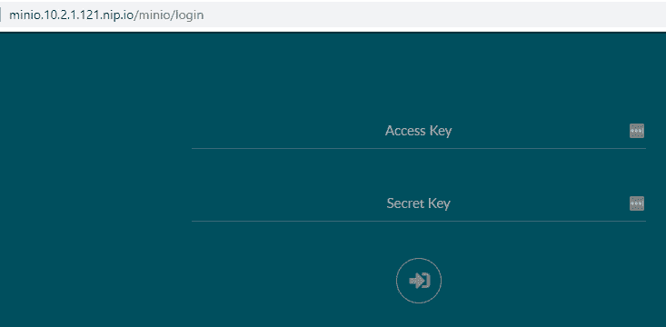
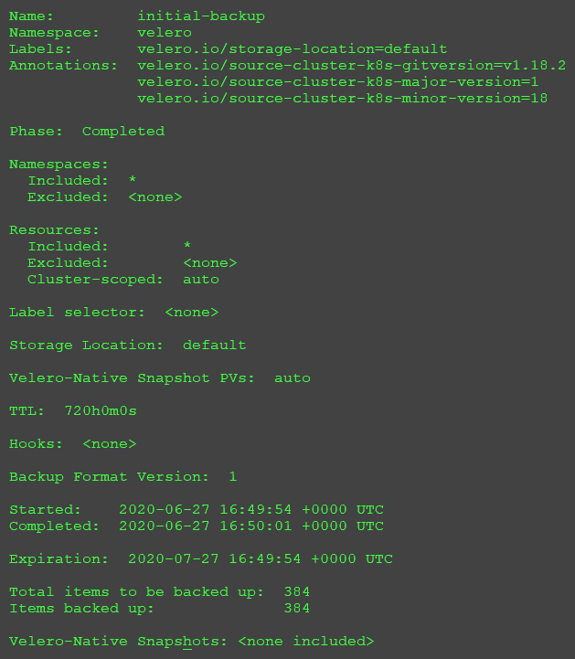
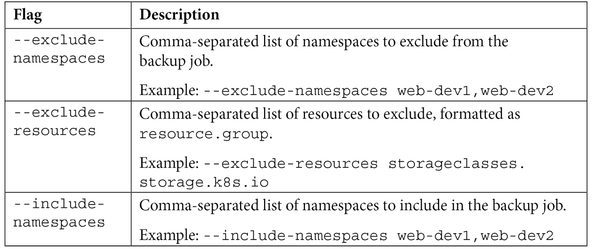
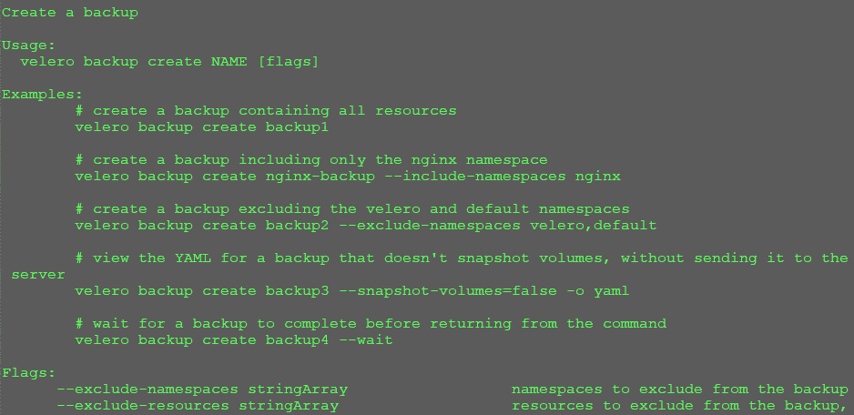

# 第十三章：备份工作负载

事故和灾难时常发生，就像您在现实生活中可能为这些事件购买了保险一样，您应该为您的集群和工作负载购买保险。

大多数 Kubernetes 发行版不包括任何用于备份工作负载的组件，但是有许多产品可供选择，既有来自开源社区的解决方案，也有来自公司（如 Kasten）的供应商支持的解决方案。

在本章中，您将了解到 Velero，它可以用来备份集群中的工作负载。我们将解释如何使用 Velero 来备份命名空间和调度备份作业，以及如何恢复工作负载。

在本章中，我们将涵盖以下主题：

+   理解 Kubernetes 备份

+   执行 etcd 备份

+   介绍和设置 Heptio 的 Velero

+   使用 Velero 来备份工作负载

+   使用 CLI 管理 Velero

+   从备份中恢复

# 技术要求

为了在本章中进行实际操作实验，您需要以下内容：

+   一个 KinD Kubernetes 集群

+   一个新的 Ubuntu 18.04 服务器，至少有 4GB 的 RAM

您可以在以下 GitHub 存储库中访问本章的代码：[`github.com/PacktPublishing/Kubernetes-and-Docker-The-Complete-Guide`](https://github.com/PacktPublishing/Kubernetes-and-Docker-The-Complete-Guide)。

# 理解 Kubernetes 备份

备份 Kubernetes 集群需要备份不仅运行在集群上的工作负载，还需要备份集群本身。请记住，集群状态是在 etcd 数据库中维护的，这使得它成为一个非常重要的组件，您需要备份以便从任何灾难中恢复。

备份集群和运行的工作负载允许您执行以下操作：

+   迁移集群。

+   从生产集群创建一个开发集群。

+   从灾难中恢复集群。

+   从持久卷中恢复数据。

+   命名空间和部署恢复。

在本章中，我们将提供备份您的 etcd 数据库以及集群中的每个命名空间和对象的详细信息和工具。

重要提示

在企业中从完全灾难中恢复集群通常涉及备份各种组件的自定义 SSL 证书，例如 Ingress 控制器、负载均衡器和 API 服务器。

由于备份所有自定义组件的过程对所有环境来说都是不同的，我们将专注于大多数 Kubernetes 发行版中常见的程序。

正如您所知，集群状态是在 etcd 中维护的，如果您丢失所有 etcd 实例，您将丢失您的集群。在多节点控制平面中，您将至少有三个 etcd 实例，为集群提供冗余。如果您丢失一个实例，集群将继续运行，您可以构建一个新的 etcd 实例并将其添加到集群中。一旦新实例被添加，它将接收 etcd 数据库的副本，您的集群将恢复到完全冗余状态。

如果您丢失所有 etcd 服务器而没有对数据库进行任何备份，您将丢失集群，包括集群状态本身和所有工作负载。由于 etcd 非常重要，**etcdctl**实用程序包含内置的备份功能。

# 执行 etcd 备份

由于我们在 Kubernetes 集群中使用 KinD，我们可以创建 etcd 数据库的备份，但无法恢复它。

我们的 etcd 服务器在名为**etcd-cluster01-control-plane**的集群中的一个 pod 中运行，位于**kube-system**命名空间中。运行的容器包括**etcdctl**实用程序，我们可以使用**kubectl**命令执行备份。

## 备份所需的证书

大多数 Kubernetes 安装将证书存储在**/etc/kuberetes/pki**中。在这方面，KinD 并无不同，因此我们可以使用**docker cp**命令备份我们的证书。让我们看看如何在两个简单步骤中完成这个操作：

1.  首先，我们将创建一个目录来存储证书和 etcd 数据库。将您的目录更改为您克隆了书籍存储库的**chapter13**文件夹。在**chapter13**文件夹下，创建一个名为**backup**的目录，并将其设置为当前路径：

**mkdir backup cd ./backup**

1.  要备份位于 API 服务器上的证书，请使用以下**docker cp**命令：

**docker cp cluster01-control-plane:/etc/kubernetes/pki ./**

这将把控制平面节点上**pki**文件夹的内容复制到您的**localhost**中的**chapter13/backup/pki**文件夹中的新文件夹中。

下一步是创建 etcd 数据库的备份。

## 备份 etcd 数据库

要备份 KinD 集群上的 etcd 数据库，请按照以下步骤操作：

重要提示

旧版本的**etcdctl**需要您使用**ETCDCTL_API=3**将 API 版本设置为 3，因为它们默认使用版本 2 的 API。Etcd 3.4 将默认 API 更改为 3，因此在使用**etcdctl**命令之前，我们不需要设置该变量。

1.  在 etcd pod 中备份数据库并将其存储在容器的根文件夹中。使用**kubectl exec**，在 etcd pod 上运行一个 shell：

**kubectl exec -it etcd-cluster01-control-plane /bin/sh -n kube-system**

1.  在 etcd pod 中使用**etcdctl**备份 etcd 数据库：

**etcdctl snapshot save etcd-snapshot.db --endpoints=https://127.0.0.1:2379 --cacert=/etc/kubernetes/pki/etcd/ca.crt --cert=/etc/kubernetes/pki/etcd/healthcheck-client.crt --key=/etc/kubernetes/pki/etcd/healthcheck-client.key**

您将收到以下输出：

**{"level":"info","ts":1591637958.297016,"caller":"snapshot /v3_snapshot.go:110","msg":"created temporary db file","path":"etcd-snapshot.db.part"}**

**{"level":"warn","ts":"2020-06-08T17:39:18.323Z","caller":"clientv3/retry_interceptor.go:116","msg":"retry stream intercept"}**

**{"level":"info","ts":1591637958.3238735,"caller":"snapshot/v3_snapshot.go:121","msg":"fetching snapshot","endpoint":"https://127.0.0.1:2379"}**

**{"level":"info","ts":1591637958.7283804,"caller":"snapshot/v3_snapshot.go:134","msg":"fetched snapshot","endpoint":"https://127.0.0.1:2379","took":0.431136053}**

**快照保存在 etcd-snapshot.db 中**

**{"level":"info","ts":1591637958.732125,"caller":"snapshot /v3_snapshot.go:143","msg":"saved","path":"etcd-snapshot.db"}**

1.  退出 etcd pod。

1.  将备份复制到本地机器：

**kubectl cp kube-system/etcd-cluster01-control-plane:etcd-snapshot.db ./etcd-snap-kind.db**

1.  通过查看当前文件夹的内容来验证复制是否成功：

ls -la

您应该看到**pki**目录和 etcd 备份**etcd-snap-kind.db**。如果您没有看到备份，请重复这些步骤，并注意输出中是否有任何错误。

当然，这个过程只备份 etcd 数据库一次。在现实世界中，您应该创建一个定期执行 etcd 快照并将备份文件存储在安全位置的计划过程。

注意

由于 KinD 运行控制平面的方式，我们无法在本节中使用恢复过程。我们提供本节中的步骤，以便您了解如何在企业环境中恢复损坏的 etcd 数据库或节点。

# 介绍和设置 Heptio 的 Velero

Velero 是 Heptio 为 Kubernetes 提供的开源备份解决方案。它提供了许多商业产品中才有的功能，包括调度、备份钩子和细粒度的备份控制，而且全部都是免费的。

虽然 Velero 是免费的，但它有一个学习曲线，因为它不像大多数商业产品那样包含易于使用的 GUI。Velero 中的所有操作都是使用它们的命令行实用程序**velero**执行的。这个单一的可执行文件允许您安装 Velero 服务器，创建备份，检查备份的状态，恢复备份等。由于管理的每个操作都可以用一个文件完成，因此恢复集群的工作负载变得非常容易。在本章中，我们将创建第二个 KinD 集群，并使用现有集群的备份填充它。

但在此之前，我们需要满足一些要求。

## Velero 要求

Velero 由几个组件组成，用于创建备份系统：

+   **Velero CLI**：提供 Velero 组件的安装。用于所有备份和恢复功能。

+   **Velero 服务器**：负责执行备份和恢复程序。

+   **存储提供程序插件**：用于备份和恢复特定存储系统。

除了基本的 Velero 组件之外，您还需要提供一个对象存储位置，用于存储您的备份。如果您没有对象存储解决方案，可以部署 MinIO，这是一个提供 S3 兼容对象存储的开源项目。我们将在我们的 KinD 集群中部署 MinIO，以演示 Velero 提供的备份和恢复功能。

## 安装 Velero CLI

部署 Velero 的第一步是下载最新的 Velero CLI 二进制文件。要安装 CLI，请按照以下步骤操作：

1.  从 Velero 的 GitHub 存储库下载发布版本：

**wget  https://github.com/vmware-tanzu/velero/releases/download/v1.4.0/velero-v1.4.0-linux-amd64.tar.gz**

1.  提取存档的内容：

**tar xvf velero-v1.4.0-linux-amd64.tar.gz**

1.  将 Velero 二进制文件移动到**/usr/bin**：

**sudo mv velero-v1.4.0-linux-amd64/velero /usr/bin**

1.  通过检查版本来验证您是否可以运行 Velero CLI：

**velero version**

您应该从 Velero 的输出中看到您正在运行版本 1.4.0：

图 13.1-Velero 客户端版本输出

您可以安全地忽略最后一行，它显示了在查找 Velero 服务器时出现的错误。现在，我们安装的只是 Velero 可执行文件，所以下一步我们将安装服务器。

## 安装 Velero

Velero 具有最低的系统要求，其中大部分都很容易满足：

+   运行版本 1.10 或更高版本的 Kubernetes 集群

+   Velero 可执行文件

+   系统组件的图像

+   兼容的存储位置

+   卷快照插件（可选）

根据您的基础设施，您可能没有兼容的位置用于备份或快照卷。幸运的是，如果您没有兼容的存储系统，有一些开源选项可以添加到您的集群中以满足要求。

在下一节中，我们将解释本地支持的存储选项，由于我们的示例将使用 KinD 集群，我们将安装开源选项以添加兼容的存储用作备份位置。

### 备份存储位置

Velero 需要一个兼容 S3 存储桶来存储备份。有许多官方支持的系统，包括来自 AWS、Azure 和 Google 的所有对象存储产品。

除了官方支持的提供者外，还有许多社区和供应商支持的提供者，来自数字海洋、惠普和 Portworx 等公司。以下图表列出了所有当前的提供者：

重要提示

在下表中，**备份支持**列表示插件提供了一个兼容的位置来存储 Velero 备份。卷快照支持表示插件支持备份持久卷。

表 13.1 – Velero 存储选项

注意

Velero 的 AWS S3 驱动器与许多第三方存储系统兼容，包括 EMC ECS、IBM Cloud、Oracle Cloud 和 MinIO。

如果您没有现有的对象存储解决方案，您可以部署开源 S3 提供者 MinIO。

现在我们已经安装了 Velero 可执行文件，并且我们的 KinD 集群具有持久存储，这要归功于 Rancher 的自动配置程序，我们可以继续进行第一个要求 - 为 Velero 添加一个兼容的 S3 备份位置。

### 部署 MinIO

MinIO 是一个开源的对象存储解决方案，与 Amazon 的 S3 云服务 API 兼容。您可以在其 GitHub 存储库上阅读有关 MinIO 的更多信息[`github.com/minio/minio`](https://github.com/minio/minio)。

如果您使用互联网上的清单安装 MinIO，请务必在尝试将其用作备份位置之前验证部署中声明了哪些卷。互联网上的许多示例使用**emptyDir: {}**，这是不持久的。

我们在**chapter13**文件夹中包含了来自 Velero GitHub 存储库的修改后的 MinIO 部署。由于我们的集群上有持久存储，我们编辑了部署中的卷，以使用**PersistentVolumeClaims**（**PVCs**），这将使用 Velero 的数据和配置的自动配置程序。

要部署 MinIO 服务器，请切换到**chapter13**目录并执行**kubectl create**。部署将在您的 KinD 集群上创建一个 Velero 命名空间、PVCs 和 MinIO：

kubectl create -f minio-deployment.yaml

这将部署 MinIO 服务器，并将其暴露为端口 9000/TCP 的**minio**，如下所示：

图 13.2 - Minio 服务创建

MinIO 服务器可以被集群中的任何 pod 以正确的访问密钥使用**minio.velero.svc**的 9000 端口进行访问。

### 暴露 MinIO 仪表板

MinIO 包括一个仪表板，允许您浏览服务器上 S3 存储桶的内容。为了允许访问仪表板，您可以部署一个暴露 MinIO 服务的 Ingress 规则。我们在**chapter13**文件夹中包含了一个示例 Ingress 清单。您可以使用包含的文件创建它，或者使用以下清单创建：

1.  记得将主机更改为在**nip.io** URL 中包含主机 IP 地址：

apiVersion: networking.k8s.io/v1beta1

类型：Ingress

元数据：

名称：minio-ingress

命名空间：velero

规范：

规则：

- host: minio.[hostip].nip.io

http:

路径：

- 路径：/

后端：

serviceName: minio

servicePort: 9000

1.  部署后，您可以在任何机器上使用浏览器打开您用于 Ingress 规则的 URL。在我们的集群上，主机 IP 是**10.2.1.121**，所以我们的 URL 是**minio.10.2.1.121.nip.io**：

图 13.3 - MinIO 仪表板

1.  要访问仪表板，请提供 MinIO 部署中的访问密钥和秘密密钥。如果您使用了来自 GitHub 存储库的 MinIO 安装程序，则访问密钥和秘密密钥为**packt**/**packt**。

1.  登录后，您将看到一个存储桶列表以及其中存储的任何项目。现在它将相当空，因为我们还没有创建备份。在我们执行 KinD 集群的备份后，我们将重新访问仪表板：

图 13.4 - MinIO 浏览器

重要提示

如果您是对象存储的新手，重要的是要注意，虽然这在您的集群中部署了一个存储解决方案，但它**不会**创建 StorageClass 或以任何方式与 Kubernetes 集成。所有对 S3 存储桶的 pod 访问都是使用我们将在下一节提供的 URL 完成的。

现在您已经运行了一个兼容 S3 的对象存储，您需要创建一个配置文件，Velero 将使用它来定位您的 MinIO 服务器。

### 创建 S3 目标配置

首先，我们需要创建一个包含 S3 存储桶凭据的文件。当我们从 **chapter13** 文件夹部署 MinIO 清单时，它创建了一个初始密钥 ID 和访问密钥，**packt**/**packt**：

1.  在 **chapter13** 文件夹中创建一个名为 **credentials-velero** 的新凭据文件：

**vi credentials-velero**

1.  将以下行添加到凭据文件中并保存该文件：

[default]

aws_access_key_id = packt

aws_secret_access_key = packt

现在，我们可以使用 Velero 可执行文件和 **install** 选项部署 Velero。

1.  使用以下命令在 **chapter13** 文件夹内执行 Velero 安装以部署 Velero：

**velero install \**

**     --provider aws \**

--插件 velero/velero-plugin-for-aws:v1.1.0 \

**     --bucket velero \**

**     --secret-file ./credentials-velero \**

**     --use-volume-snapshots=false \**

**     --backup-location-config region=minio,s3ForcePathStyle="true",s3Url=http://minio.velero.svc:9000**

让我们解释安装选项以及值的含义：

表 13.2 – Velero 安装选项

当您执行安装时，您将看到创建了许多对象，包括 Velero 用于处理备份和恢复操作的一些 **CustomResourceDefinitions** (**CRDs**) 和 secrets。如果您在 Velero 服务器启动时遇到问题，有一些 CRDs 和 secrets 可能包含不正确的信息，您可以查看一下。在下表中，我们解释了在使用 Velero 时可能需要与之交互的一些常见对象：

表 13.3 – Velero 的 CRDs 和 Secrets

虽然您与这些对象的大部分交互将通过 Velero 可执行文件进行，但始终要了解实用程序如何与 API 服务器交互是一个好习惯。如果您无法访问 Velero 可执行文件，但需要快速查看或可能更改对象值以解决问题，了解对象及其功能是有帮助的。

现在我们已经安装了 Velero，并且对 Velero 对象有了高层次的理解，我们可以继续为集群创建不同的备份作业。

# 使用 Velero 备份工作负载

Velero 支持使用单个命令或定期计划运行“一次性”备份。无论您选择运行单个备份还是定期备份，都可以使用**include**和**exclude**标志备份所有对象或仅特定对象。

## 运行一次性集群备份

要创建初始备份，您可以运行一个单个的 Velero 命令，该命令将备份集群中的所有命名空间。

执行备份而不使用任何包括或排除任何集群对象的标志将备份每个命名空间和命名空间中的所有对象。

要创建一次性备份，请使用**velero**命令和**backup create <backup name>**选项。在我们的示例中，我们将备份命名为**initial-backup**：

velero backup create initial-backup

您将收到的唯一确认是备份请求已提交：

备份请求“initial-backup”成功提交。

运行`velero backup describe initial-backup`或`velero backup logs initial-backup`以获取更多详细信息。

幸运的是，Velero 还告诉您检查备份状态和日志的命令。输出的最后一行告诉我们，我们可以使用**velero**命令和**backup**选项以及**describe**或**logs**来检查备份操作的状态。

**describe**选项将显示作业的所有详细信息：

图 13.5 - Velero 描述输出

注意

为了加强前一节中提到的 Velero 使用的一些 CRD，我们还想解释一下 Velero 实用程序从哪里检索这些信息。

创建的每个备份都将在 Velero 命名空间中创建一个备份对象。对于我们的初始备份，创建了一个名为**initial-backup**的新备份对象。使用**kubectl**，我们可以描述对象以查看与 Velero 可执行文件提供的类似信息。

如*图 13.5*所示，**describe**选项会显示备份作业的所有设置。由于我们没有向备份请求传递任何选项，该作业包含所有命名空间和对象。要验证的一些最重要的细节是阶段、要备份的总项目数以及已备份的项目数。

如果阶段的状态不是**success**，则您的备份中可能没有您想要的所有项目。检查已备份的项目也是一个好主意；如果已备份的项目数少于要备份的项目数，那么我们的备份没有备份所有项目。

您可能需要检查备份的状态，但可能没有安装 Velero 可执行文件。由于这些信息在 CR 中，我们可以描述 CR 以检索备份详细信息。在备份对象上运行**kubectl describe**将显示备份的状态：

kubectl describe backups initial-backup -n velero

如果我们跳到**describe**命令的输出底部，您将看到以下内容： 

图 13.6 – 备份资源的 kubectl describe 输出

在输出中，您可以看到阶段已完成，开始和完成时间，以及已备份和包含在备份中的对象数量。

使用可以根据日志文件中的信息或对象状态生成警报的集群附加组件是一个很好的做法，比如 AlertManager。您总是希望备份成功，如果备份失败，应立即查找失败原因。

## 安排集群备份

如果您安排了集群操作或命名空间中有重大软件升级，那么创建一次性备份是有用的。由于这些事件将很少发生，您会希望安排定期备份集群，而不是随机的一次性备份。

要创建定期备份，您可以使用**schedule**选项并创建一个带有 Velero 可执行文件的标签。除了计划和创建之外，您还需要为作业提供一个名称和**schedule**标志，该标志接受基于*cron*的表达式。以下计划告诉 Velero 每天凌晨 1 点备份：

图 13.7 – Cron 调度表达式

使用 *图 13.7* 中的信息，我们可以创建一个备份，将在凌晨 1 点创建一个备份，使用以下 **velero schedule create** 命令：

velero schedule create cluster-daily --schedule="0 1 * * *"

Velero 将回复计划已成功创建：

计划 "cluster-daily" 成功创建。

如果您不熟悉 cron 和可用的选项，您应该阅读 cron 包文档 [`godoc.org/github.com/robfig/cron`](https://godoc.org/github.com/robfig/cron)。

cron 还将接受一些简写表达式，这可能比使用标准 cron 表达式更容易。以下表格包含预定义计划的简写：

表 13.4 – cron 简写调度

使用简写表中的值来安排每天午夜执行的备份作业，我们使用以下 Velero 命令：

velero schedule create cluster-daily --schedule="@daily"

计划作业将在执行作业时创建一个备份对象。备份名称将包含计划的名称，后跟破折号和备份的日期和时间。使用前面示例中的名称，我们的初始备份的名称为 **cluster-daily-20200627174947**。这里，**20200627** 是备份运行的日期，**174947** 是备份在 UTC 时间中运行的时间。这相当于 **2020-06-27 17:49:47 +0000 UTC**。

到目前为止，我们所有的示例都已配置为备份集群中的所有命名空间和对象。您可能需要创建不同的计划或根据特定集群排除/包含某些对象。

在下一节中，我们将解释如何创建一个自定义备份，允许您使用特定标签来包含和排除命名空间和对象。

## 创建自定义备份

当您创建任何备份作业时，您可以提供标志来自定义备份作业中将包含或排除的对象。以下是一些最常见的标志的详细信息：

表 13.5 – Velero 备份标志

要创建一个每天运行并且只包含 Kubernetes 系统命名空间的计划备份，我们将使用 **--include-namespaces** 标志创建一个计划作业：

velero schedule create cluster-ns-daily --schedule="@daily" --include-namespaces ingress-nginx,kube-node-lease,kube-public,kube-system,local-path-storage,velero

由于 Velero 命令使用 CLI 进行所有操作，我们应该从解释你将用来管理备份和恢复操作的常见命令开始。

# 使用 CLI 管理 Velero

现在，所有的 Velero 操作必须使用 Velero 可执行文件完成。在没有 GUI 的情况下管理备份系统一开始可能会有挑战，但一旦你熟悉了 Velero 管理命令，执行操作就变得容易了。

Velero 可执行文件接受两个选项：

+   命令

+   标志

命令是诸如**backup**、**restore**、**install**和**get**之类的操作。大多数初始命令需要第二个命令来完成操作。例如，**backup**命令需要另一个命令，比如**create**或**delete**，才能形成一个完整的操作。

有两种类型的标志 - 命令标志和全局标志。全局标志是可以为任何命令设置的标志，而命令标志是特定于正在执行的命令的。

像许多 CLI 工具一样，Velero 包括每个命令的内置帮助。如果你忘记了一些语法，或者想知道可以与命令一起使用哪些标志，你可以使用**-h**标志来获取帮助：

velero backup create -h

以下是**backup create**命令的简化帮助输出：

图 13.8 - Velero 帮助输出

我们发现 Velero 的帮助系统非常有帮助；一旦你熟悉了 Velero 的基础知识，你会发现内置的帮助为大多数命令提供了足够的信息。

## 使用常见的 Velero 命令

由于你们中的许多人可能是新手，我们想要提供一个快速概述，介绍最常用的命令，让你们熟悉 Velero 的操作。

### 列出 Velero 对象

正如我们已经提到的，Velero 管理是通过使用 CLI 来驱动的。你可以想象，随着你创建额外的备份作业，记住已经创建了什么可能会变得困难。这就是**get**命令派上用场的地方。

CLI 可以检索或获取以下 Velero 对象的列表：

+   备份位置

+   备份

+   插件

+   恢复

+   计划

+   快照位置

正如你们所期望的那样，执行**velero get <object>**将返回 Velero 管理的对象列表：

velero get backups

以下是输出：

图 13.9 - velero get 输出

所有的**get**命令都会产生类似的输出，其中包含每个对象的名称和对象的任何唯一值。

**get**命令对于快速查看存在的对象非常有用，但通常用作执行下一个**describe**命令的第一步。

### 检索 Velero 对象的详细信息

在获取要获取详细信息的对象的名称后，您可以使用**describe**命令获取对象的详细信息。使用上一节中**get**命令的输出，我们想查看**cluster-daily-20200627175009**备份作业的详细信息：

velero describe backup cluster-daily-20200627175009

该命令的输出提供了请求对象的所有细节。您将发现自己使用**describe**命令来解决诸如备份失败之类的问题。

### 创建和删除对象

由于我们已经多次使用了**create**命令，所以在本节中我们将专注于**delete**命令。

总之，**create**命令允许您创建将由 Velero 管理的对象，包括备份、计划、还原以及备份和快照的位置。我们已经创建了一个备份和一个计划，在下一节中，我们将创建一个还原。

一旦创建了一个对象，您可能会发现需要删除它。要在 Velero 中删除对象，您可以使用**delete**命令，以及您想要删除的对象和名称。

在我们的**get backups**输出示例中，我们有一个名为**day2**的备份。要删除该备份，我们将执行以下**delete**命令：

velero delete backup day2

由于删除是一个单向操作，您需要确认您要删除该对象。一旦确认，可能需要几分钟才能从 Velero 中删除该对象，因为它会等到所有关联数据都被删除：

图 13.10 - Velero 删除输出

正如您在输出中所看到的，当我们删除一个备份时，Velero 将删除该备份的所有对象，包括快照的备份文件和还原。

还有其他命令可以使用，但本节涵盖的命令是您需要熟悉 Velero 的主要命令。

现在您可以创建和安排备份，并知道如何在 Velero 中使用帮助系统，我们可以继续使用备份来还原对象。

# 从备份中还原

带着一些幸运，你很少需要执行任何 Kubernetes 对象的恢复。即使你在 IT 领域工作时间不长，你可能也经历过个人情况，比如硬盘故障或者意外删除了重要文件。如果你没有丢失数据的备份，这是非常令人沮丧的情况。在企业世界中，丢失数据或没有备份可能会导致巨额收入损失，或者在一些受监管的行业中，可能会面临巨额罚款。

要从备份中运行恢复，您可以使用**create restore**命令和**--from-backup <backup name>**标签。

在本章的前面，我们创建了一个单一的一次性备份，名为**initial-backup**，其中包括集群中的每个命名空间和对象。如果我们决定需要恢复该备份，我们将使用 Velero CLI 执行恢复：

velero restore create --from-backup initial-backup

**restore**命令的输出可能看起来有些奇怪：

恢复请求"initial-backup-20200627194118"提交成功。

乍一看，似乎已经发出了一个备份请求，因为 Velero 回复说**"initial-backup-20200627194118"提交成功**。Velero 使用备份名称创建恢复请求，因为我们将备份命名为**initial-backup**，所以恢复作业名称将使用该名称并附加恢复请求的日期和时间。

您可以使用**describe**命令查看恢复的状态：

velero restore describe initial-backup-20200627194118

根据恢复的大小，可能需要一些时间来恢复整个备份。在恢复阶段，备份的状态将是**InProgress**。完成后，状态将变为**Completed**。

## 恢复中的操作

在我们掌握了所有的理论知识之后，让我们用两个例子来看看 Velero 的实际操作。在这些例子中，我们将从一个简单的部署开始，然后在同一个集群上删除并恢复。下一个例子将更加复杂；我们将使用我们主要的 KinD 集群的备份，并将集群对象恢复到一个新的 KinD 集群中。

### 从备份中恢复部署

对于第一个例子，我们将使用 NGINX Web 服务器创建一个简单的部署。我们将部署该应用程序，验证它是否按预期工作，然后删除部署。使用备份，我们将恢复部署，并通过浏览到 Web 服务器的主页来测试恢复是否成功。

我们在您克隆的存储库的**chapter13**文件夹中包含了一个部署。此部署将创建一个新的命名空间，NGINX 部署，一个服务以及我们练习的 Ingress 规则。部署清单也已包含。

与本书中创建的任何 Ingress 规则一样，您需要编辑其 URL 以反映您主机的 IP 地址，以使**nip.io**正常工作。我们的实验室服务器的 IP 地址为**10.2.1.121** - 将此 IP 更改为您主机的 IP：

1.  从 GitHub 存储库中的**chapter13**文件夹中编辑清单**nginx-deployment.yaml**，以包括您的**niop.io** URL。您需要更改的部分如下所示：

规格：

规则：

- 主机：nginx-lab.10.2.1.121.nip.io

1.  使用**kubectl**部署清单：

**kubectl apply -f nginx-deployment.yaml**

这将创建我们部署所需的对象：

**namespace/nginx-lab created**

**pod/nginx-deployment created**

**ingress.networking.k8s.io/nginx-ingress created**

**service/nginx-lab created**

1.  最后，使用任何浏览器测试部署，并打开 Ingress 规则的 URL：

图 13.11 - 验证 NGINX 是否正在运行

现在您已经验证了部署是否正常工作，我们需要使用 Velero 创建一个备份。

### 备份命名空间

使用 Velero **create backup**命令创建新命名空间的一次性备份。将备份作业命名为**nginx-lab**：

velero create backup nginx-lab --include-namespaces=nginx-lab

由于命名空间只包含一个小部署，备份应该很快完成。使用**describe**命令验证备份是否已成功完成：

velero backup describe nginx-lab

验证阶段状态是否完成。如果阶段状态出现错误，您可能在**create backup**命令中错误输入了命名空间名称。

在您验证备份已成功后，您可以继续下一步。

### 模拟故障

为了模拟需要备份我们命名空间的事件，我们将使用**kubectl**删除整个命名空间：

kubectl 删除 ns nginx-lab

删除命名空间中的对象可能需要一分钟时间。一旦返回到提示符，删除应该已经完成。

通过在浏览器中打开 URL 来验证 NGINX 服务器是否没有响应；如果您正在使用最初的测试浏览器，请刷新页面。刷新或打开 URL 时应该会收到错误：

图 13.12-验证 NGINX 是否正在运行

确认 NGINX 部署已被删除后，我们将从备份中恢复整个命名空间和对象。

## 恢复命名空间

想象这是一个“现实世界”的场景。你接到一个电话，一个开发人员不小心删除了他们命名空间中的每个对象，而且他们没有源文件。

当然，您已经为这种类型的事件做好了准备。您的集群中有几个备份作业正在运行，您告诉开发人员，您可以从备份中将其恢复到昨晚的状态：

1.  我们知道备份的名称是**nginx-lab**，因此使用 Velero，我们可以使用**--from-backup**选项执行**restore create**命令：

**velero create restore --from-backup nginx-lab**

1.  Velero 将返回一个已提交的恢复作业：

**恢复请求“nginx-lab-20200627203049”已成功提交。**

**运行`velero restore describe nginx-lab-20200627203049`或`velero restore logs nginx-lab-20200627203049`以获取更多详细信息。**

1.  您可以使用**velero restore describe**命令来检查状态：

**velero restore describe nginx-lab-20200627203049**

1.  验证阶段状态是否显示**已完成**，并通过浏览 URL 或刷新页面来验证部署是否已恢复，如果您已经打开了页面：

图 13.13-验证 NGINX 是否已恢复

恭喜，您刚刚通过备份命名空间来节省了开发人员大量的工作！

Velero 是一个强大的产品，您应该考虑在每个集群中使用它来保护工作负载免受灾难。

## 使用备份在新集群中创建工作负载

在集群中恢复对象只是 Velero 的一个用例。虽然对于大多数用户来说，这是主要的用例，但您也可以使用备份文件在另一个集群上恢复工作负载或所有工作负载。如果您需要创建一个新的开发或灾难恢复集群，这是一个有用的选项。

重要提示

请记住，Velero 备份作业只包括命名空间和命名空间中的对象。要将备份还原到新集群，你必须先运行一个运行 Velero 的集群，然后才能还原任何工作负载。

### 备份集群

在本章的这一部分，我们假设你已经看过这个过程几次，并且知道如何使用 Velero CLI。如果你需要复习，可以回到本章的前面几页参考，或者使用 CLI 的帮助功能。

首先，我们应该创建一些命名空间，并向每个命名空间添加一些部署，以使其更有趣：

1.  让我们创建一些演示命名空间：

**kubectl create ns demo1**

**kubectl create ns demo2**

**kubectl create ns demo3**

**kubectl create ns demo4**

1.  我们可以使用**kubectl run**命令向命名空间添加一个快速部署：

**kubectl run nginx --image=bitnami/nginx -n demo1**

**kubectl run nginx --image=bitnami/nginx -n demo2**

**kubectl run nginx --image=bitnami/nginx -n demo3**

**kubectl run nginx --image=bitnami/nginx -n demo4**

现在我们有了一些额外的工作负载，我们需要创建集群的备份。

1.  使用备份名称**namespace-demo**备份新的命名空间：

**velero backup create namespace-demo --include-namespaces=demo1,demo2,demo3,demo4**

在继续之前，请验证备份是否已成功完成。

### 构建一个新的集群

由于我们只是演示了 Velero 如何从备份在新集群上创建工作负载，我们将创建一个简单的单节点 KinD 集群作为我们的还原点：

注意

这一部分会有点复杂，因为你的**kubeconfig**文件中会有两个集群。如果你对切换配置上下文还不熟悉，一定要仔细跟着步骤走。

完成这个练习后，我们将删除第二个集群，因为我们不需要两个集群。

1.  创建一个名为**velero-restore**的新 KinD 集群：

**kind create cluster --name velero-restore**

这将创建一个包含控制平面和工作节点的新单节点集群，并将你的集群上下文设置为新集群。

1.  集群部署完成后，请验证你的上下文是否已切换到**velero-restore**集群：

**kubectl config get-contexts**

输出如下：

图 13.14 – 验证当前上下文

1.  验证当前上下文是否设置为**kind-velero-restore**集群。您将在正在使用的集群的当前字段中看到一个*****。

1.  最后，使用**kubectl**验证集群中的命名空间。您应该只能看到包含在新集群中的默认命名空间：

图 13.15 – 新集群命名空间

现在我们已经创建了一个新的集群，我们可以开始恢复工作负载的过程。第一步是在新集群上安装 Velero，并将现有的 S3 存储桶作为备份位置。

## 将备份还原到新集群

我们的新 KinD 集群已经运行起来，我们需要安装 Velero 来还原我们的备份。我们可以使用大部分与原始集群中使用的相同清单和设置，但由于我们在不同的集群中，我们需要将 S3 目标更改为我们用于公开 MinIO 仪表板的外部 URL。

### 在新集群中安装 Velero

我们已经在**chapter13**文件夹中有**credentials-velero**文件，所以我们可以直接使用**velero install**命令来安装 Velero：

1.  确保在**s3Url 目标**中更改 IP 地址为您主机的 IP 地址：

**velero install \**

**     --provider aws \**

**     --plugins velero/velero-plugin-for-aws:v1.1.0 \**

**     --bucket velero \**

**     --secret-file ./credentials-velero \**

**     --use-volume-snapshots=false \**

**     --backup-location-config region=minio,s3ForcePathStyle="true",s3Url=http://minio.10.2.1.121.nip.io**

1.  安装需要几分钟，但一旦 pod 运行起来，查看日志文件以验证 Velero 服务器是否正在运行并连接到 S3 目标：

**kubectl logs deployment/velero -n velero**

1.  如果您的所有设置都正确，Velero 日志将有一个条目，说明它已经在备份位置找到需要与新 Velero 服务器同步的备份（备份的数量可能对于您的 KinD 集群有所不同）：

**time="2020-06-27T22:14:02Z" level=info msg="在备份位置找到 9 个备份，这些备份在集群中不存在，需要同步" backupLocation=default controller=backup-sync logSource="pkg/controller/backup_sync_controller.go:196"**

1.  确认安装后，使用**velero get backups**验证 Velero 是否能够看到现有的备份文件：

图 13.16 – 查看新集群上的备份

您的备份列表将与我们的不同，但您应该看到与原始集群中相同的列表。

此时，我们可以使用任何备份文件在新集群中创建还原作业。

### 在新集群中还原备份

在本节中，我们将使用在上一节中创建的备份，并将工作负载恢复到全新的 KinD 集群，以模拟工作负载迁移。

在我们添加命名空间和部署后创建的原始集群的备份被称为 **namespace-demo**：

1.  使用该备份名称，我们可以通过运行 **velero restore create** 命令来还原命名空间和对象：

**velero create restore --from-backup=namespace-demo**

1.  在继续下一步之前，请等待还原完成。要验证还原是否成功，请使用 **velero describe restore** 命令和执行 **create restore** 命令时创建的还原作业的名称。在我们的集群中，还原作业被分配了名称 **namespace-demo-20200627223622**：

**velero restore describe namespace-demo-20200627223622**

1.  一旦阶段从 **InProgress** 更改为 **Completed**，请使用 **kubectl get ns** 验证您的新集群是否具有额外的演示命名空间：

图 13.17 – 查看新集群上的备份

1.  您将看到新的命名空间已创建，如果查看每个命名空间中的 pod，您将看到每个命名空间都有一个名为 **nginx** 的 pod。您可以使用 **kubectl get pods** 验证已创建的 pod。例如，要验证 demo1 命名空间中的 pod：**kubectl get pods -n demo1**

输出如下：

图 13.18 – 验证恢复命名空间中的 pod

恭喜！您已成功将一个集群中的对象恢复到新集群中。

### 删除新集群

由于我们不需要两个集群，让我们删除我们将备份还原到的新的 KinD 集群：

1.  要删除集群，请执行 **kind delete cluster** 命令：

**kind delete cluster --name velero-restore**

1.  将当前上下文设置为原始的 KinD 集群，**kind-cluster01**：

**kubectl config use-context kind-cluster01**

您现在可以继续阅读本书的最后一章，*第十四章*，*提供平台*。

# 摘要

备份集群和工作负载是任何企业集群的要求。在本章中，我们回顾了如何使用**etcdctl**和快照功能备份 etcd 集群数据库。我们还详细介绍了如何在集群中安装 Heptio 的 Velero 来备份和恢复工作负载。我们通过在新集群上恢复现有备份来复制现有备份中的工作负载来结束本章。

拥有备份解决方案可以让您从灾难或人为错误中恢复。典型的备份解决方案可以让您恢复任何 Kubernetes 对象，包括命名空间、持久卷、RBAC、服务和服务帐户。您还可以将一个集群中的所有工作负载恢复到完全不同的集群进行测试或故障排除。

接下来，在我们的最后一章中，我们将汇集本书中许多先前的教训，为您的开发人员和管理员构建一个平台。我们将添加源代码控制和流水线来构建一个平台，允许开发人员构建一个“项目”，检入源代码以创建一个运行的应用程序。

# 问题

1.  正确还是错误 - Velero 只能使用 S3 目标来存储备份作业。

A. True

B. False

1.  如果您没有对象存储解决方案，您如何使用后端存储解决方案（如 NFS）提供 S3 目标？

A. 你不能 - 没有办法在 NFS 前面添加任何东西来呈现 S3。

B. Kubernetes 可以使用本机 CSI 功能来实现这一点。

C. 安装 MinIO 并在部署中使用 NFS 卷作为持久磁盘。

D. 您不需要使用对象存储；您可以直接使用 NFS 与 Velero。

1.  正确还是错误 - Velero 备份只能在创建备份的同一集群上恢复。

A. True

B. False

1.  您可以使用什么实用程序来创建 etcd 备份？

A. Velero。

B. MinIO。

C. 没有理由备份 etcd 数据库。

D. **etcdctl**。

1.  哪个命令将创建一个每天凌晨 3 点运行的定期备份？

A. **velero create backup daily-backup**

B. **velero create @daily backup daily-backup**

C. **velero create backup daily-backup –schedule="@daily3am"**

D. **velero create schedule daily-backup --schedule="0 3 * * *"**
