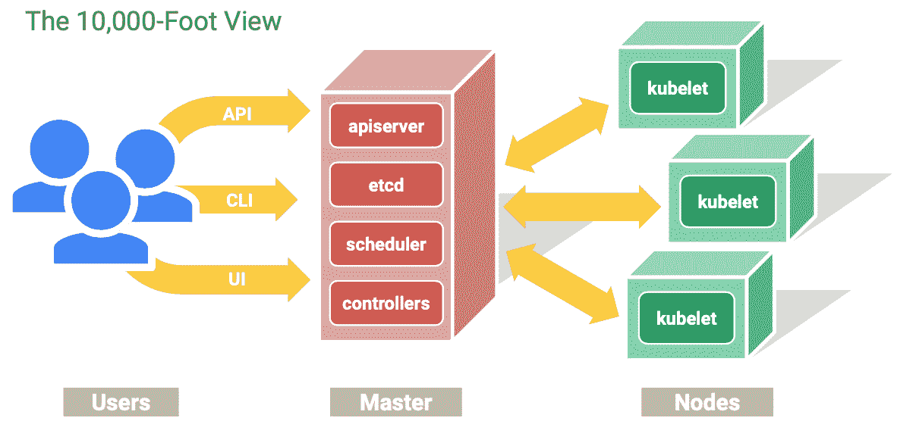

# *第一章*：介绍和安装 kubectl

Kubernetes 是一个开源的容器编排系统，用于在集群中管理跨多个主机的容器化应用程序。

Kubernetes 提供了应用部署、调度、更新、维护和扩展的机制。Kubernetes 的一个关键特性是，它积极地管理容器，以确保集群的状态始终符合用户的期望。

Kubernetes 使您能够快速响应客户需求，通过扩展或推出新功能。它还允许您充分利用您的硬件。

Kubernetes 包括以下内容：

+   **精简**: 轻量级、简单和易于访问

+   **可移植**: 公共、私有、混合和多云

+   **可扩展**: 模块化、可插拔、可挂钩、可组合和可工具化

+   **自愈**: 自动放置、自动重启和自动复制

Kubernetes 基于 Google 在规模上运行生产工作负载的十五年经验，结合了社区的最佳理念和最佳实践：



图 1.1 – Kubernetes 架构的一瞥

管理 Kubernetes 集群的一种方式是`kubectl`—Kubernetes 的命令行工具，它是一个用于访问 Kubernetes 集群的工具，允许您对 Kubernetes 集群运行不同的命令，以部署应用程序、管理节点、排除故障和更多。

在本章中，我们将涵盖以下主要主题：

+   介绍 kubectl

+   安装 kubectl

+   kubectl 命令

# 技术要求

要学习 kubectl，您将需要访问一个 Kubernetes 集群；它可以是这些云集群之一：

+   Google Cloud GKE: [`cloud.google.com/kubernetes-engine`](https://cloud.google.com/kubernetes-engine)

+   Azure AKS EKS: [`azure.microsoft.com/en-us/free/kubernetes-service`](https://azure.microsoft.com/en-us/free/kubernetes-service)

+   AWS EKS: [`aws.amazon.com/eks/`](https://aws.amazon.com/eks/)

+   DigitalOcean DOKS: [`www.digitalocean.com/docs/kubernetes/`](https://www.digitalocean.com/docs/kubernetes/)

或者，它可以是一个本地的：

+   KIND: [`kind.sigs.k8s.io/docs/user/quick-start/`](https://kind.sigs.k8s.io/docs/user/quick-start/)

+   Minikube: [`kubernetes.io/docs/setup/learning-environment/minikube/`](https://kubernetes.io/docs/setup/learning-environment/minikube/)

+   Docker 桌面版：[`www.docker.com/products/docker-desktop`](https://www.docker.com/products/docker-desktop)

在本书中，我们将使用 Google Cloud 的 GKE Kubernetes 集群。

# 介绍 kubectl

您可以使用`kubectl`来部署应用程序，检查和管理它们，检查集群资源，查看日志等。

`kubectl`是一个命令行工具，可以从您的计算机、CI/CD 流水线、操作系统的一部分或作为 Docker 镜像运行。它是一个非常适合自动化的工具。

`kubectl`在`$HOME`文件夹中寻找名为`.kube`的配置文件。在`.kube`文件中，`kubectl`存储访问 Kubernetes 集群所需的集群配置。您还可以设置`KUBECONFIG`环境变量或使用`--kubeconfig`标志指向`kubeconfig`文件。

# 安装 kubectl

让我们看看如何在 macOS、Windows 和 CI/CD 流水线上安装`kubectl`。

## 在 macOS 上安装

在 macOS 上安装`kubectl`的最简单方法是使用 Homebrew 软件包管理器（[`brew.sh/`](https://brew.sh/)）：

1.  要安装，请运行此命令：

```
$ brew install kubectl
```

1.  要查看您安装的版本，请使用此命令：

```
$ kubectl version –client --short
Client Version: v1.18.1
```

## 在 Windows 上安装

要在 Windows 上安装`kubectl`，您可以使用简单的命令行安装程序 Scoop（[`scoop.sh/`](https://scoop.sh/)）：

1.  要安装，请运行此命令：

```
$ scoop install kubectl
```

1.  要查看您安装的版本，请使用此命令：

```
$ kubectl version –client --short
Client Version: v1.18.1
```

1.  在您的主目录中创建`.kube`目录：

```
$ mkdir %USERPROFILE%\.kube
```

1.  导航到`.kube`目录：

```
$ cd %USERPROFILE%\.kube
```

1.  配置`kubectl`以使用远程 Kubernetes 集群：

```
$ New-Item config -type file
```

## 在 Linux 上安装

当您想在 Linux 上使用`kubectl`时，您有两个选项：

+   使用`curl`：

```
$ curl -LO https://storage.googleapis.com/kubernetes-release/release/`curl -s https://storage.googleapis.com/kubernetes-release/release/stable.txt`/bin/linux/amd64/kubectl
```

+   如果您的 Linux 系统支持 Docker 镜像，请使用[`hub.docker.com/r/bitnami/kubectl/`](https://hub.docker.com/r/bitnami/kubectl/)。

注意

Linux 是 CI/CD 流水线中非常常见的环境。

# kubectl 命令

要获取支持的`kubectl`命令列表，请运行此命令：

```
$ kubectl --help
```

`kubectl`命令按类别分组。让我们看看每个类别。

## 基本命令

以下是基本的`kubectl`命令：

+   `create`：从文件或`stdin`创建资源；例如，从文件创建 Kubernetes 部署。

+   `expose`：获取服务、部署或 pod 并将其公开为新的 Kubernetes 服务。

+   运行：在集群上运行特定的镜像。

+   `set`：在对象上设置特定功能，例如设置环境变量，在 pod 模板中更新 Docker 镜像等。

+   `explain`：获取资源的文档，例如部署的文档。

+   `get`: 显示一个或多个资源。例如，您可以获取正在运行的 pod 列表或 pod 的 YAML 输出。

+   `edit`: 编辑资源，例如编辑部署。

+   `delete`: 通过文件名、`stdin`、资源和名称或资源和标签选择器删除资源。

## 部署命令

以下是`kubectl`部署命令：

+   `rollout`: 管理资源的部署。

+   `scale`: 为部署、ReplicaSet 或 StatefulSet 设置新的大小。

+   `autoscale`: 自动扩展部署、ReplicaSet 或 StatefulSet。

## 集群管理命令

以下是`kubectl`集群管理命令：

+   `证书`: 修改证书资源。

+   `cluster-info`: 显示集群信息。

+   `top`: 显示资源（CPU/内存/存储）使用情况。

+   `cordon`: 将节点标记为不可调度。

+   `uncordon`: 将节点标记为可调度。

+   `drain`: 准备维护时排空节点。

+   `taint`: 更新一个或多个节点的污点。

## 故障排除和调试命令

以下是`kubectl`故障排除和调试命令：

+   `describe`: 显示特定资源或资源组的详细信息。

+   `logs`: 打印 pod 中容器的日志。

+   `attach`: 连接到正在运行的容器。

+   `exec`: 在容器中执行命令。

+   `port-forward`: 将一个或多个本地端口转发到一个 pod。

+   `proxy`: 运行到 Kubernetes API 服务器的代理。

+   `cp`: 将文件和目录复制到容器中并从容器中复制出来。

+   `auth`: 检查授权。

## 高级命令

以下是`kubectl`高级命令：

+   `diff`: 显示实际版本与将要应用版本的差异。

+   `apply`: 通过文件名或`stdin`将配置应用到资源。

+   `patch`: 使用策略合并补丁更新资源的字段。

+   `replace`: 通过文件名或`stdin`替换资源。

+   `wait`: 等待一个或多个资源的特定条件。

+   `convert`: 在不同的 API 版本之间转换配置文件。

+   `kustomize`: 从目录或远程 URL 构建 kustomization 目标。

## 设置命令

以下是`kubectl`中的设置命令：

+   `label`: 更新资源的标签。

+   `annotate`: 更新资源的注释。

## 其他命令

以下是`kubectl`中使用的其他几个命令：

+   `alpha`: 用于 alpha 功能的命令。

+   `api-resources`: 打印服务器上支持的 API 资源。

+   `api-versions`: 以组/版本的形式打印服务器上支持的 API 版本。

+   `config`: 修改`kube-config`文件。

+   `插件`：提供与插件交互的实用工具。

+   `版本`：打印客户端和服务器版本信息。

从列表中可以看出，命令被分成不同的组。在接下来的章节中，我们将学习大部分但不是所有这些命令。

在撰写本文时，`kubectl`的版本是 1.18；随着更新版本的推出，命令可能会发生变化。

# 总结

在本章中，我们已经学习了`kubectl`是什么，以及如何在 macOS、Windows 和 CI/CD 流水线上安装它。我们还查看了`kubectl`支持的不同命令以及它们的功能。

在下一章中，我们将学习如何使用`kubectl`获取有关 Kubernetes 集群的信息。
