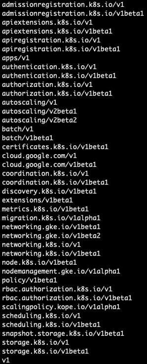
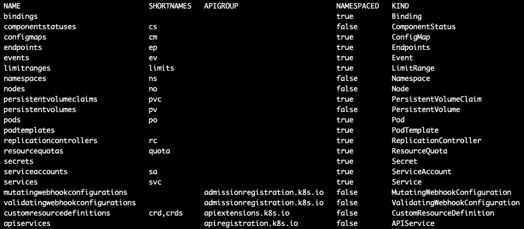

# 第二章：获取有关集群的信息

当您管理 Kubernetes 集群时，有必要了解它正在运行的 Kubernetes 版本，关于主节点（也称为控制平面）的详细信息，集群上安装的任何插件，以及可用的 API 和资源。由于不同的 Kubernetes 版本支持不同的资源 API 版本，如果未为您的 Ingress 设置正确/不支持的 API 版本，例如，将导致部署失败。

在本章中，我们将涵盖以下主题：

+   集群信息

+   集群 API 版本

+   集群 API 资源

# 集群信息

始终了解安装在 Kubernetes 集群上的 Kubernetes 服务器（API）的版本是一个好习惯，因为您可能希望使用该版本中可用的特定功能。要检查服务器版本，请运行以下命令：

```
$ kubectl version --short
Client Version: v1.18.1
Server Version: v1.17.5-gke.9
```

服务器版本为`v1.17.5`，`kubectl`版本为`v1.18.1`。请注意，服务器版本的`-gke.9`部分是内部 GKE 修订版；正如我们之前提到的，为了本书的目的，使用了 GKE 集群。

重要提示

`kubectl`版本可以是更新的版本；它实际上不必与服务器版本匹配，因为最新版本通常向后兼容。但是，不建议使用较旧的`kubectl`版本与更新的服务器版本。

接下来，让我们通过运行以下命令检查集群服务器信息：

```
$ kubectl cluster-info
Kubernetes master is running at https://35.223.200.75
GLBCDefaultBackend is running at https://35.223.200.75/api/v1/namespaces/kube-system/services/default-http-backend:http/proxy
KubeDNS is running at https://35.223.200.75/api/v1/namespaces/kube-system/services/kube-dns:dns/proxy
Metrics-server is running at https://35.223.200.75/api/v1/namespaces/kube-system/services/https:metrics-server:/proxy
```

在前面的输出日志中，我们看到了以下内容：

+   主端点 IP（`35.223.200.75`），您的`kubectl`连接到 Kubernetes API。

+   已安装插件的列表，在此设置中更多地是针对 GKE 集群的：

a. `GLBDefaultBackend`

b. `KubeDNS`

c. `Metrics-server`

插件列表将在基于云和本地安装之间有所不同。

最后，让我们使用以下命令检查集群节点信息：

```
$ kubectl get nodes
```

上述命令的输出如下截图所示：


图 2.1 - 显示节点信息的输出

上述命令显示了集群中可用节点的列表，以及它们的状态和 Kubernetes 版本。

# 集群 API 版本

检查可用的集群 API 版本是一个良好的做法，因为每个新的 Kubernetes 版本通常会带来新的 API 版本，并废弃/删除一些旧的版本。

要获取 API 列表，请运行以下命令：

```
$ kubectl api-versions
```

上面命令的输出给出了 API 列表，如下截屏所示：



图 2.2 - API 列表

您需要知道哪些 API 可以在您的应用程序中使用，否则，如果您使用的 API 版本不再受支持，部署可能会失败。

# 集群资源列表

另一个方便的列表是资源列表，它显示了可用资源、它们的短名称（用于`kubectl`）、资源所属的 API 组、资源是否有命名空间，以及`KIND`类型。

要获取资源列表，请运行以下命令：

```
$ kubectl api-resources
```

上面的命令给出了以下资源列表：



图 2.3 - 资源列表

由于列表相当长，我们在上一个截屏中只显示了部分内容。

获取资源列表将帮助您使用短资源名称运行`kubectl`命令，并了解资源属于哪个 API 组。

# 总结

在本章中，我们学会了如何使用`kubectl`获取有关 Kubernetes 集群、可用 API 以及集群中的 API 资源的信息。

在下一章中，我们将看看如何获取 Kubernetes 集群中存在的节点的信息。
