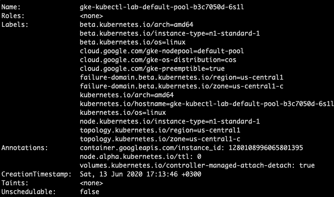

# 第三章：使用节点

熟悉 Kubernetes 的人都知道，集群工作负载在节点上运行，所有 Kubernetes pod 都会被调度、部署、重新部署和销毁。

Kubernetes 通过将容器放入 pod 中并将其调度到节点上来运行工作负载。节点可能是虚拟的或物理的机器，这取决于集群的设置。每个节点都有运行 pod 所需的服务，由 Kubernetes 控制平面管理。

节点的主要组件如下：

+   **kubelet**：注册/注销节点到 Kubernetes API 的代理。

+   **容器运行时**：这个运行容器。

+   **kube-proxy**：网络代理。

如果 Kubernetes 集群支持节点自动扩展，那么节点可以按照自动扩展规则的指定而来去：通过设置最小和最大节点数。如果集群中运行的负载不多，不必要的节点将被移除到自动扩展规则设置的最小节点数。当负载增加时，将部署所需数量的节点以容纳新调度的 pod。

有时候您需要排除故障，获取有关集群中节点的信息，找出它们正在运行哪些 pod，查看它们消耗了多少 CPU 和内存等。

总会有一些情况，您需要停止在某些节点上调度 pod，或将 pod 重新调度到不同的节点，或暂时禁用对某些节点的任何 pod 的调度，移除节点，或其他任何原因。

在本章中，我们将涵盖以下主要主题：

+   获取节点列表

+   描述节点

+   显示节点资源使用情况

+   封锁节点

+   排水节点

+   移除节点

+   节点池简介

# 获取节点列表

要开始使用节点，您首先需要获取它们的列表。要获取节点列表，请运行以下命令：

```
$ kubectl get nodes
```

使用上述命令，我们得到以下节点列表：


图 3.1 – 节点列表

前面的列表显示我们的 Kubernetes 集群中有三个节点，状态为`Ready`，Kubernetes 版本为`1.17.5-gke.9`。然而，如果您有自动扩展的云支持节点池，您的节点列表可能会有所不同，因为节点将根据集群中运行的应用程序数量而添加/删除。

# 描述节点

`kubectl describe` 命令允许我们获取 Kubernetes 集群中对象的状态、元数据和事件。在本节中，我们将使用它来描述节点。

我们得到了一个节点列表，所以让我们来看看其中的一个：

1.  要描述一个节点，请运行以下命令：

```
$ kubectl describe node gke-kubectl-lab-default-pool-b3c7050d-6s1l
```

由于命令的输出相当庞大，我们将只显示其中的一部分。您可以自行查看完整的输出。

1.  在以下截图中，我们看到了为节点分配的 `标签`（可用于组织和选择对象的子集）和 `注释`（有关节点的额外信息存储在其中），以及 `Unschedulable: false` 表示节点接受将 pod 调度到其上。例如，`标签` 可用于 `节点亲和性`（允许我们根据节点上的标签来限制 pod 可以被调度到哪些节点上）来调度特定节点上的 pod：

图 3.2 – 节点描述 – 检查标签和注释

1.  在以下截图中，我们看到了分配的内部和外部 IP、内部 DNS 名称和主机名：

图 3.3 – 节点描述 – 分配的内部和外部 IP

1.  以下截图显示了节点上运行的 pod，以及每个 pod 的 CPU/内存请求和限制：

图 3.4 – 节点描述 – 每个 pod 的 CPU/内存请求和限制

1.  以下截图显示了为节点分配的资源：


图 3.5 – 节点描述 – 为节点分配的资源

正如您所看到的，`$ kubectl describe node` 命令允许您获取有关节点的各种信息。

# 显示节点资源使用情况

了解节点消耗了哪些资源是很方便的。要显示节点使用的资源，请运行以下命令：

```
$ kubectl top nodes
```

我们使用上述命令得到了以下节点列表：


图 3.6 – 使用的资源最多的节点列表

上一个命令显示节点指标，如 CPU 核心、内存（以字节为单位）以及 CPU 和内存使用百分比。

此外，通过使用`$ watch kubectl top nodes`，您可以在实时监控节点，例如，在对应用进行负载测试或进行其他节点操作时。

注意

`watch`命令可能不在您的计算机上，您可能需要安装它。`watch`命令将运行指定的命令，并每隔几秒刷新屏幕。

# 节点隔离

假设我们要运行一个应用的负载测试，并且希望将一个节点从负载测试中排除。在*获取节点列表*部分看到的节点列表中，我们有三个节点，它们都处于`Ready`状态。让我们选择一个节点，`gke-kubectl-lab-default-pool-b3c7050d-8jhj`，我们不希望在其上调度新的 pod。

`kubectl`有一个名为`cordon`的命令，允许我们使节点不可调度。

```
$ kubectl cordon -h
Mark node as unschedulable.
Examples:
  # Mark node "foo" as unschedulable.
  kubectl cordon foo
Options:
      --dry-run='none': Must be "none", "server", or "client". If client strategy, only print the object that would be
sent, without sending it. If server strategy, submit server-side request without persisting the resource.
  -l, --selector='': Selector (label query) to filter on
Usage:
  kubectl cordon NODE [options]
```

让我们对`gke-kubectl-lab-default-pool-b3c7050d-8jhj`节点进行隔离，然后打印节点列表。要对节点进行隔离，请运行以下命令：

```
$ kubectl cordon gke-kubectl-lab-default-pool-b3c7050d-8jhj
```

在运行上述命令后，我们得到以下输出：


图 3.8 – 节点隔离

我们已经对`gke-kubectl-lab-default-pool-b3c7050d-8jhj`节点进行了隔离，从现在开始，不会再有新的 pod 被调度到该节点，但是已经在该节点上运行的 pod 将继续在该节点上运行。

重要提示

如果被隔离的节点重新启动，那么原先在其上调度的所有 pod 将被重新调度到不同的节点上，因为即使重新启动节点，其就绪状态也不会改变。

如果我们希望再次对节点进行调度，只需使用`uncordon`命令。要对节点进行取消隔离，请运行以下命令：

```
$ kubectl uncordon gke-kubectl-lab-default-pool-b3c7050d-8jhj
```

在运行上述命令后，我们得到以下输出：


图 3.9 – 取消隔离节点

从上面的截图中可以看出，`gke-kubectl-lab-default-pool-b3c7050d-8jhj`节点再次处于`Ready`状态，从现在开始新的 pod 将被调度到该节点上。

# 节点排空

您可能希望从将要被删除、升级或重新启动的节点中删除/驱逐所有的 pod。有一个名为`drain`的命令可以做到这一点。它的输出非常长，所以只会显示部分输出：

```
$ kubectl drain –help
```

我们从上述命令中得到以下输出：


图 3.10 – 部分 kubectl drain – 帮助输出

从输出中可以看出，您需要传递一些标志才能正确排干节点：`--ignore-daemonsets`和`–force`。

注意

DaemonSet 确保所有指定的 Kubernetes 节点运行与 DaemonSet 中指定的相同的 pod 的副本。无法从 Kubernetes 节点中删除 DaemonSet，因此必须使用`--ignore-daemonsets`标志来强制排干节点。

让我们使用以下命令排干`gke-kubectl-lab-default-pool-b3c7050d-8jhj`节点：

```
$ kubectl drain gke-kubectl-lab-default-pool-b3c7050d-8jhj --ignore-daemonsets –force
```

我们使用上述命令排干节点。此命令的输出如下截图所示：


图 3.11 - 排水节点

重要提示

我们传递了`--ignore-daemonsets`标志，以便如果节点上运行有任何 DaemonSets，`drain`命令将不会失败。

所以，我们已经排干了节点。`drain`还做了什么？它还会封锁节点，因此不会再有 pod 被调度到该节点上。

现在我们准备删除节点。

# 删除节点

`gke-kubectl-lab-default-pool-b3c7050d-8jhj`节点已经被排干，不再运行任何部署、pod 或 StatefulSets，因此现在可以轻松删除。

我们使用`delete node`命令来执行：

```
$ kubectl delete node gke-kubectl-lab-default-pool-b3c7050d-8jhj
```

我们使用上述命令删除节点。此命令的输出如下截图所示：


图 3.12 - 删除节点

从`kubectl get nodes`的输出中可以看出，该节点已从 Kubernetes API 中注销并被删除。

重要提示

实际节点删除取决于您的 Kubernetes 设置。在云托管的集群中，节点将被注销和删除，但如果您运行的是自托管的本地 Kubernetes 集群，则实际节点将不会被删除，而只会从 Kubernetes API 中注销。

此外，当您在云设置中指定集群大小时，新节点将在一段时间后替换已删除的节点。

让我们运行`kubectl get nodes`来检查节点：


图 3.13 - 节点列表

几分钟后，我们看到第三个节点又回来了，甚至名称都一样。

# 节点池简介

将 Kubernetes 作为托管服务的云提供商支持节点池。让我们学习一下它们是什么。

节点池只是具有相同计算规格和相同 Kubernetes 节点标签的一组 Kubernetes 节点，没有其他太花哨的东西。

例如，我们有两个节点池：

+   带有 `node-pool: default-pool` 节点标签的默认池

+   带有 `node-pool: web-app` 节点标签的 web 应用程序池

Kubernetes 节点标签可以用于节点选择器和 Node Affinity，以控制工作负载如何调度到您的节点。

我们将在*第五章*中学习如何使用 Node Affinity 来使用 Kubernetes 节点池，*更新和删除应用程序*。

# 摘要

在本章中，我们学习了如何使用 `kubectl` 列出集群中运行的节点，获取有关节点及其资源使用情况的信息；我们看到了如何对节点进行 cordon、drain 和删除操作；并且我们对节点池进行了介绍。

我们学到了可以应用于实际场景中的新技能，用于对 Kubernetes 节点进行维护。

在下一章中，我们将学习如何使用 `kubectl` 在 Kubernetes 集群中创建和部署应用程序。
