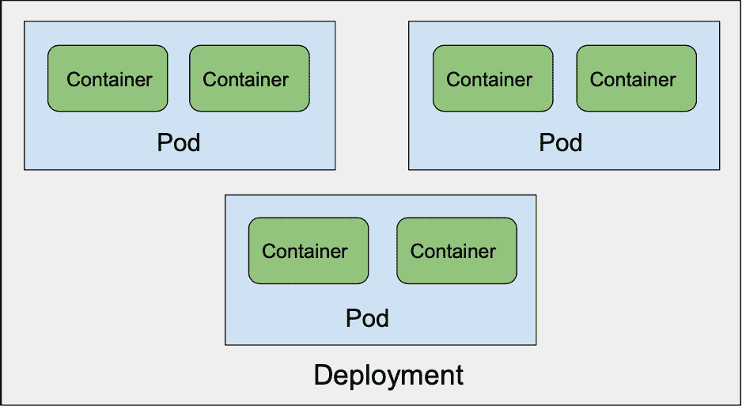
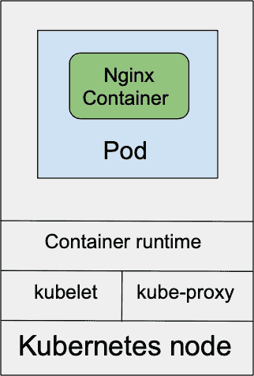
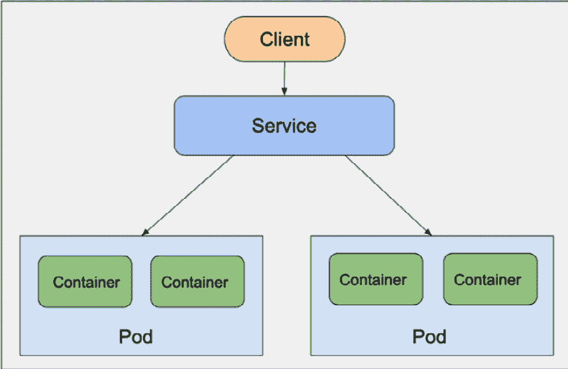

# *第四章*：创建和部署应用程序

在前几章中，我们已经了解了 Kubernetes 节点。让我们最终使用 Kubernetes 部署一个应用程序，扩展该应用程序，并为其创建一个服务。

Kubernetes 部署是从 Docker 镜像部署应用程序的一种方式，我们将在示例应用程序中使用它。

Kubernetes 支持几种容器运行时，所有这些容器运行时都可以运行 Docker 镜像：

+   Docker

+   CRI-O

+   Containerd

在本章中，我们将涵盖以下主题：

+   Pod 的介绍

+   创建部署

+   创建服务

+   扩展应用程序

# Pod 的介绍

Pod 是一组共享卷的应用程序容器的共同组。

一个 Pod 中的应用程序都使用相同的网络命名空间、IP 地址和端口空间。它们可以使用 localhost 找到彼此并进行通信。每个 Pod 在一个扁平的共享网络命名空间中都有一个 IP 地址，可以与网络中的其他物理计算机和容器进行完全通信。

Pod 是可以使用 Kubernetes 创建、调度和管理的最小部署单元。Pod 也可以单独创建。由于 Pod 没有受管生命周期，如果它们死亡，它们将不会被重新创建。因此，建议即使创建单个 Pod，也使用部署。

Pod 也用于 DaemonSets、StatefulSets、Jobs 和 CronJobs：


图 4.1 - 具有两个容器的 Pod

上图显示了一个具有两个容器的 Pod。Pod 中的容器共享相同的 Linux 网络命名空间以及以下内容：

+   IP 地址

+   本地主机

+   **IPC**（**进程间通信**）

让我们继续进行部署，这更适合于真实世界的应用程序部署。

# 创建部署

Kubernetes 部署提供了 ReplicaSets 的更新，确保指定数量的 Pod（副本）始终运行：



图 4.2 - 三个 Pod 的部署

上图显示了一个具有三个 Pod 的部署；ReplicaSet 将尝试始终保持三个 Pod 运行。当然，如果 Kubernetes 集群中没有空闲资源，运行的 Pod 副本可能无法匹配所需的副本计数。

有几种方法可以创建 Kubernetes 部署 - 让我们来探索一下。最简单的方法是使用`$ kubectl create deployment`。

让我们创建一个`nginx`部署：

```
$ kubectl create deployment
deployment.apps/nginx created
```

让我们检查创建的`nginx`部署：

```
$ kubectl get deployment
NAME    READY   UP-TO-DATE   AVAILABLE   AGE
nginx   1/1     1            1           19d
```

让我们检查创建的`nginx` pod：

```
$ kubectl get pods
NAME                    READY   STATUS    RESTARTS   AGE
nginx-86c57db685-c9s49  1/1     Running   0          10d
```

上述命令创建了一个带有一个`nginx-86c57db685-c9s49` pod 的`nginx`部署。

看起来几乎太容易了，对吧？一个命令，嘭：你的部署正在运行。

重要提示

`kubectl create deployment`命令仅建议用于测试图像，因为在那里您不指定部署模板，并且对于您可能想要设置的任何其他设置，您没有太多控制。

让我们使用`$ kubectl apply`命令从文件部署：

1.  我们有一个名为`deployment.yaml`的文件，内容如下：

```
$ cat deployment.yaml
apiVersion: apps/v1
kind: Deployment
metadata:
  name: nginx
  labels:
    app: nginx
spec:
  replicas: 1
  selector:
    matchLabels:
      app: nginx
  template:
    metadata:
      labels:
        app: nginx
    spec:
      containers:
      - image: nginx:1.18.0
        imagePullPolicy: IfNotPresent
        name: nginx
```

当使用前面的文件与`kubectl`时，它将部署与我们使用`$ kubectl create deployment`命令相同的`nginx`部署，但在这种情况下，稍后我们可以根据需要更新文件并升级部署。

1.  让我们删除之前安装的部署：

```
$ kubectl delete deployment nginx
deployment.apps "nginx" deleted
```

1.  这次让我们使用`deployment.yaml`文件重新部署：

```
$ kubectl apply –f deployment.yaml
deployment.apps/nginx created
$ kubectl get deployment
NAME    READY   UP-TO-DATE   AVAILABLE   AGE
nginx   1/1     1            1           17s
$ kubectl get pods
NAME                    READY   STATUS    RESTARTS   AGE
nginx-7df9c6ff5-pnnr6   1/1     Running   0          25s
```

从上述命令中可以看出，我们部署了一个安装了一个 pod（副本），但这次我们使用了文件中的模板。

下图显示了一个带有三个 pod 的部署；ReplicaSet 将尝试始终保持三个 pod 运行。同样，如果 Kubernetes 集群中没有空闲资源，运行的 pod 副本可能不会与所需的副本计数匹配：



图 4.3 – Kubernetes 节点

让我们看看如何创建一个服务。

# 创建一个服务

Kubernetes 服务为一组 pod 提供单一稳定的名称和地址。它们充当基本的集群内负载均衡器。

大多数 pod 都设计为长时间运行，但当一个单独的进程死掉时，pod 也会死掉。如果它死掉，部署会用一个新的 pod 来替换它。每个 pod 都有自己专用的 IP 地址，这允许容器使用相同的端口（例外情况是使用 NodePort），即使它们共享同一个主机。但当部署启动一个 pod 时，该 pod 会获得一个新的 IP 地址。

这就是服务真正有用的地方。服务附加到部署上。每个服务都被分配一个虚拟 IP 地址，直到服务死掉都保持不变。只要我们知道服务的 IP 地址，服务本身将跟踪部署创建的 pod，并将请求分发给部署的 pod。

通过设置服务，我们可以获得一个内部的 Kubernetes DNS 名称。此外，当有多个 ReplicaSet 时，服务还可以充当集群内的负载均衡器。有了服务，您还可以将应用程序暴露到互联网，当服务类型设置为 LoadBalancer 时：



图 4.4 - Kubernetes 节点

上述图解释了服务的工作原理。

由于我们的应用程序已经运行起来了，让我们为其创建一个 Kubernetes 服务：

1.  让我们从运行以下命令开始：

```
$ kubectl expose deployment nginx --port=80 --target-port=80
service/nginx exposed
```

我们使用了端口`80`，并且在该端口上，`nginx`服务被暴露给其他 Kubernetes 应用程序；`target-port=80`是我们的`nginx`容器端口。我们使用端口为`80`的容器，因为我们在*第三章*中部署的官方`nginx`Docker 镜像（[`hub.docker.com/_/nginx`](https://hub.docker.com/_/nginx)）使用端口`80`。

1.  让我们检查创建的`nginx`服务：

```
$ kubectl get service
NAME         TYPE        CLUSTER-IP    EXTERNAL-IP   PORT(S)
kubernetes   ClusterIP   10.16.0.1     <none>        443/TCP
nginx        ClusterIP   10.16.12.233  <none>        80/TCP
$ kubectl describe service nginx
Name:              nginx
Namespace:         default
Labels:            app=nginx
Annotations:       cloud.google.com/neg: {"ingress":true}
Selector:          app=nginx
Type:              ClusterIP
IP:                10.16.12.233
Port:              <unset>  80/TCP
TargetPort:        80/TCP
Endpoints:         10.8.0.133:80
Session Affinity:  None
Events:            <none>
```

上述`kubectl get service`命令显示了服务列表，`kubectl describe service nginx`描述了服务。

我们可以看到一些东西：

+   服务的名称与我们暴露的部署相同，都是`nginx`。

+   `Selector: app=nginx`与`nginx`部署中的`matchLabels`是相同的；这就是服务如何知道如何连接到正确的部署。

+   当没有提供“-type”标志时，`Type: ClusterIP`是默认的服务类型。

重要提示

使用`kubectl expose`命令看起来是为应用程序设置服务的一种简单方法。但是，我们无法将该命令纳入 Git 控制，也无法更改服务设置。对于测试目的，这是可以的，但对于运行真实应用程序来说就不行了。

让我们使用`$ kubectl apply`命令从文件部署。

我们有一个名为`service.yaml`的文件，我们将使用它来更新服务：

```
$ cat service.yaml
apiVersion: v1
kind: Service
metadata:
  name: nginx
  labels:
    app: nginx
spec:
  type: ClusterIP
  ports:
  - port: 80
    protocol: TCP
    targetPort: 80
  selector:
    app: nginx
```

这次，让我们保留使用`kubectl expose`创建的服务，并看看我们是否可以将`service.yaml`文件中的更改应用到我们创建的服务上。

要部署服务，我们运行以下命令：

```
$ kubectl apply –f service.yaml
Warning: kubectl apply should be used on resource created by ether kubectl create –save-config or kubetl apply
service/nginx configured
```

我们收到了一个警告（首先我们使用了`kubectl expose`命令，然后我们尝试从文件更新服务），但我们的更改成功应用到了服务上，从现在开始我们可以使用`service.yaml`来对`nginx`服务进行更改。

提示

当您使用`kubectl expose`创建服务时，可以使用`kubectl get service nginx -o yaml > service.yaml`命令将其模板导出到 YAML 文件，并将该文件用于可能需要进行的将来更改。

要导出`nginx`服务，请运行以下命令：

```
$ kubectl get service nginx -o yaml
```

前述命令的输出如下所示：


图 4.5 - 导出 nginx 服务

将其内容复制到一个文件中，然后您应该删除以下部分，这些部分是由`kubectl`生成的，不需要在那里：

+   `annotations`

+   `creationTimestamp`

+   `resourceVersion:`

+   `selfLink`

+   `uid`

+   `状态`

重要提示

您还可以使用`kubectl get deployment nginx -o yaml > deployment.yaml`命令将部署的模板导出到 YAML 文件。

# 扩展应用程序

在上一节中，我们部署了一个副本的应用程序；让我们将其部署扩展到两个副本。

运行以下命令来扩展我们的部署：

```
$ kubectl scale deployment nginx –replicas=2
deployment.apps/nginx scaled
$ kubectl get deployment nginx
NAME    READY   UP-TO-DATE   AVAILABLE   AGE
nginx   2/2     2            2           5d17h
$ kubectl get pods
NAME                    READY   STATUS    RESTARTS   AGE
nginx-7df9c6ff5-chnrk   1/1     Running   0          29s
nginx-7df9c6ff5-s65dq   1/1     Running   0          5d17h
```

从前述输出中，我们可以看到`$ kubectl get deployment nginx`命令显示`nginx`部署有两个副本。通过`$ kubectl get pods`，我们看到两个 pod；其中一个刚刚不到一分钟。

这是一个很好的命令来扩展部署，对于测试目的很方便。让我们尝试使用`deployment.yaml`文件来扩展部署。

这次，让我们使用`deployment.yaml`文件来扩展到三个副本：

1.  使用三个副本更新`deployment.yaml`：

```
...
spec:
  replicas: 3
...
```

1.  运行与之前相同的命令：

```
$ kubectl apply –f deployment.yaml
deployment.apps/nginx configured
$ kubectl get deployment nginx
NAME    READY   UP-TO-DATE   AVAILABLE   AGE
nginx   3/3     3            3           5d17h
$ kubectl get pods
NAME                    READY   STATUS    RESTARTS   AGE
nginx-7df9c6ff5-chnrk   1/1     Running   0          21m
nginx-7df9c6ff5-s65dq   1/1     Running   0          5d17h
nginx-7df9c6ff5-tk7g4   1/1     Running   0          22s
```

很好：我们已经从`deployment.yaml`文件中将`nginx`部署更新为三个副本。

该服务将以循环方式在三个 pod 之间分发所有传入的请求。

# 总结

在本章中，我们已经学会了如何使用`kubectl`创建、部署和扩展应用程序。本章中学到的新技能现在可以用于部署真实世界的应用程序。

在下一章中，我们将学习如何对部署的应用程序进行更高级的更新。
