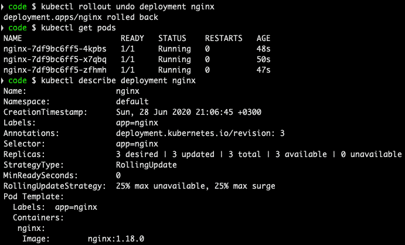
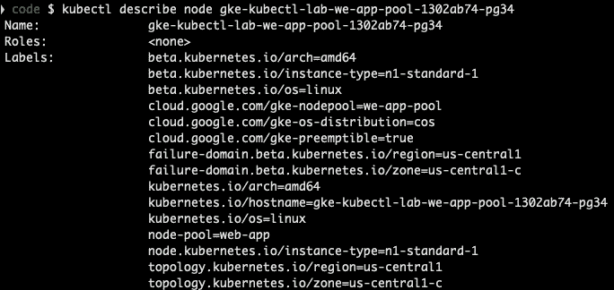
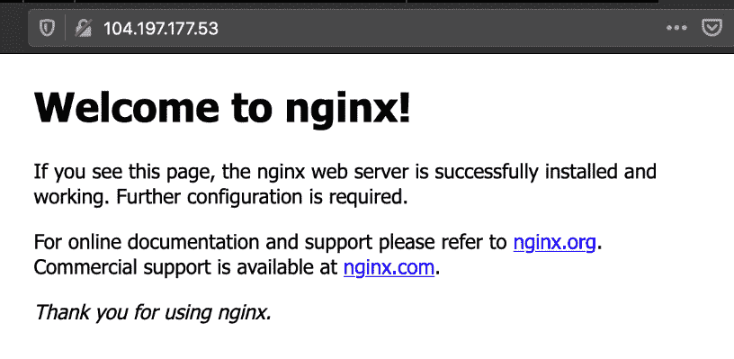

# 第五章：更新和删除应用程序

在上一章中，我们学习了如何部署应用程序及其服务，以及如何扩展部署副本。现在让我们学习一些更高级的方法来更新您的应用程序。

在本章中，我们将学习如何将应用程序更新到新版本，以及如果发布是错误的，如何回滚。我们将看到如何将应用程序分配给特定节点，以高可用模式运行应用程序，如何使应用程序在互联网上可用，以及在需要的情况下如何删除应用程序。

在本章中，我们将涵盖以下主要主题：

+   发布新的应用程序版本

+   回滚应用程序发布

+   将应用分配给特定节点（节点亲和性）

+   将应用程序副本调度到不同的节点（Pod 亲和性）

+   将应用程序暴露给互联网

+   删除一个应用程序

# 部署新的应用程序版本

在上一章中，我们使用了`nginx v1.18.0` Docker 镜像部署了一个应用程序。在本节中，让我们将其更新为`nginx v1.19.0`：

要更新`nginx` Docker 镜像标签，请运行以下命令：

[PRE0]

`$ kubectl rollout status deployment nginx`命令将显示滚动状态为成功、失败或等待：

[PRE1]

这是检查部署的滚动状态的一种方便方式。

通过运行以下命令来确保部署已更新为`nginx` v1.19.0：

[PRE2]

上述命令的输出可以在以下截图中看到：

图 5.1 - 描述部署的输出

是的，它已更新为 v1.19.0，正如我们在`Pod Template`部分中所看到的。现在，让我们使用`deployment.yaml`文件更新 Docker 镜像。

使用新的 Docker `image`标签更新`deployment.yaml`文件：

[PRE3]

运行`$ kubectl apply -f deployment.yaml`命令：

[PRE4]

运行`$ kubectl get pods`命令显示，由于我们应用了与之前相同的 Docker 镜像标签，因此 Pods 没有发生变化，因此 Kubernetes 足够聪明，不会对`nginx`部署进行任何不必要的更改。

# 回滚应用程序发布

总会有一些情况（例如代码中的错误、为最新发布提供了错误的 Docker 标签等），当您需要将应用程序发布回滚到先前的版本。

这可以通过`$ kubectl rollout undo deployment nginx`命令，然后跟随`get`和`describe`命令来完成：

图 5.2 - 部署发布回滚

上述输出显示版本为`Image: nginx:1.18.0`，因此回滚成功了。

我们还可以检查部署的回滚历史：

[PRE5]

我们还可以回滚到特定的修订版本：

[PRE6]

很好，我们已经学会了如何回滚部署的发布。

# 将应用程序分配给特定节点（节点亲和性）

有些情况下，Kubernetes 集群具有不同规格的不同节点池，例如以下情况：

+   有状态的应用程序

+   后端应用程序

+   前端应用程序

让我们将`nginx`部署重新调度到专用节点池：

1.  要获取节点列表，请运行以下命令：

[PRE7]

上述命令给出了以下输出：

图 5.3 - 节点池列表

1.  接下来，让我们检查一个名为`gke-kubectl-lab-we-app-pool`的节点。运行以下命令：

[PRE8]

上述命令的输出如下截图所示：

图 5.4 - 节点标签

1.  在这里，我们有一个`node-pool=web-app`标签，它对于`gke-kubectl-lab-we-app-pool`池的所有节点都是相同的。

1.  让我们使用`nodeAffinity`规则更新`deployment.yaml`文件，这样`nginx`应用程序只会被调度到`gke-kubectl-lab-we-app-pool`：

[PRE9]

1.  要部署更改，请运行`$ kubectl apply -f deployment.yaml`命令，然后按照以下截图中显示的`get`命令：

图 5.5 - 节点亲和性

很好，Pod 被调度到了`gke-kubectl-lab-we-app-pool`。

提示

我们使用了`-o wide`标志，它允许我们显示有关 Pod 的更多信息，例如其 IP 和所在的节点。

1.  让我们删除一个 Pod 来验证它是否被调度到`gke-kubectl-lab-we-app-pool`：

[PRE10]

让我们再次获取 Pod 列表：

图 5.6 - 带节点的 Pod 列表

上述截图显示了 Pod 列表，以及 Pod 所在的节点。很好，新的 Pod 被调度到了正确的节点池。

# 将应用程序副本调度到不同的节点（Pod 亲和性）

使用`nodeAffinity`不能确保下次 pod 被调度到不同的节点上，对于真正的应用程序高可用性，最佳实践是确保应用程序 pod 被调度到不同的节点上。如果其中一个节点宕机/重启/替换，所有的 pod 都运行在该节点上将导致应用程序崩溃，其服务不可用。

让我们使用`podAntiAffinity`规则更新`deployment.yaml`文件，以便`nginx`应用程序只被调度到`gke-kubectl-lab-we-app-pool`上，并且被调度到不同的节点上：

[PRE11]

要部署新更改，运行`$ kubectl apply -f deployment.yaml`命令，然后运行`get`命令，如下截图所示：

图 5.7 - 节点亲和力

如你所见，pod 再次被重新调度，因为我们添加了`podAntiAffinity`规则：

图 5.8 - 节点亲和力 pod 被重新调度

如你所见，pod 正在运行在不同的节点上，并且`podAntiAffinity`规则将确保 pod 不会被调度到同一个节点上。

# 将应用程序暴露给互联网

到目前为止，工作得很好，为了完成本章，让我们使我们的应用程序可以通过互联网访问。

我们需要使用`type: LoadBalancer`更新`service.yaml`，这将创建一个带有外部 IP 的 LoadBalancer。

注意

LoadBalancer 功能取决于供应商集成，因为外部 LoadBalancer 是由供应商创建的。因此，如果在 Minikube 或 Kind 上本地运行，你永远不会真正获得外部 IP。

使用以下内容更新`service.yaml`文件：

[PRE12]

要部署新更改，运行`$ kubectl apply -f service.yaml`命令，然后运行`get`命令，如下截图所示：

图 5.9 - 带有待处理 LoadBalancer 的服务

我们看到`pending`作为状态取决于云提供商，LoadBalancer 的配置可能需要最多 5 分钟。一段时间后再次运行`get`命令，你会看到 IP 已经分配，如下截图所示：

图 5.10 - 带有 LoadBalancer 的服务

为了确保应用程序正常工作，让我们在浏览器中打开 IP `104.197.177.53`：

图 5.11 - 浏览器中的应用程序

哇！我们的应用程序可以从互联网访问。

重要提示

上面的示例显示了如何将应用程序暴露在互联网上，这并不安全，因为它使用的是 HTTP。为了保持示例简单，我们使用了 HTTP，但现实世界的应用程序应该只使用 HTTPS。

# 删除应用程序

有时，您需要删除一个应用程序，让我们看一下如何做到这一点的几种选项。

在前面的部分中，我们部署了部署和服务。让我们回顾一下我们部署了什么。

要检查部署，请运行以下命令：

[PRE13]

要检查活动服务，请运行以下命令：

[PRE14]

我们有一个名为`nginx`的部署和一个名为`nginx`的服务。

首先，让我们使用以下命令删除`nginx`服务：

[PRE15]

正如您在上面的截图中所看到的，`nginx`服务已被删除，该应用程序不再暴露在互联网上，也可以安全地被删除。要删除`nginx`部署，请运行以下命令：

[PRE16]

使用几个命令轻松删除应用程序的部署资源。

但是，如果您有一个图像，其中安装了不止两个资源，您会为每个资源运行删除命令吗？当然不会，有一种更简单的方法可以做到这一点。

由于我们已经删除了部署和服务，让我们再次部署它们，这样我们就有东西可以再次删除。您需要将`deployment.yaml`和`service.yaml`放入某个文件夹中，例如`code`。

这将允许您一起管理多个资源，就像在一个目录中有多个文件一样。

注意

您还可以在单个 YAML 文件中拥有多个 YAML 条目（使用`---`分隔符）。

要使用相同的命令安装部署和服务，请运行以下命令：

[PRE17]

要检查部署和服务，请运行以下命令：

[PRE18]

这一次，我们使用了一个命令来安装应用程序，同样，您也可以对应用程序进行更改，因为 Kubernetes 足够聪明，它只会更新已更改的资源。

注意

您还可以使用一个命令来显示服务和部署：`kubectl get deployment`/`service`。

我们也可以使用相同的方法来删除应用程序。要使用一个命令删除部署和服务，请运行以下命令：

[PRE19]

如您所见，我们只使用了一个命令来清理所有已安装资源的应用程序。

# 总结

在本章中，我们学习了如何发布新的应用程序版本，回滚应用程序版本，将应用程序分配给特定节点，在不同节点之间调度应用程序副本，并将应用程序暴露到互联网。我们还学习了如何以几种不同的方式删除应用程序。

在下一章中，我们将学习如何调试应用程序，这对于了解应用程序的发布并不总是顺利的情况非常重要。
