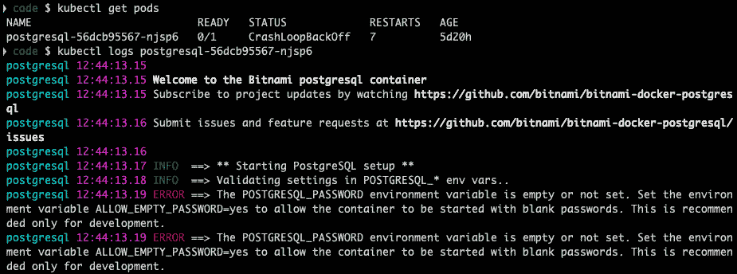
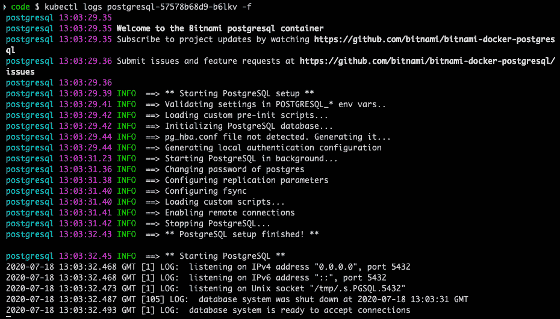

# *第六章*：调试应用程序

有时候，您需要调试应用程序以解决与生产相关的问题。到目前为止，在本书中，我们已经学会了如何安装、更新和删除应用程序。

在本章中，我们将使用`kubectl describe`来进行应用程序调试，以显示解析后的对象配置和期望状态，然后再实际事件发生前检查 pod 日志中的错误，最后，在容器中执行命令（在运行的容器中执行命令意味着在运行的容器中获取 shell 访问）并在那里运行命令。

在本章中，我们将涵盖以下主要主题：

+   描述一个 pod

+   检查 pod 日志

+   在运行的容器中执行命令

# 描述一个 pod

在上一章中，我们删除了一个正在运行的应用程序。因此，在本章中，让我们安装另一个。为了调试应用程序，我们将使用 Docker Hub（[`hub.docker.com/r/bitnami/postgresql`](https://hub.docker.com/r/bitnami/postgresql)）上的`bitnami/postgresql` Docker 镜像，并使用`deployment-postgresql.yaml`文件安装应用程序：

```
$ cat deployment-postgresql.yaml
apiVersion: apps/v1
kind: Deployment
metadata:
  name: postgresql
  labels:
    app: postgresql
spec:
  replicas: 1
  selector:
    matchLabels:
      app: postgresql
  template:
    metadata:
      labels:
        app: postgresql
    spec:
      containers:
      - image: bitnami/postgresql:10.12.10
        imagePullPolicy: IfNotPresent
        name: postgresql
```

要安装 PostgreSQL 部署，请运行以下命令：

```
$ kubectl apply –f deployment-postgresql.yaml
Deployment.apps/postgresql created
$ kubectl get pods
NAME                        READY   STATUS        RESTARTS   AGE
postgresql-867df7d69-r84nl  0/1     ErrImagePull  0          9s
```

哎呀，发生了什么？通过运行`$ kubectl get pods`命令，我们看到了一个`ErrImagePull`错误。让我们来看看。在*第一章*，*介绍和安装 kubectl*中，我们学习了`kubectl describe`命令；让我们使用它来检查 pod 状态。要描述 PostgreSQL pod，请运行以下命令：

```
$ kubectl describe pod postgresql-8675df7d69-r84nl
```

在运行前述命令后，我们得到了以下`Events`的输出：


图 6.1 - 描述命令的输出

在前面的截图中，由于`kubectl pod describe`的输出非常大，我们只显示了我们需要检查以解决问题的`Events`部分。

就在这里，我们看到为什么无法拉取镜像：

```
Failed to pull image "bitnami/postgresql:10.12.10": rpc error: code = Unknown desc = Error response from daemon: manifest for bitnami/postgresql:10.12.10 not found: manifest unknown: manifest unknown
```

看着前面的错误，我们可以看到我们引用了错误的标签`postgresql` Docker 镜像。让我们在`deployment-postgresql.yaml`文件中将其更改为`10.13.0`，然后再次运行`kubectl apply`。要更新`postgresql`部署，请运行以下命令：

```
$ kubectl apply –f deployment-postgresql.yaml
Deployment.apps/postgresql configured
$ kubectl get pods
NAME                         READY   STATUS            RESTARTS   AGE
postgresql-56dcb95567-8rdmd  0/1     CrashLoopBackOff  0          36s
postgresql-8675df7d69-r84nl  0/1     ImagePullBackOff  0          35m
```

我们看到了一个新的 pod，`postgresql-56dcb95567-8rdmd`，它也崩溃了。要检查这个`postgresql` pod，请运行以下命令：

```
$ kubectl describe pod postgresql-56dcb95567-8rdmd
```

在运行前述命令后，我们得到了以下输出：


图 6.2 - 检查带有固定 Docker 标签的 postgresql pod

嗯，这一次，`Events`没有列出关于为什么`postgresql` pod 处于`CrashLoopBackOff`状态的太多信息，因为`bitnami/postgresql:10.13.0`镜像已成功拉取。

让我们在下一节中学习如何处理这个问题，通过检查 pod 的日志。

# 检查 pod 日志

当`kubectl describe pod`没有显示任何关于错误的信息时，我们可以使用另一个`kubectl`命令，即`logs`。`kubectl logs`命令允许我们打印容器日志，并且我们也可以实时查看它们。

提示

如果存在的话，您可以使用带有标志的`kubectl logs`来打印容器在 pod 中的先前实例的日志：

`$ kubectl logs -p some_pod`

现在，让我们在崩溃的`postgresql` pod 上检查这个命令，并尝试找出它失败的原因。要获取 pod 列表并检查 pod 日志，请运行以下命令：

```
$ kubectl get pods
$ kubectl logs postgresql-56dcb95567-njsp6
```

上述命令的输出如下截图所示：



图 6.3 - 获取 postgresql pod 的错误日志

啊哈！正如您从上面的截图中所看到的，`postgresql` pod 失败了，因为它需要设置`POSTGRESQL_PASSWORD`环境变量为一些密码，或者将`ALLOW_EMPTY_PASSWORD`环境变量设置为`yes`，这将允许容器以空密码启动。

让我们使用一些密码更新`deployment-postgresql.yaml`文件中的`POSTGRESQL_PASSWORD`环境变量设置：

```
$ cat deployment-postgresql.yaml
apiVersion: apps/v1
kind: Deployment
metadata:
  name: postgresql
  labels:
    app: postgresql
spec:
  replicas: 1
  selector:
    matchLabels:
      app: postgresql
  template:
    metadata:
      labels:
        app: postgresql
    spec:
      containers:
      - image: bitnami/postgresql:10.13.0
        imagePullPolicy: IfNotPresent
        name: postgresql
        env:
        - name: POSTGRESQL_PASSWORD
          value: "VerySecurePassword:-)"
```

要更新`postgresql`部署，请运行以下命令：

```
$ kubectl apply –f deployment-postgresql.yaml
Deployment.apps/postgresql configured
$ kubectl get pods
NAME                         READY   STATUS            RESTARTS   AGE
postgresql-56dcb95567-njsp6  0/1     CrashLoopBackOff  11         36m
postgresql-57578b68d9-b6lkv  0/1     ContainerCreating 0          1s
$ kubectl get pods
NAME                         READY   STATUS     RESTARTS   AGE
postgresql-57578b68d9-b6lkv  1/1     Running    0          21s
```

正如您在上面的代码块中所看到的，`postgresql`部署已经更新，成功创建了一个新的 pod，并且崩溃的 pod 已经被终止。

重要提示

最佳实践不建议直接在部署和其他 Kubernetes 模板中存储密码，而是应该将它们存储在 Kubernetes Secrets 中。

现在让我们实时查看`postgresql` pod 日志。要实时检查 pod 日志，请运行以下命令：

```
$ kubectl logs postgresql-57578b68d9-b6lkv -f
```

上述命令的输出如下截图所示：



图 6.4 - 查看 postgresql 日志

很好，PostgreSQL 部署已经启动并准备好接受连接。通过保持该命令运行，我们可以在需要查看 PostgreSQL 容器中发生了什么时，实时查看日志。

# 在运行的容器中执行命令

因此，我们已经学会了如何使用`pod describe`和`logs`来排除故障，但在某些情况下，您可能希望进行更高级的故障排除，例如检查一些配置文件或在容器中运行一些命令。这些操作可以使用`kubectl exec`命令完成，该命令将允许`exec`进入容器并在容器中进行交互会话或运行您的命令。

让我们看看如何使用`kubectl exec`命令获取`postgresql.conf`文件的内容：

```
$ kubectl exec postgresql-57578b68d9-6wvpw cat \ /opt/bitnami/postgresql/conf/postgresql.conf
# -----------------------------
# PostgreSQL configuration file
# -----------------------------
#
# This file consists of lines of the form:
#
#   name = value
#
# (The "=" is optional.)  Whitespace may be used.  Comments are introduced with
# "#" anywhere on a line.  The complete list of parameter names and allowed
# values can be found in the PostgreSQL documentation.
…
```

上面的命令将显示`postgresql.conf`文件的内容，以便您可以检查 PostgreSQL 的设置，这些设置在这种情况下是默认设置。

接下来，让我们`exec`进入`postgresql` pod，打开一个 shell，然后运行`psql`命令来检查可用的数据库。

要进入`postgresql` pod，请运行以下命令：

```
$ kubectl exec –it postgresql-57578b68d9-6wvpw – bash
```

上面命令的输出显示在下面的屏幕截图中：


图 6.5 - 进入 postgresql pod

正如您在上面的屏幕截图中所看到的，我们使用`exec`进入`postgresql` pod，使用`bash` shell，然后运行`psql -Upostgres`登录`postgresql`实例，然后使用`\l`检查可用的数据库。这是一个很好的例子，说明了如何使用交互式`exec`命令并在容器内运行不同的命令。

# 总结

在本章中，我们学习了如何描述 pod，检查日志和故障排除，并且还介绍了如何从头开始为`postgresql` Docker 镜像创建 Kubernetes 部署。

使用`kubectl describe`，`logs`和`exec`的故障排除技能非常有用，可以让您了解应用程序 pod 中发生了什么。这些技术可以帮助您解决遇到的任何问题。

在下一章中，我们将学习如何使用插件扩展`kubectl`。
