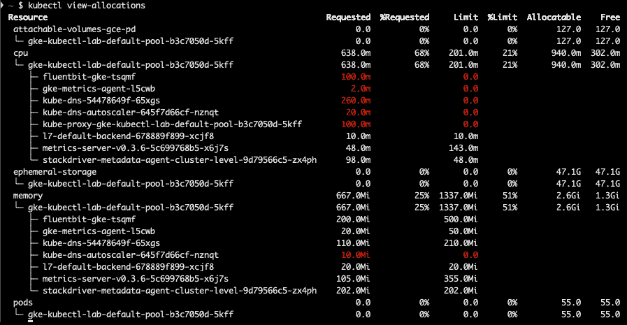

# 第七章：使用 kubectl 插件

在上一章中，我们学习了如何使用`kubectl`进行各种操作，比如列出节点和 pod 以及检查日志。在本章中，让我们学习如何通过插件扩展`kubectl`命令基础。`kubectl`有许多命令，但可能并不总是有你想要的命令，在这种情况下，我们需要使用插件。我们将学习如何安装`kubectl`插件，以便具有更多功能和额外子命令。我们将看到如何使用这些插件，最后，我们将看到如何创建一个`kubectl`的基本插件。

在本章中，我们将涵盖以下主要主题：

+   安装插件

+   使用插件

+   创建基本插件

# 安装插件

在`kubectl`中，插件只是一个可执行文件（可以是编译的 Go 程序或 Bash shell 脚本等），其名称以`kubectl-`开头，要安装插件，只需将其可执行文件放在`PATH`变量中的目录中。

找到并安装插件的最简单方法是使用**Krew** ([`krew.sigs.k8s.io/`](https://krew.sigs.k8s.io/))，Kubernetes 插件管理器。Krew 适用于 macOS、Linux 和 Windows。

Krew 是一个 Kubernetes 插件，让我们继续安装它。在这个例子中，我们将使用 macOS：

1.  要在 macOS 上安装 Krew，请运行`$ brew install krew`命令，如下面的屏幕截图所示：

图 7.1 - 在 macOS 上使用 brew 安装 krew

1.  接下来，我们需要下载插件列表：

```
$ kubectl krew update
```

1.  当我们有一个本地缓存的所有插件列表时，让我们通过运行`$ kubectl krew search`命令来检查可用的插件，如下面的屏幕截图所示：

图 7.2 - 可用插件列表

由于列表中有超过 90 个插件，在前面的屏幕截图中，我们只显示了部分列表。

1.  让我们通过运行`$ kubectl krew install ctx ns view-allocations`命令来安装一些方便的插件，以扩展`kubectl`命令基础，如下面的屏幕截图所示：


图 7.3 - 使用 Krew 安装插件

如你所见，安装`kubectl`插件是如此简单。

# 使用插件

因此，我们已经安装了一些非常有用的插件。让我们看看如何使用它们。

我们已经安装了三个插件：

+   `kubectl ctx`：此插件允许我们在多个 Kubernetes 集群之间轻松切换，当您在`kubeconfig`中设置了多个集群时，这非常有用。

让我们通过运行`$ kubectl ctx`命令来检查可用的集群：


图 7.4 – ctx 插件

+   `kubectl ns`：此插件允许我们在命名空间之间切换。让我们通过运行`$ kubectl ns`命令来检查集群中可用的命名空间：


图 7.5 – ns 插件

+   `kubectl view-allocations`：此插件列出命名空间的资源分配，如 CPU、内存、存储等。

让我们通过运行`$ kubectl view-allocations`命令来检查集群中的资源分配：



图 7.6 – view-allocations 插件

您可以在上面的列表中看到，使用插件看起来就像这些子命令是`kubectl`工具本身的一部分。

# 创建一个基本插件

在本节中，让我们创建一个名为`toppods`的简单插件来显示 Kubernetes 集群节点。这只是一个创建插件的非常简单的例子：

1.  我们将创建一个名为`kubectl-toppods`的简单基于`bash`的插件：

```
$ cat kubectl-toppods
#!/bin/bash
kubectl top pods
```

1.  让我们将`kubectl-toppods`文件复制到`~/bin`路径：

```
$ cp kubectl-toppods ~/bin
```

1.  确保它是可执行的：

```
$ chmod +x ~/bin/ kubectl-toppods
```

1.  现在让我们尝试运行它：

```
$ kubectl toppods
NAME                        CPU(cores)   MEMORY(bytes)
postgresql-57578b68d9-6rpt8 1m           22Mi
```

不错！您可以看到插件正在工作，而且创建`kubectl`插件并不是很困难。

# 摘要

在本章中，我们已经学会了如何安装、使用和创建`kubectl`插件。了解如何使用现有插件扩展`kubectl`以及如何创建自己的插件是很有用的。

我们已经了解了一些非常方便和有用的`kubectl`插件：

+   `ctx`：允许我们非常轻松地在 Kubernetes 集群之间切换

+   `ns`：允许我们在命名空间之间切换

+   `view-allocations`：显示集群中资源的分配列表

当您每天使用多个 Kubernetes 集群和命名空间时，使用`ctx`和`ns`插件将节省大量时间。

在下一章中，我们将学习如何使用 Kustomize 部署应用程序。
