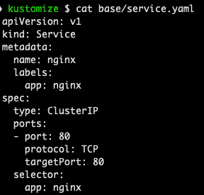
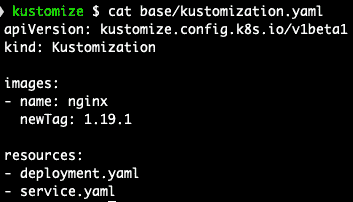
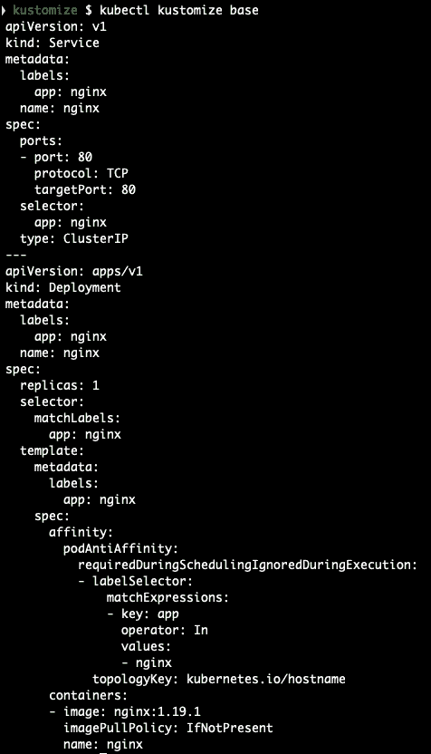
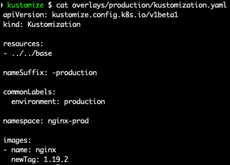

# *第八章*：介绍 Kubernetes 的 Kustomize

在上一章中，我们学习了如何安装、使用和创建`kubectl`插件。

在本章中，让我们学习如何在 Kubernetes 中使用 Kustomize。Kustomize 允许我们在不更改应用程序原始模板的情况下修补 Kubernetes 模板。我们将学习 Kustomize 以及如何使用它来修补 Kubernetes 部署。

在本章中，我们将涵盖以下主要主题：

+   Kustomize 简介

+   修补 Kubernetes 部署

# Kustomize 简介

Kustomize 使用 Kubernetes 清单的覆盖来添加、删除或更新配置选项，而无需分叉。Kustomize 的作用是获取 Kubernetes 模板，在`kustomization.yaml`中指定的更改，然后将其部署到 Kubernetes。

这是一个方便的工具，用于修补非复杂的应用程序，例如，需要针对不同环境或资源命名空间的更改。

Kustomize 作为一个独立的二进制文件和自 v.1.14 以来作为`kubectl`中的本机命令可用。

让我们看一下几个 Kustomize 命令，使用以下命令：

+   要在终端上显示生成的修改模板，请使用以下命令：

```
$ kubectl kustomize base 
```

+   要在 Kubernetes 上部署生成的修改模板：

```
$ kubectl apply –k base
```

在前面的示例中，`base`是包含应用程序文件和`kustomization.yaml`的文件夹。

注意

由于没有`base`文件夹，上述命令将失败。这只是命令的示例。

# 修补 Kubernetes 应用程序

在本节中，让我们尝试使用 Kustomize 来修补一个应用程序。例如，我们有一个带有以下文件的`kustomize`文件夹：


图 8.1 – Kustomize 示例

`base`文件夹有三个文件—`deployment.yaml`、`service.yaml`和`kustomization.yaml`。

通过运行`$ cat base/deployment.yaml`命令来检查`deployment.yaml`文件：


图 8.2 – deployment.yaml 文件

在前面的截图中，我们有`nginx`部署模板，我们将在 Kustomize 中使用它。

通过运行`$ cat base/service.yaml`命令来获取`service.yaml`文件的内容：



图 8.3 – service.yaml 文件

在前面的截图中，我们有`nginx`服务模板，我们将在 Kustomize 中使用它。

正如您所看到的，我们再次使用了`nginx`部署和服务模板，这样您就更容易理解 Kustomize 的操作。

通过运行`$ cat base/kustomization.yaml`命令，让我们获取`kustomization.yaml.yaml`文件的内容：



图 8.4 - kustomization.yaml 文件

由于我们已经熟悉了`nginx`部署和服务，让我们来看看`kustomization.yaml`文件。

通过`kustomization.yaml`中的以下代码，我们为`nginx`图像设置了一个新标签：

```
```

图像：

- 名称：nginx

newTag: 1.19.1

```
```

以下代码设置了要应用设置的`resources`。由于`service`没有图像，Kustomize 只会应用于`deployment`，但我们将在以后的步骤中需要`service`，所以我们仍然设置它：

```
```

资源：

- deployment.yaml

- service.yaml

```
```

现在，让我们通过运行`$ kubectl kustomize base`命令来检查 Kustomize 将如何更改部署：



图 8.5 - kubectl kustomize base 输出

从前面的输出中，您可以看到 Kustomize 生成了`service`和`deployment`内容。`service`的内容没有改变，但让我们来看看`deployment`。将原始文件`base/deployment.yaml`与前面的输出进行比较，我们看到`- image: nginx:1.18.0`已更改为`- image: nginx:1.19.1`，正如在`kustomization.yaml`文件中指定的那样。

这是一个很好且简单的`image`标签更改，而不需要修改原始的`deployment.yaml`文件。

注意

这样的技巧特别方便，特别是在真实的应用程序部署中，不同的环境可能使用不同的 Docker 镜像标签。

## Kustomize 叠加

作为系统管理员，我希望能够部署具有专用自定义配置的不同环境（开发和生产）的 Web 服务，例如副本的数量，分配的资源，安全规则或其他配置。我希望能够在不维护核心应用程序配置的重复副本的情况下完成这些操作。

在本节中，让我们通过使用 Kustomize 进行更高级的自定义来部署到开发和生产环境，并为每个环境使用不同的命名空间和 NGINX Docker 标签来学习更多内容。

在`overlays`文件夹中，我们有`development/kustomization.yaml`和`production/kustomization.yaml`文件；让我们来检查它们。在下面的截图中，我们有`kustomization.yaml`文件，它将应用于开发环境。

通过运行`$ cat overlays/development/kustomization.yaml`命令来获取`overlays/development/kustomization.yaml`文件的内容：


图 8.6 - development/kustomization.yaml 内容

在上述截图中，我们有`kustomization.yaml`文件，它将应用于开发环境。

通过运行`$ cat overlays/development/kustomization.yaml`命令来获取`overlays/production/kustomization.yaml`文件的内容：



图 8.7 - production/kustomization.yaml 内容

在上述截图中，我们有`kustomization.yaml`文件，它将应用于生产环境。

好的，让我们来检查我们在`development/kustomization.yaml`文件中得到的更改：

```
resources:
- ../../base # setting where the main templates are stored
nameSuffix: -development # updating service/deployment name
commonLabels:
  environment: development # add new label
namespace: nginx-dev # setting namespace
```

让我们通过运行`$ kubectl kustomize overlays/development`命令来看看这些更改将如何应用于开发环境的`deployment`和`service`：


图 8.8 - kubectl kustomize overlays/development 输出

根据`base`文件夹规范，我们可以看到`deployment`和`service`的名称已更改，添加了一个命名空间，并且`nginx`镜像标签也已更改。到目前为止做得很好！

现在让我们检查`production/kustomization.yaml`文件：

```
resources:
- ../../base # setting where the main templates are stored
nameSuffix: -production # updating service/deployment name
commonLabels:
  environment: production # add new label
namespace: nginx-prod # setting namespace
images:
- name: nginx
  newTag: 1.19.2 # tag gets changed
```

我们要应用的更改与为`development`所做的更改非常相似，但我们还希望设置不同的 Docker 镜像标签。

通过运行`$ kubectl kustomize overlays/production`命令来看看它将如何运行：


图 8.9 - kubectl kustomize overlays/production 输出

正如你所看到的，所有所需的更改都已应用。

注意

Kustomize 合并所有找到的`kustomization.yaml`文件，首先应用来自`base`文件夹的文件，然后应用来自`overlay`文件夹的文件。您可以选择如何命名您的文件夹。

现在，是时候实际执行使用 Kustomize 进行安装了：

```
$ kubectl create ns nginx-prod 
namespace/nginx-prod created
$ kubectl apply –k overlays/production/
service/nginx-prod created
deployment.apps/nginx-production created
$ kubectl get pods –n nginx-prod
NAME                    READY   STATUS    RESTARTS   AGE
nginx-production-dc9cbdb6-j4ws4   1/1     Running   0          17s
```

通过上述命令，我们已经创建了`nginx-prod`命名空间，并借助 Kustomize 应用的更改安装了`nginx`应用程序，您可以看到它正在运行。

我们只学习了 Kustomize 的一些基本功能，因为在本书中涵盖 Kustomize 的所有内容超出了范围，请参考以下链接获取更多信息：[`kustomize.io/`](https://kustomize.io/)。

# 总结

在本章中，我们学会了如何使用 Kustomize 安装应用程序。

我们已经学会了如何将 Kustomize 应用于`nginx`部署和服务，改变它们的名称，添加命名空间，并在部署中更改镜像标签。所有这些都是在不更改应用程序原始模板的情况下完成的，通过使用带有 Kustomize 的`kustomization.yaml`文件来进行所需的更改。

在下一章中，我们将学习如何使用 Helm——Kubernetes 软件包管理器。
