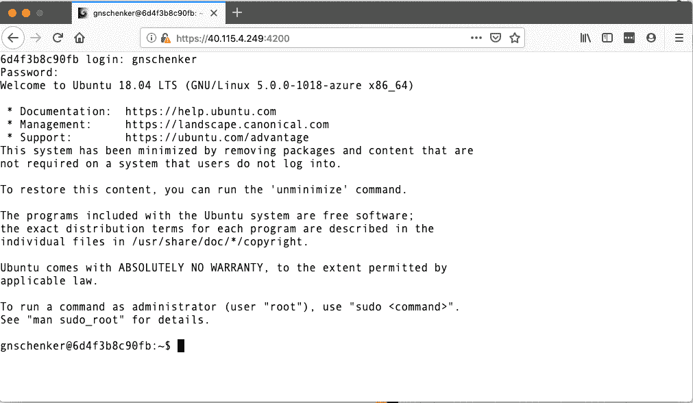
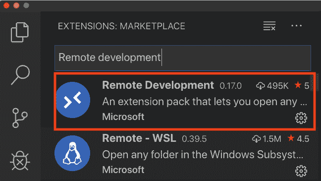
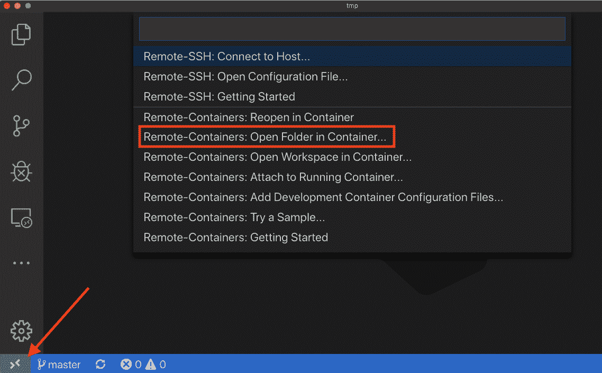
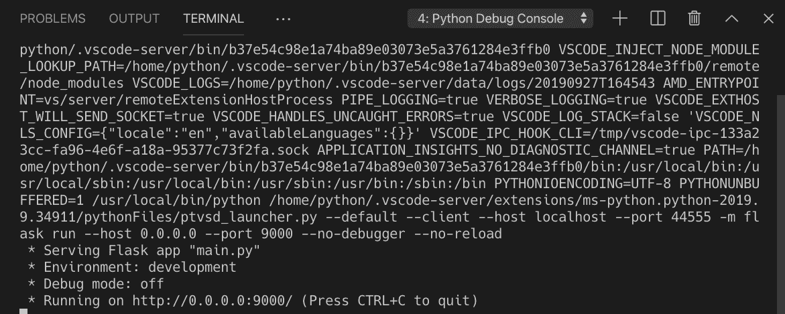

# 第八章：高级 Docker 使用场景

在上一章中，我们向您展示了如何使用工具执行管理任务，而无需在主机计算机上安装这些工具。我们还说明了容器的使用，这些容器托管和运行用于测试和验证在容器中运行的应用程序服务的测试脚本或代码。最后，我们指导您构建了一个使用 Jenkins 作为自动化服务器的基于 Docker 的简单 CI/CD 流水线的任务。

在本章中，我们将介绍在将复杂的分布式应用程序容器化或使用 Docker 自动化复杂任务时有用的高级技巧、窍门和概念。

这是本章中我们将涉及的所有主题的快速概述：

+   所有 Docker 专业人士的技巧和窍门

+   在远程容器中运行终端并通过 HTTPS 访问它

+   在容器内运行开发环境

+   在远程容器中运行代码编辑器并通过 HTTPS 访问它

完成本章后，您将能够执行以下操作：

+   在完全混乱后成功恢复您的 Docker 环境

+   在容器中运行远程终端，并通过 HTTPS 在浏览器中访问它

+   通过 HTTPS 在浏览器中使用 Visual Studio Code 远程编辑代码

# 技术要求

在本章中，如果您想跟着代码进行操作，您需要在 Mac 或 Windows 机器上安装 Docker for Desktop 和 Visual Studio Code 编辑器。该示例也适用于安装了 Docker 和 Visual Studio Code 的 Linux 机器。Docker Toolbox 在本章中不受支持。

# 所有 Docker 专业人士的技巧和窍门

在本节中，我将介绍一些非常有用的技巧和窍门，这些技巧和窍门可以让高级 Docker 用户的生活变得更加轻松。我们将从如何保持 Docker 环境清洁开始。

# 保持您的 Docker 环境清洁

首先，我们想学习如何删除悬空镜像。根据 Docker 的说法，悬空镜像是与任何已标记镜像没有关联的层。这样的镜像层对我们来说肯定是无用的，并且可能会很快地填满我们的磁盘——最好定期将它们删除。以下是命令：

[PRE0]

请注意，我已经向`prune`命令添加了`-f`参数。这是为了防止 CLI 询问我们是否真的要删除那些多余的层。

停止的容器也会浪费宝贵的资源。如果您确定不再需要这些容器，那么您应该使用以下命令逐个删除它们：

[PRE1]

或者，您可以使用以下命令批量删除它们：

[PRE2]

值得再次提到的是，除了`<container-id>`，我们还可以使用`<container-name>`来标识容器。

未使用的 Docker 卷也可能很快填满磁盘空间。在开发或 CI 环境中，特别是在创建大量临时卷的情况下，妥善处理您的卷是一个好习惯。但是我必须警告您，Docker 卷是用来存储数据的。通常，这些数据的生存周期必须比容器的生命周期长。这在生产或类似生产环境中尤其如此，那里的数据通常是至关重要的。因此，在使用以下命令清理 Docker 主机上的卷时，请务必百分之百确定自己在做什么：

[PRE3]

我建议不要使用`-f`（或`--force`）标志的这个命令。这是一个危险的终端操作，最好给自己第二次机会来重新考虑您的行动。没有这个标志，CLI 会输出您在上面看到的警告。您必须通过输入`y`并按下*Enter*键来明确确认。

在生产或类似生产系统中，您应该避免使用上述命令，而是使用以下命令逐个删除不需要的卷：

[PRE4]

我还应该提到有一个命令可以清理 Docker 网络。但由于我们尚未正式介绍网络，我将把这个推迟到[第十章]，*单主机网络*。

在下一节中，我们将展示如何可以从容器内部自动化 Docker。

# 在 Docker 中运行 Docker

有时，我们可能想要运行一个托管应用程序的容器，该应用程序自动化执行某些 Docker 任务。我们该怎么做呢？Docker 引擎和 Docker CLI 已安装在主机上，但应用程序在容器内运行。早期，Docker 就提供了一种将 Linux 套接字从主机绑定到容器的方法。在 Linux 上，套接字被用作在同一主机上运行的进程之间非常高效的数据通信端点。Docker CLI 使用套接字与 Docker 引擎通信；它通常被称为 Docker 套接字。如果我们可以将 Docker 套接字授予在容器内运行的应用程序访问权限，那么我们只需在此容器内安装 Docker CLI，然后我们将能够在相同的容器中运行使用本地安装的 Docker CLI 自动化特定于容器的任务的应用程序。

重要的是要注意，这里我们不是在谈论在容器内运行 Docker 引擎，而是只运行 Docker CLI 并将 Docker 套接字从主机绑定到容器中，以便 CLI 可以与主机计算机上运行的 Docker 引擎进行通信。这是一个重要的区别。在容器内运行 Docker 引擎虽然可能，但不建议。

假设我们有以下脚本，名为`pipeline.sh`，自动化构建、测试和推送 Docker 镜像：

[PRE5]

请注意，我们正在使用四个环境变量：`$HUB_USER`和`$HUB_PWD`是 Docker Hub 的凭据，`$REPOSITORY`和`$TAG`是我们要构建的 Docker 镜像的名称和标签。最终，我们将不得不在`docker run`命令中传递这些环境变量的值。

我们想要在一个构建器容器内运行该脚本。由于该脚本使用 Docker CLI，我们的构建器容器必须安装 Docker CLI，并且要访问 Docker 引擎，构建器容器必须将 Docker 套接字绑定。让我们开始为这样一个构建器容器创建一个 Docker 镜像：

1.  首先，创建一个`builder`文件夹并导航到它：

[PRE6]

1.  在这个文件夹里，创建一个看起来像这样的`Dockerfile`：

[PRE7]

1.  现在在`builder`文件夹中创建一个`pipeline.sh`文件，并将我们在前面文件中呈现的流水线脚本添加为内容。

1.  保存并使文件可执行：

[PRE8]

1.  构建镜像很简单：

[PRE9]

我们现在准备使用一个真实的 Node.js 应用程序来尝试`builder`，例如我们在`ch08/sample-app`文件夹中定义的示例应用程序。确保您用 Docker Hub 的自己的凭据替换`<user>`和`<password>`：

[PRE10]

请注意，在上述命令中，我们使用`-v /var/run/docker.sock:/var/run/docker.sock`将 Docker 套接字挂载到容器中。如果一切顺利，您应该已经为示例应用程序构建了一个容器镜像，测试应该已经运行，并且镜像应该已经推送到 Docker Hub。这只是许多用例中的一个，其中能够绑定挂载 Docker 套接字非常有用。

特别注意，所有想尝试 Windows 容器的人。在 Windows 上的 Docker 中，您可以通过绑定挂载 Docker 的**命名管道**来创建类似的环境，而不是一个套接字。在 Windows 上，命名管道与基于 Unix 的系统上的套接字大致相同。假设您正在使用 PowerShell 终端，运行 Windows 容器托管 Jenkins 时，绑定挂载命名管道的命令如下：

`**PS>** **docker container run `** **--name jenkins `** **-p 8080:8080 `** **-v \\.\pipe\docker_engine:\\.\pipe\docker_engine `

friism/jenkins**`

注意特殊的语法`\\.\pipe\docker_engine`，用于访问 Docker 的命名管道。

# 格式化常见 Docker 命令的输出

有时您是否希望您的终端窗口是无限宽的，因为像`docker container ps`这样的 Docker 命令的输出会在每个项目上跨越多行？不用担心，因为您可以根据自己的喜好自定义输出。几乎所有产生输出的命令都有一个`--format`参数，它接受一个所谓的 Go 模板作为参数。如果您想知道为什么是 Go 模板，那是因为 Docker 的大部分代码都是用这种流行的低级语言编写的。让我们看一个例子。假设我们只想显示`docker container ps`命令输出的容器名称、镜像名称和容器状态，用制表符分隔。格式将如下所示：

[PRE11]

请注意，`format`字符串是区分大小写的。还要注意添加`-a`参数以包括已停止的容器在输出中。示例输出可能如下所示：

[PRE12]

这绝对比未格式化的输出更好，即使在窄窄的终端窗口上也是如此，未格式化的输出会在多行上随意散开。

# 过滤常见 Docker 命令的输出

与我们在上一节中所做的内容类似，通过美化 Docker 命令的输出，我们也可以筛选输出内容。支持许多过滤器。请在 Docker 在线文档中找到每个命令的完整列表。过滤器的格式很简单，是`--filter <key>=<value>`的类型。如果我们需要结合多个过滤器，我们可以结合多个这些语句。让我们以`docker image ls`命令为例，因为我在我的工作站上有很多镜像：

[PRE13]

前面的过滤器只输出不悬空的镜像，也就是真实的镜像，其完全限定名称的形式为`<registry>/<user|org><repository>:<tag>`，并且标签等于`latest`。我的机器上的输出如下：

[PRE14]

在展示了如何美化和筛选 Docker CLI 生成的输出之后，现在是时候再次谈论构建 Docker 镜像以及如何优化这个过程了。

# 优化构建过程

许多 Docker 初学者在编写他们的第一个`Dockerfile`时会犯以下错误：

[PRE15]

你能发现这个典型的 Node.js 应用程序的`Dockerfile`中的薄弱点吗？在第四章中，*创建和管理容器镜像*，我们已经学到镜像由一系列层组成。`Dockerfile`中的每一行（逻辑上）都创建一个层，除了带有`CMD`和/或`ENTRYPOINT`关键字的行。我们还学到 Docker 构建器会尽力缓存层，并在后续构建之间重用它们。但是缓存只使用在第一个更改的层之前出现的缓存层。所有后续层都需要重新构建。也就是说，`Dockerfile`的前面结构破坏了镜像层缓存！

为什么？嗯，从经验上来说，你肯定知道在一个典型的具有许多外部依赖的 Node.js 应用程序中，`npm install` 可能是一个非常昂贵的操作。执行此命令可能需要几秒钟到几分钟。也就是说，每当源文件之一发生变化，我们知道在开发过程中这经常发生，`Dockerfile` 中的第 3 行会导致相应的镜像层发生变化。因此，Docker 构建器无法重用缓存中的此层，也无法重用由 `RUN npm install` 创建的随后的层。代码的任何微小变化都会导致完全重新运行 `npm install`。这是可以避免的。包含外部依赖列表的 `package.json` 文件很少改变。有了所有这些信息，让我们修复 `Dockerfile`：

[PRE16]

这一次，在第 3 行，我们只将 `package.json` 文件复制到容器中，这个文件很少改变。因此，随后的 `npm install` 命令也需要同样很少地执行。第 5 行的 `COPY` 命令是一个非常快速的操作，因此在一些代码改变后重新构建镜像只需要重新构建这最后一层。构建时间减少到几乎只有一小部分秒数。

同样的原则适用于大多数语言或框架，比如 Python、.NET 或 Java。避免破坏你的镜像层缓存！

# 限制容器消耗的资源

容器的一个很棒的特性，除了封装应用程序进程外，还可以限制单个容器可以消耗的资源。这包括 CPU 和内存消耗。让我们来看看如何限制内存（RAM）的使用：

[PRE17]

一旦进入容器，安装 `stress` 工具，我们将用它来模拟内存压力：

[PRE18]

打开另一个终端窗口并执行 `docker stats` 命令。你应该会看到类似这样的东西：

docker stats 显示了一个资源受限的容器

观察 `MEM USAGE` 和 `LIMIT`。目前，容器只使用了 `1.87MiB` 的内存，限制为 `512MB`。后者对应我们为这个容器配置的内容。现在，让我们使用 `stress` 来模拟四个尝试以 `256MB` 为块的工作进程。在容器内运行此命令以执行：

[PRE19]

在运行 Docker stats 的终端中，观察 `MEM USAGE` 的值如何接近但从未超过 `LIMIT`。这正是我们从 Docker 期望的行为。Docker 使用 Linux `cgroups` 来强制执行这些限制。

我们可以通过`--cpu`开关类似地限制容器可以消耗的 CPU 数量。

通过这种操作，工程师可以避免在繁忙的 Docker 主机上出现嘈杂的邻居问题，即一个容器通过消耗过多的资源使其他所有容器陷入困境。

# 只读文件系统

为了保护您的应用免受恶意黑客攻击，通常建议将容器的文件系统或部分文件系统定义为只读。这对于无状态服务来说是最有意义的。假设您在作为分布式、关键任务应用的一部分运行的容器中有一个计费服务。您可以按以下方式运行计费服务：

[PRE20]

`--read-only`标志将容器的文件系统挂载为只读。如果黑客成功进入您的计费容器并试图恶意更改应用程序，比如用一个受损的二进制文件替换其中一个，那么这个操作将失败。我们可以通过以下命令轻松演示：

[PRE21]

第一个命令以只读文件系统运行容器，第二个命令尝试在该容器中执行另一个进程，该进程应该向文件系统写入一些东西——在这种情况下是一个简单的文本文件。这会失败，正如我们在前面的输出中看到的，出现了错误消息`只读文件系统`。

加强容器中运行应用程序安全性的另一种方法是避免以`root`身份运行它们。

# 避免以 root 身份运行容器化应用

大多数运行在容器内的应用或应用服务不需要 root 访问权限。为了加强安全性，在这些情况下以最小必要权限运行这些进程是有帮助的。这些应用不应该以`root`身份运行，也不应该假设它们具有`root`级别的权限。

再次，让我们通过一个例子来说明我们的意思。假设我们有一个包含绝密内容的文件。我们希望在我们的基于 Unix 的系统上使用`chmod`工具来保护这个文件，以便只有具有 root 权限的用户才能访问它。假设我以`dev`主机上的`gabriel`身份登录，因此我的提示符是`gabriel@dev $`。我可以使用`sudo su`来冒充超级用户。不过我必须输入超级用户密码：

[PRE22]

现在，作为`root`用户，我可以创建一个名为`top-secret.txt`的文件并保护它：

[PRE23]

如果我尝试以`gabriel`的身份访问文件，会发生以下情况：

[PRE24]

我得到了`Permission denied`，这正是我们想要的。除了`root`之外，没有其他用户可以访问这个文件。现在，让我们构建一个包含这个受保护文件的 Docker 镜像，当从中创建一个容器时，尝试输出它的内容。`Dockerfile`可能是这样的：

[PRE25]

我们可以使用以下命令从该 Dockerfile 构建一个镜像（以`root`身份！）：

[PRE26]

然后，从该镜像运行一个容器，我们得到：

[PRE27]

好的，尽管我在主机上冒充`gabriel`用户并在该用户账户下运行容器，但容器内运行的应用程序自动以`root`身份运行，因此可以完全访问受保护的资源。这很糟糕，所以让我们来修复它！我们不再使用默认设置，而是在容器内定义一个显式用户。修改后的`Dockerfile`如下：

[PRE28]

我们使用`groupadd`工具来定义一个新的组，`demo-group`，ID 为`3000`。然后，我们使用`useradd`工具向这个组添加一个新用户，`demo-user`。用户在容器内的 ID 为`4000`。最后，通过`USER demo-user`语句，我们声明所有后续操作应该以`demo-user`身份执行。

重新构建镜像——再次以`root`身份——然后尝试从中运行一个容器：

[PRE29]

正如您在最后一行所看到的，容器内运行的应用程序以受限权限运行，无法访问需要 root 级别访问权限的资源。顺便问一下，如果我以`root`身份运行容器会发生什么？试一试吧！

这些是一些对专业人士有用的日常容器使用技巧。还有很多。去 Google 搜索一下。值得的。

# 在远程容器中运行您的终端并通过 HTTPS 访问它

有时您需要访问远程服务器，只能使用浏览器进行访问。您的笔记本电脑可能被雇主锁定，因此不允许您例如`ssh`到公司域之外的服务器。

要测试这种情况，请按照以下步骤进行：

1.  在 Microsoft Azure、GCP 或 AWS 上创建一个免费账户。然后，创建一个虚拟机，最好使用 Ubuntu 18.04 或更高版本作为操作系统，以便更容易跟随操作。

1.  一旦您的虚拟机准备就绪，就可以通过 SSH 登录。执行此操作的命令应该类似于这样：

[PRE30]

要获得访问权限，您可能需要首先为虚拟机打开`22`端口以进行入口。

我在虚拟机配置期间定义的用户是`gnschenker`，我的虚拟机的公共 IP 地址是`40.115.4.249`。

1.  使用此处找到的说明在 VM 上安装 Docker：[`docs.docker.com/install/linux/docker-ce/ubuntu/`](https://docs.docker.com/install/linux/docker-ce/ubuntu/)。

1.  特别注意，不要忘记使用以下命令将您的用户（在我的情况下是`gnschenker`）添加到 VM 上的`docker`组中：

[PRE31]

通过这样做，您可以避免不断使用`sudo`执行所有 Docker 命令。您需要注销并登录到 VM 以使此更改生效。

1.  现在，我们准备在 VM 上的容器中运行**Shell in a Box**（[`github.com/shellinabox/shellinabox`](https://github.com/shellinabox/shellinabox)）。有很多人将 Shell in a Box 容器化。我们使用的是 Docker 镜像，`sspreitzer/shellinabox`。在撰写本文时，这是 Docker Hub 上迄今为止最受欢迎的版本。使用以下命令，我们将以用户`gnschenker`、密码`top-secret`、启用用户的`sudo`和自签名证书运行应用程序：

[PRE32]

请注意，最初我们建议以交互模式运行容器，以便您可以跟踪发生的情况。一旦您更熟悉该服务，考虑使用`-d`标志在后台运行它。还要注意，我们将主机的`~/dev`文件夹挂载到容器内的`/usr/src/dev`文件夹。如果我们想要远程编辑我们从 GitHub 克隆的代码，这将非常有用，例如，克隆到`~/dev`文件夹中。

还要注意，我们将 Shell in a Box 的端口`4200`映射到主机端口`4200`。这是我们将能够使用浏览器和 HTTPS 访问 shell 的端口。因此，您需要在 VM 上为入口打开端口`4200`。作为协议，选择 TCP。

1.  一旦容器正在运行，并且您已经为入口打开了端口`4200`，请打开一个新的浏览器窗口，导航到`https://<public-IP>:4200`，其中`<public-IP>`是您的 VM 的公共 IP 地址。由于我们使用的是自签名证书，您将收到一个警告，如在使用 Firefox 时所示：

由于使用自签名证书而导致的浏览器警告

1.  在我们的情况下，这不是问题；我们知道原因——就是自签名证书。因此，点击**高级...**按钮，然后接受风险并继续。现在，您将被重定向到登录屏幕。使用您的用户名和密码登录：

使用 HTTPS 从浏览器登录到远程 VM

我们已经登录到运行在远程 VM 上的**Shell in a Box**应用程序，使用 HTTPS 协议。

1.  现在，我们可以完全访问，例如，从主机 VM 映射到`/usr/src/dev`的文件和文件夹。例如，我们可以使用`vi`文本编辑器来创建和编辑文件，尽管我们必须首先安装 vi，方法如下：

[PRE33]

1.  可能性几乎是无穷无尽的。请尝试使用这个设置。例如，使用挂载了 Docker 套接字的 Shell in a Box 容器，安装容器内的 Docker，然后尝试从容器内使用 Docker CLI。这真的很酷，因为你可以在浏览器内完成所有这些操作！

1.  如果你打算经常使用这个 Shell in a Box 容器，并且需要安装一些额外的软件，请毫不犹豫地创建你自己的自定义 Docker 镜像，继承自`sspreitzer/shellinabox`。

接下来，我们将看到如何在容器内运行你的开发环境。

# 在容器内运行开发环境

想象一下，你只能访问安装了 Docker for Desktop 的工作站，但无法在这台工作站上添加或更改任何其他内容。现在你想做一些概念验证，并使用 Python 编写一些示例应用程序。不幸的是，你的计算机上没有安装 Python。你能做什么？如果你能在容器内运行整个开发环境，包括代码编辑器和调试器，同时仍然可以在主机上拥有你的代码文件呢？

容器很棒，聪明的工程师已经提出了解决这种问题的解决方案。

让我们尝试一下 Python 应用程序：

1.  我们将使用我们最喜欢的代码编辑器 Visual Studio Code，来展示如何在容器内运行完整的 Python 开发环境。但首先，我们需要安装必要的 Visual Studio Code 扩展。打开 Visual Studio Code 并安装名为 Remote Development 的扩展：

Visual Studio Code 的 Remote Development 扩展

1.  然后，点击 Visual Studio Code 窗口左下角的绿色快速操作状态栏项。在弹出窗口中，选择**Remote-Containers: Open Folder in Container...**：

在远程容器中打开一个项目

1.  选择要在容器中使用的项目文件夹。在我们的案例中，我们选择了`~/fod/ch08/remote-app`文件夹。Visual Studio Code 将开始准备环境，这在第一次可能需要几分钟左右。在此期间，您将看到如下消息：

Visual Studio Code 正在准备开发容器

默认情况下，此开发容器以非根用户身份运行，我们的情况下称为`python`。我们在之前的部分中了解到，这是一个强烈推荐的最佳实践。您可以通过注释掉`.devcontainer/devcontainer.json`文件中的`"runArgs": [ "-u", "python" ]`行来更改，并以`root`身份运行。

1.  使用*Shift* + *Ctrl* + *`*在 Visual Studio Code 内打开一个终端，并使用`env FLASK_APP=main.py flask run`命令运行 Flask 应用程序。您应该会看到如下输出：

从 Visual Studio Code 在容器内运行的 Python Flask 应用程序开始

`python@df86dceaed3d:/workspaces/remote-app$`提示表明我们**不是**直接在我们的 Docker 主机上运行，而是在 Visual Studio Code 为我们启动的开发容器内运行。Visual Studio Code 本身的远程部分也运行在该容器内。只有 Visual Studio Code 的客户端部分——UI——继续在我们的主机上运行。

1.  通过按*Shift+Ctrl+`*在 Visual Studio Code 内打开另一个终端窗口。然后，使用`curl`测试应用程序：

测试远程 Flask 应用程序

1.  按下*Ctrl* + *C*停止 Flask 应用程序。

1.  我们也可以像在主机上直接工作时那样调试应用程序。打开`.vscode/launch.json`文件，了解 Flask 应用程序是如何启动的以及调试器是如何附加的。

1.  打开`main.py`文件，并在`home()`函数的`return`语句上设置一个断点。

1.  然后，切换到 Visual Studio Code 的调试视图，并确保在下拉菜单中选择启动任务`Python: Flask`。

1.  接下来，按下绿色的启动箭头开始调试。终端中的输出应该如下所示：

在容器中运行的远程应用程序开始调试

1.  使用*Shift* + *Ctrl* + *`*打开另一个终端，并通过运行`curl localhost:9000/`命令来测试应用程序。调试器应该会触发断点，您可以开始分析：

在容器内运行的 Visual Studio Code 中逐行调试

我无法强调这有多酷。Visual Studio Code 的后端（非 UI 部分）正在容器内运行，Python、Python 调试器和 Python Flask 应用程序也是如此。同时，源代码从主机挂载到容器中，Visual Studio Code 的 UI 部分也在主机上运行。这为开发人员在受限制最严格的工作站上打开了无限的可能性。您可以对所有流行的语言和框架执行相同的操作，比如.NET、C#、Java、Go、Node.js 和 Ruby。如果某种语言不受支持，您可以创建自己的开发容器，然后它将与我们展示的 Python 相同的方式工作。

如果您在没有安装 Docker for Desktop 并且受到更严格限制的工作站上工作，该怎么办？您有哪些选择？

# 在远程容器中运行您的代码编辑器，并通过 HTTPS 访问它

在本节中，我们将展示如何使用 Visual Studio Code 在容器内启用远程开发。当您在工作站上受限时，这是很有趣的。让我们按照以下步骤进行：

1.  下载并提取最新版本的`code-server`。您可以通过导航到[`github.com/cdr/code-server/releases/latest`](https://github.com/cdr/code-server/releases/latest)来找到 URL。在撰写本文时，它是`1.1156-vsc1.33.1`：

[PRE34]

确保用您的特定版本替换`<version>`

1.  导航到提取的二进制文件所在的文件夹，使其可执行，并启动它：

[PRE35]

输出应该类似于这样：

在远程 VM 上启动 Visual Studio Code 远程服务器

Code Server 使用自签名证书来保护通信，因此我们可以通过 HTTPS 访问它。请确保您记下屏幕上的`Password`输出，因为在浏览器中访问 Code Server 时需要它。还要注意，我们使用端口`4200`在主机上暴露 Code Server，原因是我们已经为 VM 上的入口打开了该端口。当然，您可以选择任何端口 - 只需确保您为入口打开它。

1.  打开一个新的浏览器页面，导航到`https://<public IP>:4200`，其中`<public IP>`是您的 VM 的公共 IP 地址。由于我们再次使用自签名证书，浏览器会出现警告，类似于我们在本章前面使用 Shell in a Box 时发生的情况。接受警告，您将被重定向到 Code Server 的登录页面：

Code Server 的登录页面

1.  输入您之前记录的密码，然后点击“进入 IDE”。现在您将能够通过安全的 HTTPS 连接远程使用 Visual Studio Code：

在浏览器上运行的 Visual Studio Code 通过 HTTPS

1.  现在，您可以从 Chrome Book 或受限制的工作站等设备进行开发，而不受限制。但等一下，您可能会说！这与容器有什么关系？您是对的——到目前为止，没有涉及到容器。不过，我可以说，如果您的远程 VM 安装了 Docker，您可以使用 Code Server 来进行任何与容器相关的开发，我就可以解决问题了。但那将是一个廉价的答案。

1.  让我们在一个容器中运行 Code Server 本身。这应该很容易，不是吗？尝试使用这个命令，将内部端口`8080`映射到主机端口`4200`，并将包含 Code Server 设置和可能包含您的项目的主机文件夹挂载到容器中：

[PRE36]

请注意，前面的命令以不安全模式运行 Code Server，如输出所示：

[PRE37]

1.  您现在可以在浏览器中访问`http://<public IP>:4200`中的 Visual Studio Code。请注意 URL 中的`HTTP`而不是`HTTPS`！与在远程 VM 上本地运行 Code Server 时类似，您现在可以在浏览器中使用 Visual Studio Code：

 在浏览器中进行开发

通过这个，我希望您对容器的使用提供了近乎无限的可能性有所了解。

# 摘要

在本章中，我们展示了一些高级 Docker 用户的技巧和窍门，可以让您的生活更加高效。我们还展示了如何利用容器来提供在远程服务器上运行并可以通过安全的 HTTPS 连接从浏览器中访问的整个开发环境。

在下一章中，我们将介绍分布式应用架构的概念，并讨论运行分布式应用所需的各种模式和最佳实践。除此之外，我们还将列出在生产环境或类似生产环境中运行此类应用所需满足的一些问题。

# 问题

1.  列出你想在容器内运行完整开发环境的原因。

1.  为什么应该避免以`root`身份在容器内运行应用程序？

1.  为什么要将 Docker 套接字绑定到容器中？

1.  在清理 Docker 资源以释放空间时，为什么需要特别小心处理卷？

# 进一步阅读

+   在 CI 中不要在 Docker 中使用 Docker：在[`jpetazzo.github.io/2015/09/03/do-not-use-docker-in-docker-for-ci/`](http://jpetazzo.github.io/2015/09/03/do-not-use-docker-in-docker-for-ci/)中使用 Docker

+   在[`github.com/shellinabox/shellinabox`](https://github.com/shellinabox/shellinabox)上的 Shell in a Box

+   在[`code.visualstudio.com/docs/remote/ssh`](https://code.visualstudio.com/docs/remote/ssh)上使用 SSH 进行远程开发

+   在[`code.visualstudio.com/docs/remote/containers`](https://code.visualstudio.com/docs/remote/containers)中在容器内开发
