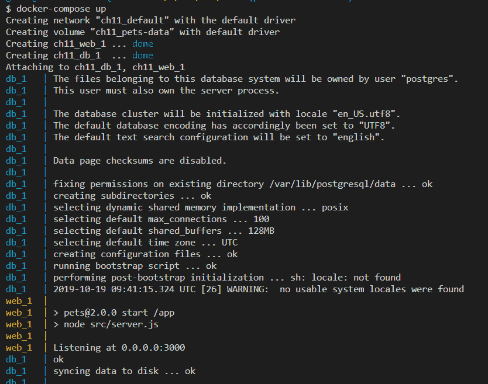
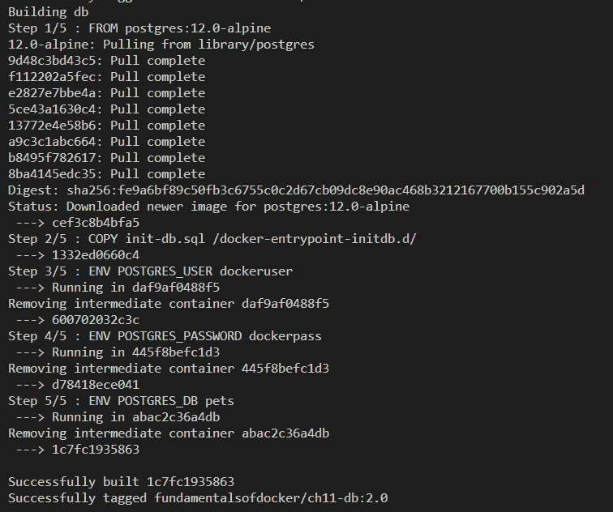
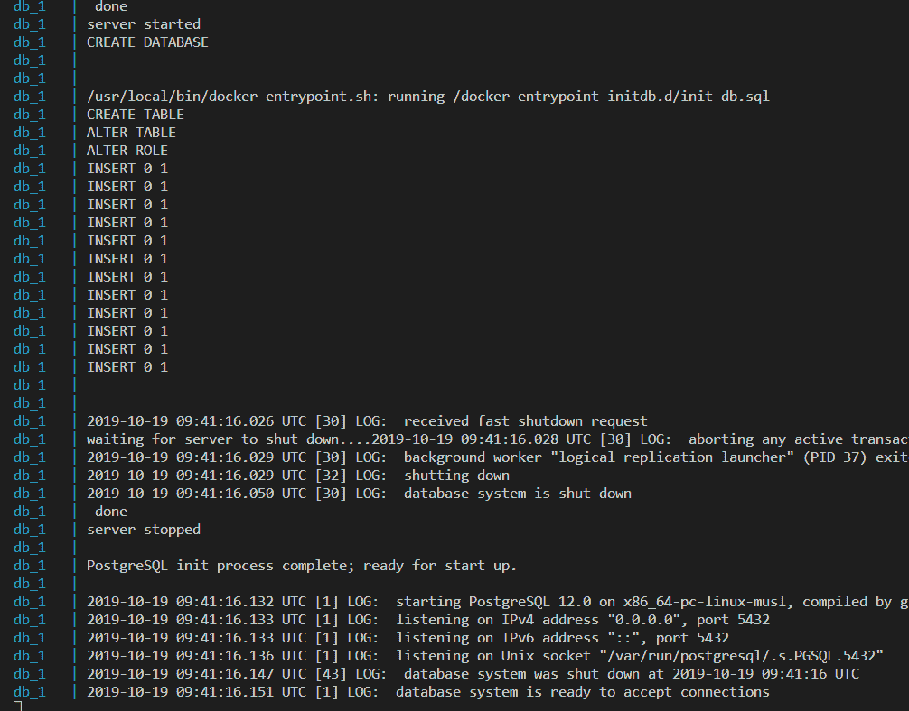

# 第十一章：Docker Compose

在上一章中，我们学到了关于容器网络在单个 Docker 主机上是如何工作的。我们介绍了**容器网络模型**（**CNM**），它构成了 Docker 容器之间所有网络的基础，然后我们深入研究了 CNM 的不同实现，特别是桥接网络。最后，我们介绍了 Traefik，一个反向代理，以实现容器之间复杂的 HTTP 应用级路由。

本章介绍了一个应用程序由多个服务组成的概念，每个服务在一个容器中运行，以及 Docker Compose 如何允许我们使用声明式方法轻松构建、运行和扩展这样的应用程序。

本章涵盖以下主题：

+   揭秘声明式与命令式

+   运行多服务应用程序

+   扩展服务

+   构建和推送应用程序

+   使用 Docker Compose 覆盖

完成本章后，读者将能够做到以下事情：

+   用几句简短的话解释命令式和声明式方法在定义和运行应用程序方面的主要区别

+   用自己的话描述容器和 Docker Compose 服务之间的区别

+   为简单的多服务应用程序编写 Docker Compose YAML 文件

+   使用 Docker Compose 构建、推送、部署和拆除简单的多服务应用程序

+   使用 Docker Compose 扩展和缩减应用服务

+   使用覆盖定义特定于环境的 Docker Compose 文件

# 技术要求

本章附带的代码可以在以下位置找到：[`github.com/PacktPublishing/Learn-Docker---Fundamentals-of-Docker-19.x-Second-Edition/tree/master/ch11`](https://github.com/PacktPublishing/Learn-Docker---Fundamentals-of-Docker-19.x-Second-Edition/tree/master/ch11)。

您需要在系统上安装`docker-compose`。如果您在 Windows 或 macOS 计算机上安装了 Docker for Desktop 或 Docker Toolbox，则这是自动的。否则，您可以在这里找到详细的安装说明：[`docs.docker.com/compose/install/`](https://docs.docker.com/compose/install/)

# 揭秘声明式与命令式

Docker Compose 是 Docker 提供的一个工具，主要用于在单个 Docker 主机上运行和编排容器。这包括但不限于开发、**持续集成**（**CI**）、自动化测试、手动 QA 或演示。

Docker Compose 使用 YAML 格式的文件作为输入。默认情况下，Docker Compose 期望这些文件被称为`docker-compose.yml`，但也可以使用其他名称。`docker-compose.yml`的内容被称为描述和运行一个可能由多个容器组成的容器化应用程序的*声明性*方式。

那么，*声明性的意思是什么呢？*

首先，*声明性*是*命令式*的反义词。好吧，这并没有太大帮助。既然我介绍了另一个定义，我需要解释这两个定义：

+   **命令式：**这是一种通过指定系统必须遵循的确切过程来解决问题的方式。

如果我命令式地告诉 Docker 守护程序如何运行一个应用程序，那意味着我必须逐步描述系统必须做什么，以及如果发生意外情况时系统必须如何反应。我必须非常明确和精确地说明我的指示。我需要涵盖所有边缘情况以及它们需要如何处理。

+   **声明式：**这是一种解决问题的方式，不需要程序员指定要遵循的确切过程。

声明性方法意味着我告诉 Docker 引擎我的应用程序的期望状态是什么，它必须自行解决如何实现这个期望状态，以及如果系统偏离了这个状态，如何调和它。

Docker 在处理容器化应用程序时明确推荐使用声明性方法。因此，Docker Compose 工具使用了这种方法。

# 运行多服务应用程序

在大多数情况下，应用程序不仅由一个单块组成，而是由几个应用程序服务共同工作。使用 Docker 容器时，每个应用程序服务都在自己的容器中运行。当我们想要运行这样一个多服务应用程序时，当然可以使用众所周知的`docker container run`命令启动所有参与的容器，我们在之前的章节中已经这样做了。但这充其量是低效的。使用 Docker Compose 工具，我们可以以声明性的方式在使用 YAML 格式的文件中定义应用程序。

让我们来看一个简单的`docker-compose.yml`文件的内容：

```
version: "2.4"
services:
 web:
    image: fundamentalsofdocker/ch11-web:2.0
    build: web
    ports:
    - 80:3000
 db:
    image: fundamentalsofdocker/ch11-db:2.0
    build: db
    volumes:
    - pets-data:/var/lib/postgresql/data

volumes:
 pets-data:
```

文件中的行解释如下：

+   `version`：在这一行中，我们指定要使用的 Docker Compose 格式的版本。在撰写本文时，这是 2.4 版本。

+   `服务`：在这一部分，我们在`services`块中指定了构成我们应用程序的服务。在我们的示例中，我们有两个应用程序服务，我们称它们为`web`和`db`：

+   `web`：`web`服务使用一个名为`fundamentalsofdocker/ch11-web:2.0`的镜像，如果镜像不在镜像缓存中，它将从`web`文件夹中的`Dockerfile`构建。该服务还将容器端口`3000`发布到主机端口`80`。

+   `db`：另一方面，`db`服务使用的是镜像名称`fundamentalsofdocker/ch11-db:2.0`，这是一个定制的 PostgreSQL 数据库。同样，如果镜像不在缓存中，它将从`db`文件夹中的`Dockerfile`构建。我们将一个名为`pets-data`的卷挂载到`db`服务的容器中。

+   `卷`：任何服务使用的卷都必须在此部分声明。在我们的示例中，这是文件的最后一部分。第一次运行应用程序时，Docker 将创建一个名为`pets-data`的卷，然后在后续运行中，如果卷仍然存在，它将被重用。当应用程序由于某种原因崩溃并需要重新启动时，这可能很重要。然后，先前的数据仍然存在并准备好供重新启动的数据库服务使用。

请注意，我们使用的是 Docker Compose 文件语法的 2.x 版本。这是针对单个 Docker 主机部署的版本。Docker Compose 文件语法还存在 3.x 版本。当您想要定义一个针对 Docker Swarm 或 Kubernetes 的应用程序时，可以使用此版本。我们将从第十二章开始更详细地讨论这个问题，*编排器*。

# 使用 Docker Compose 构建镜像

导航到`fods`文件夹的`ch11`子文件夹，然后构建镜像：

```
$ cd ~/fod/ch11
$ docker-compose build
```

如果我们输入上述命令，那么工具将假定当前目录中必须有一个名为`docker-compose.yml`的文件，并将使用该文件来运行。在我们的情况下，确实如此，工具将构建镜像。

在您的终端窗口中，您应该看到类似于这样的输出：

！[](assets/9c627297-4997-47b2-804b-19cc63213e24.png)

为 web 服务构建 Docker 镜像

在上述屏幕截图中，您可以看到`docker-compose`首先从 Docker Hub 下载了基本图像`node:12.12-alpine`，用于我们正在构建的 Web 图像。 随后，它使用`web`文件夹中找到的`Dockerfile`构建图像，并将其命名为`fundamentalsofdocker/ch11-web:2.0`。 但这只是第一部分； 输出的第二部分应该类似于这样：

浏览器中的示例应用程序

创建了两个服务，`ch11_web_1`和`ch11_db_1`，并将它们附加到网络

在这里，`docker-compose`再次从 Docker Hub 拉取基本图像`postgres:12.0-alpine`，然后使用`db`文件夹中找到的`Dockerfile`构建我们称为`fundamentalsofdocker/ch11-db:2.0`的图像。

# 使用 Docker Compose 运行应用程序

构建了 db 服务的 Docker 镜像

```
$ docker-compose up
```

输出将向我们展示应用程序的启动。 我们应该看到以下内容：

运行示例应用程序，第一部分

在输出的第一部分中，我们看到 Docker Compose 执行以下操作：

+   现在让我们看一下输出的第二部分：

+   创建名为`ch11_pets-data`的卷

+   现在我们可以打开一个浏览器标签，并导航到`localhost/animal`。 我们应该会看到我在肯尼亚马赛马拉国家公园拍摄的一张野生动物的照片：

Docker Compose 还显示了数据库（蓝色）和 Web 服务（黄色）生成的日志输出。 倒数第三行的输出向我们展示了 Web 服务已准备就绪，并在端口`3000`上监听。 请记住，这是容器端口，而不是主机端口。 我们已将容器端口`3000`映射到主机端口`80`，这是我们稍后将访问的端口。



运行示例应用程序，第二部分

我们已经缩短了输出的第二部分。 它向我们展示了数据库如何完成初始化。 我们可以具体看到我们的初始化脚本`init-db.sql`的应用，该脚本定义了一个数据库并用一些数据填充它。


创建名为`ch11_default`的桥接网络

一旦我们构建了图像，就可以使用 Docker Compose 启动应用程序：

刷新浏览器几次以查看其他猫的图片。 应用程序从数据库中存储的 12 个图像的 URL 中随机选择当前图像。

由于应用程序正在交互模式下运行，因此我们运行 Docker Compose 的终端被阻塞，我们可以通过按*Ctrl*+*C*来取消应用程序。如果我们这样做，我们会看到以下内容：

```
^CGracefully stopping... (press Ctrl+C again to force)
Stopping ch11_web_1 ... done
Stopping ch11_db_1 ... done
```

我们会注意到数据库和 web 服务会立即停止。不过有时，一些服务可能需要大约 10 秒钟才能停止。原因是数据库和 web 服务监听并对 Docker 发送的`SIGTERM`信号做出反应，而其他服务可能不会，因此 Docker 在预定义的 10 秒超时间隔后将它们杀死。

如果我们再次使用`docker-compose up`运行应用程序，输出将会更短：

docker-compose up 的输出

这一次，我们不需要下载镜像，数据库也不需要从头开始初始化，而是只是重用了上一次运行中已经存在的`pets-data`卷中的数据。

我们也可以在后台运行应用程序。所有容器将作为守护进程运行。为此，我们只需要使用`-d`参数，如下面的代码所示：

```
$ docker-compose up -d
```

Docker Compose 为我们提供了许多比`up`更多的命令。我们可以使用这个工具来列出应用程序中的所有服务：

docker-compose ps 的输出

这个命令类似于`docker container ls`，唯一的区别是`docker-compose`只列出应用程序中的容器或服务。

要停止和清理应用程序，我们使用`docker-compose down`命令：

```
$ docker-compose down
Stopping ch11_web_1 ... done
Stopping ch11_db_1 ... done
Removing ch11_web_1 ... done
Removing ch11_db_1 ... done
Removing network ch11_default
```

如果我们还想删除数据库的卷，那么我们可以使用以下命令：

```
$ docker volume rm ch11_pets-data
```

或者，我们可以将`docker-compose down`和`docker volume rm <volume name>`两个命令合并成一个单一的命令：

```
$ docker-compose down -v
```

在这里，参数`-v`（或`--volumes`）会移除在`compose`文件的`volumes`部分声明的命名卷和附加到容器的匿名卷。

为什么卷的名称中有一个`ch11`前缀？在`docker-compose.yml`文件中，我们已经调用了要使用的卷为`pets-data`。但是，正如我们已经提到的，Docker Compose 会用父文件夹的名称加上下划线作为所有名称的前缀。在这种情况下，父文件夹的名称叫做`ch11`。如果你不喜欢这种方法，你可以显式地定义一个项目名称，例如：

```
$ docker-compose -p my-app up
```

它使用了一个名为 my-app 的项目名称来运行应用程序。

# 扩展服务

现在，让我们假设我们的示例应用程序已经在网络上运行并且变得非常成功。很多人想要看我们可爱的动物图片。所以现在我们面临一个问题，因为我们的应用程序开始变慢了。为了解决这个问题，我们想要运行多个 web 服务的实例。使用 Docker Compose，这很容易实现。

运行更多实例也被称为扩展。我们可以使用这个工具将我们的`web`服务扩展到，比如说，三个实例：

```
$ docker-compose up --scale web=3
```

如果我们这样做，我们会有一个惊喜。输出将类似于以下的截图：

docker-compose --scale 的输出

web 服务的第二个和第三个实例无法启动。错误消息告诉我们原因：我们不能多次使用相同的主机端口`80`。当第 2 和第 3 个实例尝试启动时，Docker 意识到端口`80`已经被第一个实例占用。*我们能做什么？*嗯，我们可以让 Docker 决定为每个实例使用哪个主机端口。

如果在`compose`文件的`ports`部分中，我们只指定容器端口，而不指定主机端口，那么 Docker 会自动选择一个临时端口。让我们就这样做：

1.  首先，让我们拆除应用程序：

```
$ docker-compose down
```

1.  然后，我们修改`docker-compose.yml`文件如下所示：

```
version: "2.4"
services:
  web:
    image: fundamentalsofdocker/ch11-web:2.0
    build: web
    ports:
      - 3000
  db:
    image: fundamentalsofdocker/ch11-db:2.0
    build: db
    volumes:
      - pets-data:/var/lib/postgresql/data

volumes:
  pets-data:
```

1.  现在，我们可以再次启动应用程序，并立即扩展它：

```
$ docker-compose up -d
$ docker-compose up -d --scale web=3
Starting ch11_web_1 ... done
Creating ch11_web_2 ... done
Creating ch11_web_3 ... done
```

1.  如果我们现在执行`docker-compose ps`，我们应该会看到以下的截图：

docker-compose ps 的输出

1.  正如我们所看到的，每个服务都关联到了不同的主机端口。我们可以尝试看看它们是否工作，比如使用`curl`。让我们测试第三个实例，`ch11_web_3`：

```
$ curl -4 localhost:32772
Pets Demo Application
```

答案`Pets Demo Application`告诉我们，我们的应用程序确实仍然按预期工作。为了确保，尝试对其他两个实例进行测试。

# 构建和推送应用程序

我们之前已经看到，我们也可以使用`docker-compose build`命令来构建`docker-compose`文件中定义的应用程序的镜像。但是为了使其工作，我们必须将构建信息添加到`docker-compose`文件中。在文件夹中，我们有一个名为`docker-compose.dev.yml`的文件，其中已经添加了这些指令。它基本上是我们迄今为止使用的`docker-compose.yml`文件的副本。

```
version: "2.4"
services:
  web:
    build: web
    image: fundamentalsofdocker/ch11-web:2.0
    ports:
      - 80:3000
  db:
    build: db
    image: fundamentalsofdocker/ch1-db:2.0
    volumes:
      - pets-data:/var/lib/postgresql/data

volumes:
  pets-data:
```

请注意每个服务的`build`键。该键的值表示 Docker 期望找到`Dockerfile`以构建相应映像的上下文或文件夹。如果我们想要为`web`服务使用命名不同的`Dockerfile`，比如`Dockerfile-dev`，那么`docker-compose`文件中的`build`块将如下所示：

```
build:
    context: web
    dockerfile: Dockerfile-dev
```

现在让我们使用另一个`docker-compose-dev.yml`文件：

```
$ docker-compose -f docker-compose.dev.yml build
```

`-f`参数将告诉 Docker Compose 应用程序使用哪个`compose`文件。

要将所有映像推送到 Docker Hub，我们可以使用`docker-compose push`。我们需要登录到 Docker Hub，以便成功，否则在推送时会出现身份验证错误。因此，在我的情况下，我执行以下操作：

```
$ docker login -u fundamentalsofdocker -p <password>
```

假设登录成功，然后我可以推送以下代码：

```
$ docker-compose -f docker-compose.dev.yml push
```

这可能需要一段时间，具体取决于您的互联网连接带宽。在推送时，您的屏幕可能看起来类似于这样：


使用 docker-compose 将映像推送到 Docker Hub

上述命令将两个映像推送到 Docker Hub 上的`fundamentalsofdocker`帐户。您可以在以下网址找到这两个映像：[`hub.docker.com/u/fundamentalsofdocker/`](https://hub.docker.com/u/fundamentalsofdocker/)

# 使用 Docker Compose 覆盖

有时，我们希望在需要特定配置设置的不同环境中运行我们的应用程序。Docker Compose 提供了一个方便的功能来解决这个问题。

让我们举一个具体的例子。我们可以定义一个基本的 Docker Compose 文件，然后定义特定于环境的覆盖。假设我们有一个名为`docker-compose.base.yml`的文件，内容如下：

```
version: "2.4"
services:
  web:
    image: fundamentalsofdocker/ch11-web:2.0
  db:
    image: fundamentalsofdocker/ch11-db:2.0
    volumes:
      - pets-data:/var/lib/postgresql/data

volumes:
  pets-data:
```

这只定义了在所有环境中应该相同的部分。所有特定的设置都已被移除。

假设我们想要在 CI 系统上运行我们的示例应用程序，但是我们想要为数据库使用不同的设置。我们用来创建数据库映像的`Dockerfile`如下所示：

```
FROM postgres:12.0-alpine
COPY init-db.sql /docker-entrypoint-initdb.d/
ENV POSTGRES_USER dockeruser
ENV POSTGRES_PASSWORD dockerpass
ENV POSTGRES_DB pets
```

请注意我们在第 3 到 5 行定义的三个环境变量。`web`服务的`Dockerfile`具有类似的定义。假设在 CI 系统上，我们想要执行以下操作：

+   从代码构建映像

+   将`POSTGRES_PASSWORD`定义为`ci-pass`

+   将 web 服务的容器端口`3000`映射到主机端口`5000`

然后，相应的覆盖文件将如下所示：

```
version: "2.4"
services:
  web:
    build: web
    ports:
      - 5000:3000
    environment:
      POSTGRES_PASSWORD: ci-pass
  db:
    build: db
    environment:
      POSTGRES_PASSWORD: ci-pass
```

我们可以使用以下命令运行此应用程序：

```
$ docker-compose -f docker-compose.yml -f docker-compose-ci.yml up -d --build
```

请注意，第一个`-f`参数提供基本的 Docker Compose 文件，第二个参数提供覆盖文件。`--build`参数用于强制`docker-compose`重新构建镜像。

在使用环境变量时，请注意以下优先级：

+   在 Docker 文件中声明它们会定义默认值

+   在 Docker Compose 文件中声明相同的变量会覆盖 Dockerfile 中的值

如果我们遵循标准命名约定，将基本文件命名为`docker-compose.yml`，覆盖文件命名为`docker-compose.override.yml`，那么我们可以使用`docker-compose up -d`来启动应用程序，而无需显式命名 compose 文件。

# 总结

在本章中，我们介绍了`docker-compose`工具。该工具主要用于在单个 Docker 主机上运行和扩展多服务应用程序。通常，开发人员和 CI 服务器使用单个主机，这两者是 Docker Compose 的主要用户。该工具使用 YAML 文件作为输入，其中包含以声明方式描述应用程序的描述。

该工具还可用于构建和推送镜像，以及许多其他有用的任务。本章附带的代码可以在`fod/ch11`中找到。

在下一章中，我们将介绍**编排器**。编排器是一种基础设施软件，用于在集群中运行和管理容器化应用程序，同时确保这些应用程序始终处于所需的状态。

# 问题

为了评估您的学习进度，请回答以下问题：

1.  你将如何使用`docker-compose`以守护进程模式运行应用程序？

1.  你将如何使用`docker-compose`来显示运行服务的详细信息？

1.  你将如何将特定的 web 服务扩展到比如说三个实例？

# 进一步阅读

以下链接提供了本章讨论的主题的额外信息：

+   官方 YAML 网站：[`www.yaml.org/`](http://www.yaml.org/)

+   Docker Compose 文档：[`dockr.ly/1FL2VQ6`](http://dockr.ly/1FL2VQ6)

+   Compose 文件版本 2 参考：[`dohttps://docs.docker.com/compose/compose-file/compose-file-v2/`](https://docs.docker.com/compose/compose-file/compose-file-v2/)

+   在文件和项目之间共享 Compose 配置：[`docs.docker.com/compose/extends/`](https://docs.docker.com/compose/extends/)
