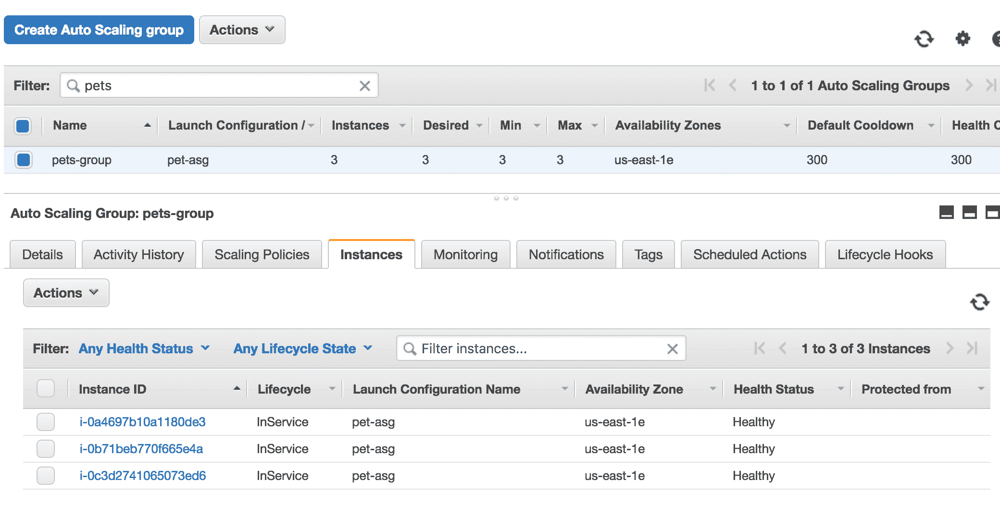
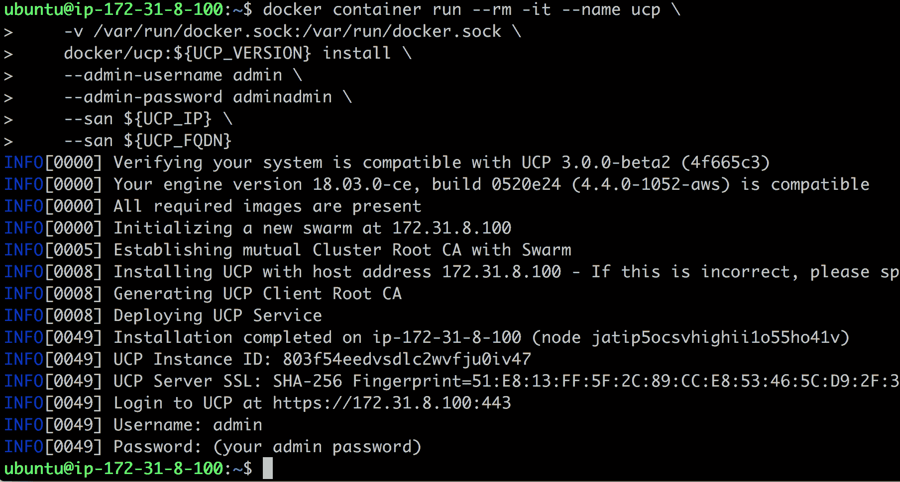
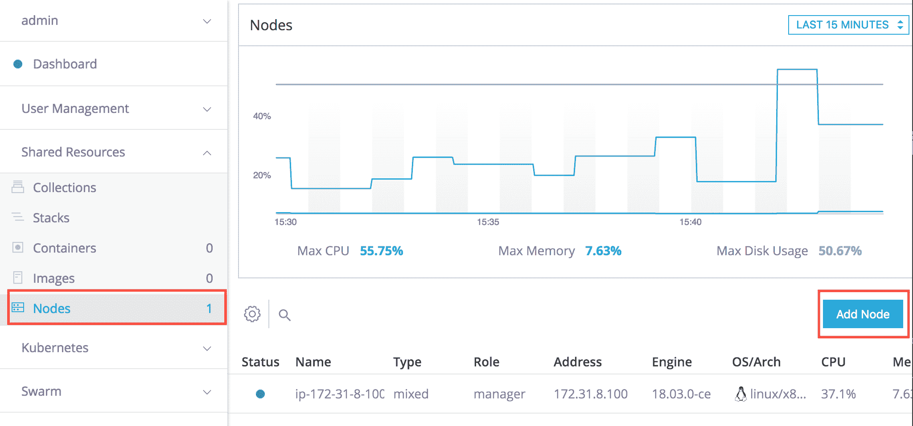
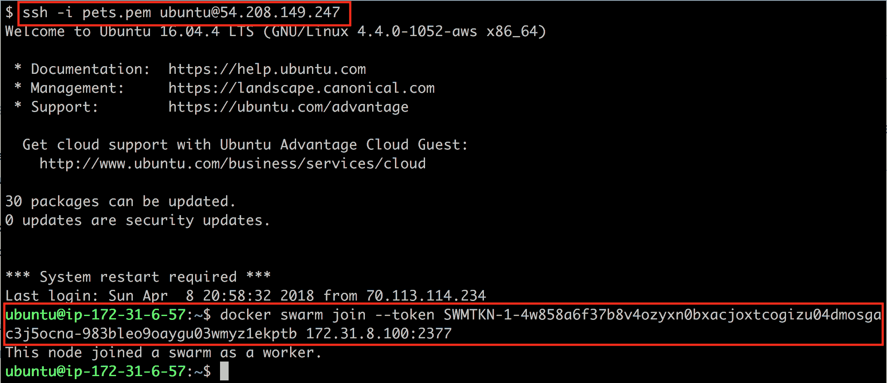
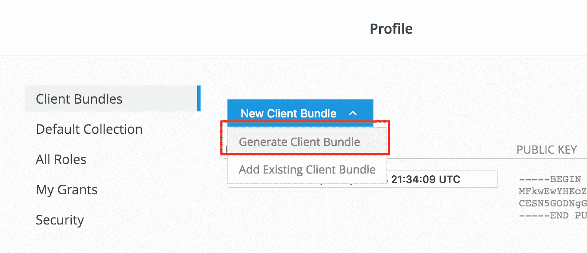

# 第十八章：在云中运行容器化应用程序

在上一章中，我们学习了如何在生产环境中部署、监控和排除故障。

在本章中，我们将概述在云中运行容器化应用程序的一些最流行的方法。我们将探讨自托管和托管解决方案，并讨论它们的优缺点。我们将简要讨论来自供应商如 Microsoft Azure 和 Google Cloud Engine 的完全托管的解决方案。

以下是本章将讨论的主题：

+   在**Amazon Web Services** (**AWS**)上部署和使用 Docker **Enterprise Edition** (**EE**)

+   探索 Microsoft 的**Azure Kubernetes Service** (**AKS**)

+   了解**Google Kubernetes Engine** (**GKE**)

阅读完本章后，您将能够做到以下几点：

+   使用 Docker EE 在 AWS 中创建一个 Kubernetes 集群

+   在 AWS 上部署和运行一个简单的分布式应用程序的 Docker EE 集群

+   在 Microsoft 的 AKS 上部署和运行一个简单的分布式应用程序

+   在 GKE 上部署和运行一个简单的分布式应用程序

# 技术要求

在本章中，我们将使用 AWS、Microsoft Azure 和 Google Cloud。因此，需要为每个平台拥有一个账户。如果您没有现有账户，可以要求这些云服务提供商提供试用账户。

我们还将使用 GitHub 上我们的`labs`仓库中`~/fod-solution/ch18`文件夹中的文件，网址为[`github.com/PacktPublishing/Learn-Docker---Fundamentals-of-Docker-19.x-Second-Edition/tree/master/ch18`](https://github.com/PacktPublishing/Learn-Docker---Fundamentals-of-Docker-19.x-Second-Edition/tree/master/ch18)。

# 在 AWS 上部署和使用 Docker EE

在这一部分，我们将安装 Docker **Universal Control Plane** (**UCP**) 版本 3.0。UCP 是 Docker 企业套件的一部分，支持两种编排引擎，Docker Swarm 和 Kubernetes。UCP 可以在云端或本地安装。甚至可以在 UCP 中使用混合云。

要尝试这个，您需要一个 Docker EE 的有效许可证，或者您可以在 Docker Store 上申请免费测试许可证。

# 基础设施的规划

在这一部分，我们将设置安装 Docker UCP 所需的基础设施。如果您对 AWS 有一定了解，这相对比较简单。让我们按照以下步骤来做：

1.  在 AWS 中使用 Ubuntu 16.04 服务器 AMI 创建一个**自动扩展组**（**ASG**）。配置 ASG 包含三个大小为`t2.xlarge`的实例。这是此操作的结果：

AWS 上准备好 Docker EE 的 ASG

一旦 ASG 创建完成，并且在继续之前，我们需要稍微打开**安全组**（**SG**）（我们的 ASG 是其中的一部分），以便我们可以通过 SSH 从我们的笔记本访问它，也以便**虚拟机**（**VMs**）可以相互通信。

1.  转到您的 SG 并添加两个新的入站规则，如下所示：

AWS SG 设置

在上面的屏幕截图中，第一个规则允许来自我的个人笔记本（IP 地址为`70.113.114.234`）的任何流量访问 SG 中的任何资源。第二个规则允许 SG 内部的任何流量。这些设置不适用于生产环境，因为它们太过宽松。但是，对于此演示环境，它们效果很好。

接下来，我们将向您展示如何在我们刚准备好的虚拟机上安装 Docker。

# 安装 Docker

在配置完集群节点之后，我们需要在每个节点上安装 Docker。按照以下步骤可以轻松实现：

1.  SSH 进入所有三个实例并安装 Docker。使用下载的密钥，SSH 进入第一台机器：

```
$ ssh -i pets.pem ubuntu@<IP address>
```

在这里，`<IP 地址>`是我们要 SSH 进入的 VM 的公共 IP 地址。

1.  现在我们可以安装 Docker 了。有关详细说明，请参阅[`dockr.ly/2HiWfBc`](https://dockr.ly/2HiWfBc)。我们在`~/fod/ch18/aws`文件夹中有一个名为`install-docker.sh`的脚本可以使用。

1.  首先，我们需要将`labs` GitHub 存储库克隆到虚拟机中：

```
$ git clone https://github.com/PacktPublishing/Learn-Docker---Fundamentals-of-Docker-19.x-Second-Edition.git ~/fod
$ cd ~/fod/ch18/aws
```

1.  然后，我们运行脚本来安装 Docker：

```
$ ./install-docker.sh
```

1.  脚本完成后，我们可以使用`sudo docker version`验证 Docker 是否已安装。对其他两个 VM 重复前面的代码。

`sudo`只在下一个 SSH 会话打开到此 VM 之前是必要的，因为我们已将`ubuntu`用户添加到`docker`组中。因此，我们需要退出当前的 SSH 会话并重新连接。这次，`sudo`不应与`docker`一起使用。

接下来，我们将展示如何在我们刚准备好的基础设施上安装 Docker UCP。

# 安装 Docker UCP

我们需要设置一些环境变量，如下所示：

```
$ export UCP_IP=<IP address>
$ export UCP_FQDN=<FQDN>
$ export UCP_VERSION=3.0.0-beta2
```

在这里，`<IP 地址>`和`<FQDN>`是我们在 UCP 中安装的 AWS EC2 实例的公共 IP 地址和公共 DNS 名称。

之后，我们可以使用以下命令下载 UCP 需要的所有镜像：

```
$ docker run --rm docker/ucp:${UCP_VERSION} images --list \
 | xargs -L 1 docker pull
```

最后，我们可以安装 UCP：

在 AWS 的 VM 中安装 UCP 3.0.0-beta2

现在，我们可以打开浏览器窗口并导航到`https://<IP 地址>`。使用您的用户名`admin`和密码`adminadmin`登录。当要求许可证时，上传您的许可证密钥或按照链接获取试用许可证。

登录后，在左侧的“共享资源”部分下，选择“节点”，然后单击“添加节点”按钮：

向 UCP 添加新节点

在随后的“添加节点”对话框中，请确保节点类型为 Linux，并选择“工作节点”角色。然后，复制对话框底部的`docker swarm join`命令。SSH 进入您创建的另外两个 VM 并运行此命令，使相应的节点加入 Docker Swarm 作为工作节点：

将节点作为工作节点加入到 UCP 集群

回到 UCP 的 Web UI 中，您应该看到我们现在有三个准备好的节点，如下所示：

UCP 集群中的节点列表

默认情况下，工作节点被配置为只能运行 Docker Swarm 工作负载。但是，这可以在节点详细信息中更改。在此，有三种设置可能：仅 Swarm、仅 Kubernetes 或混合工作负载。让我们从 Docker Swarm 作为编排引擎开始，并部署我们的宠物应用程序。

# 使用远程管理员管理 UCP 集群

为了能够从我们的笔记本电脑远程管理我们的 UCP 集群，我们需要从 UCP 中创建并下载一个所谓的**客户端包**。按照以下步骤进行：

1.  在 UCP Web UI 中，在左侧的“管理员”下，选择“我的个人资料”选项。

1.  在随后的对话中，选择“新客户端包”选项，然后生成客户端包：

生成并下载 UCP 客户端包

1.  在您的磁盘上找到并解压下载的包。

1.  在新的终端窗口中，导航到该文件夹并源化`env.sh`文件：

```
$ source env.sh
```

您应该会得到类似于这样的输出：

```
Cluster "ucp_34.232.53.86:6443_admin" set.
User "ucp_34.232.53.86:6443_admin" set.
Context "ucp_34.232.53.86:6443_admin" created.
```

现在，我们可以验证我们确实可以远程访问 UCP 集群，例如，列出集群的所有节点：

列出远程 UCP 集群的所有节点

在下一节中，我们将看看如何使用 Docker Swarm 作为编排引擎将宠物应用程序部署为堆栈。

# 部署到 Docker Swarm

现在是时候将我们的分布式应用程序部署到由 Docker Swarm 编排的集群了。按照以下步骤进行操作：

1.  在终端中，导航到`〜/fod/ch18/ucp`文件夹，并使用`stack.yml`文件创建`pets`堆栈：

将宠物堆栈部署到 UCP 集群

1.  在 UCP Web UI 中，我们可以验证已创建堆栈：

UCP Web UI 中的宠物堆栈列表

1.  为了测试应用程序，我们可以在主菜单的 Swarm 下导航到 Services。集群中运行的服务列表将显示如下：

宠物堆栈的“web”服务的详细信息

在上述截图中，我们看到了`pets`堆栈的两个服务`web`和`db`。如果我们点击`web`服务，它的详细信息将显示在右侧。在那里，我们找到了一个条目，发布的端点。

1.  单击链接，我们的`pets`应用程序应该显示在浏览器中。

完成后，使用以下命令从控制台中删除堆栈：

```
$ docker stack rm pets
```

或者，您可以尝试从 UCP Web UI 中删除该堆栈。

# 部署到 Kubernetes

从用于远程访问 UCP 集群以使用 Docker Swarm 作为编排引擎部署宠物应用程序的堆栈的同一终端，我们现在可以尝试使用 Kubernetes 作为编排引擎将宠物应用程序部署到 UCP 集群。

确保您仍然在`〜/fod/ch18/ucp`文件夹中。使用`kubectl`部署宠物应用程序。首先，我们需要测试是否可以使用 Kubernetes CLI 获取集群的所有节点：

使用 Kubernetes CLI 获取 UCP 集群的所有节点

显然，我的环境已正确配置，并且`kubectl`确实可以列出 UCP 集群中的所有节点。这意味着我现在可以使用`pets.yaml`文件中的定义部署宠物应用程序：

使用 Kubernetes CLI 在 UCP 集群中创建宠物应用程序

使用`kubectl get all`可以列出通过创建的对象。然后在浏览器中，我们可以导航到`http://<IP 地址>:<端口>`来访问宠物应用程序，其中`<IP 地址>`是 UCP 集群节点之一的公共 IP 地址，`<端口>`是`web` Kubernetes 服务发布的端口。

我们在 AWS ASG 中创建了一个由三个 VM 组成的集群，并在其中安装了 Docker 和 UCP 3.0。然后我们将我们著名的宠物应用程序部署到 UCP 集群中，一次使用 Docker Swarm 作为编排引擎，一次使用 Kubernetes。

Docker UCP 是一个平台无关的容器平台，可以在任何云和本地、裸机或虚拟化环境中提供安全的企业级软件供应链。甚至在编排引擎方面也提供了选择的自由。用户可以在 Docker Swarm 和 Kubernetes 之间进行选择。还可以在同一集群中在两个编排器中运行应用程序。

# 探索微软的 Azure Kubernetes 服务（AKS）

要在 Azure 中尝试微软的与容器相关的服务，我们需要在 Azure 上拥有一个帐户。您可以创建一个试用帐户或使用现有帐户。您可以在此处获取免费试用帐户：https://azure.microsoft.com/en-us/free/。

微软在 Azure 上提供了不同的与容器相关的服务。最容易使用的可能是 Azure 容器实例，它承诺在 Azure 中以最快最简单的方式运行容器，而无需预配任何虚拟机，也无需采用更高级别的服务。如果您想在托管环境中运行单个容器，这项服务确实非常有用。设置非常简单。在 Azure 门户（portal.azure.com）中，您首先创建一个新的资源组，然后创建一个 Azure 容器实例。您只需要填写一个简短的表单，包括容器的名称、要使用的镜像和要打开的端口等属性。容器可以在公共或私有 IP 地址上提供，并且如果崩溃，将自动重新启动。还有一个不错的管理控制台可用，例如用于监视 CPU 和内存等资源消耗。

第二种选择是 Azure 容器服务（ACS），它提供了一种简化创建、配置和管理预配置为运行容器化应用程序的虚拟机集群的方式。ACS 使用 Docker 镜像，并提供了三种编排器选择：Kubernetes、Docker Swarm 和 DC/OS（由 Apache Mesos 提供支持）。微软声称他们的服务可以扩展到数万个容器。ACS 是免费的，您只需要为计算资源付费。

在本节中，我们将集中讨论基于 Kubernetes 的最受欢迎的服务。它被称为 AKS，可以在这里找到：[`azure.microsoft.com/en-us/services/kubernetes-service/`](https://azure.microsoft.com/en-us/services/kubernetes-service/)。AKS 使您能够轻松将应用程序部署到云中，并在 Kubernetes 上运行它们。所有繁琐和困难的管理任务都由微软处理，您可以完全专注于您的应用程序。这意味着您永远不必处理诸如安装和管理 Kubernetes、升级 Kubernetes 或升级底层 Kubernetes 节点操作系统等任务。所有这些都由微软 Azure 的专家处理。此外，您永远不必处理`etc`或 Kubernetes 主节点。这些都对您隐藏，您唯一需要与之交互的是运行您的应用程序的 Kubernetes 工作节点。

# 准备 Azure CLI

也就是说，让我们开始吧。我们假设您已经创建了一个免费试用账户，或者您正在使用 Azure 上的现有账户。与 Azure 账户交互的方式有很多种。我们将使用在本地计算机上运行的 Azure CLI。我们可以在本地计算机上本地下载和安装 Azure CLI，也可以在本地 Docker for Desktop 上运行容器中的 Azure CLI。由于本书都是关于容器的，让我们选择后一种方法。

Azure CLI 的最新版本可以在 Docker Hub 上找到。让我们拉取它：

```
$ docker image pull mcr.microsoft.com/azure-cli:latest
```

我们将从此 CLI 运行一个容器，并在容器内部运行所有后续命令。现在，我们需要克服一个小问题。这个容器将不会安装 Docker 客户端。但我们也将运行一些 Docker 命令，所以我们必须创建一个从前面的镜像派生出来的自定义镜像，其中包含一个 Docker 客户端。需要的`Dockerfile`可以在`~/fod/ch18`文件夹中找到，内容如下：

```
FROM mcr.microsoft.com/azure-cli:latest
RUN apk update && apk add docker
```

在第 2 行，我们只是使用 Alpine 软件包管理器`apk`来安装 Docker。然后我们可以使用 Docker Compose 来构建和运行这个自定义镜像。相应的`docker-compose.yml`文件如下：

```
version: "2.4"
services:
    az:
        image: fundamentalsofdocker/azure-cli
        build: .
        command: tail -F anything
        working_dir: /app
        volumes:
            - /var/run/docker.sock:/var/run/docker.sock
            - .:/app
```

请注意用于保持容器运行的命令，以及在`volumes`部分中挂载 Docker 套接字和当前文件夹的命令。如果您在 Windows 上运行 Docker for Desktop，则需要定义`COMPOSE_CONVERT_WINDOWS_PATHS`环境变量以能够挂载 Docker 套接字。使用

从 Bash shell 执行`export COMPOSE_CONVERT_WINDOWS_PATHS=1`，或者在运行 PowerShell 时执行`$Env:COMPOSE_CONVERT_WINDOWS_PATHS=1`。请参考以下链接获取更多详情：[`github.com/docker/compose/issues/4240`](https://github.com/docker/compose/issues/4240)。

现在，让我们构建并运行这个容器：

```
$ docker-compose up --build -d
```

然后，让我们进入`az`容器，并在其中运行一个 Bash shell，命令如下：

```
$ docker-compose exec az /bin/bash

bash-5.0#
```

我们将发现自己在容器内部的 Bash shell 中运行。让我们首先检查 CLI 的版本：

```
bash-5.0# az --version
```

这应该会产生类似于以下内容的输出（缩短版）：

```
azure-cli 2.0.78
...
Your CLI is up-to-date.
```

好的，我们正在运行版本`2.0.78`。接下来，我们需要登录到我们的账户。执行以下命令：

```
bash-5.0# az login
```

您将收到以下消息：

```
To sign in, use a web browser to open the page https://microsoft.com/devicelogin and enter the code <code> to authenticate.
```

按照说明通过浏览器登录。一旦您成功验证了您的 Azure 账户，您可以回到您的终端，您应该已经登录了，这将由您得到的输出所指示：

```
[
  {
    "cloudName": "AzureCloud",
    "id": "<id>",
    "isDefault": true,
    "name": "<account name>",
    "state": "Enabled",
    "tenantId": "<tenant-it>",
    "user": {
      "name": "xxx@hotmail.com",
      "type": "user"
    }
  }
]
```

现在，我们准备首先将我们的容器映像移动到 Azure。

# 在 Azure 上创建一个容器注册表

首先，我们创建一个名为`animal-rg`的新资源组。在 Azure 中，资源组用于逻辑地组合一组相关的资源。为了获得最佳的云体验并保持延迟低，重要的是您选择一个靠近您的地区的数据中心。您可以使用以下命令列出所有地区：

```
bash-5.0# az account list-locations 
[
  {
    "displayName": "East Asia",
    "id": "/subscriptions/186760ad-9152-4499-b317-c9bff441fb9d/locations/eastasia",
    "latitude": "22.267",
    "longitude": "114.188",
    "name": "eastasia",
    "subscriptionId": null
  },
  ...
]
```

这将为您提供一个相当长的列表，列出了您可以选择的所有可能区域。使用`name`，例如`eastasia`，来标识您选择的区域。在我的情况下，我将选择`westeurope`。请注意，并非所有列出的位置都适用于资源组。

创建资源组的命令很简单；我们只需要为组和位置命名：

```
bash-5.0# az group create --name animals-rg --location westeurope

{
  "id": "/subscriptions/186760ad-9152-4499-b317-c9bff441fb9d/resourceGroups/animals-rg",
  "location": "westeurope",
  "managedBy": null,
  "name": "animals-rg",
  "properties": {    
    "provisioningState": "Succeeded"
  },
  "tags": null,
  "type": "Microsoft.Resources/resourceGroups"
}
```

确保您的输出显示`"provisioningState": "Succeeded"`。

在生产环境中运行容器化应用程序时，我们希望确保可以自由地从容器注册表中下载相应的容器图像。到目前为止，我们一直从 Docker Hub 下载我们的图像。但这通常是不可能的。出于安全原因，生产系统的服务器通常无法直接访问互联网，因此无法访问 Docker Hub。让我们遵循这个最佳实践，并假设我们即将创建的 Kubernetes 集群也是如此。

那么，我们能做什么呢？嗯，解决方案是使用一个靠近我们集群的容器镜像注册表，并且处于相同的安全上下文中。在 Azure 中，我们可以创建一个**Azure 容器注册表**（**ACR**）并在那里托管我们的图像。让我们首先创建这样一个注册表：

```
bash-5.0# az acr create --resource-group animals-rg --name <acr-name> --sku Basic
```

请注意，`<acr-name>`需要是唯一的。在我的情况下，我选择了名称`fodanimalsacr`。输出（缩短版）如下所示：

```
{
 "adminUserEnabled": false,
 "creationDate": "2019-12-22T10:31:14.848776+00:00",
 "id": "/subscriptions/186760ad...",
 "location": "westeurope",
 "loginServer": "fodanimalsacr.azurecr.io",
 "name": "fodanimalsacr",
 ...
 "provisioningState": "Succeeded",
```

成功创建容器注册表后，我们需要使用以下命令登录到该注册表：

```
bash-5.0# az acr login --name <acr-name> 
Login Succeeded
WARNING! Your password will be stored unencrypted in /root/.docker/config.json.
Configure a credential helper to remove this warning. See
https://docs.docker.com/engine/reference/commandline/login/#credentials-store
```

一旦我们成功登录到 Azure 上的容器注册表，我们需要正确标记我们的容器，以便我们可以将它们推送到 ACR。接下来将描述标记和推送图像到 ACR。

# 将我们的图像推送到 ACR

一旦我们成功登录到 ACR，我们就可以标记我们的图像，以便它们可以推送到注册表。为此，我们需要获取我们 ACR 实例的 URL。我们可以使用以下命令来实现：

```
$ az acr list --resource-group animals-rg \
 --query "[].{acrLoginServer:loginServer}" \
 --output table

AcrLoginServer
------------------------
fodanimalsacr.azurecr.io
```

现在我们使用前面的 URL 来标记我们的图像：

```
bash-5.0# docker image tag fundamentalsofdocker/ch11-db:2.0 fodanimalsacr.azurecr.io/ch11-db:2.0
bash-5.0# docker image tag fundamentalsofdocker/ch11-web:2.0 fodanimalsacr.azurecr.io/ch11-web:2.0
```

然后，我们可以将它们推送到我们的 ACR 中：

```
bash-5.0# docker image push fodanimalsacr.azurecr.io/ch11-db:2.0
bash-5.0# docker image push fodanimalsacr.azurecr.io/ch11-web:2.0
```

为了再次检查我们的图像确实在我们的 ACR 中，我们可以使用这个命令：

```
bash-5.0# az acr repository  list --name  <acr-name> --output **table** 
Result
--------
ch11-db
ch11-web 
```

实际上，我们刚刚推送的两个图像已列出。有了这个，我们就可以创建我们的 Kubernetes 集群了。

# 创建 Kubernetes 集群

我们将再次使用我们的自定义 Azure CLI 来创建 Kubernetes 集群。我们必须确保集群可以访问我们刚刚创建的 ACR 实例，那里存放着我们的容器映像。因此，创建一个名为`animals-cluster`的集群，带有两个工作节点的命令如下：

```
bash-5.0# az aks create \
 --resource-group animals-rg \
 --name animals-cluster \
 --node-count 2 \
 --generate-ssh-keys \
 --attach-acr <acr-name>
```

这个命令需要一段时间，但几分钟后，我们应该会收到一些 JSON 格式的输出，其中包含了关于新创建的集群的所有细节。

要访问集群，我们需要`kubectl`。我们可以使用这个命令在我们的 Azure CLI 容器中轻松安装它：

```
bash-5.0# az aks install-cli
```

安装了`kubectl`之后，我们需要必要的凭据来使用这个工具在 Azure 中操作我们的新 Kubernetes 集群。我们可以用这个命令获取必要的凭据：

```
bash-5.0# az aks get-credentials --resource-group animals-rg --name animals-cluster 
Merged "animals-cluster" as current context in /root/.kube/config
```

在上一个命令成功执行后，我们可以列出集群中的所有节点：

```
bash-5.0# kubectl get nodes NAME                                STATUS   ROLES   AGE     VERSION
aks-nodepool1-12528297-vmss000000   Ready    agent   4m38s   v1.14.8
aks-nodepool1-12528297-vmss000001   Ready    agent   4m32s   v1.14.8
```

正如预期的那样，我们有两个工作节点正在运行。这些节点上运行的 Kubernetes 版本是`1.14.8`。

现在我们已经准备好将我们的应用程序部署到这个集群中。在下一节中，我们将学习如何做到这一点。

# 将我们的应用程序部署到 Kubernetes 集群

要部署应用程序，我们可以使用`kubectl apply`命令：

```
bash-5.0# kubectl apply -f animals.yaml 
```

上一个命令的输出应该类似于这样：

```
deployment.apps/web created
service/web created
deployment.apps/db created
service/db created
```

现在，我们想要测试这个应用程序。记住，我们为 web 组件创建了一个`LoadBalancer`类型的服务。这个服务将应用程序暴露给互联网。这个过程可能需要一些时间，因为 AKS 除了其他任务外，还需要为这个服务分配一个公共 IP 地址。我们可以用以下命令观察到这一点：

```
bash-5.0# kubectl get service web --watch
```

请注意上一个命令中的`--watch`参数。它允许我们随着时间监视命令的进展。最初，我们应该看到类似于这样的输出：

```
NAME TYPE        CLUSTER-IP  EXTERNAL-IP  PORT(S)         AGE
web LoadBalancer 10.0.124.0  <pending>    3000:32618/TCP  5s
```

公共 IP 地址标记为待定。几分钟后，应该会变成这样：

```
NAME TYPE        CLUSTER-IP  EXTERNAL-IP    PORT(S)         AGE
web LoadBalancer 10.0.124.0  51.105.229.192 3000:32618/TCP  63s
```

我们的应用程序现在准备就绪，位于 IP 地址`51.105.229.192`和端口号`3000`。请注意，负载均衡器将内部端口`32618`映射到外部端口`3000`；这在第一次对我来说并不明显。

让我们来检查一下。在新的浏览器标签中，导航至`http://51.105.229.192:3000/pet`，你应该能看到我们熟悉的应用程序：


我们在 AKS 上运行的示例应用程序

有了这个，我们已成功将我们的分布式应用部署到了 Azure 中托管的 Kubernetes。我们不必担心安装或管理 Kubernetes；我们可以专注于应用本身。

现在我们已经完成了对应用程序的实验，我们不应忘记在 Azure 上删除所有资源，以避免产生不必要的成本。我们可以通过删除资源组来删除所有创建的资源，方法如下：

```
bash-5.0# az group delete --name animal-rg --yes --no-wait 
```

Azure 在容器工作负载方面有一些引人注目的提供，由于 Azure 主要提供开源编排引擎（如 Kubernetes、Docker Swarm、DC/OS 和 Rancher），因此与 AWS 相比，锁定不太明显。从技术上讲，如果我们最初在 Azure 中运行我们的容器化应用程序，然后决定迁移到另一个云提供商，我们仍然可以保持灵活性。成本应该是有限的。

值得注意的是，当您删除资源组时，AKS 集群使用的 Azure Active Directory 服务主体不会被删除。有关如何删除服务主体的详细信息，请参考在线帮助。

接下来是谷歌和他们的 Kubernetes Engine。

# 了解 GKE

谷歌是 Kubernetes 的发明者，迄今为止，也是其背后的推动力。因此，您会期望谷歌在托管 Kubernetes 方面有一个引人注目的提供。现在让我们来看一下。要继续，您需要在谷歌云上拥有现有帐户或在此创建一个测试帐户：[`console.cloud.google.com/freetrial`](https://console.cloud.google.com/freetrial)。按照以下步骤进行：

1.  在主菜单中，选择 Kubernetes Engine。第一次这样做时，Kubernetes 引擎初始化需要一些时间。

1.  接下来，创建一个新项目并将其命名为`massai-mara`；这可能需要一些时间。

1.  一旦准备就绪，我们可以通过点击弹出窗口中的 Create Cluster 来创建一个集群。

1.  在表单的左侧选择**Your first cluster**模板。

1.  将集群命名为`animals-cluster`，选择离您最近的区域或区域，将创建 Kubernetes 集群表单中的所有其他设置保持为默认值，并在表单底部点击 Create。

这将再次花费一些时间为我们提供集群。一旦集群创建完成，我们可以通过点击视图右上角的 shell 图标来打开 Cloud Shell。这应该看起来类似于以下截图：

第一个 Kubernetes 集群已准备就绪，并且 Cloud Shell 在 GKE 中打开

现在，我们可以使用以下命令将我们的`labs`GitHub 存储库克隆到这个环境中：

```
$ git clone https://github.com/PacktPublishing/Learn-Docker---  Fundamentals-of-Docker-19.x-Second-Edition.git ~/fod
$ cd ~/fod/ch18/gce
```

现在，我们应该在当前文件夹中找到一个`animals.yaml`文件，我们可以使用它来将动物应用程序部署到我们的 Kubernetes 集群中。看一下这个文件：

```
$ less animals.yaml
```

它的内容基本与我们在上一章中使用的文件相同。两个不同之处在于：

+   我们使用`LoadBalancer`类型的服务（而不是`NodePort`）来公开`web`组件。

+   我们不使用卷来配置 PostgreSQL 数据库，因为在 GKE 上正确配置 StatefulSets 比在 Minikube 中更复杂一些。这样做的后果是，如果`db` pod 崩溃，我们的动物应用程序将不会保持状态。如何在 GKE 上使用持久卷超出了本书的范围。

另外，请注意，我们不是使用 Google 容器注册表来托管容器映像，而是直接从 Docker Hub 拉取它们。在 Google Cloud 中创建这样的容器注册表非常简单，类似于我们在 AKS 部分学到的内容。

在继续之前，我们需要设置`gcloud`和`kubectl`凭据：

```
$ gcloud container clusters get-credentials animals-cluster --zone europe-west1-b 
Fetching cluster endpoint and auth data.
kubeconfig entry generated for animals-cluster.
```

完成这些操作后，现在是部署应用程序的时候了：

```
$ kubectl create -f animals.yaml 
deployment.apps/web created
service/web created
deployment.apps/db created
service/db created
```

创建对象后，我们可以观察`LoadBalancer`服务`web`，直到它被分配一个公共 IP 地址：

```
$ kubectl get svc/web --watch NAME   TYPE           CLUSTER-IP   EXTERNAL-IP     PORT(S)          AGE
web    LoadBalancer   10.0.5.222   <pending>       3000:32139/TCP   32s
web    LoadBalancer   10.0.5.222   146.148.23.70   3000:32139/TCP   39s
```

输出中的第二行显示了负载均衡器创建仍在等待的情况，第三行显示了最终状态。按*Ctrl* + *C*退出`watch`命令。显然，我们得到了分配的公共 IP 地址`146.148.23.70`，端口为`3000`。

然后，我们可以使用此 IP 地址并导航至`http://<IP 地址>:3000/pet`，我们应该会看到熟悉的动物图像。

完成应用程序的操作后，请删除 Google Cloud 控制台中的集群和项目，以避免不必要的成本。

我们在 GKE 中创建了一个托管的 Kubernetes 集群。然后，我们使用 GKE 门户提供的 Cloud Shell 首先克隆了我们的`labs`GitHub 存储库，然后使用`kubectl`工具将动物应用程序部署到 Kubernetes 集群中。

在研究托管的 Kubernetes 解决方案时，GKE 是一个引人注目的选择。它非常容易上手，而且由于 Google 是 Kubernetes 背后的主要推动力，我们可以放心地利用 Kubernetes 的全部功能。

# 总结

在本书的最后一章中，你首先快速了解了如何安装和使用 Docker 的 UCP，这是 Docker 在 AWS 上的企业产品的一部分。然后，你学会了如何在 AKS 上创建一个托管的 Kubernetes 集群，并在其上运行动物应用程序，接着是在 Google 自己的托管 Kubernetes 解决方案 GKE 上做同样的操作。

我很荣幸你选择了这本书，我想感谢你陪伴我一起探索 Docker 容器和容器编排引擎的旅程。我希望这本书对你的学习之旅有所帮助。祝你在当前和未来的项目中使用容器时一切顺利并取得成功。

# 问题

为了评估你的知识，请回答以下问题：

1.  请提供所需的任务高级描述，以在 AWS 上配置和运行 Docker UPC。

1.  列举一些选择托管的 Kubernetes 解决方案（如 Microsoft 的 AKS 或 Google 的 GKE）来在 Kubernetes 上运行应用程序的原因。

1.  列举两个使用托管的 Kubernetes 解决方案（如 AKS 或 GKE）时，考虑将容器映像托管在相应云提供商的容器注册表的原因。

# 进一步阅读

以下文章为你提供了一些与本章讨论的主题相关的更多信息：

+   在 Linux 服务器上安装单独的 Docker EE 组件 [`dockr.ly/2vH5dpN`](https://dockr.ly/2vH5dpN)

+   Azure 容器服务（AKS）at [`bit.ly/2JglX9d`](https://bit.ly/2JglX9d)

+   Google Kubernetes Engine at [`bit.ly/2I8MjJx`](https://bit.ly/2I8MjJx)
