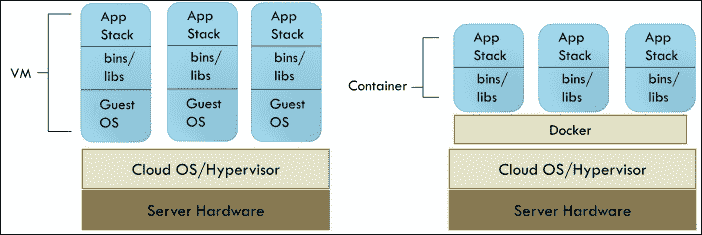
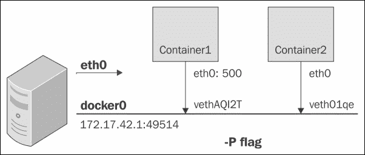
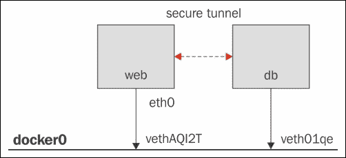
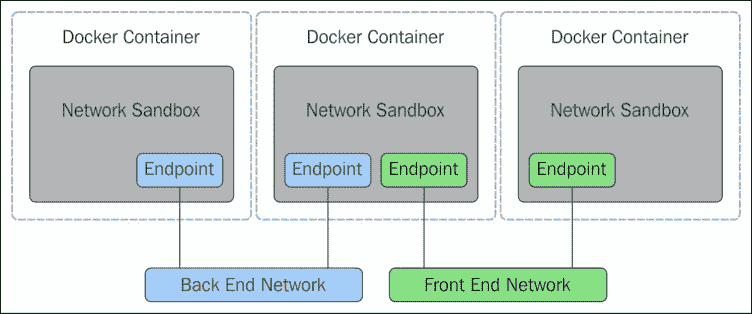

# 第一章：Docker 网络入门

Docker 是一种轻量级的容器技术，近年来引起了巨大的兴趣。它巧妙地捆绑了各种 Linux 内核特性和服务，如命名空间、cgroups、SELinux 和 AppArmor 配置文件，以及 AUFS 和 BTRFS 等联合文件系统，以创建模块化的镜像。这些镜像为应用程序提供了高度可配置的虚拟化环境，并遵循“一次编写，随处运行”的工作流程。一个应用可以由在 Docker 容器中运行的单个进程组成，也可以由在它们自己的容器中运行的多个进程组成，并随着负载的增加而复制。因此，有必要拥有强大的网络元素来支持各种复杂的用例。

在本章中，您将了解 Docker 网络的基本组件以及如何构建和运行简单的容器示例。

本章涵盖以下主题：

+   网络和 Docker

+   `docker0` 桥接网络

+   Docker OVS 网络

+   Unix 域网络

+   链接 Docker 容器

+   Docker 网络的新特性

Docker 在行业中备受关注，因为其性能敏锐和通用可复制的架构，同时提供现代应用开发的以下四个基石：

+   自治

+   去中心化

+   并行性

+   隔离

此外，Thoughtworks 的微服务架构或 LOSA（许多小应用程序）的广泛采用进一步为 Docker 技术带来潜力。因此，谷歌、VMware 和微软等大公司已经将 Docker 移植到他们的基础设施上，而无数的 Docker 初创公司的推出，如 Tutum、Flocker、Giantswarm 等，也在推动这股势头。

由于 Docker 容器可以在开发机器、裸金属服务器、虚拟机或数据中心中复制其行为，因此应用程序设计人员可以专注于开发，而操作语义留给了 DevOps。这使团队工作流程模块化、高效和高产。 Docker 不应与虚拟机（VM）混淆，尽管它们都是虚拟化技术。虽然 Docker 与提供足够隔离和安全性的应用程序共享操作系统，但它后来完全抽象了操作系统并提供了强大的隔离和安全性保证。但是，与 VM 相比，Docker 的资源占用量微不足道，因此更受经济和性能的青睐。但是，它仍然无法完全取代 VM，因此是 VM 技术的补充。以下图表显示了 VM 和 Docker 的架构：

# 网络和 Docker

每个 Docker 容器都有自己的网络堆栈，这是由于 Linux 内核 NET 命名空间，每个容器都有一个新的 NET 命名空间，并且无法从容器外部或其他容器中看到。

Docker 网络由以下网络组件和服务提供支持。

## Linux 桥

这些是内核中内置的 L2/MAC 学习交换机，用于转发。

## Open vSwitch

这是一个可编程的高级桥梁，支持隧道。

## NAT

网络地址转换器是立即实体，用于转换 IP 地址和端口（SNAT、DNAT 等）。

## IPtables

这是内核中用于管理数据包转发、防火墙和 NAT 功能的策略引擎。

## AppArmor/SELinux

每个应用程序都可以使用这些定义防火墙策略。

可以使用各种网络组件来与 Docker 一起工作，提供了访问和使用基于 Docker 的服务的新方法。因此，我们看到了许多遵循不同网络方法的库。其中一些著名的是 Docker Compose、Weave、Kubernetes、Pipework、libnetwork 等。以下图表描述了 Docker 网络的根本思想：

# docker0 桥

`docker0`桥是默认网络的核心。当 Docker 服务启动时，在主机上创建一个 Linux 桥。容器上的接口与桥进行通信，桥代理到外部世界。同一主机上的多个容器可以通过 Linux 桥相互通信。

`docker0`可以通过`--net`标志进行配置，并且通常有四种模式：

+   `--net default`

+   `--net=none`

+   `--net=container:$container2`

+   `--net=host`

## --net default 模式

在此模式下，默认桥被用作容器相互连接的桥。

## --net=none 模式

使用此模式，创建的容器是真正隔离的，无法连接到网络。

## --net=container:$container2 模式

使用此标志，创建的容器与名为`$container2`的容器共享其网络命名空间。

## --net=host 模式

使用此模式，创建的容器与主机共享其网络命名空间。

### Docker 容器中的端口映射

在本节中，我们将看看容器端口是如何映射到主机端口的。这种映射可以由 Docker 引擎隐式完成，也可以被指定。

如果我们创建两个名为**Container1**和**Container2**的容器，它们都被分配了来自私有 IP 地址空间的 IP 地址，并连接到**docker0**桥上，如下图所示：

前述的两个容器都能够相互 ping 通，也能够访问外部世界。

为了外部访问，它们的端口将被映射到主机端口。

如前一节所述，容器使用网络命名空间。当创建第一个容器时，为容器创建了一个新的网络命名空间。在容器和 Linux 桥之间创建了一个 vEthernet 链接。从容器的`eth0`发送的流量通过 vEthernet 接口到达桥，然后进行切换。以下代码可用于显示 Linux 桥的列表：

[PRE0]

输出将类似于以下所示，具有桥名称和其映射到的容器上的`veth`接口：

[PRE1]

容器如何连接到外部世界？主机上的`iptables nat`表用于伪装所有外部连接，如下所示：

[PRE2]

如何从外部世界访问容器？端口映射再次使用主机上的`iptables nat`选项完成。

# Docker OVS

Open vSwitch 是一个强大的网络抽象。下图显示了 OVS 如何与**VM**、**Hypervisor**和**Physical Switch**交互。每个**VM**都有一个与之关联的**vNIC**。每个**vNIC**通过**VIF**（也称为**虚拟接口**）与**虚拟交换机**连接：

OVS 使用隧道机制，如 GRE、VXLAN 或 STT 来创建虚拟覆盖，而不是使用物理网络拓扑和以太网组件。下图显示了 OVS 如何配置为使用 GRE 隧道在多个主机之间进行容器通信：

# Unix 域套接字

在单个主机内，UNIX IPC 机制，特别是 UNIX 域套接字或管道，也可以用于容器之间的通信：

[PRE3]

`c1`和`c2`上的应用程序可以通过以下 Unix 套接字地址进行通信：

[PRE4]

| C1: Server.c | C2: Client.c |
| --- | --- |

|

[PRE5]

|

[PRE6]

|

# 链接 Docker 容器

在本节中，我们介绍了链接两个容器的概念。Docker 在容器之间创建了一个隧道，不需要在容器上外部公开任何端口。它使用环境变量作为从父容器传递信息到子容器的机制之一。

除了环境变量`env`之外，Docker 还将源容器的主机条目添加到`/etc/hosts`文件中。以下是主机文件的示例：

[PRE7]

有两个条目：

+   第一个是用 Docker 容器 ID 作为主机名的`c2`容器的条目

+   第二个条目，`172.17.0.2 c1alaias 6e5cdeb2d300 c1`，使用`link`别名来引用`c1`容器的 IP 地址

下图显示了两个容器**容器 1**和**容器 2**使用 veth 对连接到`docker0`桥接器，带有`--icc=true`。这意味着这两个容器可以通过桥接器相互访问：

## 链接

链接为 Docker 提供了服务发现。它们允许容器通过使用标志`-link name:alias`来发现并安全地相互通信。通过使用守护程序标志`-icc=false`可以禁用容器之间的相互通信。设置为`false`后，**容器 1**除非通过链接明确允许，否则无法访问**容器 2**。这对于保护容器来说是一个巨大的优势。当两个容器被链接在一起时，Docker 会在它们之间创建父子关系，如下图所示：

从外部看，它看起来像这样：

[PRE8]

在内部，它看起来像这样：

[PRE9]

# Docker 网络的新特性是什么？

Docker 网络处于非常初期阶段，开发者社区有许多有趣的贡献，如 Pipework、Weave、Clocker 和 Kubernetes。每个都反映了 Docker 网络的不同方面。我们将在后面的章节中了解它们。Docker, Inc.还建立了一个新项目，网络将被标准化。它被称为**libnetwork**。

libnetwork 实现了**容器网络模型**（**CNM**），它规范了为容器提供网络所需的步骤，同时提供了一个抽象，可以支持多个网络驱动程序。CNM 建立在三个主要组件上——沙盒、端点和网络。

## 沙盒

沙盒包含容器网络栈的配置。这包括容器的接口管理、路由表和 DNS 设置。沙盒的实现可以是 Linux 网络命名空间、FreeBSD 监狱或类似的概念。一个沙盒可以包含来自多个网络的许多端点。

## 端点

端点将沙盒连接到网络。端点的实现可以是 veth 对、Open vSwitch 内部端口或类似的东西。一个端点只能属于一个网络，但只能属于一个沙盒。

## 网络

网络是一组能够直接相互通信的端点。网络的实现可以是 Linux 桥接、VLAN 等。网络由许多端点组成，如下图所示：

# Docker CNM 模型

CNM 提供了网络和容器之间的以下约定：

+   同一网络上的所有容器可以自由通信

+   多个网络是在容器之间分段流量的方式，并且所有驱动程序都应该支持它

+   每个容器可以有多个端点，这是将容器连接到多个网络的方法。

+   端点被添加到网络沙箱中，以提供网络连接。

我们将在第六章中讨论 CNM 的实现细节，*Docker 的下一代网络堆栈：libnetwork*。

# 总结

在本章中，我们学习了 Docker 网络的基本组件，这些组件是从简单的 Docker 抽象和强大的网络组件（如 Linux 桥和 Open vSwitch）的耦合中发展而来的。

我们学习了 Docker 容器可以以各种模式创建。在默认模式下，通过端口映射可以帮助使用 iptables NAT 规则，使得到达主机的流量可以到达容器。在本章后面，我们介绍了容器的基本链接。我们还讨论了下一代 Docker 网络，称为 libnetwork。
