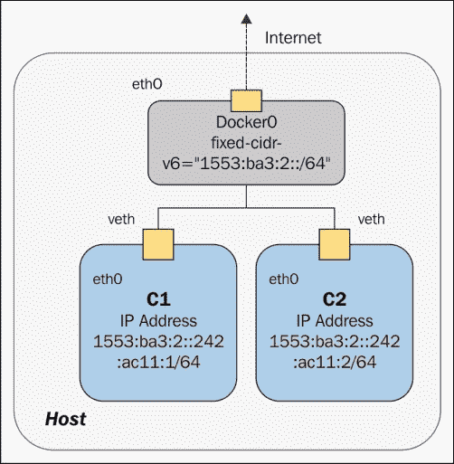
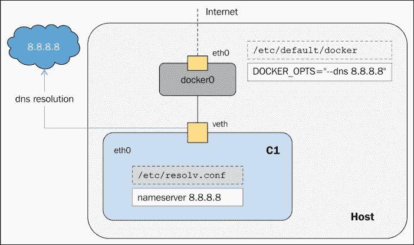
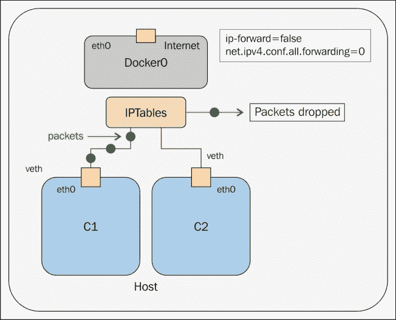
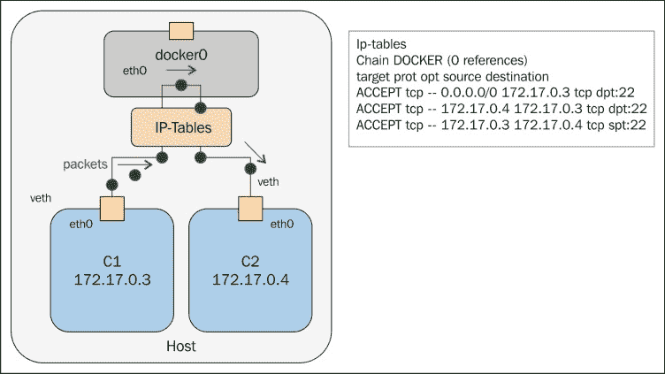
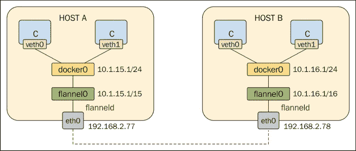
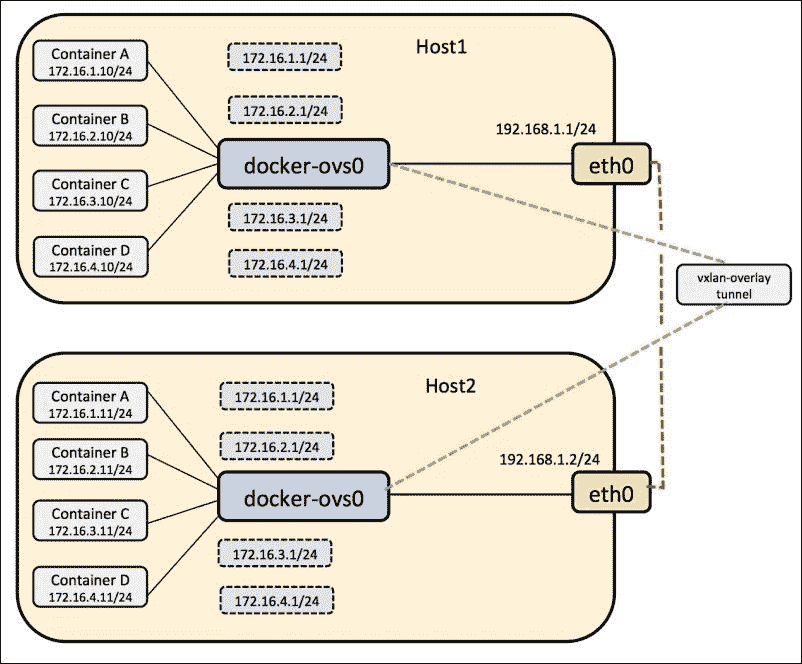

# 第二章。Docker 网络内部

本章详细讨论了 Docker 网络的语义和语法，揭示了当前 Docker 网络范式的优势和劣势。

它涵盖以下主题：

+   为 Docker 配置 IP 堆栈

+   IPv4 支持

+   IPv4 地址管理问题

+   IPv6 支持

+   配置 DNS

+   DNS 基础知识

+   多播 DNS

+   配置 Docker 桥

+   覆盖网络和底层网络

+   它们是什么？

+   Docker 如何使用它们？

+   它们有哪些优势？

# 为 Docker 配置 IP 堆栈

Docker 使用 IP 堆栈通过 TCP 或 UDP 与外部世界进行交互。它支持 IPv4 和 IPv6 寻址基础设施，这些将在以下小节中解释。

## IPv4 支持

默认情况下，Docker 为每个容器提供 IPv4 地址，这些地址附加到默认的`docker0`桥上。可以在启动 Docker 守护程序时使用`--fixed-cidr`标志指定 IP 地址范围，如下面的代码所示：

```
**$ sudo docker –d --fixed-cidr=192.168.1.0/25**

```

我们将在*配置 Docker 桥*部分中更多讨论这个问题。

Docker 守护程序可以在 IPv4 TCP 端点上列出，还可以在 Unix 套接字上列出：

```
**$ sudo docker -H tcp://127.0.0.1:2375 -H unix:///var/run/docker.sock -d &**

```

## IPv6 支持

IPv4 和 IPv6 可以一起运行；这被称为**双栈**。通过使用`--ipv6`标志运行 Docker 守护程序来启用此双栈支持。Docker 将使用 IPv6 链路本地地址`fe80::1`设置`docker0`桥。所有容器之间共享的数据包都通过此桥流动。

要为您的容器分配全局可路由的 IPv6 地址，必须指定一个 IPv6 子网以选择地址。

以下命令通过`--fixed-cidr-v6`参数在启动 Docker 时设置 IPv6 子网，并向路由表添加新路由：

```
**# docker –d --ipv6 --fixed-cidr-v6="1553:ba3:2::/64"**
**# docker run -t -i --name c0 ubuntu:latest /bin/bash**

```

下图显示了配置了 IPv6 地址范围的 Docker 桥：



如果在容器内部使用`ifconfig`检查 IP 地址范围，您会注意到适当的子网已分配给`eth0`接口，如下面的代码所示：

```
#ifconfig
eth0      Link encap:Ethernet HWaddr 02:42:ac:11:00:01
          inet addr:172.17.0.1  Bcast:0.0.0.0  Mask:255.255.0.0
          inet6 addr: fe80::42:acff:fe11:1/64 Scope:Link
          inet6 addr: 1553:ba3:2::242:ac11:1/64 Scope:Global
          UP BROADCAST RUNNING MULTICAST  MTU:1500  Metric:1
          RX packets:7 errors:0 dropped:0 overruns:0 frame:0
          TX packets:10 errors:0 dropped:0 overruns:0 carrier:0
          collisions:0 txqueuelen:0
          RX bytes:738 (738.0 B)  TX bytes:836 (836.0 B)

lo        Link encap:Local Loopback
          inet addr:127.0.0.1  Mask:255.0.0.0
          inet6 addr: ::1/128 Scope:Host
          UP LOOPBACK RUNNING  MTU:65536  Metric:1
          RX packets:0 errors:0 dropped:0 overruns:0 frame:0
          TX packets:0 errors:0 dropped:0 overruns:0 carrier:0
          collisions:0 txqueuelen:0
          RX bytes:0 (0.0 B)  TX bytes:0 (0.0 B)
```

所有流向`1553:ba3:2::/64`子网的流量将通过`docker0`接口路由。

前面的容器使用`fe80::42:acff:fe11:1/64`作为链路本地地址和`1553:ba3:2::242:ac11:1/64`作为全局可路由的 IPv6 地址。

### 注意

链路本地和环回地址具有链路本地范围，这意味着它们应该在直接连接的网络（链路）中使用。所有其他地址具有全局（或通用）范围，这意味着它们在全球范围内可路由，并且可以用于连接到任何具有全局范围的地址。

# 配置 DNS 服务器

Docker 为每个容器提供主机名和 DNS 配置，而无需我们构建自定义镜像。它在容器内部覆盖`/etc`文件夹，其中可以写入新信息。

通过在容器内运行`mount`命令可以看到这一点。容器在初始创建时会接收与主机机器相同的`resolv.conf`文件。如果主机的`resolv.conf`文件被修改，只有当容器重新启动时，这将反映在容器的`/resolv.conf`文件中。

在 Docker 中，您可以通过两种方式设置 DNS 选项：

+   使用`docker run --dns=<ip-address>`

+   将`DOCKER_OPTS="--dns ip-address"`添加到 Docker 守护程序文件中

您还可以使用`--dns-search=<DOMAIN>`指定搜索域。

下图显示了在 Docker 守护程序文件中使用`DOCKER_OPTS`设置在容器中配置**nameserver**：



主 DNS 文件如下：

+   `/etc/hostname`

+   `/etc/resolv.conf`

+   `/etc/hosts`

以下是添加 DNS 服务器的命令：

```
**# docker run --dns=8.8.8.8 --net="bridge" -t -i  ubuntu:latest /bin/bash**

```

使用以下命令添加主机名：

```
**#docker run --dns=8.8.8.8 --hostname=docker-vm1  -t -i  ubuntu:latest /bin/bash**

```

## 容器与外部网络之间的通信

只有当`ip_forward`参数设置为`1`时，数据包才能在容器之间传递。通常，您将简单地将 Docker 服务器保留在其默认设置`--ip-forward=true`，并且当服务器启动时，Docker 会为您将`ip_forward`设置为`1`。

要检查设置或手动打开 IP 转发，请使用以下命令：

```
**# cat /proc/sys/net/ipv4/ip_forward**
**0**
**# echo 1 > /proc/sys/net/ipv4/ip_forward**
**# cat /proc/sys/net/ipv4/ip_forward**
**1**

```

通过启用`ip_forward`，用户可以使容器与外部世界之间的通信成为可能；如果您处于多桥设置中，这也将需要用于容器间通信。下图显示了`ip_forward = false`如何将所有数据包转发到/从容器到/从外部网络：


Docker 不会删除或修改 Docker 过滤链中的任何现有规则。这允许用户创建规则以限制对容器的访问。

Docker 使用`docker0`桥来在单个主机上的所有容器之间进行数据包流动。它添加了一个规则，使用 IPTables 转发链，以便数据包在两个容器之间流动。设置`--icc=false`将丢弃所有数据包。

当 Docker 守护程序配置为`--icc=false`和`--iptables=true`，并且使用`--link`选项调用`docker run`时，Docker 服务器将为新容器插入一对 IPTables 接受规则，以便连接到其他容器暴露的端口，这些端口是在其 Dockerfile 的暴露行中提到的端口。以下图显示了`ip_forward = false`如何丢弃所有来自/到达外部网络的容器的数据包：



默认情况下，Docker 的`forward`规则允许所有外部 IP。要允许只有特定 IP 或网络访问这些容器，插入一个否定规则到 Docker 过滤链的顶部。

例如，使用以下命令，您可以限制外部访问，只有源 IP`10.10.10.10`可以访问这些容器：

```
**#iptables –I DOCKER –i ext_if ! –s 10.10.10.10 –j DROP**

```

### 限制一个容器到另一个容器的 SSH 访问

按照以下步骤限制一个容器到另一个容器的 SSH 访问：

1.  创建两个容器，`c1`和`c2`。

对于`c1`，使用以下命令：

```
**# docker run -i -t --name c1 ubuntu:latest /bin/bash**

```

生成的输出如下：

```
**root@7bc2b6cb1025:/# ifconfig**
**eth0      Link encap:Ethernet  HWaddr 02:42:ac:11:00:05**
 **inet addr:172.17.0.5  Bcast:0.0.0.0  Mask:255.255.0.0**
 **inet6 addr: 2001:db8:1::242:ac11:5/64 Scope:Global**
 **inet6 addr: fe80::42:acff:fe11:5/64 Scope:Link**
 **UP BROADCAST RUNNING MULTICAST  MTU:1500  Metric:1**
 **RX packets:7 errors:0 dropped:0 overruns:0 frame:0**
 **TX packets:8 errors:0 dropped:0 overruns:0 carrier:0**
 **collisions:0 txqueuelen:0**
 **RX bytes:738 (738.0 B)  TX bytes:696 (696.0 B)**
**lo        Link encap:Local Loopback**
 **inet addr:127.0.0.1  Mask:255.0.0.0**
 **inet6 addr: ::1/128 Scope:Host**
 **UP LOOPBACK RUNNING  MTU:65536  Metric:1**
 **RX packets:0 errors:0 dropped:0 overruns:0 frame:0**
 **TX packets:0 errors:0 dropped:0 overruns:0 carrier:0**
 **collisions:0 txqueuelen:0**
 **RX bytes:0 (0.0 B)  TX bytes:0 (0.0 B)**

```

对于`c2`，使用以下命令：

```
**# docker run -i -t --name c2 ubuntu:latest /bin/bash**

```

生成的输出如下：

```
**root@e58a9bf7120b:/# ifconfig**
**eth0      Link encap:Ethernet  HWaddr 02:42:ac:11:00:06**
 **inet addr:172.17.0.6  Bcast:0.0.0.0  Mask:255.255.0.0**
 **inet6 addr: 2001:db8:1::242:ac11:6/64 Scope:Global**
 **inet6 addr: fe80::42:acff:fe11:6/64 Scope:Link**
 **UP BROADCAST RUNNING MULTICAST  MTU:1500  Metric:1**
 **RX packets:6 errors:0 dropped:0 overruns:0 frame:0**
 **TX packets:8 errors:0 dropped:0 overruns:0 carrier:0**
 **collisions:0 txqueuelen:0**
 **RX bytes:648 (648.0 B)  TX bytes:696 (696.0 B)**
**lo        Link encap:Local Loopback**
 **inet addr:127.0.0.1  Mask:255.0.0.0**
 **inet6 addr: ::1/128 Scope:Host**
 **UP LOOPBACK RUNNING  MTU:65536  Metric:1**
 **RX packets:0 errors:0 dropped:0 overruns:0 frame:0**
 **TX packets:0 errors:0 dropped:0 overruns:0 carrier:0**
 **collisions:0 txqueuelen:0**
 **RX bytes:0 (0.0 B)  TX bytes:0 (0.0 B)**

```

我们可以使用刚刚发现的 IP 地址测试容器之间的连接。现在让我们使用`ping`工具来看一下：

```
**root@7bc2b6cb1025:/# ping 172.17.0.6**
**PING 172.17.0.6 (172.17.0.6) 56(84) bytes of data.**
**64 bytes from 172.17.0.6: icmp_seq=1 ttl=64 time=0.139 ms**
**64 bytes from 172.17.0.6: icmp_seq=2 ttl=64 time=0.110 ms**
**^C**
**--- 172.17.0.6 ping statistics ---**
**2 packets transmitted, 2 received, 0% packet loss, time 999ms**
**rtt min/avg/max/mdev = 0.110/0.124/0.139/0.018 ms**
**root@7bc2b6cb1025:/#**

**root@e58a9bf7120b:/# ping 172.17.0.5**
**PING 172.17.0.5 (172.17.0.5) 56(84) bytes of data.**
**64 bytes from 172.17.0.5: icmp_seq=1 ttl=64 time=0.270 ms**
**64 bytes from 172.17.0.5: icmp_seq=2 ttl=64 time=0.107 ms**
**^C**
**--- 172.17.0.5 ping statistics ---**
**2 packets transmitted, 2 received, 0% packet loss, time 1002ms**
**rtt min/avg/max/mdev = 0.107/0.188/0.270/0.082 ms**
**root@e58a9bf7120b:/#**

```

1.  在两个容器上安装`openssh-server`：

```
**#apt-get install openssh-server**

```

1.  在主机机器上启用 iptables：

1.  最初，您可以从一个容器 SSH 到另一个容器。

1.  停止 Docker 服务，并在主机机器的默认 Dockerfile 中添加`DOCKER_OPTS="--icc=false --iptables=true"`。此选项将启用 iptables 防火墙，并且丢弃容器之间的所有端口。

默认情况下，主机上未启用`iptables`。使用以下命令启用它：

```
**root@ubuntu:~# iptables -L -n**
**Chain INPUT (policy ACCEPT)**
**target     prot opt source               destination**
**Chain FORWARD (policy ACCEPT)**
**target     prot opt source               destination**
**DOCKER     all  --  0.0.0.0/0            0.0.0.0/0**
**ACCEPT     all  --  0.0.0.0/0            0.0.0.0/0            ctstate RELATED,ESTABLISHED**
**ACCEPT     all  --  0.0.0.0/0            0.0.0.0/0**
**DOCKER     all  --  0.0.0.0/0            0.0.0.0/0**
**ACCEPT     all  --  0.0.0.0/0            0.0.0.0/0            ctstate RELATED,ESTABLISHED**
**ACCEPT     all  --  0.0.0.0/0            0.0.0.0/0**
**ACCEPT     all  --  0.0.0.0/0            0.0.0.0/0**
**ACCEPT     all  --  0.0.0.0/0            0.0.0.0/0**

**#service docker stop**
**#vi /etc/default/docker**

```

1.  Docker Upstart 和 SysVinit 配置文件。自定义 Docker 二进制文件的位置（特别是用于开发测试）：

```
**#DOCKER="/usr/local/bin/docker"**

```

1.  使用`DOCKER_OPTS`修改守护程序的启动选项：

```
**#DOCKER_OPTS="--dns 8.8.8.8 --dns 8.8.4.4"**
**#DOCKER_OPTS="--icc=false --iptables=true"**

```

1.  重新启动 Docker 服务：

```
**# service docker start**

```

1.  检查`iptables`：

```
**root@ubuntu:~# iptables -L -n**
**Chain INPUT (policy ACCEPT)**
**target     prot opt source             destination**
**Chain FORWARD (policy ACCEPT)**
**target     prot opt source             destination**
**DOCKER     all  --  0.0.0.0/0          0.0.0.0/0**
**ACCEPT     all  --  0.0.0.0/0          0.0.0.0/0    ctstate RELATED, ESTABLISHED**
**ACCEPT     all  --  0.0.0.0/0          0.0.0.0/0**
**DOCKER     all  --  0.0.0.0/0          0.0.0.0/0**
**ACCEPT     all  --  0.0.0.0/0          0.0.0.0/0   ctstate RELATED, ESTABLISHED**
**ACCEPT     all  --  0.0.0.0/0          0.0.0.0/0**
**ACCEPT     all  --  0.0.0.0/0          0.0.0.0/0**
**DROP       all  --  0.0.0.0/0          0.0.0.0/0**

```

在主机上添加了一个`DROP`规则到 iptables，它会丢弃容器之间的连接。现在您将无法在容器之间进行 SSH。

1.  我们可以使用`--link`参数进行容器之间的通信或连接，以下是使用的步骤：

1.  创建第一个充当服务器的容器`sshserver`：

```
**root@ubuntu:~# docker run -i -t -p 2222:22 --name sshserver ubuntu bash**
**root@9770be5acbab:/#**

```

1.  执行`iptables`命令，您会发现添加了一个 Docker 链规则：

```
**#root@ubuntu:~# iptables -L -n**
**Chain INPUT (policy ACCEPT)**
**target     prot opt source         destination**
**Chain FORWARD (policy ACCEPT)**
**target     prot opt source         destination**
**Chain OUTPUT (policy ACCEPT)**
**target     prot opt source         destination**
**Chain DOCKER (0 references)**
**target     prot opt source         destination**
**ACCEPT     tcp  --  0.0.0.0/0        172.17.0.3     tcp dpt:22**

```

1.  创建第二个充当客户端的容器`sshclient`：

```
**root@ubuntu:~# docker run -i -t --name sshclient --link sshserver:sshserver ubuntu bash**
**root@979d46c5c6a5:/#**

```

1.  我们可以看到 Docker 链规则中添加了更多规则：

```
**root@ubuntu:~# iptables -L -n**
**Chain INPUT (policy ACCEPT)**
**target     prot opt source               destination**
**Chain FORWARD (policy ACCEPT)**
**target     prot opt source               destination**
**Chain OUTPUT (policy ACCEPT)**
**target     prot opt source               destination**
**Chain DOCKER (0 references)**
**target     prot opt source               destination**
**ACCEPT     tcp  --  0.0.0.0/0            172.17.0.3           tcp dpt:22**
**ACCEPT     tcp  --  172.17.0.4           172.17.0.3           tcp dpt:22**
**ACCEPT     tcp  --  172.17.0.3           172.17.0.4           tcp spt:22**
**root@ubuntu:~#**

```

以下图片解释了使用`--link`标志之间容器之间的通信：



1.  您可以使用`docker inspect`命令检查已连接的容器：

```
**root@ubuntu:~# docker inspect -f "{{ .HostConfig.Links }}" sshclient**
**[/sshserver:/sshclient/sshserver]**

```

现在您可以使用其 IP 成功 ssh 到 sshserver。

```
**#ssh root@172.17.0.3 –p 22**

```

使用`--link`参数，Docker 在容器之间创建一个安全通道，不需要在容器上外部公开任何端口。

# 配置 Docker 桥

Docker 服务器默认在 Linux 内核中创建一个名为`docker0`的桥，并且可以在其他物理或虚拟网络接口之间来回传递数据包，使它们表现为单个以太网网络。运行以下命令以查找 VM 中接口的列表以及它们连接到的 IP 地址：

```
**root@ubuntu:~# ifconfig**
**docker0   Link encap:Ethernet  HWaddr 56:84:7a:fe:97:99**
 **inet addr:172.17.42.1  Bcast:0.0.0.0  Mask:255.255.0.0**
 **inet6 addr: fe80::5484:7aff:fefe:9799/64 Scope:Link**
 **inet6 addr: fe80::1/64 Scope:Link**
 **UP BROADCAST RUNNING MULTICAST  MTU:1500  Metric:1**
 **RX packets:11909 errors:0 dropped:0 overruns:0 frame:0**
 **TX packets:14826 errors:0 dropped:0 overruns:0 carrier:0**
 **collisions:0 txqueuelen:0**
 **RX bytes:516868 (516.8 KB)  TX bytes:46460483 (46.4 MB)**
**eth0      Link encap:Ethernet  HWaddr 00:0c:29:0d:f4:2c**
 **inet addr:192.168.186.129  Bcast:192.168.186.255  Mask:255.255.255.0**
 **inet6 addr: fe80::20c:29ff:fe0d:f42c/64 Scope:Link**
 **UP BROADCAST RUNNING MULTICAST  MTU:1500  Metric:1**
 **RX packets:108865 errors:0 dropped:0 overruns:0 frame:0**
 **TX packets:31708 errors:0 dropped:0 overruns:0 carrier:0**
 **collisions:0 txqueuelen:1000**
 **RX bytes:59902195 (59.9 MB)  TX bytes:3916180 (3.9 MB)**
**lo        Link encap:Local Loopback**
 **inet addr:127.0.0.1  Mask:255.0.0.0**
 **inet6 addr: ::1/128 Scope:Host**
 **UP LOOPBACK RUNNING  MTU:65536  Metric:1**
 **RX packets:4 errors:0 dropped:0 overruns:0 frame:0**
 **TX packets:4 errors:0 dropped:0 overruns:0 carrier:0**
 **collisions:0 txqueuelen:0**
 **RX bytes:336 (336.0 B)  TX bytes:336 (336.0 B)**

```

一旦您有一个或多个容器正在运行，您可以通过在主机上运行`brctl`命令并查看输出的`interfaces`列来确认 Docker 已将它们正确连接到`docker0`桥。

在配置`docker0`桥之前，安装桥接实用程序：

```
**# apt-get install bridge-utils**

```

以下是一个连接了两个不同容器的主机：

```
**root@ubuntu:~# brctl show**
**bridge name     bridge id               STP enabled     interfaces**
**docker0         8000.56847afe9799       no              veth21b2e16**
 **veth7092a45**

```

Docker 在创建容器时使用`docker0`桥接设置。每当创建新容器时，它会从桥上可用的范围中分配一个新的 IP 地址，如下所示：

```
**root@ubuntu:~# docker run -t -i --name container1 ubuntu:latest /bin/bash**
**root@e54e9312dc04:/# ifconfig**
**eth0      Link encap:Ethernet  HWaddr 02:42:ac:11:00:07**
 **inet addr:172.17.0.7  Bcast:0.0.0.0  Mask:255.255.0.0**
 **inet6 addr: 2001:db8:1::242:ac11:7/64 Scope:Global**
 **inet6 addr: fe80::42:acff:fe11:7/64 Scope:Link**
 **UP BROADCAST RUNNING MULTICAST  MTU:1500  Metric:1**
 **RX packets:7 errors:0 dropped:0 overruns:0 frame:0**
 **TX packets:8 errors:0 dropped:0 overruns:0 carrier:0**
 **collisions:0 txqueuelen:0**
 **RX bytes:738 (738.0 B)  TX bytes:696 (696.0 B)**
**lo        Link encap:Local Loopback**
 **inet addr:127.0.0.1  Mask:255.0.0.0**
 **inet6 addr: ::1/128 Scope:Host**
 **UP LOOPBACK RUNNING  MTU:65536  Metric:1**
 **RX packets:0 errors:0 dropped:0 overruns:0 frame:0**
 **TX packets:0 errors:0 dropped:0 overruns:0 carrier:0**
 **collisions:0 txqueuelen:0**
 **RX bytes:0 (0.0 B)  TX bytes:0 (0.0 B)**
**root@e54e9312dc04:/# ip route**
**default via 172.17.42.1 dev eth0**
**172.17.0.0/16 dev eth0  proto kernel  scope link  src 172.17.0.7**

```

默认情况下，Docker 提供名为`docker0`的虚拟网络，其 IP 地址为`172.17.42.1`。Docker 容器的 IP 地址在`172.17.0.0/16`范围内。

要更改 Docker 中的默认设置，请修改文件`/etc/default/docker`。

将默认桥从`docker0`更改为`br0`可以这样做：

```
**# sudo service docker stop**
**# sudo ip link set dev docker0 down**
**# sudo brctl delbr docker0**
**# sudo iptables -t nat -F POSTROUTING**
**# echo 'DOCKER_OPTS="-b=br0"' >> /etc/default/docker**
**# sudo brctl addbr br0**
**# sudo ip addr add 192.168.10.1/24 dev br0**
**# sudo ip link set dev br0 up**
**# sudo service docker start**

```

以下命令显示了 Docker 服务的新桥名称和 IP 地址范围：

```
**root@ubuntu:~# ifconfig**
**br0       Link encap:Ethernet  HWaddr ae:b2:dc:ed:e6:af**
 **inet addr:192.168.10.1  Bcast:0.0.0.0  Mask:255.255.255.0**
 **inet6 addr: fe80::acb2:dcff:feed:e6af/64 Scope:Link**
 **UP BROADCAST RUNNING MULTICAST  MTU:1500  Metric:1**
 **RX packets:0 errors:0 dropped:0 overruns:0 frame:0**
 **TX packets:7 errors:0 dropped:0 overruns:0 carrier:0**
 **collisions:0 txqueuelen:0**
 **RX bytes:0 (0.0 B)  TX bytes:738 (738.0 B)**
**eth0      Link encap:Ethernet  HWaddr 00:0c:29:0d:f4:2c**
 **inet addr:192.168.186.129  Bcast:192.168.186.255  Mask:255.255.255.0**
 **inet6 addr: fe80::20c:29ff:fe0d:f42c/64 Scope:Link**
 **UP BROADCAST RUNNING MULTICAST  MTU:1500  Metric:1**
 **RX packets:110823 errors:0 dropped:0 overruns:0 frame:0**
 **TX packets:33148 errors:0 dropped:0 overruns:0 carrier:0**
 **collisions:0 txqueuelen:1000**
 **RX bytes:60081009 (60.0 MB)  TX bytes:4176982 (4.1 MB)**
**lo        Link encap:Local Loopback**
 **inet addr:127.0.0.1  Mask:255.0.0.0**
 **inet6 addr: ::1/128 Scope:Host**
 **UP LOOPBACK RUNNING  MTU:65536  Metric:1**
 **RX packets:4 errors:0 dropped:0 overruns:0 frame:0**
 **TX packets:4 errors:0 dropped:0 overruns:0 carrier:0**
 **collisions:0 txqueuelen:0**
 **RX bytes:336 (336.0 B)  TX bytes:336 (336.0 B)**

```

# 覆盖网络和底层网络

覆盖是建立在底层网络基础设施（底层）之上的虚拟网络。其目的是实现在物理网络中不可用的网络服务。

网络覆盖大大增加了可以在物理网络之上创建的虚拟子网的数量，从而支持多租户和虚拟化。

Docker 中的每个容器都被分配一个 IP 地址，用于与其他容器通信。如果容器需要与外部网络通信，您可以在主机系统中设置网络，并将容器的端口暴露或映射到主机上。通过这种方式，容器内运行的应用程序将无法广告其外部 IP 和端口，因为这些信息对它们不可用。

解决方案是在所有主机上为每个 Docker 容器分配唯一的 IP，并且有一些网络产品来路由主机之间的流量。

有不同的项目来处理 Docker 网络，如下所示：

+   Flannel

+   Weave

+   Open vSwitch

Flannel 通过为每个容器分配一个 IP 来提供解决方案，用于容器之间的通信。它使用数据包封装，在主机网络上创建一个虚拟覆盖网络。默认情况下，Flannel 为主机提供一个`/24`子网，Docker 守护程序从中为容器分配 IP。以下图显示了使用 Flannel 进行容器之间通信：



Flannel 在每个主机上运行一个代理**flanneld**，负责从预配置的地址空间中分配子网租约。Flannel 使用 etcd 存储网络配置、分配的子网和辅助数据（如主机的 IP）。

Flannel 使用通用的 TUN/TAP 设备，并使用 UDP 创建覆盖网络来封装 IP 数据包。子网分配是通过 etcd 的帮助完成的，它维护覆盖子网到主机的映射。

Weave 创建了一个虚拟网络，连接了部署在主机/虚拟机上的 Docker 容器，并实现它们的自动发现。以下图显示了 Weave 网络：


Weave 可以穿越防火墙，在部分连接的网络中运行。流量可以选择加密，允许主机/虚拟机在不受信任的网络中连接。

Weave 增强了 Docker 现有（单个主机）的网络功能，比如`docker0`桥，因此这些功能可以继续被容器使用。

Open vSwitch 是一个开源的支持 OpenFlow 的虚拟交换机，通常与虚拟化程序一起使用，在主机内部和跨网络的不同主机之间连接虚拟机。覆盖网络需要使用支持的隧道封装来创建虚拟数据路径，例如 VXLAN 和 GRE。

覆盖数据路径是在 Docker 主机中的隧道端点之间进行配置的，这使得在给定提供者段内的所有主机看起来直接连接在一起。

当新容器上线时，前缀会在路由协议中更新，通过隧道端点宣布其位置。当其他 Docker 主机接收到更新时，转发规则会被安装到 OVS 中，用于主机所在的隧道端点。当主机取消配置时，类似的过程会发生，隧道端点 Docker 主机会移除取消配置容器的转发条目。下图显示了通过基于 OVS 的 VXLAN 隧道在多个主机上运行的容器之间的通信：



# 总结

在本章中，我们讨论了 Docker 的内部网络架构。我们了解了 Docker 中的 IPv4、IPv6 和 DNS 配置。在本章的后面，我们涵盖了 Docker 桥接和单个主机内以及多个主机之间容器之间的通信。

我们还讨论了在 Docker 网络中实施的覆盖隧道和不同的方法，例如 OVS、Flannel 和 Weave。

在下一章中，我们将学习 Docker 网络的实际操作，结合各种框架。
