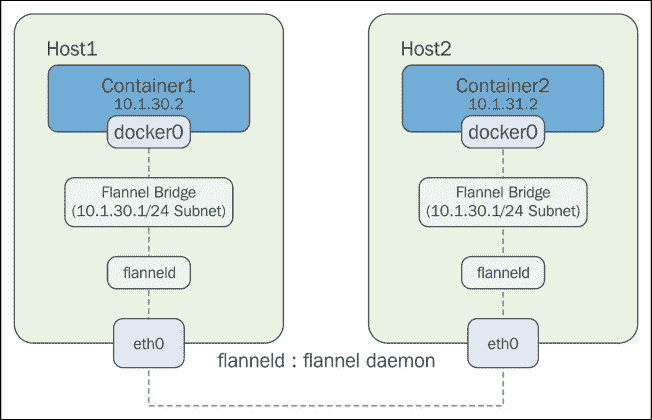
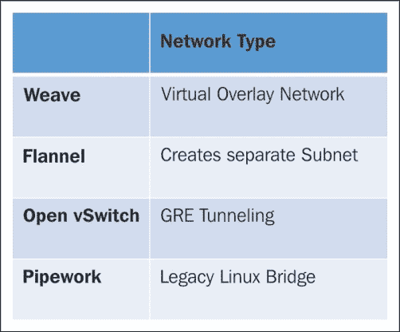

# 第三章：构建您的第一个 Docker 网络

本章描述了 Docker 网络的实际示例，跨多个主机连接多个容器。我们将涵盖以下主题：

+   Pipework 简介

+   在多个主机上的多个容器

+   朝着扩展网络-介绍 Open vSwitch

+   使用覆盖网络进行网络连接-Flannel

+   Docker 网络选项的比较

# Pipework 简介

Pipework 让您在任意复杂的场景中连接容器。

在实际操作中，它创建了一个传统的 Linux 桥接，向容器添加一个新的接口，然后将接口连接到该桥接；容器获得了一个网络段，可以在其中相互通信。

# 在单个主机上的多个容器

Pipework 是一个 shell 脚本，安装它很简单：

[PRE0]

以下图显示了使用 Pipework 进行容器通信：

首先，创建两个容器：

[PRE1]

现在让我们使用 Pipework 来连接它们：

[PRE2]

此命令在主机上创建一个桥接`brpipe`。它向容器`c1`添加一个`eth1`接口，IP 地址为`192.168.1.1`，并将接口连接到桥接如下：

[PRE3]

此命令不会创建桥接`brpipe`，因为它已经存在。它将向容器`c2`添加一个`eth1`接口，并将其连接到桥接如下：

[PRE4]

现在容器已连接，将能够相互 ping 通，因为它们在同一个子网`192.168.1.0/24`上。Pipework 提供了向容器添加静态 IP 地址的优势。

## 编织您的容器

编织创建了一个虚拟网络，可以连接 Docker 容器跨多个主机，就像它们都连接到一个单一的交换机上一样。编织路由器本身作为一个 Docker 容器运行，并且可以加密路由的流量以通过互联网进行传输。在编织网络上由应用容器提供的服务可以被外部世界访问，无论这些容器在哪里运行。

使用以下代码安装 Weave：

[PRE5]

以下图显示了使用 Weave 进行多主机通信：

在`$HOST1`上，我们运行以下命令：

[PRE6]

接下来，我们在`$HOST2`上重复类似的步骤：

[PRE7]

在`$HOST1`上启动的容器中，生成以下输出：

[PRE8]

您可以使用`ifconfig`命令查看编织网络接口`ethwe`：

[PRE9]

同样，在`$HOST2`上启动的容器中，生成以下输出：

[PRE10]

所以我们有了—两个容器在不同的主机上愉快地交流。

# Open vSwitch

Docker 默认使用 Linux 桥`docker0`。但是，在某些情况下，可能需要使用**Open vSwitch**（**OVS**）而不是 Linux 桥。单个 Linux 桥只能处理 1024 个端口-这限制了 Docker 的可扩展性，因为我们只能创建 1024 个容器，每个容器只有一个网络接口。

## 单主机 OVS

现在我们将在单个主机上安装 OVS，创建两个容器，并将它们连接到 OVS 桥。

使用此命令安装 OVS：

[PRE11]

使用以下命令安装`ovs-docker`实用程序：

[PRE12]

以下图显示了单主机 OVS：

### 创建 OVS 桥

在这里，我们将添加一个新的 OVS 桥并对其进行配置，以便我们可以在不同的网络上连接容器，如下所示：

[PRE13]

将一个端口从 OVS 桥添加到 Docker 容器，使用以下步骤：

1.  创建两个 Ubuntu Docker 容器：

[PRE14]

1.  将容器连接到 OVS 桥：

[PRE15]

1.  使用`ping`命令测试通过 OVS 桥连接的两个容器之间的连接。首先找出它们的 IP 地址：

[PRE16]

现在我们知道了`container1`和`container2`的 IP 地址，我们可以 ping 它们：

[PRE17]

## 多主机 OVS

让我们看看如何使用 OVS 连接多个主机上的 Docker 容器。

让我们考虑一下我们的设置，如下图所示，其中包含两个主机，**主机 1**和**主机 2**，运行 Ubuntu 14.04：

在两个主机上安装 Docker 和 Open vSwitch：

[PRE18]

安装`ovs-docker`实用程序：

[PRE19]

默认情况下，Docker 选择一个随机网络来运行其容器。它创建一个桥，`docker0`，并为其分配一个 IP 地址（`172.17.42.1`）。因此，**主机 1**和**主机 2**的`docker0`桥 IP 地址相同，这使得两个主机中的容器难以通信。为了克服这个问题，让我们为网络分配静态 IP 地址，即`192.168.10.0/24`。

让我们看看如何更改默认的 Docker 子网。

在主机 1 上执行以下命令：

[PRE20]

添加`br0` OVS 桥：

[PRE21]

创建到其他主机的隧道并将其附加到：

[PRE22]

将`br0`桥添加到`docker0`桥：

[PRE23]

在主机 2 上执行以下命令：

[PRE24]

添加`br0` OVS 桥：

[PRE25]

创建到其他主机的隧道并将其附加到：

[PRE26]

将`br0`桥添加到`docker0`桥：

[PRE27]

`docker0`桥连接到另一个桥`br0`。这次是一个 OVS 桥。这意味着容器之间的所有流量也通过`br0`路由。

此外，我们需要连接两台主机的网络，容器正在其中运行。为此目的使用 GRE 隧道。该隧道连接到`br0` OVS 桥，结果也连接到`docker0`。

在两台主机上执行上述命令后，您应该能够从两台主机上 ping 通`docker0`桥地址。

在主机 1 上，使用`ping`命令会生成以下输出：

[PRE28]

在主机 2 上，使用`ping`命令会生成以下输出：

[PRE29]

让我们看看如何在两台主机上创建容器。

在主机 1 上，使用以下代码：

[PRE30]

在主机 2 上，使用以下代码：

[PRE31]

现在我们可以从`container1` ping 通`container2`。通过这种方式，我们使用 Open vSwitch 连接多台主机上的 Docker 容器。

# 使用覆盖网络进行网络连接 - Flannel

Flannel 是提供给每个主机用于 Docker 容器的子网的虚拟网络层。它与 CoreOS 捆绑在一起，但也可以在其他 Linux OS 上进行配置。Flannel 通过实际连接自身到 Docker 桥来创建覆盖网络，容器连接到该桥，如下图所示。要设置 Flannel，需要两台主机或虚拟机，可以是 CoreOS 或更可取的是 Linux OS，如下图所示：

如果需要，可以从 GitHub 克隆 Flannel 代码并在本地构建，如下所示，可以在不同版本的 Linux OS 上进行。它已经预装在 CoreOS 中：

[PRE32]

可以使用 Vagrant 和 VirtualBox 轻松配置 CoreOS 机器，如下链接中提到的教程：

[`coreos.com/os/docs/latest/booting-on-vagrant.html`](https://coreos.com/os/docs/latest/booting-on-vagrant.html)

创建并登录到机器后，我们将发现使用`etcd`配置自动创建了 Flannel 桥：

[PRE33]

可以通过查看`subnet.env`来检查 Flannel 环境：

[PRE34]

为了重新实例化 Flannel 桥的子网，需要使用以下命令重新启动 Docker 守护程序：

[PRE35]

也可以通过查看`subnet.env`来检查第二台主机的 Flannel 环境：

[PRE36]

为第二台主机分配了不同的子网。也可以通过指向 Flannel 桥来重新启动此主机上的 Docker 服务：

[PRE37]

Docker 容器可以在各自的主机上创建，并且可以使用`ping`命令进行测试，以检查 Flannel 叠加网络的连通性。

对于主机 1，请使用以下命令：

[PRE38]

对于主机 2，请使用以下命令：

[PRE39]

因此，在上面的例子中，我们可以看到 Flannel 通过在每个主机上运行`flanneld`代理来减少的复杂性，该代理负责从预配置的地址空间中分配子网租约。Flannel 在内部使用`etcd`来存储网络配置和其他细节，例如主机 IP 和分配的子网。数据包的转发是使用后端策略实现的。

Flannel 还旨在解决在 GCE 以外的云提供商上部署 Kubernetes 时的问题，Flannel 叠加网格网络可以通过为每个服务器创建一个子网来简化为每个 pod 分配唯一 IP 地址的问题。

# 总结

在本章中，我们了解了 Docker 容器如何使用不同的网络选项（如 Weave、OVS 和 Flannel）在多个主机之间进行通信。Pipework 使用传统的 Linux 桥接，Weave 创建虚拟网络，OVS 使用 GRE 隧道技术，而 Flannel 为每个主机提供单独的子网，以便将容器连接到多个主机。一些实现，如 Pipework，是传统的，并将随着时间的推移而过时，而其他一些则设计用于在特定操作系统的上下文中使用，例如 Flannel 与 CoreOS。

以下图表显示了 Docker 网络选项的基本比较：

在下一章中，我们将讨论在使用 Kubernetes、Docker Swarm 和 Mesosphere 等框架时，Docker 容器是如何进行网络连接的。
