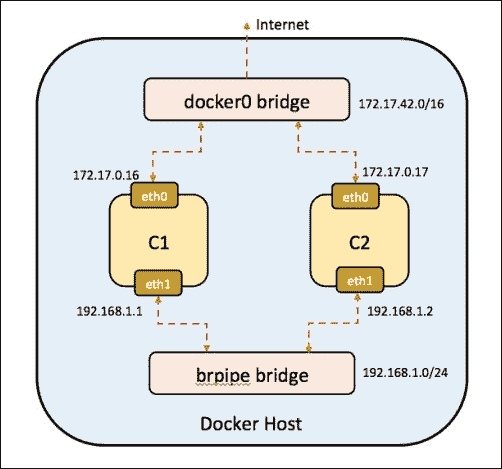
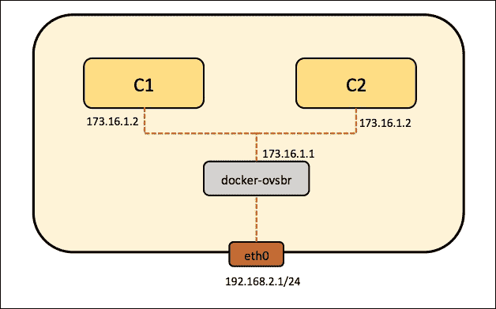
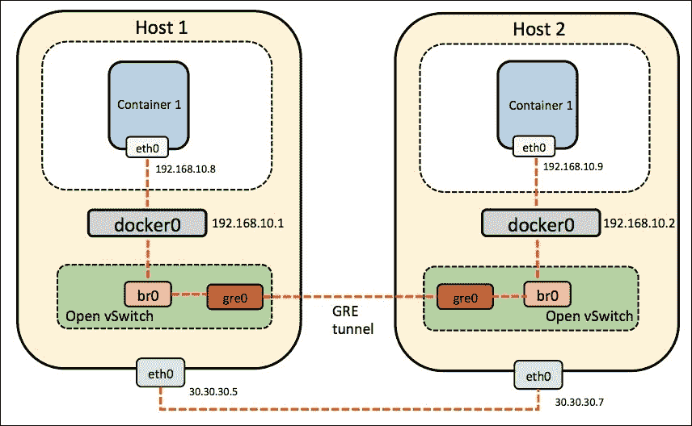

# 第三章。构建您的第一个 Docker 网络

本章描述了 Docker 网络的实际示例，跨多个主机连接多个容器。我们将涵盖以下主题：

+   Pipework 简介

+   在多个主机上的多个容器

+   朝着扩展网络-介绍 Open vSwitch

+   使用覆盖网络进行网络连接-Flannel

+   Docker 网络选项的比较

# Pipework 简介

Pipework 让您在任意复杂的场景中连接容器。

在实际操作中，它创建了一个传统的 Linux 桥接，向容器添加一个新的接口，然后将接口连接到该桥接；容器获得了一个网络段，可以在其中相互通信。

# 在单个主机上的多个容器

Pipework 是一个 shell 脚本，安装它很简单：

```
**#sudo wget -O /usr/local/bin/pipework https://raw.githubusercontent.com/jpetazzo/pipework/master/pipework && sudo chmod +x /usr/local/bin/pipework**

```

以下图显示了使用 Pipework 进行容器通信：



首先，创建两个容器：

```
**#docker run -i -t --name c1 ubuntu:latest /bin/bash**
**root@5afb44195a69:/# ifconfig**
**eth0      Link encap:Ethernet  HWaddr 02:42:ac:11:00:10**
 **inet addr:172.17.0.16  Bcast:0.0.0.0  Mask:255.255.0.0**
 **inet6 addr: fe80::42:acff:fe11:10/64 Scope:Link**
 **UP BROADCAST RUNNING MULTICAST  MTU:1500  Metric:1**
 **RX packets:13 errors:0 dropped:0 overruns:0 frame:0**
 **TX packets:9 errors:0 dropped:0 overruns:0 carrier:0**
 **collisions:0 txqueuelen:0**
 **RX bytes:1038 (1.0 KB)  TX bytes:738 (738.0 B)**
**lo        Link encap:Local Loopback**
 **inet addr:127.0.0.1  Mask:255.0.0.0**
 **inet6 addr: ::1/128 Scope:Host**
 **UP LOOPBACK RUNNING  MTU:65536  Metric:1**
 **RX packets:0 errors:0 dropped:0 overruns:0 frame:0**
 **TX packets:0 errors:0 dropped:0 overruns:0 carrier:0**
 **collisions:0 txqueuelen:0**
 **RX bytes:0 (0.0 B)  TX bytes:0 (0.0 B)**

**#docker run -i -t --name c2 ubuntu:latest /bin/bash**
**root@c94d53a76a9b:/# ifconfig**
**eth0      Link encap:Ethernet  HWaddr 02:42:ac:11:00:11**
 **inet addr:172.17.0.17  Bcast:0.0.0.0  Mask:255.255.0.0**
 **inet6 addr: fe80::42:acff:fe11:11/64 Scope:Link**
 **UP BROADCAST RUNNING MULTICAST  MTU:1500  Metric:1**
 **RX packets:8 errors:0 dropped:0 overruns:0 frame:0**
 **TX packets:9 errors:0 dropped:0 overruns:0 carrier:0**
 **collisions:0 txqueuelen:0**
 **RX bytes:648 (648.0 B)  TX bytes:738 (738.0 B)**
**lo        Link encap:Local Loopback**
 **inet addr:127.0.0.1  Mask:255.0.0.0**
 **inet6 addr: ::1/128 Scope:Host**
 **UP LOOPBACK RUNNING  MTU:65536  Metric:1**
 **RX packets:0 errors:0 dropped:0 overruns:0 frame:0**
 **TX packets:0 errors:0 dropped:0 overruns:0 carrier:0**
 **collisions:0 txqueuelen:0**
 **RX bytes:0 (0.0 B)  TX bytes:0 (0.0 B)**

```

现在让我们使用 Pipework 来连接它们：

```
**#sudo pipework brpipe c1 192.168.1.1/24**

```

此命令在主机上创建一个桥接`brpipe`。它向容器`c1`添加一个`eth1`接口，IP 地址为`192.168.1.1`，并将接口连接到桥接如下：

```
**root@5afb44195a69:/# ifconfig**
**eth0      Link encap:Ethernet  HWaddr 02:42:ac:11:00:10**
 **inet addr:172.17.0.16  Bcast:0.0.0.0  Mask:255.255.0.0**
 **inet6 addr: fe80::42:acff:fe11:10/64 Scope:Link**
 **UP BROADCAST RUNNING MULTICAST  MTU:1500  Metric:1**
 **RX packets:13 errors:0 dropped:0 overruns:0 frame:0**
 **TX packets:9 errors:0 dropped:0 overruns:0 carrier:0**
 **collisions:0 txqueuelen:0**
 **RX bytes:1038 (1.0 KB)  TX bytes:738 (738.0 B)**
**eth1      Link encap:Ethernet  HWaddr ce:72:c5:12:4a:1a**
 **inet addr:192.168.1.1  Bcast:0.0.0.0  Mask:255.255.255.0**
 **inet6 addr: fe80::cc72:c5ff:fe12:4a1a/64 Scope:Link**
 **UP BROADCAST RUNNING MULTICAST  MTU:1500  Metric:1**
 **RX packets:23 errors:0 dropped:0 overruns:0 frame:0**
 **TX packets:9 errors:0 dropped:0 overruns:0 carrier:0**
 **collisions:0 txqueuelen:1000**
 **RX bytes:1806 (1.8 KB)  TX bytes:690 (690.0 B)**
**lo        Link encap:Local Loopback**
 **inet addr:127.0.0.1  Mask:255.0.0.0**
 **inet6 addr: ::1/128 Scope:Host**
 **UP LOOPBACK RUNNING  MTU:65536  Metric:1**
 **RX packets:0 errors:0 dropped:0 overruns:0 frame:0**
 **TX packets:0 errors:0 dropped:0 overruns:0 carrier:0**
 **collisions:0 txqueuelen:0**
 **RX bytes:0 (0.0 B)  TX bytes:0 (0.0 B)**
**#sudo pipework brpipe c2 192.168.1.2/24**

```

此命令不会创建桥接`brpipe`，因为它已经存在。它将向容器`c2`添加一个`eth1`接口，并将其连接到桥接如下：

```
**root@c94d53a76a9b:/# ifconfig**
**eth0      Link encap:Ethernet  HWaddr 02:42:ac:11:00:11**
 **inet addr:172.17.0.17  Bcast:0.0.0.0  Mask:255.255.0.0**
 **inet6 addr: fe80::42:acff:fe11:11/64 Scope:Link**
 **UP BROADCAST RUNNING MULTICAST  MTU:1500  Metric:1**
 **RX packets:8 errors:0 dropped:0 overruns:0 frame:0**
 **TX packets:9 errors:0 dropped:0 overruns:0 carrier:0**
 **collisions:0 txqueuelen:0**
 **RX bytes:648 (648.0 B)  TX bytes:738 (738.0 B)**
**eth1      Link encap:Ethernet  HWaddr 36:86:fb:9e:88:ba**
 **inet addr:192.168.1.2  Bcast:0.0.0.0  Mask:255.255.255.0**
 **inet6 addr: fe80::3486:fbff:fe9e:88ba/64 Scope:Link**
 **UP BROADCAST RUNNING MULTICAST  MTU:1500  Metric:1**
 **RX packets:8 errors:0 dropped:0 overruns:0 frame:0**
 **TX packets:9 errors:0 dropped:0 overruns:0 carrier:0**
 **collisions:0 txqueuelen:1000**
 **RX bytes:648 (648.0 B)  TX bytes:690 (690.0 B)**
**lo        Link encap:Local Loopback**
 **inet addr:127.0.0.1  Mask:255.0.0.0**
 **inet6 addr: ::1/128 Scope:Host**
 **UP LOOPBACK RUNNING  MTU:65536  Metric:1**
 **RX packets:0 errors:0 dropped:0 overruns:0 frame:0**
 **TX packets:0 errors:0 dropped:0 overruns:0 carrier:0**
 **collisions:0 txqueuelen:0**
 **RX bytes:0 (0.0 B)  TX bytes:0 (0.0 B)**

```

现在容器已连接，将能够相互 ping 通，因为它们在同一个子网`192.168.1.0/24`上。Pipework 提供了向容器添加静态 IP 地址的优势。

## 编织您的容器

编织创建了一个虚拟网络，可以连接 Docker 容器跨多个主机，就像它们都连接到一个单一的交换机上一样。编织路由器本身作为一个 Docker 容器运行，并且可以加密路由的流量以通过互联网进行传输。在编织网络上由应用容器提供的服务可以被外部世界访问，无论这些容器在哪里运行。

使用以下代码安装 Weave：

```
#sudo curl -L git.io/weave -o /usr/local/bin/weave
#sudo chmod a+x /usr/local/bin/weave
```

以下图显示了使用 Weave 进行多主机通信：


在`$HOST1`上，我们运行以下命令：

```
**# weave launch**
**# eval $(weave proxy-env)**
**# docker run --name c1 -ti ubuntu**

```

接下来，我们在`$HOST2`上重复类似的步骤：

```
**# weave launch $HOST1**
**# eval $(weave proxy-env)**
**# docker run --name c2 -ti ubuntu**

```

在`$HOST1`上启动的容器中，生成以下输出：

```
**root@c1:/# ifconfig**
**eth0      Link encap:Ethernet  HWaddr 02:42:ac:11:00:21**
 **inet addr:172.17.0.33  Bcast:0.0.0.0  Mask:255.255.0.0**
 **inet6 addr: fe80::42:acff:fe11:21/64 Scope:Link**
 **UP BROADCAST RUNNING MULTICAST  MTU:1500  Metric:1**
 **RX packets:38 errors:0 dropped:0 overruns:0 frame:0**
 **TX packets:34 errors:0 dropped:0 overruns:0 carrier:0**
 **collisions:0 txqueuelen:0**
 **RX bytes:3166 (3.1 KB)  TX bytes:2299 (2.2 KB)**
**ethwe     Link encap:Ethernet  HWaddr aa:99:8a:d5:4d:d4**
 **inet addr:10.128.0.3  Bcast:0.0.0.0  Mask:255.192.0.0**
 **inet6 addr: fe80::a899:8aff:fed5:4dd4/64 Scope:Link**
 **UP BROADCAST RUNNING MULTICAST  MTU:65535  Metric:1**
 **RX packets:130 errors:0 dropped:0 overruns:0 frame:0**
 **TX packets:74 errors:0 dropped:0 overruns:0 carrier:0**
 **collisions:0 txqueuelen:1000**
 **RX bytes:11028 (11.0 KB)  TX bytes:6108 (6.1 KB)**
**lo        Link encap:Local Loopback**
 **inet addr:127.0.0.1  Mask:255.0.0.0**
 **inet6 addr: ::1/128 Scope:Host**
 **UP LOOPBACK RUNNING  MTU:65536  Metric:1**
 **RX packets:0 errors:0 dropped:0 overruns:0 frame:0**
 **TX packets:0 errors:0 dropped:0 overruns:0 carrier:0**
 **collisions:0 txqueuelen:0**
 **RX bytes:0 (0.0 B)  TX bytes:0 (0.0 B)**

```

您可以使用`ifconfig`命令查看编织网络接口`ethwe`：

```
**root@c2:/# ifconfig**
**eth0      Link encap:Ethernet  HWaddr 02:42:ac:11:00:04**
 **inet addr:172.17.0.4  Bcast:0.0.0.0  Mask:255.255.0.0**
 **inet6 addr: fe80::42:acff:fe11:4/64 Scope:Link**
 **UP BROADCAST RUNNING MULTICAST  MTU:1500  Metric:1**
 **RX packets:28 errors:0 dropped:0 overruns:0 frame:0**
 **TX packets:29 errors:0 dropped:0 overruns:0 carrier:0**
 **collisions:0 txqueuelen:0**
 **RX bytes:2412 (2.4 KB)  TX bytes:2016 (2.0 KB)**
**ethwe     Link encap:Ethernet  HWaddr 8e:7c:17:0d:0e:03**
 **inet addr:10.160.0.1  Bcast:0.0.0.0  Mask:255.192.0.0**
 **inet6 addr: fe80::8c7c:17ff:fe0d:e03/64 Scope:Link**
 **UP BROADCAST RUNNING MULTICAST  MTU:65535  Metric:1**
 **RX packets:139 errors:0 dropped:0 overruns:0 frame:0**
 **TX packets:74 errors:0 dropped:0 overruns:0 carrier:0**
 **collisions:0 txqueuelen:1000**
 **RX bytes:11718 (11.7 KB)  TX bytes:6108 (6.1 KB)**
**lo        Link encap:Local Loopback**
 **inet addr:127.0.0.1  Mask:255.0.0.0**
 **inet6 addr: ::1/128 Scope:Host**
 **UP LOOPBACK RUNNING  MTU:65536  Metric:1**
 **RX packets:0 errors:0 dropped:0 overruns:0 frame:0**
 **TX packets:0 errors:0 dropped:0 overruns:0 carrier:0**
 **collisions:0 txqueuelen:0**
 **RX bytes:0 (0.0 B)  TX bytes:0 (0.0 B)**

**#root@c1:/# ping -c 1 -q c2**
**PING c2.weave.local (10.160.0.1) 56(84) bytes of data.**
**--- c2.weave.local ping statistics ---**
**1 packets transmitted, 1 received, 0% packet loss, time 0ms**
**rtt min/avg/max/mdev = 1.317/1.317/1.317/0.000 ms**

```

同样，在`$HOST2`上启动的容器中，生成以下输出：

```
**#root@c2:/# ping -c 1 -q c1**
**PING c1.weave.local (10.128.0.3) 56(84) bytes of data.**
**--- c1.weave.local ping statistics ---**
**1 packets transmitted, 1 received, 0% packet loss, time 0ms**
**rtt min/avg/max/mdev = 1.658/1.658/1.658/0.000 ms**

```

所以我们有了—两个容器在不同的主机上愉快地交流。

# Open vSwitch

Docker 默认使用 Linux 桥`docker0`。但是，在某些情况下，可能需要使用**Open vSwitch**（**OVS**）而不是 Linux 桥。单个 Linux 桥只能处理 1024 个端口-这限制了 Docker 的可扩展性，因为我们只能创建 1024 个容器，每个容器只有一个网络接口。

## 单主机 OVS

现在我们将在单个主机上安装 OVS，创建两个容器，并将它们连接到 OVS 桥。

使用此命令安装 OVS：

```
**# sudo apt-get install openvswitch-switch**

```

使用以下命令安装`ovs-docker`实用程序：

```
**# cd /usr/bin**
**# wget https://raw.githubusercontent.com/openvswitch/ovs/master/utilities/ovs-docker**
**# chmod a+rwx ovs-docker**

```

以下图显示了单主机 OVS：



### 创建 OVS 桥

在这里，我们将添加一个新的 OVS 桥并对其进行配置，以便我们可以在不同的网络上连接容器，如下所示：

```
**# ovs-vsctl add-br ovs-br1**
**# ifconfig ovs-br1 173.16.1.1 netmask 255.255.255.0 up**

```

将一个端口从 OVS 桥添加到 Docker 容器，使用以下步骤：

1.  创建两个 Ubuntu Docker 容器：

```
**# docker run -I -t --name container1 ubuntu /bin/bash**
**# docekr run -I -t --name container2 ubuntu /bin/bash**

```

1.  将容器连接到 OVS 桥：

```
**# ovs-docker add-port ovs-br1 eth1 container1 --ipaddress=173.16.1.2/24**
**# ovs-docker add-port ovs-br1 eth1 container2 --ipaddress=173.16.1.3/24**

```

1.  使用`ping`命令测试通过 OVS 桥连接的两个容器之间的连接。首先找出它们的 IP 地址：

```
**# docker exec container1 ifconfig**
**eth0      Link encap:Ethernet  HWaddr 02:42:ac:10:11:02**
 **inet addr:172.16.17.2  Bcast:0.0.0.0  Mask:255.255.255.0**
 **inet6 addr: fe80::42:acff:fe10:1102/64 Scope:Link**
 **UP BROADCAST RUNNING MULTICAST  MTU:1472  Metric:1**
 **RX packets:36 errors:0 dropped:0 overruns:0 frame:0**
 **TX packets:8 errors:0 dropped:0 overruns:0 carrier:0**
 **collisions:0 txqueuelen:0**
 **RX bytes:4956 (4.9 KB)  TX bytes:648 (648.0 B)**

**lo        Link encap:Local Loopback**
 **inet addr:127.0.0.1  Mask:255.0.0.0**
 **inet6 addr: ::1/128 Scope:Host**
 **UP LOOPBACK RUNNING  MTU:65536  Metric:1**
 **RX packets:0 errors:0 dropped:0 overruns:0 frame:0**
 **TX packets:0 errors:0 dropped:0 overruns:0 carrier:0**
 **collisions:0 txqueuelen:0**
 **RX bytes:0 (0.0 B)  TX bytes:0 (0.0 B)**

**# docker exec container2 ifconfig**
**eth0      Link encap:Ethernet  HWaddr 02:42:ac:10:11:03**
 **inet addr:172.16.17.3  Bcast:0.0.0.0  Mask:255.255.255.0**
 **inet6 addr: fe80::42:acff:fe10:1103/64 Scope:Link**
 **UP BROADCAST RUNNING MULTICAST  MTU:1472  Metric:1**
 **RX packets:27 errors:0 dropped:0 overruns:0 frame:0**
 **TX packets:8 errors:0 dropped:0 overruns:0 carrier:0**
 **collisions:0 txqueuelen:0**
 **RX bytes:4201 (4.2 KB)  TX bytes:648 (648.0 B)**

**lo        Link encap:Local Loopback**
 **inet addr:127.0.0.1  Mask:255.0.0.0**
 **inet6 addr: ::1/128 Scope:Host**
 **UP LOOPBACK RUNNING  MTU:65536  Metric:1**
 **RX packets:0 errors:0 dropped:0 overruns:0 frame:0**
 **TX packets:0 errors:0 dropped:0 overruns:0 carrier:0**
 **collisions:0 txqueuelen:0**
 **RX bytes:0 (0.0 B)  TX bytes:0 (0.0 B)**

```

现在我们知道了`container1`和`container2`的 IP 地址，我们可以 ping 它们：

```
**# docker exec container2 ping 172.16.17.2**
**PING 172.16.17.2 (172.16.17.2) 56(84) bytes of data.**
**64 bytes from 172.16.17.2: icmp_seq=1 ttl=64 time=0.257 ms**
**64 bytes from 172.16.17.2: icmp_seq=2 ttl=64 time=0.048 ms**
**64 bytes from 172.16.17.2: icmp_seq=3 ttl=64 time=0.052 ms**

**# docker exec container1 ping 172.16.17.2**
**PING 172.16.17.2 (172.16.17.2) 56(84) bytes of data.**
**64 bytes from 172.16.17.2: icmp_seq=1 ttl=64 time=0.060 ms**
**64 bytes from 172.16.17.2: icmp_seq=2 ttl=64 time=0.035 ms**
**64 bytes from 172.16.17.2: icmp_seq=3 ttl=64 time=0.031 ms**

```

## 多主机 OVS

让我们看看如何使用 OVS 连接多个主机上的 Docker 容器。

让我们考虑一下我们的设置，如下图所示，其中包含两个主机，**主机 1**和**主机 2**，运行 Ubuntu 14.04：



在两个主机上安装 Docker 和 Open vSwitch：

```
**# wget -qO- https://get.docker.com/ | sh**
**# sudo apt-get install openvswitch-switch**

```

安装`ovs-docker`实用程序：

```
**# cd /usr/bin**
**# wget https://raw.githubusercontent.com/openvswitch/ovs/master/utilities/ovs-docker**
**# chmod a+rwx ovs-docker**

```

默认情况下，Docker 选择一个随机网络来运行其容器。它创建一个桥，`docker0`，并为其分配一个 IP 地址（`172.17.42.1`）。因此，**主机 1**和**主机 2**的`docker0`桥 IP 地址相同，这使得两个主机中的容器难以通信。为了克服这个问题，让我们为网络分配静态 IP 地址，即`192.168.10.0/24`。

让我们看看如何更改默认的 Docker 子网。

在主机 1 上执行以下命令：

```
**# service docker stop**
**# ip link set dev docker0 down**
**# ip addr del 172.17.42.1/16 dev docker0**
**# ip addr add 192.168.10.1/24 dev docker0**
**# ip link set dev docker0 up**
**# ip addr show docker0**
**# service docker start**

```

添加`br0` OVS 桥：

```
**# ovs-vsctl add-br br0**

```

创建到其他主机的隧道并将其附加到：

```
**# add-port br0 gre0 -- set interface gre0 type=gre options:remote_ip=30.30.30.8**

```

将`br0`桥添加到`docker0`桥：

```
**# brctl addif docker0 br0**

```

在主机 2 上执行以下命令：

```
**# service docker stop**
**# iptables -t nat -F POSTROUTING**
**# ip link set dev docker0 down**
**# ip addr del 172.17.42.1/16 dev docker0**
**# ip addr add 192.168.10.2/24 dev docker0**
**# ip link set dev docker0 up**
**# ip addr show docker0**
**# service docker start**

```

添加`br0` OVS 桥：

```
**# ip link set br0 up**
**# ovs-vsctl add-br br0**

```

创建到其他主机的隧道并将其附加到：

```
**# br0 bridge ovs-vsctl add-port br0 gre0 -- set interface gre0 type=gre options:remote_ip=30.30.30.7**

```

将`br0`桥添加到`docker0`桥：

```
**# brctl addif docker0 br0**

```

`docker0`桥连接到另一个桥`br0`。这次是一个 OVS 桥。这意味着容器之间的所有流量也通过`br0`路由。

此外，我们需要连接两台主机的网络，容器正在其中运行。为此目的使用 GRE 隧道。该隧道连接到`br0` OVS 桥，结果也连接到`docker0`。

在两台主机上执行上述命令后，您应该能够从两台主机上 ping 通`docker0`桥地址。

在主机 1 上，使用`ping`命令会生成以下输出：

```
**# ping 192.168.10.2**
**PING 192.168.10.2 (192.168.10.2) 56(84) bytes of data.**
**64 bytes from 192.168.10.2: icmp_seq=1 ttl=64 time=0.088 ms**
**64 bytes from 192.168.10.2: icmp_seq=2 ttl=64 time=0.032 ms**
**^C**
**--- 192.168.10.2 ping statistics ---**
**2 packets transmitted, 2 received, 0% packet loss, time 999ms**
**rtt min/avg/max/mdev = 0.032/0.060/0.088/0.028 ms**

```

在主机 2 上，使用`ping`命令会生成以下输出：

```
**# ping 192.168.10.1**
**PING 192.168.10.1 (192.168.10.1) 56(84) bytes of data.**
**64 bytes from 192.168.10.1: icmp_seq=1 ttl=64 time=0.088 ms**
**64 bytes from 192.168.10.1: icmp_seq=2 ttl=64 time=0.032 ms**
**^C**
**--- 192.168.10.1 ping statistics ---**
**2 packets transmitted, 2 received, 0% packet loss, time 999ms**
**rtt min/avg/max/mdev = 0.032/0.060/0.088/0.028 ms**

```

让我们看看如何在两台主机上创建容器。

在主机 1 上，使用以下代码：

```
**# docker run -t -i --name container1 ubuntu:latest /bin/bash**

```

在主机 2 上，使用以下代码：

```
**# docker run -t -i --name container2 ubuntu:latest /bin/bash**

```

现在我们可以从`container1` ping 通`container2`。通过这种方式，我们使用 Open vSwitch 连接多台主机上的 Docker 容器。

# 使用覆盖网络进行网络连接 - Flannel

Flannel 是提供给每个主机用于 Docker 容器的子网的虚拟网络层。它与 CoreOS 捆绑在一起，但也可以在其他 Linux OS 上进行配置。Flannel 通过实际连接自身到 Docker 桥来创建覆盖网络，容器连接到该桥，如下图所示。要设置 Flannel，需要两台主机或虚拟机，可以是 CoreOS 或更可取的是 Linux OS，如下图所示：


如果需要，可以从 GitHub 克隆 Flannel 代码并在本地构建，如下所示，可以在不同版本的 Linux OS 上进行。它已经预装在 CoreOS 中：

```
**# git clone https://github.com/coreos/flannel.git**
**Cloning into 'flannel'...**
**remote: Counting objects: 2141, done.**
**remote: Compressing objects: 100% (19/19), done.**
**remote: Total 2141 (delta 6), reused 0 (delta 0), pack-reused 2122**
**Receiving objects: 100% (2141/2141), 4.**
**Checking connectivity... done.**

**# sudo docker run -v `pwd`:/opt/flannel -i -t google/golang /bin/bash -c "cd /opt/flannel && ./build"**
**Building flanneld...**

```

可以使用 Vagrant 和 VirtualBox 轻松配置 CoreOS 机器，如下链接中提到的教程：

[`coreos.com/os/docs/latest/booting-on-vagrant.html`](https://coreos.com/os/docs/latest/booting-on-vagrant.html)

创建并登录到机器后，我们将发现使用`etcd`配置自动创建了 Flannel 桥：

```
**# ifconfig flannel0**
**flannel0: flags=4305<UP,POINTOPOINT,RUNNING,NOARP,MULTICAST>  mtu 1472**
 **inet 10.1.30.0  netmask 255.255.0.0  destination 10.1.30.0**
 **unspec 00-00-00-00-00-00-00-00-00-00-00-00-00-00-00-00  txqueuelen 500 (UNSPEC)**
 **RX packets 243  bytes 20692 (20.2 KiB)**
 **RX errors 0  dropped 0  overruns 0  frame 0**
 **TX packets 304  bytes 25536 (24.9 KiB)**
 **TX errors 0  dropped 0 overruns 0  carrier 0  collisions 0**

```

可以通过查看`subnet.env`来检查 Flannel 环境：

```
**# cat /run/flannel/subnet.env**
**FLANNEL_NETWORK=10.1.0.0/16**
**FLANNEL_SUBNET=10.1.30.1/24**
**FLANNEL_MTU=1472**
**FLANNEL_IPMASQ=true**

```

为了重新实例化 Flannel 桥的子网，需要使用以下命令重新启动 Docker 守护程序：

```
**# source /run/flannel/subnet.env**
**# sudo rm /var/run/docker.pid**
**# sudo ifconfig docker0 ${FLANNEL_SUBNET}**
**# sudo docker -d --bip=${FLANNEL_SUBNET} --mtu=${FLANNEL_MTU} & INFO[0000] [graphdriver] using prior storage driver "overlay"**
**INFO[0000] Option DefaultDriver: bridge**
**INFO[0000] Option DefaultNetwork: bridge**
**INFO[0000] Listening for HTTP on unix (/var/run/docker.sock)**
**INFO[0000] Firewalld running: false**
**INFO[0000] Loading containers: start.**
**..............**
**INFO[0000] Loading containers: done.**
**INFO[0000] Daemon has completed initialization**
**INFO[0000] Docker daemon**
**commit=cedd534-dirty execdriver=native-0.2 graphdriver=overlay version=1.8.3**

```

也可以通过查看`subnet.env`来检查第二台主机的 Flannel 环境：

```
**# cat /run/flannel/subnet.env**
**FLANNEL_NETWORK=10.1.0.0/16**
**FLANNEL_SUBNET=10.1.31.1/24**
**FLANNEL_MTU=1472**
**FLANNEL_IPMASQ=true**

```

为第二台主机分配了不同的子网。也可以通过指向 Flannel 桥来重新启动此主机上的 Docker 服务：

```
**# source /run/flannel/subnet.env**
**# sudo ifconfig docker0 ${FLANNEL_SUBNET}**
**# sudo docker -d --bip=${FLANNEL_SUBNET} --mtu=${FLANNEL_MTU} & INFO[0000] [graphdriver] using prior storage driver "overlay"**
**INFO[0000] Listening for HTTP on unix (/var/run/docker.sock)**
**INFO[0000] Option DefaultDriver: bridge**
**INFO[0000] Option DefaultNetwork: bridge**
**INFO[0000] Firewalld running: false**
**INFO[0000] Loading containers: start.**
**....**
**INFO[0000] Loading containers: done.**
**INFO[0000] Daemon has completed initialization**
**INFO[0000] Docker daemon**
**commit=cedd534-dirty execdriver=native-0.2 graphdriver=overlay version=1.8.3**

```

Docker 容器可以在各自的主机上创建，并且可以使用`ping`命令进行测试，以检查 Flannel 叠加网络的连通性。

对于主机 1，请使用以下命令：

```
**#docker run -it ubuntu /bin/bash**
**INFO[0013] POST /v1.20/containers/create**
**INFO[0013] POST /v1.20/containers/1d1582111801c8788695910e57c02fdba593f443c15e2f1db9174ed9078db809/attach?stderr=1&stdin=1&stdout=1&stream=1**
**INFO[0013] POST /v1.20/containers/1d1582111801c8788695910e57c02fdba593f443c15e2f1db9174ed9078db809/start**
**INFO[0013] POST /v1.20/containers/1d1582111801c8788695910e57c02fdba593f443c15e2f1db9174ed9078db809/resize?h=44&w=80**

**root@1d1582111801:/# ifconfig**
**eth0      Link encap:Ethernet  HWaddr 02:42:0a:01:1e:02**
 **inet addr:10.1.30.2  Bcast:0.0.0.0  Mask:255.255.255.0**
 **inet6 addr: fe80::42:aff:fe01:1e02/64 Scope:Link**
 **UP BROADCAST RUNNING MULTICAST  MTU:1472  Metric:1**
 **RX packets:11 errors:0 dropped:0 overruns:0 frame:0**
 **TX packets:6 errors:0 dropped:0 overruns:0 carrier:0**
 **collisions:0 txqueuelen:0**
 **RX bytes:969 (969.0 B)  TX bytes:508 (508.0 B)**
**lo        Link encap:Local Loopback**
 **inet addr:127.0.0.1  Mask:255.0.0.0**
 **inet6 addr: ::1/128 Scope:Host**
 **UP LOOPBACK RUNNING  MTU:65536  Metric:1**
 **RX packets:0 errors:0 dropped:0 overruns:0 frame:0**
 **TX packets:0 errors:0 dropped:0 overruns:0 carrier:0**
 **collisions:0 txqueuelen:0**
 **RX bytes:0 (0.0 B)  TX bytes:0 (0.0 B)**

```

对于主机 2，请使用以下命令：

```
**# docker run -it ubuntu /bin/bash**
**root@ed070166624a:/# ifconfig**
**eth0       Link encap:Ethernet  HWaddr 02:42:0a:01:1f:02**
 **inet addr:10.1.31.2  Bcast:0.0.0.0  Mask:255.255.255.0**
 **inet6 addr: fe80::42:aff:fe01:1f02/64 Scope:Link**
 **UP BROADCAST RUNNING MULTICAST  MTU:1472  Metric:1**
 **RX packets:18 errors:0 dropped:2 overruns:0 frame:0**
 **TX packets:7 errors:0 dropped:0 overruns:0 carrier:0**
 **collisions:0 txqueuelen:0**
 **RX bytes:1544 (1.5 KB)  TX bytes:598 (598.0 B)**
**lo         Link encap:Local Loopback**
 **inet addr:127.0.0.1  Mask:255.0.0.0**
 **inet6 addr: ::1/128 Scope:Host**
 **UP LOOPBACK RUNNING  MTU:65536  Metric:1**
 **RX packets:0 errors:0 dropped:0 overruns:0 frame:0**
 **TX packets:0 errors:0 dropped:0 overruns:0 carrier:0**
 **collisions:0 txqueuelen:0**
 **RX bytes:0 (0.0 B)  TX bytes:0 (0.0 B)**
**root@ed070166624a:/# ping 10.1.30.2**
**PING 10.1.30.2 (10.1.30.2) 56(84) bytes of data.**
**64 bytes from 10.1.30.2: icmp_seq=1 ttl=60 time=3.61 ms**
**64 bytes from 10.1.30.2: icmp_seq=2 ttl=60 time=1.38 ms**
**64 bytes from 10.1.30.2: icmp_seq=3 ttl=60 time=0.695 ms**
**64 bytes from 10.1.30.2: icmp_seq=4 ttl=60 time=1.49 ms**

```

因此，在上面的例子中，我们可以看到 Flannel 通过在每个主机上运行`flanneld`代理来减少的复杂性，该代理负责从预配置的地址空间中分配子网租约。Flannel 在内部使用`etcd`来存储网络配置和其他细节，例如主机 IP 和分配的子网。数据包的转发是使用后端策略实现的。

Flannel 还旨在解决在 GCE 以外的云提供商上部署 Kubernetes 时的问题，Flannel 叠加网格网络可以通过为每个服务器创建一个子网来简化为每个 pod 分配唯一 IP 地址的问题。

# 总结

在本章中，我们了解了 Docker 容器如何使用不同的网络选项（如 Weave、OVS 和 Flannel）在多个主机之间进行通信。Pipework 使用传统的 Linux 桥接，Weave 创建虚拟网络，OVS 使用 GRE 隧道技术，而 Flannel 为每个主机提供单独的子网，以便将容器连接到多个主机。一些实现，如 Pipework，是传统的，并将随着时间的推移而过时，而其他一些则设计用于在特定操作系统的上下文中使用，例如 Flannel 与 CoreOS。

以下图表显示了 Docker 网络选项的基本比较：


在下一章中，我们将讨论在使用 Kubernetes、Docker Swarm 和 Mesosphere 等框架时，Docker 容器是如何进行网络连接的。
