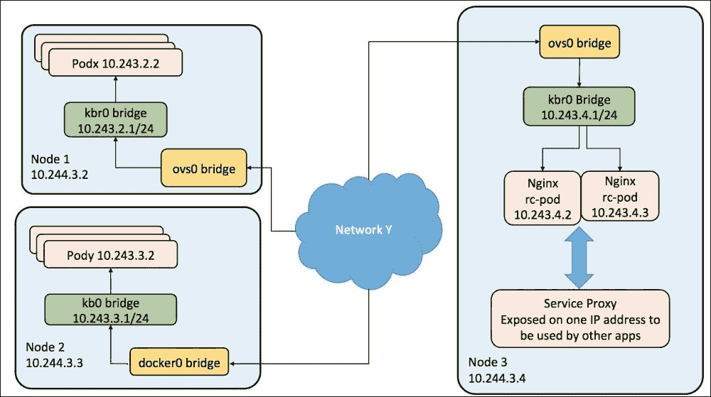
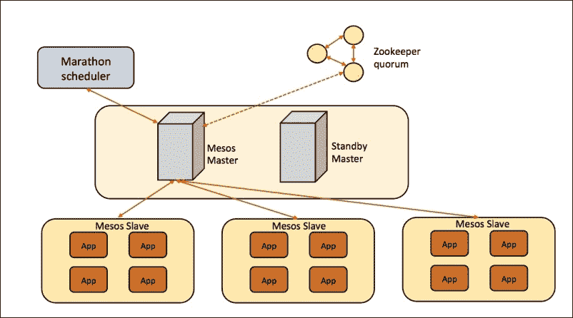
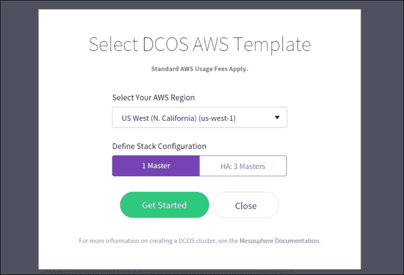
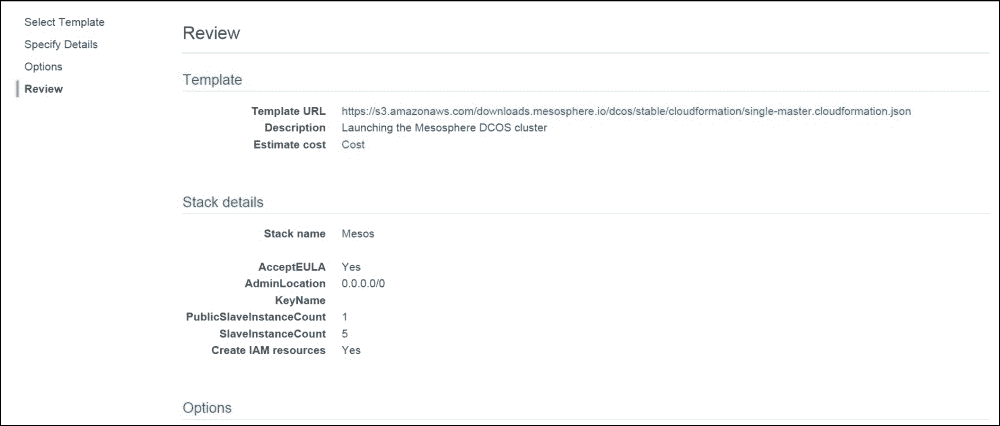
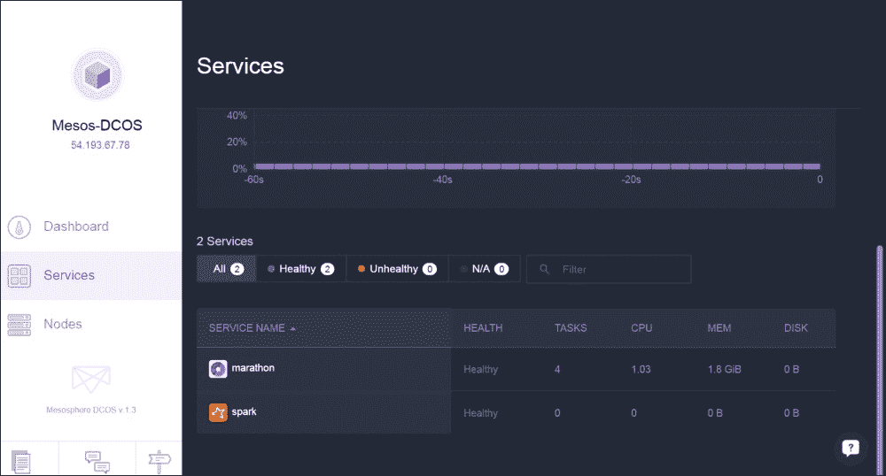
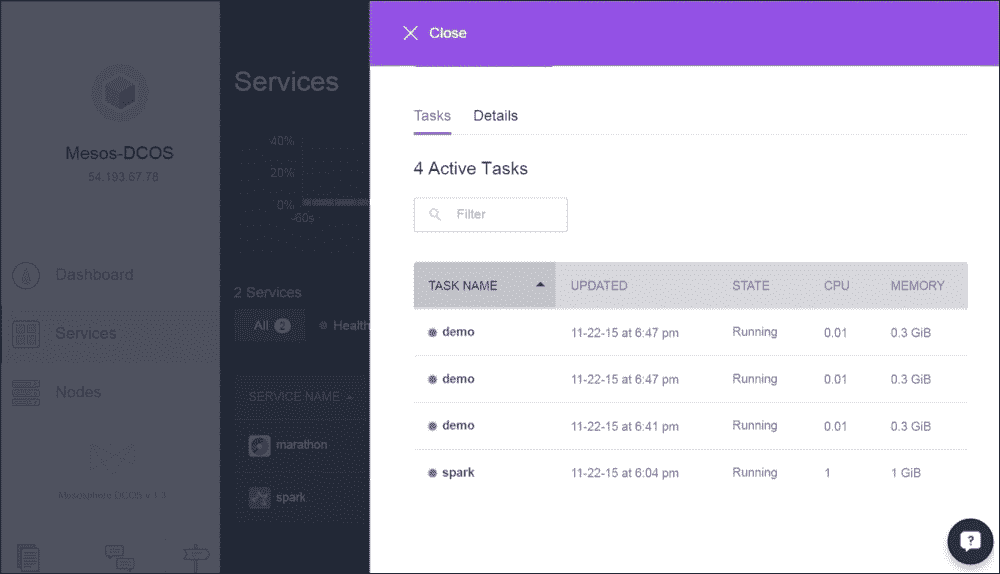

# 第四章：Docker 集群中的网络

在本章中，您将学习在使用 Kubernetes、Docker Swarm 和 Mesosphere 等框架时，Docker 容器是如何进行网络化的。

我们将涵盖以下主题：

+   Docker Swarm

+   Kubernetes

+   Kubernetes 集群中的网络化容器

+   Kubernetes 网络与 Docker 网络的不同之处

+   在 AWS 上的 Kubernetes

+   Mesosphere

# Docker Swarm

Docker Swarm 是 Docker 的本地集群系统。Docker Swarm 公开标准的 Docker API，以便与 Docker 守护程序通信的任何工具也可以与 Docker Swarm 通信。基本目标是允许一起创建和使用一组 Docker 主机。Swarm 的集群管理器根据集群中的可用资源调度容器。我们还可以在部署容器时指定受限资源。Swarm 旨在通过将容器打包到主机上来保存其他主机资源，以便为更重和更大的容器而不是将它们随机调度到集群中的主机。

与其他 Docker 项目类似，Docker Swarm 使用即插即用架构。Docker Swarm 提供后端服务来维护您的 Swarm 集群中的 IP 地址列表。有几种服务，如 etcd、Consul 和 Zookeeper；甚至可以使用静态文件。Docker Hub 还提供托管的发现服务，用于 Docker Swarm 的正常配置。

Docker Swarm 调度使用多种策略来对节点进行排名。当创建新容器时，Swarm 根据最高计算出的排名将其放置在节点上，使用以下策略：

1.  **Spread**：这根据节点上运行的容器数量来优化和调度容器

1.  **Binpack**：选择节点以基于 CPU 和 RAM 利用率来调度容器

1.  **随机策略**：这不使用计算；它随机选择节点来调度容器

Docker Swarm 还使用过滤器来调度容器，例如：

+   **Constraints**：这些使用与节点关联的键/值对，例如`environment=production`

+   **亲和力过滤器**：这用于运行一个容器，并指示它基于标签、镜像或标识符定位并运行在另一个容器旁边

+   **端口过滤器**：在这种情况下，选择节点是基于其上可用的端口

+   **依赖过滤器**：这会在同一节点上协同调度依赖容器

+   **健康过滤器**：这可以防止在不健康的节点上调度容器

以下图解释了 Docker Swarm 集群的各个组件：

## Docker Swarm 设置

让我们设置我们的 Docker Swarm 设置，其中将有两个节点和一个主节点。

我们将使用 Docker 客户端来访问 Docker Swarm 集群。Docker 客户端可以在一台机器或笔记本上设置，并且应该可以访问 Swarm 集群中的所有机器。

在所有三台机器上安装 Docker 后，我们将从命令行重新启动 Docker 服务，以便可以从本地 TCP 端口 2375（`0.0.0.0:2375`）或特定主机 IP 地址访问，并且可以使用 Unix 套接字在所有 Swarm 节点上允许连接，如下所示：

[PRE0]

Docker Swarm 镜像需要部署为 Docker 容器在主节点上。在我们的示例中，主节点的 IP 地址是`192.168.59.134`。请将其替换为您的 Swarm 主节点。从 Docker 客户端机器上，我们将使用以下命令在主节点上安装 Docker Swarm：

[PRE1]

在执行命令后生成的 Swarm 令牌应予以注意，因为它将用于 Swarm 设置。在我们的案例中，它是这样的：

[PRE2]

以下是设置两节点 Docker Swarm 集群的步骤：

1.  从 Docker 客户端节点，需要执行以下`docker`命令，使用 Node 1 的 IP 地址（在我们的案例中为`192.168.59.135`）和在前面的代码中生成的 Swarm 令牌，以便将其添加到 Swarm 集群中：

[PRE3]

1.  通过用 Node 2 的 IP 地址替换 Node 1 的 IP 地址，重复上述步骤来为 Node 2 执行相同的操作。

1.  需要在 Docker 客户端节点上使用以下命令在主节点上设置 Swarm 管理器：

[PRE4]

Swarm 集群已设置，并且可以使用驻留在主节点上的 Swarm 管理器进行管理。要列出所有节点，可以使用 Docker 客户端执行以下命令：

[PRE5]

1.  以下命令可用于获取有关集群的信息：

[PRE6]

1.  可以通过指定名称为`swarm-ubuntu`并使用以下命令，在集群上启动测试`ubuntu`容器：

[PRE7]

1.  可以使用 Swarm 主节点的 IP 地址列出容器：

[PRE8]

这样就完成了两节点 Docker Swarm 集群的设置。

## Docker Swarm 网络设置

Docker Swarm 网络与 libnetwork 集成，甚至支持覆盖网络。libnetwork 提供了一个 Go 实现来连接容器；它是一个强大的容器网络模型，为应用程序和容器的编程接口提供网络抽象。Docker Swarm 现在完全兼容 Docker 1.9 中的新网络模型（请注意，我们将在以下设置中使用 Docker 1.9）。覆盖网络需要键值存储，其中包括发现、网络、IP 地址和更多信息。

在以下示例中，我们将使用 Consul 更好地了解 Docker Swarm 网络：

1.  我们将使用`docker-machine`提供一个名为`sample-keystore`的 VirtualBox 机器：

[PRE9]

1.  我们还将在`sample-keystore`机器上使用以下命令在端口`8500`部署`progrium/consul`容器：

[PRE10]

1.  将本地环境设置为`sample-keystore`机器：

[PRE11]

1.  我们可以按以下方式列出 consul 容器：

[PRE12]

1.  使用`docker-machine`创建 Swarm 集群。两台机器可以在 VirtualBox 中创建；一台可以充当 Swarm 主节点。在创建每个 Swarm 节点时，我们将传递 Docker Engine 所需的选项以具有覆盖网络驱动程序：

[PRE13]

在前面的命令中使用的参数如下：

+   `--swarm`：用于配置具有 Swarm 的机器。

+   `--engine-opt`：此选项用于定义必须提供的任意守护程序选项。在我们的情况下，我们将在创建时使用`--cluster-store`选项，告诉引擎覆盖网络可用性的键值存储的位置。`--cluster-advertise`选项将在特定端口将机器放入网络中。

+   `--swarm-discovery`：用于发现与 Swarm 一起使用的服务，在我们的情况下，`consul`将是该服务。

+   `--swarm-master`：用于将机器配置为 Swarm 主节点。

1.  还可以创建另一个主机并将其添加到 Swarm 集群，就像这样：

[PRE14]

1.  可以按以下方式列出机器：

[PRE15]

1.  现在，我们将将 Docker 环境设置为`swarm-master`：

[PRE16]

1.  可以在主节点上执行以下命令以创建覆盖网络并实现多主机网络：

[PRE17]

1.  可以使用以下命令在主节点上检查网络桥：

[PRE18]

1.  切换到 Swarm 节点时，我们可以轻松地列出新创建的覆盖网络，就像这样：

[PRE19]

1.  创建网络后，我们可以在任何主机上启动容器，并且它将成为网络的一部分：

[PRE20]

1.  使用约束环境设置为第一个节点启动示例`ubuntu`容器：

[PRE21]

1.  我们可以使用`ifconfig`命令检查容器是否有两个网络接口，并且可以通过 Swarm 管理器部署的容器在任何其他主机上都可以访问。

# Kubernetes

Kubernetes 是一个容器集群管理工具。目前，它支持 Docker 和 Rocket。这是一个由 Google 支持的开源项目，于 2014 年 6 月在 Google I/O 上推出。它支持在各种云提供商上部署，如 GCE、Azure、AWS 和 vSphere，以及在裸机上部署。Kubernetes 管理器是精简的、可移植的、可扩展的和自愈的。

Kubernetes 有各种重要组件，如下列表所述：

+   **Node**：这是 Kubernetes 集群的物理或虚拟机部分，运行 Kubernetes 和 Docker 服务，可以在其上调度 pod。

+   **Master**：这维护 Kubernetes 服务器运行时的运行状态。这是所有客户端调用的入口点，用于配置和管理 Kubernetes 组件。

+   **Kubectl**：这是用于与 Kubernetes 集群交互的命令行工具，以提供对 Kubernetes API 的主访问权限。通过它，用户可以部署、删除和列出 pod。

+   **Pod**：这是 Kubernetes 中最小的调度单元。它是一组共享卷且没有端口冲突的 Docker 容器集合。可以通过定义一个简单的 JSON 文件来创建它。

+   **复制控制器**：它管理 pod 的生命周期，并确保在给定时间运行指定数量的 pod，通过根据需要创建或销毁 pod。

+   **标签**：标签用于基于键值对识别和组织 pod 和服务。

以下图表显示了 Kubernetes Master/Minion 流程：

## 在 AWS 上部署 Kubernetes

让我们开始在 AWS 上部署 Kubernetes 集群，可以使用 Kubernetes 代码库中已经存在的配置文件来完成：

1.  在[`aws.amazon.com/console/`](http://aws.amazon.com/console/)上登录 AWS 控制台。

1.  在[`console.aws.amazon.com/iam/home?#home`](https://console.aws.amazon.com/iam/home?#home)上打开 IAM 控制台。

1.  选择 IAM 用户名，选择**安全凭证**选项卡，然后单击**创建访问密钥**选项。

1.  创建密钥后，下载并保存在安全的地方。下载的`.csv`文件将包含`访问密钥 ID`和`秘密访问密钥`，这将用于配置 AWS CLI。

1.  安装并配置 AWS CLI。在本例中，我们使用以下命令在 Linux 上安装了 AWS CLI：

[PRE22]

1.  要配置 AWS CLI，请使用以下命令：

[PRE23]

1.  配置 AWS CLI 后，我们将创建一个配置文件并附加一个角色，该角色具有对 S3 和 EC2 的完全访问权限：

[PRE24]

1.  可以使用控制台或 AWS CLI 单独创建角色，并使用定义角色权限的 JSON 文件创建角色：

[PRE25]

可以将角色附加到上述配置文件，该配置文件将完全访问 EC2 和 S3，如下截图所示：

1.  创建角色后，可以使用以下命令将其附加到策略：

[PRE26]

1.  默认情况下，脚本使用默认配置文件。我们可以按照以下方式进行更改：

[PRE27]

1.  Kubernetes 集群可以使用一个命令轻松部署，如下所示：

[PRE28]

1.  上述命令将调用`kube-up.sh`，然后使用`config-default.sh`脚本调用`utils.sh`，该脚本包含一个具有四个节点的 K8S 集群的基本配置，如下所示：

[PRE29]

1.  实例是运行 Ubuntu OS 的`t2.micro`。该过程需要 5 到 10 分钟，之后主节点和从节点的 IP 地址将被列出，并可用于访问 Kubernetes 集群。

## Kubernetes 网络及其与 Docker 网络的区别

Kubernetes 偏离了默认的 Docker 系统网络模型。其目标是使每个 pod 具有由系统管理命名空间赋予的 IP，该 IP 与系统上的其他物理机器和容器具有完全对应关系。为每个 pod 单元分配 IP 可以创建一个清晰、向后兼容且良好的模型，在这个模型中，可以像处理 VM 或物理主机一样处理单元，从端口分配、系统管理、命名、管理披露、负载平衡、应用程序设计以及从一个主机迁移到另一个主机的 pod 迁移的角度来看。所有 pod 中的所有容器都可以使用它们的地址与所有其他 pod 中的所有其他容器进行通信。这也有助于将传统应用程序转移到面向容器的方法。

由于每个 pod 都有一个真实的 IP 地址，它们可以在彼此之间进行通信，无需进行任何翻译。通过在 pod 内外进行相同的 IP 地址和端口配置，我们可以创建一个无 NAT 的扁平地址空间。这与标准的 Docker 模型不同，因为在那里，所有容器都有一个私有 IP 地址，这将使它们能够访问同一主机上的容器。但在 Kubernetes 的情况下，pod 内的所有容器都表现得好像它们在同一台主机上，并且可以在本地主机上访问彼此的端口。这减少了容器之间的隔离，并提供了简单性、安全性和性能。端口冲突可能是其中的一个缺点；因此，一个 pod 内的两个不同容器不能使用相同的端口。

在 GCE 中，使用 IP 转发和高级路由规则，Kubernetes 集群中的每个 VM 都会额外获得 256 个 IP 地址，以便轻松地在 pod 之间路由流量。

GCE 中的路由允许您在 VM 中实现更高级的网络功能，比如设置多对一 NAT。这被 Kubernetes 所利用。

除了虚拟机具有的主要以太网桥之外，还有一个容器桥`cbr0`，以区分它与 Docker 桥`docker0`。为了将 pod 中的数据包传输到 GCE 环境之外，它应该经历一个 SNAT 到虚拟机的 IP 地址，这样 GCE 才能识别并允许。

其他旨在提供 IP-per-pod 模型的实现包括 Open vSwitch、Flannel 和 Weave。

在类似 GCE 的 Open vSwitch 桥的 Kubernetes 设置中，采用了将 Docker 桥替换为`kbr0`以提供额外的 256 个子网地址的模型。此外，还添加了一个 OVS 桥（`ovs0`），它向 Kubernetes 桥添加了一个端口，以便提供 GRE 隧道来传输不同 minions 上的 pod 之间的数据包。IP-per-pod 模型也在即将出现的图表中有更详细的解释，其中还解释了 Kubernetes 的服务抽象概念。

服务是另一种广泛使用并建议在 Kubernetes 集群中使用的抽象类型，因为它允许一组 pod（应用程序）通过虚拟 IP 地址访问，并且被代理到服务中的所有内部 pod。在 Kubernetes 中部署的应用程序可能使用三个相同 pod 的副本，它们具有不同的 IP 地址。但是，客户端仍然可以访问外部公开的一个 IP 地址上的应用程序，而不管哪个后端 pod 接受请求。服务充当不同副本 pod 之间的负载均衡器，并且对于使用此应用程序的客户端来说是通信的单一点。Kubernetes 的服务之一 Kubeproxy 提供负载均衡，并使用规则访问服务 IP 并将其重定向到正确的后端 pod。

## 部署 Kubernetes pod

现在，在以下示例中，我们将部署两个 nginx 复制 pod（`rc-pod`）并通过服务公开它们，以便了解 Kubernetes 网络。决定应用程序可以通过虚拟 IP 地址公开以及请求应该代理到哪个 pod 副本（负载均衡器）由**服务代理**负责。有关更多详细信息，请参考以下图表：

部署 Kubernetes pod 的步骤如下：

1.  在 Kubernetes 主节点上，创建一个新文件夹：

[PRE30]

1.  在您选择的编辑器中，创建将用于部署 nginx pod 的`.yaml`文件：

[PRE31]

将以下内容复制到文件中：

[PRE32]

1.  使用`kubectl`创建 nginx pod：

[PRE33]

1.  在前面的 pod 创建过程中，我们创建了两个 nginx pod 的副本，并且可以使用以下命令列出其详细信息：

[PRE34]

生成的输出如下：

[PRE35]

要列出集群上的复制控制器，请使用`kubectl get`命令：

[PRE36]

生成的输出如下：

[PRE37]

1.  可以使用以下命令列出部署的 minion 上的容器：

[PRE38]

生成的输出如下：

[PRE39]

1.  使用以下`.yaml`文件部署 nginx 服务以在主机端口`82`上公开 nginx pod：

[PRE40]

将以下内容复制到文件中：

[PRE41]

1.  使用`kubectl create`命令创建 nginx 服务：

[PRE42]

1.  可以使用以下命令列出 nginx 服务：

[PRE43]

生成的输出如下：

[PRE44]

1.  现在，可以通过服务在以下 URL 上访问 nginx 服务器的测试页面：

`http://192.168.3.43:82`

# Mesosphere

Mesosphere 是一个软件解决方案，提供了管理服务器基础设施的方法，并基本上扩展了 Apache Mesos 的集群管理能力。Mesosphere 还推出了**DCOS**（**数据中心操作系统**），用于通过将所有机器跨越并将它们视为单台计算机来管理数据中心，提供了一种高度可扩展和弹性的部署应用程序的方式。DCOS 可以安装在任何公共云或您自己的私有数据中心，从 AWS、GCE 和 Microsoft Azure 到 VMware。Marathon 是 Mesos 的框架，旨在启动和运行应用程序；它用作 init 系统的替代品。Marathon 提供了诸如高可用性、应用程序健康检查和服务发现等各种功能，帮助您在 Mesos 集群环境中运行应用程序。

本节描述了如何启动单节点 Mesos 集群。

## Docker 容器

Mesos 可以使用 Marathon 框架来运行和管理 Docker 容器。

在本练习中，我们将使用 CentOS 7 来部署 Mesos 集群。

1.  使用以下命令安装 Mesosphere 和 Marathon：

[PRE45]

Apache Mesos 使用 Zookeeper 进行操作。Zookeeper 在 Mesosphere 架构中充当主选举服务，并为 Mesos 节点存储状态。

1.  通过指向 Zookeeper 的 RPM 存储库来安装 Zookeeper 和 Zookeeper 服务器包，如下所示：

[PRE46]

1.  通过停止和重新启动 Zookeeper 来验证 Zookeeper：

[PRE47]

Mesos 使用简单的架构，在集群中智能地分配任务，而不用担心它们被安排在哪里。

1.  通过启动`mesos-master`和`mesos-slave`进程来配置 Apache Mesos，如下所示：

[PRE48]

1.  Mesos 将在端口`5050`上运行。如下截图所示，您可以使用您机器的 IP 地址访问 Mesos 界面，这里是`http://192.168.10.10:5050`：

1.  使用`mesos-execute`命令测试 Mesos：

[PRE49]

1.  运行`mesos-execute`命令后，输入*Ctrl* + *Z*以暂停命令。您可以看到它在 Web UI 和命令行中的显示方式：

[PRE50]

Mesosphere 堆栈使用 Marathon 来管理进程和服务。它用作传统 init 系统的替代品。它简化了在集群环境中运行应用程序。下图显示了带有 Marathon 的 Mesosphere 主从拓扑结构：

Marathon 可以用来启动其他 Mesos 框架；因为它设计用于长时间运行的应用程序，它将确保它启动的应用程序即使在它们运行的从节点失败时也会继续运行。

1.  使用以下命令启动 Marathon 服务：

[PRE51]

您可以在`http://192.168.10.10:8080`上查看 Marathon GUI。

## 使用 Docker 部署 web 应用

在这个练习中，我们将安装一个简单的 Outyet web 应用程序：

1.  使用以下命令安装 Docker：

[PRE52]

1.  在将其添加到 Marathon 之前，使用以下命令测试 Docker 文件：

[PRE53]

1.  在浏览器中转到`http://192.168.10.10:6060/`以确认它是否正常工作。一旦确认，您可以按下*CTRL* + *C*退出 Outyet Docker。

1.  使用 Marathon Docker 支持创建 Marathon 应用程序，如下所示：

[PRE54]

1.  使用 Marathon Docker 更好地配置和管理容器，如下所示：

[PRE55]

1.  您可以在 Marathon GUI 上检查所有应用程序，如下截图所示，网址为`http://192.168.10.10:8080`：

## 使用 DCOS 在 AWS 上部署 Mesos

在最后一节中，我们将在 AWS 上部署 Mesosphere 的最新版本 DCOS，以便在我们的数据中心管理和部署 Docker 服务：

1.  通过转到导航窗格并在**网络和安全**下选择**密钥对**来在需要部署集群的区域创建 AWS 密钥对：

1.  创建后，可以按以下方式查看密钥，并应将生成的密钥对（.pem）文件存储在安全位置以备将来使用：

1.  可以通过在官方 Mesosphere 网站上选择**1 Master**模板来创建 DCOS 集群：

也可以通过在堆栈部署中提供亚马逊 S3 模板 URL 的链接来完成：

1.  点击**下一步**按钮。填写诸如**堆栈名称**和**密钥名称**之类的细节，这些细节是在上一步中生成的：

1.  在点击**创建**按钮之前，请查看细节：

1.  5 到 10 分钟后，Mesos 堆栈将被部署，并且可以在以下截图中显示的 URL 上访问 Mesos UI：

1.  现在，我们将在预先安装了 Python（2.7 或 3.4）和 pip 的 Linux 机器上安装 DCOS CLI，使用以下命令：

[PRE56]

DCOS 帮助文件可以列出如下：

[PRE57]

1.  现在，我们将使用 DCOS 包在 Mesos 集群上部署一个 Spark 应用程序，然后更新它。使用`dcos <command> --help`获取详细的命令描述：

[PRE58]

1.  Spark 包可以按以下方式安装：

[PRE59]

1.  部署后，可以在 DCOS UI 的**Services**选项卡下看到，如下图所示：

1.  为了在前面的 Marathon 集群上部署一个虚拟的 Docker 应用程序，我们可以使用 JSON 文件来定义容器映像、要执行的命令以及部署后要暴露的端口：

[PRE60]

1.  应用程序可以添加到 Marathon 并列出如下：

[PRE61]

1.  可以按以下方式启动前面的 Docker 应用程序的三个实例：

[PRE62]

1.  通过单击**Services**下的**Tasks**选项卡，可以在 DCOS UI 中看到部署的应用程序：

# 摘要

在本章中，我们学习了使用各种框架的 Docker 网络，例如本地 Docker Swarm。使用 libnetwork 或开箱即用的覆盖网络，Swarm 提供了多主机网络功能。

另一方面，Kubernetes 与 Docker 有不同的视角，其中每个 pod 都有一个独特的 IP 地址，并且可以通过服务的帮助在 pod 之间进行通信。使用 Open vSwitch 或 IP 转发和高级路由规则，Kubernetes 网络可以得到增强，以提供在不同子网上的主机之间以及将 pod 暴露给外部世界的连接能力。在 Mesosphere 的情况下，我们可以看到 Marathon 被用作部署容器的网络的后端。在 Mesosphere 的 DCOS 的情况下，整个部署的机器堆栈被视为一个机器，以提供在部署的容器服务之间丰富的网络体验。

在下一章中，我们将通过了解内核命名空间、cgroups 和虚拟防火墙，学习有关基本 Docker 网络的安全性和 QoS。
