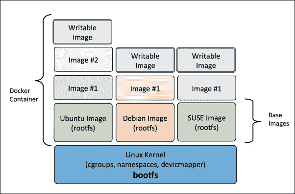
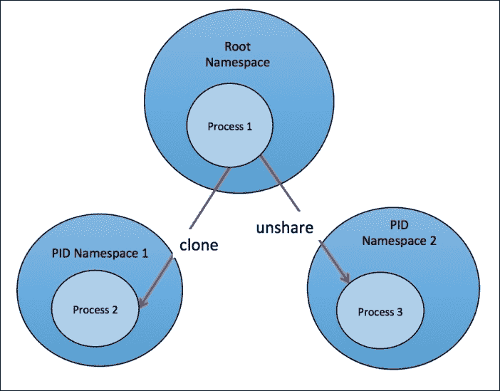
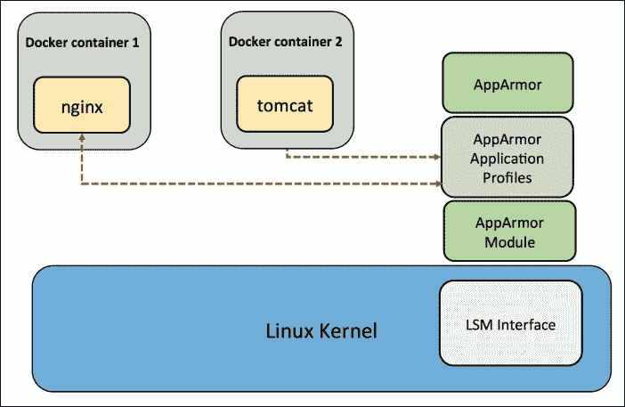

# 第五章：Docker 容器的安全性和 QoS

在本章中，我们将学习安全性是如何在容器的上下文中实现的，以及如何实施 QoS 策略以确保 CPU 和 IO 等资源按预期共享。大部分讨论将集中在这些主题在 Docker 上下文中的相关性。

在本章中，我们将涵盖以下内容：

+   文件系统限制

+   只读挂载点

+   写时复制

+   Linux 功能和 Docker

+   在 AWS ECS（EC2 容器服务）中保护容器

+   理解 Docker 安全性 I - 内核命名空间

+   理解 Docker 安全性 II - cgroups

+   使用 AppArmour 来保护 Docker 容器

+   Docker 安全基准

# 文件系统限制

在本节中，我们将研究 Docker 容器启动时的文件系统限制。下一节解释了只读挂载点和写时复制文件系统，这些文件系统被用作 Docker 容器的基础和内核对象的表示。

## 只读挂载点

Docker 需要访问文件系统，如 sysfs 和 proc，以使进程正常运行。但它不一定需要修改这些挂载点。

两个主要的只读挂载点是：

+   `/sys`

+   `/proc`

### sysfs

sysfs 文件系统加载到挂载点`/sys`中。sysfs 是一种表示内核对象、它们的属性和它们之间关系的机制。它提供了两个组件：

+   用于通过 sysfs 导出这些项目的内核编程接口

+   一个用户界面，用于查看和操作这些项目，它映射回它们所代表的内核对象

以下代码显示了挂载的挂载点：

[PRE0]

上述代码的参考链接在[`github.com/docker/docker/blob/ecc3717cb17313186ee711e624b960b096a9334f/daemon/execdriver/native/template/default_template_linux.go`](https://github.com/docker/docker/blob/ecc3717cb17313186ee711e624b960b096a9334f/daemon/execdriver/native/template/default_template_linux.go)。

### procfs

proc 文件系统（procfs）是 Unix-like 操作系统中的一个特殊文件系统，它以分层文件样式的结构呈现有关进程和其他系统信息的信息。它加载到`/proc`中。它提供了一个更方便和标准化的方法来动态访问内核中保存的进程数据，而不是传统的跟踪方法或直接访问内核内存。它在引导时映射到名为`/proc`的挂载点：

[PRE1]

使用`/proc`的只读路径：

[PRE2]

### /dev/pts

这是另一个在创建过程中作为读写挂载的挂载点。`/dev/pts`完全存在于内存中，没有任何内容存储在磁盘上，因此可以安全地以读写模式加载它。

`/dev/pts`中的条目是伪终端（简称 pty）。Unix 内核有终端的通用概念。终端提供了应用程序通过终端设备显示输出和接收输入的方式。一个进程可能有一个控制终端。对于文本模式应用程序，这是它与用户交互的方式：

[PRE3]

### /sys/fs/cgroup

这是 cgroups 实现的挂载点，并且在容器中加载为`MS_RDONLY`：

[PRE4]

## 写时复制

Docker 使用联合文件系统，这是写时复制文件系统。这意味着容器可以使用相同的文件系统镜像作为容器的基础。当容器向镜像写入内容时，它会被写入到特定于容器的文件系统中。即使它们是从相同的文件系统镜像创建的，一个容器也不能访问另一个容器的更改。一个容器不能改变镜像内容以影响另一个容器中的进程。以下图解释了这个过程：

# Linux 功能

1.2 版本之前的 Docker 容器可以在特权模式下获得完整的功能，或者它们可以遵循允许的功能白名单，同时放弃所有其他功能。如果使用`--privileged`标志，它将授予容器所有功能。这在生产中是不推荐的，因为它真的很不安全；它允许 Docker 作为直接主机下的进程拥有所有特权。

使用 Docker 1.2 引入了两个`docker run`标志：

+   `--cap-add`

+   `--cap-drop`

这两个标志为容器提供了细粒度的控制，例如：

+   更改 Docker 容器接口的状态：

[PRE5]

+   防止 Docker 容器中的任何 chown：

[PRE6]

+   允许除`mknod`之外的所有功能：

[PRE7]

Docker 默认以受限的功能集启动容器。功能将根和非根的二进制模式转换为更精细的访问控制。例如，提供 HTTP 请求的 Web 服务器需要绑定到端口 80 进行 HTTP 和端口 443 进行 HTTPs。这些服务器不需要以根模式运行。这些服务器可以被授予`net_bind_service`功能。

在这个情境中，容器和服务器有一些不同。服务器需要以 root 模式运行一些进程。例如，ssh，cron 和网络配置来处理 dhcp 等。另一方面，容器不需要这种访问。

以下任务不需要在容器中发生：

+   ssh 访问由 Docker 主机管理

+   cron 作业应该在用户模式下运行

+   网络配置，如 ipconfig 和路由，不应该在容器内发生

我们可以安全地推断容器可能不需要 root 权限。

可以拒绝的示例如下：

+   不允许挂载操作

+   不允许访问套接字

+   阻止对文件系统操作的访问，如更改文件属性或文件所有权

+   阻止容器加载新模块

Docker 只允许以下功能：

[PRE8]

对先前代码的引用在[`github.com/docker/docker/blob/master/daemon/execdriver/native/template/default_template_linux.go`](https://github.com/docker/docker/blob/master/daemon/execdriver/native/template/default_template_linux.go)。

可以在 Linux man-pages 中找到所有可用功能的完整列表([`man7.org/linux/man-pages/man7/capabilities.7.html`](http://man7.org/linux/man-pages/man7/capabilities.7.html))。

运行 Docker 容器的一个主要风险是，容器的默认功能和挂载集可能提供不完整的隔离，无论是独立使用还是与内核漏洞结合使用。

Docker 支持添加和删除功能，允许使用非默认配置文件。这可以通过删除功能或添加功能使 Docker 更安全或更不安全。用户的最佳做法是删除除了明确需要的功能之外的所有功能。

# 在 AWS ECS 中保护容器

亚马逊**EC2 容器服务**(**ECS**)提供了一个高度可扩展、高性能的容器管理服务，支持 Docker 容器。它允许您轻松地在一组托管的亚马逊 EC2 实例上运行应用程序。Amazon ECS 消除了您安装、操作和扩展自己的集群管理基础设施的需要。通过简单的 API 调用，您可以启动和停止启用 Docker 的应用程序，并查询集群的完整状态。

在以下示例中，我们将看到如何使用两个 Docker 容器部署一个安全的 Web 应用程序，一个包含一个简单的 Web 应用程序（应用程序容器），另一个包含启用了限流的反向代理（代理容器），可以用来保护 Web 应用程序。这些容器将在 Amazon EC2 实例上使用 ECS 部署。如下图所示，所有网络流量将通过限流请求的代理容器路由。此外，我们可以在代理容器上使用各种安全软件执行过滤、日志记录和入侵检测等活动。

以下是这样做的步骤：

1.  我们将从 GitHub 项目构建一个基本的 PHP Web 应用程序容器。以下步骤可以在单独的 EC2 实例或本地机器上执行：

[PRE9]

1.  切换到`ecs-demo-php-simple-app`文件夹：

[PRE10]

1.  我们可以检查`Dockerfile`如下，以了解它将部署的 Web 应用程序：

[PRE11]

1.  使用 Dockerfile 构建容器镜像，然后将其推送到您的 Docker Hub 帐户。 Docker Hub 帐户是必需的，因为它可以通过指定容器名称来在 Amazon ECS 服务上部署容器：

[PRE12]

此处构建的镜像需要将`dockerhub-username`（无空格）作为第一个参数。

下图描述了黑客无法访问 Web 应用程序，因为请求通过代理容器进行过滤并且被阻止：

1.  将 Docker 镜像上传到 Docker Hub 帐户：

[PRE13]

1.  检查以确保您的登录成功：

[PRE14]

1.  将您的镜像推送到 Docker Hub 帐户：

[PRE15]

1.  创建示例 Web 应用程序 Docker 容器后，我们将创建代理容器，如果需要，还可以包含一些与安全相关的软件，以加强安全性。我们将使用定制的 Dockerfile 创建一个新的代理 Docker 容器，然后将镜像推送到您的 Docker Hub 帐户：

[PRE16]

在上一个 Dockerfile 中，我们使用了一个基本的 Ubuntu 镜像，并安装了 nginx，并将其暴露在 80 端口。

1.  接下来，我们将创建一个定制的`nginx.conf`，它将覆盖默认的`nginx.conf`，以确保反向代理配置正确：

[PRE17]

1.  构建代理 Docker 镜像并将构建的镜像推送到 Docker Hub 帐户：

[PRE18]

1.  可以通过转到 AWS 管理控制台（[`aws.amazon.com/console/`](https://aws.amazon.com/console/)）来部署 ECS 容器服务。

1.  在左侧边栏中单击“任务定义”，然后单击“创建新任务定义”。

1.  给你的任务定义起一个名字，比如`SecurityApp`。

1.  接下来，单击“添加容器”，并插入推送到 Docker Hub 帐户的代理 Web 容器的名称，以及应用程序 Web 容器的名称。使用“通过 JSON 配置”选项卡查看 JSON 的内容，以查看您创建的任务定义。它应该是这样的：

[PRE19]

单击“创建”按钮以部署应用程序。

1.  在左侧边栏中单击“集群”。如果默认集群不存在，则创建一个。

1.  启动一个 ECS 优化的 Amazon 机器映像（AMI），确保它具有公共 IP 地址和通往互联网的路径。

1.  当您的实例正在运行时，导航到 AWS 管理控制台的 ECS 部分，然后单击“集群”，然后单击“默认”。现在，我们应该能够在“ECS 实例”选项卡下看到我们的实例。

1.  从 AWS 管理控制台选项卡的左侧导航到任务定义，然后单击“运行任务”。

1.  在下一页上，确保集群设置为“默认”，任务数为“1”，然后单击“运行任务”。

1.  进程完成后，我们可以从挂起状态到绿色运行状态看到任务的状态。

1.  单击“ECS”选项卡，我们可以看到先前创建的容器实例。单击它，我们将获得有关其公共 IP 地址的信息。通过浏览器点击此公共 IP 地址，我们将能够看到我们的示例 PHP 应用程序。

# 理解 Docker 安全性 I—内核命名空间

命名空间提供了对内核全局系统资源的包装器，并使资源对于命名空间内的进程看起来像是有一个隔离的实例。全局资源更改对于相同命名空间中的进程是可见的，但对其他进程是不可见的。容器被认为是内核命名空间的一个很好的实现。

Docker 实现了以下命名空间：

+   pid 命名空间：用于进程隔离（PID—进程 ID）

+   net 命名空间：用于管理网络接口（NET—网络）

+   IPC 命名空间：用于管理对 IPC 资源（IPC—进程间通信）的访问

+   mnt 命名空间：用于管理挂载点（MNT—挂载）

+   **uts 命名空间**：用于隔离内核和版本标识（**UTS**—**Unix Time sharing System**）

在 libcontainer 中添加命名空间支持需要在 GoLang 的系统层中添加补丁（[`codereview.appspot.com/126190043/patch/140001/150001`](https://codereview.appspot.com/126190043/patch/140001/150001)<emphsis>src/syscall/exec_linux.go</emphsis>），以便可以维护新的数据结构用于 PID、用户 UID 等。

## pid 命名空间

pid 命名空间隔离了进程 ID 号空间；不同 pid 命名空间中的进程可以拥有相同的 pid。pid 命名空间允许容器提供功能，如暂停/恢复容器中的一组进程，并在容器内部的进程保持相同的 pid 的情况下将容器迁移到新主机。

新命名空间中的 PID 从 1 开始。内核需要配置标志`CONFIG_PID_NS`才能使命名空间工作。

pid 命名空间可以嵌套。每个 pid 命名空间都有一个父命名空间，除了初始（根）pid 命名空间。pid 命名空间的父命名空间是使用 clone 或 unshare 创建命名空间的进程的 pid 命名空间。pid 命名空间形成一棵树，所有命名空间最终都可以追溯到根命名空间，如下图所示：

## net 命名空间

net 命名空间提供了与网络相关的系统资源隔离。每个网络命名空间都有自己的网络设备、IP 地址、IP 路由表、`/proc/net`目录、端口号等。

网络命名空间使容器在网络方面变得有用：每个容器可以拥有自己的（虚拟）网络设备和绑定到每个命名空间端口号空间的应用程序；主机系统中适当的路由规则可以将网络数据包定向到与特定容器关联的网络设备。使用网络命名空间需要内核配置`CONFIG_NET_NS`选项（[`lwn.net/Articles/531114/`](https://lwn.net/Articles/531114/)）。

由于每个容器都有自己的网络命名空间，基本上意味着拥有自己的网络接口和路由表，net 命名空间也被 Docker 直接利用来隔离 IP 地址、端口号等。

### 基本网络命名空间管理

通过向`clone()`系统调用传递一个标志`CLONE_NEWNET`来创建网络命名空间。不过，从命令行来看，使用 IP 网络配置工具来设置和处理网络命名空间是很方便的：

[PRE20]

这个命令创建了一个名为`netns1`的新网络命名空间。当 IP 工具创建网络命名空间时，它将在`/var/run/netns`下为其创建一个绑定挂载，这样即使在其中没有运行任何进程时，命名空间也会持续存在，并且便于对命名空间本身进行操作。由于网络命名空间通常需要大量配置才能准备好使用，这个特性将受到系统管理员的赞赏。

`ip netns exec`命令可用于在命名空间内运行网络管理命令：

[PRE21]

这个命令列出了命名空间内可见的接口。可以使用以下命令删除网络命名空间：

[PRE22]

这个命令移除了指向给定网络命名空间的绑定挂载。然而，命名空间本身将持续存在，只要其中有任何进程在其中运行。

### 网络命名空间配置

新的网络命名空间将拥有一个环回设备，但没有其他网络设备。除了环回设备外，每个网络设备（物理或虚拟接口，桥接等）只能存在于单个网络命名空间中。此外，物理设备（连接到真实硬件的设备）不能被分配到除根之外的命名空间。相反，可以创建虚拟网络设备（例如虚拟以太网或 vEth）并分配给命名空间。这些虚拟设备允许命名空间内的进程通过网络进行通信；决定它们可以与谁通信的是配置、路由等。

创建时，新命名空间中的`lo`环回设备是关闭的，因此即使是环回的`ping`也会失败。

[PRE23]

在前面的命令中，我们可以看到由于 Docker 容器的网络命名空间存储在单独的位置，因此需要创建到`/var/run/netns`的符号链接，可以通过以下方式完成：

[PRE24]

在这个例子中，通过启动该接口来实现，这将允许对环回地址进行 ping。

[PRE25]

这仍然不允许`netns1`和根命名空间之间的通信。为了实现这一点，需要创建和配置虚拟以太网设备。

[PRE26]

第一条命令设置了一对连接的虚拟以太网设备。发送到`veth0`的数据包将被`veth1`接收，反之亦然。第二条命令将`veth1`分配给`netns1`命名空间。

[PRE27]

然后，这两条命令为这两个设备设置了 IP 地址。

[PRE28]

现在可以进行双向通信，就像之前的`ping`命令所示。

如前所述，命名空间不共享路由表或防火墙规则，运行`route`和`iptables -L`在`netns1`中将证明这一点：

[PRE29]

## 用户命名空间

用户命名空间允许用户和组 ID 在命名空间内进行映射。这意味着命名空间内的进程的用户 ID 和组 ID 可以与其在命名空间外的 ID 不同。一个进程在命名空间外可以具有非零用户 ID，同时在命名空间内可以具有零用户 ID。该进程在用户命名空间外进行操作时没有特权，但在命名空间内具有 root 特权。

### 创建新的用户命名空间

通过在调用`clone()`或`unshare()`时指定`CLONE_NEWUSER`标志来创建用户命名空间：

`clone()` 允许子进程与调用进程共享其执行上下文的部分，例如内存空间、文件描述符表和信号处理程序表。

`unshare()` 允许进程（或线程）取消与其他进程（或线程）共享的执行上下文的部分。当使用`fork()`或`vfork()`创建新进程时，执行上下文的一部分，例如挂载命名空间，会隐式共享。

如前所述，Docker 容器与 LXC 容器非常相似，因为为容器单独创建了一组命名空间和控制组。每个容器都有自己的网络堆栈和命名空间。除非容器没有特权访问权限，否则不允许访问其他主机的套接字或接口。如果将主机网络模式赋予容器，那么它才能访问主机端口和 IP 地址，这可能对主机上运行的其他程序造成潜在威胁。

如下例所示，在容器中使用`host`网络模式，并且能够访问所有主机桥接设备：

[PRE30]

在审核过程中，应该检查所有容器，默认情况下网络模式是否设置为`default`而不是`host`：

[PRE31]

每个 Docker 容器都连接到以太网桥，以便在容器之间提供互连性。它们可以相互 ping 以发送/接收 UDP 数据包并建立 TCP 连接，但如果有必要，可以进行限制。命名空间还提供了一种简单的隔离，限制了在其他容器中运行的进程以及主机的访问。

我们将使用以下`nsenter`命令行实用程序进入命名空间。它是 GitHub 上的一个开源项目，可在[`github.com/jpetazzo/nsenter`](https://github.com/jpetazzo/nsenter)上找到。

使用它，我们将尝试进入现有容器的命名空间，或者尝试生成一组新的命名空间。它与 Docker `exec`命令不同，因为`nsenter`不会进入 cgroups，这可以通过使用命名空间来逃避资源限制，从而为调试和外部审计带来潜在好处。

我们可以从 PyPI 安装`nsenter`（它需要 Python 3.4），并使用命令行实用程序连接到正在运行的容器：

[PRE32]

使用以下命令替换 pid 为容器的 pid：

[PRE33]

我们可以使用`docker inspect`命令使其更加方便：

1.  首先启动一个新的 nginx 服务器：

[PRE34]

1.  然后获取容器的 pid：

[PRE35]

1.  连接到正在运行的 nginx 容器：

[PRE36]

`docker-enter`也是可以用来进入容器并指定 shell 命令的包装器，如果没有指定命令，将调用一个 shell。如果需要在不执行其他命令行工具的情况下检查或操作容器，可以使用上下文管理器来实现：

[PRE37]

# 理解 Docker 安全 II - cgroups

在本节中，我们将看看 cgroups 如何构成容器隔离的基础。

## 定义 cgroups

控制组提供了一种将任务（进程）及其所有未来的子任务聚合/分区到分层组中的机制。

cgroup 将一组任务与子系统的参数关联起来。子系统本身是用于定义 cgroups 边界或为资源提供的资源控制器。

层次结构是一组以树状排列的 cgroups，系统中的每个任务都恰好位于层次结构中的一个 cgroup 中，并且一组子系统。

## 为什么需要 cgroups？

Linux 内核中有多个努力提供进程聚合，主要用于资源跟踪目的。

这些努力包括 cpusets、CKRM/ResGroups、UserBeanCounters 和虚拟服务器命名空间。所有这些都需要基本的进程分组/分区概念，新分叉的进程最终进入与其父进程相同的组（cgroup）。

内核 cgroup 补丁提供了必要的内核机制，以有效地实现这些组。它对系统快速路径的影响很小，并为特定子系统提供了钩子，例如 cpusets，以提供所需的附加行为。

## 手动创建一个 cgroup

在以下步骤中，我们将创建一个`cpuset`控制组：

[PRE38]

`tmpfs`是一种将所有文件保存在虚拟内存中的文件系统。`tmpfs`中的所有内容都是临时的，即不会在硬盘上创建任何文件。如果卸载`tmpfs`实例，则其中存储的所有内容都会丢失：

[PRE39]

为此 cgroup 分配 CPU 和内存限制：

[PRE40]

以下命令显示`/Charlie`作为 cpuset cgroup： 

[PRE41]

## 将进程附加到 cgroups

将进程 ID`PID{X}`添加到任务文件中，如下所示：

[PRE42]

请注意，这是`PID`，而不是 PIDs。

您一次只能附加一个任务。如果有多个任务要附加，您必须一个接一个地执行：

[PRE43]

通过回显`0`将当前 shell 任务附加：

[PRE44]

## Docker 和 cgroups

cgroups 作为 Docker 的 GitHub 存储库（[`github.com/opencontainers/runc/tree/master/libcontainer/cgroups`](https://github.com/opencontainers/runc/tree/master/libcontainer/cgroups)）下的 libcontainer 项目的一部分进行管理。有一个 cgroup 管理器，负责与内核中的 cgroup API 进行交互。

以下代码显示了管理器管理的生命周期事件：

[PRE45]

# 使用 AppArmor 保护 Docker 容器

AppArmor 是一种**强制访问控制**（**MAC**）系统，是内核增强功能，用于将程序限制在有限的资源集合中。AppArmor 的安全模型是将访问控制属性绑定到程序，而不是用户。

AppArmor 约束是通过加载到内核中的配置文件提供的，通常在启动时加载。AppArmor 配置文件可以处于两种模式之一：强制执行或投诉。

以强制执行模式加载的配置文件将导致强制执行配置文件中定义的策略，并报告策略违规尝试（通过 syslog 或 auditd）。

投诉模式下的配置文件不会强制执行策略，而是报告策略违规尝试。

AppArmor 与 Linux 上的其他一些 MAC 系统不同：它是基于路径的，允许混合强制和投诉模式配置文件，使用包含文件来简化开发，并且比其他流行的 MAC 系统具有更低的入门门槛。以下图显示了与应用程序相关联的 AppArmour 应用程序配置文件：

AppArmor 是一项成熟的技术，最初出现在 Immunix 中，后来集成到 Ubuntu、Novell/SUSE 和 Mandriva 中。核心 AppArmor 功能从 Linux 内核 2.6.36 版本开始就已经在主线内核中；AppArmor、Ubuntu 和其他开发人员正在进行工作，将其他额外的 AppArmor 功能合并到主线内核中。

您可以在[`wiki.ubuntu.com/AppArmor`](https://wiki.ubuntu.com/AppArmor)找到有关 AppArmor 的更多信息。

## AppArmor 和 Docker

在 Docker 内运行的应用程序可以利用 AppArmor 来定义策略。这些配置文件可以手动创建，也可以使用一个名为 bane 的工具加载。

### 注意

在 Ubuntu 14.x 上，确保安装了 systemd 才能使以下命令生效。

以下步骤显示了如何使用这个工具：

1.  从 GitHub 下载 bane 项目：

[PRE46]

确保这是在您的 GOPATH 目录中完成的。例如，我们使用了`/home/ubuntu/go`，bane 源代码下载在`/home/Ubuntu/go/src/github.com/jfrazelle/bane`。

1.  安装 bane 编译所需的 toml 解析器：

[PRE47]

1.  转到`/home/Ubuntu/go/src/github.com/jfrazelle/bane`目录并运行以下命令：

[PRE48]

1.  您将在`/home/Ubuntu/go/bin`中找到 bane 二进制文件。

1.  使用`.toml`文件创建配置文件：

[PRE49]

1.  执行 bane 加载配置文件。`sample.toml`是在`/home/Ubuntu/go/src/github.com/jfrazelle/bane`目录中的文件：

[PRE50]

这个配置文件将使大量路径变为只读，并且只允许在我们将要创建的容器中执行 nginx。它禁用了 TOP、PING 等。

1.  一旦配置文件加载，您就可以创建一个 nginx 容器：

[PRE51]

注意，如果 AppArmor 无法找到文件，将文件复制到`/etc/apparmor.d`目录并重新加载 AppArmour 配置文件：

[PRE52]

使用 AppArmor 配置文件创建 nginx 容器：

[PRE53]

以下图显示了容器中运行的 nginx 应用程序如何使用 AppArmour 应用程序配置文件：

## Docker 安全基准

以下教程展示了一些重要的准则，应遵循以在安全和生产环境中运行 Docker 容器。这是从 CIS Docker 安全基准[`benchmarks.cisecurity.org/tools2/docker/CIS_Docker_1.6_Benchmark_v1.0.0.pdf`](https://benchmarks.cisecurity.org/tools2/docker/CIS_Docker_1.6_Benchmark_v1.0.0.pdf)中引用的。

### 定期审计 Docker 守护程序

除了审计常规的 Linux 文件系统和系统调用外，还要审计 Docker 守护程序。Docker 守护程序以 root 权限运行。因此，有必要审计其活动和使用情况：

[PRE54]

如果存在审计日志文件，则删除：

[PRE55]

为 Docker 服务添加审计规则并审计 Docker 服务：

[PRE56]

### 为容器创建一个用户

目前，Docker 不支持将容器的 root 用户映射到主机上的非 root 用户。用户命名空间的支持将在未来版本中提供。这会导致严重的用户隔离问题。因此，强烈建议确保为容器创建一个非 root 用户，并使用该用户运行容器。

如我们在以下片段中所见，默认情况下，`centos` Docker 镜像的`user`字段为空，这意味着默认情况下容器在运行时将获得 root 用户，这应该避免：

[PRE57]

在构建 Docker 镜像时，可以在 Dockerfile 中提供`test`用户，即权限较低的用户，如以下片段所示：

[PRE58]

当我们启动 Docker 容器时，可以看到它获得了一个`test`用户，而`docker inspect`命令也显示默认用户为`test`：

[PRE59]

### 不要在容器上挂载敏感主机系统目录

如果敏感目录以读写模式挂载，可能会对这些敏感目录内的文件进行更改。这些更改可能带来安全隐患或不必要的更改，可能使 Docker 主机处于受损状态。

如果在容器中挂载了`/run/systemd`敏感目录，那么我们实际上可以从容器本身关闭主机：

[PRE60]

可以通过使用以下命令进行审计，该命令返回当前映射目录的列表以及每个容器实例是否以读写模式挂载：

[PRE61]

### 不要使用特权容器

Docker 支持添加和删除功能，允许使用非默认配置文件。这可能通过删除功能使 Docker 更安全，或者通过添加功能使其不太安全。因此建议除了容器进程明确需要的功能外，删除所有功能。

正如下所示，当我们在不使用特权模式的情况下运行容器时，我们无法更改内核参数，但是当我们使用`--privileged`标志在特权模式下运行容器时，可以轻松更改内核参数，这可能会导致安全漏洞。

[PRE62]

因此，在审核时，必须确保所有容器的特权模式未设置为`true`。

[PRE63]

# 总结

在本章中，我们深入探讨了 Docker 安全性，并概述了 cgroups 和内核命名空间。我们还讨论了文件系统和 Linux 功能的一些方面，容器利用这些功能来提供更多功能，例如特权容器，但代价是在威胁方面更容易暴露。我们还看到了如何在 AWS ECS（EC2 容器服务）中部署容器以在受限流量中使用代理容器来在安全环境中部署容器。AppArmor 还提供了内核增强功能，以将应用程序限制在有限的资源集上。利用它们对 Docker 容器的好处有助于在安全环境中部署它们。最后，我们快速了解了 Docker 安全基准和在生产环境中进行审核和 Docker 部署期间可以遵循的一些重要建议。

在下一章中，我们将学习使用各种工具在 Docker 网络中进行调优和故障排除。
