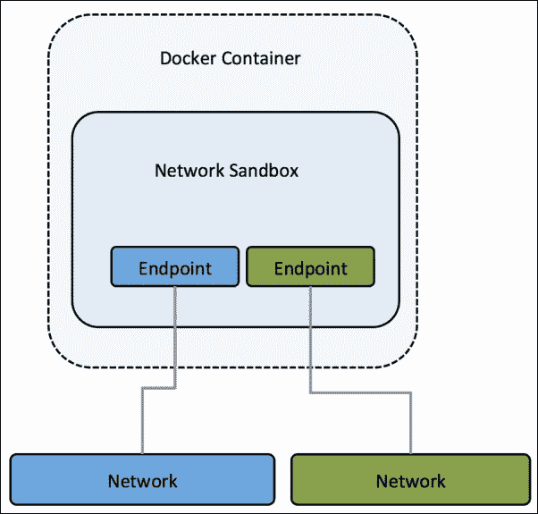
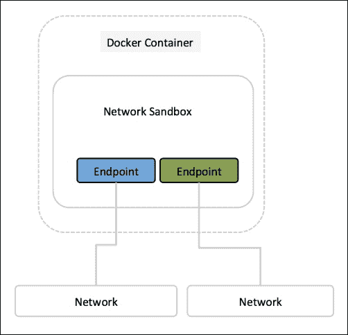
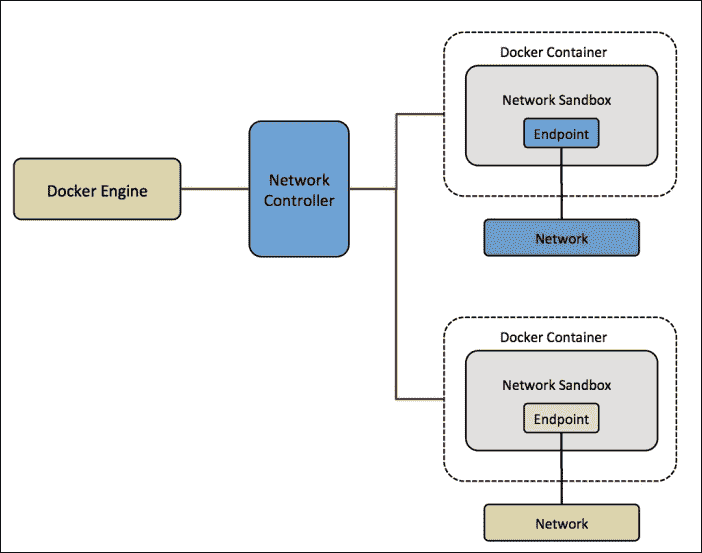
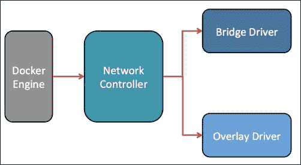
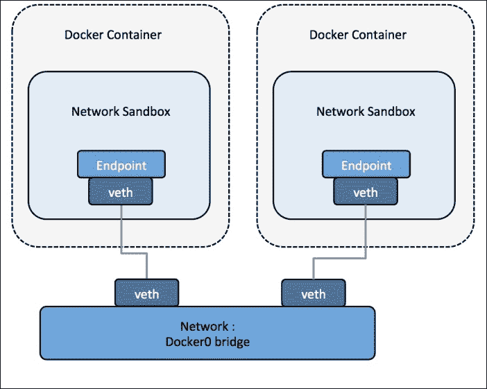
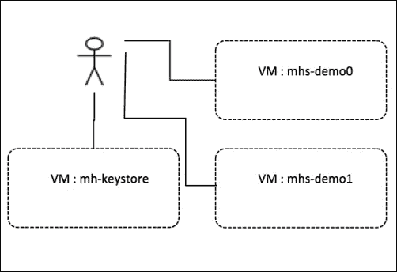
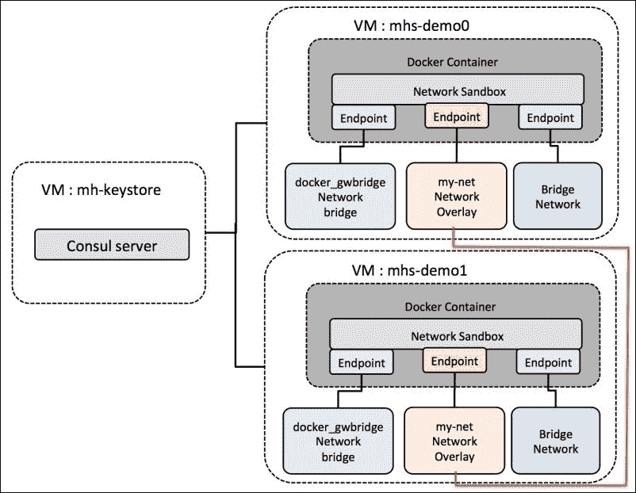
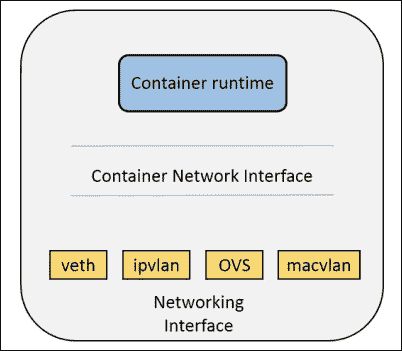
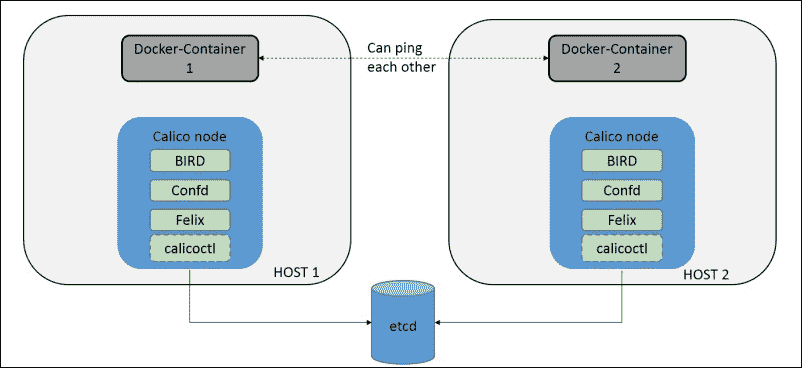

# 第六章：Docker 的下一代网络堆栈：libnetwork

在本章中，我们将学习关于 Docker 的新网络堆栈：libnetwork，它提供了一个可插拔的架构，具有单主机和多主机虚拟网络的默认实现：

+   介绍

+   目标

+   设计

+   CNM 对象

+   CNM 属性

+   CNM 生命周期

+   驱动程序

+   桥接驱动程序

+   覆盖网络驱动程序

+   使用 Vagrant 进行覆盖网络

+   使用 Docker Machine 和 Docker Swarm 的覆盖网络

+   手动创建覆盖网络并将其用于容器

+   容器网络接口

+   Calico 的 libnetwork 驱动程序

# 目标

libnetwork 是用 go 语言编写的，是连接 Docker 容器的新方法。其目标是提供一个容器网络模型，帮助程序员并提供网络库的抽象。libnetwork 的长期目标是遵循 Docker 和 Linux 的哲学，提供独立工作的模块。libnetwork 的目标是为容器提供网络的可组合需求。它还旨在通过以下方式将 Docker Engine 和 libcontainer 中的网络逻辑模块化为单一可重用库：

+   用 libnetwork 替换 Docker Engine 的网络模块

+   作为一个允许本地和远程驱动程序为容器提供网络的模型

+   提供一个用于管理和测试 libnetwork 的工具 dnet-仍在进行中的工作（参考自[`github.com/docker/libnetwork/issues/45`](https://github.com/docker/libnetwork/issues/45)）。

# 设计

libnetwork 实现了**容器网络模型**（**CNM**）。它规范了为容器提供网络所需的步骤，同时提供了一个抽象，可用于支持多个网络驱动程序。其端点 API 主要用于管理相应的对象，并对其进行簿记，以提供 CNM 模型所需的抽象级别。

CNM 建立在三个主要组件上。下图显示了 libnetwork 的网络沙盒模型：



# CNM 对象

让我们详细讨论 CNM 对象。

## 沙盒

这包含容器网络堆栈的配置，包括管理路由表、容器接口和 DNS 设置。沙箱的实现可以是 Linux 网络命名空间、FreeBSD 监狱或其他类似的概念。一个沙箱可以包含来自多个网络的许多端点。它还表示容器的网络配置，如 IP 地址、MAC 地址和 DNS 条目。libnetwork 利用特定于操作系统的参数来填充沙箱所代表的网络配置。libnetwork 提供了在多个操作系统中实现沙箱的框架。Netlink 用于管理命名空间中的路由表，目前存在两种沙箱的实现，`namespace_linux.go`和`configure_linux.go`，以唯一标识主机文件系统上的路径。

沙箱与单个 Docker 容器相关联。以下数据结构显示了沙箱的运行时元素：

```
type sandbox struct {
  id            string
  containerID   string
  config        containerConfig
  osSbox        osl.Sandbox
  controller    *controller
  refCnt        int
  endpoints     epHeap
  epPriority    map[string]int
  joinLeaveDone chan struct{}
  dbIndex       uint64
  dbExists      bool
  isStub        bool
  inDelete      bool
  sync.Mutex
}
```

新的沙箱是从网络控制器实例化的（稍后将更详细地解释）。

```
func (c *controller) NewSandbox(containerID string, options ...SandboxOption) (Sandbox, error) {
  …..
}
```

## 端点

端点将沙箱连接到网络，并为容器公开的服务提供与部署在同一网络中的其他容器的连接。它可以是 Open vSwitch 的内部端口或类似的 veth 对。一个端点只能属于一个网络，但可能只属于一个沙箱。端点代表一个服务，并提供各种 API 来创建和管理端点。它具有全局范围，但只附加到一个网络，如下图所示：



端点由以下数据结构指定：

```
type endpoint struct {
  name          string
  id            string
  network       *network
  iface         *endpointInterface
  joinInfo      *endpointJoinInfo
  sandboxID     string
  exposedPorts  []types.TransportPort
  anonymous     bool
  generic       map[string]interface{}
  joinLeaveDone chan struct{}
  prefAddress   net.IP
  prefAddressV6 net.IP
  ipamOptions   map[string]string
  dbIndex       uint64
  dbExists      bool
  sync.Mutex
}
```

端点与唯一 ID 和名称相关联。它附加到网络和沙箱 ID。它还与 IPv4 和 IPv6 地址空间相关联。每个端点都与`endpointInterface`结构相关联。

## 网络

网络是能够直接相互通信的端点组。它在同一主机或多个主机之间提供所需的连接，并在创建或更新网络时通知相应的驱动程序。例如，VLAN 或 Linux 桥，在集群中具有全局范围。

网络由网络控制器控制，我们将在下一节中讨论。每个网络都有名称、地址空间、ID 和网络类型：

```
type network struct {
  ctrlr        *controller
  name         string
  networkType  string
  id           string
  ipamType     string
  addrSpace    string
  ipamV4Config []*IpamConf
  ipamV6Config []*IpamConf
  ipamV4Info   []*IpamInfo
  ipamV6Info   []*IpamInfo
  enableIPv6   bool
  postIPv6     bool
  epCnt        *endpointCnt
  generic      options.Generic
  dbIndex      uint64
  svcRecords   svcMap
  dbExists     bool
  persist      bool
  stopWatchCh  chan struct{}
  drvOnce      *sync.Once
  internal     bool
  sync.Mutex
}
```

## 网络控制器

网络控制器对象提供 API 来创建和管理网络对象。它是 libnetwork 中的入口点，通过将特定的驱动程序绑定到给定的网络，支持多个活动驱动程序，包括内置和远程驱动程序。网络控制器允许用户将特定的驱动程序绑定到给定的网络：

```
type controller struct {
  id             string
  drivers        driverTable
  ipamDrivers    ipamTable
  sandboxes      sandboxTable
  cfg            *config.Config
  stores         []datastore.DataStore
  discovery      hostdiscovery.HostDiscovery
  extKeyListener net.Listener
  watchCh        chan *endpoint
  unWatchCh      chan *endpoint
  svcDb          map[string]svcMap
  nmap           map[string]*netWatch
  defOsSbox      osl.Sandbox
  sboxOnce       sync.Once
  sync.Mutex
}
```

每个网络控制器都引用以下内容：

+   数据结构 driverTable 中有一个或多个驱动程序

+   数据结构中有一个或多个沙盒

+   数据存储库

+   ipamTable

下图显示了**网络控制器**如何位于**Docker 引擎**和其连接的容器和网络之间：



## CNM 属性

有两种类型的属性，如下：

+   **选项**：它们对终端用户不可见，但是提供了一种灵活的机制，可以直接从用户传递驱动程序特定的配置数据的键值对。只有当键匹配一个众所周知的标签时，libnetwork 才会处理选项，结果值被选中，这由一个通用对象表示。

+   **标签**：它们是选项的一个子集，是终端用户变量，使用`-labels`选项在 UI 中表示。它们的主要功能是执行特定于驱动程序的操作，并且它们从 UI 传递。

## CNM 生命周期

容器网络模型的消费者通过 CNM 对象及其 API 进行交互，以网络管理他们管理的容器。

驱动程序在网络控制器中注册。内置驱动程序在 libnetwork 内部注册，而远程驱动程序通过插件机制（WIP）在 libnetwork 中注册。每个驱动程序处理特定的网络类型。

使用`libnetwork.New()` API 创建一个网络控制器对象来管理网络的分配，并可选择使用特定于驱动程序的选项配置驱动程序。

使用控制器的`NewNetwork()` API 通过提供名称和`networkType`来创建网络。`networkType`参数有助于选择相应的驱动程序，并将创建的网络绑定到该驱动程序。从这一点开始，对网络的任何操作都将由该驱动程序处理。

`controller.NewNetwork()` API 还接受可选的选项参数，其中包含驱动程序特定的选项和标签，驱动程序可以用于其目的。

`network.CreateEndpoint()`可以调用以在给定网络中创建新的端点。此 API 还接受可选的选项参数，这些参数随驱动程序而异。

当在网络中创建端点时，将调用驱动程序的`driver.CreateEndpoint`，它可以选择在网络中创建端点时保留 IPv4/IPv6 地址。驱动程序将使用`driver` API 中定义的`InterfaceInfo`接口来分配这些地址。IPv4/IPv6 地址是完成端点作为服务定义所需的，以及端点公开的端口。服务端点是应用程序容器正在侦听的网络地址和端口号。

`endpoint.Join()`可用于将容器附加到端点。`Join`操作将为该容器创建一个沙盒（如果不存在）。驱动程序利用沙盒键来标识附加到同一容器的多个端点。

有一个单独的 API 用于创建端点，另一个用于加入端点。

端点表示独立于容器的服务。创建端点时，为容器保留了资源，以便稍后附加到端点。这提供了一致的网络行为。

当容器停止时，将调用`endpoint.Leave()`。驱动程序可以清理在`Join()`调用期间分配的状态。当最后一个引用端点离开网络时，libnetwork 将删除沙盒。

只要端点仍然存在，libnetwork 将继续持有 IP 地址。当容器（或任何容器）再次加入时，这些地址将被重用。这确保了在容器停止和重新启动时重用容器的资源。

`endpoint.Delete()`用于从网络中删除端点。这将导致删除端点并清理缓存的`sandbox.Info`。

`network.Delete()`用于删除网络。如果没有端点附加到网络上，则允许删除。

# 驱动程序

驱动程序拥有一个网络，并负责使网络工作并管理它。网络控制器提供了一个 API，用于使用特定标签/选项配置驱动程序，这些标签/选项对用户不可见，但对 libnetwork 透明，并且可以由驱动程序直接处理。驱动程序可以是内置的（如桥接、主机或覆盖）和远程的（来自插件提供者），可以部署在各种用例和部署场景中。

驱动程序拥有网络实现，并负责管理它，包括**IP 地址管理（IPAM）**。以下图解释了这个过程：



以下是内置驱动程序：

+   **Null**：为了与旧的`docker --net=none`向后兼容，存在这个选项，主要是在不需要网络的情况下。

+   **桥**：它提供了一个特定于 Linux 的桥接实现驱动程序。

+   **覆盖**：覆盖驱动程序实现了可以跨多个主机网络封装的网络。我们将深入研究其中两种实现：与 Consul 的基本设置和使用 Vagrant 部署覆盖驱动程序的设置。

+   **远程**：它提供了一种支持远程传输的驱动程序的手段，可以根据选择编写特定的驱动程序。

## 桥驱动程序

桥驱动程序代表了一个在 Linux 桥上充当 libcontainer 网络的包装器。它为每个创建的网络创建一个 veth 对。一个端点连接到容器，另一个端点连接到桥。以下数据结构表示了一个桥接网络：

```
type driver struct {
  config      *configuration
  etwork      *bridgeNetwork
  natChain    *iptables.ChainInfo
  filterChain *iptables.ChainInfo
  networks    map[string]*bridgeNetwork
  store       datastore.DataStore
  sync.Mutex
}
```

在桥驱动程序中执行的一些操作：

+   配置 IPTables

+   管理 IP 转发

+   管理端口映射

+   启用桥网过滤

+   在桥上设置 IPv4 和 IPv6

以下图表显示了如何使用`docker0`和`veth`对来表示网络，以连接端点和`docker0`桥：



## 覆盖网络驱动程序

libnetwork 中的覆盖网络使用 VXLan 和 Linux 桥来创建叠加的地址空间。它支持多主机网络：

```
const (
  networkType  = "overlay"
  vethPrefix   = "veth"
  vethLen      = 7
  vxlanIDStart = 256
  vxlanIDEnd   = 1000
  vxlanPort    = 4789
  vxlanVethMTU = 1450
)
type driver struct {
  eventCh      chan serf.Event
  notifyCh     chan ovNotify
  exitCh       chan chan struct{}
  bindAddress  string
  neighIP      string
  config       map[string]interface{}
  peerDb       peerNetworkMap
  serfInstance *serf.Serf
  networks     networkTable
  store        datastore.DataStore
  ipAllocator  *idm.Idm
  vxlanIdm     *idm.Idm
  once         sync.Once
  joinOnce     sync.Once
  sync.Mutex
}
```

# 使用 Vagrant 使用覆盖网络

覆盖网络是在两个容器之间创建的，VXLan 隧道通过桥接连接容器。

## 覆盖网络部署 Vagrant 设置

这个设置是使用 Docker 实验版本部署的，它会定期更新，可能不支持一些功能：

1.  克隆官方的 libnetwork 存储库，并切换到`docs`文件夹：

```
$ git clone
$ cd
 libnetwork/docs

```

1.  Vagrant 脚本已经存在于存储库中；我们将使用以下命令为我们的 Docker 覆盖网络驱动程序测试部署三节点设置：

```
$ vagrant up
Bringing machine 'consul-server' up with 'virtualbox' provider...
Bringing machine 'net-1' up with 'virtualbox' provider...
Bringing machine 'net-2' up with 'virtualbox' provider...
==> consul-server: Box 'ubuntu/trusty64' could not be found.
Attempting to find and install...
 consul-server: Box Provider: virtualbox
 consul-server: Box Version: >= 0
==> consul-server: Loading metadata for box 'ubuntu/trusty64'
 consul-server: URL: https://atlas.hashicorp.com/ubuntu/trusty64
==> consul-server: Adding box 'ubuntu/trusty64' (v20151217.0.0) for
provider: virtualbox
 consul-server: Downloading:
https://atlas.hashicorp.com/ubuntu/boxes/trusty64/versions/20151217.0.0/providers/virtualbox.box
==> consul-server: Successfully added box 'ubuntu/trusty64'
(v20151217.0.0) for 'virtualbox'!
==> consul-server: Importing base box 'ubuntu/trusty64'...
==> consul-server: Matching MAC address for NAT networking...
==> consul-server: Checking if box 'ubuntu/trusty64' is up to date...
==> consul-server: Setting the name of the VM:
libnetwork_consul-server_1451244524836_56275
==> consul-server: Clearing any previously set forwarded ports...
==> consul-server: Clearing any previously set network interfaces...
==> consul-server: Preparing network interfaces based on
configuration...
 consul-server: Adapter 1: nat
 consul-server: Adapter 2: hostonly
==> consul-server: Forwarding ports...
 consul-server: 22 => 2222 (adapter 1)
==> consul-server: Running 'pre-boot' VM customizations...
==> consul-server: Booting VM...
==> consul-server: Waiting for machine to boot. This may take a few minutes...
consul-server:
101aac79c475b84f6aff48352ead467d6b2b63ba6b64cc1b93c630489f7e3f4c
==> net-1: Box 'ubuntu/vivid64' could not be found. Attempting to find and install...
 net-1: Box Provider: virtualbox
 net-1: Box Version: >= 0
==> net-1: Loading metadata for box 'ubuntu/vivid64'
 net-1: URL: https://atlas.hashicorp.com/ubuntu/vivid64
\==> net-1: Adding box 'ubuntu/vivid64' (v20151219.0.0) for provider: virtualbox
 net-1: Downloading:
https://atlas.hashicorp.com/ubuntu/boxes/vivid64/versions/20151219.0.0/providers/virtualbox.box
contd...

```

1.  我们可以按照 Vagrant 列出已部署的机器如下：

```
$ vagrant status
Current machine states:
consul-server           running (virtualbox)
net-1                   running (virtualbox)
net-2                   running (virtualbox)
This environment represents multiple VMs. The VMs are all listed above with their current state. For more information about a specific VM, run `vagrant status NAME`.

```

1.  感谢 Vagrant 脚本，设置已经完成；现在，我们可以 SSH 到 Docker 主机并启动测试容器：

```
$ vagrant ssh net-1
Welcome to Ubuntu 15.04 (GNU/Linux 3.19.0-42-generic x86_64)
* Documentation:https://help.ubuntu.com/
System information as of Sun Dec 27 20:04:06 UTC 2015
System load:  0.0               Users logged in:       0
Usage of /:   4.5% of 38.80GB   IP address for eth0:   10.0.2.15
Memory usage: 24%               IP address for eth1:    192.168.33.11
Swap usage:   0%                IP address for docker0: 172.17.0.1
Processes:    78
Graph this data and manage this system at:  https://landscape.canonical.com/
Get cloud support with Ubuntu Advantage Cloud Guest:  http://www.ubuntu.com/business/services/cloud

```

1.  我们可以创建一个新的 Docker 容器，在容器内部我们可以列出`/etc/hosts`文件的内容，以验证它是否具有先前部署的覆盖桥规范，并且在启动时自动连接到它：

```
$ docker run -it --rm ubuntu:14.04 bash
Unable to find image 'ubuntu:14.04' locally
14.04: Pulling from library/ubuntu
6edcc89ed412: Pull complete
bdf37643ee24: Pull complete
ea0211d47051: Pull complete
a3ed95caeb02: Pull complete
Digest: sha256:d3b59c1d15c3cfb58d9f2eaab8a232f21fc670c67c11f582bc48fb32df17f3b3
Status: Downloaded newer image for ubuntu:14.04

root@65db9144c65b:/# cat /etc/hosts
172.21.0.4  2ac726b4ce60
127.0.0.1   localhost
::1 localhost ip6-localhost ip6-loopback
fe00::0 ip6-localnet
ff00::0 ip6-mcastprefix
ff02::1 ip6-allnodes
ff02::2 ip6-allrouters
172.21.0.3  distracted_bohr
172.21.0.3  distracted_bohr.multihost
172.21.0.4  modest_curie
172.21.0.4  modest_curie.multihost

```

1.  同样，我们也可以在另一个主机`net-2`中创建 Docker 容器，并验证覆盖网络驱动程序的工作，因为尽管部署在不同的主机上，但这两个容器都能够相互 ping 通。

在前面的示例中，我们使用默认选项启动了 Docker 容器，并且它们自动添加到了覆盖类型的多主机网络中。

我们还可以创建一个单独的覆盖桥，并使用`--publish-service`选项手动将容器添加到其中，该选项是 Docker 实验的一部分：

```
vagrant@net-1:~$ docker network create -d overlay tester
447e75fd19b236e72361c270b0af4402c80e1f170938fb22183758c444966427
vagrant@net-1:~$ docker network ls
NETWORK ID           NAME               DRIVE
447e75fd19b2         tester             overlay
b77a7d741b45         bridge             bridge
40fe7cfeee20         none               null
62072090b6ac         host               host

```

第二个主机也将看到此网络，我们可以使用 Docker 命令中的以下选项在这两个主机中的覆盖网络中创建容器：

```
$ docker run -it --rm --publish-service=bar.tester.overlay ubuntu:14.04 bash

```

我们将能够验证覆盖驱动程序的工作，因为这两个容器都能够相互 ping 通。此外，还可以使用 tcpdump、wireshark、smartsniff 等工具来捕获 vXLAN 数据包。

# 使用 Docker Machine 和 Docker Swarm 创建覆盖网络

本节介绍了创建多主机网络的基础知识。Docker 引擎通过覆盖网络驱动程序支持多主机网络。覆盖驱动程序需要以下先决条件才能工作：

+   3.16 Linux 内核或更高版本

+   访问键值存储

+   Docker 支持以下键值存储：Consul、etcd 和 ZooKeeper

+   连接到键值存储的主机集群

+   集群中每个主机上的 Docker 引擎守护程序

此示例使用 Docker Machine 和 Docker Swarm 来创建多网络主机。

Docker Machine 用于创建键值存储服务器和集群。创建的集群是 Docker Swarm 集群。

以下图解释了如何使用 Docker Machine 设置三个虚拟机：



## 先决条件

+   Vagrant

+   Docker 引擎

+   Docker Machine

+   Docker Swarm

## 键值存储安装

覆盖网络需要一个键值存储。键值存储存储有关网络状态的信息，例如发现、网络、端点、IP 地址等。Docker 支持各种键值存储，如 Consul、etcd 和 Zoo Keeper。本节已使用 Consul 实现。

以下是安装键值存储的步骤：

1.  创建名为`mh-keystore`的 VirtualBox 虚拟机。

当新的虚拟机被配置时，该过程会将 Docker Engine 添加到主机上。Consul 实例将使用 Docker Hub 帐户中的 consul 镜像（[`hub.docker.com/r/progrium/consul/`](https://hub.docker.com/r/progrium/consul/)）：

```
$ docker-machine create -d virtualbox mh-keystore
Running pre-create checks...
Creating machine...
(mh-keystore) Creating VirtualBox VM...
(mh-keystore) Creating SSH key...
(mh-keystore) Starting VM...
Waiting for machine to be running, this may take a few minutes...
Machine is running, waiting for SSH to be available...
Detecting operating system of created instance...
Detecting the provisioner...
Provisioning with boot2docker...
Copying certs to the local machine directory...
Copying certs to the remote machine...
Setting Docker configuration on the remote daemon...
Checking connection to Docker...
Docker is up and running!
To see how to connect Docker to this machine, run: docker-machine env mh-keystore

```

1.  在`mh-keystore`虚拟机上启动先前创建的`progrium/consul`容器：

```
$ docker $(docker-machine config mh-keystore) run -d \
>     -p "8500:8500" \
>     -h "consul" \
>     progrium/consul -server –bootstrap

Unable to find image 'progrium/consul:latest' locally
latest: Pulling from progrium/consul
3b4d28ce80e4: Pull complete
…
d9125e9e799b: Pull complete
Digest: sha256:8cc8023462905929df9a79ff67ee435a36848ce7a10f18d6d0faba9306b97274
Status: Downloaded newer image for progrium/consul:latest
032884c7834ce22707ed08068c24c503d599499f1a0a58098c31be9cc84d8e6c

```

使用 bash 扩展`$(docker-machine config mh-keystore)`将连接配置传递给 Docker `run`命令。客户端从在`mh-keystore`机器中运行的`progrium/consul`镜像启动程序。容器名为`consul`（标志`-h`），并监听端口`8500`（您也可以选择任何其他端口）。

1.  将本地环境设置为`mh-keystore`虚拟机：

```
$ eval "$(docker-machine env mh-keystore)"

```

1.  执行`docker ps`命令，确保 Consul 容器已启动：

```
$ docker ps
CONTAINER ID      IMAGE            COMMAND               CREATED
032884c7834c   progrium/consul   "/bin/start -server -"   47 seconds ago
 STATUS          PORTS
Up 46 seconds  53/tcp, 53/udp, 8300-8302/tcp, 8301-8302/udp, 8400/tcp, 0.0.0.0:8500->8500/tcp
NAMES
sleepy_austin

```

## 创建具有两个节点的 Swarm 集群

在此步骤中，我们将使用 Docker Machine 为您的网络配置两个主机。我们将在 VirtualBox 中创建两个虚拟机。其中一个机器将是 Swarm 主节点，将首先创建。

创建每个主机时，将使用覆盖网络驱动程序的选项通过 Swarm 传递给 Docker Engine，具体步骤如下：

1.  创建一个 Swarm 主节点虚拟机`mhs-demo0`：

```
$ docker-machine create \
-d virtualbox \
--swarm --swarm-master \
--swarm-discovery="consul://$(docker-machine ip mh-keystore):8500" \
--engine-opt="cluster-store=consul://$(docker-machine ip mh-keystore):8500" \
--engine-opt="cluster-advertise=eth1:2376" \
mhs-demo0

```

在创建时，您提供引擎守护程序`--cluster-store`选项。此选项告诉引擎覆盖网络的键值存储位置。bash 扩展`$(docker-machine ip mh-keystore)`解析为您在前一节的第 1 步中创建的 Consul 服务器的 IP 地址。`--cluster-advertise`选项会在网络上宣传该机器。

1.  创建另一个虚拟机`mhs-demo1`并将其添加到 Docker Swarm 集群：

```
$ docker-machine create -d virtualbox \
 --swarm \
 --swarm-discovery="consul://$(docker-machine ip mh-keystore):8500" \
 --engine-opt="cluster-store=consul://$(docker-machine ip mh-keystore):8500" \
 --engine-opt="cluster-advertise=eth1:2376" \
mhs-demo1

Running pre-create checks...
Creating machine...
(mhs-demo1) Creating VirtualBox VM...
(mhs-demo1) Creating SSH key...
(mhs-demo1) Starting VM...
Waiting for machine to be running, this may take a few minutes...
Machine is running, waiting for SSH to be available...
Detecting operating system of created instance...
Detecting the provisioner...
Provisioning with boot2docker...
Copying certs to the local machine directory...
Copying certs to the remote machine...
Setting Docker configuration on the remote daemon...
Configuring swarm...
Checking connection to Docker...
Docker is up and running!
To see how to connect Docker to this machine, run: docker-machine env mhs-demo1

```

1.  使用 Docker Machine 列出虚拟机，以确认它们都已启动并运行：

```
$ docker-machine ls

NAME          ACTIVE   DRIVER       STATE     URL                         SWARM                DOCKER   ERRORS
mh-keystore   *        virtualbox   Running   tcp://192.168.99.100:2376                        v1.9.1
mhs-demo0     -        virtualbox   Running   tcp://192.168.99.101:2376   mhs-demo0 (master)   v1.9.1
mhs-demo1     -        virtualbox   Running   tcp://192.168.99.102:2376   mhs-demo0            v1.9.1

```

此时，虚拟机正在运行。我们准备使用这些虚拟机为容器创建多主机网络。

## 创建覆盖网络

使用以下命令创建覆盖网络：

```
$ docker network create --driver overlay my-net

```

我们只需要在 Swarm 集群中的一个主机上创建网络。我们使用了 Swarm 主节点，但此命令可以在 Swarm 集群中的任何主机上运行：

1.  检查覆盖网络是否正在运行，使用以下命令：

```
$ docker network ls

bd85c87911491d7112739e6cf08d732eb2a2841c6ca1efcc04d0b20bbb832a33
rdua1-ltm:overlay-tutorial rdua$ docker network ls
NETWORK ID          NAME                DRIVER
bd85c8791149        my-net              overlay
fff23086faa8        mhs-demo0/bridge    bridge
03dd288a8adb        mhs-demo0/none      null
2a706780454f        mhs-demo0/host      host
f6152664c40a        mhs-demo1/bridge    bridge
ac546be9c37c        mhs-demo1/none      null
c6a2de6ba6c9       mhs-demo1/host     host

```

由于我们正在使用 Swarm 主环境，我们能够看到所有 Swarm 代理上的所有网络：每个引擎上的默认网络和单个覆盖网络。在这种情况下，有两个引擎在`mhs-demo0`和`mhs-demo1`上运行。

每个`NETWORK ID`都是唯一的。

1.  依次切换到每个 Swarm 代理并列出网络：

```
$ eval $(docker-machine env mhs-demo0)

$ docker network ls
NETWORK ID          NAME                DRIVER
bd85c8791149        my-net              overlay
03dd288a8adb        none                  null
2a706780454f        host                  host
fff23086faa8        bridge              bridge

$ eval $(docker-machine env mhs-demo1)
$ docker network ls

NETWORK ID          NAME                DRIVER
bd85c8791149        my-net              overlay
358c45b96beb        docker_gwbridge     bridge
f6152664c40a        bridge              bridge
ac546be9c37c        none                null
c6a2de6ba6c9        host                host

```

两个代理都报告它们具有使用覆盖驱动程序的`my-net`网络。我们有一个运行中的多主机覆盖网络。

以下图显示了如何使用覆盖`my-net`创建并连接两个容器：



# 使用覆盖网络创建容器

以下是使用覆盖网络创建容器的步骤：

1.  在`mhs-demo0`上创建一个名为`c0`的容器，并连接到`my-net`网络：

```
$ eval $(docker-machine env mhs-demo0)
root@843b16be1ae1:/#

$ sudo docker run -i -t --name=c0 --net=my-net  debian /bin/bash

```

执行`ifconfig`以查找`c0`的 IP 地址。在这种情况下，它是`10.0.0.4`：

```
root@843b16be1ae1:/# ifconfig
eth0      Link encap:Ethernet  HWaddr 02:42:0a:00:00:04
 inet addr:10.0.0.4  Bcast:0.0.0.0  Mask:255.255.255.0
 inet6 addr: fe80::42:aff:fe00:4/64 Scope:Link
 UP BROADCAST RUNNING MULTICAST  MTU:1450  Metric:1
 RX packets:17 errors:0 dropped:0 overruns:0 frame:0
 TX packets:17 errors:0 dropped:0 overruns:0 carrier:0
 collisions:0 txqueuelen:0
 RX bytes:1474 (1.4 KB)  TX bytes:1474 (1.4 KB)

eth1      Link encap:Ethernet  HWaddr 02:42:ac:12:00:03
 inet addr:172.18.0.3  Bcast:0.0.0.0  Mask:255.255.0.0
 inet6 addr: fe80::42:acff:fe12:3/64 Scope:Link
 UP BROADCAST RUNNING MULTICAST  MTU:1500  Metric:1
 RX packets:8 errors:0 dropped:0 overruns:0 frame:0
 TX packets:8 errors:0 dropped:0 overruns:0 carrier:0
 collisions:0 txqueuelen:0
 RX bytes:648 (648.0 B)  TX bytes:648 (648.0 B)

lo        Link encap:Local Loopback
 inet addr:127.0.0.1  Mask:255.0.0.0
 inet6 addr: ::1/128 Scope:Host
 UP LOOPBACK RUNNING  MTU:65536  Metric:1
 RX packets:0 errors:0 dropped:0 overruns:0 frame:0
 TX packets:0 errors:0 dropped:0 overruns:0 carrier:0
 collisions:0 txqueuelen:0
 RX bytes:0 (0.0 B)  TX bytes:0 (0.0 B)

```

1.  在`mhs-demo1`上创建一个名为`c1`的容器，并连接到`my-net`网络：

```
$ eval $(docker-machine env mhs-demo1)

$ sudo docker run -i -t --name=c1 --net=my-net  debian /bin/bash
Unable to find image 'ubuntu:latest' locally
latest: Pulling from library/ubuntu
0bf056161913: Pull complete
1796d1c62d0c: Pull complete
e24428725dd6: Pull complete
89d5d8e8bafb: Pull complete
Digest: sha256:a2b67b6107aa640044c25a03b9e06e2a2d48c95be6ac17fb1a387e75eebafd7c
Status: Downloaded newer image for ubuntu:latest
 root@2ce83e872408:/#

```

1.  执行`ifconfig`以查找`c1`的 IP 地址。在这种情况下，它是`10.0.0.3`：

```
root@2ce83e872408:/# ifconfig
eth0      Link encap:Ethernet  HWaddr 02:42:0a:00:00:03
 inet addr:10.0.0.3  Bcast:0.0.0.0  Mask:255.255.255.0
 inet6 addr: fe80::42:aff:fe00:3/64 Scope:Link
 UP BROADCAST RUNNING MULTICAST  MTU:1450  Metric:1
 RX packets:13 errors:0 dropped:0 overruns:0 frame:0
 TX packets:7 errors:0 dropped:0 overruns:0 carrier:0
 collisions:0 txqueuelen:0
 RX bytes:1066 (1.0 KB)  TX bytes:578 (578.0 B)

eth1      Link encap:Ethernet  HWaddr 02:42:ac:12:00:02
 inet addr:172.18.0.2  Bcast:0.0.0.0  Mask:255.255.0.0
 inet6 addr: fe80::42:acff:fe12:2/64 Scope:Link
 UP BROADCAST RUNNING MULTICAST  MTU:1500  Metric:1
 RX packets:7 errors:0 dropped:0 overruns:0 frame:0
 TX packets:7 errors:0 dropped:0 overruns:0 carrier:0
 collisions:0 txqueuelen:0
 RX bytes:578 (578.0 B)  TX bytes:578 (578.0 B)

lo        Link encap:Local Loopback
 inet addr:127.0.0.1  Mask:255.0.0.0
 inet6 addr: ::1/128 Scope:Host
 UP LOOPBACK RUNNING  MTU:65536  Metric:1
 RX packets:0 errors:0 dropped:0 overruns:0 frame:0
 TX packets:0 errors:0 dropped:0 overruns:0 carrier:0
 collisions:0 txqueuelen:0
 RX bytes:0 (0.0 B)  TX bytes:0 (0.0 B)

```

1.  从`c0`(`10.0.0.4`) ping `c1`(`10.0.0.3`)，反之亦然：

```
root@2ce83e872408:/# ping 10.0.04
PING 10.0.04 (10.0.0.4) 56(84) bytes of data.
64 bytes from 10.0.0.4: icmp_seq=1 ttl=64 time=0.370 ms
64 bytes from 10.0.0.4: icmp_seq=2 ttl=64 time=0.443 ms
64 bytes from 10.0.0.4: icmp_seq=3 ttl=64 time=0.441 ms

```

## 容器网络接口

**容器网络接口**（**CNI**）是一个规范，定义了可执行插件如何用于配置 Linux 应用容器的网络接口。CNI 的官方 GitHub 存储库解释了一个 go 库如何解释实施规范。

容器运行时首先为容器创建一个新的网络命名空间，在其中确定该容器应属于哪个网络以及应执行哪些插件。网络配置以 JSON 格式定义，并在容器启动时定义应为网络执行哪个插件。CNI 实际上是一个源自 rkt 网络协议的不断发展的开源技术。每个 CNI 插件都被实现为可执行文件，并由容器管理系统、docker 或 rkt 调用。

将容器插入网络命名空间，即将 veth 对的一端连接到容器，将另一端连接到桥接，然后分配一个 IP 给接口，并通过调用适当的 IPAM 插件设置与 IP 地址管理一致的路由。

CNI 模型目前用于 Kubernetes 模型中 kubelet 的网络。Kubelet 是 Kubernetes 节点的最重要组件，负责在其上运行容器的负载。

kubelet 的 CNI 包定义在以下 Kubernetes 包中：

```
Constants
const (
 CNIPluginName        = "cni"
 DefaultNetDir        = "/etc/cni/net.d"
 DefaultCNIDir        = "/opt/cni/bin"
 DefaultInterfaceName = "eth0"
 VendorCNIDirTemplate = "%s/opt/%s/bin"
)
func ProbeNetworkPlugins
func ProbeNetworkPlugins(pluginDir string) []network.NetworkPlugin

```

以下图显示了 CNI 的放置：



# CNI 插件

根据官方 GitHub 存储库（[`github.com/appc/cni`](https://github.com/appc/cni)），CNI 插件需要的参数以便将容器添加到网络中为：

+   **版本**：调用者使用的 CNI 规范的版本（调用插件的容器调用）。

+   **容器 ID**：这是可选的，但建议使用，并定义了容器在活动时在管理域中应该有一个唯一的 ID。例如，IPAM 系统可能要求为每个容器分配一个唯一的 ID，以便可以正确地将其与后台运行的容器相关联。

+   **网络命名空间路径**：这表示要添加的网络命名空间的路径，例如`/proc/[pid]/ns/net`或`bind-mount/link`到它。

+   **网络配置**：这是描述容器可以加入的网络的 JSON 文档，并在以下部分中进行了解释。

+   **额外参数**：它允许根据每个容器的需求对 CNI 插件进行细粒度配置。

+   **容器内部接口的名称**：这是分配给容器的名称，并符合 Linux 对接口名称的限制。

实现的结果如下：

+   **分配给接口的 IP 地址**：这是根据要求分配给网络的 IPv4 地址或 IPv6 地址。

+   **DNS 名称服务器列表**：这是 DNS 名称服务器的优先顺序地址列表。

## 网络配置

网络配置以 JSON 格式呈现，可以存储在磁盘上或由容器运行时从其他来源生成。以下 JSON 中的字段很重要，如下所述：

+   **cniVersion（字符串）**：这是此配置符合的 CNI 规范的语义版本 2.0。

+   **name（字符串）**：这是网络名称。它在主机（或其他管理域）上的所有容器中是唯一的。

+   **type（字符串）**：指的是 CNI 插件可执行文件的文件名。

+   **ipMasq（布尔值）**：可选，设置主机上的 IP 伪装，因为主机需要作为无法路由到容器分配的 IP 的子网的网关。

+   **ipam**：具有 IPAM 特定值的字典。

+   **type（字符串）**：指的是 IPAM 插件可执行文件的文件名。

+   **routes（列表）**：CNI 插件应确保通过网络路由可达的子网列表（以 CIDR 表示）。每个条目都是包含的字典：

+   **dst（字符串）**：CIDR 表示法中的子网

+   **gw（字符串）**：要使用的网关的 IP 地址。如果未指定，则假定子网的默认网关（由 IPAM 插件确定）。

插件特定 OVS 的示例配置如下：

```
{
  "cniVersion": "0.1.0",
  "name": "pci",
  "type": "ovs",
  // type (plugin) specific
  "bridge": "ovs0",
  "vxlanID": 42,
  "ipam": {
    "type": "dhcp",
    "routes": [ { "dst": "10.3.0.0/16" }, { "dst": "10.4.0.0/16" } ]
  }
}
```

## IP 分配

CNI 插件为接口分配 IP 地址并为接口安装必要的路由，因此它为 CNI 插件提供了很大的灵活性，并且许多 CNI 插件在内部具有支持多种 IP 管理方案的相同代码。

为了减轻 CNI 插件的负担，定义了第二种类型的插件，**IP 地址管理插件**（**IPAM**），它确定接口 IP/子网、网关和路由，并将此信息返回给主要插件以应用。 IPAM 插件通过网络配置文件中定义的`ipam`部分或存储在本地文件系统上的数据获取信息。

## IP 地址管理界面

IPAM 插件通过运行可执行文件来调用，该文件在预定义路径中搜索，并由 CNI 插件通过`CNI_PATH`指示。 IPAM 插件从此可执行文件接收所有系统环境变量，这些变量传递给 CNI 插件。

IPAM 通过 stdin 接收网络配置文件。成功的指示是零返回代码和以下 JSON，它被打印到 stdout（在`ADD`命令的情况下）：

```
{
  "cniVersion": "0.1.0",
  "ip4": {
    "ip": <ipv4-and-subnet-in-CIDR>,
    "gateway": <ipv4-of-the-gateway>,  (optional)
    "routes": <list-of-ipv4-routes>    (optional)
  },
  "ip6": {
    "ip": <ipv6-and-subnet-in-CIDR>,
    "gateway": <ipv6-of-the-gateway>,  (optional)
    "routes": <list-of-ipv6-routes>    (optional)
  },
  "dns": <list-of-DNS-nameservers>     (optional)
}
```

以下是使用 CNI 运行 Docker 网络的示例：

1.  首先，安装 Go Lang 1.4+和 jq（命令行 JSON 处理器）以构建 CNI 插件：

```
$ wget https://storage.googleapis.com/golang/go1.5.2.linux-amd64.tar.gz
$ tar -C /usr/local -xzf go1.5.2.linux-amd64.tar.gz
$ export PATH=$PATH:/usr/local/go/bin
$ go version
go version go1.5.2 linux/amd64
$ sudo apt-get install jq

```

1.  克隆官方 CNI GitHub 存储库：

```
$ git clone https://github.com/appc/cni.git
Cloning into 'cni'...
remote: Counting objects: 881, done.
remote: Total 881 (delta 0), reused 0 (delta 0), pack-reused 881
Receiving objects: 100% (881/881), 543.54 KiB | 313.00 KiB/s, done.
Resolving deltas: 100% (373/373), done.
Checking connectivity... done.

```

1.  现在我们将创建一个`netconf`文件，以描述网络：

```
mkdir -p /etc/cni/net.d
root@rajdeepd-virtual-machine:~# cat >/etc/cni/net.d/10-mynet.conf <<EOF
>{
>  "name": "mynet",
>  "type": "bridge",
>  "bridge": "cni0",
>  "isGateway": true,
>  "ipMasq": true,
>  "ipam": {
>    "type": "host-local",
>    "subnet": "10.22.0.0/16",
>    "routes": [
>      { "dst": "0.0.0.0/0" }
>    ]
>  }
>}
> EOF

```

1.  构建 CNI 插件：

```
~/cni$ ./build
Building API
Building reference CLI
Building plugins
 flannel
 bridge
 ipvlan
 macvlan
 ptp
 dhcp
 host-local

```

1.  现在我们将执行`priv-net-run.sh`脚本，以创建带有 CNI 插件的私有网络：

```
~/cni/scripts$ sudo CNI_PATH=$CNI_PATH ./priv-net-run.sh ifconfig
eth0      Link encap:Ethernet  HWaddr 8a:72:75:7d:6d:6c
 inet addr:10.22.0.2  Bcast:0.0.0.0  Mask:255.255.0.0
 inet6 addr: fe80::8872:75ff:fe7d:6d6c/64 Scope:Link
 UP BROADCAST RUNNING MULTICAST  MTU:1500  Metric:1
 RX packets:1 errors:0 dropped:0 overruns:0 frame:0
 TX packets:1 errors:0 dropped:0 overruns:0 carrier:0
 collisions:0 txqueuelen:0
 RX bytes:90 (90.0 B)  TX bytes:90 (90.0 B)

lo        Link encap:Local Loopback
 inet addr:127.0.0.1  Mask:255.0.0.0
 inet6 addr: ::1/128 Scope:Host
 UP LOOPBACK RUNNING  MTU:65536  Metric:1
 RX packets:0 errors:0 dropped:0 overruns:0 frame:0
 TX packets:0 errors:0 dropped:0 overruns:0 carrier:0
 collisions:0 txqueuelen:0
 RX bytes:0 (0.0 B)  TX bytes:0 (0.0 B)

```

1.  使用之前使用 CNI 插件设置的网络命名空间运行 Docker 容器：

```
~/cni/scripts$ sudo CNI_PATH=$CNI_PATH ./docker-run.sh --rm busybox:latest /bin/ifconfig
eth0      Link encap:Ethernet  HWaddr 92:B2:D3:E5:BA:9B
 inet addr:10.22.0.2  Bcast:0.0.0.0  Mask:255.255.0.0
 inet6 addr: fe80::90b2:d3ff:fee5:ba9b/64 Scope:Link
 UP BROADCAST RUNNING MULTICAST  MTU:1500  Metric:1
 RX packets:2 errors:0 dropped:0 overruns:0 frame:0
 TX packets:2 errors:0 dropped:0 overruns:0 carrier:0
 collisions:0 txqueuelen:0
 RX bytes:180 (180.0 B)  TX bytes:168 (168.0 B)

lo        Link encap:Local Loopback
 inet addr:127.0.0.1  Mask:255.0.0.0
 inet6 addr: ::1/128 Scope:Host
 UP LOOPBACK RUNNING  MTU:65536  Metric:1
 RX packets:0 errors:0 dropped:0 overruns:0 frame:0
 TX packets:0 errors:0 dropped:0 overruns:0 carrier:0
 collisions:0 txqueuelen:0
 RX bytes:0 (0.0 B)  TX bytes:0 (0.0 B)

```

# Project Calico 的 libnetwork 驱动程序

Calico 为连接容器、虚拟机或裸金属提供可扩展的网络解决方案。 Calico 使用可扩展的 IP 网络原则作为第 3 层方法提供连接。 Calico 可以在不使用覆盖或封装的情况下部署。 Calico 服务应该作为每个节点上的一个容器部署，并为每个容器提供其自己的 IP 地址。 它还处理所有必要的 IP 路由、安全策略规则和在节点集群中分发路由。

Calico 架构包含四个重要组件，以提供更好的网络解决方案：

+   Felix，Calico 工作进程，是 Calico 网络的核心，主要路由并提供所需的连接到主机上的工作负载。 它还为出站端点流量提供内核接口。

+   BIRD，路由分发开源 BGP，交换主机之间的路由信息。 BIRD 捕获的内核端点分布给 BGP 对等体，以提供主机之间的路由。 calico-node 容器中运行两个 BIRD 进程，一个用于 IPv4（bird），一个用于 IPv6（bird6）。

+   Confd，一个模板化进程，用于自动生成 BIRD 的配置，监视 etcd 存储中对 BGP 配置的任何更改，如日志级别和 IPAM 信息。 Confd 还根据 etcd 中的数据动态生成 BIRD 配置文件，并在数据应用更新时自动触发。 Confd 在配置文件更改时触发 BIRD 加载新文件。

+   calicoctl 是用于配置和启动 Calico 服务的命令行工具，甚至允许数据存储（etcd）定义和应用安全策略。 该工具还提供了通用管理 Calico 配置的简单界面，无论 Calico 是在虚拟机、容器还是裸金属上运行。 calicoctl 支持以下命令：

```
$ calicoctlOverride the host:port of the ETCD server by setting the environment variable ETCD_AUTHORITY [default: 127.0.0.1:2379]Usage: calicoctl <command> [<args>...]
status            Print current status information
node              Configure the main calico/node container and establish Calico networking
container         Configure containers and their addresses
profile           Configure endpoint profiles
endpoint          Configure the endpoints assigned to existing containers
pool              Configure ip-pools
bgp               Configure global bgp
ipam              Configure IP address management
checksystem       Check for incompatibilities on the host system
diags             Save diagnostic information
version           Display the version of calicoctl
config            Configure low-level component configuration
See 'calicoctl <command> --help' to read about a specific subcommand.

```

根据 Calico 存储库的官方 GitHub 页面（[`github.com/projectcalico/calico-containers`](https://github.com/projectcalico/calico-containers)），存在以下 Calico 集成：

+   Calico 作为 Docker 网络插件

+   不使用 Docker 网络的 Calico

+   Calico 与 Kubernetes

+   Calico 与 Mesos

+   Calico 与 Docker Swarm

以下图显示了 Calico 架构：



在接下来的教程中，我们将在单节点机器上运行 Calico 的手动设置，该机器使用 Docker 1.9，这最终将 libnetwork 从实验版本带到主要发布版本，并且可以直接配置 Calico，而无需其他 Docker 实验版本的需要：

1.  获取 etcd 的最新版本并在默认端口 2379 上进行配置：

```
$ curl -L https://github.com/coreos/etcd/releases/download/v2.2.1/etcd-v2.2.1-linux-amd64.tar.gz -o etcd-v2.2.1-linux-amd64.tar.gz
 % Total    % Received % Xferd  Average Speed   Time    Time     Time  Current
 Dload  Upload   Total   Spent    Left  Speed
100   606    0   606    0     0    445      0 --:--:--  0:00:01 --:--:--   446
100 7181k  100 7181k    0     0   441k      0  0:00:16  0:00:16 --:--:-- 1387k
$ tar xzvf etcd-v2.2.1-linux-amd64.tar.gz
etcd-v2.2.1-linux-amd64/
etcd-v2.2.1-linux-amd64/Documentation/
etcd-v2.2.1-linux-amd64/Documentation/04_to_2_snapshot_migration.md
etcd-v2.2.1-linux-amd64/Documentation/admin_guide.md
etcd-v2.2.1-linux-amd64/Documentation/api.md
contd..
etcd-v2.2.1-linux-amd64/etcd
etcd-v2.2.1-linux-amd64/etcdctl
etcd-v2.2.1-linux-amd64/README-etcdctl.md
etcd-v2.2.1-linux-amd64/README.md

$ cd etcd-v2.2.1-linux-amd64
$ ./etcd
2016-01-06 15:50:00.065733 I | etcdmain: etcd Version: 2.2.1
2016-01-06 15:50:00.065914 I | etcdmain: Git SHA: 75f8282
2016-01-06 15:50:00.065961 I | etcdmain: Go Version: go1.5.1
2016-01-06 15:50:00.066001 I | etcdmain: Go OS/Arch: linux/amd64
Contd..
2016-01-06 15:50:00.107972 I | etcdserver: starting server... [version: 2.2.1, cluster version: 2.2]
2016-01-06 15:50:00.508131 I | raft: ce2a822cea30bfca is starting a new election at term 5
2016-01-06 15:50:00.508237 I | raft: ce2a822cea30bfca became candidate at term 6
2016-01-06 15:50:00.508253 I | raft: ce2a822cea30bfca received vote from ce2a822cea30bfca at term 6
2016-01-06 15:50:00.508278 I | raft: ce2a822cea30bfca became leader at term 6
2016-01-06 15:50:00.508313 I | raft: raft.node: ce2a822cea30bfca elected leader ce2a822cea30bfca at term 6
2016-01-06 15:50:00.509810 I | etcdserver: published {Name:default ClientURLs:[http://localhost:2379 http://localhost:4001]} to cluster 7e27652122e8b2ae

```

1.  打开新的终端，并通过运行以下命令将 Docker 守护程序配置为 etcd 键值存储：

```
$ service docker stop
$ docker daemon --cluster-store=etcd://0.0.0.0:2379
INFO[0000] [graphdriver] using prior storage driver "aufs"
INFO[0000] API listen on /var/run/docker.sock
INFO[0000] Firewalld running: false
INFO[0015] Default bridge (docker0) is assigned with an IP address 172.16.59.1/24\. Daemon option --bip can be used to set a preferred IP address
WARN[0015] Your kernel does not support swap memory limit.
INFO[0015] Loading containers: start.
.....INFO[0034] Skipping update of resolv.conf file with ipv6Enabled: false because file was touched by user
INFO[0043] Loading containers: done.
INFO[0043] Daemon has completed initialization
INFO[0043] Docker daemon       commit=a34a1d5 execdriver=native-0.2 graphdriver=aufs version=1.9.1
INFO[0043] GET /v1.21/version
INFO[0043] GET /v1.21/version
INFO[0043] GET /events
INFO[0043] GET /v1.21/version

```

1.  现在，在新的终端中，以以下方式启动 Calico 容器：

```
$ ./calicoctl node --libnetwork
No IP provided. Using detected IP: 10.22.0.1
Pulling Docker image calico/node:v0.10.0
Calico node is running with id: 79e75fa6d875777d31b8aead10c2712f54485c031df50667edb4d7d7cb6bb26c
Pulling Docker image calico/node-libnetwork:v0.5.2
Calico libnetwork driver is running with id: bc7d65f6ab854b20b9b855abab4776056879f6edbcde9d744f218e556439997f
$ docker ps
CONTAINER ID        IMAGE                           COMMAND         CREATED             STATUS              PORTS               NAMES
7bb7a956af37        calico/node-libnetwork:v0.5.2   "./start.sh"           3 minutes ago       Up 3 minutes             calico-libnetwork
13a0314754d6        calico/node:v0.10.0             "/sbin/start_runit"    3 minutes ago       Up 3 minutes             calico-node
1f13020cc3a0        weaveworks/plugin:1.4.1         "/home/weave/plugin"   3 days ago          Up 3 minutes             weaveplugin

```

1.  使用最近在 Docker CLI 中引入的`docker network`命令创建 Calico 桥接：

```
$docker network create –d calico net1
$ docker network ls
NETWORK ID          NAME                DRIVER
9b5f06307cf2        docker_gwbridge     bridge
1638f754fbaf        host                host
02b10aaa25d7        weave               weavemesh
65dc3cbcd2c0        bridge              bridge
f034d78cc423        net1                calico

```

1.  启动连接到 Calico `net1`桥接的`busybox`容器：

```
$docker run --net=net1 -itd --name=container1 busybox
1731629b6897145822f73726194b1f7441b6086ee568e973d8a88b554e838366
$ docker ps
CONTAINER ID        IMAGE                           COMMAND                CREATED             STATUS              PORTS               NAMES
1731629b6897        busybox                         "sh"                   6 seconds ago       Up 5 seconds                            container1
7bb7a956af37        calico/node-libnetwork:v0.5.2   "./start.sh"           6 minutes ago       Up 6 minutes                            calico-libnetwork
13a0314754d6        calico/node:v0.10.0             "/sbin/start_runit"    6 minutes ago       Up 6 minutes                            calico-node
1f13020cc3a0        weaveworks/plugin:1.4.1         "/home/weave/plugin"   3 days ago          Up 6 minutes                            weaveplugin
$ docker attach 1731
/ #
/ # ifconfig
cali0     Link encap:Ethernet  HWaddr EE:EE:EE:EE:EE:EE
 inet addr:10.0.0.2  Bcast:0.0.0.0  Mask:255.255.255.0
 inet6 addr: fe80::ecee:eeff:feee:eeee/64 Scope:Link
 UP BROADCAST RUNNING MULTICAST  MTU:1500  Metric:1
 RX packets:29 errors:0 dropped:0 overruns:0 frame:0
 TX packets:8 errors:0 dropped:0 overruns:0 carrier:0
 collisions:0 txqueuelen:1000
 RX bytes:5774 (5.6 KiB)  TX bytes:648 (648.0 B)

eth1      Link encap:Ethernet  HWaddr 02:42:AC:11:00:02
 inet addr:172.17.0.2  Bcast:0.0.0.0  Mask:255.255.0.0
 inet6 addr: fe80::42:acff:fe11:2/64 Scope:Link
 UP BROADCAST RUNNING MULTICAST  MTU:1500  Metric:1
 RX packets:21 errors:0 dropped:0 overruns:0 frame:0
 TX packets:8 errors:0 dropped:0 overruns:0 carrier:0
 collisions:0 txqueuelen:0
 RX bytes:4086 (3.9 KiB)  TX bytes:648 (648.0 B)

lo        Link encap:Local Loopback
 inet addr:127.0.0.1  Mask:255.0.0.0
 inet6 addr: ::1/128 Scope:Host
 UP LOOPBACK RUNNING  MTU:65536  Metric:1
 RX packets:0 errors:0 dropped:0 overruns:0 frame:0
 TX packets:0 errors:0 dropped:0 overruns:0 carrier:0
 collisions:0 txqueuelen:0
 RX bytes:0 (0.0 B)  TX bytes:0 (0.0 B)

```

在容器内部，我们可以看到容器现在连接到了 Calico 桥接，并且可以连接到同一桥接上部署的其他容器。

# 摘要

在本章中，我们深入研究了 Docker 网络的一些更深层次和更概念性的方面之一，其中之一是 libnetworking，这是未来的 Docker 网络模型，已经随着 Docker 1.9 的发布而开始成形。在解释 libnetworking 的同时，我们还研究了 CNM 模型及其各种对象和组件以及其实现代码片段。接下来，我们详细研究了 CNM 的驱动程序，主要是覆盖驱动程序，并作为 Vagrant 设置的一部分进行部署。我们还研究了容器与覆盖网络的独立集成，以及与 Docker Swarm 和 Docker Machine 的集成。在接下来的部分中，我们解释了 CNI 接口、其可执行插件以及使用 CNI 插件配置 Docker 网络的教程。

在最后一节中，详细解释了 Calico 项目，它提供了一个基于 libnetwork 的可扩展网络解决方案，并与 Docker、Kubernetes、Mesos、裸机和虚拟机进行集成。
