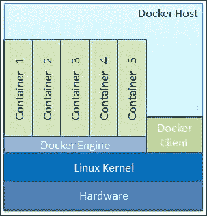
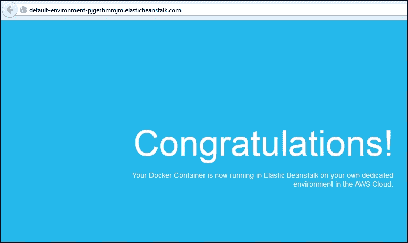

# 第一章：Docker 入门

如今，Docker 技术在全球范围内的信息技术（IT）专业人士中获得了更多的市场份额和更多的关注。在本章中，我们想更多地介绍 Docker，并展示为什么它被誉为即将到来的云 IT 时代的下一个最佳选择。为了使本书与软件工程师相关，我们列出了制作高度可用的应用程序感知容器所需的步骤，将它们注册到公共注册库中，然后在多个 IT 环境（本地和离地）中部署它们。在本书中，我们清楚地解释了 Docker 的先决条件和最重要的细节，借助我们通过一系列在不同系统中谨慎实施的几个有用的 Docker 容器所获得的所有教育和经验。为了做到这一点，我们使用了我们自己的笔记本电脑以及一些领先的公共云服务提供商（CSP）。

我们想向您介绍 Docker 实用方面，以改变游戏规则的 Docker 启发式容器化运动。

在本章中，我们将涵盖以下主题：

+   Docker 简介

+   Linux 上的 Docker

+   区分容器化和虚拟化

+   安装 Docker 引擎

+   了解 Docker 设置

+   下载第一个镜像

+   运行第一个容器

+   在 Amazon Web Services（AWS）上运行 Docker 容器

+   解决 Docker 容器的故障

# Docker 简介

由于其在行业垂直领域的广泛使用，IT 领域已经充斥着许多新的和开创性的技术，这些技术不仅用于带来更具决定性的自动化，而且还用于克服现有的复杂性。虚拟化已经设定了将 IT 基础设施优化和可移植性带入前景的目标。然而，虚拟化技术存在严重缺陷，例如由于虚拟机（VM）的笨重性质而导致的性能下降，应用程序可移植性的缺乏，IT 资源的提供速度缓慢等。因此，IT 行业一直在稳步地踏上 Docker 启发式容器化之旅。Docker 倡议专门设计了使容器化范式更易于理解和使用的目的。Docker 使容器化过程能够以无风险和加速的方式完成。

确切地说，**Docker**是一个开源的容器化引擎，它自动化打包、运输和部署任何呈现为轻量、便携和自给自足容器的软件应用程序，可以在几乎任何地方运行。

Docker **容器**是一个软件桶，包括运行软件所需的一切。单台机器上可以有多个 Docker 容器，这些容器彼此完全隔离，也与主机机器隔离。

换句话说，Docker 容器包括一个软件组件以及其所有依赖项（二进制文件、库、配置文件、脚本、jar 等）。因此，Docker 容器可以在支持命名空间、控制组和文件系统（如**另一个联合文件系统**（AUFS））的 x64 Linux 内核上流畅运行。然而，正如本章所示，对于在其他主流操作系统（如 Windows、Mac 等）上运行 Docker，有实用的解决方法。Docker 容器有自己的进程空间和网络接口。它也可以以 root 身份运行，并且有自己的`/sbin/init`，这可能与主机机器不同。

简而言之，Docker 解决方案让我们快速组装复合、企业规模和业务关键的应用程序。为了做到这一点，我们可以使用不同的分布式软件组件：容器消除了将代码发送到远程位置时出现的摩擦。Docker 还让我们能够尽快测试代码，然后在生产环境中部署它。Docker 解决方案主要包括以下组件：

+   Docker 引擎

+   Docker Hub

Docker 引擎用于实现特定目的和通用 Docker 容器。Docker Hub 是 Docker 镜像的快速增长的存储库，可以以不同方式组合，以产生公开可查找、网络可访问和广泛可用的容器。

# Linux 上的 Docker

假设我们想要直接在 Linux 机器上运行容器。Docker 引擎产生、监控和管理多个容器，如下图所示：

上图生动地说明了未来的 IT 系统将拥有数百个应用感知容器，这些容器天生具有促进其无缝集成和编排以获得模块化应用程序（业务、社交、移动、分析和嵌入式解决方案）的能力。这些包含的应用程序可以流畅地运行在融合、联合、虚拟化、共享、专用和自动化的基础设施上。

# 容器化和虚拟化的区别

从容器化范式中提取和阐述 Docker 启发的容器化运动的颠覆性优势是至关重要和至关重要的，这超过了广泛使用和完全成熟的虚拟化范式。在容器化范式中，通过一些关键和明确定义的合理化和计算资源的深刻共享，战略上合理的优化已经完成。一些天生的而迄今为止未充分利用的 Linux 内核功能已经被重新发现。这些功能因为带来了备受期待的自动化和加速而受到了奖励，这将使新兴的容器化理念在未来的日子里达到更高的高度，特别是在云时代。这些显著的商业和技术优势包括裸金属级性能、实时可伸缩性、更高的可用性等。所有不需要的凸起和赘肉都被明智地消除，以便以成本效益的方式加快数百个应用容器的部署速度，并缩短营销和估值所需的时间。左侧的下图描述了虚拟化方面，而右侧的图形生动地说明了容器中所实现的简化：

下表直接比较了虚拟机和容器：

| 虚拟机（VMs） | 容器 |
| --- | --- |
| 代表硬件级虚拟化 | 代表操作系统虚拟化 |
| 重量级 | 轻量级 |
| 缓慢的供应 | 实时供应和可伸缩性 |
| 有限的性能 | 本机性能 |
| 完全隔离，因此更安全 | 进程级隔离，因此不太安全 |

## 容器化和虚拟化的融合

正在开发一种混合模型，具有虚拟机和容器的特性。这就是系统容器的出现，如前述右侧图表所示。传统的虚拟化程序，隐式地代表硬件虚拟化，直接利用服务器硬件来保护环境。也就是说，虚拟机与其他虚拟机以及底层系统完全隔离。但对于容器来说，这种隔离是在进程级别进行的，因此容器容易受到任何安全侵入的影响。此外，一些在虚拟机中可用的重要功能在容器中是不可用的。例如，容器中没有对 SSH、TTY 和其他安全功能的支持。另一方面，虚拟机需要大量资源，因此它们的性能会大幅下降。事实上，在容器化术语中，经典虚拟化程序和客户操作系统的开销将被消除，以实现裸金属性能。因此，可以为单台机器提供一些虚拟机。因此，一方面，我们有性能一般的完全隔离的虚拟机，另一方面，我们有一些缺少一些关键功能但性能卓越的容器。在理解了随之而来的需求后，产品供应商正在研发系统容器。这一新举措的目标是提供具有裸金属服务器性能但具有虚拟机体验的完整系统容器。前述右侧图表中的系统容器代表了两个重要概念（虚拟化和容器化）的融合，以实现更智能的 IT。我们将在未来听到更多关于这种融合的信息。

## 容器化技术

认识到容器化范式对 IT 基础设施增强和加速的作用和相关性后，一些利用容器化理念的独特和决定性影响的技术应运而生，并被列举如下：

+   **LXC**（**Linux 容器**）：这是所有容器的鼻祖，它代表了在单个 Linux 机器上运行多个隔离的 Linux 系统（容器）的操作系统级虚拟化环境。

维基百科网站上的文章*LXC*指出：

> “Linux 内核提供了 cgroups 功能，允许对资源（CPU、内存、块 I/O、网络等）进行限制和优先级设置，而无需启动任何虚拟机，并提供了命名空间隔离功能，允许完全隔离应用程序对操作环境的视图，包括进程树、网络、用户 ID 和挂载的文件系统。”

您可以从[`en.wikipedia.org/wiki/LXC`](http://en.wikipedia.org/wiki/LXC)获取更多信息。

+   OpenVZ：这是一种基于 Linux 内核和操作系统的操作系统级虚拟化技术。OpenVZ 允许物理服务器运行多个隔离的操作系统实例，称为容器、虚拟专用服务器（VPS）或虚拟环境（VEs）。

+   FreeBSD 监狱：这是一种实现操作系统级虚拟化的机制，它允许管理员将基于 FreeBSD 的计算机系统分成几个独立的迷你系统，称为“监狱”。

+   AIX 工作负载分区（WPARs）：这些是操作系统级虚拟化技术的软件实现，提供应用环境隔离和资源控制。

+   Solaris 容器（包括 Solaris Zones）：这是针对 x86 和 SPARC 系统的操作系统级虚拟化技术的实现。Solaris 容器是由“区域”提供的系统资源控制和边界分离的组合。区域在单个操作系统实例内充当完全隔离的虚拟服务器。

在本书中，考虑到 Docker 的风靡和大规模采用，我们选择深入挖掘，详细讨论 Docker 平台，这是简化和优化容器化运动的一站式解决方案。

# 安装 Docker 引擎

Docker 引擎是建立在 Linux 内核之上的，并且广泛利用其功能。因此，目前 Docker 引擎只能直接在 Linux 操作系统发行版上运行。尽管如此，通过使用轻量级 Linux 虚拟机和适配器（如 Boot2Docker），Docker 引擎可以在 Mac 和 Microsoft Windows 操作系统上运行。由于 Docker 的迅猛增长，它现在被所有主要的 Linux 发行版打包，以便它们可以保留他们的忠实用户并吸引新用户。您可以使用相应的 Linux 发行版的打包工具来安装 Docker 引擎；例如，使用`apt-get`命令安装 Debian 和 Ubuntu，使用`yum`命令安装 RedHat、Fedora 和 CentOS。

### 注意

我们选择了*Ubuntu Trusty 14.04（LTS）（64 位）* Linux 发行版以供所有实际目的使用。

## 从 Ubuntu 软件包存储库安装

本节详细解释了从 Ubuntu 软件包存储库安装 Docker 引擎涉及的步骤。在撰写本书时，Ubuntu 存储库已经打包了 Docker 1.0.1，而最新版本的 Docker 是 1.5。我们强烈建议使用下一节中描述的任一方法安装 Docker 版本 1.5 或更高版本。

但是，如果出于任何原因您必须安装 Ubuntu 打包版本，请按照这里描述的步骤进行。

1.  安装 Ubuntu 打包版本的最佳做法是通过重新与 Ubuntu 软件包存储库同步开始安装过程。这一步将更新软件包存储库到最新发布的软件包，因此我们将确保始终使用此处显示的命令获取最新发布的版本：

[PRE0]

### 提示

**下载示例代码**

您可以从[`www.packtpub.com`](http://www.packtpub.com)的帐户下载您购买的所有 Packt Publishing 图书的示例代码文件。如果您在其他地方购买了本书，可以访问[`www.packtpub.com/support`](http://www.packtpub.com/support)并注册，文件将直接通过电子邮件发送给您。

1.  使用以下命令启动安装。此设置将安装 Docker 引擎以及一些支持文件，并立即启动`docker`服务：

[PRE1]

### 注意

Docker 软件包被称为`docker.io`，因为 Ubuntu 软件包的旧版本被称为`docker`。因此，所有名为`docker`的文件都被安装为`docker.io`。

例如`/usr/bin/docker.io`和`/etc/bash_completion.d/docker.io`。

1.  为了方便起见，你可以为`docker.io`创建一个名为`docker`的软链接。这将使你能够以`docker`而不是`docker.io`执行 Docker 命令。你可以使用以下命令来实现这一点：

[PRE2]

### 注意

官方的 Ubuntu 软件包不包含最新稳定版本的`docker`。

## 使用 docker.io 脚本安装最新的 Docker

官方发行版可能不会打包最新版本的 Docker。在这种情况下，你可以手动安装最新版本的 Docker，也可以使用 Docker 社区提供的自动化脚本。

要手动安装最新版本的 Docker，请按照以下步骤进行：

1.  将 Docker 发布工具的存储库路径添加到你的 APT 源中，如下所示：

[PRE3]

1.  通过运行以下命令导入 Docker 发布工具的公钥：

[PRE4]

1.  使用以下命令重新与软件包存储库同步：

[PRE5]

1.  安装`docker`，然后启动`docker`服务。

[PRE6]

### 注意

`lxc-docker`命令将使用名称`docker`安装 Docker 镜像。

Docker 社区通过隐藏这些细节在自动安装脚本中迈出了一步。该脚本使得在大多数流行的 Linux 发行版上安装 Docker 成为可能，可以通过`curl`命令或`wget`命令来实现，如下所示：

+   对于 curl 命令：

[PRE7]

+   对于 wget 命令：

[PRE8]

### 注意

前面的自动化脚本方法将 AUFS 作为底层 Docker 文件系统。该脚本探测 AUFS 驱动程序，如果在系统中找不到，则自动安装它。此外，它还在安装后进行一些基本测试以验证其完整性。

# 理解 Docker 设置

重要的是要了解 Docker 的组件及其版本、存储、执行驱动程序、文件位置等。顺便说一句，对于理解 Docker 设置的追求也将揭示安装是否成功。你可以通过使用两个`docker`子命令来实现这一点，即`docker version`和`docker info`。

让我们通过`docker version`子命令开始我们的`docker`之旅，如下所示：

[PRE9]

尽管`docker version`子命令列出了许多文本行，作为 Docker 用户，你应该知道以下输出行的含义：

+   客户端版本

+   客户端 API 版本

+   服务器版本

+   服务器 API 版本

在这里考虑的客户端和服务器版本分别为 1.5.0 和客户端 API 和服务器 API 版本 1.17。

如果我们分析`docker version`子命令的内部，它首先会列出本地存储的与客户端相关的信息。随后，它将通过 HTTP 向服务器发出 REST API 调用，以获取与服务器相关的详细信息。

让我们使用`docker info`子命令来了解更多关于 Docker 环境的信息：

[PRE10]

正如您在新安装的 Docker 引擎的输出中所看到的，`容器`和`镜像`的数量始终为零。`存储驱动程序`已设置为`aufs`，并且目录已设置为`/var/lib/docker/aufs`位置。`执行驱动程序`已设置为`本机`模式。此命令还列出了详细信息，如`内核版本`、`操作系统`、`CPU`数量、`总内存`和`名称`，即新的 Docker 主机名。

## 客户端服务器通信

在 Linux 安装中，Docker 通常通过使用 Unix 套接字(`/var/run/docker.sock`)进行服务器-客户端通信。Docker 还有一个 IANA 注册的端口，即`2375`。然而，出于安全原因，此端口默认情况下未启用。

# 下载第一个 Docker 镜像

成功安装了 Docker 引擎后，下一个逻辑步骤是从 Docker 注册表中下载镜像。Docker 注册表是一个应用程序存储库，其中托管了一系列应用程序，从基本的 Linux 镜像到高级应用程序不等。`docker pull`子命令用于从注册表下载任意数量的镜像。在本节中，我们将使用以下命令下载一个名为`busybox`的小型 Linux 版本的镜像：

[PRE11]

一旦镜像被下载，可以使用`docker images`子命令进行验证，如下所示：

[PRE12]

# 运行第一个 Docker 容器

现在，您可以启动您的第一个 Docker 容器。以基本的*Hello World!*应用程序开始是标准做法。在下面的示例中，我们将使用已经下载的`busybox`镜像来回显`Hello World!`，如下所示：

[PRE13]

很酷，不是吗？您已经在短时间内设置了您的第一个 Docker 容器。在上面的示例中，使用了`docker run`子命令来创建一个容器，并使用`echo`命令打印`Hello World!`。

# 在亚马逊网络服务上运行 Docker 容器

**亚马逊网络服务**（**AWS**）在 2014 年初宣布了 Docker 容器的可用性，作为其 Elastic Beanstalk 提供的一部分。在 2014 年底，他们改革了 Docker 部署，并为用户提供了以下选项来运行 Docker 容器：

+   亚马逊 EC2 容器服务（在撰写本书时仅处于**预览**模式）

+   通过使用亚马逊弹性豆服务进行 Docker 部署

亚马逊 EC2 容器服务允许您通过简单的 API 调用启动和停止容器启用的应用程序。AWS 引入了集群的概念，用于查看容器的状态。您可以从集中式服务查看任务，并且它为您提供了许多熟悉的亚马逊 EC2 功能，如安全组、EBS 卷和 IAM 角色。

请注意，此服务仍未在 AWS 控制台中可用。您需要在您的机器上安装 AWS CLI 来部署、运行和访问此服务。

AWS Elastic Beanstalk 服务支持以下内容：

+   使用控制台支持 Elastic Beanstalk 的单个容器。目前，它支持 PHP 和 Python 应用程序。

+   使用一个名为*eb*的命令行工具支持 Elastic Beanstalk 的单个容器。它支持相同的 PHP 和 Python 应用程序。

+   通过使用 Elastic Beanstalk 使用多个容器环境。

目前，AWS 支持最新的 Docker 版本，即 1.5。

本节提供了在运行在 AWS Elastic Beanstalk 上的 Docker 容器上部署示例应用程序的逐步过程。以下是部署的步骤：

1.  通过使用此[`console.aws.amazon.com/elasticbeanstalk/`](https://console.aws.amazon.com/elasticbeanstalk/) URL 登录到 AWS Elastic Beanstalk 控制台。

1.  选择要部署应用程序的区域，如下所示：

1.  选择下拉菜单中的**Docker**选项，然后点击**立即启动**。几分钟后，下一个屏幕将显示如下：

现在，点击旁边的 URL **Default-Environment (Default-Environment-pjgerbmmjm.elasticbeanstalk.com)**，如下所示：

# 故障排除

大多数情况下，安装 Docker 时不会遇到任何问题。然而，可能会发生意外故障。因此，有必要讨论突出的故障排除技术和技巧。让我们从本节讨论故障排除知识开始。第一个提示是使用以下命令检查 Docker 的运行状态：

[PRE14]

但是，如果 Docker 是通过 Ubuntu 软件包安装的，则必须使用`docker.io`作为服务名称。如果`docker`服务正在运行，则此命令将打印状态为`start/running`以及其进程 ID。

如果您在 Docker 设置中仍然遇到问题，那么您可以使用`/var/log/upstart/docker.log`文件打开 Docker 日志进行进一步调查。

# 总结

容器化将成为未来企业和云 IT 环境的主导和决定性范式，因为它具有迄今为止未曾预见的自动化和加速能力。有几种机制可以将容器化运动推向更高的高度。然而，在这场激烈的竞赛中，Docker 已经遥遥领先，并成功摧毁了先前阐明的障碍。

在本章中，我们专注于 Docker 的实际应用，为您提供学习最有前途的技术的起点。我们列出了在不同环境中轻松安装 Docker 引擎的适当步骤和技巧，以及利用和构建、安装和运行一些示例 Docker 容器的方法，无论是在本地还是远程环境中。我们将深入探讨 Docker 的世界，并深入挖掘，以在接下来的章节中与您分享战术和战略上的可靠信息。请继续阅读，以获取有关高级主题（如容器集成、编排、管理、治理、安全等）的所需知识，通过 Docker 引擎。我们还将讨论大量第三方工具。
