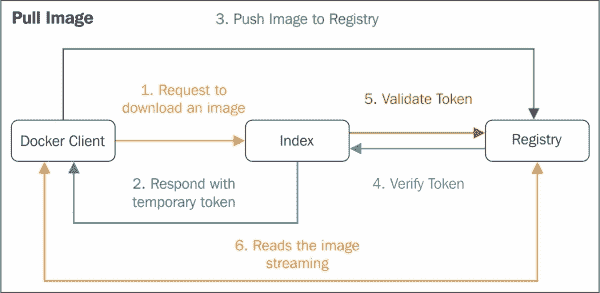

# 第五章：运行您的私有 Docker 基础设施

在第四章，*发布图像*中，我们讨论了 Docker 图像，并清楚地了解到 Docker 容器是 Docker 图像的运行时实现。如今，Docker 图像和容器数量众多，因为容器化范式已经席卷了 IT 领域。因此，全球企业有必要将他们的 Docker 图像保存在自己的私有基础设施中以考虑安全性。因此，部署 Docker Hub 到我们自己的基础设施的概念已经出现并发展。 Docker Hub 对于注册和存储不断增长的 Docker 图像至关重要和相关。主要，Docker Hub 专门用于集中和集中管理以下信息：

+   用户帐户

+   图像的校验和

+   公共命名空间

本章重点介绍了为您和 Docker 容器开发者提供所有相关信息，以便在自己的后院设计、填充和运行自己的私有 Docker Hub。本章涵盖了以下重要主题：

+   Docker 注册表和索引

+   Docker 注册表的用例

+   运行您自己的索引和注册表

+   将镜像推送到新创建的注册表

# Docker 注册表和索引

通常，Docker Hub 由 Docker 索引和注册表组成。 Docker 客户端可以通过网络连接和与 Docker Hub 交互。注册表具有以下特征：

+   它存储一组存储库的图像和图形

+   它没有用户帐户数据

+   它没有用户帐户或授权的概念

+   它将认证和授权委托给 Docker Hub 认证服务

+   它支持不同的存储后端（S3、云文件、本地文件系统等）

+   它没有本地数据库

+   它有与之关联的源代码

Docker 注册表的高级功能包括`bugsnag`、`new relic`和`cors`。`bugsnag`功能可检测和诊断应用程序中的崩溃，`new relic`封装了注册表并监视性能，`cors`可以启用以在我们自己的注册表域之外共享资源。建议您使用代理（如 nginx）将注册表部署到生产环境。您还可以直接在 Ubuntu 和基于 Red Hat Linux 的系统上运行 Docker 注册表。

目前，负责开发 Docker 平台的公司已在 GitHub 上发布了 Docker 注册表作为开源服务[`github.com/docker/docker-registry`](https://github.com/docker/docker-registry)。值得注意的是，Docker 索引只是一个建议，在撰写本书时，Docker 尚未发布任何开源项目。在本章中，我们将从 Docker 注册表的用例开始，然后从 GitHub 开始实际部署索引元素和 Docker 注册表。

# Docker 注册表用例

以下是 Docker 注册表的用例：

1.  拉取或下载图像

1.  推送图像

1.  删除图像

现在我们将详细介绍每个用例：

1.  **拉取或下载图像**：用户使用 Docker 客户端从索引请求图像，索引反过来向用户返回注册表详细信息。然后，Docker 客户端将直接请求注册表以获取所需的图像。注册表在内部使用索引对用户进行身份验证。如下图所示，图像拉取是通过客户端、索引和注册表模块的协作完成的：

1.  **推送图像**：用户请求推送图像，从索引获取注册表信息，然后直接将图像推送到注册表。注册表使用索引对用户进行身份验证，最后回应用户。控制流程如下图所示：

1.  **删除图像**：用户还可以请求从存储库中删除图像。

用户可以选择使用带有或不带有索引的注册表。在不带有索引的情况下使用注册表最适合存储私人图像。

# 运行自己的索引和注册表

在本节中，我们将执行以下步骤来运行自己的索引和注册表，并最终推送图像：

1.  从 GitHub 部署索引组件和注册表。

1.  配置 nginx 与 Docker 注册表。

1.  在 Web 服务器上设置 SSL 以进行安全通信。

## 第 1 步-从 GitHub 部署索引组件和注册表

索引组件包括`apache-utils`和`ngnix`，用于密码验证和 HTTPS 支持的 SSL 功能。用户必须注意，Docker 注册表的当前版本仅支持使用 HTTP 连接到注册表。因此，用户必须部署和使用**安全套接字层**（**SSL**）来保护数据。 SSL 在 Web 服务器和客户端的 Web 浏览器之间创建了加密连接，允许私人数据在没有窃听、数据篡改或消息伪造问题的情况下传输。这是使用广泛接受的 SSL 证书来保护数据的一种经过验证的方法。

Docker 注册表是一个 Python 应用程序，我们可以使用以下命令从[`github.com/docker/docker-registry`](https://github.com/docker/docker-registry)在本地 Ubuntu 机器上安装 Python：

[PRE0]

现在，安装 Docker 注册表：

[PRE1]

这将更新 Python 软件包中的 Docker 注册表，并更新以下路径中的配置文件：

[PRE2]

将`config_sample.yml`文件复制到`config.yml`：

[PRE3]

默认情况下，Docker 将其数据保存在`/tmp`目录中，这可能会导致问题，因为在许多 Linux 系统上，`/tmp`文件夹在重新启动时会被清除。让我们创建一个永久文件夹来存储我们的数据：

[PRE4]

让我们更新我们之前的`config.yml`文件，以适应以下两个位置的更新路径。第一个位置的更新代码如下：

[PRE5]

以下是第二个位置的代码：

[PRE6]

`config.yml`文件的其他默认配置正常工作。

现在，让我们使用`gunicorn`启动 Docker 注册表。 Gunicorn，也称为 Green Unicorn，是 Linux 系统的 Python **Web 服务器网关接口**（**WSGI**）HTTP 服务器：

[PRE7]

现在，Docker 注册表作为用户本地机器上的一个进程正在运行。

我们可以使用*Ctrl* + *C*来停止这个进程。

我们可以按以下方式启动 Linux 服务：

1.  为`docker-registry`工具创建一个目录：

[PRE8]

1.  创建并更新 Docker 注册表配置文件：

[PRE9]

1.  更新文件中的以下内容：

[PRE10]

1.  保存文件后，运行 Docker 注册表服务：

[PRE11]

1.  现在，使用`apache-utils`来保护此注册表，启用密码保护功能，如下所示：

[PRE12]

1.  用户创建登录 ID 和密码来访问 Docker 注册表：

[PRE13]

1.  在提示时输入新密码。此时，我们有登录 ID 和密码来访问 Docker 注册表。

## 第 2 步 - 配置 nginx 与 Docker 注册表

接下来，我们需要告诉 nginx 使用该认证文件（在上一节的第 6 步和第 7 步中创建）来转发请求到我们的 Docker 注册表。

我们需要创建 nginx 配置文件。为此，我们需要按照以下步骤进行：

1.  通过运行以下命令创建 ngnix 配置文件：

[PRE14]

使用以下内容更新文件：

[PRE15]

1.  创建软链接并重新启动 ngnix 服务：

[PRE16]

1.  让我们检查一切是否正常工作。运行以下命令，我们应该得到这个输出：

[PRE17]

太好了！现在我们的 Docker 注册表正在运行。现在，我们必须检查 nginx 是否按我们的预期工作。要做到这一点，请运行以下命令：

[PRE18]

这次，我们会收到一个未经授权的消息：

[PRE19]

使用之前创建的密码登录：

[PRE20]

这证实了您的 Docker 注册表受到密码保护。

## 第 3 步 - 在 Web 服务器上设置 SSL 以进行安全通信

这是在本地机器上设置 SSL 的最后一步，该机器托管了用于加密数据的 Web 服务器。我们创建以下文件：

[PRE21]

使用以下内容更新文件： 

[PRE22]

请注意，我的 Ubuntu 机器可以在 Internet 上使用名称`mydomain.com`，并且 SSL 已设置为证书和密钥的路径。

让我们按照以下方式签署证书：

[PRE23]

使用以下命令生成根密钥：

[PRE24]

现在我们有了根密钥，让我们生成一个根证书（在命令提示符处输入任何你想要的）：

[PRE25]

然后，为我们的服务器生成一个密钥：

[PRE26]

现在，我们必须创建一个证书签名请求。一旦我们运行签名命令，请确保“通用名称”是我们的服务器名称。这是强制性的，任何偏差都会导致错误：

[PRE27]

在这里，“通用名称”看起来像`mydomain.com`。这是在 AWS 上运行的 Ubuntu VM。

上述命令的输出如下：

[PRE28]

“挑战密码”输入为空，并且用户也可以自由填写。然后，我们需要通过运行以下命令签署证书请求：

[PRE29]

现在我们已经生成了证书所需的所有文件，我们需要将这些文件复制到正确的位置。

首先，将证书和密钥复制到 nginx 期望它们在的路径：

[PRE30]

请注意，我们已经创建了自签名证书，并且它们是由任何已知的证书颁发机构签名的，因此我们需要通知注册表这是一个合法的证书：

[PRE31]

让我们重新启动 nginx 以重新加载配置和 SSL 密钥：

[PRE32]

现在，我们将测试 SSL 证书，以检查它是否正常工作。由于`mydomain.com`不是互联网地址，请在`/etc/hosts`文件中添加条目：

[PRE33]

现在运行以下命令：

[PRE34]

因此，如果一切顺利，您应该会看到类似于这样的内容：

[PRE35]

# 将图像推送到新创建的 Docker 注册表

最后，将图像推送到 Docker 注册表。因此，让我们在本地 Ubuntu 机器上创建一个图像：

[PRE36]

让我们登录到在 Ubuntu 机器上本地创建的 Docker 注册表：

[PRE37]

在将图像推送到注册表之前对其进行标记：

[PRE38]

最后，使用`push`命令上传图像：

[PRE39]

现在，从本地磁盘中删除图像，并从 Docker 注册表中`pull`它：

[PRE40]

# 总结

Docker 引擎允许每个增值软件解决方案被容器化、索引化、注册化和存储化。Docker 正在成为一个系统化开发、发布、部署和在各处运行容器的强大工具。虽然`docker.io`允许您免费将 Docker 创建上传到他们的注册表，但您在那里上传的任何内容都是公开可发现和可访问的。创新者和公司对此并不感兴趣，因此坚持使用私人 Docker Hub。在本章中，我们以易于理解的方式为您解释了所有步骤、语法和语义。我们看到了如何检索图像以生成 Docker 容器，并描述了如何以安全的方式将我们的图像推送到 Docker 注册表，以便经过身份验证的开发人员找到并使用。认证和授权机制作为整个过程的重要部分，已经被详细解释。确切地说，本章被构想和具体化为设置自己的 Docker Hub 的指南。随着世界组织对容器化云表现出示范性兴趣，私人容器中心变得更加重要。

在下一章中，我们将深入探讨容器，这是从图像自然而然的发展。我们将演示在 Docker 容器中运行服务的能力，比如 Web 服务器，并展示它与主机和外部世界的交互。
