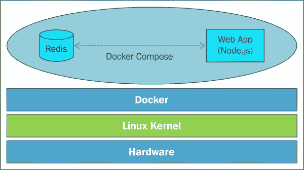

# 第八章：容器编排

在早期的章节中，我们为容器网络的需求奠定了坚实的基础，以及如何在 Docker 容器内运行服务，以及如何通过打开网络端口和其他先决条件来将此服务暴露给外部世界。然而，最近，已经提供了先进的机制，并且一些第三方编排平台进入市场，以明智地建立分布式和不同功能的容器之间的动态和决定性联系，以便为全面但紧凑地包含面向过程、多层和企业级分布式应用程序组合强大的容器。在这个极其多样化但相互连接的世界中，编排的概念不能长期远离其应有的突出地位。本章专门用于解释容器编排的细枝末节，以及它在挑选离散容器并系统地组合成更直接符合不同业务期望和迫切需求的复杂容器方面的直接作用。

在本章中，我们将讨论以下主题的相关细节：

+   链接容器

+   编排容器

+   使用`docker-compose`工具进行容器编排

随着关键任务的应用程序主要是通过松散耦合但高度内聚的组件/服务构建，旨在在地理分布的 IT 基础设施和平台上运行，组合的概念受到了很多关注和吸引力。为了维持良好的容器化旅程，容器的编排被认为是在即时、自适应和智能的 IT 时代中最关键和至关重要的要求之一。有一些经过验证和有前途的方法和符合标准的工具，可以实现神秘的编排目标。

# 链接容器

Docker 技术的一个显著特点之一是链接容器。也就是说，合作容器可以链接在一起，提供复杂和业务感知的服务。链接的容器具有一种源-接收关系，其中源容器链接到接收容器，并且接收容器安全地从源容器接收各种信息。但是，源容器对其链接的接收者一无所知。链接容器的另一个值得注意的特性是，在安全设置中，链接的容器可以使用安全隧道进行通信，而不会将用于设置的端口暴露给外部世界。

Docker 引擎在`docker run`子命令中提供了`--link`选项，以将源容器链接到接收容器。

`--link`选项的格式如下：

[PRE0]

在这里，`<container>`是源容器的名称，`<alias>`是接收容器看到的名称。容器的名称在 Docker 主机中必须是唯一的，而别名非常具体且局限于接收容器，因此别名不需要在 Docker 主机上是唯一的。这为在接收容器内部使用固定的源别名名称实现和整合功能提供了很大的灵活性。

当两个容器链接在一起时，Docker 引擎会自动向接收容器导出一些环境变量。这些环境变量具有明确定义的命名约定，其中变量始终以别名名称的大写形式作为前缀。例如，如果`src`是源容器的别名，则导出的环境变量将以`SRC_`开头。Docker 导出三类环境变量，如下所列：

1.  `名称`：这是环境变量的第一类。这个变量采用`<ALIAS>_NAME`的形式，并将接收容器的分层名称作为其值。例如，如果源容器的别名是`src`，接收容器的名称是`rec`，那么环境变量及其值将是`SRC_NAME=/rec/src`。

1.  `ENV`：这是环境变量的第二类。这些变量通过`docker run`子命令的`-e`选项或`Dockerfile`的`ENV`指令在源容器中配置的环境变量。这种类型的环境变量采用`<ALIAS>_ENV_<VAR_NAME>`的形式。例如，如果源容器的别名是`src`，变量名是`SAMPLE`，那么环境变量将是`SRC_ENV_SAMPLE`。

1.  `PORT`：这是最终的第三类环境变量，用于将源容器的连接详细信息导出给接收方。Docker 为源容器通过`docker run`子命令的`-p`选项或`Dockerfile`的`EXPOSE`指令暴露的每个端口创建一组变量。

这些变量采用以下形式：

[PRE1]

此形式用于共享源的 IP 地址、端口和协议作为 URL。例如，如果源容器的别名是`src`，暴露的端口是`8080`，协议是`tcp`，IP 地址是`172.17.0.2`，那么环境变量及其值将是`SRC_PORT_8080_TCP=tcp://172.17.0.2:8080`。此 URL 进一步分解为以下三个环境变量：

+   `<ALIAS>_PORT_<port>_<protocol>_ADDR`：此形式包含 URL 的 IP 地址部分（例如：`SRC_PORT_8080_TCP_ADDR= 172.17.0.2`）

+   `<ALIAS>_PORT_<port>_<protocol>_PORT`：此形式包含 URL 的端口部分（例如：`SRC_PORT_8080_TCP_PORT=8080`）

+   `<ALIAS>_PORT_<port>_<protocol>_PROTO`：此形式包含 URL 的协议部分（例如：`SRC_PORT_8080_TCP_PROTO=tcp`）

除了前述的环境变量之外，Docker 引擎还在此类别中导出了一个变量，即`<ALIAS>_PORT`的形式，其值将是源容器暴露的所有端口中最低的 URL。例如，如果源容器的别名是`src`，暴露的端口号是`7070`、`8080`和`80`，协议是`tcp`，IP 地址是`172.17.0.2`，那么环境变量及其值将是`SRC_PORT=tcp://172.17.0.2:80`。

Docker 以良好结构的格式导出这些自动生成的环境变量，以便可以轻松地通过程序发现。因此，接收容器可以很容易地发现有关源容器的信息。此外，Docker 会自动将源 IP 地址及其别名更新为接收容器的`/etc/hosts`文件中的条目。

在本章中，我们将通过一系列实用示例深入介绍 Docker 引擎提供的容器链接功能。

首先，让我们选择一个简单的容器链接示例。在这里，我们将向您展示如何在两个容器之间建立链接，并将一些基本信息从源容器传输到接收容器，如下所示的步骤：

1.  我们首先启动一个交互式容器，可以作为链接的源容器使用，使用以下命令：

[PRE2]

容器使用`--name`选项命名为`example`。此外，使用`--rm`选项在退出容器时清理容器。

1.  使用`cat`命令显示源容器的`/etc/hosts`条目：

[PRE3]

在这里，`/etc/hosts`文件中的第一个条目是源容器的 IP 地址（`172.17.0.3`）和其主机名（`a02895551686`）。

1.  我们将继续使用`env`命令显示源容器的环境变量：

[PRE4]

1.  启动源容器后，从相同 Docker 主机的另一个终端，让我们使用`docker run`子命令的`--link`选项启动一个交互式接收容器，将其链接到我们的源容器，如下所示：

[PRE5]

在这里，名为`example`的源容器与接收容器链接，其别名为`ex`。

1.  让我们使用`cat`命令显示接收容器的`/etc/hosts`文件的内容：

[PRE6]

当然，像往常一样，`/etc/hosts`文件的第一个条目是容器的 IP 地址和其主机名。然而，`/etc/hosts`文件中值得注意的条目是最后一个条目，其中源容器的 IP 地址（`172.17.0.3`）和其别名（`ex`）会自动添加。

1.  我们将继续使用`env`命令显示接收容器的环境变量：

[PRE7]

显然，一个新的`EX_NAME`环境变量会自动添加到`/berserk_mcclintock/ex`，作为其值。这里`EX`是别名`ex`的大写形式，`berserk_mcclintock`是接收容器的自动生成名称。

1.  最后一步，使用广泛使用的`ping`命令对源容器进行两次 ping，并使用别名作为 ping 地址：

[PRE8]

显然，源容器的别名`ex`被解析为 IP 地址`172.17.0.3`，并且接收容器能够成功到达源容器。在安全容器通信的情况下，容器之间是不允许 ping 的。我们在第十一章中对保护容器方面进行了更多详细说明，*保护 Docker 容器*。

在前面的示例中，我们可以将两个容器链接在一起，并且观察到源容器的 IP 地址如何优雅地更新到接收容器的`/etc/hosts`文件中，从而实现容器之间的网络连接。

下一个示例是演示容器链接如何导出源容器的环境变量，这些环境变量是使用`docker run`子命令的`-e`选项或`Dockerfile`的`ENV`指令配置的，然后导入到接收容器中。为此，我们将编写一个带有`ENV`指令的`Dockerfile`，构建一个镜像，使用该镜像启动一个源容器，然后通过链接到源容器来启动一个接收容器：

1.  我们首先编写一个带有`ENV`指令的`Dockerfile`，如下所示：

[PRE9]

在这里，我们设置了两个环境变量`BOOK`和`CHAPTER`。

1.  继续使用前面的`Dockerfile`从头构建一个名为`envex`的 Docker 镜像：

[PRE10]

1.  现在，让我们使用刚刚构建的`envex`镜像启动一个交互式源容器，名称为`example`：

[PRE11]

1.  从源容器提示符中，通过调用`env`命令显示所有环境变量：

[PRE12]

在所有前述的环境变量中，`BOOK`和`CHAPTER`变量都是使用`Dockerfile`的`ENV`指令配置的。

1.  最后一步，为了说明环境变量的`ENV`类别，启动接收容器并使用`env`命令，如下所示：

[PRE13]

### 注意

该示例也可以在 GitHub 上找到：[`github.com/thedocker/learning-docker/blob/master/chap08/Dockerfile-Env`](https://github.com/thedocker/learning-docker/blob/master/chap08/Dockerfile-Env)。

引人注目的是，在前面的输出中，以`EX_`为前缀的变量是容器链接的结果。感兴趣的环境变量是`EX_ENV_BOOK`和`EX_ENV_CHAPTER`，它们最初是通过`Dockerfile`设置为`BOOK`和`CHAPTER`，但由于容器链接而修改为`EX_ENV_BOOK`和`EX_ENV_CHAPTER`。尽管环境变量名称被翻译，但存储在这些环境变量中的值保持不变。我们在前面的示例中已经讨论了`EX_NAME`变量名。

在前面的示例中，我们可以体验到 Docker 如何优雅而轻松地将源容器中的`ENV`类别变量导出到接收容器中。这些环境变量与源和接收完全解耦，因此一个容器中这些环境变量值的更改不会影响另一个容器。更准确地说，接收容器接收的值是在启动源容器时设置的值。在源容器启动后对这些环境变量值进行的任何更改都不会影响接收容器。接收容器的启动时间并不重要，因为这些值是从 JSON 文件中读取的。

在我们最后的容器链接示例中，我们将向您展示如何利用 Docker 功能来共享两个容器之间的连接详细信息。为了共享容器之间的连接详细信息，Docker 使用环境变量的`PORT`类别。以下是用于创建两个容器并共享它们之间连接详细信息的步骤：

1.  编写一个`Dockerfile`，使用`EXPOSE`指令来公开端口`80`和`8080`，如下所示：

[PRE14]

1.  继续使用`docker build`子命令从刚刚创建的`Dockerfile`构建 Docker 镜像`portex`，运行以下命令：

[PRE15]

1.  现在，让我们使用之前构建的镜像`portex`启动一个名为`example`的交互式源容器：

[PRE16]

1.  现在我们已经启动了源容器，让我们继续在另一个终端上创建一个接收容器，并将其链接到源容器，然后调用`env`命令来显示所有环境变量，如下所示：

[PRE17]

### 注意

这个示例也可以在 GitHub 上找到：[`github.com/thedocker/learning-docker/blob/master/chap08/Dockerfile-Expose`](https://github.com/thedocker/learning-docker/blob/master/chap08/Dockerfile-Expose)。

从`env`命令的前面输出可以很明显地看出，Docker 引擎为每个使用`Dockerfile`中的`EXPOSE`指令暴露的端口导出了一组四个`PORT`类别的环境变量。此外，Docker 还导出了另一个`PORT`类别的变量`EX_PORT`。

# 容器的编排

IT 领域中编排的开创性概念已经存在很长时间了。例如，在**服务计算**（**SC**）领域，服务编排的概念以前所未有的方式蓬勃发展，以生产和维护高度健壮和有弹性的服务。离散或原子服务除非按特定顺序组合在一起以获得具有过程感知的复合服务，否则不会起到实质作用。由于编排服务在表达和展示企业独特能力方面更具战略优势，可以以可识别/可发现、可互操作、可用和可组合的服务形式向外界展示；企业对拥有一个易于搜索的服务库（原子和复合）表现出了极大的兴趣。反过来，这个库使企业能够实现大规模的数据和过程密集型应用。很明显，服务的多样性对于组织的增长和发展非常关键。这个日益受到强制要求的需求通过经过验证和有前途的编排能力得到了解决，具有认知能力。

现在，随着我们迅速向容器化的 IT 环境迈进；应用程序和数据容器应该被巧妙地组合起来，以实现一系列新一代软件服务。

然而，要生成高度有效的编排容器，需要精心选择并按正确顺序启动特定目的和不可知目的的容器，以创建编排容器。顺序可以来自过程（控制和数据）流程图。手动完成这一复杂而艰巨的活动引发了一系列怀疑和批评。幸运的是，在 Docker 领域有编排工具可以帮助构建、运行和管理多个容器，以构建企业级服务。Docker 公司负责生产和推广 Docker 启发的容器的生成和组装，推出了一种标准化和简化的编排工具（名为`docker-compose`），以减轻开发人员和系统管理员的工作负担。

服务计算范式的成熟组合技术正在这里复制到激烈的容器化范式中，以实现容器化最初设想的好处，特别是构建功能强大的应用程序感知容器。

微服务架构是一种旨在通过将其功能分解为一组离散服务的架构概念，以解耦软件解决方案的方法。这是通过在架构层面应用标准原则来实现的。微服务架构正在逐渐成为设计和构建大规模 IT 和业务系统的主导方式。它不仅有助于松散和轻量级耦合和软件模块化，而且对于敏捷世界的持续集成和部署也是一个福音。对应用程序的任何更改都意味着必须进行大规模的更改。这一直是持续部署方面的一大障碍。微服务旨在解决这种情况，因此，微服务架构需要轻量级机制、小型、可独立部署的服务，并确保可扩展性和可移植性。这些要求可以通过 Docker 赞助的容器来满足。

微服务是围绕业务能力构建的，并且可以通过完全自动化的部署机制独立部署。每个微服务都可以在不中断其他微服务的情况下部署，容器为这些服务提供了理想的部署和执行环境，以及其他值得注意的设施，如减少部署时间、隔离管理和简单的生命周期。在容器内快速部署新版本的服务非常容易。所有这些因素导致了使用 Docker 提供的功能爆炸般的微服务增长。

正如所解释的，Docker 被提出作为下一代容器化技术，它提供了一种经过验证且潜在有效的机制，以高效和分布式的方式分发应用程序。美妙之处在于开发人员可以在容器内调整应用程序的部分，同时保持容器的整体完整性。这对于当前的趋势有着更大的影响，即公司正在构建更小、自定义、易于管理和离散的服务，以包含在标准化和自动化的容器内，而不是托管在单个物理或虚拟服务器上的大型单片应用程序。简而言之，来自 Docker 的狂热容器化技术已成为即将到来的微服务时代的福音。

Docker 的建立和持续发展是为了实现“运行一次，到处运行”的难以捉摸的目标。Docker 容器通常在进程级别上进行隔离，在 IT 环境中可移植，并且易于重复。单个物理主机可以托管多个容器，因此，每个 IT 环境通常都充斥着各种 Docker 容器。容器的空前增长意味着有效的容器管理存在问题。容器的多样性和相关的异质性被用来大幅增加容器管理的复杂性。因此，编排技术和蓬勃发展的编排工具已成为加速容器化旅程的战略安慰，使其安全地前行。

编排跨越包含微服务的多个容器的应用程序已经成为 Docker 世界的一个重要部分，通过项目，如 Google 的 Kubernetes 或 Flocker。 Decking 是另一个选项，用于促进 Docker 容器的编排。 Docker 在这个领域的新提供是一套三个编排服务，旨在涵盖分布式应用程序的动态生命周期的所有方面，从应用程序开发到部署和维护。 Helios 是另一个 Docker 编排平台，用于在整个舰队中部署和管理容器。起初，`fig`是最受欢迎的容器编排工具。然而，在最近，处于提升 Docker 技术前沿的公司推出了一种先进的容器编排工具（`docker-compose`），以使开发人员在处理 Docker 容器时更加轻松，因为它们通过容器生命周期。

意识到对于下一代、业务关键和容器化工作负载具有容器编排能力的重要性后，Docker 公司收购了最初构想和具体化`fig`工具的公司。然后，Docker 公司适当地将该工具更名为`docker-compose`，并引入了大量增强功能，使该工具更加符合容器开发人员和运营团队的不断变化的期望。

这里是`docker-compose`的要点，它被定位为一种用于定义和运行复杂应用程序的未来和灵活的工具。使用`docker-compose`，您可以在单个文件中定义应用程序的组件（它们的容器、配置、链接、卷等），然后，您可以用一个命令启动所有内容，这样就可以使其运行起来。

这个工具通过提供一组内置工具来简化容器管理，以执行目前手动执行的许多工作。在本节中，我们提供了使用`docker-compose`执行容器编排的所有细节，以便拥有一系列下一代分布式应用程序。

## 使用 docker-compose 编排容器

在本节中，我们将讨论广泛使用的容器编排工具`docker-compose`。`docker-compose`工具是一个非常简单但功能强大的工具，旨在简化运行一组 Docker 容器。换句话说，`docker-compose`是一个编排框架，可以定义和控制多容器服务。

它使您能够创建一个快速和隔离的开发环境，以及在生产环境中编排多个 Docker 容器的能力。`docker-compose`工具在内部利用 Docker 引擎来拉取镜像、构建镜像、按正确顺序启动容器，并根据`docker-compose.yml`文件中给定的定义在容器/服务之间进行正确的连接/链接。

## 安装 docker-compose

在撰写本书时，最新版本的`docker-compose`是 1.2.0，建议您将其与 Docker 1.3 或更高版本一起使用。您可以在 GitHub 位置([`github.com/docker/compose/releases/latest`](https://github.com/docker/compose/releases/latest))找到最新的官方发布的`docker-compose`。

`docker-compose`版本 1.2.0 的 Linux x86-64 二进制文件可在[`github.com/docker/compose/releases/download/1.2.0/docker-compose-Linux-x86_64`](https://github.com/docker/compose/releases/download/1.2.0/docker-compose-Linux-x86_64)下载，您可以直接使用`wget`工具或`curl`工具进行安装，如下所示：

+   使用`wget`工具：

[PRE18]

+   使用`curl`工具：

[PRE19]

另外，`docker-compose`也作为一个 Python 包可用，您可以使用`pip`安装程序进行安装，如下所示：

[PRE20]

### 注意

请注意，如果系统上未安装`pip`，请在安装`docker-compose`之前安装`pip`包。

成功安装`docker-compose`后，您可以检查`docker-compose`的版本，如下所示：

[PRE21]

## docker-compose.yml 文件

`docker-compose`工具使用`docker-compose.yml`文件编排容器，在其中可以定义需要创建的服务、这些服务之间的关系以及它们的运行时属性。`docker-compose.yml`文件是**YAML Ain't Markup Language**（**YAML**）格式文件，这是一种人类友好的数据序列化格式。默认的`docker-compose`文件是`docker-compose.yml`，可以使用`docker-compose`工具的`-f`选项进行更改。以下是`docker-compose.yml`文件的格式：

[PRE22]

在这里，`<service>`是服务的名称。您可以在单个`docker-compose.yml`文件中有多个服务定义。服务名称后面应跟一个或多个键。但是，所有服务必须具有`image`或`build`键，后面可以跟任意数量的可选键。除了`image`和`build`键之外，其余的键可以直接映射到`docker run`子命令中的选项。值可以是单个值或多个值。

以下是`docker-compose`版本 1.2.0 中支持的键列表：

+   `image`：这是标签或镜像 ID

+   `build`：这是包含`Dockerfile`的目录路径

+   `command`：此键覆盖默认命令

+   `links`：此键链接到另一个服务中的容器

+   `external_links`：此键链接到由其他`docker-compose.yml`或其他方式（而不是`docker-compose`）启动的容器

+   `ports`：此键公开端口并指定端口`HOST_port:CONTAINER_port`

+   `expose`：此键公开端口，但不将其发布到主机

+   `volumes`：此键将路径挂载为卷

+   `volumes_from`：此键从另一个容器挂载所有卷

+   `environment`：此键添加环境变量，并使用数组或字典

+   `env_file`：此键将环境变量添加到文件

+   `extends`：这扩展了同一或不同配置文件中定义的另一个服务

+   `net`：这是网络模式，具有与 Docker 客户端`--net`选项相同的值

+   `pid`：这使主机和容器之间共享 PID 空间

+   `dns`：这设置自定义 DNS 服务器

+   `cap_add`：这会向容器添加一个功能

+   `cap_drop`：这会删除容器的某个功能

+   `dns_search`：这设置自定义 DNS 搜索服务器

+   `working_dir`：这会更改容器内的工作目录

+   `entrypoint`：这会覆盖默认的入口点

+   `用户`: 这设置默认用户

+   `主机名`: 这设置了容器的主机名

+   `域名`: 这设置域名

+   `mem_limit`: 这限制内存

+   `特权`: 这给予扩展权限

+   `重启`: 这设置容器的重启策略

+   `stdin_open`: 这启用标准输入设施

+   `tty`: 这启用基于文本的控制，如终端

+   `cpu_shares`: 这设置 CPU 份额(相对权重)

## docker-compose 命令

`docker-compose`工具提供了一些命令的复杂编排功能。所有`docker-compose`命令都使用`docker-compose.yml`文件作为一个或多个服务的编排基础。以下是`docker-compose`命令的语法:

[PRE23]

`docker-compose`工具支持以下选项:

+   `--verbose`: 这显示更多输出

+   `--版本`: 这打印版本并退出

+   `-f, --file <file>`: 这指定`docker-compose`的替代文件(默认为`docker-compose.yml`文件)

+   `-p`, `--project-name <name>`: 这指定替代项目名称(默认为目录名称)

`docker-compose`工具支持以下命令:

+   `构建`: 这构建或重建服务

+   `杀死`: 这杀死容器

+   `日志`: 这显示容器的输出

+   `端口`: 这打印端口绑定的公共端口

+   `ps`: 这列出容器

+   `拉取`: 这拉取服务镜像

+   `rm`: 这删除已停止的容器

+   `运行`: 这运行一次性命令

+   `规模`: 这为服务设置容器数量

+   `开始`: 这启动服务

+   `停止`: 这停止服务

+   `启动`: 这创建并启动容器

## 常见用法

在本节中，我们将通过一个示例来体验 Docker-Compose 框架提供的编排功能的威力。为此，我们将构建一个接收您输入的 URL 并以相关响应文本回复的两层 Web 应用程序。该应用程序使用以下两个服务构建，如下所列:

+   `Redis`: 这是一个用于存储键和其关联值的键值数据库

+   `Node.js`: 这是一个用于实现 Web 服务器功能和应用逻辑的 JavaScript 运行环境

这些服务中的每一个都打包在两个不同的容器中，这些容器使用`docker-compose`工具进行组合。以下是服务的架构表示:

在这个示例中，我们首先实现了`example.js`模块，这是一个`node.js`文件，用于实现 Web 服务器和键查找功能。接下来，我们将在与`example.js`相同的目录中编写`Dockerfile`，以打包`node.js`运行环境，然后使用与`example.js`相同的目录中的`docker-compose.yml`文件定义服务编排。

以下是`example.js`文件，它是一个简单的请求/响应 Web 应用程序的`node.js`实现。为了便于演示，在这段代码中，我们限制了`build`和`kill docker-compose`命令。为了使代码更加易懂，我们在代码之间添加了注释：

[PRE24]

### 注意

该示例也可在[`github.com/thedocker/learning-docker/tree/master/chap08/orchestrate-using-compose`](https://github.com/thedocker/learning-docker/tree/master/chap08/orchestrate-using-compose)找到。

以下文本是`Dockerfile`的内容，该文件打包了`node.js`镜像、`node.js`的`redis`驱动程序和之前定义的`example.js`文件：

[PRE25]

### 注意

此代码也可在[`github.com/thedocker/learning-docker/tree/master/chap08/orchestrate-using-compose`](https://github.com/thedocker/learning-docker/tree/master/chap08/orchestrate-using-compose)找到。

以下文本来自`docker-compose.yml`文件，该文件定义了`docker compose`工具要执行的服务编排：

[PRE26]

### 注意

该示例也可在[`github.com/thedocker/learning-docker/tree/master/chap08/orchestrate-using-compose`](https://github.com/thedocker/learning-docker/tree/master/chap08/orchestrate-using-compose)找到。

我们在这个`docker-compose.yml`文件中定义了两个服务，这些服务有以下用途：

+   名为`web`的服务是使用当前目录中的`Dockerfile`构建的。同时，它被指示通过运行 node（`node.js`运行时）并以`/myapp/example.js`（web 应用程序实现）作为参数来启动容器。该容器链接到`redis`容器，并且容器端口`80`映射到 Docker 主机的端口`8080`。

+   服务名为`redis`的服务被指示使用`redis:latest`镜像启动一个容器。如果该镜像不在 Docker 主机上，Docker 引擎将从中央仓库或私有仓库中拉取该镜像。

现在，让我们继续我们的示例，使用`docker-compose build`命令构建 Docker 镜像，使用`docker-compose up`命令启动容器，并使用浏览器连接以验证请求/响应功能，如下逐步解释：

1.  `docker-compose`命令必须从存储`docker-compose.yml`文件的目录中执行。`docker-compose`工具将每个`docker-compose.yml`文件视为一个项目，并且它假定项目名称来自`docker-compose.yml`文件的目录。当然，可以使用`-p`选项覆盖此设置。因此，作为第一步，让我们更改存储`docker-compose.yml`文件的目录：

[PRE27]

1.  使用`docker-compose build`命令构建服务：

[PRE28]

1.  按照`docker-compose.yml`文件中指示的服务启动服务，使用`docker-compose up`命令：

[PRE29]

由于目录名为`example`，`docker-compose`工具假定项目名称为`example`。

1.  成功使用`docker-compose`工具编排服务后，让我们从不同的终端调用`docker-compose ps`命令，以列出与示例`docker-compose`项目关联的容器：

[PRE30]

显然，两个`example_redis_1`和`example_web_1`容器正在运行。容器名称以`example_`为前缀，这是`docker-compose`项目名称。

1.  在 Docker 主机的不同终端上探索我们自己的请求/响应 Web 应用程序的功能，如下所示：

[PRE31]

### 注意

在这里，我们直接使用`http://0.0.0.0:8080`连接到 Web 服务，因为 Web 服务绑定到 Docker 主机的端口`8080`。

很酷，不是吗？凭借极少的努力和`docker-compose.yml`文件的帮助，我们能够将两个不同的服务组合在一起并提供一个复合服务。

# 总结

本章已纳入书中，以提供有关无缝编排多个容器的所有探查和指定细节。我们广泛讨论了容器编排的需求以及使我们能够简化和流畅进行容器编排日益复杂过程的工具。为了证实编排如何在打造企业级容器中方便和有用，并且为了说明编排过程，我们采用了通过一个简单的例子来解释整个范围的广泛做法。我们开发了一个网络应用并将其包含在一个标准容器中。同样，我们使用了一个数据库容器，它是前端网络应用的后端，并且数据库在另一个容器中执行。我们看到如何通过 Docker 引擎的容器链接功能，使用不同的技术使网络应用容器意识到数据库。我们使用了开源工具（`docker-compose`）来实现这一目的。

在下一章中，我们将讨论 Docker 如何促进软件测试，特别是通过一些实用的例子进行集成测试。
