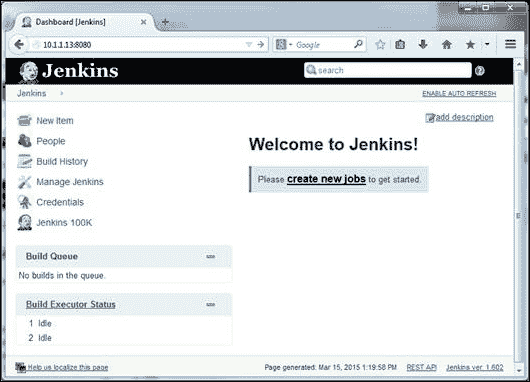
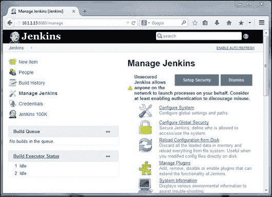
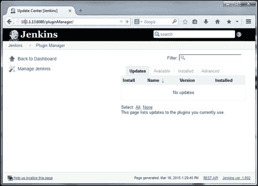
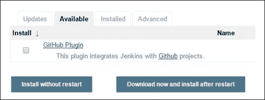
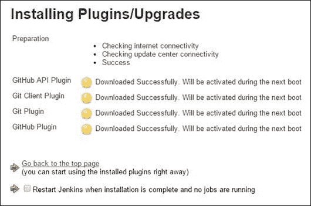
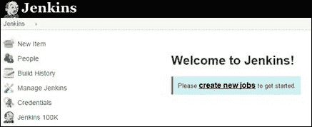
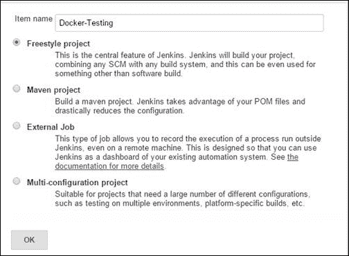
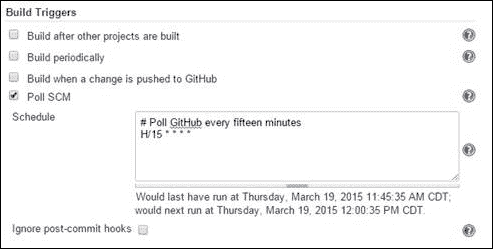
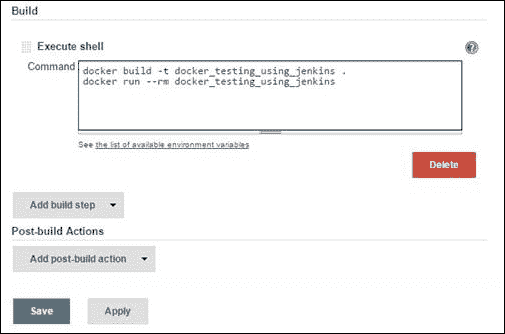
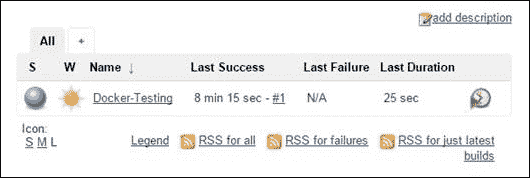

# 第九章：使用 Docker 进行测试

毫无疑问，测试的特征一直处于软件工程学科的前沿。人们普遍认为，如今软件已经深入并决定性地渗透到我们日常环境中的各种有形物体中，以便拥有大量智能、连接和数字化的资产。此外，随着对分布式和同步软件的高度关注，软件设计、开发、测试和调试、部署以及交付的复杂性不断攀升。正在发现手段和机制来简化和优化软件构建的必要自动化，以及对软件可靠性、弹性和可持续性的认证。Docker 正成为测试各种软件应用的极其灵活的工具。在本章中，我们将讨论如何有效地利用值得注意的 Docker 进展进行软件测试，以及它在加速和增强测试自动化方面的独特优势。

本章讨论以下主题：

+   测试驱动开发（TDD）的简要概述

+   在 Docker 中测试您的代码

+   将 Docker 测试过程集成到 Jenkins 中

新兴情况是，Docker 容器被利用来创建开发和测试环境，这些环境与生产环境完全相同。与虚拟机相比，容器需要更少的开销，虚拟机一直是开发、分级和部署环境的主要环境。让我们从下一代软件的测试驱动开发概述开始，以及 Docker 启发的容器化如何简化 TDD 过程。

# 测试驱动开发的简要概述

软件开发的漫长而艰难的旅程在过去的几十年里经历了许多转折，而其中一种突出的软件工程技术无疑是 TDD。关于 TDD 的更多细节和文档请参见[`agiledata.org/essays/tdd.html`](http://agiledata.org/essays/tdd.html)。

简而言之，测试驱动开发，也被称为 TDD，是一种软件开发实践，其中开发周期始于编写一个会失败的测试用例，然后编写实际的软件使测试通过，并继续重构和重复这个周期，直到软件达到可接受的水平。这个过程在下面的图表中描述了：

# 在 Docker 中测试您的代码

在本节中，我们将带您进行一次旅程，向您展示如何使用存根进行 TDD，并且 Docker 如何在开发软件中变得方便。为此，我们以一个具有跟踪每个用户访问次数功能的 Web 应用程序用例为例。在这个例子中，我们使用 Python 作为实现语言，`redis`作为键值对数据库来存储用户的点击次数。此外，为展示 Docker 的测试能力，我们将我们的实现限制在只有两个功能：`hit`和`getHit`。

### 注意

注意：本章中的所有示例都使用`python3`作为运行环境。`ubuntu 14.04`安装默认带有`python3`。如果您的系统上没有安装`python3`，请参考相应的手册安装`python3`。

根据 TDD 实践，我们首先为`hit`和`getHit`功能添加单元测试用例，如下面的代码片段所示。在这里，测试文件的名称为`test_hitcount.py`：

[PRE0]

### 注意

此示例也可在[`github.com/thedocker/testing/tree/master/src`](https://github.com/thedocker/testing/tree/master/src)找到。

在第一行中，我们导入了提供运行单元测试并生成详细报告的必要框架和功能的`unittest` Python 模块。在第二行中，我们导入了`hitcount` Python 模块，我们将在其中实现点击计数功能。然后，我们将继续添加测试代码，测试`hitcount`模块的功能。

现在，使用 Python 的单元测试框架运行测试套件，如下所示：

[PRE1]

以下是单元测试框架生成的输出：

[PRE2]

如预期的那样，测试失败并显示错误消息`ImportError: No module named 'hitcount'`，因为我们甚至还没有创建文件，因此无法导入`hitcount`模块。

现在，在与`test_hitcount.py`相同的目录中创建一个名为`hitcount.py`的文件：

[PRE3]

继续运行单元测试套件：

[PRE4]

以下是单元测试框架生成的输出：

[PRE5]

再次，测试套件失败，就像之前一样，但是出现了不同的错误消息`AttributeError: 'module' object has no attribute 'hit'`。我们之所以会得到这个错误，是因为我们还没有实现`hit`函数。

让我们继续在`hitcount.py`中实现`hit`和`getHit`函数，如下所示：

[PRE6]

### 注意

此示例也可在 GitHub 上找到[`github.com/thedocker/testing/tree/master/src`](https://github.com/thedocker/testing/tree/master/src)。

注意：要继续进行此示例，您必须具有与`pip3`兼容的`python3`版本的软件包安装程序。

以下命令用于安装`pip3`：

[PRE7]

在此程序的第一行中，我们导入了`redis`驱动程序，这是`redis`数据库的连接驱动程序。在接下来的一行中，我们将连接到`redis`数据库，然后我们将继续实现`hit`和`getHit`函数。

`redis`驱动程序是一个可选的 Python 模块，因此让我们继续使用 pip 安装程序安装`redis`驱动程序，如下所示：

[PRE8]

即使安装了`redis`驱动程序，我们的`unittest`仍然会失败，因为我们尚未运行`redis`数据库服务器。因此，我们可以运行`redis`数据库服务器以成功完成我们的单元测试，或者采用传统的 TDD 方法来模拟`redis`驱动程序。模拟是一种测试方法，其中复杂的行为被预定义或模拟的行为替代。在我们的示例中，为了模拟 redis 驱动程序，我们将利用一个名为 mockredis 的第三方 Python 包。这个模拟包可以在[`github.com/locationlabs/mockredis`](https://github.com/locationlabs/mockredis)找到，`pip`安装程序的名称是`mockredispy`。让我们使用 pip 安装这个模拟：

[PRE9]

安装了`mockredispy`，`redis`模拟器之后，让我们重构我们之前编写的测试代码`test_hitcount.py`，以使用`mockredis`模块提供的模拟`redis`功能。这是通过`unittest.mock`模拟框架提供的 patch 方法来实现的，如下面的代码所示：

[PRE10]

### 注意

此示例也可在 GitHub 上找到[`github.com/thedocker/testing/tree/master/src`](https://github.com/thedocker/testing/tree/master/src)。

现在，再次运行测试套件：

[PRE11]

最后，正如我们在前面的输出中所看到的，我们通过测试、代码和重构周期成功实现了访客计数功能。

## 在容器内运行测试

在上一节中，我们向您介绍了 TDD 的完整周期，其中我们安装了额外的 Python 包来完成我们的开发。然而，在现实世界中，一个人可能会在多个可能具有冲突库的项目上工作，因此需要对运行时环境进行隔离。在 Docker 技术出现之前，Python 社区通常使用`virtualenv`工具来隔离 Python 运行时环境。Docker 通过打包操作系统、Python 工具链和运行时环境将这种隔离推向了更高级别。这种类型的隔离为开发社区提供了很大的灵活性，可以根据项目需求使用适当的软件版本和库。

以下是将上一节的测试和访客计数实现打包到 Docker 容器中并在容器内执行测试的逐步过程：

1.  创建一个`Dockerfile`来构建一个带有`python3`运行时、`redis`和`mockredispy`包、`test_hitcount.py`测试文件和访客计数实现`hitcount.py`的镜像，最后启动单元测试：

[PRE12]

### 注意

此示例也可在 GitHub 上找到：[`github.com/thedocker/testing/tree/master/src`](https://github.com/thedocker/testing/tree/master/src)。

1.  现在在我们制作`Dockerfile`的目录中创建一个名为`src`的目录。将`test_hitcount.py`和`hitcount.py`文件移动到新创建的`src`目录中。

1.  使用`docker build`子命令构建`hit_unittest` Docker 镜像：

[PRE13]

1.  现在我们已经成功构建了镜像，让我们使用`docker run`子命令启动我们的容器，并使用单元测试包，如下所示：

[PRE14]

显然，单元测试成功运行且无错误，因为我们已经打包了被测试的代码。

在这种方法中，对于每次更改，都会构建 Docker 镜像，然后启动容器来完成测试。

## 使用 Docker 容器作为运行时环境

在上一节中，我们构建了一个 Docker 镜像来执行测试。特别是在 TDD 实践中，单元测试用例和代码经历多次更改。因此，需要反复构建 Docker 镜像，这是一项艰巨的工作。在本节中，我们将看到一种替代方法，即使用运行时环境构建 Docker 容器，将开发目录挂载为卷，并在容器内执行测试。

在 TDD 周期中，如果需要额外的库或更新现有库，那么容器将被更新为所需的库，并更新的容器将被提交为新的镜像。这种方法提供了任何开发人员梦寐以求的隔离和灵活性，因为运行时及其依赖项都存在于容器中，任何配置错误的运行时环境都可以被丢弃，并且可以从先前工作的镜像构建新的运行时环境。这也有助于保持 Docker 主机的清醒状态，避免安装和卸载库。

以下示例是关于如何将 Docker 容器用作非污染但非常强大的运行时环境的逐步说明：

1.  我们开始启动 Python 运行时交互式容器，使用`docker run`子命令：

[PRE15]

在这个例子中，`/home/peter/src/hitcount` Docker 主机目录被标记为源代码和测试文件的占位符。该目录在容器中被挂载为`/src`。

1.  现在，在 Docker 主机的另一个终端上，将`test_hitcount.py`测试文件和访客计数实现`hitcount.py`复制到`/home/peter/src/hitcount`目录中。

1.  切换到 Python 运行时交互式容器终端，将当前工作目录更改为`/src`，并运行单元测试：

[PRE16]

显然，测试失败是因为找不到`mockredis` Python 库。

1.  继续安装`mockredispy pip`包，因为前一步失败了，无法在运行时环境中找到`mockredis`库：

[PRE17]

1.  重新运行 Python 单元测试：

[PRE18]

再次，测试失败，因为尚未安装`redis`驱动程序。

1.  继续使用 pip 安装程序安装`redis`驱动程序，如下所示：

[PRE19]

1.  成功安装了`redis`驱动程序后，让我们再次运行单元测试：

[PRE20]

显然，这次单元测试通过了，没有警告或错误消息。

1.  现在我们有一个足够好的运行时环境来运行我们的测试用例。最好将这些更改提交到 Docker 镜像以便重用，使用`docker commit`子命令：

[PRE21]

从现在开始，我们可以使用`python_rediswithmock`镜像来启动新的容器进行 TDD。

在本节中，我们生动地阐述了如何将 Docker 容器作为测试环境的方法，同时通过在容器内隔离和限制运行时依赖项，保持 Docker 主机的完整性和纯洁性。

# 将 Docker 测试集成到 Jenkins 中

在上一节中，我们阐述了关于软件测试的激动人心的基础，如何利用 Docker 技术进行软件测试，以及在测试阶段容器技术的独特优势。在本节中，我们将介绍为了使用 Docker 准备 Jenkins 环境所需的步骤，然后演示如何扩展 Jenkins 以集成和自动化使用 Docker 进行测试，使用众所周知的点击计数用例。

## 准备 Jenkins 环境

在本节中，我们将带您完成安装`jenkins`、Jenkins 的 GitHub 插件和`git`以及修订控制工具的步骤。这些步骤如下：

1.  我们首先要添加 Jenkins 的受信任的 PGP 公钥：

[PRE22]

在这里，我们使用`wget`来下载 PGP 公钥，然后使用 apt-key 工具将其添加到受信任密钥列表中。由于 Ubuntu 和 Debian 共享相同的软件打包，Jenkins 为两者提供了一个通用的软件包。

1.  将 Debian 软件包位置添加到`apt`软件包源列表中，如下所示：

[PRE23]

1.  添加了软件包源后，继续运行`apt-get`命令更新选项，以重新同步来自源的软件包索引：

[PRE24]

1.  现在，使用`apt-get`命令安装选项来安装`jenkins`，如下所示：

[PRE25]

1.  最后，使用`service`命令激活`jenkins`服务：

[PRE26]

1.  `jenkins`服务可以通过任何 Web 浏览器访问，只需指定安装了 Jenkins 的系统的 IP 地址（`10.1.1.13`）。Jenkins 的默认端口号是`8080`。以下截图是**Jenkins**的入口页面或**仪表板**：

1.  在本例中，我们将使用 GitHub 作为源代码存储库。Jenkins 默认不支持 GitHub，因此需要安装 GitHub 插件。在安装过程中，有时 Jenkins 不会填充插件可用性列表，因此您必须强制它下载可用插件列表。您可以通过执行以下步骤来实现：

1.  在屏幕左侧选择**管理 Jenkins**，这将带我们到**管理 Jenkins**页面，如下面的屏幕截图所示：

1.  在**管理 Jenkins**页面上，选择**管理插件**，这将带我们到**插件管理器**页面，如下面的屏幕截图所示：

1.  在**插件管理器**页面上，选择**高级**选项卡，转到页面底部，您将在页面右下角找到**立即检查**按钮。单击**立即检查**按钮开始插件更新。或者，您可以通过导航到`http://<jenkins-server>:8080/pluginManager/advanced`直接转到**高级**页面上的**立即检查**按钮，其中`<jenkins-server>`是安装 Jenkins 的系统的 IP 地址。

### 注意

注意：如果 Jenkins 没有更新可用的插件列表，很可能是镜像站点的问题，因此使用有效的镜像 URL 修改**更新站点**字段。

1.  更新了可用插件列表后，让我们继续安装 GitHub 插件，如下面的子步骤所示：

1.  在**插件管理器**页面中选择**可用**选项卡，其中将列出所有可用的插件。

1.  输入`GitHub 插件`作为过滤器，这将只列出 GitHub 插件，如下面的屏幕截图所示：

1.  选择复选框，然后单击**立即下载并在重启后安装**。您将进入一个屏幕，显示插件安装的进度：

1.  在所有插件成功下载后，继续使用`http://< jenkins-server >:8080/restart`重新启动 Jenkins，其中`<jenkins-server>`是安装 Jenkins 的系统的 IP 地址。

1.  确保安装了`git`软件包，否则使用`apt-get`命令安装`git`软件包：

[PRE27]

1.  到目前为止，我们一直在使用`sudo`命令运行 Docker 客户端，但不幸的是，我们无法在 Jenkins 中调用`sudo`，因为有时它会提示输入密码。为了克服`sudo`密码提示问题，我们可以利用 Docker 组，任何属于 Docker 组的用户都可以在不使用`sudo`命令的情况下调用 Docker 客户端。Jenkins 安装总是设置一个名为`jenkins`的用户和组，并使用该用户和组运行 Jenkins 服务器。因此，我们只需要将`jenkins`用户添加到 Docker 组，即可使 Docker 客户端在不使用`sudo`命令的情况下工作：

[PRE28]

1.  重新启动`jenkins`服务，以使组更改生效，使用以下命令：

[PRE29]

我们已经设置了一个 Jenkins 环境，现在能够自动从[`github.com`](http://github.com)存储库中拉取最新的源代码，将其打包为 Docker 镜像，并执行规定的测试场景。

## 自动化 Docker 测试流程

在本节中，我们将探讨如何使用 Jenkins 和 Docker 自动化测试。如前所述，我们将使用 GitHub 作为我们的存储库。我们已经将我们之前示例的`Dockerfile`、`test_hitcount.py`和`hitcount.py`文件上传到 GitHub 上的[`github.com/thedocker/testing`](https://github.com/thedocker/testing)，我们将在接下来的示例中使用它们。但是，我们强烈建议您在[`github.com`](http://github.com)上设置自己的存储库，使用您可以在[`github.com/thedocker/testing`](https://github.com/thedocker/testing)找到的分支选项，并在接下来的示例中替换此地址。

以下是自动化 Docker 测试的详细步骤：

1.  配置 Jenkins 在 GitHub 存储库中的文件修改时触发构建，如下面的子步骤所示：

1.  再次连接到 Jenkins 服务器。

1.  选择**新项目**或**创建新作业**：

1.  在下一个截图中，为项目命名（例如`Docker-Testing`），并选择**自由风格项目**单选按钮：

1.  在下一个截图中，在**源代码管理**下选择**Git**单选按钮，并在**存储库 URL**文本字段中指定 GitHub 存储库 URL：

1.  在**构建触发器**下选择**轮询 SCM**，以便每`15`分钟间隔进行 GitHub 轮询。在**计划**文本框中输入以下代码`H/15 * * * *`，如下面的屏幕截图所示。为了测试目的，您可以缩短轮询间隔：

1.  向下滚动屏幕，然后在**构建**下选择**添加构建步骤**按钮。在下拉列表中，选择**执行 shell**并输入以下文本，如下面的屏幕截图所示：

1.  最后，通过点击**保存**按钮保存配置。

1.  返回 Jenkins 仪表板，您可以在仪表板上找到您的测试：

1.  您可以等待 Jenkins 计划启动构建，也可以点击屏幕右侧的时钟图标立即启动构建。一旦构建完成，仪表板将更新构建状态为成功或失败，并显示构建编号：

1.  如果将鼠标悬停在构建编号附近，将会出现一个下拉按钮，其中包括**更改**、**控制台输出**等选项，如下面的屏幕截图所示：

1.  **控制台输出**选项将显示构建的详细信息，如下所示：

[PRE30]

1.  显然，测试失败是因为错误的模块名**error_hitcount**，这是我们故意引入的。现在，让我们故意在**test_hitcount.py**中引入一个错误，观察对 Jenkins 构建的影响。由于我们已经配置了 Jenkins，它会忠实地轮询 GitHub 并启动构建：

显然，构建失败了，正如我们预期的那样。

1.  最后一步，打开失败构建的**控制台输出**：

[PRE31]

显然，测试失败是因为我们故意引入的错误模块名`error_hitcount`。

酷，不是吗？我们使用 Jenkins 和 Docker 自动化了我们的测试。此外，我们能够体验使用 Jenkins 和 Docker 进行测试自动化的力量。在大型项目中，Jenkins 和 Docker 可以结合在一起，自动化完成完整的单元测试需求，从而自动捕捉任何开发人员引入的缺陷和不足。

# 总结

集装箱化的潜在好处正在软件工程的广度和长度上被发现。以前，测试复杂的软件系统涉及许多昂贵且难以管理的服务器模块和集群。考虑到涉及的成本和复杂性，大多数软件测试是通过模拟程序和存根来完成的。随着 Docker 技术的成熟，所有这些都将永远结束。Docker 的开放性和灵活性使其能够与其他技术无缝地配合，从而大大减少测试时间和复杂性。

长期以来，测试软件系统的主要方法包括模拟、依赖注入等。通常，这些方法需要在代码中创建许多复杂的抽象。目前的做法是针对应用程序开发和运行测试用例实际上是在存根上进行，而不是在完整的应用程序上进行。也就是说，通过容器化工作流，很可能对具有所有依赖关系的真实应用程序容器进行测试。因此，Docker 范式的贡献，特别是对测试现象和阶段的贡献，近来正在被认真阐述和记录。确切地说，软件工程领域正在朝着 Docker 空间的所有创新迈进，迎来智能和更加晴朗的日子。

在本章中，我们清楚地阐述和解释了使用受 Docker 启发的容器化范式的集成应用程序的强大测试框架。对于敏捷世界来说，经过验证的 TDD 方法被坚持为高效的软件构建和维护方法。本章利用 Python 单元测试框架来说明 TDD 方法是软件工程的开创性工具。单元测试框架被调整为高效、优雅的容器化，并且 Docker 容器与 Jenkins 无缝集成，后者是持续交付的现代部署工具，并且是敏捷编程世界的重要组成部分，正如本章所描述的。Docker 容器源代码在进入 GitHub 代码存储库之前经过预检。Jenkins 工具从 GitHub 下载代码并在容器内运行测试。在下一章中，我们将深入探讨并描述容器技术和各种调试工具和技术的理论方面。
