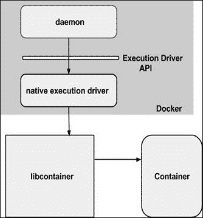

# 第十一章：保护 Docker 容器

到目前为止，我们在本书中已经谈了很多关于快速兴起的 Docker 技术。如果不详细阐述 Docker 特定的安全问题和解决方法，这本书就不会有一个完美的结局。因此，本章是专门为了向您详细解释 Docker 启发的容器的不断增长的安全挑战而精心制作和纳入本书的。我们还希望更多地阐明，通过一系列开创性技术、高质量算法、启用工具和最佳实践，如何解决悬而未决的安全问题。

在本章中，我们将详细讨论以下主题：

+   Docker 容器安全吗？

+   容器的安全特性

+   新兴的安全方法

+   容器安全的最佳实践

确保任何 IT 系统和业务服务的不可破坏和无法渗透的安全性，是 IT 领域数十年来的主要需求和主要挑战之一。聪明的头脑可以识别和利用在系统构思和具体化阶段被漫不经心和无意识引入的各种安全漏洞和缺陷。这个漏洞最终在 IT 服务交付过程中带来无数的违规和破坏。另一方面，安全专家和工程师尝试各种技巧和技术，以阻止黑客的邪恶行程。然而，到目前为止，这并不是一场彻底的胜利。在各个地方，都有一些来自未知来源的引人注目的入侵，导致高度令人不安的 IT 减速，有时甚至崩溃。因此，全球各个组织和政府正在大力投资于安全研究工作，以完全消灭所有与安全和安全相关的事件和事故。

为了最大程度地减少安全威胁和漏洞对 IT 系统造成的不可挽回和难以描述的后果，有大量专门的安全产品供应商和托管安全服务提供商。确切地说，对于任何现有和新兴的技术来说，安全性都是最关键和最重要的方面，不能轻视。

Docker 是 IT 领域快速成熟的容器化技术，最近，安全方面被赋予了首要重要性，考虑到 Docker 容器的采用和适应性不断上升。此外，一系列特定目的和通用容器正在进入生产环境，因此安全难题具有特殊意义。毫无疑问，未来 Docker 平台发布将会有很多关注安全参数的内容，因为这个开源 Docker 倡议的市场份额和思想份额一直在上升。

# Docker 容器安全吗？

随着 Docker 容器在生产 IT 环境中受到精心评估，不同领域对容器的安全漏洞提出了质疑。因此，有人呼吁研究人员和安全专家大力加强容器安全，以提高服务提供商和消费者的信心。在本节中，我们将描述 Docker 容器在安全方面的立场。由于容器正在与虚拟机同步进行密切审查，我们将从几个与虚拟机和容器相关的安全要点开始。

## 安全方面 - 虚拟机与 Docker 容器

让我们从理解虚拟机与容器的区别开始。通常，虚拟机是笨重的，因此臃肿，而容器是轻量级的，因此苗条而时尚。

以下表格概括了虚拟机和容器的著名特性：

| 虚拟机 | 容器 |
| --- | --- |
| 几个虚拟机可以在单个物理机上运行（低密度）。 | 几十个容器可以在单个物理或虚拟机上运行（高密度）。 |
| 这确保了虚拟机的完全隔离以确保安全。 | 这使得在进程级别进行隔离，并使用命名空间和 cgroups 等功能提供额外的隔离。 |
| 每个虚拟机都有自己的操作系统，物理资源由底层的 hypervisor 管理。 | 容器与其 Docker 主机共享相同的内核。 |
| 对于网络，虚拟机可以连接到虚拟或物理交换机。Hypervisors 具有用于 I/O 性能改进的缓冲区，NIC 绑定等。容器利用标准的 IPC 机制，如信号，管道，套接字等进行网络连接。每个容器都有自己的网络堆栈。 |

下图清楚地说明了成熟的虚拟化范式和快速发展的容器化理念之间的结构差异。

安全方面-虚拟机与 Docker 容器

关于 VM 和容器安全方面的辩论正在加剧。有人支持其中一种，也有人反对。前面的图表帮助我们可视化、比较和对比了两种范式中的安全影响。

在虚拟化范式中，hypervisors 是虚拟机的集中和核心控制器。对于新提供的虚拟机的任何访问都需要通过这个 hypervisor 解决方案，它是任何未经身份验证、未经授权和不道德目的的坚实墙。因此，与容器相比，虚拟机的攻击面更小。必须破解或攻破 hypervisor 才能影响其他虚拟机。

与虚拟化范式相比，容器直接放置在主机系统的内核之上。这种精简高效的架构大大提高了效率，因为它完全消除了 hypervisor 的仿真层，并且提供了更高的容器密度。然而，与虚拟机范式不同，容器范式没有太多的层，因此如果任何一个容器受到损害，就可以轻松地访问主机和其他容器。因此，与虚拟机相比，容器的攻击面更大。

然而，Docker 平台的设计者已经充分考虑了这种安全风险，并设计了系统来阻止大多数安全风险。在接下来的部分中，我们将讨论系统中固有设计的安全性，所提出的大幅增强容器安全性的解决方案，以及最佳实践和指南。

## 容器的安全特性

Linux 容器，特别是 Docker 容器，具有一些有趣的固有安全功能。因此，容器化运动在安全方面是受到了良好的保护。在本节中，我们将详细讨论这些与安全相关的功能。

Docker 平台提倡分层安全方法，以为容器带来更果断和灵巧的安全性，如下图所示：



讨论中，Docker 使用了一系列安全屏障来阻止入侵。也就是说，如果一个安全机制被破坏，其他机制会迅速阻止容器被黑客攻击。在评估 Docker 容器的安全影响时，有一些关键领域需要进行检查。

### 资源隔离

众所周知，容器被定位为微服务架构时代的产物。也就是说，在单个系统中，可以有多个通用的、以及特定目的的服务，它们动态地相互协作，实现易于维护的分布式应用程序。随着物理系统中服务的多样性和异构性不断增加，安全复杂性必然会上升。因此，资源需要明确定界并隔离，以避免任何危险的安全漏洞。被广泛接受的安全方法是利用命名空间的内核特性。

内核命名空间为 Linux 容器提供了必要的隔离功能。Docker 项目为 Docker 容器添加了一些额外的命名空间，容器的每个独立方面都在自己的命名空间中运行，因此无法在外部访问。以下是 Docker 使用的命名空间列表：

+   **PID 命名空间**：用于一系列操作，以实现进程级别的隔离

+   **网络命名空间**：用于对网络接口进行执行控制

+   **IPC 命名空间**：用于控制对 IPC 资源的访问

+   **挂载命名空间**：用于管理挂载点

+   **UTS 命名空间**：用于隔离内核和版本标识符

内核命名空间提供了首要的隔离形式。在一个容器中运行的进程不会影响在另一个容器或主机系统中运行的进程。网络命名空间确保每个容器都有自己的网络堆栈，从而限制对其他容器接口的访问。从网络架构的角度来看，给定 Docker 主机上的所有容器都位于桥接接口上。这意味着它们就像连接到共同以太网交换机的物理机器一样。

### 资源会计和控制

容器消耗不同的物理资源以提供其独特的功能。然而，资源消耗必须受到纪律、有序和严格的监管。一旦出现偏差，容器执行其分配的任务的可能性就会更大。例如，如果资源使用没有系统地同步，就会导致**拒绝服务**（DoS）攻击。

Linux 容器利用控制组（cgroups）来实现资源会计和审计，以便以无摩擦的方式运行应用程序。众所周知，有多种资源有助于成功运行容器。它们提供了许多有用的指标，并确保每个容器都能公平地分享内存、CPU 和磁盘 I/O。

此外，它们保证单个容器不能通过耗尽任何一个资源来使系统崩溃。这个特性有助于抵御一些 DoS 攻击。这个特性有助于在云环境中以多租户身份运行容器，以确保它们的正常运行和性能。任何其他容器的任何利用都会被及时识别和制止，以避免任何不良事件的发生。

## 根权限-影响和最佳实践

Docker 引擎通过利用最近提到的资源隔离和控制技术有效地保护容器免受任何恶意活动的影响。尽管如此，Docker 暴露了一些潜在的安全威胁，因为 Docker 守护程序以根权限运行。在这一部分，我们列出了一些安全风险和减轻它们的最佳实践。

### 受信任的用户控制

由于 Docker 守护程序以根权限运行，它有能力将 Docker 主机的任何目录挂载到容器中，而不限制任何访问权限。也就是说，您可以启动一个容器，其中`/host`目录将是主机上的`/`目录，容器将能够在没有任何限制的情况下修改您的主机文件系统。这只是恶意用途中的一个例子。考虑到这些活动，Docker 的后续版本限制了通过 Unix 套接字访问 Docker 守护程序的权限。如果您明确决定这样做，Docker 可以配置为通过 HTTP 上的 REST API 访问守护程序。但是，您应该确保它只能从受信任的网络或 VPN 访问，或者用 stunnel 和客户端 SSL 证书保护。您还可以使用 HTTPS 和证书来保护它们。

### 非根容器

如前所述，Docker 容器默认情况下以根权限运行，容器内运行的应用程序也是如此。从安全的角度来看，这是另一个重要问题，因为黑客可以通过入侵容器内运行的应用程序来获得对 Docker 主机的根访问权限。不要绝望，Docker 提供了一个简单而强大的解决方案，可以将容器的权限更改为非根用户，从而阻止对 Docker 主机的恶意根访问。可以使用`docker run`子命令的`-u`或`--user`选项，或者在`Dockerfile`中使用`USER`指令来实现将用户更改为非根用户。

在本节中，我们将通过展示 Docker 容器的默认根权限来演示这个概念，然后继续使用`Dockerfile`中的`USER`指令将根权限修改为非根用户。

首先，我们通过在`docker run`子命令中运行简单的`id`命令来演示 Docker 容器的默认根权限，如下所示：

```
**$ sudo docker run --rm ubuntu:14.04 id**
**uid=0(root) gid=0(root) groups=0(root)**

```

现在，让我们执行以下步骤：

1.  制作一个`Dockerfile`，创建一个非根权限用户，并将默认的根用户修改为新创建的非根权限用户，如下所示：

```
#######################################################
# Dockerfile to change from root to non-root privilege
#######################################################

# Base image is Ubuntu
FROM ubuntu:14.04

# Add a new user "peter" with user id 7373
RUN useradd -u 7373  peter

# Change to non-root privilege
USER peter
uid=0(root) gid=0(root) groups=0(root)
```

1.  继续使用`docker build`子命令构建 Docker 镜像，如下所示：

```
**$ sudo docker build –t nonrootimage .**

```

1.  最后，让我们使用`docker run`子命令中的`id`命令来验证容器的当前用户：

```
**$ sudo docker run --rm nonrootimage id**
**uid=7373(peter) gid=7373(peter) groups=7373(peter)**

```

显然，容器的用户、组和组现在已更改为非根用户。

将默认的根特权修改为非根特权是遏制恶意渗透进入 Docker 主机内核的一种非常有效的方法。

### 加载 Docker 镜像和安全影响

Docker 通常从网络中拉取镜像，这些镜像通常在源头进行筛选和验证。然而，为了备份和恢复，Docker 镜像可以使用`docker save`子命令保存，并使用`docker load`子命令加载回来。这种机制也可以用于通过非常规手段加载第三方镜像。不幸的是，在这种做法中，Docker 引擎无法验证源头，因此这些镜像可能携带恶意代码。因此，作为第一道安全屏障，Docker 在特权分离的 chrooted 子进程中提取镜像。即使 Docker 确保了特权分离，也不建议加载任意镜像。

### 新兴的安全方法

到目前为止，我们已经讨论了与安全相关的内核特性和能力。通过理解和应用这些内核能力，大多数安全漏洞可以得到关闭。安全专家和倡导者考虑到了容器化理念在生产环境中更快更广泛的采用，提出了一些额外的安全解决方案，我们将详细描述这些安全方法。在开发、部署和交付企业级容器时，开发人员和系统管理员需要极为重视这些安全方法，以消除任何内部或外部的安全攻击。

# 用于容器安全的安全增强型 Linux

安全增强型 Linux（SELinux）是清理 Linux 容器中的安全漏洞的一次勇敢尝试，它是 Linux 内核中强制访问控制（MAC）机制、多级安全（MLS）和多类别安全（MCS）的实现。一个名为 Virtproject 的新的协作倡议正在基于 SELinux 构建，并且正在与 Libvirt 集成，为虚拟机和容器提供一个可适应的 MAC 框架。这种新的架构为容器提供了一个安全的隔离和安全网，因为它主要阻止容器内的根进程与容器外运行的其他进程进行接口和干扰。Docker 容器会自动分配到 SELinux 策略中指定的 SELinux 上下文中。

在完全检查**自由裁量访问控制**（**DAC**）之后，SELinux 始终检查所有允许的操作。SELinux 可以根据定义的策略在 Linux 系统中的文件和进程以及它们的操作上建立和强制执行规则。根据 SELinux 规范，文件（包括目录和设备）被称为对象。同样，进程，比如运行命令的用户，被称为主体。大多数操作系统使用 DAC 系统来控制主体如何与对象和彼此交互。在操作系统上使用 DAC，用户可以控制自己对象的权限。例如，在 Linux 操作系统上，用户可以使他们的主目录可读，从而给用户和主体窃取潜在敏感信息的机会。然而，单独使用 DAC 并不是一个绝对安全的方法，DAC 访问决策仅基于用户身份和所有权。通常，DAC 简单地忽略其他安全启用参数，如用户的角色、功能、程序的可信度以及数据的敏感性和完整性。

由于每个用户通常对其文件拥有完全自由裁量权，确保系统范围的安全策略是困难的。此外，用户运行的每个程序都只是继承了用户被授予的所有权限，用户可以自由更改对他/她的文件的访问权限。所有这些都导致对恶意软件的最小保护。许多系统服务和特权程序以粗粒度权限运行，因此这些程序中的任何缺陷都可以轻松利用并扩展以获得对系统的灾难性访问。

正如在开头提到的，SELinux 将**强制访问控制**（**MAC**）添加到 Linux 内核中。这意味着对象的所有者对对象的访问没有控制或自由裁量权。内核强制执行 MAC，这是一种通用的 MAC 机制，它需要能够对系统中的所有进程和文件强制执行管理设置的安全策略。这些文件和进程将用于基于包含各种安全信息的标签做出决策。MAC 具有足够保护系统的固有能力。此外，MAC 确保应用程序安全，防止任何恶意入侵和篡改。MAC 还提供了强大的应用程序隔离，以便任何受攻击和受损的应用程序都可以独立运行。

接下来是**多类别安全**（**MCS**）。MCS 主要用于保护容器免受其他容器的影响。也就是说，任何受影响的容器都无法使同一 Docker 主机中的其他容器崩溃。MCS 基于多级安全（MLS）功能，并独特地利用 SELinux 标签的最后一个组件，*MLS 字段*。一般来说，当容器启动时，Docker 守护程序会选择一个随机的 MCS 标签。Docker 守护程序会使用该 MCS 标签为容器中的所有内容打上标签。

当守护程序启动容器进程时，它告诉内核使用相同的 MCS 标签为进程打标签。只要进程的 MCS 标签与文件系统内容的 MCS 标签匹配，内核就只允许容器进程读取/写入自己的内容。内核会阻止容器进程读取/写入使用不同 MCS 标签标记的内容。这样，被黑客入侵的容器进程就无法攻击其他容器。Docker 守护程序负责确保没有容器使用相同的 MCS 标签。通过巧妙地使用 MCS，禁止了容器之间的错误级联。

## 受 SELinux 启发的好处

SELinux 被定位为将绝对安全带给 Docker 容器的主要改进之一。很明显，SELinux 具有几个与安全相关的优势。由于 Docker 容器原生运行在 Linux 系统上，通过优雅的 SELinux 方法在 Linux 系统中进行的核心和关键改进也可以轻松地复制到 Docker 容器中。所有进程和文件都被标记为一种类型。一种类型能够定义和区分进程的域和文件的不同域。通过在它们自己的域中运行它们，进程彼此之间完全分离，对其他进程的任何侵入都受到严格监控并在萌芽阶段被制止。SELinux 赋予我们建立和执行策略规则的权力，以定义进程如何与文件和彼此交互。例如，只有在有明确阐述的 SELinux 策略允许所需和划定的访问时，才允许任何访问。确切地说，SELinux 在强制执行数据保密性和完整性方面非常方便。SELinux 还有助于保护进程免受不受信任的输入。它具有以下好处：

+   细粒度访问控制：SELinux 访问决策是基于考虑各种安全影响信息，比如 SELinux 用户、角色、类型和级别。SELinux 策略可以在系统级别进行管理定义、执行和实施。通过全面利用 SELinux 升级，用户在放宽和减轻安全和访问策略方面的自由裁量权完全被消除。

+   减少特权升级攻击的漏洞性：这些进程通常在域中运行，因此彼此之间干净地分离。SELinux 策略规则定义了进程如何访问文件和其他进程。也就是说，如果一个进程被有意或无意地破坏，攻击者只能访问该进程的标准功能和该进程被配置为访问的文件。例如，如果一个 Web 服务器被关闭，攻击者不能使用该进程来读取其他文件，除非特定的 SELinux 策略规则被纳入以允许这样的访问。

+   SELinux 中的进程分离：这些进程被安排在自己的域中运行，防止进程访问其他进程使用的文件，同时也防止进程访问其他进程。例如，在运行 SELinux 时，攻击者无法破坏服务器模块（例如 Samba 服务器），然后利用它作为攻击向量来读写其他进程使用的文件，比如后端数据库。SELinux 在大大限制了由不当配置错误造成的损害方面非常有用。域名系统（DNS）服务器经常在彼此之间复制信息，这被称为区域传输。攻击者可以使用区域传输来向 DNS 服务器更新虚假信息。SELinux 防止区域文件被任何黑客滥用。我们对 Docker 容器使用两种类型的 SELinux 执行。

+   类型强制：这保护主机免受容器内部的进程的影响。运行 Docker 容器的默认类型是`svirt_lxc_net_t`。所有容器进程都以这种类型运行，容器内的所有内容都标记有`svirt_sandbox_file_t`类型。`svirt_lxc_net_t`默认类型被允许管理任何标记为`svirt_sandbox_file_t`的内容。此外，`svirt_lxc_net_t`还能够读取/执行主机上`/usr`目录下的大多数标签。

+   **安全问题**：如果所有容器进程都以`svirt_lxc_net_t`运行，并且所有内容都标记为`svirt_sandbox_file_t`，则容器进程可能被允许攻击运行在其他容器中的进程和其他容器拥有的内容。这就是多类别安全（MCS）执行变得很有用的地方。

+   **多类别安全（MCS）**：这是对 SELinux 的一个实质性增强，允许用户为文件打上类别标签。这些类别实际上用于进一步限制**自主访问控制**（**DAC**）和**类型强制**（**TE**）逻辑。一个类别的例子是*公司机密*。只有有权访问该类别的用户才能访问带有该类别标签的文件，假设现有的 DAC 和 TE 规则也允许访问。术语*类别*指的是**多级安全**（**MLS**）中使用的非层次化类别。在 MLS 下，对象和主体被标记有安全级别。这些安全级别包括一个分层敏感值，比如*绝密*，以及零个或多个非层次化类别，比如*加密*。类别提供了敏感级别内的隔间，并强制实施需要知道的安全原则。MCS 是对 MLS 的一种改编，代表了一种政策变化。除了访问控制，MCS 还可以用于在打印页面的顶部和底部显示 MCS 类别。这可能还包括一张封面，以指示文件处理程序。

+   **AppArmor**：这是一个有效且易于使用的 Linux 应用程序安全系统。AppArmor 通过强制执行良好的行为并防止甚至未知的应用程序缺陷被利用，主动保护操作系统和应用程序免受任何外部或内部威胁，甚至零日攻击。AppArmor 安全策略完全定义了个别应用程序可以访问的系统资源以及权限。AppArmor 包含了许多默认策略，并且使用高级静态分析和基于学习的工具的组合，即使是非常复杂的应用程序，也可以在几小时内成功部署 AppArmor 策略。AppArmor 适用于支持它的系统上的 Docker 容器。AppArmor 提供企业级主机入侵防范，并保护操作系统和应用程序免受内部或外部攻击、恶意应用程序和病毒的有害影响。因此，企业可以保护关键数据，降低系统管理成本，并确保符合政府法规。全面的企业范围网络应用程序安全需要关注用户和应用程序。这是一个突出的选择，可为 Docker 容器和容器内的应用程序带来无法渗透的安全性。策略正在成为确保容器安全的强大机制。策略制定和自动执行策略在保证容器安全方面起着重要作用。

# 容器安全的最佳实践

有强大而有韧性的安全解决方案，可以增强服务提供者和用户对容器化旅程的信心，以及对其有清晰和敏捷的态度。在本节中，我们提供了许多提示、最佳实践和关键指南，这些来自不同来源，旨在使安全管理员和顾问能够严密地保护 Docker 容器。基本上，如果容器在多租户系统中运行，并且您没有使用经过验证的安全实践，那么安全前方肯定存在着明显的危险。如前所述，安全漏洞可能发生在不同的服务级别，因此安全架构师需要弄清楚可能出现的问题，并规定经过验证和开创性的安全保护方法。安全领域的先驱和权威建议采用以下易于理解和遵循的做法，以实现最初设想的容器益处：

+   摒弃特权访问

+   尽量以非 root 用户身份运行您的容器和服务

首要建议是不要在系统上运行随机和未经测试的 Docker 镜像。制定策略，利用受信任的 Docker 镜像和容器存储库来订阅和使用应用程序和数据容器，用于应用程序开发、打包、装运、部署和交付。从过去的经验来看，从公共领域下载的任何不受信任的容器可能会导致恶意和混乱的情况。Linux 发行版，如**Red Hat Enterprise Linux**（**RHEL**），已经采取了以下机制，以帮助管理员确保最高的安全性：

+   一个可信赖的软件存储库可供下载和使用

+   安全更新和补丁来修复漏洞

+   一个安全响应团队来查找和管理漏洞

+   一个工程团队来管理/维护软件包并致力于安全增强

+   常见标准认证来检查操作系统的安全性

如前所述，最大的问题是并非所有 Linux 都有命名空间。目前，Docker 使用五个命名空间来改变进程对系统的视图——进程、网络、挂载、主机名和共享内存。虽然这些给用户一定程度的安全性，但绝不像 KVM 那样全面。在 KVM 环境中，虚拟机中的进程不直接与主机内核通信。它们无法访问内核文件系统。设备节点可以与虚拟机内核通信，但不能与主机通信。因此，为了从虚拟机中提升权限，进程必须破坏虚拟机内核，找到超级监视器中的漏洞，突破 SELinux 控制（sVirt），并攻击主机内核。在容器环境中，方法是保护主机免受容器内进程的影响，并保护容器免受其他容器的影响。这就是将多个安全控制组合或聚合在一起，以保护容器及其内容。

基本上，我们希望尽可能设置多个安全屏障，以防止任何形式的突破。如果特权进程能够突破一个封闭机制，那么就要用层次结构中的下一个屏障来阻止它们。使用 Docker，可以尽可能利用 Linux 的多个安全机制。

以下是可能采取的安全措施：

+   文件系统保护：为了避免任何未经授权的写入，文件系统需要是只读的。也就是说，特权容器进程不能向其写入，也不会影响主机系统。一般来说，大多数应用程序不需要向其文件系统写入任何内容。有几个 Linux 发行版使用只读文件系统。因此，可以阻止特权容器进程重新挂载文件系统为读写模式。这就是阻止容器内挂载任何文件系统的能力。

+   **写时复制文件系统**：Docker 一直在使用**高级多层统一文件系统**（**AuFS**）作为容器的文件系统。AuFS 是一个分层文件系统，可以透明地覆盖一个或多个现有的文件系统。当一个进程需要修改一个文件时，AuFS 首先创建该文件的副本，并能够将多个层合并成一个文件系统的单一表示。这个过程称为写时复制，这可以防止一个容器看到另一个容器的更改，即使它们写入相同的文件系统镜像。一个容器不能改变镜像内容以影响另一个容器中的进程。

+   **功能的选择**：通常有两种方法来执行权限检查：特权进程和非特权进程。特权进程可以绕过所有类型的内核权限检查，而非特权进程则根据进程的凭据进行完整的权限检查。最近的 Linux 内核将传统上与超级用户相关联的特权划分为称为功能的不同单元，这些功能可以独立启用和禁用。功能是每个线程的属性。删除功能可以在 Docker 容器中带来几个积极的变化。无论如何，功能决定了 Docker 的功能、可访问性、可用性、安全性等等。因此，在增加或删除功能的过程中需要仔细考虑。

+   **保持系统和数据的安全**：在企业和服务提供商在生产环境中使用容器之前，需要解决一些安全问题。出于以下三个原因，容器化最终将使得更容易保护应用程序：

+   较小的有效负载减少了安全漏洞的表面积

+   可以更新操作系统而不是逐步打补丁

+   通过允许明确的关注分离，容器有助于 IT 和应用团队有目的地合作。

IT 部门负责基础设施相关的安全漏洞。应用团队修复容器内部的缺陷，也负责运行时依赖关系。缓解 IT 和应用开发团队之间的紧张关系有助于平稳过渡到混合云模型。每个团队的责任都清晰地划分，以确保容器及其运行时基础设施的安全。通过这样清晰的分工，积极地识别任何可见和不可见的危害安全的事件，并及时消除，制定和执行策略，精确和完美的配置，利用适当的安全发现和缓解工具等，都在系统地完成。

+   **利用 Linux 内核功能**：一个普通的服务器（裸机或虚拟机）需要以 root 身份运行一堆进程。这些通常包括`ssh`、`cron`、`syslogd`、硬件管理工具（例如加载模块）、网络配置工具（例如处理 DHCP、WPA 或 VPN）等。容器非常不同，因为几乎所有这些任务都由容器所托管和运行的基础设施处理。安全专家撰写的各种博客上有一些最有趣和鼓舞人心的安全相关细节的最佳实践、关键指南、技术知识等。您可以在[`docs.docker.com/articles/security/`](https://docs.docker.com/articles/security/)找到一些最有趣和鼓舞人心的安全相关细节。

# 数字签名验证

Docker，这家知名的开源容器公司，宣布已将数字签名验证添加到 Docker 镜像中。这将确保当您从官方 Docker 仓库下载一个容器化应用时，您得到的是真实版本。此时，Docker 引擎会自动使用数字签名检查官方仓库中所有镜像的来源和完整性。数字签名为 Docker 镜像带来了额外的信任。也就是说，特定的 Docker 镜像没有被篡改或扭曲，因此可以放心和清晰地完全使用。

这种新添加的加密验证用于为用户提供额外的安全保证。将来，将会有一些功能，比如发布者认证、镜像完整性和授权、公钥基础设施（PKI）管理等，供镜像发布者和消费者使用。如果官方镜像被损坏或篡改，Docker 将立即发出警告。目前，Docker 引擎不会阻止任何受影响的镜像运行，非官方镜像也不会被验证。随着 Docker 社区加固代码并解决不可避免的可用性问题，未来版本将会改变这一点。

在开发应用程序时，有时需要在其运行时查看它。最近出现了一些工具，如`nsinit`和`nsenter`，以帮助开发人员调试其容器化的应用程序。一些用户已经开始运行一个 init 进程，以在他们的应用程序中生成`sshd`，以允许他们访问，这会带来风险和开销。

## Docker 的安全部署指南

Docker 容器越来越多地托管在生产环境中，可以被公开发现和被许多人使用。特别是随着云技术的更快采用，全球组织和机构的 IT 环境正在被系统地优化和转变，以灵活和果断地托管更多种类的虚拟机和容器。有一些新的改进和功能，比如 Flocker 和 Clocker，可以加快将容器部署到云环境（私有、公共、混合和社区）的过程。在部署容器时必须遵循一些建议。众所周知，容器通过允许开发人员和系统管理员无缝部署应用程序和服务，显著减少了开销。然而，由于 Docker 利用与主机系统相同的内核来减少资源需求，如果配置不足，容器可能面临重大安全风险。在部署容器时，开发人员和系统管理员必须严格遵循一些仔细注释的指南。例如，[`github.com/GDSSecurity/Docker-Secure-Deployment-Guidelines`](https://github.com/GDSSecurity/Docker-Secure-Deployment-Guidelines)以表格形式详细阐述了所有正确的细节。

毫无疑问，分布式和复杂应用程序中的软件缺陷为智能攻击者和黑客打开了入侵托管关键、机密和客户数据的系统的大门。因此，安全解决方案被坚持并融入到 IT 堆栈的所有层中，因此在不同级别和层次上出现了许多类型的安全漏洞。例如，周界安全只解决了部分问题，因为不断变化的要求要求允许员工、客户和合作伙伴访问网络。同样，还有防火墙、入侵检测和预防系统、应用交付控制器（ADC）、访问控制、多因素身份验证和授权、打补丁等。然后，为了在传输、持久性和应用程序使用数据时保护数据，有加密、隐写术和混合安全模型。所有这些都是反应性和现实的机制，但趋势增长的是虚拟业务坚持采用积极主动的安全方法。随着 IT 趋向和趋势向着备受期待的虚拟 IT 世界发展，安全问题和影响正在受到安全专家的额外重视。

## 未来

在未来的日子里，容器化领域将会有更多值得注意的即兴创新、转型和颠覆。通过一系列创新和整合，Docker 平台正在被定位为加强容器化旅程的领先平台。以下是通过巧妙利用 Docker 技术取得的主要成就：

+   **加强分布式范式**：随着计算越来越分布和联合，微服务架构（MSA）将在 IT 中发挥非常决定性和更深层次的作用。Docker 容器正日益成为托管和交付日益增长的微服务数组的最有效方式。随着容器编排技术和工具获得更广泛的认可，微服务（特定的和通用的）被识别、匹配、编排和编排，形成业务感知的复合服务。

+   **赋能云范式**：云理念正在牢牢抓住 IT 世界，以实现迫切需要的 IT 基础设施合理化、简化、标准化、自动化和优化。抽象和虚拟化概念是云范式取得空前成功的关键，正在渗透到各种 IT 模块中。最初，它始于服务器虚拟化，现在已经涉及存储和网络虚拟化。随着我们周围所有技术的进步，人们普遍渴望实现软件定义基础设施（软件定义计算、存储和网络）。Docker 引擎，作为 Docker 平台的核心和关键部分，已经得到充分巩固，以使容器在软件定义环境中无障碍地运行。

+   **实现 IT 弹性、可移植性、敏捷性和适应性**：容器正逐渐成为灵活和未来化的 IT 构建模块，为实现更强韧性、多功能性、优雅和柔韧性做出贡献。更快速地提供 IT 资源以确保更高的可用性和实时可伸缩性，轻松消除开发和运营团队之间的各种摩擦，保证 IT 的原生性能，实现组织化和优化的 IT 以提高 IT 生产力等，这些都是对 Docker 容器的一些典型设想，以实现更智能的 IT。

### 注意

容器将成为虚拟机（VM）和裸金属服务器的战略补充，以实现更深层次的 IT 自动化、加速和增强，从而实现备受炒作和期望的业务敏捷性、自主性和可负担性。

# 摘要

安全性绝对是一个挑战，也是一个重要的方面，不容忽视。如果一个容器被 compromise，那么让容器主机垮掉就不是一件困难的事情。因此，确保容器和主机的安全对于容器化概念的蓬勃发展至关重要，特别是在 IT 系统的集中化和联邦化日益增长的情况下。在本章中，我们特别关注了 Docker 容器的令人作呕和毁灭性的安全问题，并解释了为容纳动态、企业级和关键任务应用程序的容器提供无懈可击的安全解决方案的方法和手段。在未来的日子里，将会有新的安全方法和解决方案，以确保 Docker 容器和主机的安全无法被渗透和破坏，因为容器及其内容的安全对于服务提供商和消费者来说至关重要。
