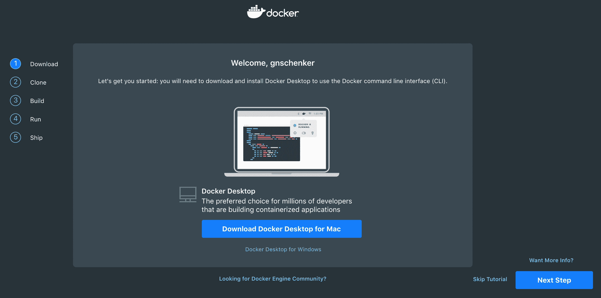
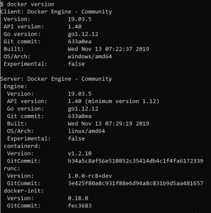
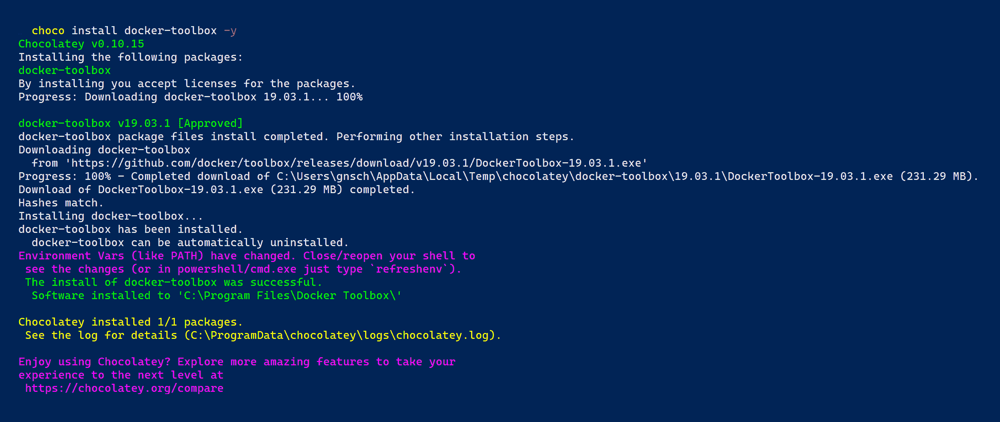
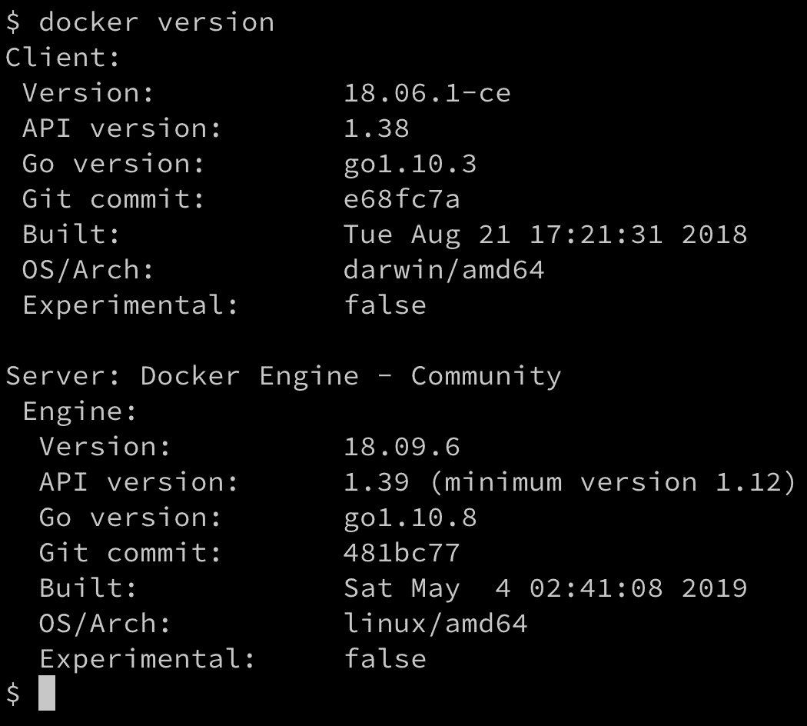
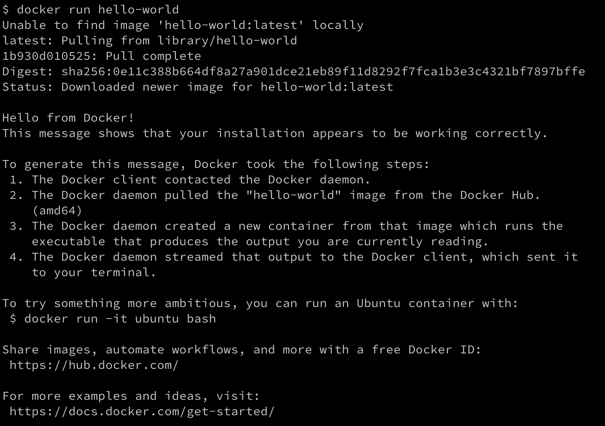

# 第二章：设置工作环境

在上一章中，我们了解了 Docker 容器是什么，以及它们为什么重要。我们了解了容器在现代软件供应链中解决了哪些问题。

在这一章中，我们将准备我们的个人或工作环境，以便与 Docker 高效有效地工作。我们将详细讨论如何为开发人员、DevOps 和运维人员设置一个理想的环境，用于使用 Docker 容器时的工作。

本章涵盖以下主题：

+   Linux 命令 shell

+   Windows 的 PowerShell

+   安装和使用软件包管理器

+   安装 Git 并克隆代码存储库

+   选择并安装代码编辑器

+   在 macOS 或 Windows 上安装 Docker 桌面版

+   安装 Docker 工具箱

+   安装 Minikube

# 技术要求

对于本章，您将需要一台装有 macOS 或 Windows 的笔记本电脑或工作站，最好是安装了 Windows 10 专业版。您还应该有免费的互联网访问权限来下载应用程序，并且有权限在您的笔记本电脑上安装这些应用程序。

如果您的操作系统是 Linux 发行版，如 Ubuntu 18.04 或更新版本，也可以按照本书进行。我会尽量指出命令和示例与 macOS 或 Windows 上的命令有明显不同的地方。

# Linux 命令 shell

Docker 容器最初是在 Linux 上为 Linux 开发的。因此，用于与 Docker 一起工作的主要命令行工具，也称为 shell，是 Unix shell；请记住，Linux 源自 Unix。大多数开发人员使用 Bash shell。在一些轻量级的 Linux 发行版中，如 Alpine，Bash 未安装，因此必须使用更简单的 Bourne shell，简称为*sh*。每当我们在 Linux 环境中工作，比如在容器内或 Linux 虚拟机上，我们将使用`/bin/bash`或`/bin/sh`，具体取决于它们的可用性。

虽然苹果的 macOS X 不是 Linux 操作系统，但 Linux 和 macOS X 都是 Unix 的变种，因此支持相同的工具集。其中包括 shell。因此，在 macOS 上工作时，您可能会使用 Bash shell。

在本书中，我们期望您熟悉 Bash 和 PowerShell 中最基本的脚本命令。如果您是一个绝对的初学者，我们强烈建议您熟悉以下备忘单：

+   *Linux 命令行速查表*，作者是 Dave Child，网址是[`bit.ly/2mTQr8l`](http://bit.ly/2mTQr8l)

+   *PowerShell 基础速查表*，网址是[`bit.ly/2EPHxze`](http://bit.ly/2EPHxze)

# Windows 的 PowerShell

在 Windows 计算机、笔记本电脑或服务器上，我们有多个命令行工具可用。最熟悉的是命令行。几十年来，它一直可用于任何 Windows 计算机。它是一个非常简单的 shell。对于更高级的脚本编写，微软开发了 PowerShell。PowerShell 非常强大，在 Windows 上的工程师中非常受欢迎。最后，在 Windows 10 上，我们有所谓的*Windows 子系统用于 Linux*，它允许我们使用任何 Linux 工具，比如 Bash 或 Bourne shell。除此之外，还有其他工具可以在 Windows 上安装 Bash shell，例如 Git Bash shell。在本书中，所有命令都将使用 Bash 语法。大多数命令也可以在 PowerShell 中运行。

因此，我们建议您使用 PowerShell 或任何其他 Bash 工具来在 Windows 上使用 Docker。

# 使用软件包管理器

在 macOS 或 Windows 笔记本上安装软件的最简单方法是使用一个好的软件包管理器。在 macOS 上，大多数人使用 Homebrew，在 Windows 上，Chocolatey 是一个不错的选择。如果你使用的是像 Ubuntu 这样的基于 Debian 的 Linux 发行版，那么大多数人选择的软件包管理器是默认安装的`apt`。

# 在 macOS 上安装 Homebrew

Homebrew 是 macOS 上最流行的软件包管理器，易于使用且非常多功能。在 macOS 上安装 Homebrew 很简单；只需按照[`brew.sh/`](https://brew.sh/)上的说明操作即可：

1.  简而言之，打开一个新的终端窗口并执行以下命令来安装 Homebrew：

```
$ /usr/bin/ruby -e "$(curl -fsSL https://raw.githubusercontent.com/Homebrew/install/master/install)"
```

1.  安装完成后，通过在终端中输入`brew --version`来测试 Homebrew 是否正常工作。你应该会看到类似这样的内容：

```
$ brew --version
Homebrew 2.1.4
Homebrew/homebrew-core (git revision 77d1b; last commit 2019-06-07)
```

1.  现在，我们准备使用 Homebrew 来安装工具和实用程序。例如，如果我们想要安装 Vi 文本编辑器，可以这样做：

```
$ brew install vim
```

这将为您下载并安装编辑器。

# 在 Windows 上安装 Chocolatey

Chocolatey 是 Windows 上基于 PowerShell 的流行软件包管理器。要安装 Chocolatey 软件包管理器，请按照[`chocolatey.org/`](https://chocolatey.org/)上的说明操作，或者以管理员模式打开一个新的 PowerShell 窗口并执行以下命令：

```
PS> Set-ExecutionPolicy Bypass -Scope Process -Force; iex ((New-Object System.Net.WebClient).DownloadString('https://chocolatey.org/install.ps1'))
```

重要的是要以管理员身份运行上述命令，否则安装将不会成功。

1.  一旦安装了 Chocolatey，请使用`choco --version`命令进行测试。你应该看到类似以下的输出：

```
PS> choco --version
0.10.15
```

1.  要安装一个应用程序，比如 Vi 编辑器，使用以下命令：

```
PS> choco install -y vim
```

`-y`参数确保安装过程不需要再次确认。

请注意，一旦 Chocolatey 安装了一个应用程序，你需要打开一个新的 PowerShell 窗口来使用该应用程序。

# 安装 Git

我们正在使用 Git 从其 GitHub 存储库中克隆伴随本书的示例代码。如果你的计算机上已经安装了 Git，你可以跳过这一部分：

1.  要在 macOS 上安装 Git，请在终端窗口中使用以下命令：

```
$ choco install git
```

1.  要在 Windows 上安装 Git，请打开 PowerShell 窗口并使用 Chocolatey 进行安装：

```
PS> choco install git -y
```

1.  最后，在你的 Debian 或 Ubuntu 机器上，打开一个 Bash 控制台并执行以下命令：

```
$ sudo apt update && sudo apt install -y git
```

1.  安装完 Git 后，验证它是否正常工作。在所有平台上，使用以下命令：

```
$ git --version
```

这应该输出类似以下内容的东西：

```
git version 2.16.3
```

1.  现在 Git 正常工作了，我们可以从 GitHub 上克隆伴随本书的源代码。执行以下命令：

```
$ cd ~
$ git clone https://github.com/PacktPublishing/Learn-Docker---Fundamentals-of-Docker-19.x-Second-Edition fod-solution
```

这将把主分支的内容克隆到你的本地文件夹`~/fod-solution`中。现在这个文件夹将包含我们在本书中一起做的所有实验的示例解决方案。如果遇到困难，请参考这些示例解决方案。

现在我们已经安装了基础知识，让我们继续使用代码编辑器。

# 选择一个代码编辑器

使用一个好的代码编辑器对于高效地使用 Docker 是至关重要的。当然，哪个编辑器是最好的是非常有争议的，取决于个人偏好。很多人使用 Vim，或者其他一些编辑器，比如 Emacs，Atom，Sublime，或者 Visual Studio Code（VS Code），只是举几个例子。VS Code 是一个完全免费且轻量级的编辑器，但它非常强大，并且适用于 macOS，Windows 和 Linux。根据 Stack Overflow 的数据，它目前是迄今为止最受欢迎的代码编辑器。如果你还没有决定使用其他编辑器，我强烈建议你试试 VS Code。

但是，如果您已经有一个喜欢的代码编辑器，请继续使用它。只要您可以编辑文本文件，就可以继续前进。如果您的编辑器支持 Dockerfiles 和 JSON 和 YAML 文件的语法高亮显示，那就更好了。唯一的例外将是[第六章]（b6647803-2c5c-4b9d-9a4a-a836ac356329.xhtml），*在容器中运行的代码调试*。该章节中呈现的示例将大量定制为 VS Code。

# 在 macOS 上安装 VS Code

按照以下步骤进行安装：

1.  打开一个新的终端窗口并执行以下命令：

```
$ brew cask install visual-studio-code
```

1.  一旦 VS Code 安装成功，转到您的主目录（`~`）并创建一个名为`fundamentals-of-docker`的文件夹；然后进入这个新文件夹：

```
$ mkdir ~/fundamentals-of-docker && cd ~/fundamentals-of-docker
```

1.  现在从这个文件夹中打开 VS Code：

```
$ code .
```

不要忘记前面命令中的句号（.）。VS 将启动并打开当前文件夹（`~/fundamentals-of-docker`）作为工作文件夹。

# 在 Windows 上安装 VS Code

按照以下步骤进行安装：

1.  以管理员模式打开一个新的 PowerShell 窗口并执行以下命令：

```
PS> choco install vscode -y
```

1.  关闭您的 PowerShell 窗口并打开一个新窗口，以确保 VS Code 在您的路径中。

1.  现在转到您的主目录并创建一个名为`fundamentals-of-docker`的文件夹；然后进入这个新文件夹：

```
PS> mkdir ~\fundamentals-of-docker; cd ~\fundamentals-of-docker
```

1.  最后，从这个文件夹中打开 Visual Studio Code：

```
PS> code .
```

不要忘记前面命令中的句号（.）。VS 将启动并打开当前文件夹（`~\fundamentals-of-docker`）作为工作文件夹。

# 在 Linux 上安装 VS Code

按照以下步骤进行安装：

1.  在您的 Debian 或基于 Ubuntu 的 Linux 机器上，打开 Bash 终端并执行以下语句以安装 VS Code：

```
$ sudo snap install --classic code
```

1.  如果您使用的是不基于 Debian 或 Ubuntu 的 Linux 发行版，请按照以下链接获取更多详细信息：[`code.visualstudio.com/docs/setup/linux`](https://code.visualstudio.com/docs/setup/linux)

1.  一旦 VS Code 安装成功，转到您的主目录（`~`）并创建一个名为`fundamentals-of-docker`的文件夹；然后进入这个新文件夹：

```
$ mkdir ~/fundamentals-of-docker && cd ~/fundamentals-of-docker
```

1.  现在从这个文件夹中打开 Visual Studio Code：

```
$ code .
```

不要忘记前面命令中的句号（.）。VS 将启动并打开当前文件夹（`~/fundamentals-of-docker`）作为工作文件夹。

# 安装 VS Code 扩展

扩展是使 VS Code 成为如此多才多艺的编辑器的原因。在 macOS、Windows 和 Linux 三个平台上，您可以以相同的方式安装 VS Code 扩展：

1.  打开 Bash 控制台（或 Windows 中的 PowerShell），并执行以下一组命令，以安装我们将在本书中的示例中使用的最基本的扩展：

```
code --install-extension vscjava.vscode-java-pack
code --install-extension ms-vscode.csharp
code --install-extension ms-python.python
code --install-extension ms-azuretools.vscode-docker
code --install-extension eamodio.gitlens
```

我们正在安装一些扩展，使我们能够更加高效地使用 Java、C#、.NET 和 Python。我们还安装了一个扩展，用于增强我们与 Docker 的体验。

1.  在成功安装了上述扩展之后，重新启动 VS Code 以激活这些扩展。现在您可以点击 VS Code 左侧活动面板上的扩展图标，查看所有已安装的扩展。

接下来，让我们安装 Docker 桌面版。

# 安装 Docker 桌面版

如果您使用的是 macOS，或者在笔记本电脑上安装了 Windows 10 专业版，则我们强烈建议您安装 Docker 桌面版。这个平台在使用容器时会给您最好的体验。

目前，Docker 桌面版不支持 Linux。有关更多详细信息，请参阅*在 Linux 上安装 Docker CE*部分。请注意，旧版本的 Windows 或 Windows 10 家庭版无法运行 Docker for Windows。Docker for Windows 使用 Hyper-V 在虚拟机中透明地运行容器，但是 Hyper-V 在旧版本的 Windows 上不可用；在 Windows 10 家庭版中也不可用。在这种情况下，我们建议您使用 Docker Toolbox，我们将在下一节中描述。按照以下步骤进行操作：

1.  无论您使用什么操作系统，都可以导航到 Docker 的起始页面[`www.docker.com/get-started`](https://www.docker.com/get-started)。

1.  在加载的页面右侧，您会找到一个大大的蓝色按钮，上面写着 Download Desktop and Take a Tutorial。点击这个按钮并按照说明进行操作。您将被重定向到 Docker Hub。如果您还没有 Docker Hub 账户，请创建一个。这是完全免费的，但您需要一个账户来下载软件。否则，只需登录即可。

1.  一旦您登录，注意页面上的以下内容：


在 Docker Hub 上下载 Docker 桌面版

1.  点击蓝色的 Download Docker Desktop 按钮。然后您应该会看到以下屏幕：



在 macOS 上下载 Docker 桌面版的屏幕提示请注意，如果您使用的是 Windows PC，蓝色按钮将会显示为 Download Docker Desktop for Windows。

# 在 macOS 上安装 Docker 桌面版

按照以下步骤进行安装：

1.  安装成功 Docker 桌面版后，请打开终端窗口并执行以下命令：

```
$ docker version
```

您应该看到类似于这样的东西：



Docker 桌面版的 Docker 版本

1.  要查看是否可以运行容器，请在终端窗口中输入以下命令并按 Enter 键：

```
$ docker run hello-world
```

如果一切顺利，您的输出应该看起来类似于以下内容：


在 macOS 上的 Docker 桌面版上运行 Hello-World

接下来，我们将在 Windows 上安装 Docker。

# 在 Windows 上安装 Docker 桌面版

按照以下步骤进行安装：

1.  安装成功 Docker 桌面版后，请打开 PowerShell 窗口并执行以下命令：

```
PS> docker --version
Docker version 19.03.5, build 633a0ea
```

1.  要查看是否可以运行容器，请在 PowerShell 窗口中输入以下命令并按 Enter 键：

```
PS> docker run hello-world
```

如果一切顺利，您的输出应该与前面的图像类似。

# 在 Linux 上安装 Docker CE

如前所述，Docker 桌面版仅适用于 macOS 和 Windows 10 专业版。如果您使用的是 Linux 机器，则可以使用 Docker 社区版（CE），其中包括 Docker 引擎以及一些附加工具，如 Docker 命令行界面（CLI）和 docker-compose。

请按照以下链接中的说明安装特定 Linux 发行版（在本例中为 Ubuntu）的 Docker CE：[`docs.docker.com/install/linux/docker-ce/ubuntu/`](https://docs.docker.com/install/linux/docker-ce/ubuntu/)。

# 安装 Docker Toolbox

Docker Toolbox 已经为开发人员提供了几年。它是 Docker 桌面版等新工具的前身。Toolbox 允许用户在任何 macOS 或 Windows 计算机上非常优雅地使用容器。容器必须在 Linux 主机上运行。Windows 和 macOS 都无法本地运行容器。因此，我们需要在笔记本电脑上运行 Linux 虚拟机，然后在其中运行容器。Docker Toolbox 在笔记本电脑上安装 VirtualBox，用于运行我们需要的 Linux 虚拟机。

作为 Windows 用户，您可能已经意识到有所谓的 Windows 容器可以在 Windows 上本地运行，这一点您是正确的。微软已经将 Docker Engine 移植到了 Windows，并且可以在 Windows Server 2016 或更新版本上直接运行 Windows 容器，无需虚拟机。所以，现在我们有两种容器，Linux 容器和 Windows 容器。前者只能在 Linux 主机上运行，后者只能在 Windows 服务器上运行。在本书中，我们专门讨论 Linux 容器，但我们学到的大部分东西也适用于 Windows 容器。

如果您对 Windows 容器感兴趣，我们强烈推荐阅读《Docker on Windows, Second Edition》这本书：[`www.packtpub.com/virtualization-and-cloud/docker-windows-second-edition`](https://www.packtpub.com/virtualization-and-cloud/docker-windows-second-edition)。

让我们从在 macOS 上安装 Docker Toolbox 开始。

# 在 macOS 上安装 Docker Toolbox

按照以下步骤进行安装：

1.  打开一个新的终端窗口，并使用 Homebrew 安装工具箱：

```
$ brew cask install docker-toolbox 
```

您应该会看到类似于这样的东西：


在 macOS 上安装 Docker Toolbox

1.  要验证 Docker Toolbox 是否已成功安装，请尝试访问`docker-machine`和`docker-compose`，这两个工具是安装的一部分：

```
$ docker-machine --version
docker-machine version 0.15.0, build b48dc28d
$ docker-compose --version
docker-compose version 1.22.0, build f46880f
```

接下来，我们将在 Windows 上安装 Docker Toolbox。

# 在 Windows 上安装 Docker Toolbox

在管理员模式下打开一个新的 Powershell 窗口，并使用 Chocolatey 安装 Docker Toolbox：

```
PS> choco install docker-toolbox -y
```

输出应该类似于这样：



在 Windows 10 上安装 Docker Toolbox

我们现在将设置 Docker Toolbox。

# 设置 Docker Toolbox

按照以下步骤进行设置：

1.  让我们使用`docker-machine`来设置我们的环境。首先，我们列出当前在系统上定义的所有 Docker-ready VM。如果您刚刚安装了 Docker Toolbox，您应该会看到以下输出：

所有 Docker-ready VM 的列表

1.  好的，我们可以看到已经安装了一个名为`default`的单个 VM，但它目前处于`stopped`的状态。让我们使用`docker-machine`来启动这个 VM，这样我们就可以使用它了：

```
$ docker-machine start default
```

这将产生以下输出：


启动 Docker Toolbox 中的默认 VM

如果我们现在再次列出 VM，我们应该会看到这个：


列出 Docker Toolbox 中正在运行的 VM

在您的情况下使用的 IP 地址可能不同，但肯定会在`192.168.0.0/24`范围内。我们还可以看到 VM 安装了 Docker 版本`18.06.1-ce`。

1.  如果由于某种原因您没有默认的 VM，或者意外删除了它，可以使用以下命令创建它：

```
$ docker-machine create --driver virtualbox default 
```

这将生成以下输出：


在 Docker Toolbox 中创建一个新的默认 VM

如果仔细分析前面的输出，您会发现`docker-machine`自动从 Docker 下载了最新的 VM ISO 文件。它意识到我的当前版本已过时，并用版本`v18.09.6`替换了它。

1.  要查看如何将 Docker 客户端连接到在此虚拟机上运行的 Docker 引擎，请运行以下命令：

```
$ docker-machine env default 
```

这将输出以下内容：

```
export DOCKER_TLS_VERIFY="1"
export DOCKER_HOST="tcp://192.168.99.100:2376"
export DOCKER_CERT_PATH="/Users/gabriel/.docker/machine/machines/default"
export DOCKER_MACHINE_NAME="default"
# Run this command to configure your shell:
# eval $(docker-machine env default)
```

1.  我们可以执行前面代码片段中最后一行中列出的命令，来配置我们的 Docker CLI 以使用在`default` VM 上运行的 Docker：

```
$ eval $(docker-machine env default) 
```

1.  现在我们可以执行第一个 Docker 命令：

```
$ docker version
```

这应该产生以下输出：



docker version 的输出

这里有两个部分，客户端和服务器部分。客户端是直接在您的 macOS 或 Windows 笔记本电脑上运行的 CLI，而服务器部分在 VirtualBox 中的`default` VM 上运行。

1.  现在，让我们尝试运行一个容器：

```
$ docker run hello-world
```

这将产生以下输出：



前面的输出证实了 Docker Toolbox 正在按预期工作并且可以运行容器。

Docker Toolbox 是一个很好的补充，即使您通常使用 Docker Desktop 进行 Docker 开发。 Docker Toolbox 允许您在 VirtualBox 中创建多个 Docker 主机（或 VM），并将它们连接到集群，然后在其上运行 Docker Swarm 或 Kubernetes。

# 安装 Minikube

如果您无法使用 Docker Desktop，或者由于某种原因，您只能访问尚不支持 Kubernetes 的旧版本工具，则安装 Minikube 是一个好主意。 Minikube 在您的工作站上为单节点 Kubernetes 集群提供了支持，并且可以通过`kubectl`访问，这是用于处理 Kubernetes 的命令行工具。

# 在 macOS 和 Windows 上安装 Minikube

要安装 macOS 或 Windows 的 Minikube，请转到以下链接：[`kubernetes.io/docs/tasks/tools/install-minikube/`](https://kubernetes.io/docs/tasks/tools/install-minikube/)。

请仔细遵循说明。如果您已安装 Docker Toolbox，则系统上已经有一个 hypervisor，因为 Docker Toolbox 安装程序还安装了 VirtualBox。否则，我建议您先安装 VirtualBox。

如果您已安装了 macOS 或 Windows 的 Docker，则`kubectl`也已经安装了，因此您也可以跳过这一步。否则，请按照网站上的说明操作。

# 测试 Minikube 和 kubectl

一旦 Minikube 成功安装在您的工作站上，打开终端并测试安装。首先，我们需要启动 Minikube。在命令行输入`minikube start`。这个命令可能需要几分钟来完成。输出应该类似于以下内容：


启动 Minikube 注意，您的输出可能略有不同。在我的情况下，我正在 Windows 10 专业版计算机上运行 Minikube。在 Mac 上，通知会有所不同，但这里并不重要。

现在，输入`kubectl version`并按*Enter*，看到类似以下截图的内容：


确定 Kubernetes 客户端和服务器的版本

如果前面的命令失败，例如超时，那么可能是因为您的`kubectl`没有配置正确的上下文。`kubectl`可以用来处理许多不同的 Kubernetes 集群。每个集群称为一个上下文。要找出`kubectl`当前配置的上下文，使用以下命令：

```
$ kubectl config current-context
minikube
```

答案应该是`minikube`，如前面的输出所示。如果不是这种情况，请使用`kubectl config get-contexts`列出系统上定义的所有上下文，然后将当前上下文设置为`minikube`，如下所示：

```
$ kubectl config use-context minikube
```

`kubectl`的配置，它存储上下文，通常可以在`~/.kube/config`中找到，但这可以通过定义一个名为`KUBECONFIG`的环境变量来覆盖。如果您的计算机上设置了这个变量，您可能需要取消设置。

有关如何配置和使用 Kubernetes 上下文的更深入信息，请参考以下链接：[`kubernetes.io/docs/concepts/configuration/organize-cluster-access-kubeconfig/`](https://kubernetes.io/docs/concepts/configuration/organize-cluster-access-kubeconfig/)。

假设 Minikube 和`kubectl`按预期工作，我们现在可以使用`kubectl`获取有关 Kubernetes 集群的信息。输入以下命令：

```
$ kubectl get nodes
NAME STATUS ROLES AGE VERSION
minikube Ready master 47d v1.17.3
```

显然，我们有一个节点的集群，在我的情况下，上面安装了`Kubernetes v1.17.3`。

# 摘要

在本章中，我们设置和配置了我们的个人或工作环境，以便我们可以有效地使用 Docker 容器进行工作。这同样适用于开发人员、DevOps 和运维工程师。在这种情况下，我们确保使用一个好的编辑器，安装了 macOS 的 Docker 或 Windows 的 Docker，并且可以使用`docker-machine`在 VirtualBox 或 Hyper-V 中创建虚拟机，然后我们可以使用它来运行和测试容器。

在下一章中，我们将学习有关容器的所有重要知识。例如，我们将探讨如何运行、停止、列出和删除容器，但更重要的是，我们还将深入探讨容器的结构。

# 问题

根据您对本章的阅读，请回答以下问题：

1.  `docker-machine`用于什么？列举三到四个场景。

1.  使用 Docker for Windows，您可以开发和运行 Linux 容器。

A. True

B. False

1.  为什么良好的脚本技能（如 Bash 或 PowerShell）对于有效使用容器至关重要？

1.  列出三到四个 Docker 认证可在其上运行的 Linux 发行版。

1.  列出所有可以运行 Windows 容器的 Windows 版本。

# 进一步阅读

考虑以下链接以获取更多阅读材料：

+   *Chocolatey - Windows 的软件包管理器*网址为[`chocolatey.org/`](https://chocolatey.org/)

+   *在 Windows 上安装 Docker Toolbox:* [`dockr.ly/2nuZUkU`](https://dockr.ly/2nuZUkU)

+   在 Hyper-V 上使用 Docker Machine 运行 Docker，网址为[`bit.ly/2HGMPiI`](http://bit.ly/2HGMPiI)

+   *在容器内开发*网址为[`code.visualstudio.com/docs/remote/containers`](https://code.visualstudio.com/docs/remote/containers)
