# 在容器中运行的代码调试

在上一章中，我们学习了如何处理有状态的容器，即消耗和产生数据的容器。我们还学习了如何使用环境变量和配置文件在运行时和镜像构建时配置我们的容器。

在本章中，我们将介绍常用的技术，允许开发人员在容器中运行时演变、修改、调试和测试他们的代码。有了这些技术，您将享受到在容器中运行应用程序时无摩擦的开发过程，类似于开发本地运行的应用程序时的体验。

以下是我们将讨论的主题列表：

+   在容器中运行的代码进行演变和测试

+   在更改后自动重新启动代码

+   在容器内逐行调试代码

+   为您的代码添加仪表，以产生有意义的日志信息

+   使用 Jaeger 进行监控和故障排除

完成本章后，您将能够做到以下事情：

+   将源代码挂载到运行中的容器中

+   配置在容器中运行的应用程序在代码更改后自动重新启动

+   配置 Visual Studio Code 以逐行调试在容器内运行的 Java、Node.js、Python 或.NET 编写的应用程序

+   从应用程序代码中记录重要事件

# 技术要求

在本章中，如果您想跟着代码进行操作，您需要在 macOS 或 Windows 上安装 Docker for Desktop 和一个代码编辑器——最好是 Visual Studio Code。该示例也适用于安装了 Docker 和 VS Code 的 Linux 机器。

# 在容器中运行的代码进行演变和测试

在开发最终将在容器中运行的代码时，通常最好的方法是从一开始就在容器中运行代码，以确保不会出现意外的情况。但是，我们必须以正确的方式来做这件事，以免在开发过程中引入不必要的摩擦。让我们首先看一下我们可以在容器中运行和测试代码的天真方式：

1.  创建一个新的项目文件夹并导航到它：

```
$ mkdir -p ~/fod/ch06 && cd ~/fod/ch06
```

1.  让我们使用`npm`来创建一个新的 Node.js 项目：

```
$ npm init
```

1.  接受所有默认设置。请注意，将创建一个`package.json`文件，内容如下：

```
{
  "name": "ch06",
  "version": "1.0.0",
  "description": "",
  "main": "index.js",
  "scripts": {
    "test": "echo \"Error: no test specified\" && exit 1"
  },
  "author": "",
  "license": "ISC"
}
```

1.  我们想在我们的 Node 应用程序中使用 Express.js 库；因此，使用`npm`来安装它：

```
$ npm install express --save
```

这将在我们的机器上安装最新版本的 Express.js，并且由于`--save`参数，会向我们的`package.json`文件添加一个类似于这样的引用：

```
"dependencies": {
  "express": "⁴.17.1"
}
```

1.  从该文件夹中启动 VS Code：

```
$ code .
```

1.  在 VS Code 中，创建一个新的`index.js`文件，并将以下代码片段添加到其中。不要忘记保存：

```
const express = require('express');
const app = express();

app.listen(3000, '0.0.0.0', ()=>{
    console.log('Application listening at 0.0.0.0:3000');
})

app.get('/', (req,res)=>{
    res.send('Sample Application: Hello World!');
})
```

1.  从终端窗口中再次启动应用程序：

```
$ node index.js
```

您应该看到以下输出：

```
Application listening at 0.0.0.0:3000
```

这意味着应用程序正在运行并准备在`0.0.0.0:3000`上监听。您可能会问自己主机地址`0.0.0.0`的含义是什么，为什么我们选择了它。稍后我们会回到这个问题，当我们在容器内运行应用程序时。暂时只需知道`0.0.0.0`是一个具有特殊含义的保留 IP 地址，类似于环回地址`127.0.0.1`。`0.0.0.0`地址简单地意味着*本地机器上的所有 IPv4 地址*。如果主机有两个 IP 地址，比如`52.11.32.13`和`10.11.0.1`，并且在主机上运行的服务器监听`0.0.0.0`，它将在这两个 IP 上可达。

1.  现在在您喜欢的浏览器中打开一个新标签，并导航到`localhost:3000`。您应该看到这个：


在浏览器中运行的示例 Node.js 应用程序

太好了——我们的 Node.js 应用程序正在我们的开发者机器上运行。在终端中按*Ctrl* + *C*停止应用程序。

1.  现在我们想通过在容器内运行来测试我们迄今为止开发的应用程序。为此，我们首先必须创建一个`Dockerfile`，以便我们可以构建一个容器镜像，然后从中运行一个容器。让我们再次使用 VS Code 将一个名为`Dockerfile`的文件添加到我们的项目文件夹中，并给它以下内容：

```
FROM node:latest
WORKDIR /app
COPY package.json ./
RUN npm install
COPY . .
CMD node index.js
```

1.  然后我们可以使用这个`Dockerfile`来构建一个名为`sample-app`的镜像，如下所示：

```
$ docker image build -t sample-app .
```

1.  构建后，使用以下命令在容器中运行应用程序：

```
$ docker container run --rm -it \
    --name my-sample-app \
    -p 3000:3000 \
    sample-app
```

上述命令从容器镜像`sample-app`运行一个名为`my-sample-app`的容器，并将容器端口`3000`映射到等效的主机端口。端口映射是必要的；否则，我们无法从容器外部访问在容器内运行的应用程序。我们将在*第十章*，*单主机网络*中学到更多关于端口映射的知识。

与我们在主机上直接运行应用程序时类似，输出如下：

```
Application listening at 0.0.0.0:3000
```

1.  刷新之前的浏览器标签（或者打开一个新的浏览器标签并导航到`localhost:3000`，如果你关闭了它）。你应该看到应用程序仍然运行，并产生与本地运行时相同的输出。这很好。我们刚刚证明了我们的应用不仅在我们的主机上运行，而且在容器内部也可以运行。

1.  通过在终端中按*Ctrl* + *C*停止和删除容器。

1.  现在让我们修改我们的代码并添加一些额外的功能。我们将在`/hobbies`处定义另一个`HTTP GET`端点。请将以下代码片段添加到您的`index.js`文件中：

```
const hobbies = [
  'Swimming', 'Diving', 'Jogging', 'Cooking', 'Singing'
];

app.get('/hobbies', (req,res)=>{
  res.send(hobbies);
})
```

我们可以首先在主机上运行应用程序，通过`node index.js`运行应用程序，并在浏览器中导航到`localhost:3000/hobbies`。我们应该在浏览器窗口中看到预期的输出。测试完成后，不要忘记使用*Ctrl* + *C*停止应用程序。

1.  接下来，我们需要测试代码在容器内运行时的情况。因此，首先，我们创建一个新版本的容器映像：

```
$ docker image build -t sample-app .
```

1.  接下来，我们从这个新映像运行一个容器：

```
$ docker container run --rm -it \
    --name my-sample-app \
    -p 3000:3000 \
    sample-app 
```

现在，我们可以在浏览器中导航到`localhost:3000/hobbies`，并确认应用程序在容器内部也按预期工作。再次强调，测试完成后，请不要忘记通过按*Ctrl* + *C*停止容器。

我们可以一遍又一遍地重复这一系列任务，为我们添加的每个功能或改进的现有功能。事实证明，与我们开发的所有应用程序都直接在主机上运行的时候相比，这增加了很多摩擦。

然而，我们可以做得更好。在下一节中，我们将看一种技术，它允许我们消除大部分摩擦。

# 将不断发展的代码装载到正在运行的容器中

如果在代码更改后，我们不必重新构建容器映像并重新运行容器呢？如果我们在编辑器（如 VS Code）中保存更改后，更改立即在容器内部可用，这不是很好吗？好吧，使用卷映射确实可以做到这一点。在上一章中，我们学习了如何将任意主机文件夹映射到容器内的任意位置。我们想要在本节中利用这一点。

在*第五章*中，*数据卷和配置*，我们看到了如何将主机文件夹映射为容器中的卷。例如，如果我想要将主机文件夹`/projects/sample-app`挂载到容器中的`/app`，则其语法如下：

```
$ docker container run --rm -it \
 --volume /projects/sample-app:/app \
 alpine /bin/sh
```

注意行`--volume <host-folder>:<container-folder>`。主机文件夹的路径需要是绝对路径，就像示例中的`/projects/sample-app`一样。

如果我们现在想要从我们的`sample-app`容器映像运行一个容器，并且如果我们从项目文件夹中这样做，那么我们可以将当前文件夹映射到容器的`/app`文件夹中，如下所示：

```
$ docker container run --rm -it \
 --volume $(pwd):/app \
    -p 3000:3000 \
```

请注意`$(pwd)`代替主机文件夹路径。`$(pwd)`会计算为当前文件夹的绝对路径，这非常方便。

现在，如果我们按照上述描述将当前文件夹挂载到容器中，那么`sample-app`容器映像的`/app`文件夹中的内容将被映射主机文件夹的内容覆盖，也就是在我们的情况下是当前文件夹。这正是我们想要的 - 我们希望将主机中的当前源映射到容器中。

让我们测试一下是否有效：

1.  如果您已经启动了容器，请按*Ctrl* + *C*停止它。

1.  然后将以下代码片段添加到`index.js`文件的末尾：

```
app.get('/status', (req,res)=>{
  res.send('OK');
})
```

不要忘记保存。

1.  然后再次运行容器 - 这次不需要先重新构建镜像 - 看看会发生什么：

```
$ docker container run --rm -it \
    --name my-sample-app \
 --volume $(pwd):/app \
 -p 3000:3000 \
 sample-app
```

1.  在浏览器中，导航到`localhost:3000/status`，并期望在浏览器窗口中看到`OK`输出。或者，您可以在另一个终端窗口中使用`curl`。

```
$ curl localhost:3000/status
OK
```

对于所有在 Windows 和/或 Docker for Windows 上工作的人，您可以使用 PowerShell 命令`Invoke-WebRequest`或`iwr`代替`curl`。然后，前面命令的等效命令将是`iwr -Url localhost:3000/status`。

1.  暂时让容器中的应用程序继续运行，并进行另一个更改。我们不仅希望在导航到`/status`时返回`OK`，还希望返回消息“OK，一切正常”。进行修改并保存更改。

1.  然后再次执行`curl`命令，或者如果您使用了浏览器，请刷新页面。你看到了什么？没错 - 什么也没发生。我们所做的更改没有反映在运行的应用程序中。

1.  好吧，让我们再次仔细检查更改是否已在运行的容器中传播。为此，让我们执行以下命令：

```
$ docker container exec my-sample-app cat index.js
```

我们应该看到类似这样的东西 - 我已经缩短了输出以便阅读：

```
...
app.get('/hobbies', (req,res)=>{
 res.send(hobbies);
})

app.get('/status', (req,res)=>{
 res.send('OK, all good');
})
...
```

显然，我们的更改已经按预期传播到容器中。那么，为什么更改没有反映在运行的应用程序中呢？嗯，答案很简单：要应用更改到应用程序，必须重新启动应用程序。

1.  让我们试试看。通过按*Ctrl* + *C*停止运行应用程序的容器。然后重新执行前面的`docker container run`命令，并使用`curl`来探测端点`localhost:3000/status`。现在，应该显示以下新消息：

```
$ curl localhost:3000/status
 OK, all good
```

因此，通过在运行的容器中映射源代码，我们在开发过程中实现了摩擦的显著减少。现在，我们可以添加新的或修改现有的代码并进行测试，而无需首先构建容器镜像。然而，仍然存在一些摩擦。每次想要测试一些新的或修改过的代码时，我们必须手动重新启动容器。我们能自动化这个过程吗？答案是肯定的！我们将在下一节中具体演示这一点。

# 在更改后自动重启代码

很好，在上一节中，我们展示了如何通过在容器中进行源代码文件的卷映射来大大减少摩擦，从而避免不断重建容器镜像和重新运行容器。

但我们仍然感到一些摩擦。容器内运行的应用程序在代码更改发生时不会自动重启。因此，我们必须手动停止和重新启动容器才能应用新的更改。

# Node.js 的自动重启

如果你编程一段时间了，肯定听说过一些有用的工具，可以在发现代码库中的更改时运行应用程序并自动重启它们。对于 Node.js 应用程序，最流行的工具就是`nodemon`。我们可以使用以下命令在系统上全局安装`nodemon`：

```
$ npm install -g nodemon
```

现在，有了`nodemon`，我们可以不再用`node index.js`在主机上启动应用程序，而是直接执行`nodemon`，我们应该会看到以下内容：


使用 nodemon 运行 Node.js 应用程序

显然，`nodemon`已经从解析我们的`package.json`文件中认识到，它应该使用`node index.js`作为启动命令。

现在尝试更改一些代码，例如，在`index.js`的末尾添加以下代码片段，然后保存文件：

```
app.get('/colors', (req,res)=>{
 res.send(['red','green','blue']);
})
```

看一下终端窗口。你看到有什么发生了吗？你应该看到这个额外的输出：

```
[nodemon] restarting due to changes...
[nodemon] starting `node index.js`
Application listening at 0.0.0.0:3000
```

这清楚地表明`nodemon`已经认识到了一些更改，并自动重新启动了应用程序。通过浏览器尝试一下，导航到`localhost:3000/colors`。你应该在浏览器中看到以下预期的输出：

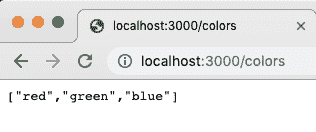

获取颜色

这很酷——你得到了这个结果，而不必手动重新启动应用程序。这使我们又多了一点生产力。现在，我们能在容器内做同样的事情吗？是的，我们可以。我们不会使用在我们的`Dockerfile`的最后一行中定义的启动命令`node index.js`：

```
CMD node index.js
```

我们将使用`nodemon`代替。

我们需要修改我们的`Dockerfile`吗？还是我们需要两个不同的`Dockerfiles`，一个用于开发，一个用于生产？

我们的原始`Dockerfile`创建了一个不幸不包含`nodemon`的镜像。因此，我们需要创建一个新的`Dockerfile`。让我们称之为`Dockerfile-dev`。它应该是这样的：

```
FROM node:latest          
RUN npm install -g nodemon
WORKDIR /app
COPY package.json ./
RUN npm install
COPY . .
CMD nodemon
```

与我们的原始 Dockerfile 相比，我们添加了第 2 行，安装了`nodemon`。我们还改变了最后一行，现在使用`nodemon`作为我们的启动命令。

让我们按照以下方式构建我们的开发镜像：

```
$ docker image build -t sample-app-dev .
```

我们将像这样运行一个容器：

```
$ docker container run --rm -it \
   -v $(pwd):/app \
   -p 3000:3000 \
   sample-app-dev
```

现在，当应用程序在容器中运行时，改变一些代码，保存，并注意到容器内的应用程序会自动重新启动。因此，我们在容器中运行时实现了与直接在主机上运行时相同的减少摩擦。

你可能会问，这只适用于 Node.js 吗？不，幸运的是，许多流行的语言支持类似的概念。

# Python 的自动重启

让我们看看同样的东西在 Python 中是如何工作的：

1.  首先，为我们的示例 Python 应用程序创建一个新的项目文件夹，并导航到它：

```
$ mkdir -p ~/fod/ch06/python && cd ~/fod/ch06/python
```

1.  使用命令`code .`从这个文件夹中打开 VS Code。

1.  我们将创建一个使用流行的 Flask 库的示例 Python 应用程序。因此，向这个文件夹添加一个`requirements.txt`文件，其中包含`flask`的内容。

1.  接下来，添加一个`main.py`文件，并给它这个内容：

```
from flask import Flask
app = Flask(__name__)

@app.route("/")
def hello():
  return "Hello World!"

if __name__ == "__main__":
  app.run()
```

这是一个简单的**Hello World**类型的应用程序，在`localhost:5000/`上实现了一个 RESTful 端点。

1.  在我们可以运行和测试这个应用程序之前，我们需要安装依赖项——在我们的情况下是 Flask。在终端中运行以下命令：

```
$ pip install -r requirements.txt
```

这应该在你的主机上安装 Flask。我们现在准备好了。

1.  在使用 Python 时，我们也可以使用`nodemon`来在代码发生任何更改时自动重新启动我们的应用程序。例如，假设你的启动 Python 应用程序的命令是`python main.py`。那么你只需要像下面这样使用`nodemon`：

```
$ nodemon main.py
```

你应该看到这个：


1.  使用`nodemon`启动和监视 Python 应用程序，我们可以使用`curl`测试该应用程序，并应该看到这个：

```
$ curl localhost:5000/
Hello World!
```

1.  现在让我们通过将此片段添加到`main.py`中的`/`端点的定义之后，并保存来修改代码：

```
from flask import jsonify

@app.route("/colors")
def colors():
   return jsonify(["red", "green", "blue"])
```

`nodemon`将发现更改并重新启动 Python 应用程序，正如我们可以在终端产生的输出中看到的那样：


nodemon 发现 Python 代码的更改

1.  再次，相信是好的，测试更好。因此，让我们再次使用我们的朋友`curl`来探测新的端点，看看我们得到了什么：

```
$ curl localhost:5000/colors
["red", "green", "blue"]
```

很好-它有效！有了这个，我们已经涵盖了 Python。.NET 是另一个流行的平台。让我们看看在.NET 上开发 C#应用程序时是否可以做类似的事情。

# .NET 的自动重启

我们的下一个候选者是用 C#编写的.NET 应用程序。让我们看看.NET 中的自动重启是如何工作的。

1.  首先，为我们的示例 C#应用程序创建一个新的项目文件夹并导航到它：

```
$ mkdir -p ~/fod/ch06/csharp && cd ~/fod/ch06/csharp
```

如果您以前没有这样做，请在您的笔记本电脑或工作站上安装.NET Core。您可以在[`dotnet.microsoft.com/download/dotnet-core`](https://dotnet.microsoft.com/download/dotnet-core)上获取它。在撰写本文时，版本 2.2 是当前稳定版本。安装完成后，使用`dotnet --version`检查版本。对我来说是`2.2.401`。

1.  导航到本章的源文件夹：

```
$ cd ~/fod/ch06
```

1.  从这个文件夹内，使用`dotnet`工具创建一个新的 Web API，并将其放在`dotnet`子文件夹中：

```
$ dotnet new webapi -o dotnet
```

1.  导航到这个新项目文件夹：

```
$ cd dotnet
```

1.  再次使用`code .`命令从`dotnet`文件夹内打开 VS Code。

如果这是您第一次使用 VS Code 打开.NET Core 2.2 项目，那么编辑器将开始下载一些 C#依赖项。等到所有依赖项都下载完成。编辑器可能还会显示一个弹出窗口，询问您是否要为我们的`dotnet`项目添加缺少的依赖项。在这种情况下点击“是”按钮。

在 VS Code 的项目资源管理器中，您应该看到这个：

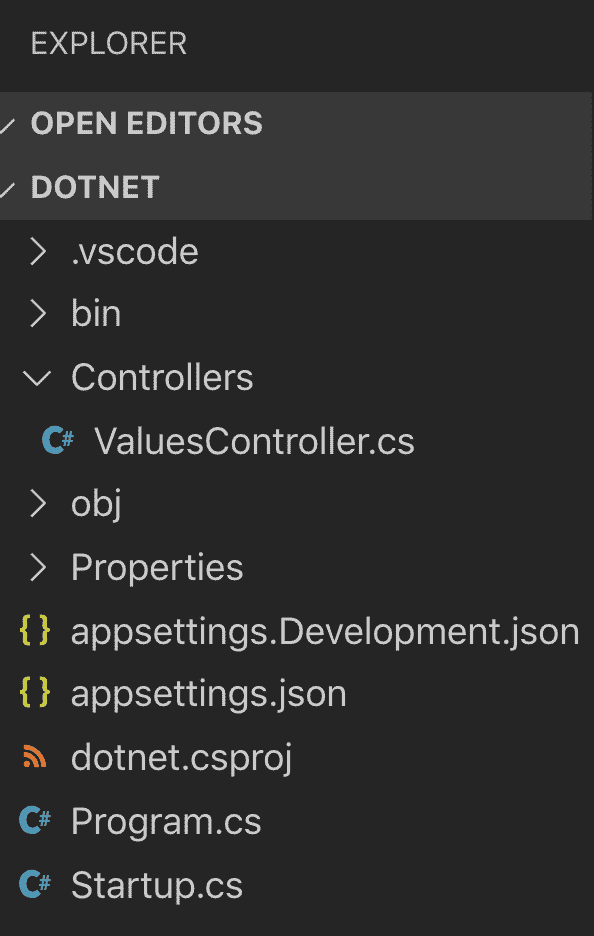

在 VS Code 项目资源管理器中的 DotNet Web API 项目

1.  请注意`Controllers`文件夹中的`ValuesController.cs`文件。打开此文件并分析其内容。它包含了`ValuesController`类的定义，该类实现了一个简单的 RESTful 控制器，其中包含`GET`、`PUT`、`POST`和`DELETE`端点在`api/values`。

1.  从您的终端运行应用程序使用 `dotnet run`。您应该会看到类似以下内容：


在主机上运行.NET 示例 Web API

1.  我们可以使用 `curl` 测试应用程序，例如：

```
$ curl --insecure https://localhost:5001/api/values ["value1","value2"]
```

应用程序运行并返回了预期的结果。

请注意，默认情况下，该应用程序配置为将 `http://localhost:5000` 重定向到 `https://localhost:5001`。但是，这是一个不安全的端点，为了抑制警告，我们使用 `--insecure` 开关。

1.  现在我们可以尝试修改 `ValuesController.cs` 中的代码，并从第一个 `GET` 端点返回三个项目而不是两个。

```
[HttpGet]
public ActionResult<IEnumerable<string>> Get()
{
    return new string[] { "value1", "value2", "value3" };
}
```

1.  保存您的更改并重新运行 `curl` 命令。注意结果不包含新添加的值。这与我们观察到的 Node.js 和 Python 的问题相同。要查看新更新的返回值，我们需要（手动）重新启动应用程序。

1.  因此，在您的终端中，使用 *Ctrl* + *C* 停止应用程序，并使用 `dotnet run` 重新启动。再次尝试 `curl` 命令。结果现在应该反映您的更改。

1.  幸运的是，`dotnet` 工具有 `watch` 命令。通过按 *Ctrl* + *C* 停止应用程序并执行 `dotnet watch run`。您应该会看到类似以下内容的输出：


使用 watch 任务运行.NET 示例应用程序

注意前面输出的第二行，指出正在运行的应用程序现在正在监视更改。

1.  在 `ValuesController.cs` 中进行另一个更改；例如，在第一个 `GET` 端点的返回值中添加第四个项目并保存。观察终端中的输出。它应该看起来像这样：


自动重新启动正在运行的.NET Core 示例应用程序

1.  通过对代码进行更改，应用程序会自动重新启动，结果立即对我们可用，并且我们可以通过运行 `curl` 命令轻松测试它：

```
$ curl --insecure https://localhost:5001/api/values ["value1","value2","value3","value4"]
```

1.  现在我们在主机上有自动重启工作，我们可以编写一个 Dockerfile，在容器内运行的应用程序也可以实现相同的功能。在 VS Code 中，向项目添加一个名为 `Dockerfile-dev` 的新文件，并向其中添加以下内容：

```
FROM mcr.microsoft.com/dotnet/core/sdk:2.2
WORKDIR /app
COPY dotnet.csproj ./
RUN dotnet restore
COPY . .
CMD dotnet watch run
```

1.  在我们继续构建容器镜像之前，我们需要对.NET 应用程序的启动配置进行轻微修改，使得 Web 服务器（在这种情况下是 Kestrel）监听，例如，`0.0.0.0:3000`，因此能够在容器内运行并且能够从容器外部访问。打开`Program.cs`文件，并对`CreateWebHostBuilder`方法进行以下修改：

```
public static IWebHostBuilder CreateWebHostBuilder(string[] args) =>
    WebHost.CreateDefaultBuilder(args)
    .UseUrls("http://0.0.0.0:3000")
    .UseStartup<Startup>();
```

通过`UseUrls`方法，我们告诉 Web 服务器监听所需的端点。

现在我们准备构建容器镜像：

1.  使用以下命令构建镜像：

```
$ docker image build -f Dockerfile-dev -t sample-app-dotnet .
```

1.  一旦镜像构建完成，我们就可以从中运行一个容器：

```
$ docker container run --rm -it \
   -p 3000:3000 \
   -v $(pwd):/app \
   sample-app-dotnet
```

我们应该看到类似于本地运行时看到的输出：

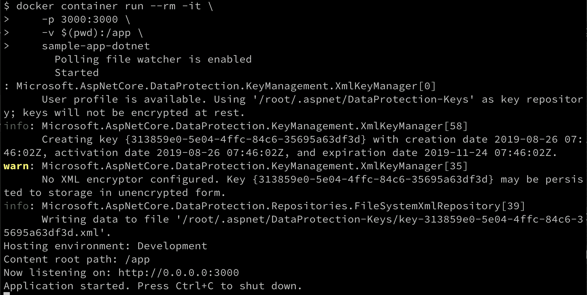

在容器中运行的.NET 示例应用程序

1.  让我们用我们的朋友`curl`来测试应用程序：

```
$ curl localhost:3000/api/values
["value1","value2","value3","value4"]
$
$ curl localhost:3000/api/values/1
value
```

这里没有什么意外——它按预期工作。

1.  现在让我们在控制器中进行代码更改，然后保存。观察终端窗口中发生的情况。我们应该看到类似于这样的输出：


在容器内运行的.NET 示例应用程序的自动重启

好吧，这正是我们所期望的。通过这样做，我们已经消除了在开发.NET 应用程序时使用容器引入的大部分摩擦。

# 在容器内逐行代码调试

在我们深入讨论容器内运行代码的逐行调试之前，让我先做一个声明。你将在这里学到的东西通常应该是你最后的选择，如果其他方法都不起作用的话。理想情况下，在开发应用程序时遵循测试驱动的方法，由于你已经为它编写了单元测试和集成测试，并对代码进行了测试，所以代码大部分是可以保证工作的，这些测试也是在容器中运行的。或者，如果单元测试或集成测试不能为你提供足够的洞察力，你确实需要逐行调试你的代码，你可以在主机上直接运行你的代码，从而利用开发环境的支持，比如 Visual Studio、Eclipse 或 IntelliJ 等 IDE。

通过这一切准备，你应该很少需要手动调试你的代码，因为它是在容器内运行的。也就是说，让我们看看你如何做到这一点！

在本节中，我们将专注于如何在使用 Visual Studio Code 时进行调试。其他编辑器和 IDE 可能或可能不提供类似的功能。

# 调试 Node.js 应用程序

我们将从最简单的开始——一个 Node.js 应用程序。我们将使用我们在本章早些时候使用过的`~/fod/ch06/node`文件夹中的示例应用程序：

1.  确保您导航到此项目文件夹并从其中打开 VS Code：

```
$ cd ~/fod/ch06/node
$ code .
```

1.  在终端窗口中，从项目文件夹内部，运行一个带有我们示例 Node.js 应用程序的容器：

```
$ docker container run --rm -it \
   --name my-sample-app \
   -p 3000:3000 \
   -p 9229:9229 \
   -v $(pwd):/app \
   sample-app node --inspect=0.0.0.0 index.js
```

注意我是如何将端口`9229`映射到主机的。这个端口是调试器使用的，VS Studio 将通过这个端口与我们的 Node 应用程序通信。因此，重要的是您打开这个端口——但只在调试会话期间！还要注意，我们用`node --inspect=0.0.0.0 index.js`覆盖了 Dockerfile 中定义的标准启动命令（`node index.js`）。`--inspect=0.0.0.0`告诉 Node 以调试模式运行，并在容器中监听所有 IP4 地址。

现在我们准备为手头的场景定义一个 VS Code 启动任务，也就是我们的代码在容器内运行：

1.  要打开`launch.json`文件，按*Ctrl*+*Shift*+*P*（或在 Windows 上按*Ctrl*+*Shift*+*P*）打开命令面板，然后搜索`Debug:Open launch.json`并选择它。`launch.json`文件应该在编辑器中打开。

1.  点击蓝色的“Add Configuration...”按钮，添加我们需要在容器内调试的新配置。

1.  从选项中选择`Docker: Attach to Node`。新条目将被添加到`launch.json`文件的配置列表中。它应该看起来类似于这样：

```
{
  "type": "node",
  "request": "attach",
  "name": "Docker: Attach to Node",
  "remoteRoot": "/usr/src/app"
},
```

由于我们的代码在`/app`文件夹中，容器内部，我们需要相应地更改`remoteRoot`的值。将`/usr/src/app`的值更改为`/app`。不要忘记保存您的更改。就是这样，我们已经准备好了。

1.  通过按下*command* + *Shift* + *D*（在 Windows 上为*Ctrl* + *Shift* + *D*）来打开 VS Code 中的调试视图。

1.  确保您在视图顶部的绿色启动按钮旁边的下拉菜单中选择正确的启动任务。选择`Docker: Attach to Node`如下所示：

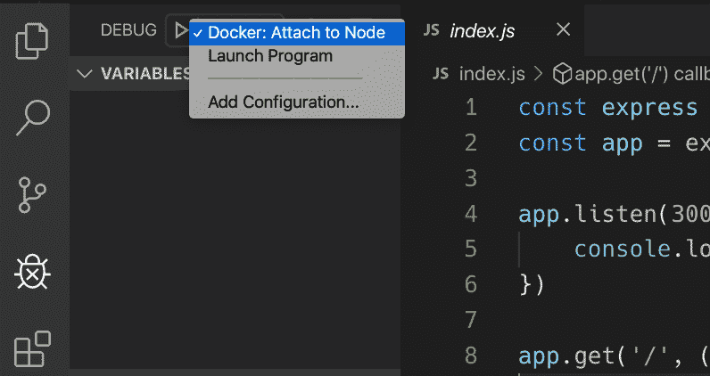

在 VS Code 中选择正确的启动任务进行调试

1.  接下来，点击绿色的启动按钮，将 VS Code 连接到运行在容器中的 Node 应用程序。

1.  在编辑器中打开`index.js`，并在调用端点'/'时在返回消息`"Sample Application: Hello World!"`的行上设置断点。

1.  在另一个终端窗口中，使用`curl`导航到`localhost:3000/`，并观察代码执行是否在断点处停止：

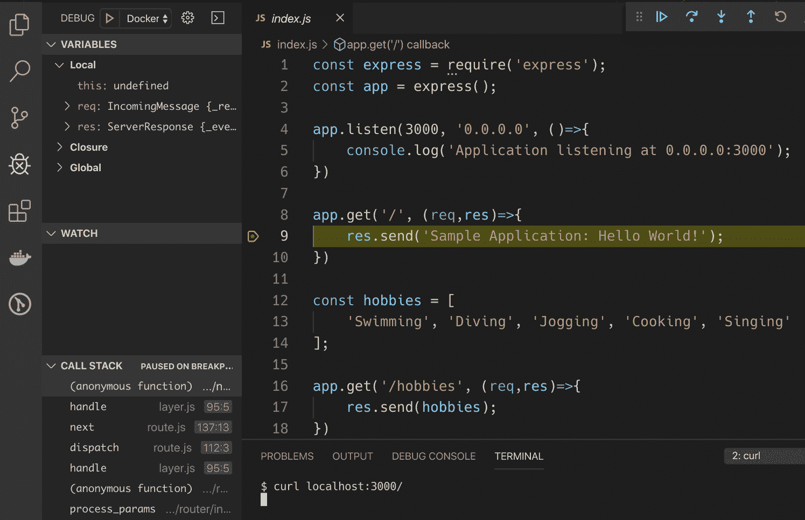

代码执行在断点处停止

在前面的屏幕截图中，我们可以看到黄色条表示代码执行已在断点处停止。在右上角，我们有一个工具栏，允许我们浏览代码，例如，逐步执行。在左侧，我们看到`VARIABLES`，`WATCH`和`CALL STACK`窗口，我们可以使用它们来观察我们运行的应用程序的细节。我们真正调试运行在容器内的代码的事实可以通过在启动容器的终端窗口中看到输出`Debugger attached.`来验证，这是我们在 VS Code 中开始调试时生成的。

让我们看看如何进一步改进调试体验：

1.  要停止容器，请在终端中输入以下命令：

```
$ docker container rm -f my-sample-app
```

1.  如果我们想要使用`nodemon`来获得更大的灵活性，那么我们必须稍微改变`container run`命令：

```
$ docker container run --rm -it \
   --name my-sample-app \
   -p 3000:3000 \
   -p 9229:9229 \
   -v $(pwd):/app \
   sample-app-dev nodemon --inspect=0.0.0.0 index.js
```

注意我们如何使用启动命令`nodemon --inspect=0.0.0.0 index.js`。这将带来一个好处，即在任何代码更改时，容器内运行的应用程序将自动重新启动，就像我们在本章前面学到的那样。您应该看到以下内容：

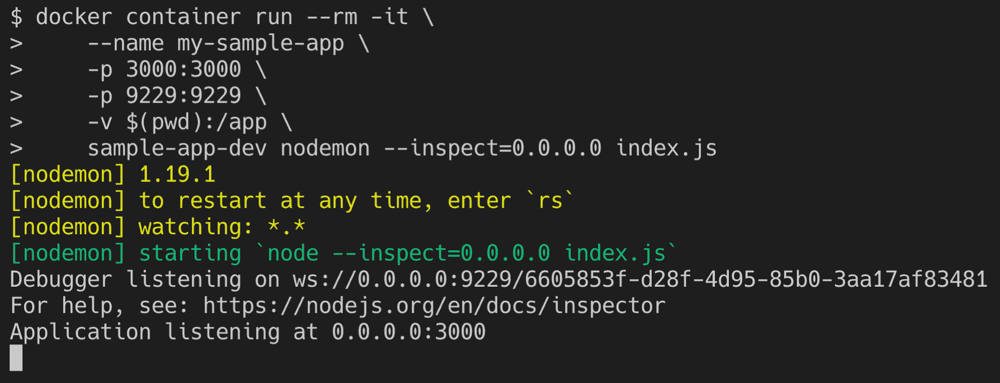

使用 nodemon 启动 Node.js 应用程序并打开调试功能

1.  不幸的是，应用程序重新启动的后果是调试器与 VS Code 失去了连接。但别担心，我们可以通过在`launch.json`文件中的启动任务中添加`"restart": true`来减轻这一点。修改任务，使其看起来像这样：

```
{
  "type": "node",
  "request": "attach",
  "name": "Docker: Attach to Node",
  "remoteRoot": "/app",
  "restart": true
},
```

1.  保存更改后，通过单击调试窗口中的绿色启动按钮在 VS Code 中启动调试器。在终端中，您应该再次看到输出`Debugger attached.`。除此之外，VS Code 在底部显示一个橙色状态栏，指示编辑器处于调试模式。

1.  在另一个终端窗口中，使用`curl`并尝试导航到`localhost:3000/`，以测试逐行调试是否仍然有效。确保代码执行在代码中设置的任何断点处停止。

1.  一旦您验证了调试仍然有效，请尝试修改一些代码；例如，将消息`"Sample Application: Hello World!"`更改为`"Sample Application: Message from within container"`，然后保存您的更改。观察`nodemon`如何重新启动应用程序，并且调试器自动重新附加到容器内运行的应用程序：


`nodemon`重新启动应用程序，并且调试器自动重新附加到应用程序

有了这些，我们现在可以像在主机上本地运行相同的代码一样，在容器内运行代码。我们已经基本上消除了引入容器带来的开发过程中的所有摩擦。现在我们可以享受在容器中部署代码的好处。

清理时，按*Ctrl* + *C*停止容器。

# 调试.NET 应用程序

现在我们想快速介绍一下如何逐行调试.NET 应用程序。我们将使用本章前面创建的示例.NET 应用程序。

1.  转到项目文件夹并从其中打开 VS Code：

```
$ cd ~/fod/ch06/dotnet
$ code .
```

1.  要使用调试器，我们首先需要在容器中安装调试器。因此，让我们在项目目录中创建一个新的`Dockerfile`。将其命名为`Dockerfile-debug`并添加以下内容：

```
FROM mcr.microsoft.com/dotnet/core/sdk:2.2
RUN apt-get update && apt-get install -y unzip && \
    curl -sSL https://aka.ms/getvsdbgsh | \
        /bin/sh /dev/stdin -v latest -l ~/vsdbg
WORKDIR /app
COPY dotnet.csproj ./
RUN dotnet restore
COPY . .
CMD dotnet watch run
```

请注意`Dockerfile`的第二行，它使用`apt-get`安装`unzip`工具，然后使用`curl`下载并安装调试器。

1.  我们可以按照以下方式从这个`Dockerfile`构建一个名为`sample-app-dotnet-debug`的镜像：

```
$ docker image build -t sample-app-dotnet-debug .
```

这个命令可能需要一些时间来执行，因为调试器需要下载和安装。

1.  完成后，我们可以从这个镜像中交互式运行一个容器：

```
$ docker run --rm -it \
   -v $(pwd):/app \
   -w /app \
   -p 3000:3000 \
   --name my-sample-app \
   --hostname sample-app \
   sample-app-dotnet-debug
```

我们会看到类似这样的东西：


在 SDK 容器内交互式启动示例.NET 应用程序

1.  在 VS Code 中，打开`launch.json`文件并添加以下启动任务：

```
{
   "name": ".NET Core Docker Attach",
   "type": "coreclr",
   "request": "attach",
   "processId": "${command:pickRemoteProcess}",
   "pipeTransport": {
      "pipeProgram": "docker",
      "pipeArgs": [ "exec", "-i", "my-sample-app" ],
      "debuggerPath": "/root/vsdbg/vsdbg",
      "pipeCwd": "${workspaceRoot}",
      "quoteArgs": false
   },
   "sourceFileMap": {
      "/app": "${workspaceRoot}"
   },
   "logging": {
      "engineLogging": true
   }
},
```

1.  保存您的更改，并切换到 VS Code 的调试窗口（使用*command* + *Shift* + *D*或*Ctrl* + *Shift* + *D *打开它）。确保您已选择了正确的调试启动任务——它的名称是`.NET Core Docker Attach`：

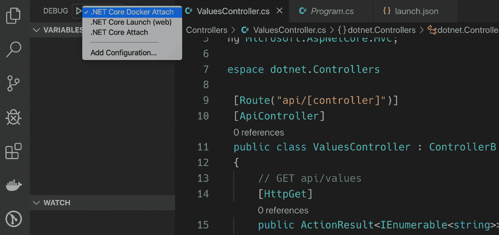

在 VS Code 中选择正确的调试启动任务

1.  现在单击绿色的启动按钮启动调试器。因此，弹出窗口显示了要附加到的潜在进程列表。选择看起来像下面截图中标记的进程。


选择要附加调试器的进程

1.  让我们在`ValuesController.cs`文件的第一个`GET`请求中设置一个断点，然后执行一个`curl`命令：

```
$ curl localhost:3000/api/values
```

代码执行应该在断点处停止，如下所示：

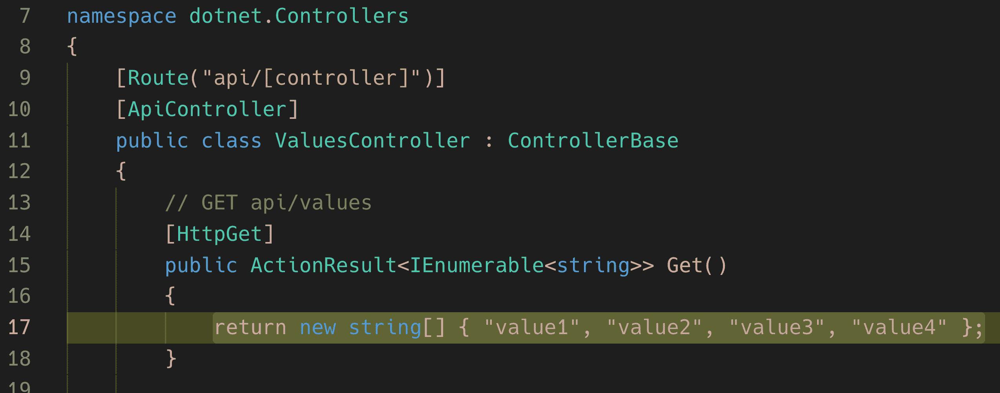

在容器内运行的.NET Core 应用程序进行逐行调试

1.  现在我们可以逐步执行代码，定义观察点，或者分析应用程序的调用堆栈，类似于我们在示例 Node.js 应用程序中所做的。单击调试工具栏上的“继续”按钮或按*F5*继续执行代码。

1.  现在更改一些代码并保存更改。观察终端窗口中应用程序如何自动重新启动。

1.  再次使用`curl`测试您的更改是否对应用程序可见。确实，更改是可用的，但您是否注意到了什么？是的，代码执行没有从断点开始。不幸的是，重新启动应用程序会导致调试器断开连接。您必须通过单击 VS Code 调试视图中的启动按钮并选择正确的进程来重新附加调试器。

1.  要停止应用程序，请在启动容器的终端窗口中按*Ctrl* + *C*。

现在我们知道如何逐行调试容器中运行的代码，是时候为我们的代码添加有意义的日志信息了。

# 为您的代码添加有意义的日志信息

一旦应用程序在生产环境中运行，就不可能或者强烈不建议交互式调试应用程序。因此，当系统行为异常或引起错误时，我们需要想出其他方法来找到根本原因。最好的方法是让应用程序生成详细的日志信息，然后开发人员可以使用这些信息来跟踪任何错误。由于日志记录是如此常见的任务，所有相关的编程语言或框架都提供了使应用程序内部生成日志信息的库。

将应用程序输出的信息分类为日志，并称为严重级别是很常见的。以下是这些严重级别的列表，以及每个的简短描述：

| **安全级别** | **解释** |
| --- | --- |
| TRACE | 非常精细的信息。在这个级别，您正在捕获关于应用程序行为的每一个可能的细节。 |
| DEBUG | 相对细粒度和大多数诊断信息，有助于确定潜在问题。 |
| INFO | 正常的应用程序行为或里程碑。 |
| WARN | 应用程序可能遇到问题，或者您检测到异常情况。 |
| ERROR | 应用程序遇到严重问题。这很可能代表了重要应用程序任务的失败。 |
| FATAL | 应用程序的灾难性失败。建议立即关闭应用程序。 |

生成日志信息时使用的严重级别列表

日志库通常允许开发人员定义不同的日志接收器，即日志信息的目的地。常见的接收器是文件接收器或控制台流。在使用容器化应用程序时，强烈建议始终将日志输出定向到控制台或`STDOUT`。然后 Docker 将通过`docker container logs`命令向您提供此信息。还可以使用其他日志收集器，如 Prometheus，来抓取此信息。

# 为 Python 应用程序进行仪器化

现在让我们尝试为我们现有的 Python 示例应用程序进行仪器化：

1.  首先，在您的终端中，导航到项目文件夹并打开 VS Code：

```
$ cd ~/fob/ch06/python
$ code .
```

1.  打开`main.py`文件，并在顶部添加以下代码片段：


为我们的 Python 示例应用程序定义一个记录器

在第`1`行，我们导入标准的`logging`库。然后我们在第`3`行为我们的示例应用程序定义一个`logger`。在第`4`行，我们定义要使用的日志过滤器。在这种情况下，我们将其设置为`WARN`。这意味着应用程序产生的所有日志消息，其严重程度等于或高于`WARN`，将被输出到在本节开头称为`logging`处理程序或接收器的定义。在我们的情况下，只有具有`WARN`、`ERROR`或`FATAL`日志级别的日志消息将被输出。

在第`6`行，我们创建了一个日志接收器或处理程序。在我们的情况下，它是`StreamHandler`，输出到`STDOUT`。然后，在第`8`行，我们定义了我们希望`logger`如何格式化输出的消息。在这里，我们选择的格式将输出时间和日期、应用程序（或`logger`）名称、日志严重级别，最后是我们开发人员在代码中定义的实际消息。在第`9`行，我们将格式化程序添加到日志处理程序中，在第`10`行，我们将处理程序添加到`logger`中。请注意，我们可以为每个 logger 定义多个处理程序。现在我们准备使用`logger`了。

1.  让我们来对`hello`函数进行仪器化，当我们导航到端点`/`时会调用该函数：


使用日志记录对方法进行仪器化

如您在上面的截图中所见，我们在第`17`行添加了一行，我们在那里使用`logger`对象生成了一个日志级别为`INFO`的日志消息。消息是："访问端点'/'"。

1.  让我们对另一个函数进行仪器化，并输出一个日志级别为`WARN`的消息：


生成一个警告

这一次，我们在`colors`函数的第`24`行以`WARN`日志级别生成了一条消息。到目前为止，一切都很顺利——这并不难！

1.  现在让我们运行应用程序，看看我们得到什么输出：

```
$ python main.py
```

1.  然后，在浏览器中，首先导航到`localhost:5000/`，然后导航到`localhost:5000/colors`。您应该看到类似于这样的输出：


运行经过仪器化的示例 Python 应用程序

如您所见，只有警告被输出到控制台；`INFO`消息没有。这是由于我们在定义 logger 时设置的过滤器。还请注意，我们的日志消息是如何以日期和时间开头，然后是 logger 的名称，日志级别，最后是我们在应用程序的第`24`行定义的实际消息。完成后，请按*Ctrl* + *C*停止应用程序。

# 对.NET C#应用程序进行仪器化

现在让我们对我们的示例 C#应用程序进行仪器化：

1.  首先，导航到项目文件夹，从那里您将打开 VS Code：

```
$ cd ~/fod/ch06/dotnet
$ code .
```

1.  接下来，我们需要向项目添加一个包含日志库的 NuGet 包：

```
$ dotnet add package Microsoft.Extensions.Logging
```

这应该会将以下行添加到您的`dotnet.csproj`项目文件中：

```
<PackageReference  Include="Microsoft.Extensions.Logging"  Version="2.2.0"  />
```

1.  打开`Program.cs`类，并注意我们在第`21`行调用了`CreateDefaultBuilder(args)`方法。


在 ASP.NET Core 2.2 中配置日志记录

默认情况下，此方法向应用程序添加了一些日志提供程序，其中包括控制台日志提供程序。这非常方便，使我们无需进行任何复杂的配置。当然，您可以随时使用自己的设置覆盖默认设置。

1.  接下来，在`Controllers`文件夹中打开`ValuesController.cs`文件，并在文件顶部添加以下`using`语句：

```
using Microsoft.Extensions.Logging;
```

1.  然后，在类主体中，添加一个名为`_logger`的实例变量，类型为`ILogger`，并添加一个具有类型为`ILogger<T>`的参数的构造函数。将此参数分配给实例变量`_logger`：

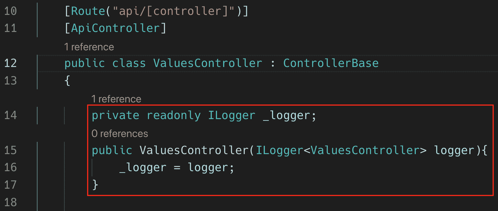

为 Web API 控制器定义一个记录器

1.  现在我们准备在控制器方法中使用记录器。让我们使用`INFO`消息对`Get`方法进行调试：


从 API 控制器记录 INFO 消息

1.  现在让我们对`Get(int id)`方法进行一些调试：


使用日志级别 WARN 和 ERROR 记录消息

在第 31 行，我们让记录器生成一个 DEBUG 消息，然后在第 32 行对`id`的意外值进行一些逻辑处理，并生成 ERROR 消息并返回 HTTP 响应状态 404（未找到）。

1.  让我们使用以下内容运行应用程序：

```
$ dotnet run
```

1.  当导航到`localhost:3000/api/values`时，我们应该看到这个：

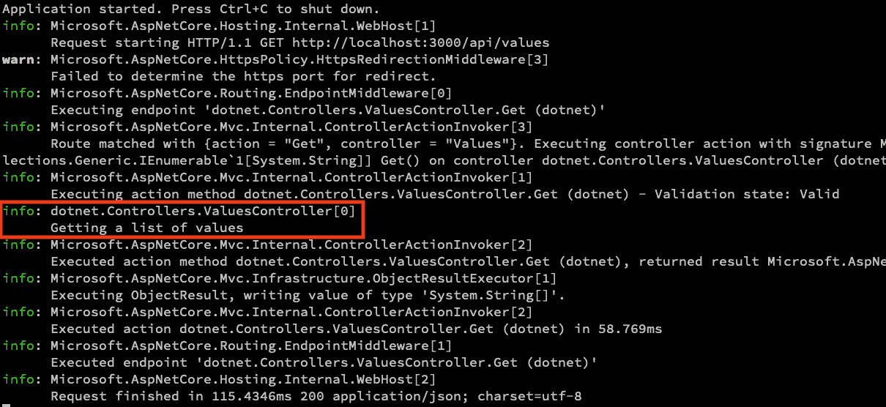

访问端点`/api/values`时我们示例.NET 应用程序的日志

我们可以看到我们的 INFO 类型的日志消息输出。所有其他日志项都是由 ASP.NET Core 库生成的。您可以看到如果需要调试应用程序，则有大量有用的信息可用。

1.  现在让我们尝试使用无效的`{id}`值访问端点`/api/values/{id}`。我们应该看到类似于以下内容：


我们的.NET 示例应用程序生成的调试和错误日志项

我们首先可以清楚地看到级别为`DEBUG`的日志项，然后是级别为`ERROR`的日志项。输出中后者标记为`fail`并以红色显示。

1.  完成后，请使用*Ctrl +* C 结束应用程序。

现在我们已经了解了如何进行调试，接下来我们将在下一节中学习 Jaeger。

# 使用 Jaeger 进行监视和故障排除

当我们想要监视和排查复杂分布式系统中的事务时，我们需要比我们刚刚学到的更强大的东西。当然，我们可以并且应该继续用有意义的日志消息来仪器化我们的代码，但我们需要更多的东西。这*更多*是追踪单个请求或事务的能力，从而使其在由许多应用服务组成的系统中流动时，我们可以端到端地追踪它。理想情况下，我们还希望捕获其他有趣的指标，比如在每个组件上花费的时间与请求所花费的总时间。

幸运的是，我们不必重新发明轮子。有经过实战考验的开源软件可以帮助我们实现上述目标。这样一个基础设施组件或软件的例子就是 Jaeger（[`www.jaegertracing.io/`](https://www.jaegertracing.io/)）。使用 Jaeger 时，您运行一个中央 Jaeger 服务器组件，每个应用组件都使用一个 Jaeger 客户端，该客户端会将调试和跟踪信息透明地转发到 Jaeger 服务器组件。对于所有主要的编程语言和框架，如 Node.js、Python、Java 和.NET，都有 Jaeger 客户端。

我们不会在本书中详细介绍如何使用 Jaeger 的所有细节，但会对其工作原理进行高层次的概述：

1.  首先，我们定义一个 Jaeger`tracer`对象。这个对象基本上协调了我们的分布式应用程序中追踪请求的整个过程。我们可以使用这个`tracer`对象，还可以从中创建一个`logger`对象，我们的应用代码可以使用它来生成日志项，类似于我们在之前的 Python 和.NET 示例中所做的。

1.  接下来，我们需要用 Jaeger 称为`span`的代码来包装每个方法。`span`有一个名称，并为我们提供一个`scope`对象。让我们看一些 C#伪代码，以说明这一点：

```
public void SayHello(string helloTo) {
  using(var scope = _tracer.BuildSpan("say-hello").StartActive(true)) {
    // here is the actual logic of the method
    ...
    var helloString = FormatString(helloTo);
    ...
  }
}
```

正如你所看到的，我们正在为`SayHello`方法进行仪器化。通过使用`using`语句创建一个 span，我们将整个该方法的应用代码进行包装。我们将 span 命名为`"say-hello"`，这将是我们在 Jaeger 生成的跟踪日志中用来识别该方法的 ID。

请注意，该方法调用另一个嵌套方法`FormatString`。就需要为其进行仪器化所需的代码而言，这个方法看起来会非常相似：

```
public void string Format(string helloTo) {
   using(var scope = _tracer.BuildSpan("format-string").StartActive(true)) {
       // here is the actual logic of the method
       ...
       _logger.LogInformation(helloTo);
       return 
       ...
   }
}
```

我们的`tracer`对象在此方法中构建的 span 将是调用方法的子 span。这里的子 span 称为`"format-string"`。还要注意，我们在前面的方法中使用`logger`对象显式生成了一个级别为`INFO`的日志项。

在本章附带的代码中，您可以找到一个完整的 C#示例应用程序，其中包括一个 Jaeger 服务器容器和两个应用程序容器，称为客户端和库，它们使用 Jaeger 客户端库来对代码进行仪器化。

1.  转到项目文件夹：

```
$ cd ~/fod/ch06/jaeger-sample
```

1.  接下来，启动 Jaeger 服务器容器：

```
$ docker run -d --name jaeger \
   -e COLLECTOR_ZIPKIN_HTTP_PORT=9411 \
   -p 5775:5775/udp \
   -p 6831:6831/udp \
   -p 6832:6832/udp \
   -p 5778:5778 \
   -p 16686:16686 \
   -p 14268:14268 \
   -p 9411:9411 \
   jaegertracing/all-in-one:1.13
```

1.  接下来，我们需要运行 API，它是作为 ASP.NET Core 2.2 Web API 组件实现的。转到`api`文件夹并启动组件：


启动 Jaeger 示例的 API 组件

1.  现在打开一个新的终端窗口，然后进入`client`子文件夹，然后运行应用程序：

```
$ cd ~/fod/ch06/jaeger-sample/client
 $ dotnet run Gabriel Bonjour
```

请注意我传递的两个参数—`Gabriel`和`Bonjour`—它们对应于`<name>`和`<greeting>`。您应该看到类似于这样的内容：


运行 Jaeger 示例应用程序的客户端组件

在前面的输出中，您可以看到用红色箭头标记的三个 span，从最内部到最外部的 span。我们还可以使用 Jaeger 的图形界面来查看更多细节：

1.  在浏览器中，转到`http://localhost:16686`以访问 Jaeger UI。

1.  在搜索面板中，确保选择了`hello-world`服务。将操作保留为`all`，然后点击`Find Traces`按钮。您应该看到以下内容：

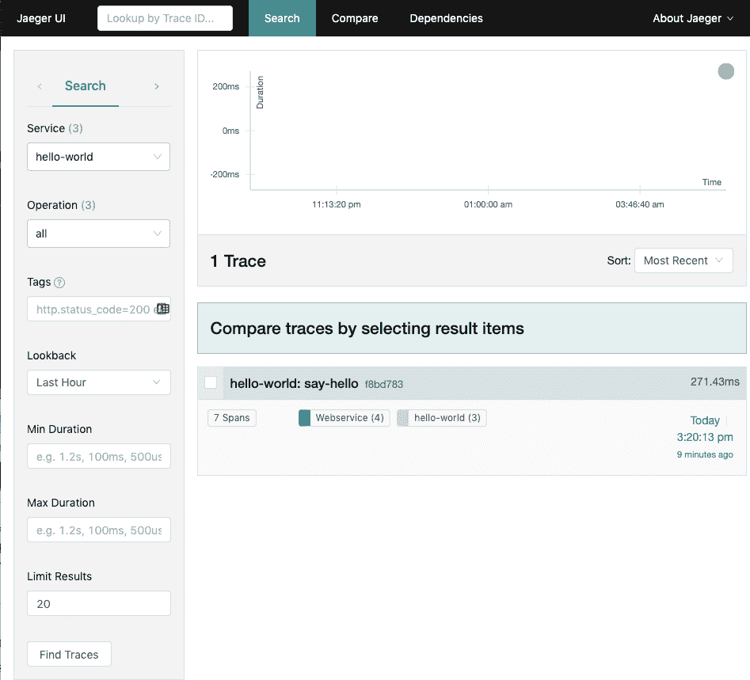

Jaeger UI 的搜索视图

1.  现在点击（唯一的）条目`hello-world: say-hello`以查看该请求的详细信息：

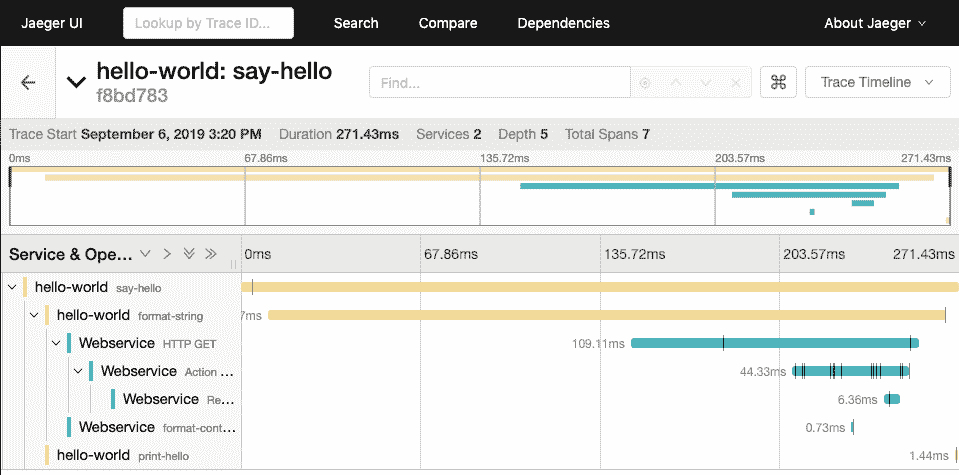

Jaeger 报告的请求细节

在前面的截图中，我们可以看到请求是如何从`hello-world`组件的`say-hello`方法开始，然后导航到同一组件中的`format-string`方法，然后调用`Webservice`中的一个端点，其逻辑是在`FormatController`控制器中实现的。对于每一步，我们都可以看到确切的时间以及其他有趣的信息。您可以在此视图中深入了解更多细节。

在继续之前，您可能想花些时间浏览一下我们刚刚用于此演示的 API 和`client`组件的代码。

1.  清理时，请停止 Jaeger 服务器容器：

```
$ docker container rm -f jaeger
```

同时停止 API，使用*Ctrl* + *C*。

# 摘要

在本章中，我们学习了如何调试在容器内运行的 Node.js、Python、Java 和.NET 代码。我们首先通过将主机的源代码挂载到容器中，以避免每次代码更改时重新构建容器映像。然后，我们进一步简化了开发过程，通过在代码更改时在容器内启用自动应用程序重启。接下来，我们学习了如何配置 Visual Studio Code 以启用在容器内运行的代码的完全交互式调试。最后，我们学习了如何对我们的应用程序进行配置，使其生成日志信息，这些信息可以帮助我们对在生产环境中运行的失败或行为不端的应用程序或应用程序服务进行根本原因分析。

在下一章中，我们将展示如何使用 Docker 容器可以加速您的自动化，从在容器中运行简单的自动化任务，到使用容器构建 CI/CD 流水线。

# 问题

请尝试回答以下问题，以评估您的学习进度：

1.  列举两种有助于减少容器使用引入的开发过程中的摩擦的方法。

1.  如何实现容器内代码的实时更新？

1.  在何时以及为什么会使用在容器内运行的代码的逐行调试？

1.  为什么在代码中加入良好的调试信息至关重要？

# 进一步阅读

+   使用 Docker 进行实时调试：[`www.docker.com/blog/live-debugging-docker/`](https://www.docker.com/blog/live-debugging-docker/)

+   在本地 Docker 容器中调试应用程序：[`docs.microsoft.com/en-us/visualstudio/containers/edit-and-refresh?view=vs-2019`](https://docs.microsoft.com/en-us/visualstudio/containers/edit-and-refresh?view=vs-2019)

+   使用 IntelliJ IDEA*在 Docker 中调试您的 Java 应用程序：[`blog.jetbrains.com/idea/2019/04/debug-your-java-applications-in-docker-using-intellij-idea/`](https://blog.jetbrains.com/idea/2019/04/debug-your-java-applications-in-docker-using-intellij-idea/)
