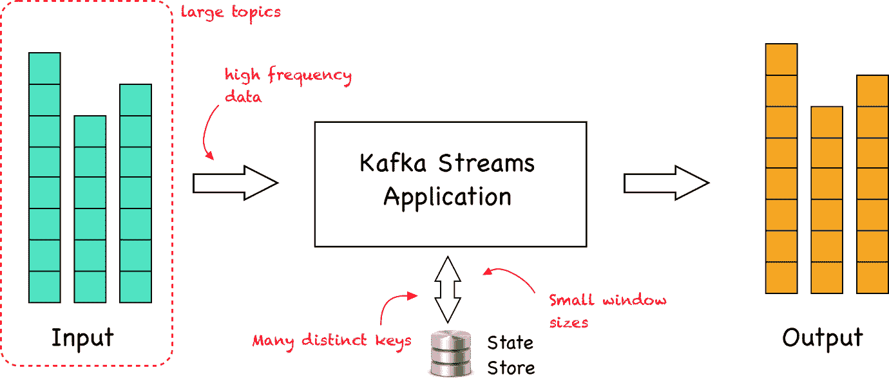
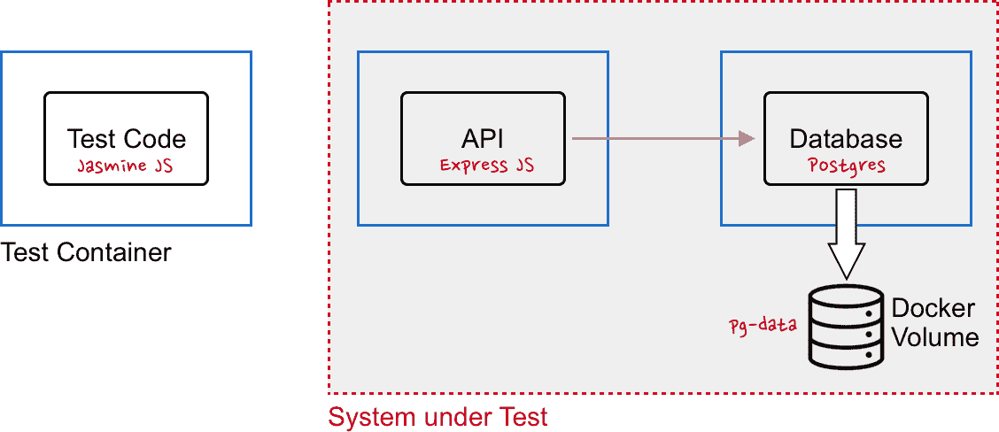
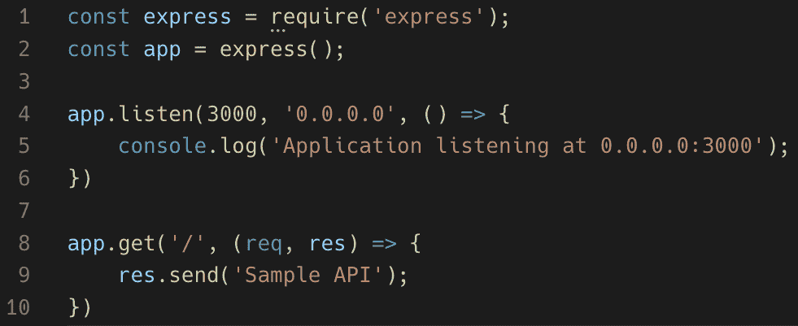
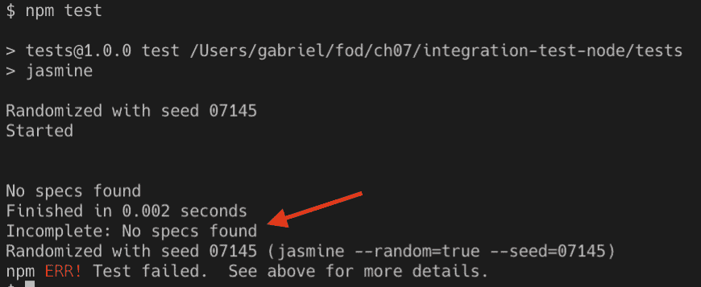
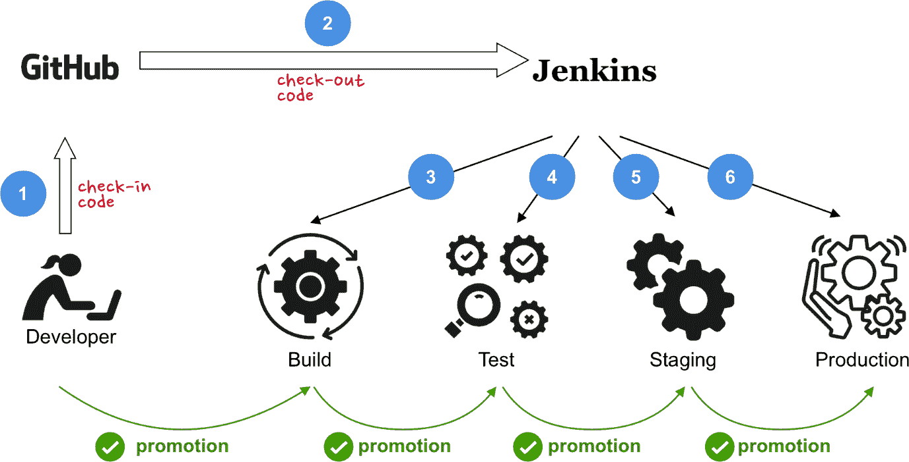
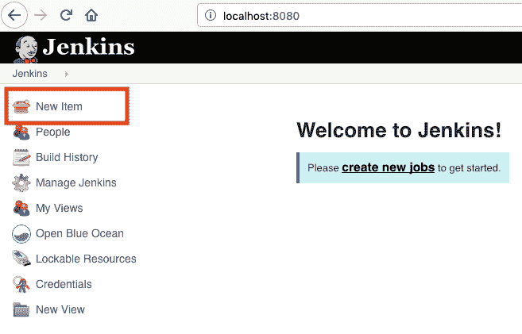
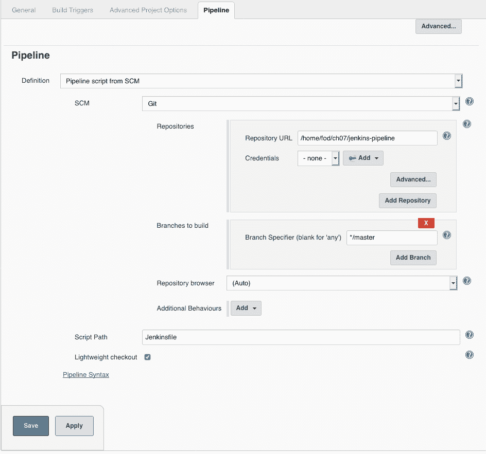

# 使用 Docker 来加速自动化

在上一章中，我们介绍了通常用于允许开发人员在容器中演变、修改、调试和测试其代码的技术。我们还学习了如何对应用程序进行工具化，以便它们生成日志信息，这些信息可以帮助我们对在生产环境中运行的应用程序或应用服务的故障或异常行为进行根本原因分析。

在本章中，我们将展示如何使用工具执行管理任务，而无需在主机计算机上安装这些工具。我们还将说明托管和运行测试脚本或代码的容器，用于测试和验证在容器中运行的应用服务。最后，我们将指导读者构建一个基于 Docker 的简单 CI/CD 流水线。

这是本章中我们将涉及的所有主题的快速概述：

+   在容器中执行简单的管理员任务

+   使用测试容器

+   使用 Docker 来驱动 CI/CD 流水线

完成本章后，您将能够执行以下操作：

+   在容器中运行主机上不可用的工具

+   使用容器来运行测试脚本或代码来对应用服务进行测试

+   使用 Docker 构建一个简单的 CI/CD 流水线

# 技术要求

在本节中，如果您想跟着代码进行操作，您需要在 macOS 或 Windows 机器上安装 Docker for Desktop 和一个代码编辑器，最好是 Visual Studio Code。该示例也适用于安装了 Docker 和 VS Code 的 Linux 机器。

# 在容器中执行简单的管理员任务

假设您需要从文件中删除所有前导空格，并且您找到了以下方便的 Perl 脚本来做到这一点：

```
$ cat sample.txt | perl -lpe 's/^\s*//'
```

事实证明，您的工作机器上没有安装 Perl。你能做什么？在机器上安装 Perl 吗？嗯，这当然是一个选择，这也是大多数开发人员或系统管理员所做的。但等一下，您已经在机器上安装了 Docker。我们不能使用 Docker 来规避安装 Perl 的需要吗？是的，我们可以。这就是我们要做的：

1.  创建一个名为`ch07/simple-task`的文件夹，并导航到它：

```
$ mkdir -p ~/fod/ch07/simple-task && cd ~/fod/ch07/simple-task
```

1.  从这个文件夹中打开 VS Code：

```
$ code .
```

1.  在这个文件夹中，创建一个名为`sample.txt`的文件，内容如下：

```
1234567890
  This is some text
   another line of text
 more text
     final line
```

请注意每行开头的空格。保存文件。

1.  现在，我们可以运行一个安装了 Perl 的容器。幸运的是，Docker Hub 上有一个官方的 Perl 镜像。我们将使用镜像的 slim 版本：

```
$ docker container run --rm -it \
 -v $(pwd):/usr/src/app \
 -w /usr/src/app \
 perl:slim sh -c "cat sample.txt | perl -lpe 's/^\s*//'"
```

上面的命令以交互方式运行了一个 Perl 容器（`perl:slim`），将当前文件夹的内容映射到容器的`/usr/src/app`文件夹，并将容器内的工作文件夹设置为`/usr/src/app`。在容器内运行的命令是`sh -c "cat sample.txt | perl -lpe 's/^\s*//'"`，基本上是生成一个 Bourne shell 并执行我们想要的 Perl 命令。

上面的命令生成的输出应该如下所示：

```
1234567890
This is some text
another line of text
more text
final line
```

1.  无需在我们的机器上安装 Perl，我们就能实现我们的目标。

如果这还不能说服你，因为如果你在 macOS 上，你已经安装了 Perl，那么请考虑一下，你想要运行一个名为`your-old-perl-script.pl`的 Perl 脚本，它是旧的，不兼容你系统上已安装的最新版本的 Perl。你会尝试在你的机器上安装多个版本的 Perl 并可能破坏一些东西吗？不，你只需运行一个与你的脚本兼容的（旧）Perl 版本的容器，就像这个例子：

```
$ docker container run -it --rm \
-v $(pwd):/usr/src/app \
 -w /usr/src/app \
 perl:<old-version> perl your-old-perl-script.pl
```

这里，`<old-version>`对应于你需要运行你的脚本的 Perl 版本的标签。好处是，脚本运行后，容器将从你的系统中删除，不会留下任何痕迹，因为我们在`docker container run`命令中使用了`--rm`标志。

许多人使用快速而简单的 Python 脚本或迷你应用程序来自动化一些无法用 Bash 等编码的任务。现在，如果 Python 脚本是用 Python 3.7 编写的，而你只安装了 Python 2.7，或者根本没有在你的机器上安装任何版本，那么最简单的解决方案就是在容器内执行脚本。让我们假设一个简单的例子，Python 脚本统计给定文件中的行数、单词数和字母数，并将结果输出到控制台：

1.  在`ch07/simple-task`文件夹中添加一个`stats.py`文件，并添加以下内容：

```
import sys

fname = sys.argv[1]
lines = 0
words = 0
letters = 0

for line in open(fname):
    lines += 1
    letters += len(line)

    pos = 'out'
    for letter in line:
        if letter != ' ' and pos == 'out':
            words += 1
            pos = 'in'
        elif letter == ' ':
            pos = 'out'

print("Lines:", lines)
print("Words:", words)
print("Letters:", letters)
```

1.  保存文件后，您可以使用以下命令运行它：

```
$ docker container run --rm -it \
 -v $(pwd):/usr/src/app \
 -w /usr/src/app \
 python:3.7.4-alpine python stats.py sample.txt
```

请注意，在这个例子中，我们重用了之前的`sample.txt`文件。在我的情况下，输出如下：

```
Lines: 5
Words: 13
Letters: 81
```

这种方法的美妙之处在于，这个 Python 脚本现在可以在任何安装了任何操作系统的计算机上运行，只要这台机器是一个 Docker 主机，因此可以运行容器。

# 使用测试容器

对于每个严肃的软件项目，强烈建议进行大量的测试。有各种测试类别，如单元测试、集成测试、压力和负载测试以及端到端测试。我尝试在以下截图中可视化不同的类别：


应用程序测试的类别

单元测试断言整体应用程序或应用程序服务中的单个、孤立部分的正确性和质量。集成测试确保紧密相关的部分按预期工作在一起。压力和负载测试通常将应用程序或服务作为整体，并断言在各种边缘情况下的正确行为，例如通过服务处理的多个并发请求的高负载，或通过向服务发送大量数据来淹没服务。最后，端到端测试模拟真实用户与应用程序或应用程序服务的工作。用户通常会执行的任务被自动化。

受测试的代码或组件通常被称为**系统测试对象**（**SUT**）。

单元测试在其性质上与实际代码或 SUT 紧密耦合。因此，这些测试必须在与受测试代码相同的上下文中运行。因此，测试代码与 SUT 位于同一容器中。SUT 的所有外部依赖项都是模拟的或存根的。

另一方面，集成测试、压力和负载测试以及端到端测试作用于系统测试对象的公共接口，因此最常见的是在单独的容器中运行测试代码：


使用容器的集成测试

在上图中，我们可以看到**测试代码**在其自己的**测试容器**中运行。**测试代码**访问也在专用容器中运行的**API**组件的公共接口。**API**组件具有外部依赖，如**其他** **服务**和**数据库**，它们分别在其专用容器中运行。在这种情况下，**API**，**其他** **服务**和**数据库**的整个集合是我们的系统测试对象，或 SUT。

压力和负载测试会是什么样子？想象一种情况，我们有一个 Kafka Streams 应用程序需要进行测试。以下图表给出了我们可以从高层次上测试的具体内容：



压力和负载测试 Kafka Streams 应用程序

简而言之，**Kafka Streams 应用程序**从存储在 Apache Kafka(R)中的一个或多个主题中消费数据。该应用程序过滤、转换或聚合数据。结果数据被写回 Kafka 中的一个或多个主题。通常，在使用 Kafka 时，我们处理实时数据流入 Kafka。现在测试可以模拟以下情况：

+   大量记录的大型主题

+   数据以非常高的频率流入 Kafka

+   应用程序在测试下分组的数据，其中有很多不同的键，每个键的基数很低

+   按时间窗口聚合的数据，窗口的大小很小，例如，每个窗口只有几秒钟

端到端测试通过使用诸如 Selenium Web Driver 之类的工具自动化与应用程序交互的用户，该工具提供了开发者手段来自动执行给定网页上的操作，例如填写表单字段或点击按钮。

# Node.js 应用程序的集成测试

现在让我们来看一个在 Node.js 中实现的样本集成测试。这是我们将要研究的设置：



Express JS 应用程序的集成测试

以下是创建这样一个集成测试的步骤：

1.  让我们首先准备我们的项目文件夹结构。我们创建项目根目录并导航到它：

```
$ mkdir ~/fod/ch07/integration-test-node && \
    cd ~/fod/ch07/integration-test-node
```

1.  在这个文件夹中，我们创建三个子文件夹，`tests`，`api`和`database`：

```
$ mkdir tests api database
```

1.  现在，我们从项目根目录打开 VS Code：

```
$ code .
```

1.  在`database`文件夹中，添加一个`init-script.sql`文件，内容如下：

```
CREATE TABLE hobbies(
 hobby_id serial PRIMARY KEY,
 hobby VARCHAR (255) UNIQUE NOT NULL
);

insert into hobbies(hobby) values('swimming');
insert into hobbies(hobby) values('diving');
insert into hobbies(hobby) values('jogging');
insert into hobbies(hobby) values('dancing');
insert into hobbies(hobby) values('cooking');
```

上述脚本将在我们的 Postgres 数据库中创建一个`hobbies`表，并填充一些种子数据。保存文件。

1.  现在我们可以启动数据库。当然，我们将使用官方的 Docker 镜像来运行 Postgres 数据库。但首先，我们将创建一个 Docker 卷，数据库将在其中存储其文件。我们将称该卷为`pg-data`：

```
$ docker volume create pg-data
```

1.  现在，是时候运行数据库容器了。从项目根目录（`integration-test-node`）中运行以下命令：

```
$ docker container run -d \
 --name postgres \
 -p 5432:5432 \
 -v $(pwd)/database:/docker-entrypoint-initdb.d \
 -v pg-data:/var/lib/postgresql/data \
 -e POSTGRES_USER=dbuser \
 -e POSTGRES_DB=sample-db \
 postgres:11.5-alpine
```

请注意，运行上述命令的文件夹很重要，因为我们在数据库初始化脚本`init-script.sql`中使用了卷挂载。还要注意，我们正在使用环境变量来定义 Postgres 中数据库的名称和用户，并且我们正在将 Postgres 的端口`5432`映射到主机上的等效端口。

1.  在启动数据库容器后，通过检索其日志来双重检查它是否按预期运行：

```
$ docker container logs postgres
```

你应该看到类似于这样的东西：

```
...
server started
CREATE DATABASE

/usr/local/bin/docker-entrypoint.sh: running /docker-entrypoint-initdb.d/init-db.sql
CREATE TABLE
INSERT 0 1
INSERT 0 1
INSERT 0 1
INSERT 0 1
INSERT 0 1

...

PostgreSQL init process complete; ready for start up.

2019-09-07 17:22:30.056 UTC [1] LOG: listening on IPv4 address "0.0.0.0", port 5432
...
```

注意，我们已经缩短了输出以便更好地阅读。前面输出的重要部分是前几行，我们可以看到数据库已经接受了我们的初始化脚本，创建了`hobbies`表并用五条记录进行了填充。最后一行也很重要，告诉我们数据库已经准备好工作。当解决问题时，容器日志总是你的第一站！

有了这个，我们的 SUT 的第一部分就准备好了。让我们继续下一个部分，也就是我们在 Express JS 中实现的 API：

1.  在终端窗口中，导航到`api`文件夹：

```
$ cd ~/fod/ch07/integration-test-node/api
```

1.  然后，运行`npm init`来初始化 API 项目。只接受所有默认值：

```
$ npm init
```

生成的`package.json`文件应该是这样的：

```
{
  "name": "api",
  "version": "1.0.0",
  "description": "",
  "main": "index.js",
  "scripts": {
    "test": "echo \"Error: no test specified\" && exit 1"
  },
  "author": "",
  "license": "ISC"
}
```

1.  修改上述文件的`scripts`节点，使其包含一个启动命令：

 在 package.json 文件中添加一个启动脚本

1.  然后我们需要安装 Express JS，可以使用以下命令来完成：

```
$ npm install express --save
```

这将安装库及其所有依赖项，并在我们的`package.json`文件中添加一个类似于这样的依赖项节点：


将 Express JS 添加为 API 的依赖项

1.  在`api`文件夹中，创建一个`server.js`文件，并添加以下代码片段：



简单的 Express JS API

这是一个简单的 Express JS API，只实现了`/`端点。它作为我们探索集成测试的起点。请注意，API 将在端口`3000`上监听，在容器内的所有端点(`0.0.0.0`)。

1.  现在我们可以使用`npm start`启动 API，然后使用`curl`测试主页端点，例如：

```
$ curl localhost:3000
Sample API
```

经过所有这些步骤，我们已经准备好搭建测试环境了。

1.  我们将使用`jasmine`来编写我们的测试。导航到`tests`文件夹并运行`npm init`来初始化测试项目：

```
$ cd ~/fod/ch07/integration-test-node/tests && \
    npm init
```

接受所有默认值。

1.  接下来，将`jasmine`添加到项目中：

```
$ npm install --save-dev jasmine
```

1.  然后为这个项目初始化`jasmine`：

```
$ node node_modules/jasmine/bin/jasmine init
```

1.  我们还需要更改我们的`package.json`文件，使得脚本块看起来像这样：


为我们的集成测试添加一个测试脚本

1.  我们不能随时通过在`tests`文件夹中执行`npm test`来运行测试。第一次运行时，我们会收到错误提示，因为我们还没有添加任何测试：



第一次运行失败，因为没有找到测试

1.  现在在项目的`spec/support`子文件夹中，让我们创建一个`jasmine.json`文件。这将包含`jasmine`测试框架的配置设置。将以下代码片段添加到此文件并保存：

```
{
  "spec_dir": "spec",
  "spec_files": [
    "**/*[sS]pec.js"
  ],
  "stopSpecOnExpectationFailure": false,
  "random": false
}
```

1.  由于我们将要编写集成测试，我们希望通过其公共接口访问 SUT，而在我们的情况下，这是一个 RESTful API。因此，我们需要一个客户端库来允许我们这样做。我的选择是 Requests 库。让我们将其添加到我们的项目中：

```
$ npm install request --save-dev
```

1.  在项目的`spec`子文件夹中添加一个`api-spec.js`文件。它将包含我们的测试函数。让我们从第一个开始：


API 的示例测试套件

我们正在使用`request`库来对我们的 API 进行 RESTful 调用（第 1 行）。然后，在第 3 行，我们定义了 API 正在监听的基本 URL。请注意，我们使用的代码允许我们使用环境变量`BASE_URL`来覆盖默认的`http://localhost:3000`。第 5 行定义了我们的测试套件，第 6 行有一个`GET /`的测试。然后我们断言两个结果，即`GET`调用`/`的状态码为`200`（OK），并且响应主体中返回的文本等于`Sample API`。

1.  如果我们现在运行测试，将得到以下结果：


成功运行基于 Jasmine 的集成测试

我们有两个规范——测试的另一个词——正在运行；所有这些都是成功的，因为我们没有报告任何失败。

1.  在继续之前，请停止 API 并使用`docker container rm -f postgres`删除 Postgres 容器。

到目前为止一切顺利，但现在让我们把容器引入讨论。这是我们最感兴趣的部分，不是吗？我们很兴奋地运行所有东西，包括容器中的测试代码。如果你还记得，我们将处理三个容器，数据库、API 和包含测试代码的容器。对于数据库，我们只是使用标准的 Postgres Docker 镜像，但是对于 API 和测试，我们将创建自己的镜像：

1.  让我们从 API 开始。在`api`文件夹中，添加一个`Dockerfile`文件，内容如下：

```
FROM node:alpine
WORKDIR /usr/src/app
COPY package.json ./
RUN npm install
COPY . .
EXPOSE 3000
CMD npm start
```

这只是创建一个基于 Node.js 的应用程序的容器镜像的非常标准的方法。这里没有什么特别的。

1.  将`tests`文件夹中添加一个具有以下内容的 Dockerfile：

```
FROM node:alpine
WORKDIR /usr/src/app
COPY package.json ./
RUN npm install
COPY . .
CMD npm test
```

1.  现在，我们准备按正确的顺序运行所有三个容器。为了简化这个任务，让我们创建一个 shell 脚本来做到这一点。将`test.sh`文件添加到`integration-test-node`文件夹中，我们的项目根文件夹。将以下内容添加到这个文件中并保存：

```
docker image build -t api-node api
docker image build -t tests-node tests

docker network create test-net

docker container run --rm -d \
 --name postgres \
 --net test-net \
 -v $(pwd)/database:/docker-entrypoint-initdb.d \
 -v pg-data:/var/lib/postgresql/data \
 -e POSTGRES_USER=dbuser \
 -e POSTGRES_DB=sample-db \
 postgres:11.5-alpine

docker container run --rm -d \
 --name api \
 --net test-net \
api-node

echo "Sleeping for 5 sec..."
sleep 5

docker container run --rm -it \
 --name tests \
 --net test-net \
 -e BASE_URL="http://api:3000" \
 tests-node
```

在脚本的前两行，我们确保 API 和测试的两个容器镜像都使用最新的代码构建。然后，我们创建一个名为`test-net`的 Docker 网络，我们将在这个网络上运行所有三个容器。暂时不用担心这个的细节，因为我们将在第十章中详细解释网络，*单主机网络*。暂且可以说，如果所有容器都在同一个网络上运行，那么在这些容器内运行的应用程序可以像在主机上本地运行一样看到彼此，并且它们可以通过名称相互调用。

下一个命令启动数据库容器，然后是启动 API 的命令。然后，我们暂停几秒钟，让数据库和 API 完全启动和初始化，然后我们启动第三个和最后一个容器，即测试容器。

1.  使用以下命令将此文件设置为可执行文件：

```
$ chmod +x ./test.sh 
```

1.  现在你可以运行它：

```
$ ./test.sh
```

如果一切按预期运行，你应该看到类似以下内容的东西（为了便于阅读而缩短）：

```
...
Successfully built 44e0900aaae2
Successfully tagged tests-node:latest
b4f233c3578898ae851dc6facaa310b014ec86f4507afd0a5afb10027f10c79d
728eb5a573d2c3c1f3a44154e172ed9565606af8e7653afb560ee7e99275ecf6
0474ea5e0afbcc4d9cd966de17e991a6e9a3cec85c53a934545c9352abf87bc6
Sleeping for 10 sec...

> tests@1.0.0 test /usr/src/app
> jasmine

Started
..

2 specs, 0 failures
Finished in 0.072 seconds
```

1.  我们还可以创建一个在测试后进行清理的脚本。为此，添加一个名为`cleanup.sh`的文件，并以与`test.sh`脚本相同的方式将其设置为可执行文件。将以下代码片段添加到这个文件中：

```
docker container rm -f postgres api
docker network rm test-net
docker volume rm pg-data
```

第一行删除`postgres`和`api`容器。第 2 行删除我们用于第三个容器的网络，最后，第 3 行删除 Postgres 使用的卷。在每次测试运行后，使用`./cleanup.sh`执行此文件。

现在你可以开始向你的 API 组件添加更多的代码和更多的集成测试。每次你想要测试新的或修改过的代码，只需运行`test.sh`脚本。

挑战：你如何进一步优化这个过程，以便需要更少的手动步骤？

使用我们在第六章中学到的内容，*在容器中运行代码调试*。

# Testcontainers 项目

如果您是 Java 开发人员，那么有一个名为 Testcontainers 的不错的项目（[`testcontainers.org`](https://testcontainers.org)）。用他们自己的话来说，该项目可以总结如下：

"Testcontainers 是一个支持 JUnit 测试的 Java 库，提供常见数据库、Selenium Web 浏览器或任何可以在 Docker 容器中运行的轻量级一次性实例。"要尝试 Testcontainer，请跟随以下步骤：

1.  首先创建一个`testcontainer-node`文件夹并导航到它：

```
$ mkdir ~/fod/ch07/testcontainer-node && cd ~/fod/ch07/testcontainer-node
```

1.  接下来，使用`code .`从该文件夹中打开 VS Code。在同一文件夹中创建三个子文件夹，`database`，`api`和`tests`。向`api`文件夹中添加一个`package.json`文件，并添加以下内容：

！[](assets/7eb83bfd-88b9-4891-9349-2098351469b2.png)

API 的 package.json 内容

1.  向`api`文件夹添加一个`server.js`文件，并添加以下内容：

！[](assets/e1dd1426-e8cf-48fb-8cc7-f79f5b4f6c95.png)

使用 pg 库访问 Postgres 的示例 API

在这里，我们创建一个在端口`3000`监听的 Express JS 应用程序。该应用程序使用`pg`库，这是一个用于 Postgres 的客户端库，用于访问我们的数据库。在第`8`到`15`行，我们正在定义一个连接池对象，它将允许我们连接到 Postgres 并检索或写入数据。在第`21`到`24`行，我们正在定义一个`GET`方法，它位于`/hobbies`端点上，该端点通过 SQL 查询`SELECT hobby FROM hobbies`从数据库中检索到的爱好列表。

1.  现在在同一文件夹中添加一个 Dockerfile，并添加以下内容：

！[](assets/b63beff8-619f-435f-801c-7fe06c7a1333.png)

API 的 Dockerfile

这与我们在上一个示例中使用的定义完全相同。有了这个，API 已经准备好使用了。现在让我们继续进行使用`testcontainer`库来简化基于容器的测试的测试。

1.  在您的终端中，导航到我们之前创建的`tests`文件夹，并使用`npm init`将其初始化为一个 Node.js 项目。接受所有默认值。接下来，使用`npm`安装`request`库和`testcontainers`库：

```
$ npm install request --save-dev
$ npm install testcontainers --save-dev
```

其结果是一个`package.json`文件，应该看起来类似于这样：

！[](assets/d2880fcf-f231-45d2-878b-3b4b2289f79f.png)

测试项目的 package.json 文件

1.  现在，在`tests`文件夹中，创建一个`tests.js`文件，并添加以下代码片段：

```
const request = require("request");
const path = require('path');
const dns = require('dns');
const os = require('os');
const { GenericContainer } = require("testcontainers");

(async () => {
 // TODO
})();
```

注意我们正在请求一个新对象，比如`request`对象，它将帮助我们访问示例 API 组件的 RESTful 接口。我们还从`testcontainers`库请求`GenericContainer`对象，它将允许我们构建和运行任何容器。

然后，我们定义一个异步自调用函数，它将作为我们设置和测试代码的包装器。它必须是一个异步函数，因为在其中，我们将等待其他异步函数，比如从`testcontainers`库使用的各种方法。

1.  作为非常重要的一步，我们想使用`testcontainers`库来创建一个带有必要种子数据的 Postgres 容器。让我们在`//TODO`之后添加这段代码片段：

```
const localPath = path.resolve(__dirname, "../database");
const dbContainer = await new GenericContainer("postgres")
 .withName("postgres")
 .withExposedPorts(5432)
 .withEnv("POSTGRES_USER", "dbuser")
 .withEnv("POSTGRES_DB", "sample-db")
 .withBindMount(localPath, "/docker-entrypoint-initdb.d")
 .withTmpFs({ "/temp_pgdata": "rw,noexec,nosuid,size=65536k" })
 .start();
```

前面的代码片段与 Docker 的`run`命令有一些相似之处。这并非偶然，因为我们正在指示`testcontainers`库做的正是这样，为我们运行一个 PostgreSQL 实例。

1.  接下来，我们需要找出暴露端口`5432`映射到哪个主机端口。我们可以用以下逻辑来做到这一点：

```
const dbPort = dbContainer.getMappedPort(5432);
```

我们将需要这些信息，因为 API 组件将需要通过这个端口访问 Postgres。

1.  我们还需要知道主机在容器内可达的 IP 地址是哪个——注意，本地主机在容器内不起作用，因为这将映射到容器自己网络堆栈的环回适配器。我们可以这样获取主机 IP 地址：

```
const myIP4 = await lookupPromise();
```

`lookupPromise`函数是一个包装函数，使正常的异步`dns.lookup`函数返回一个 promise，这样我们就可以`await`它。这是它的定义：

```
async function lookupPromise(){
 return new Promise((resolve, reject) => {
 dns.lookup(os.hostname(), (err, address, family) => {
 if(err) throw reject(err);
 resolve(address);
 });
 });
};
```

1.  现在，有了这些信息，我们准备指示`testcontainer`库首先为 API 构建容器镜像，然后从该镜像运行容器。让我们从构建开始：

```
const buildContext = path.resolve(__dirname, "../api");
const apiContainer = await GenericContainer
 .fromDockerfile(buildContext)
 .build();
```

注意这个命令如何使用我们在`api`子文件夹中定义的 Dockerfile。

1.  一旦我们有了引用新镜像的`apiContainer`变量，我们就可以使用它来从中运行一个容器：

```
const startedApiContainer = await apiContainer
 .withName("api")
 .withExposedPorts(3000)
 .withEnv("DB_HOST", myIP4)
 .withEnv("DB_PORT", dbPort)
 .start();
```

1.  再一次，我们需要找出 API 组件的暴露端口`3000`映射到哪个主机端口。`testcontainer`库使这变得轻而易举：

```
const apiPort = startedApiContainer.getMappedPort(3000);
```

1.  通过这最后一行，我们已经完成了测试设置代码，现在终于可以开始实现一些测试了。我们首先定义要访问的 API 组件的基本 URL。然后，我们使用`request`库向`/hobbies`端点发出 HTTP GET 请求：

```
const base_url = `http://localhost:${apiPort}`
request.get(base_url + "/hobbies", (error, response, body) => {
 //Test code here...
})
```

1.  现在让我们在`//Test code here...`注释之后实现一些断言：

```
console.log("> expecting status code 200");
if(response.statusCode != 200){
 logError(`Unexpected status code ${response.statusCode}`);
}
```

首先，当运行测试时，我们将我们的期望记录到控制台作为反馈。然后，我们断言返回的状态码是`200`，如果不是，我们会记录一个错误。`logError`辅助函数只是将给定的消息以红色写入控制台，并在前面加上`***ERR`。这是这个函数的定义：

```
function logError(message){
 console.log('\x1b[31m%s\x1b[0m', `***ERR: ${message}`);
}
```

1.  让我们再添加两个断言：

```
const hobbies = JSON.parse(body);
console.log("> expecting length of hobbies == 5");
if(hobbies.length != 5){
 logError(`${hobbies.length} != 5`);
}
console.log("> expecting first hobby == swimming");
if(hobbies[0].hobby != "swimming"){
 logError(`${hobbies[0].hobby} != swimming`);
}
```

我把确切的断言做什么留给你，亲爱的读者，去找出来。

1.  在断言结束时，我们必须进行清理，以便为下一次运行做好准备：

```
await startedApiContainer.stop()
await dbContainer.stop();
```

我们要做的就是停止 API 和数据库容器。这将自动将它们从内存中删除。

1.  现在我们可以使用以下命令在`tests`子文件夹中运行这个测试套件：

```
$ node tests.js 
```

在我的情况下，输出看起来是这样的（注意，我在代码中添加了一些`console.log`语句，以更容易地跟踪到底在某个时间点发生了什么）：


运行基于 testcontainer 的集成测试

完整的代码在您从 GitHub 克隆的示例代码存储库中提供。如果您在运行测试时遇到问题，请将您的实现与给定的示例解决方案进行比较。

现在我们已经很好地了解了如何使用容器来运行我们的集成测试，我们将继续进行另一个非常流行的基于容器的自动化用例，即构建持续集成和持续部署或交付（CI/CD）流水线。

# 使用 Docker 来支持 CI/CD 流水线

本节的目标是构建一个类似于以下的 CI/CD 流水线：



使用 Jenkins 的简单 CI/CD 流水线

我们将使用 Jenkins（[`jenkins.io`](https://jenkins.io)）作为我们的自动化服务器。其他自动化服务器，如 TeamCity（[`www.jetbrains.com/teamcity`](https://www.jetbrains.com/teamcity)）同样有效。在使用 Jenkins 时，中心文档是`Jenkinsfile`，其中包含了具有多个阶段的流水线的定义。

一个简单的`Jenkinsfile`与`Build`、`Test`、`Deploy to Staging`和`Deploy to Production`阶段可能是这样的：

```
pipeline {
    agent any
    options {
        skipStagesAfterUnstable()
    }
    stages {
        stage('Build') {
            steps {
                echo 'Building'
            }
        }
        stage('Test') {
            steps {
                echo 'Testing'
            }
        }
        stage('Deploy to Staging') {
            steps {
                echo 'Deploying to Staging'
            }
        }
        stage('Deploy to Production') {
            steps {
                echo 'Deploying to Production'
            }
        }
    }
}
```

当然，前面的流水线只是在每个阶段输出一条消息，什么也不做。尽管如此，它作为一个起点是有用的，可以从中构建我们的流水线。

1.  创建一个名为`jenkins-pipeline`的项目文件夹并导航到它：

```
$ mkdir ~/fod/ch07/jenkins-pipeline && cd ~/fod/ch07/jenkins-pipeline
```

1.  现在，让我们在 Docker 容器中运行 Jenkins。使用以下命令来执行：

```
$ docker run --rm -d \
 --name jenkins \
 -u root \
-p 8080:8080 \
-v jenkins-data:/var/jenkins_home \
 -v /var/run/docker.sock:/var/run/docker.sock \
 -v "$HOME":/home \
 jenkinsci/blueocean
```

请注意，我们正在作为容器内的`root`用户运行，并且我们正在将 Docker 套接字挂载到容器中（`-v /var/run/docker.sock:/var/run/docker.sock`），以便 Jenkins 可以从容器内访问 Docker。Jenkins 生成和使用的数据将存储在 Docker 卷`jenkins-data`中。

1.  我们可以使用以下命令自动由 Jenkins 生成的初始管理员密码：

```
$ docker container exec jenkins cat /var/jenkins_home/secrets/initialAdminPassword
```

在我的情况下，这将输出`7f449293de5443a2bbcb0918c8558689`。保存这个密码，因为您将在下一步中使用它。

1.  在浏览器中，导航至`http://localhost:8080`以访问 Jenkins 的图形界面。

1.  使用前面的命令检索的管理员密码解锁 Jenkins。

1.  接下来，选择安装建议的插件，让 Jenkins 自动安装最有用的插件。插件包括 GitHub 集成，电子邮件扩展，Maven 和 Gradle 集成等等。

1.  一旦插件安装完成，创建您的第一个管理员帐户。在要求重新启动 Jenkins 时，这样做。

1.  一旦您配置了 Jenkins 服务器，首先创建一个新项目；您可能需要在主菜单中点击**新项目**：



在 Jenkins 中添加一个新项目

1.  给项目命名为`sample-pipeline`，选择`Pipeline`类型，然后点击确定。

1.  在配置视图中，选择 Pipeline 标签，并将前面的管道定义添加到脚本文本框中：


在我们的名为 sample-pipeline 的 Jenkins 项目中定义管道

1.  点击保存，然后在 Jenkins 的主菜单中选择立即构建。过一会儿，您应该会看到这个：


在 Jenkins 中运行我们的示例管道

1.  现在我们已经准备好了 Jenkins，我们可以开始集成我们的示例应用程序。让我们从构建步骤开始。首先，我们将`jenkins-pipeline`项目文件夹初始化为 Git 项目：

```
$ cd ~/fod/ch07/jenkins-pipeline && git init
```

1.  向此文件夹添加一个`package.json`文件，内容如下：

```
{
  "name": "jenkins-pipeline",
  "version": "1.0.0",
  "main": "server.js",
  "scripts": {
    "start": "node server.js",
    "test": "jasmine"
  },
  "dependencies": {
    "express": "⁴.17.1"
  },
  "devDependencies": {
    "jasmine": "³.4.0"
  }
}
```

在这个文件中没有什么特别的，除了通常的外部依赖列表，这种情况下是`express`和`jasmine`。还要注意我们为`npm`定义的两个脚本`start`和`test`。

1.  向项目添加一个`hobbies.js`文件，该文件实现了作为 JavaScript 模块`hobbies`调用的爱好检索逻辑：

```
const hobbies = ["jogging","cooking","diving","swimming","reading"];

exports.getHobbies = () => {
    return hobbies;
}

exports.getHobby = id => {
    if(id<1 || id > hobbies.length)
        return null;
    return hobbies[id-1];
}
```

这段代码显然是通过提供存储在`hobbies`数组中的预先准备好的数据来模拟数据库。我们之所以这样做是为了简单起见。

1.  接下来，在文件夹中添加一个`server.js`文件，该文件定义了一个具有三个端点`GET /`、`GET /hobbies`和`GET /hobbies/:id`的 RESTful API。该代码使用`hobbies`模块中定义的逻辑来检索数据：

```
const hobbies = require('./hobbies');
const express = require('express');
const app = express();

app.listen(3000, '0.0.0.0', () => {
    console.log('Application listening at 0.0.0.0:3000');
})

app.get('/', (req, res) => {
    res.send('Sample API');
})

app.get('/hobbies', async (req, res) => {
    res.send(hobbies.getHobbies());
})

app.get('/hobbies/:id', async (req, res) => {
    const id = req.params.id;
    const hobby = hobbies.getHobby(id);
    if(!hobby){
        res.status(404).send("Hobby not found");
        return;
    }
    res.send();
})
```

1.  现在我们需要定义一些单元测试。在项目中创建一个`spec`子文件夹，并向其中添加`hobbies-spec.js`文件，其中包含以下代码，用于测试`hobbies`模块：

```
const hobbies = require('../hobbies');
describe("API unit test suite", () => {
    describe("getHobbies", () => {
        const list = hobbies.getHobbies();
        it("returns 5 hobbies", () => {
            expect(list.length).toEqual(5);
        });
        it("returns 'jogging' as first hobby", () => {
            expect(list[0]).toBe("jogging");
        });
    })
})
```

1.  最后一步是添加一个`support/jasmine.json`文件来配置我们的测试框架 Jasmine。添加以下代码片段：

```
{
    "spec_dir": "spec",
    "spec_files": [
      "**/*[sS]pec.js"
    ],
    "stopSpecOnExpectationFailure": false,
    "random": false
}
```

这是我们目前所需要的所有代码。

我们现在可以开始构建 CI/CD 管道：

1.  使用以下命令提交本地创建的代码：

```
$ git add -A && git commit -m "First commit"
```

1.  为了避免所有的 node 模块都保存到 GitHub 上，向项目的`root`文件夹中添加一个`.gitignore`文件，并包含以下内容：

```
node_modules
```

1.  现在，我们需要在 GitHub 上定义一个存储库。在[`github.com`](https://github.com)上登录您的 GitHub 帐户。

1.  在那里创建一个新的存储库，并将其命名为`jenkins-pipeline`：


为 Jenkins 管道示例应用程序创建一个新的 GitHub 存储库请注意，我的 GitHub 帐户是`gnschenker`。在您的情况下，将是您自己的帐户。

1.  在您点击了绿色按钮“创建存储库”之后，回到您的项目，并在项目的`root`文件夹中执行以下两个命令：

```
$ git remote add origin https://github.com/gnschenker/jenkins-pipeline.git
$ git push -u origin master
```

确保您在第一行中用您自己的 GitHub 帐户名替换`gnschenker`。完成此步骤后，您的代码将可在 GitHub 上供进一步使用。其中一个用户将是 Jenkins，它将从该存储库中拉取代码，我们将很快展示。

1.  下一步是返回 Jenkins（`localhost:8080`）并修改项目的配置。如果需要，请登录 Jenkins 并选择您的项目`sample-pipeline`。

1.  然后，在主菜单中选择配置。选择 Pipeline 选项卡，并修改设置，使其看起来类似于这样：



配置 Jenkins 以从 GitHub 拉取源代码

使用这个，我们配置 Jenkins 从 GitHub 拉取代码，并使用`Jenkinsfile`来定义流水线。预计`Jenkinsfile`应该在项目的`根目录`中找到。请注意，对于存储库 URL 路径，我们需要给出相对路径到我们项目所在的`/home`目录。请记住，当运行 Jenkins 容器时，我们将我们自己的主机上的主目录映射到 Jenkins 容器内的`/home`目录，方法是：`-v "$HOME":/home`。

1.  点击绿色的保存按钮以接受更改。

1.  我们已经定义了`Jenkinsfile`需要在项目的`根目录`中。这是**Pipeline-as-Code**的基础，因为流水线定义文件将与其余代码一起提交到 GitHub 存储库中。因此，请在`jenkins-pipeline`文件夹中添加一个名为`Jenkinsfile`的文件，并将以下代码添加到其中：

```
pipeline {
    environment {
        registry = "gnschenker/jenkins-docker-test"
        DOCKER_PWD = credentials('docker-login-pwd')
    }
    agent {
        docker {
            image 'gnschenker/node-docker'
            args '-p 3000:3000'
            args '-w /app'
            args '-v /var/run/docker.sock:/var/run/docker.sock'
        }
    }
    options {
        skipStagesAfterUnstable()
    }
    stages {
        stage("Build"){
            steps {
                sh 'npm install'
            }
        }
        stage("Test"){
            steps {
                sh 'npm test'
            }
        }
        stage("Build & Push Docker image") {
            steps {
                sh 'docker image build -t $registry:$BUILD_NUMBER .'
                sh 'docker login -u gnschenker -p $DOCKER_PWD'
                sh 'docker image push $registry:$BUILD_NUMBER'
                sh "docker image rm $registry:$BUILD_NUMBER"
            }
        }
    }
}
```

好的，让我们一次解决这个文件的一部分。在顶部，我们定义了两个环境变量，它们将在流水线的每个阶段中都可用。我们将在`Build & Push Docker image`阶段中使用这些变量：

```
environment {
    registry = "gnschenker/jenkins-docker-test"
    DOCKER_PWD = credentials('docker-login-pwd')
}
```

第一个变量`registry`只包含我们最终将生成并推送到 Docker Hub 的容器镜像的完整名称。用您自己的 GitHub 用户名替换`gnschenker`。第二个变量`DOCKER_PWD`更有趣一些。它将包含登录到我的 Docker Hub 帐户的密码。当然，我不想在这里将值硬编码在代码中，因此，我使用 Jenkins 的凭据功能，它让我访问存储在 Jenkins 中名称为`docker-login-pwd`的秘密。

接下来，我们定义要在其上运行 Jenkins 流水线的代理。在我们的情况下，它是基于 Docker 镜像的。我们使用`gnschenker/node-docker`镜像来实现这一目的。这是一个基于`node:12.10-alpine`的镜像，其中安装了 Docker 和`curl`，因为我们将在某些阶段需要这两个工具：

```
agent {
    docker {
        image 'gnschenker/node-docker'
        args '-v /var/run/docker.sock:/var/run/docker.sock'
    }
}
```

通过`args`参数，我们还将 Docker 套接字映射到容器中，以便我们可以在代理内部使用 Docker。

暂时忽略选项部分。然后我们定义了三个阶段：

```
stages {
    stage("Build"){
        steps {
            sh 'npm install'
        }
    }
    stage("Test"){
        steps {
            sh 'npm test'
        }
    }
    stage("Build & Push Docker image") {
        steps {
            sh 'docker image build -t $registry:$BUILD_NUMBER .'
            sh 'docker login -u gnschenker -p $DOCKER_PWD'
            sh 'docker image push $registry:$BUILD_NUMBER'
            sh "docker image rm $registry:$BUILD_NUMBER"
        }
    }
}
```

第一个阶段`Build`只是运行`npm install`，以确保我们应用程序的所有外部依赖项都可以安装。例如，如果这是一个 Java 应用程序，我们可能还会在这一步中编译和打包应用程序。

在第二阶段`Test`中，我们运行`npm test`，这将运行我们为示例 API 定义的单元测试。

第三阶段，`构建和推送 Docker 镜像`，有点更有趣。现在我们已经成功构建并测试了我们的应用程序，我们可以为它创建一个 Docker 镜像并将其推送到注册表中。我们使用 Docker Hub 作为我们的注册表，但任何私有或公共注册表都可以使用。在这个阶段，我们定义了四个步骤：

1.  我们使用 Docker 来构建镜像。我们使用了在 Jenkinsfile 的第一部分中定义的`$registry`环境变量。`$BUILD_NUMBER`变量是由 Jenkins 自己定义的。

1.  在我们可以将某些东西推送到注册表之前，我们需要登录。在这里，我使用了之前定义的`$DOCKER_PWD`变量。

1.  一旦我们成功登录到注册表，我们就可以推送镜像。

1.  由于镜像现在在注册表中，我们可以从本地缓存中删除它，以避免浪费空间。

请记住，所有阶段都在我们的`gnschenker/node-docker`构建器容器内运行。因此，我们在 Docker 内部运行 Docker。但是，由于我们已经将 Docker 套接字映射到了构建器中，Docker 命令会在主机上执行。

让我们在流水线中再添加两个阶段。第一个看起来像这样：

```
stage('Deploy and smoke test') {
    steps{
        sh './jenkins/scripts/deploy.sh'
    }
}
```

将其添加到`构建和推送 Docker 镜像`阶段之后。这个阶段只是执行位于`jenkins/scripts`子文件夹中的`deploy.sh`脚本。我们的项目中还没有这样的文件。

因此，请将这个文件添加到你的项目中，并包含以下内容：

```
#!/usr/bin/env sh

echo "Removing api container if it exists..."
docker container rm -f api || true
echo "Removing network test-net if it exists..."
docker network rm test-net || true

echo "Deploying app ($registry:$BUILD_NUMBER)..."
docker network create test-net

docker container run -d \
    --name api \
    --net test-net \
    $registry:$BUILD_NUMBER

# Logic to wait for the api component to be ready on port 3000

read -d '' wait_for << EOF
echo "Waiting for API to listen on port 3000..."
while ! nc -z api 3000; do 
  sleep 0.1 # wait for 1/10 of the second before check again
  printf "."
done
echo "API ready on port 3000!"
EOF

docker container run --rm \
    --net test-net \
    node:12.10-alpine sh -c "$wait_for"

echo "Smoke tests..."
docker container run --name tester \
    --rm \
    --net test-net \
    gnschenker/node-docker sh -c "curl api:3000"
```

好的，所以这段代码做了以下几件事。首先，它试图移除可能残留在之前失败的流水线运行中的任何残留物。然后，它创建了一个名为`test-net`的 Docker 网络。接下来，它从我们在上一步中构建的镜像中运行一个容器。这个容器是我们的 Express JS API，相应地被称为`api`。

这个容器和其中的应用可能需要一些时间才能准备好。因此，我们定义了一些逻辑，使用`netcat`或`nc`工具来探测端口`3000`。一旦应用程序在端口`3000`上监听，我们就可以继续进行烟雾测试。在我们的情况下，烟雾测试只是确保它可以访问我们 API 的`/`端点。我们使用`curl`来完成这个任务。在一个更现实的设置中，你可能会在这里运行一些更复杂的测试。

作为最后阶段，我们添加了一个`Cleanup`步骤：

1.  在你的`Jenkinsfile`中添加以下片段作为最后一个阶段：

```
stage('Cleanup') {
    steps{
        sh './jenkins/scripts/cleanup.sh'
    }
}
```

再次，这个`Cleanup`阶段使用了位于`jenkins/script`子文件夹中的脚本。

1.  请向你的项目添加一个包含以下内容的文件：

```
#!/usr/bin/env sh

docker rm -f api
docker network rm test-net
```

该脚本删除了我们用来运行容器的`api`容器和 Docker 网络`test-net`。

1.  现在，我们准备好了。使用`git`提交您的更改并将其推送到您的存储库：

```
$ git -a . && git commit -m "Defined code based Pipeline"
$ git push origin master
```

代码推送到 GitHub 后，返回 Jenkins。

1.  选择您的`sample-pipeline`项目并在主菜单中点击立即构建。Jenkins 将开始构建流水线。如果一切顺利，您应该看到类似于这样的东西：


在 Jenkins 中运行我们的完整基于代码的流水线

我们的流水线已成功执行，现在有六个步骤。从 GitHub 检出已自动添加为第一个启用步骤。要访问流水线执行期间生成的日志，可以点击构建历史下运行左侧的小球图标。在前面的屏幕截图中，它是**#26**左侧的蓝色图标。如果流水线步骤失败，这将特别有帮助，可以快速找到失败的根本原因。

总之，我们已经构建了一个简单的 CI/CD 流水线，其中包括自动化服务器 Jenkins 在内的所有内容都在容器中运行。我们只是触及了可能性的表面。

# 概要

在本章中，我们学习了如何使用 Docker 容器来优化各种自动化任务，从运行简单的一次性任务到构建容器化的 CI/CD 流水线。

在下一章中，我们将介绍在容器化复杂的分布式应用程序或使用 Docker 自动化复杂任务时有用的高级技巧、技巧和概念。

# 问题

1.  列出在容器中运行一次性任务的几个优缺点。

1.  列出在容器中运行测试的两三个优点。

1.  勾画一个以容器化的 CI/CD 流水线为起点的高层次图，从用户生成代码到代码部署到生产环境。

# 进一步阅读

+   使用 Docker 编写可维护的集成测试 [`www.docker.com/blog/maintainable-integration-tests-with-docker/`](https://www.docker.com/blog/maintainable-integration-tests-with-docker/)

+   .NET 开发人员的 Docker 工作流程-第二部分（集成测试）[`gabrielschenker.com/index.php/2019/10/09/a-docker-workflow-for-net-developers-part-2/`](https://gabrielschenker.com/index.php/2019/10/09/a-docker-workflow-for-net-developers-part-2/)

+   Docker Hub 上的 Jenkins [`hub.docker.com/_/jenkins/`](https://hub.docker.com/_/jenkins/)

+   Jenkins 教程概述在[`jenkins.io/doc/tutorials/`](https://jenkins.io/doc/tutorials/)。
