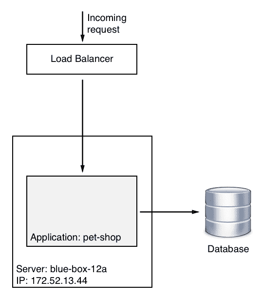
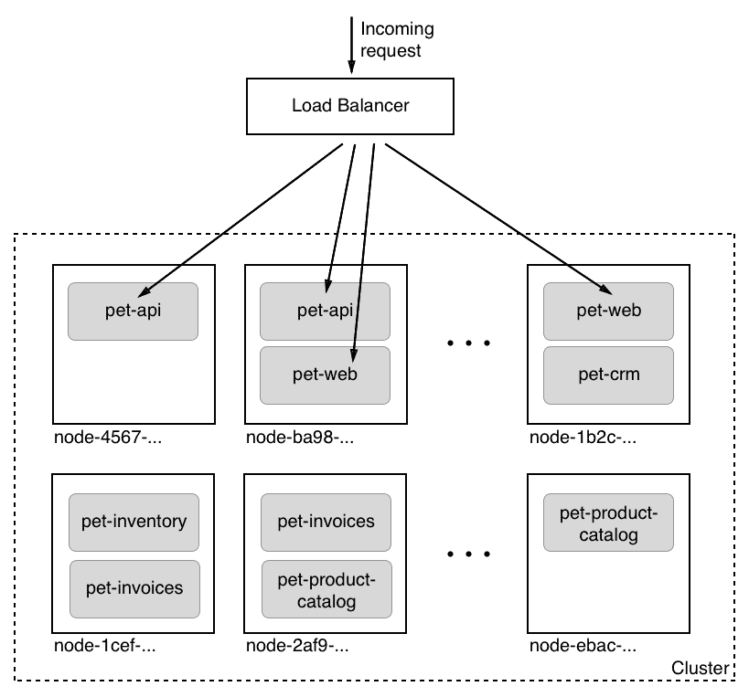
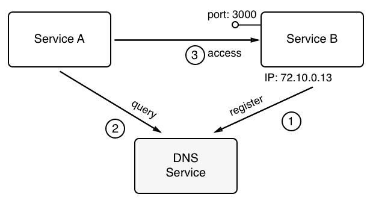
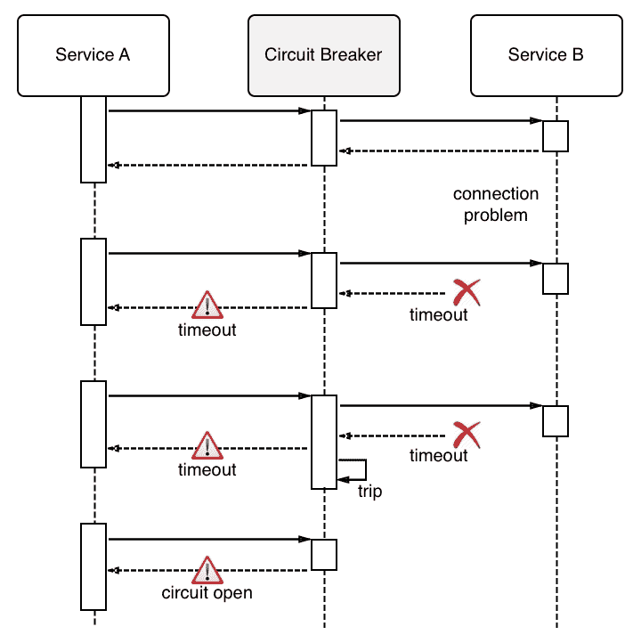
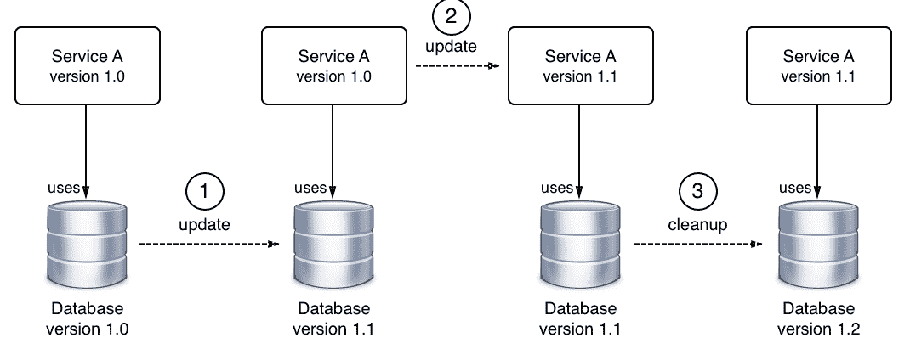

# 第九章：分布式应用架构

在上一章中，我们讨论了在容器化复杂的分布式应用程序或使用 Docker 自动化复杂任务时有用的高级技巧和概念。

在本章中，我们将介绍分布式应用架构的概念，并讨论运行分布式应用所需的各种模式和最佳实践。最后，我们将讨论在生产环境中运行此类应用所需满足的额外要求。

在本章中，我们将涵盖以下主题：

+   理解分布式应用架构

+   模式和最佳实践

+   在生产环境中运行

完成本章后，您将能够做到以下事情：

+   至少列出分布式应用架构的四个特征

+   列出需要在生产环境中实施的三到四种模式

# 理解分布式应用架构

在本节中，我们将解释当我们谈论分布式应用架构时的含义。首先，我们需要确保我们使用的所有单词或首字母缩写都有意义，并且我们都在说同样的语言。

# 定义术语

在本章和后续章节中，我们将谈论许多可能不为所有人熟悉的概念。为了确保我们都在说同样的语言，让我们简要介绍和描述这些概念或词语中最重要的：

| 术语 | 解释 |
| --- | --- |
| 虚拟机 | 虚拟机的缩写。这是一台虚拟计算机。 |
| 节点 | 用于运行应用程序的单个服务器。这可以是物理服务器，通常称为裸金属，也可以是虚拟机。可以是大型机、超级计算机、标准业务服务器，甚至是树莓派。节点可以是公司自己数据中心或云中的计算机。通常，节点是集群的一部分。 |
| 集群 | 由网络连接的节点组成，用于运行分布式应用。 |
| 网络 | 集群中各个节点之间的物理和软件定义的通信路径，以及在这些节点上运行的程序。 |
| 端口 | 应用程序（如 Web 服务器）监听传入请求的通道。 |
| 服务 | 不幸的是，这是一个非常负载的术语，它的真正含义取决于它所使用的上下文。如果我们在应用程序的上下文中使用术语*服务*，那么通常意味着这是一个实现了一组有限功能的软件，然后被应用程序的其他部分使用。随着我们在本书中的进展，将讨论具有稍微不同定义的其他类型的服务。 |

天真地说，分布式应用架构是单片应用架构的反义词，但首先看看这种单片架构也并非不合理。传统上，大多数业务应用都是以这种方式编写的，结果可以看作是一个单一的、紧密耦合的程序，运行在数据中心的某个命名服务器上。它的所有代码都被编译成一个单一的二进制文件，或者几个非常紧密耦合的二进制文件，在运行应用程序时需要共同定位。服务器，或者更一般的主机，应用程序运行的这一事实具有明确定义的名称或静态 IP 地址，在这种情况下也是重要的。让我们看下面的图表，更清楚地说明这种类型的应用架构：

单片应用架构

在前面的图表中，我们可以看到一个名为`blue-box-12a`的**服务器**，具有`172.52.13.44`的**IP**地址，运行一个名为`pet-shop`的应用程序，它是一个由主模块和几个紧密耦合的库组成的单片。

现在，让我们看一下以下的图表：

分布式应用架构

在这里，突然之间，我们不再只有一个命名的服务器；相反，我们有很多服务器，它们没有人类友好的名称，而是一些可以是类似于**通用唯一标识符**（**UUID**）的唯一 ID。突然之间，宠物商店应用程序也不再只是由一个单一的单片块组成，而是由许多相互作用但松散耦合的服务组成，例如**pet-api**、**pet-web**和**pet-inventory**。此外，每个服务在这个服务器或主机集群中运行多个实例。

你可能会想为什么我们在一本关于 Docker 容器的书中讨论这个问题，你问得对。虽然我们要调查的所有主题同样适用于容器尚未存在的世界，但重要的是要意识到，容器和容器编排引擎可以以更高效和直接的方式解决所有这些问题。在容器化的世界中，以前在分布式应用架构中很难解决的大多数问题变得相当简单。

# 模式和最佳实践

分布式应用架构具有许多引人注目的好处，但与单片应用架构相比，它也有一个非常重要的缺点——前者要复杂得多。为了控制这种复杂性，该行业提出了一些重要的最佳实践和模式。在接下来的章节中，我们将更详细地研究其中一些最重要的内容。

# 松散耦合的组件

解决复杂问题的最佳方法一直是将其分解为更易管理的较小子问题。举个例子，一步到位地建造一座房子将会非常复杂。将房子从简单的部件组合成最终结果会更容易。

同样适用于软件开发。如果我们将这个应用程序分解成相互协作并构成整体应用程序的较小组件，那么开发一个非常复杂的应用程序就会变得更容易。现在，如果这些组件之间的耦合度较低，那么单独开发这些组件就会变得更容易。这意味着组件 A 不会对组件 B 和 C 的内部工作做任何假设，而只关心它如何通过明确定义的接口与这两个组件进行通信。

如果每个组件都有一个明确定义且简单的公共接口，通过该接口与系统中的其他组件和外部世界进行通信，那么这将使我们能够单独开发每个组件，而不会对其他组件产生隐式依赖。在开发过程中，系统中的其他组件可以很容易地被存根或模拟替换，以便我们测试我们的组件。

# 有状态与无状态

每个有意义的业务应用程序都会创建、修改或使用数据。在 IT 中，数据的同义词是“状态”。创建或修改持久数据的应用服务称为有状态组件。典型的有状态组件是数据库服务或创建文件的服务。另一方面，不创建或修改持久数据的应用组件称为无状态组件。

在分布式应用架构中，无状态组件比有状态组件更容易处理。无状态组件可以轻松地进行扩展和缩减。此外，它们可以快速而轻松地在集群的完全不同节点上关闭和重新启动，因为它们与持久数据没有关联。

鉴于这一事实，有助于以大多数应用服务为无状态的方式设计系统。最好将所有有状态组件推到应用程序的边界并限制它们的数量。管理有状态组件很困难。

# 服务发现

构建应用程序时，通常由许多个体组件或相互通信的服务组成，我们需要一种机制，允许个体组件在集群中找到彼此。找到彼此通常意味着您需要知道目标组件在哪个节点上运行，以及它在哪个端口上监听通信。大多数情况下，节点由 IP 地址和端口标识，端口只是一个在明确定义范围内的数字。

从技术上讲，我们可以告诉想要与目标“服务 B”通信的“服务 A”，目标的 IP 地址和端口是什么。例如，这可以通过配置文件中的条目来实现。

组件是硬连线的

在单体应用程序的上下文中，这可能非常有效，该应用程序在一个或仅有几个知名和精心策划的服务器上运行，但在分布式应用程序架构中完全失效。首先，在这种情况下，我们有许多组件，手动跟踪它们变成了一场噩梦。这绝对不可扩展。此外，**服务 A**通常不应该或永远不会知道其他组件在集群的哪个节点上运行。它们的位置甚至可能不稳定，因为组件 B 可能由于应用程序外部的各种原因从节点 X 移动到另一个节点 Y。因此，我们需要另一种方式，**服务 A**可以找到**服务 B**，或者其他任何服务。最常用的是一个外部机构，它在任何给定时间都了解系统的拓扑结构。

这个外部机构或服务知道当前属于集群的所有节点和它们的 IP 地址；它知道所有正在运行的服务以及它们在哪里运行。通常，这种服务被称为**DNS 服务**，其中**DNS**代表**域名系统**。正如我们将看到的，Docker 实现了一个作为底层引擎的 DNS 服务。Kubernetes - 首要的容器编排系统，我们将在第十二章中讨论，*编排器* - 也使用**DNS 服务**来促进集群中运行的组件之间的通信。 

组件咨询外部定位器服务

在前面的图表中，我们可以看到**服务 A**想要与**服务 B**通信，但它无法直接做到这一点。首先，它必须查询外部机构，一个注册表服务（这里称为**DNS 服务**），询问**服务 B**的下落。注册表服务将回答所请求的信息，并提供**服务 A**可以用来到达**服务 B**的 IP 地址和端口号。**服务 A**然后使用这些信息并与**服务 B**建立通信。当然，这只是一个关于低级别实际发生情况的天真图像，但它是一个帮助我们理解服务发现架构模式的好图像。

# 路由

路由是将数据包从源组件发送到目标组件的机制。路由被分类为不同类型。所谓的 OSI 模型（有关更多信息，请参阅本章的*进一步阅读*部分中的参考资料）用于区分不同类型的路由。在容器和容器编排的上下文中，第 2、3、4 和 7 层的路由是相关的。我们将在后续章节中更详细地讨论路由。在这里，让我们只说第 2 层路由是最低级别的路由类型，它将 MAC 地址连接到另一个 MAC 地址，而第 7 层路由，也称为应用级路由，是最高级别的路由。后者例如用于将具有目标标识符（即 URL）的请求路由到我们系统中的适当目标组件。

# 负载均衡

负载均衡在服务 A 需要与服务 B 通信时使用，比如在请求-响应模式中，但后者运行在多个实例中，如下图所示：

服务 A 的请求被负载均衡到服务 B

如果我们的系统中运行着多个服务 B 的实例，我们希望确保每个实例都被分配了相等的工作负载。这是一个通用的任务，这意味着我们不希望调用者进行负载均衡，而是希望一个外部服务拦截调用并决定将调用转发给目标服务实例的部分。这个外部服务被称为负载均衡器。负载均衡器可以使用不同的算法来决定如何将传入的调用分发给目标服务实例。最常用的算法称为轮询。这个算法只是以重复的方式分配请求，从实例 1 开始，然后是 2，直到实例 n。在最后一个实例被服务后，负载均衡器重新从实例 1 开始。

在前面的例子中，负载均衡器还有助于高可用性，因为来自服务 A 的请求将被转发到健康的服务 B 实例。负载均衡器还承担定期检查 B 的每个实例健康状况的角色。

# 防御性编程

在开发分布式应用程序的服务时，重要的是要记住这个服务不会是独立的，它依赖于其他应用程序服务，甚至依赖于第三方提供的外部服务，比如信用卡验证服务或股票信息服务，仅举两个例子。所有这些其他服务都是我们正在开发的服务的外部服务。我们无法控制它们的正确性或它们在任何给定时间的可用性。因此，在编码时，我们总是需要假设最坏的情况，并希望最好的结果。假设最坏的情况意味着我们必须明确处理潜在的故障。

# 重试

当外部服务可能暂时不可用或响应不够及时时，可以使用以下程序。当对其他服务的调用失败或超时时，调用代码应以一种结构化的方式进行，以便在短暂的等待时间后重复相同的调用。如果再次失败，下一次尝试前等待时间应稍长。应重复调用，直到达到最大次数，每次增加等待时间。之后，服务应放弃并提供降级服务，这可能意味着返回一些陈旧的缓存数据或根据情况根本不返回数据。

# 日志记录

对服务执行的重要操作应始终记录。日志信息需要分类，才能具有真正的价值。常见的分类列表包括调试、信息、警告、错误和致命。日志信息应由中央日志聚合服务收集，而不应存储在集群的单个节点上。聚合日志易于解析和过滤相关信息。这些信息对于快速定位由许多运行在生产环境中的移动部件组成的分布式系统中的故障或意外行为的根本原因至关重要。

# 错误处理

正如我们之前提到的，分布式应用程序中的每个应用服务都依赖于其他服务。作为开发人员，我们应该始终预料到最坏的情况，并采取适当的错误处理措施。最重要的最佳实践之一是快速失败。以这样的方式编写服务，使得不可恢复的错误尽早被发现，如果检测到这样的错误，立即使服务失败。但不要忘记记录有意义的信息到`STDERR`或`STDOUT`，以便开发人员或系统操作员以后可以用来跟踪系统的故障。同时，向调用者返回有用的错误信息，尽可能准确地指出调用失败的原因。

快速失败的一个示例是始终检查调用者提供的输入值。这些值是否在预期范围内并且完整？如果不是，那么不要尝试继续处理；而是立即中止操作。

# 冗余

一个使命关键的系统必须全天候、全年无休地可用。停机是不可接受的，因为它可能导致公司机会或声誉的巨大损失。在高度分布式的应用程序中，至少有一个涉及的组件失败的可能性是不可忽视的。我们可以说问题不在于一个组件是否会失败，而在于失败将在何时发生。

为了避免系统中的许多组件之一出现故障时停机，系统的每个单独部分都需要是冗余的。这包括应用程序组件以及所有基础设施部分。这意味着，如果我们的应用程序中有一个支付服务，那么我们需要冗余地运行这个服务。最简单的方法是在集群的不同节点上运行这个服务的多个实例。同样，对于边缘路由器或负载均衡器也是如此。我们不能承受它出现故障的风险。因此，路由器或负载均衡器必须是冗余的。

# 健康检查

我们已经多次提到，在分布式应用程序架构中，由于其许多部分，单个组件的故障是非常可能的，而且只是时间问题。因此，我们将系统的每个单个组件都运行冗余。代理服务然后在服务的各个实例之间平衡流量。

但现在，又出现了另一个问题。代理或路由器如何知道某个服务实例是否可用？它可能已经崩溃或者无响应。为了解决这个问题，我们可以使用所谓的健康检查。代理或代理的其他系统服务定期轮询所有服务实例并检查它们的健康状况。基本上问题是，你还在吗？你健康吗？对每个服务的答案要么是是，要么是否，或者如果实例不再响应，则健康检查超时。

如果组件回答“否”或发生超时，那么系统将终止相应的实例并在其位置上启动一个新的实例。如果所有这些都是以完全自动化的方式发生的，那么我们可以说我们有一个自愈系统。

代理定期轮询组件的状态的责任可以被转移。组件也可以被要求定期向代理发送活动信号。如果一个组件在预定义的延长时间内未能发送活动信号，就被认为是不健康或已死亡。

有时候，上述的任一方式更为合适。

# 断路器模式

断路器是一种机制，用于避免分布式应用因许多重要组件的级联故障而崩溃。断路器有助于避免一个故障组件以多米诺效应拖垮其他依赖服务。就像电气系统中的断路器一样，它通过切断电源线来保护房屋免受由于插入式设备故障而导致的火灾，分布式应用中的断路器在**服务 A**到**服务 B**的连接中断，如果后者没有响应或者发生故障。

这可以通过将受保护的服务调用包装在断路器对象中来实现。该对象监视故障。一旦故障次数达到一定阈值，断路器就会跳闸。所有随后对断路器的调用都将返回错误，而根本不会进行受保护的调用：

断路器模式

在前面的图表中，我们有一个断路器，在调用**服务 B**时收到第二个超时后会跳闸。

# 在生产中运行

要成功地在生产环境中运行分布式应用程序，我们需要考虑在前面部分介绍的最佳实践和模式之外的一些方面。一个特定的领域是内省和监控。让我们详细介绍最重要的方面。

# 日志记录

一旦分布式应用程序投入生产，就不可能进行实时调试。但是我们如何找出应用程序故障的根本原因呢？解决这个问题的方法是应用程序在运行时产生丰富而有意义的日志信息。开发人员需要以这样的方式对其应用程序服务进行工具化，以便输出有用的信息，例如发生错误时或遇到潜在的意外或不需要的情况时。通常，这些信息输出到`STDOUT`和`STDERR`，然后由系统守护进程收集并将信息写入本地文件或转发到中央日志聚合服务。

如果日志中有足够的信息，开发人员可以使用这些日志来追踪系统中错误的根本原因。

在分布式应用程序架构中，由于其许多组件，日志记录甚至比在单体应用程序中更为重要。单个请求通过应用程序的所有组件的执行路径可能非常复杂。还要记住，这些组件分布在一个节点集群中。因此，记录所有重要信息并向每个日志条目添加诸如发生时间、发生组件和运行组件的节点等信息是有意义的。此外，日志信息应聚合在一个中央位置，以便开发人员和系统操作员可以进行分析。

# 跟踪

跟踪用于查找单个请求如何通过分布式应用程序进行传递，以及请求总共花费多少时间以及每个单独组件的时间。如果收集了这些信息，可以将其用作显示系统行为和健康状况的仪表板的信息源之一。

# 监控

运维工程师喜欢有仪表板，显示系统的关键指标，让他们一目了然地了解应用程序的整体健康状况。这些指标可以是非功能指标，如内存和 CPU 使用情况，系统或应用程序组件的崩溃次数，节点的健康状况，以及功能和因此特定于应用程序的指标，如订单系统中的结账次数或库存服务中缺货商品的数量。

大多数情况下，用于聚合仪表板使用的基础数据是从日志信息中提取的。这可以是系统日志，主要用于非功能指标，或者应用程序级别的日志，用于功能指标。

# 应用程序更新

公司的竞争优势之一是能够及时对不断变化的市场情况做出反应。其中一部分是能够快速调整应用程序以满足新的和变化的需求，或者添加新的功能。我们更新应用程序的速度越快，越好。如今，许多公司每天都会推出新的或更改的功能多次。

由于应用程序更新频繁，这些更新必须是非中断的。在升级时，我们不能允许系统进行维护而停机。所有这些都必须无缝、透明地进行。

# 滚动更新

更新应用程序或应用程序服务的一种方法是使用滚动更新。这里的假设是需要更新的特定软件运行在多个实例中。只有在这种情况下，我们才能使用这种类型的更新。

系统停止当前服务的一个实例，并用新服务的实例替换它。一旦新实例准备就绪，它将提供流量服务。通常，新实例会被监视一段时间，以查看它是否按预期工作，如果是，那么当前服务的下一个实例将被关闭并替换为新实例。这种模式重复进行，直到所有服务实例都被替换。

由于总是有一些实例在任何给定时间运行，当前或新的，应用程序始终处于运行状态。不需要停机时间。

# 蓝绿部署

在蓝绿部署中，应用服务的**当前**版本称为**蓝色**，处理所有应用流量。然后我们在生产系统上安装应用服务的新版本，称为**绿色**。新服务尚未与其余应用程序连接。

一旦安装了**绿色**，我们可以对这项新服务执行**烟雾测试**，如果测试成功，路由器可以配置为将以前发送到**蓝色**的所有流量引导到新服务**绿色**。然后密切观察**绿色**的行为，如果所有成功标准都得到满足，**蓝色**可以被废弃。但是，如果由于某种原因**绿色**显示出一些意外或不需要的行为，路由器可以重新配置以将所有流量返回到蓝色。然后可以移除绿色并修复，然后可以使用修正版本执行新的蓝绿部署：

蓝绿部署

接下来，让我们看看金丝雀发布。

# 金丝雀发布

金丝雀发布是指在系统中并行安装当前版本的应用服务和新版本的发布。因此，它们类似于蓝绿部署。起初，所有流量仍然通过当前版本路由。然后我们配置路由器，使其将整体流量的一小部分，比如 1%，引导到应用服务的新版本。随后，密切监视新服务的行为，以找出它是否按预期工作。如果满足了所有成功标准，那么就配置路由器，使其通过新服务引导更多的流量，比如这次是 5%。再次密切监视新服务的行为，如果成功，就会将更多的流量引导到它，直到达到 100%。一旦所有流量都被引导到新服务，并且它已经稳定了一段时间，旧版本的服务就可以被废弃。

为什么我们称之为金丝雀发布？这是以煤矿工人为名，他们会在矿井中使用金丝雀作为早期警报系统。金丝雀对有毒气体特别敏感，如果这样的金丝雀死亡，矿工们就知道他们必须立即离开矿井。

# 不可逆的数据更改

如果我们的更新过程中包括在我们的状态中执行不可逆转的更改，比如在支持关系数据库中执行不可逆转的模式更改，那么我们需要特别小心处理这个问题。如果我们采用正确的方法，就可以在没有停机时间的情况下执行这些更改。重要的是要认识到，在这种情况下，我们不能同时部署需要新数据结构的代码更改和数据更改。相反，整个更新必须分为三个不同的步骤。在第一步中，我们推出一个向后兼容的模式和数据更改。如果这成功了，那么我们在第二步中推出新代码。同样，如果这成功了，我们在第三步中清理模式并删除向后兼容性：

推出不可逆转的数据或模式更改

前面的图表显示了数据及其结构的更新，然后是应用程序代码的更新，最后，在第三步中，数据和数据结构是如何清理的。

# 回滚

如果我们的应用服务在生产中运行并经常更新，迟早会出现其中一个更新的问题。也许开发人员在修复错误时引入了一个新错误，这个错误没有被所有自动化测试和可能的手动测试捕捉到，因此应用程序表现异常，迫切需要将服务回滚到之前的良好版本。在这方面，回滚是从灾难中恢复。

同样，在分布式应用程序架构中，问题不是是否会需要回滚，而是何时需要回滚。因此，我们必须确保我们始终可以回滚到我们应用程序中组成的任何服务的先前版本。回滚不能是事后想到的，它们必须是我们部署过程中经过测试和证明的一部分。

如果我们正在使用蓝绿部署来更新我们的服务，那么回滚应该是相当简单的。我们所需要做的就是将路由器从新的绿色版本的服务切换回之前的蓝色版本。

# 总结

在本章中，我们了解了分布式应用程序架构是什么，以及哪些模式和最佳实践对于成功运行分布式应用程序是有帮助或需要的。最后，我们讨论了在生产中运行这样的应用程序还需要什么。

在下一章中，我们将深入讨论仅限于单个主机的网络。我们将讨论同一主机上的容器如何相互通信，以及外部客户端如何在必要时访问容器化应用程序。

# 问题

请回答以下问题，以评估您对本章内容的理解：

1.  分布式应用架构中的每个部分何时何地需要冗余？用几句话解释。

1.  为什么我们需要 DNS 服务？用三到五句话解释。

1.  什么是断路器，为什么需要它？

1.  单体应用程序和分布式或多服务应用程序之间的一些重要区别是什么？

1.  什么是蓝绿部署？

# 进一步阅读

以下文章提供了关于本章内容的更深入信息：

+   断路器：[`bit.ly/1NU1sgW`](https://bit.ly/2pBENyP)

+   OSI 模型解释：[`bit.ly/1UCcvMt`](https://bit.ly/2BIRpJY)

+   蓝绿部署：[`bit.ly/2r2IxNJ`](http://bit.ly/2r2IxNJ)
