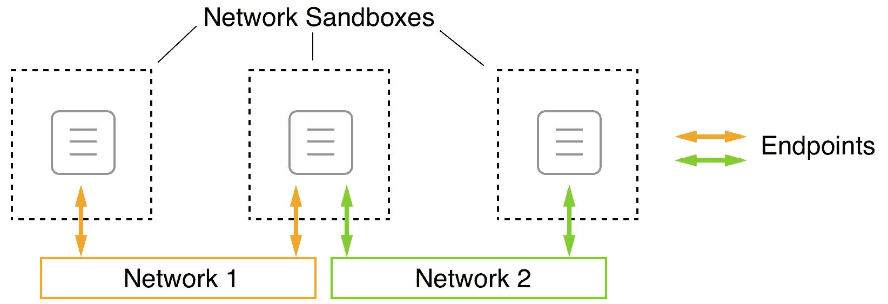
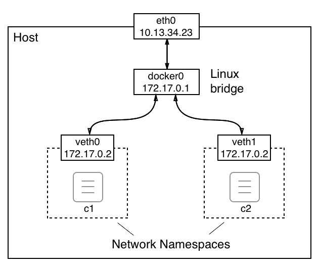
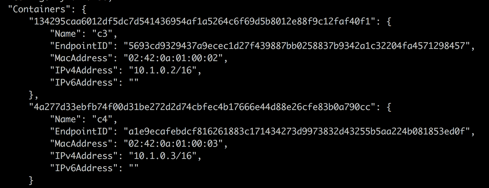
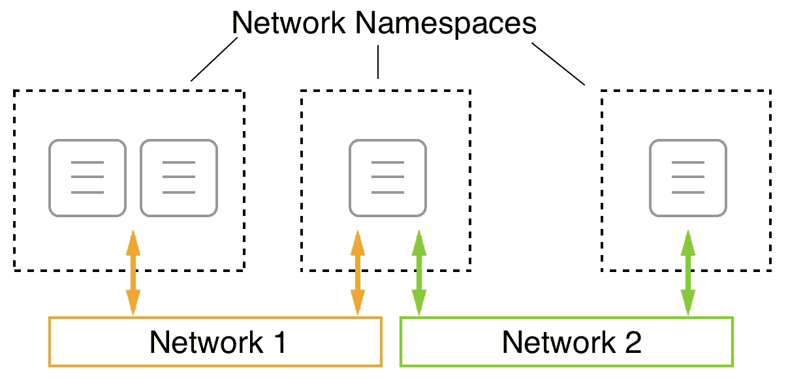
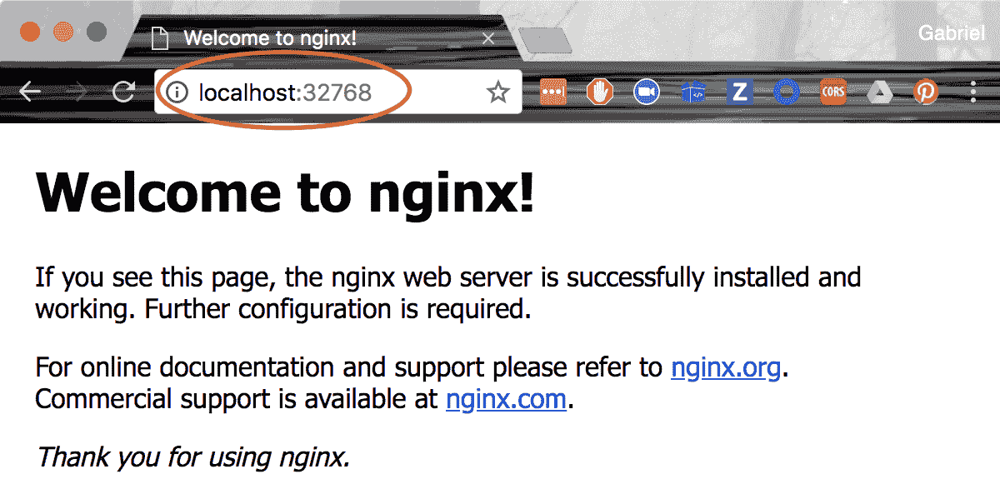

# 第十章：单主机网络

在上一章中，我们了解了处理分布式应用架构时使用的最重要的架构模式和最佳实践。

在本章中，我们将介绍 Docker 容器网络模型及其在桥接网络形式下的单主机实现。本章还介绍了软件定义网络的概念以及它们如何用于保护容器化应用程序。此外，我们将演示如何将容器端口对外开放，从而使容器化组件对外界可访问。最后，我们将介绍 Traefik，一个反向代理，它可以用于在容器之间启用复杂的 HTTP 应用级别路由。

本章涵盖以下主题：

+   解剖容器网络模型

+   网络防火墙

+   使用桥接网络

+   主机和空网络

+   在现有网络命名空间中运行

+   管理容器端口

+   使用反向代理进行 HTTP 级别路由

完成本章后，您将能够执行以下操作：

+   创建、检查和删除自定义桥接网络

+   运行连接到自定义桥接网络的容器

+   通过在不同的桥接网络上运行它们来使容器彼此隔离

+   将容器端口发布到您选择的主机端口

+   添加 Traefik 作为反向代理以启用应用级别路由

# 技术要求

对于本章，您唯一需要的是能够运行 Linux 容器的 Docker 主机。您可以使用带有 Docker for macOS 或 Windows 的笔记本电脑，或者安装了 Docker Toolbox。

# 解剖容器网络模型

到目前为止，我们大部分时间都在处理单个容器。但实际上，一个容器化的业务应用程序由多个容器组成，它们需要合作以实现目标。因此，我们需要一种让单个容器相互通信的方式。这是通过建立我们可以用来在容器之间发送数据包的路径来实现的。这些路径被称为**网络**。 Docker 定义了一个非常简单的网络模型，即所谓的**容器网络模型**（**CNM**），以指定任何实现容器网络的软件必须满足的要求。以下是 CNM 的图形表示：

Docker CNM

CNM 有三个元素-沙盒、端点和网络：

+   **沙盒：** 沙盒完全隔离了容器与外部世界的联系。沙盒容器不允许任何入站网络连接。但是，如果绝对不可能与容器进行任何通信，那么容器在系统中就没有任何价值。为了解决这个问题，我们有第二个元素，即端点。

+   **端点：** 端点是从外部世界进入网络沙盒的受控网关，用于保护容器。端点将网络沙盒（但不是容器）连接到模型的第三个元素，即网络。

+   **网络：** 网络是传输通信实例的数据包的路径，从端点到端点，或者最终从容器到容器。

需要注意的是，网络沙盒可以有零个或多个端点，或者说，生活在网络沙盒中的每个容器可以不连接到任何网络，也可以同时连接到多个不同的网络。在前面的图表中，三个**网络沙盒**中的中间一个通过一个**端点**连接到**网络 1**和**网络 2**。

这种网络模型非常通用，不指定进行网络通信的各个容器在哪里运行。例如，所有容器可以在同一台主机上运行（本地），也可以分布在一个主机集群中（全球）。

当然，CNM 只是描述容器之间网络工作方式的模型。为了能够在容器中使用网络，我们需要 CNM 的真正实现。对于本地和全局范围，我们有多种 CNM 的实现。在下表中，我们简要概述了现有实现及其主要特点。列表没有特定顺序：

| **网络** | **公司** | **范围** | **描述** |
| --- | --- | --- | --- |
| 桥接 | Docker | 本地 | 基于 Linux 桥接的简单网络，允许在单个主机上进行网络连接 |
| Macvlan | Docker | 本地 | 在单个物理主机接口上配置多个第二层（即 MAC）地址 |
| Overlay | Docker | 全球 | 基于**虚拟可扩展局域网**（**VXLan**）的多节点容器网络 |
| Weave Net | Weaveworks | 全球 | 简单、弹性、多主机 Docker 网络 |
| Contiv 网络插件 | Cisco | 全球 | 开源容器网络 |

所有不是由 Docker 直接提供的网络类型都可以作为插件添加到 Docker 主机上。

# 网络防火墙

Docker 一直以安全第一为信条。这种理念直接影响了单个和多主机 Docker 环境中网络设计和实现的方式。软件定义网络易于创建且成本低廉，但它们可以完全防火墙连接到该网络的容器，使其与其他未连接的容器和外部世界隔离。属于同一网络的所有容器可以自由通信，而其他容器则无法这样做。

在下图中，我们有两个名为**front**和**back**的网络。连接到前端网络的有容器**c1**和**c2**，连接到后端网络的有容器**c3**和**c4**。**c1**和**c2**可以自由地相互通信，**c3**和**c4**也可以。但是**c1**和**c2**无法与**c3**或**c4**通信，反之亦然：

Docker 网络

现在，如果我们有一个由三个服务组成的应用程序：**webAPI**，**productCatalog**和**database**？我们希望**webAPI**能够与**productCatalog**通信，但不能与**database**通信，而且我们希望**productCatalog**能够与**database**服务通信。我们可以通过将**webAPI**和数据库放在不同的网络上，并将**productCatalog**连接到这两个网络来解决这个问题，如下图所示：

连接到多个网络的容器

由于创建 SDN 成本低廉，并且每个网络通过将资源与未经授权的访问隔离提供了额外的安全性，因此强烈建议您设计和运行应用程序，使其使用多个网络，并且只在绝对需要相互通信的服务上运行在同一网络上。在前面的例子中，**webAPI**组件绝对不需要直接与**database**服务通信，因此我们将它们放在了不同的网络上。如果最坏的情况发生，黑客入侵了**webAPI**，他们也无法从那里访问**database**而不同时入侵**productCatalog**服务。

# 使用桥接网络

Docker 桥接网络是我们将要详细查看的容器网络模型的第一个实现。这个网络实现是基于 Linux 桥的。当 Docker 守护程序第一次运行时，它会创建一个 Linux 桥并将其命名为`docker0`。这是默认行为，可以通过更改配置来改变。然后 Docker 使用这个 Linux 桥创建一个名为`bridge`的网络。我们在 Docker 主机上创建的所有容器，如果没有明确绑定到另一个网络，都会自动连接到这个桥接网络。

要验证我们的主机上确实有一个名为`bridge`的`bridge`类型网络，我们可以使用以下命令列出主机上的所有网络：

```
$ docker network ls
```

这应该提供类似以下的输出：

列出默认情况下所有可用的 Docker 网络

在你的情况下，ID 会有所不同，但输出的其余部分应该是一样的。我们确实有一个名为`bridge`的第一个网络，使用`bridge`驱动程序。范围为`local`只是意味着这种类型的网络受限于单个主机，不能跨多个主机。在第十三章中，*Docker Swarm 简介*，我们还将讨论其他具有全局范围的网络类型，这意味着它们可以跨整个主机集群。

现在，让我们更深入地了解一下这个桥接网络。为此，我们将使用 Docker 的`inspect`命令：

```
$ docker network inspect bridge
```

执行时，会输出有关所讨论网络的大量详细信息。这些信息应该如下所示：

检查 Docker 桥接网络时生成的输出

当我们列出所有网络时，我们看到了`ID`、`Name`、`Driver`和`Scope`的值，所以这并不是什么新鲜事。但让我们来看看**IP 地址管理**（**IPAM**）块。IPAM 是用于跟踪计算机上使用的 IP 地址的软件。`IPAM`块的重要部分是`Config`节点及其对`Subnet`和`Gateway`的值。桥接网络的子网默认定义为`172.17.0.0/16`。这意味着连接到此网络的所有容器将获得由 Docker 分配的 IP 地址，该地址取自给定范围，即`172.17.0.2`到`172.17.255.255`。`172.17.0.1`地址保留给此网络的路由器，在这种类型的网络中，其角色由 Linux 桥接器承担。我们可以预期，由 Docker 连接到此网络的第一个容器将获得`172.17.0.2`地址。所有后续容器将获得更高的编号；下图说明了这一事实：


桥接网络

在前面的图表中，我们可以看到主机的网络命名空间，其中包括主机的**eth0**端点，如果 Docker 主机在裸机上运行，则通常是一个 NIC，如果 Docker 主机是一个 VM，则是一个虚拟 NIC。所有对主机的流量都通过**eth0**。**Linux 桥接器**负责在主机网络和桥接网络子网之间路由网络流量。

默认情况下，只允许出站流量，所有入站流量都被阻止。这意味着，虽然容器化应用可以访问互联网，但不能被任何外部流量访问。连接到网络的每个容器都会与桥接器建立自己的**虚拟以太网**（**veth**）连接。下图中有示例：

桥接网络的详细信息

前面的图表向我们展示了从**主机**的角度来看世界。我们将在本节的后面探讨从容器内部看这种情况是什么样子的。

我们不仅限于`bridge`网络，因为 Docker 允许我们定义自己的自定义桥接网络。这不仅是一个很好的功能，而且建议最佳实践是不要在同一个网络上运行所有容器。相反，我们应该使用额外的桥接网络来进一步隔离那些不需要相互通信的容器。要创建一个名为`sample-net`的自定义桥接网络，请使用以下命令：

```
$ docker network create --driver bridge sample-net
```

如果我们这样做，我们就可以检查 Docker 为这个新的自定义网络创建了什么子网，如下所示：

```
$ docker network inspect sample-net | grep Subnet
```

这将返回以下值：

```
"Subnet": "172.18.0.0/16",
```

显然，Docker 刚刚为我们的新自定义桥接网络分配了下一个空闲的 IP 地址块。如果出于某种原因，我们想要在创建网络时指定自己的子网范围，我们可以使用`--subnet`参数来实现：

```
$ docker network create --driver bridge --subnet "10.1.0.0/16" test-net
```

为了避免由于重复的 IP 地址而引起的冲突，请确保避免创建具有重叠子网的网络。

现在我们已经讨论了桥接网络是什么，以及我们如何创建自定义桥接网络，我们想要了解如何将容器连接到这些网络。首先，让我们交互式地运行一个 Alpine 容器，而不指定要连接的网络：

```
$ docker container run --name c1 -it --rm alpine:latest /bin/sh
```

在另一个终端窗口中，让我们检查`c1`容器：

```
$ docker container inspect c1
```

在庞大的输出中，让我们集中一下提供与网络相关信息的部分。这可以在`NetworkSettings`节点下找到。我在以下输出中列出了它：

！[](assets/aa6b5fcb-a394-4fa6-85bf-fbdced83fdbe.png)容器元数据的 NetworkSettings 部分

在前面的输出中，我们可以看到容器确实连接到了`bridge`网络，因为`NetworkID`等于`026e65...`，我们可以从前面的代码中看到这是`bridge`网络的 ID。我们还可以看到容器获得了预期的 IP 地址`172.17.0.4`，网关位于`172.17.0.1`。请注意，容器还有一个与之关联的`MacAddress`。这很重要，因为 Linux 桥使用`MacAddress`进行路由。

到目前为止，我们已经从容器的网络命名空间外部进行了讨论。现在，让我们看看当我们不仅在容器内部，而且在容器的网络命名空间内部时情况是什么样的。在`c1`容器内部，让我们使用`ip`工具来检查发生了什么。运行`ip addr`命令并观察生成的输出，如下所示：

容器命名空间，如 IP 工具所示

前面输出的有趣部分是数字`19`，即`eth0`端点。Linux 桥在容器命名空间外创建的`veth0`端点映射到容器内的`eth0`。Docker 始终将容器网络命名空间的第一个端点映射到`eth0`，从命名空间内部看。如果网络命名空间连接到其他网络，则该端点将映射到`eth1`，依此类推。

由于此时我们实际上对`eth0`以外的任何端点都不感兴趣，我们可以使用命令的更具体的变体，它将给我们以下内容：

```
/ # ip addr show eth0
195: eth0@if196: <BROADCAST,MULTICAST,UP,LOWER_UP,M-DOWN> mtu 1500 qdisc noqueue state UP
 link/ether 02:42:ac:11:00:02 brd ff:ff:ff:ff:ff:ff
 inet 172.17.0.2/16 brd 172.17.255.255 scope global eth0
 valid_lft forever preferred_lft forever
```

在输出中，我们还可以看到 Docker 将哪个 MAC 地址（`02:42:ac:11:00:02`）和哪个 IP（`172.17.0.2`）与该容器网络命名空间关联起来。

我们还可以使用`ip route`命令获取有关请求路由的一些信息：

```
/ # ip route
default via 172.17.0.1 dev eth0
172.17.0.0/16 dev eth0 scope link src 172.17.0.2
```

此输出告诉我们，所有流向网关`172.17.0.1`的流量都通过`eth0`设备路由。

现在，让我们在同一网络上运行另一个名为`c2`的容器：

```
$ docker container run --name c2 -d alpine:latest ping 127.0.0.1
```

由于我们没有指定任何其他网络，`c2`容器也将连接到`bridge`网络。它的 IP 地址将是子网中的下一个空闲地址，即`172.17.0.3`，我们可以轻松测试：

```
$ docker container inspect --format "{{.NetworkSettings.IPAddress}}" c2
172.17.0.3
```

现在，我们有两个容器连接到`bridge`网络。我们可以再次尝试检查此网络，以在输出中找到所有连接到它的容器的列表：

```
$ docker network inspect bridge
```

这些信息可以在`Containers`节点下找到：

Docker 网络检查桥的容器部分

再次，为了可读性，我们已将输出缩短为相关部分。

现在，让我们创建两个额外的容器`c3`和`c4`，并将它们附加到`test-net`。为此，我们将使用`--network`参数：

```
$ docker container run --name c3 -d --network test-net \
 alpine:latest ping 127.0.0.1
$ docker container run --name c4 -d --network test-net \
 alpine:latest ping 127.0.0.1
```

让我们检查`network test-net`并确认`c3`和`c4`容器确实连接到它：

```
$ docker network inspect test-net
```

这将为`Containers`部分提供以下输出：

docker network inspect test-net 命令的容器部分

接下来我们要问自己的问题是，`c3`和`c4`容器是否可以自由通信。为了证明这确实是这种情况，我们可以`exec`进入`c3`容器：

```
$ docker container exec -it c3 /bin/sh
```

进入容器后，我们可以尝试通过名称和 IP 地址 ping 容器`c4`：

```
/ # ping c4
PING c4 (10.1.0.3): 56 data bytes
64 bytes from 10.1.0.3: seq=0 ttl=64 time=0.192 ms
64 bytes from 10.1.0.3: seq=1 ttl=64 time=0.148 ms
...
```

以下是使用`c4`的 IP 地址进行 ping 的结果：

```
/ # ping 10.1.0.3
PING 10.1.0.3 (10.1.0.3): 56 data bytes
64 bytes from 10.1.0.3: seq=0 ttl=64 time=0.200 ms
64 bytes from 10.1.0.3: seq=1 ttl=64 time=0.172 ms
...
```

在这两种情况下的答案都向我们确认，连接到同一网络的容器之间的通信正常工作。我们甚至可以使用要连接的容器的名称，这表明 Docker DNS 服务提供的名称解析在这个网络内部工作。

现在，我们要确保`bridge`和`test-net`网络之间有防火墙。为了证明这一点，我们可以尝试从`c3`容器中 ping`c2`容器，无论是通过名称还是 IP 地址：

```
/ # ping c2
ping: bad address 'c2'
```

以下是使用`c2`容器的 IP 地址进行 ping 的结果：

```
/ # ping 172.17.0.3
PING 172.17.0.3 (172.17.0.3): 56 data bytes 
^C
--- 172.17.0.3 ping statistics ---
43 packets transmitted, 0 packets received, 100% packet loss
```

前面的命令一直挂起，我不得不用*Ctrl*+*C*终止命令。从 ping`c2`的输出中，我们还可以看到名称解析在网络之间不起作用。这是预期的行为。网络为容器提供了额外的隔离层，因此增强了安全性。

早些时候，我们了解到一个容器可以连接到多个网络。让我们同时将`c5`容器连接到`sample-net`和`test-net`网络：

```
$ docker container run --name c5 -d \
 --network sample-net \
 --network test-net \
 alpine:latest ping 127.0.0.1
```

现在，我们可以测试`c5`是否可以从`c2`容器中访问，类似于我们测试`c4`和`c2`容器时的情况。结果将显示连接确实有效。

如果我们想要删除一个现有的网络，我们可以使用`docker network rm`命令，但请注意我们不能意外地删除已连接到容器的网络：

```
$ docker network rm test-net
Error response from daemon: network test-net id 863192... has active endpoints
```

在我们继续之前，让我们清理并删除所有的容器：

```
$ docker container rm -f $(docker container ls -aq)
```

现在，我们可以删除我们创建的两个自定义网络：

```
$ docker network rm sample-net
$ docker network rm test-net 
```

或者，我们可以使用`prune`命令删除所有未连接到容器的网络：

```
$ docker network prune --force
```

我在这里使用了`--force`（或`-f`）参数，以防止 Docker 重新确认我是否真的要删除所有未使用的网络。

# 主机和空网络

在本节中，我们将看一下两种预定义且有些独特的网络类型，即`host`和`null`网络。让我们从前者开始。

# 主机网络

有时候，我们希望在主机的网络命名空间中运行容器。当我们需要在容器中运行用于分析或调试主机网络流量的软件时，这可能是必要的。但请记住，这些是非常特定的场景。在容器中运行业务软件时，没有任何理由将相应的容器附加到主机的网络上。出于安全原因，强烈建议您不要在生产环境或类似生产环境中运行任何附加到`host`网络的容器。

也就是说，*我们如何在主机的网络命名空间中运行容器呢？*只需将容器连接到`host`网络即可：

```
$ docker container run --rm -it --network host alpine:latest /bin/sh
```

如果我们使用`ip`工具从容器内部分析网络命名空间，我们会发现得到的结果与直接在主机上运行`ip`工具时完全相同。例如，如果我检查我的主机上的`eth0`设备，我会得到这样的结果：

```
/ # ip addr show eth0
2: eth0: <BROADCAST,MULTICAST,UP,LOWER_UP> mtu 1500 qdisc pfifo_fast state UP qlen 1000
    link/ether 02:50:00:00:00:01 brd ff:ff:ff:ff:ff:ff
    inet 192.168.65.3/24 brd 192.168.65.255 scope global eth0
       valid_lft forever preferred_lft forever
    inet6 fe80::c90b:4219:ddbd:92bf/64 scope link
       valid_lft forever preferred_lft forever
```

在这里，我可以看到`192.168.65.3`是主机分配的 IP 地址，这里显示的 MAC 地址也对应于主机的 MAC 地址。

我们还可以检查路由，得到以下结果（缩短）：

```
/ # ip route
default via 192.168.65.1 dev eth0 src 192.168.65.3 metric 202
10.1.0.0/16 dev cni0 scope link src 10.1.0.1
127.0.0.0/8 dev lo scope host
172.17.0.0/16 dev docker0 scope link src 172.17.0.1
...
192.168.65.0/24 dev eth0 scope link src 192.168.65.3 metric 202
```

在让您继续阅读本章的下一部分之前，我再次要指出，使用`host`网络是危险的，如果可能的话应该避免使用。

# 空网络

有时候，我们需要运行一些不需要任何网络连接来执行任务的应用服务或作业。强烈建议您将这些应用程序运行在附加到`none`网络的容器中。这个容器将完全隔离，因此不会受到任何外部访问的影响。让我们运行这样一个容器：

```
$ docker container run --rm -it --network none alpine:latest /bin/sh
```

一旦进入容器，我们可以验证没有`eth0`网络端点可用：

```
/ # ip addr show eth0
ip: can't find device 'eth0'
```

也没有可用的路由信息，我们可以使用以下命令来证明：

```
/ # ip route
```

这将返回空值。

# 在现有的网络命名空间中运行

通常，Docker 为我们运行的每个容器创建一个新的网络命名空间。容器的网络命名空间对应于我们之前描述的容器网络模型的沙盒。当我们将容器连接到网络时，我们定义一个端点，将容器的网络命名空间与实际网络连接起来。这样，我们每个网络命名空间有一个容器。

Docker 为我们提供了另一种定义容器运行的网络命名空间的方法。在创建新容器时，我们可以指定它应该附加到（或者我们应该说包含在）现有容器的网络命名空间中。通过这种技术，我们可以在单个网络命名空间中运行多个容器：

在单个网络命名空间中运行多个容器

在前面的图中，我们可以看到在最左边的**网络** **命名空间**中，我们有两个容器。由于它们共享相同的命名空间，这两个容器可以在本地主机上相互通信。然后将网络命名空间（而不是单个容器）附加到**网络 1**。

当我们想要调试现有容器的网络而不在该容器内运行其他进程时，这是非常有用的。我们只需将特殊的实用容器附加到要检查的容器的网络命名空间即可。这个特性也被 Kubernetes 在创建 pod 时使用。我们将在本书的第十五章中学习更多关于 Kubernetes 和 pod 的知识，*Kubernetes 简介*。

现在，让我们演示一下这是如何工作的：

1.  首先，我们创建一个新的桥接网络：

```
$ docker network create --driver bridge test-net
```

1.  接下来，我们运行一个附加到这个网络的容器：

```
$ docker container run --name web -d \
 --network test-net nginx:alpine
```

1.  最后，我们运行另一个容器并将其附加到我们的`web`容器的网络中：

```
$ docker container run -it --rm --network container:web \
alpine:latest /bin/sh
```

特别要注意我们如何定义网络：`--network container:web`。这告诉 Docker 我们的新容器应该使用与名为`web`的容器相同的网络命名空间。

1.  由于新容器与运行 nginx 的 web 容器在相同的网络命名空间中，我们现在可以在本地访问 nginx！我们可以通过使用 Alpine 容器的一部分的`wget`工具来证明这一点，以连接到 nginx。我们应该看到以下内容：

```
/ # wget -qO - localhost
<!DOCTYPE html>
<html>
<head>
<title>Welcome to nginx!</title>
...
</html>
```

请注意，为了便于阅读，我们已经缩短了输出。还请注意，在运行附加到相同网络的两个容器和在相同网络命名空间中运行两个容器之间存在重要区别。在这两种情况下，容器可以自由地相互通信，但在后一种情况下，通信发生在本地主机上。

1.  要清理容器和网络，我们可以使用以下命令：

```
$ docker container rm --force web
$ docker network rm test-net
```

在下一节中，我们将学习如何在容器主机上公开容器端口。

# 管理容器端口

现在我们知道了我们可以通过将它们放在不同的网络上来隔离防火墙容器，并且我们可以让一个容器连接到多个网络，但是还有一个问题没有解决。*我们如何将应用服务暴露给外部世界？*想象一下一个容器运行着一个 Web 服务器，托管着我们之前的 WebAPI。我们希望来自互联网的客户能够访问这个 API。我们已经设计它为一个公开访问的 API。为了实现这一点，我们必须象征性地打开我们防火墙中的一个门，通过这个门我们可以将外部流量传递到我们的 API。出于安全原因，我们不只是想要敞开大门；我们希望有一个单一受控的门，流量可以通过。

我们可以通过将容器端口映射到主机上的一个可用端口来创建这样的门。我们也称之为打开一个通往容器端口的门以发布一个端口。请记住，容器有自己的虚拟网络堆栈，主机也有。因此，默认情况下，容器端口和主机端口完全独立存在，根本没有任何共同之处。但是现在我们可以将一个容器端口与一个空闲的主机端口连接起来，并通过这个链接传递外部流量，如下图所示：


将容器端口映射到主机端口

但现在，是时候演示如何实际将容器端口映射到主机端口了。这是在创建容器时完成的。我们有不同的方法来做到这一点：

1.  首先，我们可以让 Docker 决定将我们的容器端口映射到哪个主机端口。Docker 将在 32xxx 范围内选择一个空闲的主机端口进行自动映射，这是通过使用`-P`参数完成的：

```
$ docker container run --name web -P -d nginx:alpine
```

上述命令在一个容器中运行了一个 nginx 服务器。nginx 在容器内部监听端口`80`。使用`-P`参数，我们告诉 Docker 将所有暴露的容器端口映射到 32xxx 范围内的一个空闲端口。我们可以通过使用`docker container port`命令找出 Docker 正在使用的主机端口：

```
$ docker container port web
80/tcp -> 0.0.0.0:32768
```

nginx 容器只暴露端口`80`，我们可以看到它已经映射到主机端口`32768`。如果我们打开一个新的浏览器窗口并导航到`localhost:32768`，我们应该会看到以下屏幕：



nginx 的欢迎页面

1.  找出 Docker 用于我们的容器的主机端口的另一种方法是检查它。主机端口是`NetworkSettings`节点的一部分：

```
$ docker container inspect web | grep HostPort
32768
```

1.  最后，获取这些信息的第三种方法是列出容器：

```
$ docker container ls
CONTAINER ID    IMAGE         ...   PORTS                  NAMES
56e46a14b6f7    nginx:alpine  ...   0.0.0.0:32768->80/tcp  web
```

请注意，在上述输出中，`/tcp`部分告诉我们该端口已经为 TCP 协议通信打开，但未为 UDP 协议打开。TCP 是默认的，如果我们想指定为 UDP 打开端口，那么我们必须明确指定。映射中的`0.0.0.0`告诉我们，任何主机 IP 地址的流量现在都可以到达`web`容器的端口`80`。

有时，我们想将容器端口映射到一个非常特定的主机端口。我们可以使用`-p`参数（或`--publish`）来实现这一点。让我们看看如何使用以下命令来实现这一点：

```
$ docker container run --name web2 -p 8080:80 -d nginx:alpine
```

`-p`参数的值的格式为`<主机端口>:<容器端口>`。因此，在上述情况中，我们将容器端口`80`映射到主机端口`8080`。一旦`web2`容器运行，我们可以通过浏览器导航到`localhost:8080`来测试它，我们应该会看到与处理自动端口映射的上一个示例中看到的相同的 nginx 欢迎页面。

使用 UDP 协议进行特定端口通信时，`publish`参数看起来像`-p 3000:4321/udp`。请注意，如果我们想要允许在同一端口上使用 TCP 和 UDP 协议进行通信，那么我们必须分别映射每个协议。

# 使用反向代理进行 HTTP 级别的路由

想象一下，你被要求将一个庞大的应用程序容器化。这个应用程序多年来已经自然地演变成了一个难以维护的怪物。由于代码库中存在紧密耦合，即使是对源代码进行微小的更改也可能会破坏其他功能。由于其复杂性，发布版本很少，并且需要整个团队全力以赴。在发布窗口期间必须关闭应用程序，这会给公司带来很大的损失，不仅是由于失去的机会，还有他们的声誉损失。

管理层已决定结束这种恶性循环，并通过容器化单体应用来改善情况。这一举措将大大缩短发布之间的时间，正如行业所见。在随后的步骤中，公司希望从单体应用中分离出每一个功能，并将它们实现为微服务。这个过程将持续进行，直到单体应用完全被分解。

但正是这第二点让参与其中的团队感到困惑。我们如何将单体应用分解为松耦合的微服务，而不影响单体应用的众多客户？单体应用的公共 API 虽然非常复杂，但设计得很结构化。公共 URI 已经经过精心设计，绝对不能改变。例如，应用程序中实现了一个产品目录功能，可以通过`https://acme.com/catalog?category=bicycles`来访问，以便我们可以访问公司提供的自行车列表。

另一方面，有一个名为`https://acme.com/checkout`的 URL，我们可以用它来启动客户购物车的结账，等等。我希望大家清楚我们要做什么。

# 容器化单体应用

让我们从单体应用开始。我已经准备了一个简单的代码库，它是用 Python 2.7 实现的，并使用 Flask 来实现公共 REST API。示例应用程序并不是一个完整的应用程序，但足够复杂，可以进行一些重新设计。示例代码可以在`ch10/e-shop`文件夹中找到。在这个文件夹中有一个名为`monolith`的子文件夹，其中包含 Python 应用程序。按照以下步骤进行：

1.  在新的终端窗口中，导航到该文件夹，安装所需的依赖项，并运行应用程序：

```
$ cd ~/fod/ch10/e-shop/monolith
$ pip install -r requirements.txt
$ export FLASK_APP=main.py 
$ flask run
```

应用程序将在`localhost`的`5000`端口上启动并监听：


运行 Python 单体应用

1.  我们可以使用`curl`来测试应用程序。使用以下命令来检索公司提供的所有自行车的列表：

```
$ curl localhost:5000/catalog?category=bicycles [{"id": 1, "name": "Mountanbike Driftwood 24\"", "unitPrice": 199}, {"id": 2, "name": "Tribal 100 Flat Bar Cycle Touring Road Bike", "unitPrice": 300}, {"id": 3, "name": "Siech Cycles Bike (58 cm)", "unitPrice": 459}]
```

您应该看到一个 JSON 格式的自行车类型列表。好吧，目前为止一切顺利。

1.  现在，让我们更改`hosts`文件，为`acme.com`添加一个条目，并将其映射到`127.0.0.1`，即环回地址。这样，我们可以模拟一个真实的客户端使用 URL `http://acme.cnoteom/catalog?category=bicycles` 访问应用程序，而不是使用`localhost`。在 macOS 或 Linux 上，您需要使用 sudo 来编辑 hosts 文件。您应该在`hosts`文件中添加一行，看起来像这样：

```
127.0.0.1  acme.com  
```

1.  保存您的更改，并通过 ping `acme.com`来确认它是否正常工作：


通过`hosts`文件将`acme.com`映射到环回地址在 Windows 上，您可以通过以管理员身份运行记事本，打开`c:\Windows\System32\Drivers\etc\hosts`文件并修改它来编辑文件。

经过所有这些步骤，现在是时候将应用程序容器化了。我们需要做的唯一更改是确保应用程序 Web 服务器侦听`0.0.0.0`而不是`localhost`。

1.  我们可以通过修改应用程序并在`main.py`的末尾添加以下启动逻辑来轻松实现这一点：

```
if __name__ == '__main__':
    app.run(host='0.0.0.0', port=5000)
```

然后，我们可以使用`python main.py`启动应用程序。

1.  现在，在`monolith`文件夹中添加一个`Dockerfile`，内容如下：

```
FROM python:3.7-alpine
WORKDIR /app
COPY requirements.txt ./
RUN pip install -r requirements.txt
COPY . .
EXPOSE 5000
CMD python main.py
```

1.  在您的终端窗口中，从单体文件夹中执行以下命令，为应用程序构建 Docker 镜像：

```
$ docker image build -t acme/eshop:1.0 .
```

1.  构建完镜像后，尝试运行应用程序：

```
$ docker container run --rm -it \
 --name eshop \
 -p 5000:5000 \
 acme/eshop:1.0
```

请注意，现在在容器内运行的应用程序的输出与在主机上直接运行应用程序时获得的输出是无法区分的。现在，我们可以使用两个`curl`命令来访问目录和结账逻辑，测试应用程序是否仍然像以前一样工作：


在容器中运行时测试单体应用程序

显然，即使使用正确的 URL，即`http://acme.com`，单体仍然以与以前完全相同的方式工作。太好了！现在，让我们将单体的一部分功能拆分为一个 Node.js 微服务，这将被单独部署。

# 提取第一个微服务

团队经过一番头脑风暴后决定，产品`catalog`是第一个具有内聚力且足够独立的功能片段，可以从单体中提取出来作为微服务实现。他们决定将产品目录实现为一个基于 Node.js 的微服务。

您可以在项目文件夹的`e-shop`的`catalog`子文件夹中找到他们提出的代码和`Dockerfile`。这是一个简单的 Express.js 应用程序，复制了以前在单体中可用的功能。让我们开始吧：

1.  在您的终端窗口中，从`catalog`文件夹中构建这个新的微服务的 Docker 镜像：

```
$ docker image build -t acme/catalog:1.0 .
```

1.  然后，从您刚刚构建的新镜像中运行一个容器：

```
$ docker run --rm -it --name catalog -p 3000:3000 acme/catalog:1.0
```

1.  从另一个终端窗口中，尝试访问微服务并验证它返回与单体相同的数据：

```
$ curl http://acme.com:3000/catalog?type=bicycle
```

请注意与访问单体应用程序中相同功能时的 URL 的差异。在这里，我们正在访问端口`3000`上的微服务（而不是`5000`）。但是我们说过，我们不想改变访问我们电子商店应用程序的客户端。我们能做什么？幸运的是，有解决这类问题的解决方案。我们需要重新路由传入的请求。我们将在下一节中向您展示如何做到这一点。

# 使用 Traefik 重新路由流量

在上一节中，我们意识到我们将不得不将以`http://acme.com:5000/catalog`开头的目标 URL 的传入流量重新路由到另一个 URL，例如`product-catalog:3000/catalog`。我们将使用 Traefik 来偏向这样做。

Traefik 是一个云原生边缘路由器，它是开源的，这对我们来说非常好。它甚至有一个漂亮的 Web UI，您可以用来管理和监视您的路由。Traefik 可以与 Docker 非常直接地结合使用，我们马上就会看到。

为了与 Docker 很好地集成，Traefik 依赖于在每个容器或服务中找到的元数据。这些元数据可以以包含路由信息的标签的形式应用。

首先，让我们看一下如何运行目录服务：

1.  这是 Docker `run`命令：

```
$ docker container run --rm -d \
 --name catalog \
 --label traefik.enable=true \
 --label traefik.port=3000 \
 --label traefik.priority=10 \
 --label traefik.http.routers.catalog.rule="Host(\"acme.com\") && PathPrefix(\"/catalog\")" \
 acme/catalog:1.0
```

1.  让我们快速看一下我们定义的四个标签：

+   +   `traefik.enable=true`：这告诉 Traefik 这个特定的容器应该包括在路由中（默认值为`false`）。

+   `traefik.port=3000`：路由器应将调用转发到端口`3000`（这是 Express.js 应用程序正在监听的端口）。

+   `traefik.priority=10`：给这条路线高优先级。我们马上就会看到为什么。

+   `traefik.http.routers.catalog.rule="Host(\"acme.com\") && PathPrefix(\"/catalog\")"`：路由必须包括主机名`acme.com`，路径必须以`/catalog`开头才能被重定向到该服务。例如，`acme.com/catalog?type=bicycles`符合此规则。

请注意第四个标签的特殊形式。它的一般形式是`traefik.http.routers.<service name>.rule`。

1.  现在，让我们看看如何运行`eshop`容器：

```
$ docker container run --rm -d \
    --name eshop \
    --label traefik.enable=true \
    --label traefik.port=5000 \
    --label traefik.priority=1 \
    --label traefik.http.routers.eshop.rule="Host(\"acme.com\")" \
    acme/eshop:1.0
```

在这里，我们将任何匹配的调用转发到端口`5000`，这对应于`eshop`应用程序正在监听的端口。请注意优先级设置为`1`（低）。这与`catalog`服务的高优先级结合起来，使我们能够过滤出所有以`/catalog`开头的 URL，并将其重定向到`catalog`服务，而所有其他 URL 将转到`eshop`服务。

1.  现在，我们终于可以将 Traefik 作为边缘路由器运行，它将作为我们应用程序前面的反向代理。这是我们启动它的方式：

```
$ docker run -d \
 --name traefik \
 -p 8080:8080 \
 -p 80:80 \
 -v /var/run/docker.sock:/var/run/docker.sock \
 traefik:v2.0 --api.insecure=true --providers.docker

```

注意我们如何将 Docker 套接字挂载到容器中，以便 Traefik 可以与 Docker 引擎交互。我们将能够将 Web 流量发送到 Traefik 的端口`80`，然后根据参与容器的元数据中的路由定义，根据我们的规则进行重定向。此外，我们可以通过端口`8080`访问 Traefik 的 Web UI。

现在一切都在运行，即单体应用程序，第一个名为`catalog`的微服务和 Traefik，我们可以测试一切是否按预期工作。再次使用`curl`来测试：

```
$ curl http://acme.com/catalog?type=bicycles
$ curl http://acme.com/checkout
```

正如我们之前提到的，现在我们将所有流量发送到端口`80`，这是 Traefik 正在监听的端口。然后，这个代理将把流量重定向到正确的目的地。

在继续之前，请停止所有容器：

```
$ docker container rm -f traefik eshop catalog
```

这就是本章的全部内容。

# 摘要

在本章中，我们了解了单个主机上运行的容器如何相互通信。首先，我们看了一下 CNM，它定义了容器网络的要求，然后我们调查了 CNM 的几种实现，比如桥接网络。然后我们详细了解了桥接网络的功能，以及 Docker 提供给我们有关网络和连接到这些网络的容器的信息。我们还学习了如何从容器的内外采用两种不同的视角。最后，我们介绍了 Traefik 作为一种提供应用级路由到我们的应用程序的手段。

在下一章中，我们将介绍 Docker Compose。我们将学习如何创建一个由多个服务组成的应用程序，每个服务在一个容器中运行，并且 Docker Compose 如何允许我们使用声明性方法轻松构建、运行和扩展这样的应用程序。

# 问题

为了评估您从本章中获得的技能，请尝试回答以下问题：

1.  命名**容器网络模型**（**CNM**）的三个核心元素。

1.  如何创建一个名为`frontend`的自定义桥接网络？

1.  如何运行两个连接到`frontend`网络的`nginx:alpine`容器？

1.  对于`frontend`网络，获取以下内容：

+   所有连接的容器的 IP 地址

+   与网络相关联的子网

1.  `host`网络的目的是什么？

1.  使用`host`网络适用的一个或两个场景的名称。

1.  `none`网络的目的是什么？

1.  在什么情况下应该使用`none`网络？

1.  为什么我们会与容器化应用一起使用反向代理，比如 Traefik？

# 进一步阅读

以下是一些更详细描述本章主题的文章：

+   Docker 网络概述：[`dockr.ly/2sXGzQn`](http://dockr.ly/2sXGzQn)

+   容器网络：[`dockr.ly/2HJfQKn`](http://dockr.ly/2HJfQKn)

+   什么是桥接网络？：[`bit.ly/2HyC3Od`](https://bit.ly/2HyC3Od)

+   使用桥接网络：[`dockr.ly/2BNxjRr`](http://dockr.ly/2BNxjRr)

+   使用 Macvlan 网络：[`dockr.ly/2ETjy2x`](http://dockr.ly/2ETjy2x)

+   使用主机网络进行网络连接：[`dockr.ly/2F4aI59`](http://dockr.ly/2F4aI59)
