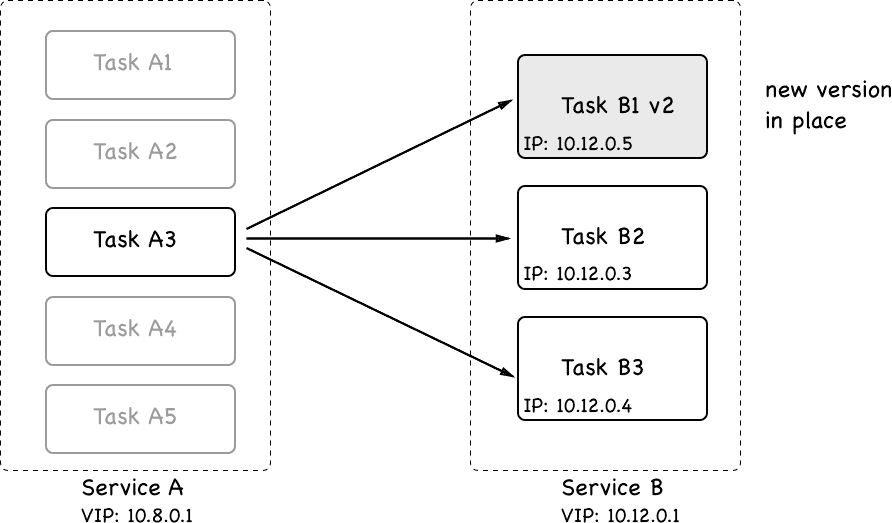
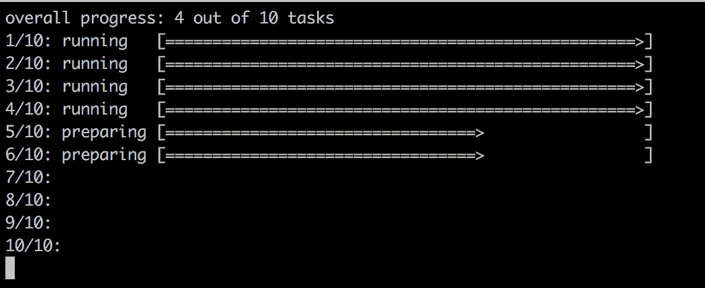
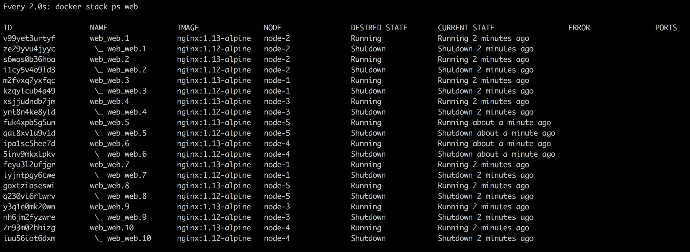
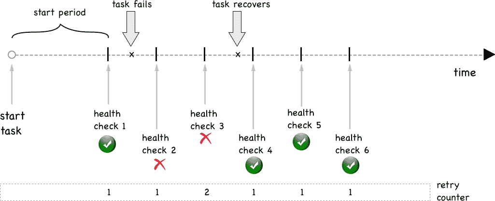
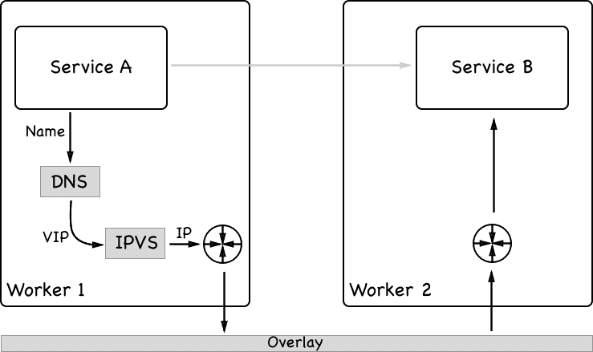
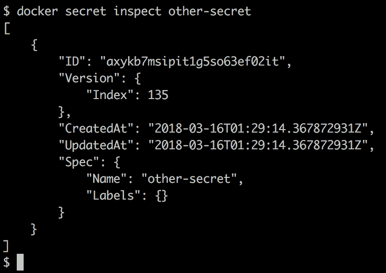
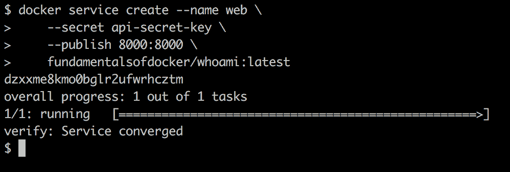

# 零停机部署和 Secrets

在上一章中，我们详细探讨了 Docker Swarm 及其资源。我们学习了如何在本地和云中构建高可用的 swarm。然后，我们深入讨论了 Swarm 服务和堆栈。最后，我们在 swarm 中创建了服务和堆栈。

在本章中，我们将向您展示如何在 Docker Swarm 中更新服务和堆栈而不中断其可用性。这被称为零停机部署。我们还将介绍 swarm secrets 作为一种安全地向服务的容器提供敏感信息的手段。

在本章中，我们将涵盖以下主题：

+   零停机部署

+   在 swarm 中存储配置数据

+   使用 Docker Secrets 保护敏感数据

完成本章后，您将能够做到以下事情：

+   列举两到三种常用的部署策略，用于在不中断的情况下更新服务。

+   批量更新服务而不会造成服务中断。

+   为服务定义回滚策略，如果更新失败则使用。

+   使用 Docker 配置存储非敏感配置数据。

+   使用 Docker secret 与服务。

+   更新 secret 的值而不会造成停机时间。

# 技术要求

本章的代码文件可以在 GitHub 上找到[`github.com/PacktPublishing/Learn-Docker---Fundamentals-of-Docker-19.x-Second-Edition`](https://github.com/PacktPublishing/Learn-Docker---Fundamentals-of-Docker-19.x-Second-Edition)。如果您已经按照第二章中指示的*设置工作环境*检出了存储库，那么您可以在`~/fod-solution/ch14`找到代码。

# 零停机部署

需要频繁更新的关键应用程序最重要的一个方面是能够以完全无中断的方式进行更新。我们称之为零停机部署。更新后的应用程序必须始终完全可操作。

# 流行的部署策略

有各种方法可以实现这一点。其中一些如下：

+   滚动更新

+   蓝绿部署

+   金丝雀发布

Docker Swarm 支持开箱即用的滚动更新。其他两种部署类型需要我们额外的努力才能实现。

# 滚动更新

在关键任务应用中，每个应用服务必须以多个副本运行。根据负载的大小，副本可以少至两到三个实例，多至数十、数百或数千个实例。在任何给定时间，我们希望所有服务实例的运行都有明确的多数。因此，如果我们有三个副本，我们希望至少有两个副本一直在运行。如果我们有 100 个副本，我们可以满足于至少有 90 个副本可用。通过这样做，我们可以定义一个批量大小的副本，我们可以关闭以进行升级。在第一种情况下，批量大小将为 1，在第二种情况下，将为 10。

当我们关闭副本时，Docker Swarm 将自动将这些实例从负载均衡池中移除，所有流量将在剩余的活动实例之间进行负载均衡。因此，这些剩余实例将暂时经历流量的轻微增加。在下图中，在滚动更新开始之前，如果**Task A3**想要访问**Service B**，它可能已经被 SwarmKit 负载均衡到**Service B**的任何三个任务中的一个。一旦滚动更新开始，SwarmKit 将关闭**Task B1**进行更新。自动地，这个任务就被从目标池中移除。因此，如果**Task A3**现在请求连接到**Service B**，负载均衡将只从剩余的任务中选择，即**B2**和**B3**。因此，这两个任务可能暂时经历更高的负载：


**Task B1**被关闭以进行更新

然后停止实例，用新版本的应用服务的等效数量的新实例替换它们。一旦新实例正常运行，我们可以让 Swarm 在一定时间内观察它们，确保它们健康。如果一切正常，那么我们可以继续关闭下一批实例，并用新版本的实例替换它们。这个过程重复进行，直到所有应用服务的实例都被替换。

在下图中，我们可以看到**Service B**的**Task B1**已更新为版本 2。**Task B1**的容器被分配了一个新的**IP**地址，并部署到另一个具有空闲资源的工作节点上：



正在进行滚动更新的第一批

重要的是要理解，当服务的任务被更新时，在大多数情况下，它会被部署到与其原来所在的不同的工作节点上。但只要相应的服务是无状态的，这应该没问题。如果我们有一个有状态的服务，它是位置或节点感知的，并且我们想要对其进行更新，那么我们必须调整我们的方法，但这超出了本书的范围。

现在，让我们看看如何实际指示 Swarm 执行应用服务的滚动更新。当我们在堆栈文件中声明一个服务时，我们可以定义在这种情况下相关的多个选项。让我们看一个典型堆栈文件的片段：

```
version: "3.5"
services:
 web:
   image: nginx:alpine
   deploy:
     replicas: 10
     update_config:
       parallelism: 2
       delay: 10s
...
```

在这个片段中，我们可以看到一个名为`update_config`的部分，其中包含`parallelism`和`delay`属性。`parallelism`定义了在滚动更新期间一次要更新多少个副本的批处理大小。`delay`定义了 Docker Swarm 在更新单个批次之间要等待多长时间。在前面的例子中，我们有`10`个副本，每次更新两个实例，并且在每次成功更新之间，Docker Swarm 等待`10`秒。

让我们测试这样一个滚动更新。导航到我们`labs`文件夹的`ch14`子文件夹，并使用`stack.yaml`文件创建一个已配置为滚动更新的 web 服务。该服务使用基于 Alpine 的 Nginx 镜像，版本为`1.12-alpine`。我们将把服务更新到一个更新的版本，即`1.13-alpine`。

首先，我们将把这个服务部署到我们在 VirtualBox 中本地创建的 Swarm。让我们来看一下：

1.  首先，我们需要确保我们的终端窗口已配置，以便我们可以访问我们集群的主节点之一。让我们选择领导者，即`node-1`：

```
$ eval $(docker-machine env node-1)
```

1.  现在，我们可以使用堆栈文件部署服务：

```
$ docker stack deploy -c stack.yaml web
```

上述命令的输出如下：

部署 web 堆栈

1.  服务部署后，我们可以使用以下命令对其进行监视：

```
$ watch docker stack ps web
```

我们将看到以下输出：

运行在 Swarm 中的 web 堆栈的 web 服务，有 10 个副本。如果您在 macOS 机器上工作，您需要确保您安装了 watch 工具。使用`brew install watch`命令来安装。

上述命令将持续更新输出，并为我们提供滚动更新期间发生的情况的良好概述。

现在，我们需要打开第二个终端，并为我们的 Swarm 的管理节点配置远程访问。一旦我们完成了这一步，我们可以执行`docker`命令，它将更新堆栈的`web`服务的镜像，也称为`web`：

```
$ docker service update --image nginx:1.13-alpine web_web
```

上述命令导致以下输出，指示滚动更新的进度：

显示滚动更新进度的屏幕

上述输出表明，前两批每批两个任务已成功，并且第三批正在准备中。

在观看堆栈的第一个终端窗口中，我们现在应该看到 Docker Swarm 如何以`10 秒`的间隔逐批更新服务。第一批之后，它应该看起来像以下截图：

Docker Swarm 中服务的滚动更新

在上述截图中，我们可以看到前两个任务`8`和`9`已经更新。Docker Swarm 正在等待`10 秒`后继续下一批。

有趣的是，在这种特殊情况下，SwarmKit 将任务的新版本部署到与先前版本相同的节点。这是偶然的，因为我们有五个节点，每个节点上有两个任务。SwarmKit 始终尝试在节点之间均匀平衡工作负载。因此，当 SwarmKit 关闭一个任务时，相应的节点的工作负载小于所有其他节点，因此新实例被调度到该节点。通常情况下，您不能期望在同一节点上找到任务的新实例。只需尝试通过删除具有`docker stack rm web`并将副本数更改为例如七个，然后重新部署和更新来自己尝试。

一旦所有任务都已更新，我们的`docker stack ps web`命令的输出将类似于以下截图：

所有任务已成功更新

请注意，SwarmKit 不会立即从相应节点中删除任务的先前版本的容器。这是有道理的，因为我们可能希望，例如，检索这些容器的日志以进行调试，或者我们可能希望使用`docker container inspect`检索它们的元数据。SwarmKit 在清除旧实例之前会保留最近的四个终止任务实例，以防止它用未使用的资源堵塞系统。

我们可以使用`--update-order`参数指示 Docker 在停止旧容器之前启动新的容器副本。这可以提高应用程序的可用性。有效值为`"start-first"`和`"stop-first"`。后者是默认值。

完成后，我们可以使用以下命令拆除堆栈：

```
$ docker stack rm web
```

虽然使用堆栈文件来定义和部署应用程序是推荐的最佳实践，但我们也可以在服务`create`语句中定义更新行为。如果我们只想部署单个服务，这可能是做事情的首选方式。让我们看看这样一个`create`命令：

```
$ docker service create --name web \
 --replicas 10 \
 --update-parallelism 2 \
 --update-delay 10s \
 nginx:alpine
```

这个命令定义了与前面的堆栈文件相同的期望状态。我们希望服务以`10`个副本运行，并且我们希望滚动更新以每次两个任务的批次进行，并且在连续批次之间间隔 10 秒。

# 健康检查

为了做出明智的决定，例如在滚动更新 Swarm 服务期间，关于刚安装的新服务实例批次是否正常运行，或者是否需要回滚，SwarmKit 需要一种了解系统整体健康状况的方式。SwarmKit（和 Docker）本身可以收集相当多的信息。但是有限制。想象一个包含应用程序的容器。从外部看，容器可能看起来绝对健康，可以正常运行。但这并不一定意味着容器内部运行的应用程序也很好。例如，应用程序可能陷入无限循环或处于损坏状态，但仍在运行。但只要应用程序运行，容器就运行，并且从外部看，一切都看起来完美。

因此，SwarmKit 提供了一个接口，我们可以在其中提供一些帮助。我们，即运行在集群容器内部的应用程序服务的作者，最了解我们的服务是否处于健康状态。SwarmKit 给了我们定义一个命令的机会，该命令针对我们的应用程序服务进行健康测试。这个命令具体做什么对 Swarm 来说并不重要；命令只需要返回`OK`、`NOT OK`或`超时`。后两种情况，即`NOT OK`或`超时`，将告诉 SwarmKit 正在调查的任务可能不健康。

在这里，我故意写了一些东西，稍后我们会看到原因：

```
FROM alpine:3.6
...
HEALTHCHECK --interval=30s \
    --timeout=10s
    --retries=3
    --start-period=60s
    CMD curl -f http://localhost:3000/health || exit 1
...
```

在来自 Dockerfile 的前面的片段中，我们可以看到关键字 HEALTHCHECK。它有一些选项或参数和一个实际的命令，即 CMD。让我们讨论一下选项：

+   --interval：定义健康检查之间的等待时间。因此，在我们的情况下，编排器每 30 秒执行一次检查。

+   --timeout：此参数定义 Docker 在健康检查不响应时应等待多长时间，直到超时出现错误。在我们的示例中，这是 10 秒。现在，如果一个健康检查失败，SwarmKit 会重试几次，直到放弃并声明相应的任务不健康，并打开 Docker 杀死该任务并用新实例替换的机会。

+   重试次数由--retries 参数定义。在前面的代码中，我们希望有三次重试。

+   接下来，我们有启动周期。有些容器需要一些时间来启动（虽然这不是一种推荐的模式，但有时是不可避免的）。在这个启动时间内，服务实例可能无法响应健康检查。有了启动周期，我们可以定义 SwarmKit 在执行第一次健康检查之前等待多长时间，从而给应用程序初始化的时间。为了定义启动时间，我们使用--start-period 参数。在我们的情况下，我们在 60 秒后进行第一次检查。启动时间需要多长取决于应用程序及其启动行为。建议是从相对较低的值开始，如果有很多错误的阳性和任务被多次重启，可能需要增加时间间隔。

+   最后，我们在最后一行用 CMD 关键字定义了实际的探测命令。在我们的情况下，我们正在定义对端口 3000 的 localhost 的/health 端点的请求作为探测命令。这个调用有三种可能的结果：

+   命令成功。

+   命令失败。

+   命令超时。

SwarmKit 将后两者视为相同。这是编排器告诉我们相应的任务可能不健康。我故意说*可能*，因为 SwarmKit 并不立即假设最坏的情况，而是假设这可能只是任务的暂时故障，并且它将从中恢复。这就是为什么我们有一个`--retries`参数的原因。在那里，我们可以定义 SwarmKit 在可以假定任务确实不健康之前应重试多少次，因此杀死它并在另一个空闲节点上重新安排此任务的另一个实例以调和服务的期望状态。

*为什么我们可以在我们的探测命令中使用 localhost？*这是一个非常好的问题，原因是因为当 SwarmKit 在 Swarm 中运行的容器进行探测时，它在容器内执行这个`探测`命令（也就是说，它做了类似`docker container exec <containerID> <probing command>`的事情）。因此，该命令在与容器内运行的应用程序相同的网络命名空间中执行。在下图中，我们可以看到服务任务的生命周期：



具有瞬态健康失败的服务任务

首先，SwarmKit 等待到启动期结束才进行探测。然后，我们进行第一次健康检查。不久之后，任务在探测时失败。它连续失败两次，但然后恢复。因此，**健康检查 4**成功了，SwarmKit 让任务继续运行。

在这里，我们可以看到一个永久失败的任务：


任务的永久失败

我们刚刚学习了如何在服务的镜像的`Dockerfile`中定义健康检查。但这并不是我们可以做到这一点的唯一方式。我们还可以在用于将我们的应用程序部署到 Docker Swarm 中的堆栈文件中定义健康检查。以下是这样一个堆栈文件的简短片段：

```
version: "3.5"
services:
  web:
    image: example/web:1.0
    healthcheck:
      test: ["CMD", "curl", "-f", "http://localhost:3000/health"]
      interval: 30s
      timeout: 10s
      retries: 3
      start_period: 60s
...
```

在上述片段中，我们可以看到健康检查相关信息是如何在堆栈文件中定义的。首先，首先要意识到的是，我们必须为每个服务单独定义健康检查。没有应用程序或全局级别的健康检查。

与我们之前在 `Dockerfile` 中定义的类似，SwarmKit 用于执行健康检查的命令是 `curl -f http://localhost:3000/health`。我们还定义了 `interval`、`timeout`、`retries` 和 `start_period`。这四个键值对的含义与我们在 `Dockerfile` 中使用的相应参数相同。如果镜像中定义了与健康检查相关的设置，那么堆栈文件中定义的设置将覆盖 `Dockerfile` 中的设置。

现在，让我们尝试使用一个定义了健康检查的服务。在我们的 `lab` 文件夹中，有一个名为 `stack-health.yaml` 的文件，内容如下：

```
version: "3.5"
services:
  web:
    image: nginx:alpine
    healthcheck:
      test: ["CMD", "wget", "-qO", "-", "http://localhost"]
      interval: 5s
      timeout: 2s
      retries: 3
      start_period: 15s
```

让我们部署这个：

```
$ docker stack deploy -c stack-health.yaml myapp
```

我们可以使用 `docker stack ps myapp` 命令找出单个任务部署到了哪里。在特定的节点上，我们可以列出所有容器，找到我们的其中一个堆栈。在我的例子中，任务已经部署到了 `node-3`：

显示运行任务实例的健康状态

这张截图中有趣的地方是 `STATUS` 列。Docker，或者更准确地说，SwarmKit，已经识别出服务有一个健康检查函数定义，并且正在使用它来确定服务的每个任务的健康状况。

# 回滚

有时，事情并不如预期。应用发布的最后一分钟修复可能无意中引入了一个新的 bug，或者新版本显著降低了组件的吞吐量，等等。在这种情况下，我们需要有一个备用计划，这在大多数情况下意味着能够将更新回滚到之前的良好版本。

与更新一样，回滚必须以不会导致应用中断的方式进行。它需要零停机时间。从这个意义上讲，回滚可以被看作是一个反向更新。我们正在安装一个新版本，但这个新版本实际上是之前的版本。

与更新行为一样，我们可以在堆栈文件或 Docker 服务 `create` 命令中声明系统在需要执行回滚时应该如何行为。在这里，我们有之前使用的堆栈文件，但这次有一些与回滚相关的属性：

```
version: "3.5"
services:
  web:
    image: nginx:1.12-alpine
    ports:
      - 80:80
    deploy:
      replicas: 10
      update_config:
        parallelism: 2
        delay: 10s

        failure_action: rollback
        monitor: 10s

    healthcheck:
      test: ["CMD", "wget", "-qO", "-", "http://localhost"]
      interval: 2s
      timeout: 2s
      retries: 3
      start_period: 2s
```

在这个堆栈文件中，我们定义了关于滚动更新、健康检查和回滚期间行为的详细信息。健康检查被定义为，在初始等待时间为`2`秒后，编排器开始每`2`秒在`http://localhost`上轮询服务，并在考虑任务不健康之前重试`3`次。

如果我们做数学计算，那么如果由于错误而导致任务不健康，那么至少需要 8 秒才能停止任务。因此，现在在部署下，我们有一个名为`monitor`的新条目。该条目定义了新部署的任务应该被监视多长时间以确保其健康，并且是否继续进行滚动更新的下一批任务。在这个示例中，我们给了它`10`秒。这比我们计算出的 8 秒稍微长一些，可以发现已部署的有缺陷的服务，所以这很好。

我们还有一个新条目，`failure_action`，它定义了在滚动更新过程中遇到失败时编排器将采取的行动，例如服务不健康。默认情况下，动作只是停止整个更新过程，并使系统处于中间状态。系统并没有宕机，因为它是一个滚动更新，至少一些健康的服务实例仍然在运行，但运维工程师最好能够查看并解决问题。

在我们的情况下，我们已经定义了动作为`rollback`。因此，在失败的情况下，SwarmKit 将自动将所有已更新的任务回滚到它们的先前版本。

# 蓝绿部署

在第九章中，*分布式应用架构*，我们以抽象的方式讨论了蓝绿部署是什么。事实证明，在 Docker Swarm 上，我们不能真正为任意服务实现蓝绿部署。在 Docker Swarm 中运行的两个服务之间的服务发现和负载均衡是 Swarm 路由网格的一部分，不能（轻松地）定制。

如果**Service A**想要调用**Service B**，那么 Docker 会隐式地执行这个操作。给定目标服务的名称，Docker 将使用 Docker **DNS**服务将此名称解析为**虚拟 IP**（**VIP**）地址。然后，当请求针对**VIP**时，Linux **IPVS**服务将在 Linux 内核 IP 表中使用**VIP**进行另一个查找，并将请求负载均衡到**VIP**所代表的服务的任务的物理 IP 地址之一，如下图所示：



Docker Swarm 中的服务发现和负载均衡是如何工作的

不幸的是，目前还没有简单的方法来拦截这种机制并用自定义行为替换它。但这是需要的，以便允许对我们示例中的目标服务**Service B**进行真正的蓝绿部署。正如我们将在第十六章中看到的那样，*使用 Kubernetes 部署、更新和保护应用程序*，Kubernetes 在这个领域更加灵活。

也就是说，我们总是可以以蓝绿方式部署面向公众的服务。我们可以使用 interlock 2 及其第 7 层路由机制来实现真正的蓝绿部署。

# 金丝雀发布

从技术上讲，滚动更新是金丝雀发布的一种形式。但由于它们缺乏接口，无法将自定义逻辑插入系统中，滚动更新只是金丝雀发布的一个非常有限的版本。

真正的金丝雀发布要求我们对更新过程有更精细的控制。此外，真正的金丝雀发布在将 100%的流量引导到新版本之前不会关闭旧版本的服务。在这方面，它们被视为蓝绿部署。

在金丝雀发布的情况下，我们不仅希望使用诸如健康检查之类的因素来决定是否将更多的流量引导到新版本的服务中；我们还希望考虑决策过程中的外部输入，例如由日志聚合器收集和聚合的指标或跟踪信息。可以作为决策者的一个示例是符合**服务级别协议**（**SLA**），即如果服务的新版本显示出超出容忍范围的响应时间。如果我们向现有服务添加新功能，但这些新功能降低了响应时间，就会发生这种情况。

# 在 swarm 中存储配置数据

如果我们想在 Docker Swarm 中存储诸如配置文件之类的非敏感数据，那么我们可以使用 Docker 配置。Docker 配置与 Docker 秘密非常相似，我们将在下一节中讨论。主要区别在于配置值在静止状态下没有加密，而秘密有。Docker 配置只能在 Docker Swarm 中使用，也就是说，它们不能在非 Swarm 开发环境中使用。Docker 配置直接挂载到容器的文件系统中。配置值可以是字符串，也可以是二进制值，最大大小为 500 KB。

通过使用 Docker 配置，您可以将配置与 Docker 镜像和容器分离。这样，您的服务可以轻松地使用特定于环境的值进行配置。生产 swarm 环境的配置值与分期 swarm 的配置值不同，而后者又与开发或集成环境的配置值不同。

我们可以向服务添加配置，也可以从运行中的服务中删除配置。配置甚至可以在 swarm 中运行的不同服务之间共享。

现在，让我们创建一些 Docker 配置：

1.  首先，我们从一个简单的字符串值开始：

```
$ echo "Hello world" | docker config create hello-config - rrin36epd63pu6w3gqcmlpbz0
```

上面的命令创建了`Hello world`配置值，并将其用作名为`hello-config`的配置的输入。此命令的输出是存储在 swarm 中的这个新配置的唯一`ID`。

1.  让我们看看我们得到了什么，并使用列表命令来这样做：

```
$ docker config ls ID                         NAME           CREATED              UPDATED
rrin36epd63pu6w3gqcmlpbz0  hello-config   About a minute ago   About a minute ago
```

列表命令的输出显示了我们刚刚创建的配置的`ID`和`NAME`，以及其`CREATED`和（最后）更新时间。但由于配置是非机密的，我们可以做更多的事情，甚至输出配置的内容，就像这样：

```
$ docker config docker config inspect hello-config
[
    {
        "ID": "rrin36epd63pu6w3gqcmlpbz0",
        "Version": {
            "Index": 11
        },
        "CreatedAt": "2019-11-30T07:59:20.6340015Z",
        "UpdatedAt": "2019-11-30T07:59:20.6340015Z",
        "Spec": {
            "Name": "hello-config",
            "Labels": {},
            "Data": "SGVsbG8gd29ybGQK"
        }
    }
]
```

嗯，有趣。在前面的 JSON 格式输出的`Spec`子节点中，我们有一个`Data`键，其值为`SGVsbG8gd29ybGQK`。我们不是刚说过配置数据在静止状态下没有加密吗？原来这个值只是我们的字符串编码为`base64`，我们可以很容易地验证：

```
$ echo 'SGVsbG8gd29ybGQK' | base64 -d
Hello world
```

到目前为止，一切都很好。

现在，让我们定义一个稍微复杂一些的 Docker 配置。假设我们正在开发一个 Java 应用程序。Java 传递配置数据给应用程序的首选方式是使用所谓的“属性”文件。`属性`文件只是一个包含键值对列表的文本文件。让我们来看一下：

1.  让我们创建一个名为`my-app.properties`的文件，并将以下内容添加到其中：

```
username=pguser
database=products
port=5432
dbhost=postgres.acme.com
```

1.  保存文件并从中创建一个名为`app.properties`的 Docker 配置：

```
$ docker config create app.properties ./my-app.properties
2yzl73cg4cwny95hyft7fj80u
```

现在，我们可以使用这个（有些牵强的）命令来获取我们刚刚创建的配置的明文值：

```
$ docker config inspect app.properties | jq .[].Spec.Data | xargs echo | base64 -d username=pguser
database=products
port=5432
dbhost=postgres.acme.com
```

这正是我们预期的。

1.  现在，让我们创建一个使用前述配置的 Docker 服务。为简单起见，我们将使用 nginx 镜像来实现：

```
$ docker service create \
 --name nginx \
 --config source=app.properties,target=/etc/my-app/conf/app.properties,mode=0440 \
 nginx:1.13-alpine

p3f686vinibdhlnrllnspqpr0
overall progress: 1 out of 1 tasks
1/1: running [==================================================>]
verify: Service converged
```

在前面的服务`create`命令中有趣的部分是包含`--config`的那一行。通过这一行，我们告诉 Docker 使用名为`app.properties`的配置，并将其挂载为一个文件到容器内的`/etc/my-app/conf/app.properties`。此外，我们希望该文件具有`0440`的模式。

让我们看看我们得到了什么：

```
$ docker service ps nginx
ID            NAME     IMAGE              NODE DESIRED    STATE    CURRENT STATE ...
b8lzzwl3eg6y  nginx.1  nginx:1.13-alpine  node-1  Running  Running 2 minutes ago
```

在前面的输出中，我们可以看到服务的唯一实例正在节点`node-1`上运行。在这个节点上，我现在可以列出容器以获取 nginx 实例的`ID`：

```
$ docker container ls
CONTAINER ID   IMAGE               COMMAND                  CREATED         STATUS         PORTS ...
bde33d92cca7   nginx:1.13-alpine   "nginx -g 'daemon of…"   5 minutes ago   Up 5 minutes   80/tcp ...
```

最后，我们可以`exec`进入该容器并输出`/etc/my-app/conf/app.properties`文件的值：

```
$ docker exec bde33 cat /etc/my-app/conf/app.properties
username=pguser
database=products
port=5432
dbhost=postgres.acme.com
```

毫无意外；这正是我们预期的。

当然，Docker 配置也可以从集群中移除，但前提是它们没有被使用。如果我们尝试移除之前使用过的配置，而没有先停止和移除服务，我们会得到以下输出：

```
$ docker config rm app.properties
Error response from daemon: rpc error: code = InvalidArgument desc = config 'app.properties' is in use by the following service: nginx
```

我们收到了一个错误消息，其中 Docker 友好地告诉我们该配置正在被我们称为`nginx`的服务使用。这种行为与我们在使用 Docker 卷时所习惯的有些相似。

因此，首先我们需要移除服务，然后我们可以移除配置：

```
$ docker service rm nginx
nginx
$ docker config rm app.properties
app.properties
```

需要再次注意的是，Docker 配置绝不应该用于存储诸如密码、秘钥或访问密钥等机密数据。在下一节中，我们将讨论如何处理机密数据。

# 使用 Docker secrets 保护敏感数据

秘密用于以安全的方式处理机密数据。Swarm 秘密在静态和传输中是安全的。也就是说，当在管理节点上创建新的秘密时，它只能在管理节点上创建，其值会被加密并存储在 raft 一致性存储中。这就是为什么它在静态时是安全的。如果一个服务被分配了一个秘密，那么管理节点会从存储中读取秘密，解密它，并将其转发给请求秘密的 swarm 服务的所有容器实例。由于 Docker Swarm 中的节点之间通信使用了**传输层安全**（**TLS**），即使解密了，秘密值在传输中仍然是安全的。管理节点只将秘密转发给服务实例正在运行的工作节点。然后，秘密被挂载为文件到目标容器中。每个秘密对应一个文件。秘密的名称将成为容器内文件的名称，秘密的值将成为相应文件的内容。秘密永远不会存储在工作节点的文件系统上，而是使用`tmpFS`挂载到容器中。默认情况下，秘密被挂载到容器的`/run/secrets`目录中，但您可以将其更改为任何自定义文件夹。

需要注意的是，在 Windows 节点上，秘密不会被加密，因为没有类似于`tmpfs`的概念。为了达到在 Linux 节点上获得的相同安全级别，管理员应该加密相应 Windows 节点的磁盘。

# 创建秘密

首先，让我们看看我们实际上如何创建一个秘密：

```
$ echo "sample secret value" | docker secret create sample-secret - 
```

这个命令创建了一个名为`sample-secret`的秘密，其值为`sample secret value`。请注意`docker secret create`命令末尾的连字符。这意味着 Docker 期望从标准输入获取秘密的值。这正是我们通过将`sample secret value`值传输到`create`命令中所做的。

或者，我们可以使用文件作为秘密值的来源：

```
$ docker secret create other-secret ~/my-secrets/secret-value.txt
```

在这里，具有名称`other-secret`的秘密的值是从名为`~/my-secrets/secret-value.txt`的文件中读取的。一旦创建了一个秘密，就没有办法访问它的值。例如，我们可以列出所有的秘密来获取以下输出：

所有秘密的列表

在这个列表中，我们只能看到秘密的`ID`和`名称`，以及一些其他元数据，但秘密的实际值是不可见的。我们也可以对秘密使用`inspect`，例如，获取有关`other-secret`的更多信息：

检查集群秘密

即使在这里，我们也无法获取秘密的值。当然，这是有意的：秘密是秘密，因此需要保密。如果我们愿意，我们可以为秘密分配标签，甚至可以使用不同的驱动程序来加密和解密秘密，如果我们对 Docker 默认提供的不满意的话。

# 使用秘密

秘密被用于在集群中运行的服务。通常，秘密在创建服务时分配。因此，如果我们想要运行一个名为`web`的服务并分配一个名为`api-secret-key`的秘密，语法如下：

```
$ docker service create --name web \
 --secret api-secret-key \
 --publish 8000:8000 \
 fundamentalsofdocker/whoami:latest
```

该命令基于`fundamentalsofdocker/whoami:latest`镜像创建了一个名为`web`的服务，将容器端口`8000`发布到所有集群节点的端口`8000`，并分配了名为`api-secret-key`的秘密。

只有在集群中定义了名为`api-secret-key`的秘密时，这才有效；否则，将生成一个带有文本`secret not found: api-secret-key`的错误。因此，让我们现在创建这个秘密：

```
$ echo "my secret key" | docker secret create api-secret-key -
```

现在，如果我们重新运行服务`create`命令，它将成功：

使用秘密创建服务

现在，我们可以使用`docker service ps web`来找出唯一服务实例部署在哪个节点上，然后`exec`进入这个容器。在我的情况下，该实例已部署到`node-3`，所以我需要`SSH`进入该节点：

```
$ docker-machine ssh node-3
```

然后，我列出该节点上的所有容器，找到属于我的服务的一个实例并复制其`容器 ID`。然后，我们可以运行以下命令，确保秘密确实在容器内以明文形式的预期文件名中可用：

```
$ docker exec -it <container ID> cat /run/secrets/api-secret-key
```

再次强调，在我的情况下，这看起来是这样的：

容器看到的秘密

如果由于某种原因，Docker 在容器内部挂载秘密的默认位置不可接受，您可以定义一个自定义位置。在下面的命令中，我们将秘密挂载到`/app/my-secrets`：

```
$ docker service create --name web \
 --name web \
 -p 8000:8000 \
 --secret source=api-secret-key,target=/run/my-secrets/api-secret-key \
 fundamentalsofdocker/whoami:latest
```

在这个命令中，我们使用了扩展语法来定义一个包括目标文件夹的秘密。

# 在开发环境中模拟秘密

在开发中，我们通常在本地没有一个 swarm。但是秘密只在 swarm 中起作用。*我们能做什么呢*？幸运的是，这个答案非常简单。由于秘密被视为文件，我们可以轻松地将包含秘密的卷挂载到容器中的预期位置，这个位置默认为`/run/secrets`。

假设我们在本地工作站上有一个名为`./dev-secrets`的文件夹。对于每个秘密，我们都有一个与秘密名称相同且具有未加密值的文件作为文件内容。例如，我们可以通过在工作站上执行以下命令来模拟一个名为`demo-secret`的秘密，其秘密值为`demo secret value`：

```
$ echo "demo secret value" > ./dev-secrets/sample-secret
```

然后，我们可以创建一个容器，挂载这个文件夹，就像这样：

```
$ docker container run -d --name whoami \
 -p 8000:8000 \
 -v $(pwd)/dev-secrets:/run/secrets \
 fundamentalsofdocker/whoami:latest
```

容器内运行的进程将无法区分这些挂载的文件和来自秘密的文件。因此，例如，`demo-secret`在容器内作为名为`/run/secrets/demo-secret`的文件可用，并具有预期值`demo secret value`。让我们在以下步骤中更详细地看一下这个情况：

1.  为了测试这一点，我们可以在前面的容器中`exec`一个 shell：

```
$ docker container exec -it whoami /bin/bash
```

1.  现在，我们可以导航到`/run/secrets`文件夹，并显示`demo-secret`文件的内容：

```
/# cd /run/secrets
/# cat demo-secret
demo secret value
```

接下来，我们将研究秘密和遗留应用程序。

# 秘密和遗留应用程序

有时，我们希望将无法轻松或不想更改的遗留应用程序容器化。这个遗留应用程序可能希望将秘密值作为环境变量可用。*那么我们现在该怎么办呢？* Docker 将秘密呈现为文件，但应用程序期望它们以环境变量的形式存在。

在这种情况下，定义一个在容器启动时运行的脚本是有帮助的（称为入口点或启动脚本）。这个脚本将从相应的文件中读取秘密值，并定义一个与文件名相同的环境变量，将新变量赋予从文件中读取的值。对于一个名为`demo-secret`的秘密，其值应该在名为`DEMO_SECRET`的环境变量中可用，这个启动脚本中必要的代码片段可能如下所示：

```
export DEMO_SECRET=$(cat /run/secrets/demo-secret)
```

类似地，假设我们有一个旧应用程序，它期望将秘密值作为一个条目存在于位于`/app/bin`文件夹中的一个名为`app.config`的 YAML 配置文件中，其相关部分如下所示：

```
...
```

```

secrets:
  demo-secret: "<<demo-secret-value>>"
  other-secret: "<<other-secret-value>>"
  yet-another-secret: "<<yet-another-secret-value>>"
...
```

我们的初始化脚本现在需要从`secret`文件中读取秘密值，并用`secret`值替换配置文件中的相应占位符。对于`demo-secret`，这可能看起来像这样：

```
file=/app/bin/app.conf
demo_secret=$(cat /run/secret/demo-secret)
sed -i "s/<<demo-secret-value>>/$demo_secret/g" "$file"
```

在上面的片段中，我们使用`sed`工具来替换占位符为实际值。我们可以使用相同的技术来处理配置文件中的其他两个秘密。

我们将所有的初始化逻辑放入一个名为`entrypoint.sh`的文件中，使该文件可执行，并将其添加到容器文件系统的根目录。然后，在`Dockerfile`中将此文件定义为`ENTRYPOINT`，或者我们可以在`docker container run`命令中覆盖镜像的现有`ENTRYPOINT`。

让我们做一个示例。假设我们有一个旧应用程序运行在由`fundamentalsofdocker/whoami:latest`镜像定义的容器中，该应用程序期望在应用程序文件夹中的一个名为`whoami.conf`的文件中定义一个名为`db_password`的秘密。让我们看看这些步骤：

1.  我们可以在本地机器上定义一个名为`whoami.conf`的文件，其中包含以下内容：

```
database:
  name: demo
  db_password: "<<db_password_value>>"
others:
  val1=123
  val2="hello world"
```

这个片段的第 3 行是重要的部分。它定义了启动脚本必须放置秘密值的位置。

1.  让我们在本地文件夹中添加一个名为`entrypoint.sh`的文件，其中包含以下内容：

```
file=/app/whoami.conf
db_pwd=$(cat /run/secret/db-password)
sed -i "s/<<db_password_value>>/$db_pwd/g" "$file"

/app/http
```

上述脚本中的最后一行源自于原始`Dockerfile`中使用的启动命令。

1.  现在，将此文件的模式更改为可执行：

```
$ sudo chmod +x ./entrypoint.sh
```

现在，我们定义一个继承自`fundamentalsofdocker/whoami:latest`镜像的`Dockerfile`。

1.  在当前文件夹中添加一个名为`Dockerfile`的文件，其中包含以下内容：

```
FROM fundamentalsofdocker/whoami:latest
COPY ./whoami.conf /app/
COPY ./entrypoint.sh /
CMD ["/entrypoint.sh"]
```

1.  让我们从这个`Dockerfile`构建镜像：

```
$ docker image build -t secrets-demo:1.0 .
```

1.  构建完镜像后，我们可以从中运行一个服务。但在这之前，我们需要在 Swarm 中定义秘密：

```
$ echo "passw0rD123" | docker secret create demo-secret -
```

1.  现在，我们可以创建一个使用以下秘密的服务：

```
$ docker service create --name demo \
 --secret demo-secret \
 secrets-demo:1.0
```

# 更新秘密

有时，我们需要更新运行中的服务中的秘密，因为秘密可能会泄露给公众，或者被恶意人士，如黑客，窃取。在这种情况下，我们需要更改我们的机密数据，因为一旦它泄露给不受信任的实体，它就必须被视为不安全。

更新秘密，就像任何其他更新一样，必须以零停机的方式进行。Docker SwarmKit 在这方面支持我们。

首先，在 Swarm 中创建一个新的秘密。建议在这样做时使用版本控制策略。在我们的例子中，我们使用版本作为秘密名称的后缀。我们最初使用名为`db-password`的秘密，现在这个秘密的新版本被称为`db-password-v2`：

```
$ echo "newPassw0rD" | docker secret create db-password-v2 -
```

让我们假设使用该秘密的原始服务是这样创建的：

```
$ docker service create --name web \
 --publish 80:80
 --secret db-password
 nginx:alpine
```

容器内运行的应用程序能够访问`/run/secrets/db-password`处的秘密。现在，SwarmKit 不允许我们在运行中的服务中更新现有的秘密，因此我们必须删除现在过时的秘密版本，然后添加新的秘密。让我们从以下命令开始删除：

```
$ docker service update --secret-rm db-password web
```

现在，我们可以使用以下命令添加新的秘密：

```
$ docker service update \
 --secret-add source=db-password-v2,target=db-password \
 web
```

请注意`--secret-add`的扩展语法，其中包括`source`和`target`参数。

# 摘要

在本章中，我们学习了 SwarmKit 如何允许我们更新服务而不需要停机。我们还讨论了 SwarmKit 在零停机部署方面的当前限制。在本章的第二部分，我们介绍了秘密作为一种以高度安全的方式向服务提供机密数据的手段。

在下一章中，我们将介绍目前最流行的容器编排器 Kubernetes。我们将讨论用于在 Kubernetes 集群中定义和运行分布式、弹性、健壮和高可用应用程序的对象。此外，本章还将使我们熟悉 MiniKube，这是一个用于在本地部署 Kubernetes 应用程序的工具，并演示 Kubernetes 与 Docker for macOS 和 Docker for Windows 的集成。

# 问题

为了评估您对本章讨论的主题的理解，请回答以下问题：

1.  用简洁的语句向一个感兴趣的外行解释什么是零停机部署。

1.  SwarmKit 如何实现零停机部署？

1.  与传统的（非容器化）系统相反，为什么 Docker Swarm 中的回滚可以正常工作？用简短的句子解释一下。

1.  描述 Docker 秘密的两到三个特征。

1.  您需要推出`inventory`服务的新版本。您的命令是什么样的？以下是更多信息：

+   新镜像名为`acme/inventory:2.1`。

+   我们希望使用批量大小为两个任务的滚动更新策略。

+   我们希望系统在每个批次之后等待一分钟。

1.  您需要更新名为`inventory`的现有服务的密码，该密码通过 Docker secret 提供。新的秘密称为`MYSQL_PASSWORD_V2`。服务中的代码期望秘密被称为`MYSQL_PASSWORD`。更新命令是什么样子？（请注意，我们不希望更改服务的代码！）

# 更多阅读

以下是一些外部来源的链接：

+   对服务应用滚动更新，网址为[`dockr.ly/2HfGjlD`](https://dockr.ly/2HfGjlD)

+   使用 Docker secrets 管理敏感数据，网址为[`dockr.ly/2vUNbuH`](https://dockr.ly/2vUNbuH)

+   介绍 Docker secrets 管理，网址为[`dockr.ly/2k7zwzE`](https://dockr.ly/2k7zwzE)

+   从环境变量到 Docker secrets，网址为[`bit.ly/2GY3UUB`](https://bit.ly/2GY3UUB)
