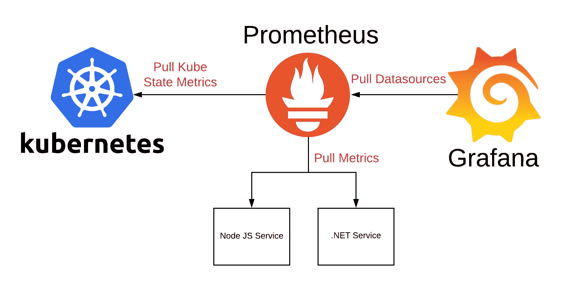
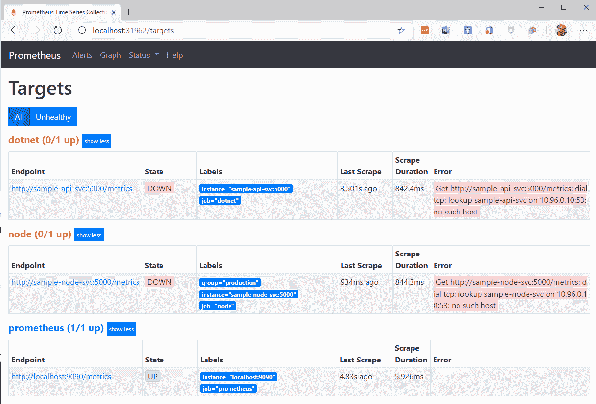
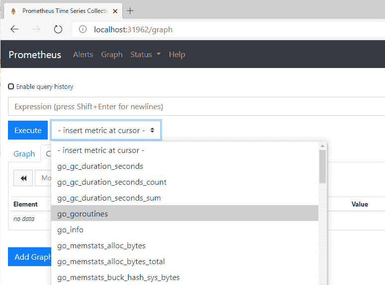
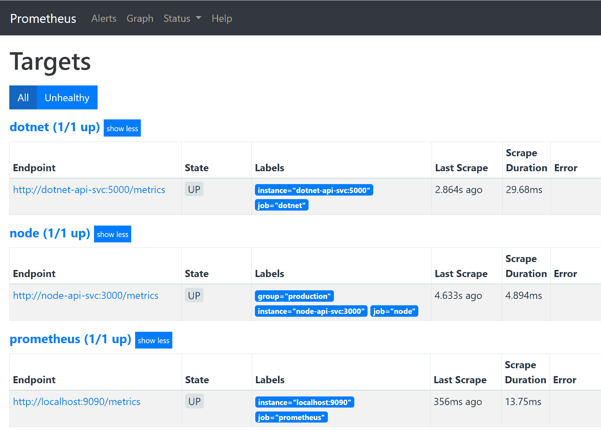
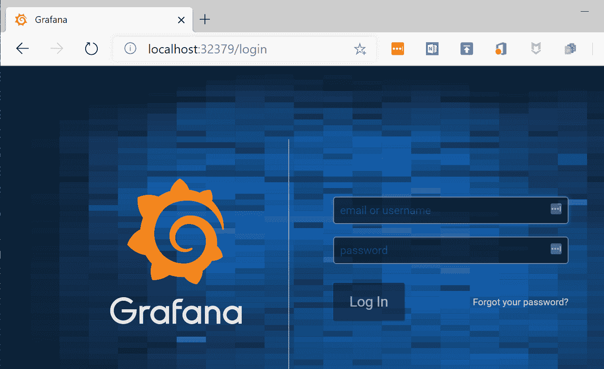

# 监控和故障排除在生产环境中运行的应用程序

在上一章中，我们学习了如何将多服务应用程序部署到 Kubernetes 集群中。我们为应用程序配置了应用程序级别的路由，并使用了零停机策略更新了其服务。最后，我们使用 Kubernetes Secrets 为运行的服务提供了机密数据。

在本章中，您将学习用于监视在 Kubernetes 集群上运行的单个服务或整个分布式应用程序的不同技术。您还将学习如何在生产环境中运行的应用服务进行故障排除，而不会更改集群或运行服务的集群节点。

本章涵盖以下主题：

+   监视单个服务

+   使用 Prometheus 监视您的分布式应用程序

+   故障排除在生产环境中运行的服务

通过完成本章，您将能够执行以下操作：

+   为服务配置应用程序级别的监控。

+   使用 Prometheus 收集和集中聚合相关的应用程序指标。

+   使用特殊工具容器来故障排除在生产环境中运行的服务。

# 技术要求

在本章中，我们将在本地计算机上使用 Minikube。有关如何安装和使用 Minikube 的更多信息，请参阅 第二章 *设置工作环境*。

本章的代码可以在以下网址找到：[`github.com/PacktPublishing/Learn-Docker---Fundamentals-of-Docker-19.x-Second-Edition/tree/master/ch17`](https://github.com/PacktPublishing/Learn-Docker---Fundamentals-of-Docker-19.x-Second-Edition/tree/master/ch17)[.](https://github.com/fundamentalsofdocker/labs/tree/2nd-edition/ch16/probes)

请确保您已经克隆了 GitHub 存储库，如 第二章 *设置工作环境* 中所述。

在终端中，导航到 `~/fod/ch17` 文件夹。

# 监视单个服务

当在生产环境或任何类似生产环境中使用分布式的关键任务应用程序时，尽可能多地了解这些应用程序的内部运作是至关重要的。你有没有机会看过飞机驾驶舱或核电站的指挥中心？飞机和发电厂都是提供关键任务服务的高度复杂系统的样本。如果飞机坠毁或发电厂意外关闭，至少可以说很多人会受到负面影响。因此，驾驶舱和指挥中心都装满了显示系统某个部分当前或过去状态的仪器。你看到的是系统的一些战略部分放置的传感器的视觉表示，它们不断收集数据，比如温度或流速。

与飞机或发电厂类似，我们的应用程序需要安装“传感器”，这些传感器可以感知应用服务或其运行基础设施的“温度”。我用双引号括起来的温度只是一个占位符，用于表示应用程序中重要的事物，比如给定 RESTful 端点每秒的请求次数，或者对同一端点的请求的平均延迟。

我们收集的结果数值或读数，比如请求的平均延迟，通常被称为指标。我们的目标应该是尽可能多地公开我们构建的应用服务的有意义的指标。指标可以是功能性的，也可以是非功能性的。功能性指标是关于应用服务的与业务相关的数值，比如如果服务是电子商务应用程序的一部分，每分钟执行多少次结账，或者如果我们谈论的是流媒体应用程序，过去 24 小时内最受欢迎的五首歌曲是哪些。

非功能性指标是重要的数值，它们与应用程序所用于的业务类型无关，比如特定网页请求的平均延迟是多少，或者另一个端点每分钟返回多少个`4xx`状态代码，或者给定服务使用了多少 RAM 或多少 CPU 周期。

在一个分布式系统中，每个部分都暴露指标的情况下，一些全面的服务应该定期从每个组件中收集和聚合值。或者，每个组件应该将其指标转发到一个中央指标服务器。只有当我们高度分布式系统的所有组件的指标都可以在一个中央位置进行检查时，它们才有任何价值。否则，监控系统将变得不可能。这就是为什么飞机的飞行员在飞行期间从不必亲自检查飞机的各个关键部件；所有必要的读数都被收集并显示在驾驶舱中。

如今，最受欢迎的用于暴露、收集和存储指标的服务之一是 Prometheus。它是一个开源项目，并已捐赠给**Cloud Native Computing Foundation**（**CNCF**）。Prometheus 与 Docker 容器、Kubernetes 和许多其他系统和编程平台具有一流的集成。在本章中，我们将使用 Prometheus 来演示如何对暴露重要指标的简单服务进行仪表化。

# 基于 Node.js 的服务仪表化

在本节中，我们想要学习如何通过以下步骤对 Node Express.js 编写的微服务进行仪表化：

1.  创建一个名为`node`的新文件夹并导航到它：

```
$ mkdir node && cd node
```

1.  在这个文件夹中运行`npm init`，并接受除了**入口点**之外的所有默认值，将其从默认的`index.js`更改为`server.js`。

1.  我们需要使用以下命令将`express`添加到我们的项目中：

```
$ npm install --save express
```

1.  现在我们需要使用以下命令为 Node Express 安装 Prometheus 适配器：

```
$ npm install --save prom-client 
```

1.  在文件夹中添加一个名为`server.js`的文件，并包含以下内容：

```
const app = require("express")();

app.get('/hello', (req, res) => {
  const { name = 'World' } = req.query;
  res.json({ message: `Hello, ${name}!` });
});

app.listen(port=3000, () => {
  console.log(`Example api is listening on http://localhost:3000`);
}); 
```

这是一个非常简单的 Node Express 应用程序，只有一个端点：`/hello`。

1.  在上述代码中，添加以下片段以初始化 Prometheus 客户端：

```
const client = require("prom-client");
const register = client.register;
const collectDefaultMetrics = client.collectDefaultMetrics;
collectDefaultMetrics({ register });
```

1.  接下来，添加一个端点来暴露指标：

```
app.get('/metrics', (req, res) => {
  res.set('Content-Type', register.contentType);
  res.end(register.metrics());
});
```

1.  现在让我们运行这个示例微服务：

```
$ npm start

> node@1.0.0 start C:\Users\Gabriel\fod\ch17\node
> node server.js

Example api is listening on http://localhost:3000
```

我们可以在前面的输出中看到，服务正在端口`3000`上监听。

1.  现在让我们尝试访问在代码中定义的`/metrics`端点上的指标：

```
$ curl localhost:3000/metrics
...
process_cpu_user_seconds_total 0.016 1577633206532

# HELP process_cpu_system_seconds_total Total system CPU time spent in seconds.
# TYPE process_cpu_system_seconds_total counter
process_cpu_system_seconds_total 0.015 1577633206532

# HELP process_cpu_seconds_total Total user and system CPU time spent in seconds.
# TYPE process_cpu_seconds_total counter
process_cpu_seconds_total 0.031 1577633206532
...
nodejs_version_info{version="v10.15.3",major="10",minor="15",patch="3"} 1
```

我们得到的输出是一个相当长的指标列表，可以被 Prometheus 服务器消费。

这很容易，不是吗？通过添加一个节点包并在应用程序启动中添加几行微不足道的代码，我们已经获得了大量的系统指标访问权限。

现在让我们定义我们自己的自定义指标。让它是一个`Counter`对象：

1.  将以下代码片段添加到`server.js`中，以定义名为`my_hello_counter`的自定义计数器：

```
const helloCounter = new client.Counter({ 
  name: 'my_hello_counter', 
  help: 'Counts the number of hello requests',
});
```

1.  在现有的`/hello`端点中，添加代码以增加计数器：

```
app.get('/hello', (req, res) => {
  helloCounter.inc();
  const { name = 'World' } = req.query;
  res.json({ message: `Hello, ${name}!` });
});
```

1.  使用`npm start`重新运行应用程序。

1.  为了测试新的计数器，让我们两次访问我们的`/hello`端点：

```
$ curl localhost:3000/hello?name=Sue
```

1.  当访问`/metrics`端点时，我们将获得以下输出：

```
$ curl localhost:3000/metrics

...
# HELP my_hello_counter Counts the number of hello requests 
# TYPE my_hello_counter counter
my_hello_counter 2
```

我们在代码中定义的计数器显然有效，并且输出了我们添加的`HELP`文本。

现在我们知道如何为 Node Express 应用程序添加仪表，让我们为基于.NET Core 的微服务做同样的事情。

# 为.NET Core 服务添加仪表

让我们首先创建一个基于 Web API 模板的简单.NET Core 微服务。

1.  创建一个新的`dotnet`文件夹，并导航到其中：

```
$ mkdir dotnet && cd dotnet
```

1.  使用`dotnet`工具来创建一个名为`sample-api`的新微服务：

```
$ dotnet new webapi --output sample-api
```

1.  我们将使用.NET 的 Prometheus 适配器，该适配器作为名为`prometheus-net.AspNetCore`的 NuGet 软件包提供给我们。使用以下命令将此软件包添加到`sample-api`项目中：

```
$ dotnet add sample-api package prometheus-net.AspNetCore
```

1.  在您喜欢的代码编辑器中打开项目；例如，当使用 VS Code 时，执行以下操作：

```
$ code .
```

1.  找到`Startup.cs`文件，并打开它。在文件开头添加一个`using`语句：

```
using Prometheus; 
```

1.  然后在`Configure`方法中，将`endpoints.MapMetrics()`语句添加到端点的映射中。您的代码应如下所示：

```
public void Configure(IApplicationBuilder app, IWebHostEnvironment env)
{
    ...
    app.UseEndpoints(endpoints =>
    {
        endpoints.MapControllers();
        endpoints.MapMetrics();
    });
}
```

请注意，以上内容适用于.NET Core 3.x 版本。如果您使用的是早期版本，则配置略有不同。请查阅以下存储库以获取更多详细信息，网址为[`github.com/prometheus-net/prometheus-net.`](https://github.com/prometheus-net/prometheus-net)

1.  有了这个，Prometheus 组件将开始发布 ASP.NET Core 的请求指标。让我们试试。首先，使用以下命令启动应用程序：

```
$ dotnet run --project sample-api

info: Microsoft.Hosting.Lifetime[0]
 Now listening on: https://localhost:5001 
info: Microsoft.Hosting.Lifetime[0]
 Now listening on: http://localhost:5000 
...
```

上述输出告诉我们微服务正在`https://localhost:5001`上监听。

1.  现在我们可以使用`curl`调用服务的指标端点：

```
$ curl --insecure https://localhost:5001/metrics 

# HELP process_private_memory_bytes Process private memory size
# TYPE process_private_memory_bytes gauge
process_private_memory_bytes 55619584
# HELP process_virtual_memory_bytes Virtual memory size in bytes. 
# TYPE process_virtual_memory_bytes gauge
process_virtual_memory_bytes 2221930053632
# HELP process_working_set_bytes Process working set
# TYPE process_working_set_bytes gauge
process_working_set_bytes 105537536
...
dotnet_collection_count_total{generation="1"} 0
dotnet_collection_count_total{generation="0"} 0
dotnet_collection_count_total{generation="2"} 0
```

我们得到的是我们微服务的系统指标列表。这很容易：我们只需要添加一个 NuGet 软件包和一行代码就可以让我们的服务被仪表化！

如果我们想要添加我们自己的（功能性）指标怎么办？这同样很简单。假设我们想要测量对我们的`/weatherforecast`端点的并发访问次数。为此，我们定义一个`gauge`并使用它来包装适当端点中的逻辑。我们可以通过以下步骤来实现这一点：

1.  定位`Controllers/WeatherForecastController.cs`类。

1.  在文件顶部添加`using Prometheus;`。

1.  在`WeatherForecastController`类中定义一个`Gauge`类型的私有实例变量：

```
private static readonly Gauge weatherForecastsInProgress = Metrics
    .CreateGauge("myapp_weather_forecasts_in_progress", 
                 "Number of weather forecast operations ongoing.");
```

1.  使用`using`语句包装`Get`方法的逻辑：

```
[HttpGet]
public IEnumerable<WeatherForecast> Get()
{
    using(weatherForecastsInProgress.TrackInProgress())
 {
...
 }
}
```

1.  重新启动微服务。

1.  使用`curl`调用`/weatherforecast`端点几次：

```
$ curl --insecure https://localhost:5001/weatherforecast
```

1.  使用`curl`获取指标，就像本节前面所述的那样：

```
$ curl --insecure https://localhost:5001/metrics 

# HELP myapp_weather_forecasts_in_progress Number of weather forecast operations ongoing.
# TYPE myapp_weather_forecasts_in_progress gauge
myapp_weather_forecasts_in_progress 0
...
```

您会注意到现在列表中有一个名为`myapp_weather_forecasts_in_progress`的新指标。它的值将为零，因为目前您没有针对被跟踪端点运行任何请求，而`gauge`类型指标只测量正在进行的请求的数量。

恭喜，您刚刚定义了您的第一个功能性指标。这只是一个开始；还有许多更复杂的可能性可以供您使用。

基于 Node.js 或.NET Core 的应用服务并不特殊。用其他语言编写的服务同样简单易懂，比如 Java、Python 或 Go。

学会了如何为应用服务添加重要指标，现在让我们看看如何使用 Prometheus 来收集和聚合这些值，以便我们可以监控分布式应用。

# 使用 Prometheus 监控分布式应用

现在我们已经学会了如何为应用服务添加 Prometheus 指标，现在是时候展示如何收集这些指标并将其转发到 Prometheus 服务器，所有指标将被聚合和存储。然后我们可以使用 Prometheus 的（简单）Web 界面或类似 Grafana 这样更复杂的解决方案来在仪表板上显示重要的指标。

与大多数用于收集应用服务和基础设施组件指标的工具不同，Prometheus 服务器承担了工作负载，并定期抓取所有定义的目标。这样应用程序和服务就不需要担心转发数据。您也可以将此描述为拉取指标与推送指标。这使得 Prometheus 服务器非常适合我们的情况。

现在我们将讨论如何将 Prometheus 部署到 Kubernetes，然后是我们的两个示例应用服务。最后，我们将在集群中部署 Grafana，并使用它在仪表板上显示我们的客户指标。

# 架构

让我们快速概述一下计划系统的架构。如前所述，我们有我们的微服务、Prometheus 服务器和 Grafana。此外，一切都将部署到 Kubernetes。以下图显示了它们之间的关系：



使用 Prometheus 和 Grafana 监控应用程序的高级概述

在图的中上部，我们有 Prometheus，它定期从左侧显示的 Kubernetes 中抓取指标。它还定期从我们在上一节中创建和记录的 Node.js 和.NET 示例服务中抓取指标。最后，在图的右侧，我们有 Grafana，它定期从 Prometheus 中获取数据，然后在图形仪表板上显示出来。

# 部署 Prometheus 到 Kubernetes

如上所示，我们首先通过在 Kubernetes 上部署 Prometheus 来开始。首先，我们需要定义一个 Kubernetes YAML 文件，以便我们可以使用它来执行此操作。首先，我们需要定义一个 Kubernetes `Deployment`，它将创建一个 Prometheus 服务器实例的`ReplicaSet`，然后我们将定义一个 Kubernetes 服务来向我们公开 Prometheus，以便我们可以从浏览器标签内访问它，或者 Grafana 可以访问它。让我们来做吧：

1.  创建一个`ch17/kube`文件夹，并导航到其中：

```
$ mkdir -p ~/fod/ch17/kube && cd ~/fod/ch17/kube
```

1.  在此文件夹中添加一个名为`prometheus.yaml`的文件。

1.  将以下代码片段添加到此文件中；它为 Prometheus 定义了`Deployment`：

```
apiVersion: apps/v1
kind: Deployment
metadata:
  name: prometheus-deployment
  labels:
    app: prometheus
    purpose: monitoring-demo
spec:
  replicas: 2
  selector:
    matchLabels:
      app: prometheus
      purpose: monitoring-demo
  template:
    metadata:
      labels:
        app: prometheus
        purpose: monitoring-demo
    spec:
      containers:
      - name: prometheus
        image: prom/prometheus
        volumeMounts:
          - name: config-volume
            mountPath: /etc/prometheus/prometheus.yml
            subPath: prometheus.yml
        ports:
        - containerPort: 9090
      volumes:
        - name: config-volume
          configMap:
           name: prometheus-cm
```

我们正在定义一个包含两个 Prometheus 实例的副本集。每个实例被分配两个标签：`app: prometheus`和`purpose: monitoring-demo`，用于识别目的。有趣的部分在于容器规范的`volumeMounts`。在那里，我们将一个名为`prometheus-cm`的 Kubernetes `ConfigMap`对象，其中包含 Prometheus 配置，挂载到容器中，以便 Prometheus 可以在其中找到其配置文件。`ConfigMap`类型的卷在上述代码片段的最后四行中定义。

请注意，我们将在稍后定义`config`映射。

1.  现在让我们为 Prometheus 定义 Kubernetes 服务。将此代码片段附加到文件中：

```
---
kind: Service
apiVersion: v1
metadata:
  name: prometheus-svc
spec:
  type: NodePort
  selector:
    app: prometheus
    purpose: monitoring-demo
  ports:
  - name: promui
    protocol: TCP
    port: 9090
    targetPort: 9090
```

请注意，代码片段开头的三个破折号(`---`)是必需的，用于在我们的 YAML 文件中分隔单个对象定义。

我们将我们的服务称为`prometheus-svc`，并将其设置为`NodePort`（而不仅仅是`ClusterIP`类型的服务），以便能够从主机访问 Prometheus Web UI。

1.  现在我们可以为 Prometheus 定义一个简单的配置文件。这个文件基本上指示 Prometheus 服务器从哪些服务中抓取指标以及多久抓取一次。首先，创建一个`ch17/kube/config`文件夹：

```
$ mkdir -p ~/fod/ch17/kube/config
```

1.  请在最后一个文件夹中添加一个名为`prometheus.yml`的文件，并将以下内容添加到其中：

```
scrape_configs:
    - job_name: 'prometheus'
      scrape_interval: 5s
      static_configs:
        - targets: ['localhost:9090']

    - job_name: dotnet
      scrape_interval: 5s
      static_configs:
        - targets: ['dotnet-api-svc:5000']

    - job_name: node
      scrape_interval: 5s
      static_configs:
        - targets: ['node-api-svc:3000']
          labels:
            group: 'production'
```

在前面的文件中，我们为 Prometheus 定义了三个作业：

+   +   第一个称为`prometheus`，每五秒从 Prometheus 服务器本身抓取指标。它在`localhost:9090`目标找到这些指标。请注意，默认情况下，指标应该在`/metrics`端点公开。

+   第二个作业称为`dotnet`，从`dotnet-api-svc:5000`服务中抓取指标，这将是我们之前定义和配置的.NET Core 服务。

+   最后，第三个作业也为我们的 Node 服务做同样的事情。请注意，我们还为这个作业添加了一个`group: 'production'`标签。这允许进一步对作业或任务进行分组。

1.  现在我们可以在我们的 Kubernetes 集群中定义`ConfigMap`对象，使用下一个命令。在`ch17/kube`文件夹中执行以下命令：

```
$ kubectl create configmap prometheus-cm \
 --from-file config/prometheus.yml
```

1.  现在我们可以使用以下命令将 Prometheus 部署到我们的 Kubernetes 服务器：

```
$ kubectl apply -f prometheus.yaml deployment.apps/prometheus-deployment created
service/prometheus-svc created
```

1.  让我们再次确认部署成功：

```
$ kubectl get all

NAME                                        READY  STATUS   RESTARTS  AGE
pod/prometheus-deployment-779677977f-727hb  1/1    Running  0         24s
pod/prometheus-deployment-779677977f-f5l7k  1/1    Running  0         24s

NAME                    TYPE       CLUSTER-IP      EXTERNAL-IP  PORT(S)         AGE
service/kubernetes      ClusterIP  10.96.0.1       <none>       443/TCP         28d
service/prometheus-svc  NodePort   10.110.239.245  <none>       9090:31962/TCP  24s

NAME                                   READY  UP-TO-DATE  AVAILABLE  AGE
deployment.apps/prometheus-deployment  2/2    2           2          24s

NAME                                              DESIRED  CURRENT  READY  AGE
replicaset.apps/prometheus-deployment-779677977f  2        2        2      24s
```

密切关注 pod 的列表，并确保它们都正常运行。还请注意`prometheus-svc`对象的端口映射。在我的情况下，`9090`端口映射到`31962`主机端口。在你的情况下，后者可能不同，但也会在`3xxxx`范围内。

1.  现在我们可以访问 Prometheus 的 Web UI。打开一个新的浏览器标签，并导航到`http://localhost:<port>/targets`，在我的情况下，`<port>`是`31962`。你应该看到类似这样的东西：



Prometheus Web UI 显示配置的目标

在最后的截图中，我们可以看到我们为 Prometheus 定义了三个目标。列表中只有第三个目标是可用的，并且可以被 Prometheus 访问。这是我们在作业的配置文件中定义的端点，用于从 Prometheus 本身抓取指标。其他两个服务目前没有运行，因此它们的状态是 down。

1.  现在通过单击 UI 顶部菜单中的相应链接，导航到 Graph。

1.  打开指标下拉列表，并检查 Prometheus 找到的所有列出的指标。在这种情况下，只有由 Prometheus 服务器本身定义的指标列表：



Prometheus web UI 显示可用的指标

有了这个，我们准备将之前创建的.NET 和 Node 示例服务部署到 Kubernetes 上。

# 将我们的应用服务部署到 Kubernetes

在我们可以使用之前创建的示例服务并将它们部署到 Kubernetes 之前，我们必须为它们创建 Docker 镜像并将它们推送到容器注册表。在我们的情况下，我们将它们推送到 Docker Hub。

让我们从.NET Core 示例开始：

1.  找到.NET 项目中的`Program.cs`文件并打开它。

1.  修改`CreateHostBuilder`方法，使其看起来像这样：

```
Host.CreateDefaultBuilder(args)
    .ConfigureWebHostDefaults(webBuilder =>
    {
        webBuilder.UseStartup<Startup>();
        webBuilder.UseUrls("http://*:5000");
    });
```

1.  在`ch17/dotnet/sample-api`项目文件夹中添加以下内容的`Dockerfile`：

```
FROM mcr.microsoft.com/dotnet/core/aspnet:3.1 AS base
WORKDIR /app
EXPOSE 5000

FROM mcr.microsoft.com/dotnet/core/sdk:3.1 AS builder
WORKDIR /src
COPY sample-api.csproj ./
RUN dotnet restore
COPY . .
RUN dotnet build -c Release -o /src/build

FROM builder AS publisher
RUN dotnet publish -c Release -o /src/publish

FROM base AS final
COPY --from=publisher /src/publish .
ENTRYPOINT ["dotnet", "sample-api.dll"]
```

1.  在`dotnet/sample-api`项目文件夹中使用以下命令创建一个 Docker 镜像：

```
$ docker image build -t fundamentalsofdocker/ch17-dotnet-api:2.0 .
```

注意，您可能需要在前后命令中用您自己的 Docker Hub 用户名替换`fundamentalsofdocker`。

1.  将镜像推送到 Docker Hub：

```
$ docker image push fundamentalsofdocker/ch17-dotnet-api:2.0
```

现在我们对 Node 示例 API 做同样的操作：

1.  在`ch17/node`项目文件夹中添加以下内容的`Dockerfile`：

```
FROM node:13.5-alpine
WORKDIR /app
COPY package.json ./
RUN npm install
COPY . .
EXPOSE 3000
CMD ["npm", "start"]
```

1.  在`ch17/node`项目文件夹中使用以下命令创建一个 Docker 镜像：

```
$ docker image build -t fundamentalsofdocker/ch17-node-api:2.0 .
```

再次注意，您可能需要在前后命令中用您自己的 Docker Hub 用户名替换`fundamentalsofdocker`。

1.  将镜像推送到 Docker Hub：

```
$ docker image push fundamentalsofdocker/ch17-node-api:2.0
```

有了这个，我们准备为部署这两个服务定义必要的 Kubernetes 对象。定义有些冗长，可以在存储库的`~/fod/ch17/kube/app-services.yaml`文件中找到。请打开该文件并分析其内容。

让我们使用这个文件来部署服务：

1.  使用以下命令：

```
$ kubectl apply -f app-services.yaml

deployment.apps/dotnet-api-deployment created
service/dotnet-api-svc created
deployment.apps/node-api-deployment created
service/node-api-svc created
```

1.  使用`kubectl get all`命令双重检查服务是否正常运行。确保 Node 和.NET 示例 API 服务的所有 pod 都正常运行。

1.  列出所有 Kubernetes 服务，找出每个应用服务的主机端口：

```
$ kubectl get services

NAME             TYPE        CLUSTER-IP       EXTERNAL-IP   PORT(S)          AGE
dotnet-api-svc   NodePort    10.98.137.249    <none>        5000:30822/TCP   5m29s
grafana-svc      NodePort    10.107.232.211   <none>        8080:31461/TCP   33m
kubernetes       ClusterIP   10.96.0.1        <none>        443/TCP          28d
node-api-svc     NodePort    10.110.15.131    <none>        5000:31713/TCP   5m29s
prometheus-svc   NodePort    10.110.239.245   <none>        9090:31962/TCP   77m
```

在我的情况下，.NET API 映射到端口`30822`，Node API 映射到端口`31713`。您的端口可能不同。

1.  使用`curl`访问两个服务的`/metrics`端点：

```
$ curl localhost:30822/metrics # HELP process_working_set_bytes Process working set
# TYPE process_working_set_bytes gauge
process_working_set_bytes 95236096
# HELP process_private_memory_bytes Process private memory size
# TYPE process_private_memory_bytes gauge
process_private_memory_bytes 186617856
...

$ curl localhost:31713/metrics
# HELP process_cpu_user_seconds_total Total user CPU time spent in seconds.
# TYPE process_cpu_user_seconds_total counter
process_cpu_user_seconds_total 1.0394399999999997 1578294999302
# HELP process_cpu_system_seconds_total Total system CPU time spent in seconds.
# TYPE process_cpu_system_seconds_total counter
process_cpu_system_seconds_total 0.3370890000000001 1578294999302
...
```

1.  在 Prometheus 中双重检查`/targets`端点，确保这两个微服务现在是可达的：



Prometheus 显示所有目标都正常运行

1.  为了确保我们为 Node.js 和.NET 服务定义和公开的自定义指标被定义和公开，我们需要至少访问每个服务一次。因此，使用`curl`多次访问各自的端点：

```
# access the /weatherforecast endpoint in the .NET service
$ curl localhost:31713/weatherforecast

# and access the /hello endpoint in the Node service 
$ curl localhost:30822/hello
```

最后一步是将 Grafana 部署到 Kubernetes，这样我们就能够创建复杂和外观吸引人的仪表板，显示我们应用服务和/或基础设施组件的关键指标。

# 将 Grafana 部署到 Kubernetes

现在让我们也将 Grafana 部署到我们的 Kubernetes 集群中，这样我们就可以像分布式应用程序的所有其他组件一样管理这个工具。作为一个允许我们为监控应用程序创建仪表板的工具，Grafana 可以被认为是使命关键的，因此需要这种对待。

将 Grafana 部署到集群中非常简单。让我们按照以下步骤进行：

1.  在`ch17/kube`文件夹中添加一个名为`grafana.yaml`的新文件。

1.  在这个文件中，为 Kubernetes 的 Grafana`Deployment`添加定义：

```
apiVersion: apps/v1
kind: Deployment
metadata:
  name: grafana-deployment
  labels:
    app: grafana
    purpose: monitoring-demo
spec:
  replicas: 1
  selector:
    matchLabels:
      app: grafana
      purpose: monitoring-demo
  template:
    metadata:
      labels:
        app: grafana
        purpose: monitoring-demo
    spec:
      containers:
      - name: grafana
        image: grafana/grafana
```

在这个定义中没有什么意外。在这个例子中，我们运行了一个单独的 Grafana 实例，并且它使用`app`和`purpose`标签进行识别，类似于我们用于 Prometheus 的方式。这次不需要特殊的卷映射，因为我们只使用默认设置。

1.  我们还需要暴露 Grafana，因此需要将以下片段添加到前面的文件中，以定义 Grafana 的服务：

```
---
kind: Service
apiVersion: v1
metadata:
  name: grafana-svc
spec:
  type: NodePort
  selector:
    app: grafana
    purpose: monitoring-demo
  ports:
  - name: grafanaui
    protocol: TCP
    port: 3000
    targetPort: 3000
```

再次，我们使用`NodePort`类型的服务，以便能够从我们的主机访问 Grafana UI。

1.  现在我们可以使用这个命令部署 Grafana：

```
$ kubectl apply -f grafana.yaml deployment.apps/grafana-deployment created
service/grafana-svc created
```

1.  让我们找出我们可以访问 Grafana 的端口号是多少：

```
$ kubectl get services

NAME             TYPE        CLUSTER-IP      EXTERNAL-IP   PORT(S)          AGE
dotnet-api-svc   NodePort    10.100.250.40   <none>        5000:30781/TCP   16m
grafana-svc      NodePort    10.102.239.176  <none>        3000:32379/TCP   11m
kubernetes       ClusterIP   10.96.0.1       <none>        443/TCP          28d
node-api-svc     NodePort    10.100.76.13    <none>        3000:30731/TCP   16m
prometheus-svc   NodePort    10.104.205.217  <none>        9090:31246/TCP   16m
```

1.  打开一个新的浏览器标签，并导航到`http://localhost:<port>`，其中`<port>`是您在上一步中确定的端口，在我的情况下是`32379`。您应该会看到类似于这样的东西：



Grafana 的登录界面

1.  使用默认的`admin`用户名登录，密码也是`admin`。当要求更改密码时，现在点击跳过链接。您将被重定向到主页仪表板。

1.  在主页仪表板上，点击创建您的第一个数据源，然后从数据源列表中选择 Prometheus。

1.  为 Prometheus 的 URL 添加`http://prometheus-svc:9090`，然后点击绿色的保存和测试按钮。

1.  在 Grafana 中，返回到主页仪表板，然后选择新仪表板。

1.  单击“添加查询”，然后从指标下拉菜单中选择我们在.NET 示例服务中定义的自定义指标：

！[](assets/cc959094-a62e-4d8d-9af7-fb6b43dcfcfe.png)

在 Grafana 中选择.NET 自定义指标

1.  将相对时间的值从`1h`更改为`5m`（五分钟）。

1.  更改视图右上角找到的仪表板刷新率为`5s`（五秒）。

1.  对 Node 示例服务中定义的自定义指标执行相同操作，这样您的新仪表板上将有两个面板。

1.  通过查阅[`grafana.com/docs/grafana/latest/guides/getting_started/`](https://grafana.com/docs/grafana/latest/guides/getting_started/)中的文档，修改仪表板及其面板以满足您的喜好。

1.  使用`curl`访问示例服务的两个端点，并观察仪表板。它可能看起来像这样：

！[](assets/40be8912-dc9f-4b36-a80b-970944799afa.png)

具有两个自定义指标的 Grafana 仪表板

总之，我们可以说 Prometheus 非常适合监视我们的微服务，因为我们只需要公开一个指标端口，因此不需要增加太多复杂性或运行额外的服务。然后，Prometheus 负责定期抓取配置的目标，这样我们的服务就不需要担心发出它们。

# 故障排除正在生产中运行的服务

推荐的最佳实践是为生产创建最小的镜像，不包含任何绝对不需要的内容。这包括通常用于调试和故障排除应用程序的常用工具，例如 netcat、iostat、ip 或其他工具。理想情况下，生产系统只安装了容器编排软件（如 Kubernetes）和最小的操作系统（如 Core OS）的集群节点。应用程序容器理想情况下只包含绝对必要的二进制文件。这最小化了攻击面和处理漏洞的风险。此外，小型镜像具有快速下载、在磁盘和内存上使用更少空间以及显示更快启动时间的优势。

但是，如果我们 Kubernetes 集群上运行的应用服务之一显示出意外行为，甚至可能崩溃，这可能会成为一个问题。有时，我们无法仅从生成和收集的日志中找到问题的根本原因，因此我们可能需要在集群节点上对组件进行故障排除。

我们可能会想要 SSH 进入给定的集群节点并运行一些诊断工具。但这是不可能的，因为集群节点只运行一个没有安装此类工具的最小 Linux 发行版。作为开发人员，我们现在可以要求集群管理员安装我们打算使用的所有 Linux 诊断工具。但这不是一个好主意。首先，这将为潜在的脆弱软件打开大门，现在这些软件驻留在集群节点上，危及运行在该节点上的所有其他 pod，并且为黑客打开了可以利用的集群本身的大门。此外，无论您有多么信任您的开发人员，直接让开发人员访问生产集群的节点都是一个坏主意。只有有限数量的集群管理员才能够这样做。

更好的解决方案是让集群管理员代表开发人员运行所谓的堡垒容器。这个堡垒或故障排除容器安装了我们需要的所有工具，可以帮助我们找出应用服务中 bug 的根本原因。还可以在主机的网络命名空间中运行堡垒容器；因此，它将完全访问容器主机的所有网络流量。

# netshoot 容器

前 Docker 员工 Nicola Kabar 创建了一个方便的 Docker 镜像，名为`nicolaka/netshoot`，Docker 的现场工程师经常使用它来排查在 Kubernetes 或 Docker Swarm 上运行的生产应用程序。我们为本书创建了该镜像的副本，可在`fundamentalsofdocker/netshoot`上找到。创建者的这个容器的目的如下：

“目的：Docker 和 Kubernetes 网络故障排除可能变得复杂。通过对 Docker 和 Kubernetes 网络工作原理的适当理解以及正确的工具集，您可以解决这些网络问题。`netshoot`容器具有一组强大的网络故障排除工具，可用于解决 Docker 网络问题。” - *Nicola Kabar*

要将此容器用于调试目的，我们可以按照以下步骤进行：

1.  使用以下命令在 Kubernetes 上启动一个一次性的堡垒容器进行调试：

```
$ kubectl run tmp-shell --generator=run-pod/v1 --rm -i --tty \
 --image fundamentalsofdocker/netshoot \
 --command -- bash

 bash-5.0#
```

1.  您现在可以在此容器中使用`ip`等工具：

```
bash-5.0# ip a
```

在我的机器上，如果我在 Windows 上的 Docker 上运行 pod，结果会类似于以下内容：

```
1: lo: <LOOPBACK,UP,LOWER_UP> mtu 65536 qdisc noqueue state UNKNOWN group default qlen 1000
 link/loopback 00:00:00:00:00:00 brd 00:00:00:00:00:00
 inet 127.0.0.1/8 scope host lo
 valid_lft forever preferred_lft forever
 2: sit0@NONE: <NOARP> mtu 1480 qdisc noop state DOWN group default qlen 1000
 link/sit 0.0.0.0 brd 0.0.0.0
 4: eth0@if263: <BROADCAST,MULTICAST,UP,LOWER_UP> mtu 1500 qdisc noqueue state UP group default
 link/ether 52:52:9d:1d:fd:cc brd ff:ff:ff:ff:ff:ff link-netnsid 0
 inet 10.1.0.71/16 scope global eth0
 valid_lft forever preferred_lft forever
```

1.  要离开这个故障排除容器，只需按下*Ctrl* + *D*或输入`exit`然后按*Enter*。

1.  如果我们需要深入一点，并在与 Kubernetes 主机相同的网络命名空间中运行容器，那么我们可以使用这个命令：

```
$ kubectl run tmp-shell --generator=run-pod/v1 --rm -i --tty \
 --overrides='{"spec": {"hostNetwork": true}}' \
 --image fundamentalsofdocker/netshoot \
 --command -- bash
```

1.  如果我们在这个容器中再次运行`ip`，我们将看到容器主机也能看到的所有`veth`端点。

`netshoot`容器安装了工程师在解决与网络相关的问题时所需的所有常用工具。其中一些更常见的工具有`ctop`、`curl`、`dhcping`、`drill`、`ethtool`、`iftop`、`iperf`和`iproute2`。

# 摘要

在本章中，您学习了一些用于监视在 Kubernetes 集群上运行的单个服务或整个分布式应用程序的技术。此外，您还调查了在生产环境中运行的应用服务的故障排除，而无需更改集群或运行服务的集群节点。

在本书的下一章中，您将了解在云中运行容器化应用程序的一些最流行的方式。本章包括如何自行托管和使用托管解决方案的示例，并讨论它们的优缺点。微软 Azure 和谷歌云引擎等供应商的完全托管服务也会被简要讨论。

# 问题

为了评估你的学习进度，请回答以下问题：

1.  为什么为您的应用服务进行仪器化是重要的？

1.  你能向一个感兴趣的门外汉描述一下 Prometheus 是什么吗？

1.  导出 Prometheus 指标很容易。你能用简单的话描述一下如何为 Node.js 应用程序做到这一点吗？

1.  您需要在生产环境中调试在 Kubernetes 上运行的服务。不幸的是，这个服务产生的日志本身并不能提供足够的信息来准确定位根本原因。您决定直接在相应的 Kubernetes 集群节点上对该服务进行故障排除。您该如何进行？

# 进一步阅读

以下是一些链接，提供了本章讨论的主题的额外信息：

+   使用 Prometheus 进行 Kubernetes 监控*:* [`sysdig.com/blog/kubernetes-monitoring-prometheus/`](https://sysdig.com/blog/kubernetes-monitoring-prometheus/)

+   Prometheus 客户端库：[`prometheus.io/docs/instrumenting/clientlibs/`](https://prometheus.io/docs/instrumenting/clientlibs/)

+   netshoot 容器：[`github.com/nicolaka/netshoot`](https://github.com/nicolaka/netshoot)
