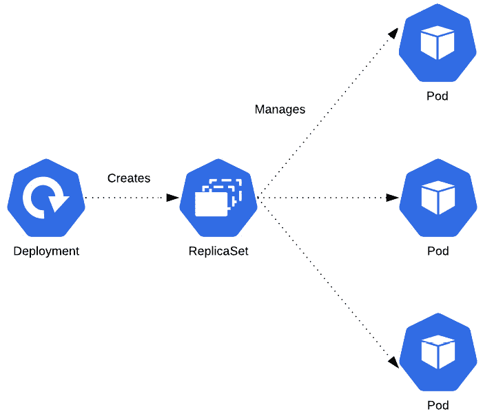
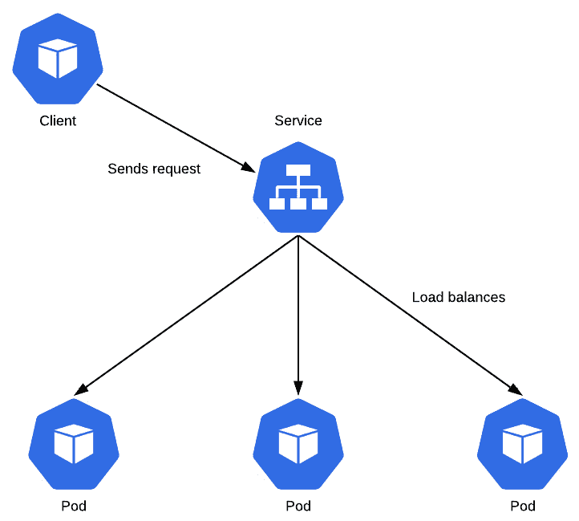
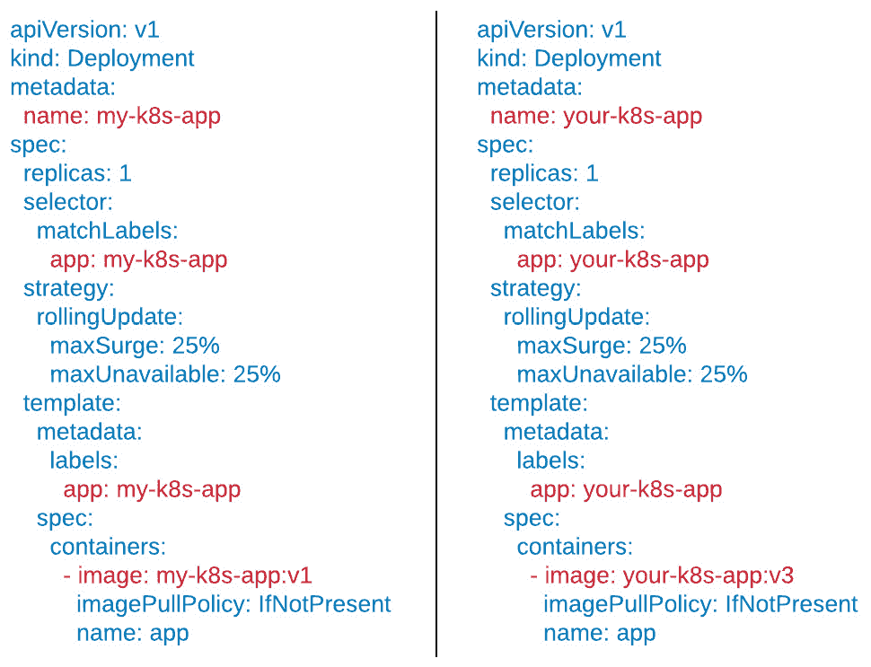

# 第一章：理解 Kubernetes 和 Helm

感谢您选择了本书《学习 Helm》。如果您对本书感兴趣，您可能已经意识到现代应用程序带来的挑战。团队面临巨大的压力，确保应用程序轻量且可扩展。应用程序还必须具有高可用性，并能承受不同的负载。在历史上，应用程序通常被部署为单体应用，或者在单个系统上提供的大型单层应用。随着时间的推移，行业已经转向了微服务方法，或者转向了在多个系统上提供的小型多层应用。行业通常使用容器技术进行部署，开始利用诸如 Kubernetes 之类的工具来编排和扩展其容器化的微服务。

然而，Kubernetes 也带来了自己的一系列挑战。虽然它是一个有效的容器编排工具，但它提供了一个陡峭的学习曲线，对团队来说可能很难克服。一个帮助简化在 Kubernetes 上运行工作负载挑战的工具是 Helm。Helm 允许用户更简单地部署和管理 Kubernetes 应用程序的生命周期。它抽象了许多配置 Kubernetes 应用程序的复杂性，并允许团队在平台上更加高效地工作。

在本书中，您将探索 Helm 提供的每个好处，并了解 Helm 如何使在 Kubernetes 上部署应用程序变得更简单。您将首先扮演终端用户的角色，使用社区编写的 Helm 图表，并学习利用 Helm 作为软件包管理器的最佳实践。随着本书的进展，您将扮演 Helm 图表开发人员的角色，并学习如何以易于消费和高效的方式打包 Kubernetes 应用程序。在本书的最后，您将了解关于应用程序管理和安全性的高级模式。

让我们首先了解微服务、容器、Kubernetes 以及这些方面对应用程序部署带来的挑战。然后，我们将讨论 Helm 的主要特点和好处。在本章中，我们将涵盖以下主要主题：

+   单体应用、微服务和容器

+   Kubernetes 概述

+   Kubernetes 应用的部署方式

+   配置 Kubernetes 资源的挑战

+   Helm 提供的简化在 Kubernetes 上部署应用程序的好处

# 从单体应用到现代微服务

软件应用程序是大多数现代技术的基础组成部分。无论它们是以文字处理器、网络浏览器还是媒体播放器的形式出现，它们都能够使用户进行交互以完成一个或多个任务。应用程序有着悠久而传奇的历史，从第一台通用计算机 ENIAC 的时代，到阿波罗太空任务将人类送上月球，再到互联网、社交媒体和在线零售的兴起。

这些应用程序可以在各种平台和系统上运行。我们说在大多数情况下它们在虚拟或物理资源上运行，但这难道是唯一的选择吗？根据它们的目的和资源需求，整个机器可能会被专门用来满足应用程序的计算和/或存储需求。幸运的是，部分归功于摩尔定律的实现，微处理器的功率和性能最初每年都在增加，同时与物理资源相关的整体成本也在增加。这一趋势在最近几年有所减弱，但这一趋势的出现以及在处理器存在的前 30 年中的持续对技术的进步起着关键作用。

软件开发人员充分利用了这一机会，在他们的应用程序中捆绑了更多的功能和组件。因此，一个单一的应用程序可能由几个较小的组件组成，每个组件本身都可以被编写为它们自己的独立服务。最初，捆绑组件在一起带来了几个好处，包括简化的部署过程。然而，随着行业趋势的改变，企业更加关注能够更快地交付功能，一个可部署的单一应用程序的设计也带来了许多挑战。每当需要进行更改时，整个应用程序及其所有基础组件都需要再次验证，以确保更改没有不利的特性。这个过程可能需要多个团队的协调，从而减慢了功能的整体交付速度。

更快地交付功能，特别是跨组织内的传统部门，也是组织所期望的。这种快速交付的概念是 DevOps 实践的基础，其在 2010 年左右开始流行起来。DevOps 鼓励对应用程序进行更多的迭代更改，而不是在开发之前进行广泛的规划。为了在这种新模式下可持续发展，架构从单一的大型应用程序发展为更青睐能够更快交付的几个较小的应用程序。由于这种思维方式的改变，更传统的应用程序设计被标记为“单片”。将组件分解为单独的应用程序的这种新方法被称为“微服务”。微服务应用程序固有的特征带来了一些理想的特性，包括能够同时开发和部署服务，以及独立扩展（增加实例数量）。

软件架构从单片到微服务的变化也导致重新评估应用程序在运行时的打包和部署方式。传统上，整个机器都专门用于一个或两个应用程序。现在，由于微服务导致单个应用程序所需资源的总体减少，将整个机器专门用于一个或两个微服务已不再可行。

幸运的是，一种名为“容器”的技术被引入并因填补许多缺失的功能而受到欢迎，以创建微服务运行时环境。Red Hat 将容器定义为“一组与系统其余部分隔离的一个或多个进程，并包括运行所需的所有文件”（https://www.redhat.com/en/topics/containers/whats-a-linux-container）。容器化技术在计算机领域有着悠久的历史，可以追溯到 20 世纪 70 年代。许多基础容器技术，包括 chroot（能够更改进程和其任何子进程的根目录到文件系统上的新位置）和 jails，今天仍在使用中。

简单且便携的打包模型，以及在每台物理或虚拟机上创建许多隔离的沙盒的能力的结合，导致了微服务领域容器的快速采用。2010 年代中期容器流行的上升也可以归因于 Docker，它通过简化的打包和可以在 Linux、macOS 和 Windows 上使用的运行时将容器带给了大众。轻松分发容器镜像的能力导致了容器技术的流行增加。这是因为首次用户不需要知道如何创建镜像，而是可以利用其他人创建的现有镜像。

容器和微服务成为了天作之合。应用程序具有打包和分发机制，以及共享相同计算占用的能力，同时又能够从彼此隔离。然而，随着越来越多的容器化微服务被部署，整体管理成为了一个问题。你如何确保每个运行的容器的健康？如果一个容器失败了怎么办？如果你的底层机器没有所需的计算能力会发生什么？于是 Kubernetes 应运而生，它帮助解决了容器编排的需求。

在下一节中，我们将讨论 Kubernetes 的工作原理以及它为企业提供的价值。

# 什么是 Kubernetes？

Kubernetes，通常缩写为**k8s**（发音为**kaytes**），是一个开源的容器编排平台。起源于谷歌的专有编排工具 Borg，该项目于 2015 年开源并更名为 Kubernetes。在 2015 年 7 月 21 日发布 v1.0 版本后，谷歌和 Linux 基金会合作成立了**云原生计算基金会**（**CNCF**），该基金会目前是 Kubernetes 项目的维护者。

Kubernetes 这个词是希腊词，意思是“舵手”或“飞行员”。舵手是负责操纵船只并与船员紧密合作以确保航行安全和稳定的人。Kubernetes 对于容器和微服务有类似的责任。Kubernetes 负责容器的编排和调度。它负责“操纵”这些容器到能够处理它们工作负载的工作节点。Kubernetes 还将通过提供高可用性和健康检查来确保这些微服务的安全。

让我们回顾一些 Kubernetes 如何帮助简化容器化工作负载管理的方式。

## 容器编排

Kubernetes 最突出的特性是容器编排。这是一个相当复杂的术语，因此我们将其分解为不同的部分。

容器编排是指根据容器的需求，将其放置在计算资源池中的特定机器上。容器编排的最简单用例是在可以处理其资源需求的机器上部署容器。在下图中，有一个应用程序请求 2 Gi 内存（Kubernetes 资源请求通常使用它们的“二的幂”值，在本例中大致相当于 2 GB）和一个 CPU 核心。这意味着容器将从底层机器上分配 2 Gi 内存和 1 个 CPU 核心。Kubernetes 负责跟踪具有所需资源的机器（在本例中称为节点），并将传入的容器放置在该机器上。如果节点没有足够的资源来满足请求，容器将不会被调度到该节点上。如果集群中的所有节点都没有足够的资源来运行工作负载，容器将不会被部署。一旦节点有足够的空闲资源，容器将被部署在具有足够资源的节点上：

图 1.1 - Kubernetes 编排和调度

容器编排使您不必一直努力跟踪机器上的可用资源。Kubernetes 和其他监控工具提供了对这些指标的洞察。因此，日常开发人员不需要担心可用资源。开发人员只需声明他们期望容器使用的资源量，Kubernetes 将在后台处理其余部分。

## 高可用性

Kubernetes 的另一个好处是它提供了帮助处理冗余和高可用性的功能。高可用性是防止应用程序停机的特性。它是由负载均衡器执行的，它将传入的流量分配到应用程序的多个实例中。高可用性的前提是，如果一个应用程序实例出现故障，其他实例仍然可以接受传入的流量。在这方面，避免了停机时间，最终用户，无论是人类还是另一个微服务，都完全不知道应用程序出现了故障实例。Kubernetes 提供了一种名为 Service 的网络机制，允许应用程序进行负载均衡。我们将在本章的*部署 Kubernetes 应用程序*部分更详细地讨论服务。

## 可扩展性

鉴于容器和微服务的轻量化特性，开发人员可以使用 Kubernetes 快速扩展他们的工作负载，无论是水平还是垂直方向。

水平扩展是部署更多容器实例的行为。如果一个团队在 Kubernetes 上运行他们的工作负载，并且预期负载会增加，他们可以简单地告诉 Kubernetes 部署更多他们的应用实例。由于 Kubernetes 是一个容器编排器，开发人员不需要担心这些应用将部署在哪些物理基础设施上。它会简单地在集群中找到一个具有可用资源的节点，并在那里部署额外的实例。每个额外的实例都将被添加到一个负载均衡池中，这将允许应用程序继续保持高可用性。

垂直扩展是为应用程序分配额外的内存和 CPU 的行为。开发人员可以在应用程序运行时修改其资源需求。这将促使 Kubernetes 重新部署运行实例，并将它们重新调度到可以支持新资源需求的节点上。根据配置方式的不同，Kubernetes 可以以一种防止新实例部署期间停机的方式重新部署每个实例。

## 活跃的社区

Kubernetes 社区是一个非常活跃的开源社区。因此，Kubernetes 经常收到补丁和新功能。社区还为官方 Kubernetes 文档以及专业或业余博客网站做出了许多贡献。除了文档，社区还积极参与全球各地的聚会和会议的策划和参与，这有助于增加平台的教育和创新。

Kubernetes 庞大的社区带来的另一个好处是构建了许多不同的工具来增强所提供的能力。Helm 就是其中之一。正如我们将在本章后面和整本书中看到的，Helm 是 Kubernetes 社区成员开发的一个工具，通过简化应用程序部署和生命周期管理，大大改善了开发人员的体验。

了解了 Kubernetes 为管理容器化工作负载带来的好处，现在让我们讨论一下如何在 Kubernetes 中部署应用程序。

# 部署 Kubernetes 应用程序

在 Kubernetes 上部署应用程序基本上与在 Kubernetes 之外部署应用程序类似。所有应用程序，无论是容器化还是非容器化，都必须具有围绕以下主题的配置细节：

+   网络连接

+   持久存储和文件挂载

+   可用性和冗余

+   应用程序配置

+   安全

在 Kubernetes 上配置这些细节是通过与 Kubernetes 的**应用程序编程接口**（**API**）进行交互来完成的。

Kubernetes API 充当一组端点，可以与之交互以查看、修改或删除不同的 Kubernetes 资源，其中许多用于配置应用程序的不同细节。

让我们讨论一些基本的 API 端点，用户可以与之交互，以在 Kubernetes 上部署和配置应用程序。

## 部署

我们将要探索的第一个 Kubernetes 资源称为部署。部署确定了在 Kubernetes 上部署应用程序所需的基本细节。其中一个基本细节包括 Kubernetes 应该部署的容器映像。容器映像可以在本地工作站上使用诸如`docker`和`jib`之类的工具构建，但也可以直接在 Kubernetes 上使用`kaniko`构建。因为 Kubernetes 不公开用于构建容器映像的本机 API 端点，所以我们不会详细介绍在配置部署资源之前如何构建容器映像。

除了指定容器映像外，部署还指定要部署的应用程序的副本数或实例数。创建部署时，它会生成一个中间资源，称为副本集。副本集部署应用程序的实例数量由部署上的`replicas`字段确定。应用程序部署在一个容器内，容器本身部署在一个称为 Pod 的构造内。Pod 是 Kubernetes 中的最小单位，至少封装一个容器。

部署还可以定义应用程序的资源限制、健康检查和卷挂载。创建部署时，Kubernetes 创建以下架构：

图 1.2 - 部署创建一组 Pod

Kubernetes 中的另一个基本 API 端点用于创建服务资源，我们将在下面讨论。

## 服务

虽然部署用于将应用程序部署到 Kubernetes，但它们不配置允许应用程序与 Kubernetes 通信的网络组件，Kubernetes 公开了一个用于定义网络层的单独 API 端点，称为服务。服务允许用户和其他应用程序通过为服务端点分配静态 IP 地址来相互通信。然后可以配置服务端点以将流量路由到一个或多个应用程序实例。这种配置提供了负载平衡和高可用性。

一个使用服务的示例架构在下图中描述。请注意，服务位于客户端和 Pod 之间，以提供负载平衡和高可用性：

图 1.3 - 服务负载平衡传入请求

最后一个例子，我们将讨论`PersistentVolumeClaim` API 端点。

## PersistentVolumeClaim

微服务风格的应用程序通过以临时方式维护其状态来实现自给自足。然而，存在许多情况，数据必须存在于单个容器的寿命之外。Kubernetes 通过提供一个用于抽象存储提供和消耗方式的子系统来解决这个问题。为了为他们的应用程序分配持久存储，用户可以创建一个`PersistentVolumeClaim`端点，该端点指定所需存储的类型和数量。Kubernetes 管理员负责静态分配存储，表示为`PersistentVolume`，或使用`StorageClass`动态配置存储，该存储类根据`PersistentVolumeClaim`端点分配`PersistentVolume`。`PersistentVolume`包含所有必要的存储细节，包括类型（如网络文件系统[NFS]、互联网小型计算机系统接口[iSCSI]或来自云提供商）以及存储的大小。从用户的角度来看，无论在集群中使用`PersistentVolume`分配方法或存储后端的哪种方法，他们都不需要管理存储的底层细节。在 Kubernetes 中利用持久存储的能力增加了可以在平台上部署的潜在应用程序的数量。

下图描述了持久存储的一个例子。该图假定管理员已通过`StorageClass`配置了动态配置：

图 1.4 - 由 PersistentVolumeClaim 创建的 Pod 挂载的 PersistentVolume。

Kubernetes 中有更多的资源，但到目前为止，你可能已经有了一个大致的了解。现在的问题是这些资源实际上是如何创建的？

我们将在下一节进一步探讨这个问题。

# 资源管理的方法

为了在 Kubernetes 上部署应用程序，我们需要与 Kubernetes API 交互以创建资源。 `kubectl`是我们用来与 Kubernetes API 交互的工具。 `kubectl`是一个用于将 Kubernetes API 的复杂性抽象化的命令行接口（CLI）工具，允许最终用户更有效地在平台上工作。

让我们讨论一下如何使用 `kubectl` 来管理 Kubernetes 资源。

## 命令式和声明式配置

`kubectl` 工具提供了一系列子命令，以命令式方式创建和修改资源。以下是这些命令的一个小列表：

+   `create`

+   `describe`

+   `edit`

+   `delete`

`kubectl` 命令遵循一个常见的格式：

[PRE0]

动词指的是 `kubectl` 的子命令之一，名词指的是特定的 Kubernetes 资源。例如，可以运行以下命令来创建一个部署：

[PRE1]

这将指示 `kubectl` 与部署 API 对话，并使用来自 Docker Hub 的 `busybox` 镜像创建一个名为 `my-deployment` 的新部署。

您可以使用 `kubectl` 获取有关使用 `describe` 子命令创建的部署的更多信息：

[PRE2]

此命令将检索有关部署的信息，并以可读格式格式化结果，使开发人员可以检查 Kubernetes 上的实时 `my-deployment` 部署。

如果需要对部署进行更改，开发人员可以使用 `edit` 子命令在原地修改它：

[PRE3]

此命令将打开一个文本编辑器，允许您修改部署。

在删除资源时，用户可以运行 `delete` 子命令：

[PRE4]

这将指示 API 删除名为 `my-deployment` 的部署。

一旦创建，Kubernetes 资源将作为 JSON 资源文件存在于集群中，可以将其导出为 YAML 文件以获得更大的人类可读性。可以在此处看到 YAML 格式的示例资源：

[PRE5]

前面的 YAML 格式呈现了一个非常基本的用例。它部署了来自 Docker Hub 的 `busybox` 镜像，并无限期地运行 `sleep` 命令以保持 Pod 运行。

虽然使用我们刚刚描述的 `kubectl` 子命令以命令式方式创建资源可能更容易，但 Kubernetes 允许您以声明式方式直接管理 YAML 资源，以获得对资源创建更多的控制。`kubectl` 子命令并不总是让您配置所有可能的资源选项，但直接创建 YAML 文件允许您更灵活地创建资源并填补 `kubectl` 子命令可能包含的空白。

在声明式创建资源时，用户首先以 YAML 格式编写他们想要创建的资源。接下来，他们使用`kubectl`工具将资源应用于 Kubernetes API。而在命令式配置中，开发人员使用`kubectl`子命令来管理资源，声明式配置主要依赖于一个子命令——`apply`。

声明式配置通常采用以下形式：

[PRE6]

该命令为 Kubernetes 提供了一个包含资源规范的 YAML 资源，尽管也可以使用 JSON 格式。Kubernetes 根据资源的存在与否来推断要执行的操作（创建或修改）。

应用程序可以通过以下步骤进行声明式配置：

1.  首先，用户可以创建一个名为`deployment.yaml`的文件，并提供部署的 YAML 格式规范。我们将使用与之前相同的示例：

[PRE7]

1.  然后可以使用以下命令创建部署：

[PRE8]

运行此命令后，Kubernetes 将尝试按照您指定的方式创建部署。

1.  如果要对部署进行更改，比如将`replicas`的数量更改为`2`，您首先需要修改`deployment.yaml`文件：

[PRE9]

1.  然后，您可以使用`kubectl apply`应用更改：

[PRE10]

运行该命令后，Kubernetes 将在先前应用的`deployment`上应用提供的部署声明。此时，应用程序将从`replica`值为`1`扩展到`2`。

1.  在删除应用程序时，Kubernetes 文档实际上建议以命令式方式进行操作；也就是说，使用`delete`子命令而不是`apply`：

[PRE11]

1.  通过传递`-f`标志和文件名，可以使`delete`子命令更具声明性。这样可以向`kubectl`提供在特定文件中声明的要删除的资源的名称，并允许开发人员继续使用声明性 YAML 文件管理资源。

了解了 Kubernetes 资源的创建方式，现在让我们讨论一下资源配置中涉及的一些挑战。

# 资源配置挑战

在前一节中，我们介绍了 Kubernetes 有两种不同的配置方法——命令式和声明式。一个需要考虑的问题是，在使用命令式和声明式方法创建 Kubernetes 资源时，用户需要注意哪些挑战？

让我们讨论一些最常见的挑战。

## Kubernetes 资源的多种类型

首先，Kubernetes 中有许多*许多*不同的资源。以下是开发人员应该了解的资源的简短列表：

+   部署

+   StatefulSet

+   服务

+   入口

+   ConfigMap

+   Secret

+   StorageClass

+   PersistentVolumeClaim

+   ServiceAccount

+   角色

+   RoleBinding

+   命名空间

在 Kubernetes 上部署应用程序并不像按下标有“部署”的大红按钮那么简单。开发人员需要能够确定部署其应用程序所需的资源，并且需要深入了解这些资源，以便能够适当地配置它们。这需要对平台有很多的了解和培训。虽然理解和创建资源可能已经听起来像是一个很大的障碍，但实际上这只是许多不同操作挑战的开始。

## 保持活动和本地状态同步

我们鼓励的一种配置 Kubernetes 资源的方法是将它们的配置保留在源代码控制中，供团队编辑和共享，这也使得源代码控制存储库成为真相的来源。在源代码控制中定义的配置（称为“本地状态”）然后通过将它们应用到 Kubernetes 环境中来创建，并且资源变为“活动”或进入可以称为“活动状态”的状态。这听起来很简单，但当开发人员需要对其资源进行更改时会发生什么？正确的答案应该是修改本地文件并应用更改，以将本地状态与活动状态同步，以更新真相的来源。然而，这通常不是最终发生的事情。在短期内，更改活动资源的位置通常更简单，而不是修改本地文件。这会导致本地和活动状态之间的状态不一致，并且使得在 Kubernetes 上扩展变得困难。

## 应用程序生命周期很难管理

生命周期管理是一个复杂的术语，但在这个上下文中，我们将把它称为安装、升级和回滚应用程序的概念。在 Kubernetes 世界中，安装会创建资源来部署和配置应用程序。初始安装将创建我们在这里称为应用程序的“版本 1”。

然后，升级可以被视为对一个或多个 Kubernetes 资源的编辑或修改。每一批编辑可以被视为一个单独的升级。开发人员可以修改单个服务资源，将版本号提升到“版本 2”。然后开发人员可以修改部署、配置映射和服务，将版本计数提升到“版本 3”。

随着应用程序的新版本继续部署到 Kubernetes 上，跟踪已发生的更改变得更加困难。在大多数情况下，Kubernetes 没有固有的方式来记录更改的历史。虽然这使得升级更难以跟踪，但也使得恢复先前版本的应用程序变得更加困难。假设开发人员之前对特定资源进行了错误的编辑。团队如何知道要回滚到哪个版本？`n-1`情况特别容易解决，因为那是最近的版本。然而，如果最新的稳定版本是五个版本之前呢？团队经常因为无法快速识别先前有效的最新稳定配置而不得不匆忙解决问题。

## 资源文件是静态的。

这是一个主要影响应用 YAML 资源的声明性配置风格的挑战。遵循声明性方法的困难部分在于，Kubernetes 资源文件并非原生设计为可参数化。资源文件大多被设计为在应用之前完整地编写出来，并且内容保持不变，直到文件被修改。在处理 Kubernetes 时，这可能是一个令人沮丧的现实。一些 API 资源可能会很长，包含许多不同的可定制字段，因此完整地编写和配置 YAML 资源可能会非常繁琐。

静态文件很容易变成样板文件。样板文件代表在不同但相似的上下文中基本保持一致的文本或代码。如果开发人员管理多个不同的应用程序，可能需要管理多个不同的部署资源、多个不同的服务资源等。比较不同应用程序的资源文件时，可能会发现它们之间存在大量相似的 YAML 配置。

下图描述了两个资源之间具有重要样板配置的示例。蓝色文本表示样板行，而红色文本表示唯一行：

图 1.5 - 两个具有样板的资源示例

在这个例子中，请注意，每个文件几乎完全相同。当管理类似这样相似的文件时，样板变成了团队以声明方式管理其应用程序的主要头痛。

# Helm 来拯救！

随着时间的推移，Kubernetes 社区发现创建和维护用于部署应用程序的 Kubernetes 资源是困难的。这促使开发了一个简单而强大的工具，可以让团队克服在 Kubernetes 上部署应用程序时所面临的挑战。创建的工具称为 Helm。Helm 是一个用于在 Kubernetes 上打包和部署应用程序的开源工具。它通常被称为**Kubernetes 软件包管理器**，因为它与您在喜爱的操作系统上找到的任何其他软件包管理器非常相似。Helm 在整个 Kubernetes 社区广泛使用，并且是一个 CNCF 毕业项目。

鉴于 Helm 与传统软件包管理器的相似之处，让我们首先通过回顾软件包管理器的工作原理来开始探索 Helm。

## 理解软件包管理器

软件包管理器用于简化安装、升级、回滚和删除系统应用程序的过程。这些应用程序以称为**软件包**的单位进行定义，其中包含了关于目标软件及其依赖关系的元数据。

软件包管理器背后的过程很简单。首先，用户将软件包的名称作为参数传递。然后，软件包管理器执行针对软件包存储库的查找，以查看该软件包是否存在。如果找到了，软件包管理器将安装由软件包及其依赖项定义的应用程序到系统上指定的位置。

软件包管理器使管理软件变得非常容易。举个例子，假设你想要在 Fedora 机器上安装`htop`，一个 Linux 系统监视器。安装这个软件只需要输入一个命令：

[PRE12]

这会指示自 2015 年以来成为 Fedora 软件包管理器的 `dnf` 在 Fedora 软件包存储库中查找 `htop` 并安装它。`dnf`还负责安装`htop`软件包的依赖项，因此您无需担心事先安装其要求。在`dnf`从上游存储库中找到`htop`软件包后，它会询问您是否确定要继续。`--assumeyes`标志会自动回答`yes`这个问题和`dnf`可能潜在询问的任何其他提示。

随着时间的推移，新版本的`htop`可能会出现在上游存储库中。`dnf`和其他软件包管理器允许用户高效地升级软件的新版本。允许用户使用`dnf`进行升级的子命令是升级：

[PRE13]

这会指示`dnf`将`htop`升级到最新版本。它还会将其依赖项升级到软件包元数据中指定的版本。

虽然向前迈进通常更好，但软件包管理器也允许用户向后移动，并在必要时将应用程序恢复到先前的版本。`dnf`使用`downgrade`子命令来实现这一点：

[PRE14]

这是一个强大的过程，因为软件包管理器允许用户在报告关键错误或漏洞时快速回滚。

如果您想彻底删除一个应用程序，软件包管理器也可以处理。`dnf`提供了`remove`子命令来实现这一目的：

[PRE15]

在本节中，我们回顾了在 Fedora 上使用`dnf`软件包管理器来管理软件包的方法。作为 Kubernetes 软件包管理器的 Helm 与`dnf`类似，无论是在目的还是功能上。`dnf`用于在 Fedora 上管理应用程序，Helm 用于在 Kubernetes 上管理应用程序。我们将在接下来更详细地探讨这一点。

## Kubernetes 软件包管理器

考虑到 Helm 的设计目的是提供类似于软件包管理器的体验，`dnf`或类似工具的有经验的用户将立即理解 Helm 的基本概念。然而，当涉及到具体的实现细节时，情况变得更加复杂。`dnf`操作`RPM`软件包，提供可执行文件、依赖信息和元数据。另一方面，Helm 使用**charts**。Helm chart 可以被视为 Kubernetes 软件包。Charts 包含部署应用程序所需的声明性 Kubernetes 资源文件。与`RPM`类似，它还可以声明应用程序运行所需的一个或多个依赖项。

Helm 依赖于存储库来提供对图表的广泛访问。图表开发人员创建声明性的 YAML 文件，将它们打包成图表，并将它们发布到图表存储库。然后，最终用户使用 Helm 搜索现有的图表，以部署到 Kubernetes，类似于`dnf`的最终用户搜索要部署到 Fedora 的`RPM`软件包。

让我们通过一个基本的例子来看看。Helm 可以使用发布到上游存储库的图表来部署`Redis`，一个内存缓存，到 Kubernetes 中。这可以使用 Helm 的`install`命令来执行：

[PRE16]

这将在 bitnami 图表存储库中安装`redis`图表到名为`redis`的 Kubernetes 命名空间。这个安装将被称为初始**修订**，或者 Helm 图表的初始部署。

如果`redis`图表的新版本可用，用户可以使用`upgrade`命令升级到新版本：

[PRE17]

这将升级`Redis`，以满足新的`redis`-ha 图表定义的规范。

在操作系统中，用户应该关注如果发现了错误或漏洞，如何回滚。在 Kubernetes 上的应用程序也存在同样的问题，Helm 提供了回滚命令来处理这种情况：

[PRE18]

这个命令将`Redis`回滚到它的第一个修订版本。

最后，Helm 提供了使用`uninstall`命令彻底删除`Redis`的能力：

[PRE19]

比较`dnf`，Helm 的子命令，以及它们在下表中提供的功能。注意`dnf`和 Helm 提供了类似的命令，提供了类似的用户体验：

理解了 Helm 作为一个包管理器的功能，让我们更详细地讨论 Helm 为 Kubernetes 带来的好处。Helm 的好处

在本章的前面，我们回顾了如何通过管理 Kubernetes 资源来创建 Kubernetes 应用程序，并讨论了一些涉及的挑战。以下是 Helm 可以克服这些挑战的几种方式。

### 抽象的 Kubernetes 资源的复杂性

假设开发人员被要求在 Kubernetes 上部署 MySQL 数据库。开发人员需要创建所需的资源来配置其容器、网络和存储。从头开始配置这样的应用程序所需的 Kubernetes 知识量很高，对于新手甚至中级的 Kubernetes 用户来说是一个很大的障碍。

使用 Helm，负责部署 MySQL 数据库的开发人员可以简单地在上游图表存储库中搜索 MySQL 图表。这些图表已经由社区中的图表开发人员编写，并且已经包含了部署 MySQL 数据库所需的声明性配置。在这方面，具有这种任务的开发人员将像任何其他软件包管理器一样使用 Helm 作为简单的最终用户。

### 持续的修订历史

Helm 有一个称为发布历史的概念。当首次安装 Helm 图表时，Helm 将该初始修订添加到历史记录中。随着修订通过升级的增加，历史记录会进一步修改，保留应用程序在不同修订中配置的各种快照。

以下图表描述了持续的修订历史。蓝色的方块说明了资源已经从其先前版本进行了修改：

图 1.6 - 修订历史的示例

跟踪每个修订的过程为回滚提供了机会。Helm 中的回滚非常简单。用户只需将 Helm 指向先前的修订，Helm 将 live 状态恢复到所选修订的状态。有了 Helm，过去的`n-1`备份已经过时。Helm 允许用户将其应用程序回滚到他们想要的任何时间，甚至可以回滚到最初的安装。

### 动态配置声明性资源

以声明方式创建资源的最大麻烦之一是 Kubernetes 资源是静态的，无法参数化。正如您可能还记得的那样，这导致资源在应用程序和类似配置之间变得样板化，使团队更难以将其应用程序配置为代码。Helm 通过引入**值**和**模板**来缓解这些问题。

值就是 Helm 称为图表参数的简单东西。模板是基于给定值集的动态生成文件。这两个构造为图表开发人员提供了根据最终用户提供的值自动生成基于值的 Kubernetes 资源的能力。通过这样做，由 Helm 管理的应用程序变得更加灵活，减少样板代码，并更易于维护。

值和模板允许用户执行以下操作：

+   参数化常见字段，比如在部署中的图像名称和服务中的端口

+   根据用户输入生成长篇的 YAML 配置，比如在部署中的卷挂载或 ConfigMap 中的数据

+   根据用户输入包含或排除资源

能够动态生成声明性资源文件使得创建基于 YAML 的资源变得更简单，同时确保应用以一种易于复制的方式创建。

### 本地和实时状态之间的一致性

软件包管理器可以防止用户手动管理应用程序及其依赖关系。所有管理都可以通过软件包管理器本身完成。Helm 也是如此。因为 Helm 图表包含了灵活的 Kubernetes 资源配置，用户不应该直接对实时的 Kubernetes 资源进行修改。想要修改他们的应用程序的用户可以通过向 Helm 图表提供新值或将其应用程序升级到相关图表的更新版本来实现。这使得本地状态（由 Helm 图表配置表示）和实时状态在修改过程中保持一致，使用户能够为他们的 Kubernetes 资源配置提供真实的来源。

### 智能部署

Helm 通过确定 Kubernetes 资源需要创建的顺序来简化应用部署。Helm 分析每个图表的资源，并根据它们的类型对它们进行排序。这种预先确定的顺序存在是为了确保常常有资源依赖于它们的资源首先被创建。例如，Secrets 和 ConfigMaps 应该在部署之前创建，因为部署很可能会使用这些资源作为卷。Helm 在没有用户交互的情况下执行此排序，因此这种复杂性被抽象化，用户无需担心这些资源被应用的顺序。

### 自动生命周期钩子

与其他软件包管理器类似，Helm 提供了定义生命周期钩子的能力。生命周期钩子是在应用程序生命周期的不同阶段自动执行的操作。它们可以用来执行诸如以下操作：

+   在升级时执行数据备份。

+   在回滚时恢复数据。

+   在安装之前验证 Kubernetes 环境。

生命周期钩子非常有价值，因为它们抽象了可能不是特定于 Kubernetes 的任务的复杂性。例如，Kubernetes 用户可能不熟悉数据库备份背后的最佳实践，或者可能不知道何时应执行此类任务。生命周期钩子允许专家编写自动化，以在建议时执行这些最佳实践，以便用户可以继续高效工作，而无需担心这些细节。

# 摘要

在本章中，我们首先探讨了采用基于微服务的架构的变化趋势，将应用程序分解为几个较小的应用程序，而不是部署一个庞大的单体应用程序。创建更轻量级且更易管理的应用程序导致利用容器作为打包和运行时格式，以更频繁地发布版本。通过采用容器，引入了额外的运营挑战，并通过使用 Kubernetes 作为容器编排平台来管理容器生命周期来解决这些挑战。

我们讨论了配置 Kubernetes 应用程序的各种方式，包括部署、服务和持久卷索赔。这些资源可以使用两种不同的应用程序配置样式来表示：命令式和声明式。这些配置样式中的每一种都对部署 Kubernetes 应用程序涉及的一系列挑战做出了贡献，包括理解 Kubernetes 资源工作的知识量以及管理应用程序生命周期的挑战。

为了更好地管理构成应用程序的每个资产，Helm 被引入为 Kubernetes 的软件包管理器。通过其丰富的功能集，可以轻松管理应用程序的完整生命周期，包括安装、升级、回滚和删除。

在下一章中，我们将详细介绍配置 Helm 环境的过程。我们还将安装所需的工具，以便使用 Helm 生态系统，并按照本书提供的示例进行操作。

# 进一步阅读

有关构成应用程序的 Kubernetes 资源的更多信息，请参阅 Kubernetes 文档中的*了解 Kubernetes 对象*页面，网址为 https://kubernetes.io/docs/concepts/overview/working-with-objects/kubernetes-objects/。

为了加强本章讨论的 Helm 的一些好处，请参考 Helm 文档中的*使用 Helm*页面，网址为 https://helm.sh/docs/intro/using_helm/。 （本页还深入讨论了 Helm 周围的一些基本用法，这将在本书中更详细地讨论。）

# 问题

1.  单体应用和微服务应用有什么区别？

1.  Kubernetes 是什么？它旨在解决什么问题？

1.  在部署应用程序到 Kubernetes 时，常用的一些`kubectl`命令是什么？

1.  在部署应用程序到 Kubernetes 时通常涉及哪些挑战？

1.  Helm 如何作为 Kubernetes 的包管理器？它是如何解决 Kubernetes 提出的挑战的？

1.  假设您想要回滚在 Kubernetes 上部署的应用程序。哪个 Helm 命令允许您执行此操作？Helm 如何跟踪您的更改以使此回滚成为可能？

1.  允许 Helm 作为包管理器运行的四个主要 Helm 命令是什么？
