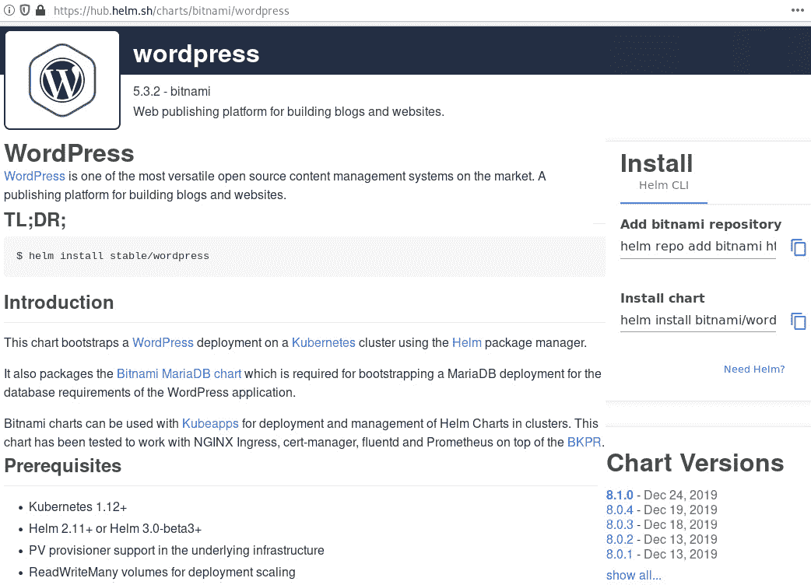
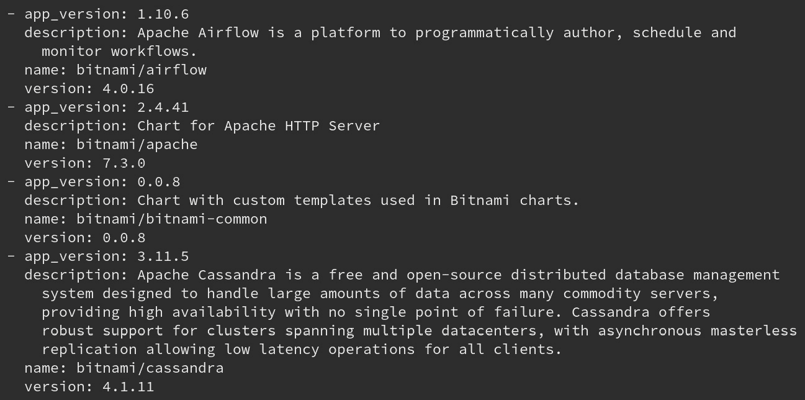
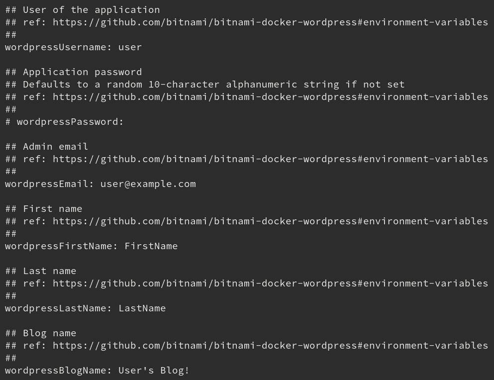

# 第三章：安装您的第一个 Helm 图表

在本书的早期，我们将 Helm 称为“Kubernetes 软件包管理器”，并将其与操作系统的软件包管理器进行了比较。软件包管理器允许用户快速轻松地安装各种复杂性的应用程序，并管理应用程序可能具有的任何依赖关系。Helm 以类似的方式工作。

用户只需确定他们想要在 Kubernetes 上部署的应用程序，Helm 会为他们完成其余的工作。Helm 图表——Kubernetes 资源的打包——包含安装应用程序所需的逻辑和组件，允许用户执行安装而无需知道具体所需的资源。用户还可以传递参数，称为值，到 Helm 图表中，以配置应用程序的不同方面，而无需知道正在配置的 Kubernetes 资源的具体细节。您将通过本章来利用 Helm 作为软件包管理器，在 Kubernetes 上部署 WordPress 实例，来探索这些功能。

本章将涵盖以下主要主题：

+   在 Helm Hub 上找到 WordPress 图表

+   创建 Kubernetes 环境

+   附加安装说明

+   安装 WordPress 图表

+   访问 WordPress 应用程序

+   升级 WordPress 发布

+   回滚 WordPress 发布

+   卸载 WordPress 发布

# 技术要求

本章将使用以下软件技术：

+   `minikube`

+   `kubectl`

+   `helm`

我们将假设这些组件已经安装在您的系统上。有关这些工具的更多信息，包括安装和配置，请参阅*第二章*，*准备 Kubernetes 和 Helm 环境*。

# 了解 WordPress 应用程序

在本章中，您将使用 Helm 在 Kubernetes 上部署**WordPress**。WordPress 是一个用于创建网站和博客的开源**内容管理系统**（**CMS**）。有两种不同的变体可用——[WordPress.com](http://WordPress.com)和[WordPress.org](http://WordPress.org)。[WordPress.com](http://WordPress.com)是 CMS 的**软件即服务**（**SaaS**）版本，这意味着 WordPress 应用程序及其组件已经由 WordPress 托管和管理。在这种情况下，用户不需要担心安装自己的 WordPress 实例，因为他们可以简单地访问已经可用的实例。另一方面，[WordPress.org](http://WordPress.org)是自托管选项。它要求用户部署自己的 WordPress 实例，并需要专业知识来维护。

由于[WordPress.com](http://WordPress.com)更容易上手，可能听起来更加可取。然而，这个 WordPress 的 SaaS 版本与自托管的[WordPress.org](http://WordPress.org)相比有很多缺点：

+   它不提供与[WordPress.org](http://WordPress.org)一样多的功能。

+   它不给用户对网站的完全控制。

+   它要求用户支付高级功能。

+   它不提供修改网站后端代码的能力。

另一方面，自托管的[WordPress.org](http://WordPress.org)版本让用户完全控制他们的网站和 WordPress 实例。它提供完整的 WordPress 功能集，从安装插件到修改后端代码。

自托管的 WordPress 实例需要用户部署一些不同的组件。首先，WordPress 需要一个数据库来保存网站和管理数据。 [WordPress.org](http://WordPress.org) 指出数据库必须是 **MySQL** 或 **MariaDB**，它既是网站的位置，也是管理门户。在 Kubernetes 中，部署这些组件意味着创建各种不同的资源：

+   用于数据库和管理控制台身份验证的`secrets`

+   用于外部化数据库配置的 ConfigMap

+   网络服务

+   用于数据库存储的`PersistentVolumeClaim`

+   用于以有状态的方式部署数据库的 StatefulSet

+   用于部署前端的`Deployment`

创建这些 Kubernetes 资源需要 WordPress 和 Kubernetes 方面的专业知识。需要 WordPress 方面的专业知识，因为用户需要了解所需的物理组件以及如何配置它们。需要 Kubernetes 方面的专业知识，因为用户需要知道如何将 WordPress 的要求表达为 Kubernetes 资源。考虑到所需的资源的复杂性和数量，将 WordPress 部署到 Kubernetes 上可能是一项艰巨的任务。

这项任务带来的挑战是 Helm 的一个完美用例。用户可以利用 Helm 作为软件包管理器，在不需要专业知识的情况下，在 Kubernetes 上部署和配置 WordPress，而不是专注于创建和配置我们已描述的每个 Kubernetes 资源。首先，我们将探索一个名为 **Helm Hub** 的平台，以找到 WordPress Helm 图表。之后，我们将使用 Helm 在 Kubernetes 集群上部署 WordPress，并在此过程中探索基本的 Helm 功能。

# 查找 WordPress 图表

Helm 图表可以通过发布到图表存储库来供使用。图表存储库是存储和共享打包图表的位置。存储库只是作为 HTTP 服务器托管，并且可以采用各种实现形式，包括 GitHub 页面、Amazon S3 存储桶或简单的 Web 服务器，如 Apache HTTPD。

为了能够使用存储在存储库中的现有图表，Helm 首先需要配置到一个可以使用的存储库。这可以通过使用 `helm repo add` 来添加存储库来实现。添加存储库涉及的一个挑战是，有许多不同的图表存储库可供使用；可能很难找到适合您用例的特定存储库。为了更容易找到图表存储库，Helm 社区创建了一个名为 Helm Hub 的平台。

Helm Hub 是上游图表存储库的集中位置。由一个名为 **Monocular** 的社区项目提供支持，Helm Hub 旨在汇总所有已知的公共图表存储库并提供搜索功能。在本章中，我们将使用 Helm Hub 平台来搜索 WordPress Helm 图表。一旦找到合适的图表，我们将添加该图表所属的存储库，以便安装后续使用。

首先，可以通过命令行或 Web 浏览器与 Helm Hub 进行交互。当使用命令行搜索 Helm 图表时，返回的结果提供了 Helm Hub 的 URL，可以用来查找有关图表的其他信息以及如何添加其图表存储库的说明。

让我们按照这个工作流程来添加一个包含 WordPress 图表的图表存储库。

## 从命令行搜索 WordPress 图表

一般来说，Helm 包含两个不同的搜索命令，以帮助我们找到 Helm 图表：

+   要在 Helm Hub 或 Monocular 实例中搜索图表，请使用以下命令：

```
helm search hub
```

+   要在图表中搜索关键字，请使用以下命令：

```
helm search repo
```

如果之前没有添加存储库，用户应该运行`helm search hub`命令来查找所有公共图表存储库中可用的 Helm 图表。添加存储库后，用户可以运行`helm search repo`来搜索这些存储库中的图表。

让我们在 Helm Hub 中搜索任何现有的 WordPress 图表。Helm Hub 中的每个图表都有一组关键字，可以针对其进行搜索。执行以下命令来查找包含`wordpress`关键字的图表：

```
$ helm search hub wordpress
```

运行此命令后，应显示类似以下的输出：


图 3.1–运行`helm search hub wordpress`的输出

该命令返回的每行输出都是来自 Helm Hub 的图表。输出将显示每个图表的 Helm Hub 页面的 URL。它还将显示图表版本，这是 Helm 图表的最新版本，以及应用程序版本，这是图表默认部署的应用程序版本。该命令还将打印每个图表的描述，通常会说明图表部署的应用程序。

正如您可能已经注意到的，返回的一些值被截断了。这是因为`helm search hub`的默认输出是一个表，导致结果以表格格式返回。默认情况下，宽度超过 50 个字符的列会被截断。可以通过指定`--max-col-width=0`标志来避免这种截断。

尝试运行以下命令，包括`--max-col-width`标志，以查看表格格式中未截断的结果：

```
$ helm search hub wordpress  --max-col-width=0
```

结果以表格格式显示每个字段的完整内容，包括 URL 和描述。

URL 如下：

+   [`hub.helm.sh/charts/bitnami/wordpress`](https://hub.helm.sh/charts/bitnami/wordpress)

+   [`hub.helm.sh/charts/presslabs/wordpress-site`](https://hub.helm.sh/charts/presslabs/wordpress-site)

+   [`hub.helm.sh/charts/presslabs/wordpress-operator`](https://hub.helm.sh/charts/presslabs/wordpress-operator)

描述如下：

+   `用于构建博客和网站的网络发布平台。`

+   `用于在 Presslabs Stack 上部署 WordPress 站点的 Helm 图表`

+   `Presslabs WordPress Operator Helm Chart`

或者，用户可以传递`--output`标志，并指定`yaml`或`json`输出，这将以完整形式打印搜索结果。

尝试再次运行上一个命令，带上`--output yaml`标志：

```
$ helm search hub wordpress --output yaml
```

结果将以 YAML 格式显示，类似于此处显示的输出：


图 3.2 - `helm search hub wordpress--output yaml`的输出

在此示例中，我们将选择安装在前面示例输出中返回的第一个图表。要了解有关此图表及其安装方式的更多信息，我们可以转到[`hub.helm.sh/charts/bitnami/wordpress`](https://hub.helm.sh/charts/bitnami/wordpress)，这将帮助我们从 Helm Hub 查看图表。

生成的内容将在下一节中探讨。

## 在浏览器中查看 WordPress 图表

使用`helm search hub`是在 Helm Hub 上搜索图表的最快方法。但是，它并不提供安装所需的所有细节。换句话说，用户需要知道图表的存储库 URL，以便添加其存储库并安装图表。图表的 Helm Hub 页面可以提供此 URL，以及其他安装细节。

将 WordPress 图表的 URL 粘贴到浏览器窗口后，应显示类似以下内容的页面：



图 3.3 - 来自 Helm Hub 的 WordPress Helm 图表

Helm Hub 上的 WordPress 图表页面提供了许多详细信息，包括图表的维护者（**Bitnami**，这是一家提供可部署到不同环境的软件包的公司）以及有关图表的简要介绍（说明此图表将在 Kubernetes 上部署一个 WordPress 实例，并将 Bitnami MariaDB 图表作为依赖项）。该网页还提供了安装详细信息，包括用于配置安装的图表支持的值，以及 Bitnami 的图表存储库 URL。这些安装详细信息使用户能够添加此存储库并安装 WordPress 图表。

在页面的右侧，您应该会看到一个名为**添加 bitnami 存储库**的部分。该部分包含可用于添加 Bitnami 图表存储库的命令。让我们看看如何使用它：

1.  在命令行中运行以下命令：

```
$ helm repo add bitnami https://charts.bitnami.com
```

1.  通过运行`helm repo list`来验证图表是否已添加：

```
$ helm repo list
NAME  	 URL 
bitnami     https://charts.bitnami.com
```

现在我们已经添加了存储库，我们可以做更多事情。

1.  运行以下命令来查看包含`bitnami`关键字的本地配置存储库中的图表：

```
$ helm search repo bitnami --output yaml
```

以下输出显示了返回的结果的缩短列表：



图 3.4 - `helm search repo bitnami --output yaml`的输出

与`helm search hub`命令类似，`helm search repo`命令接受关键字作为参数。使用`bitnami`作为关键字将返回`bitnami`存储库下的所有图表，以及可能还包含`bitnami`关键字的存储库外的图表。

为了确保您现在可以访问 WordPress 图表，请使用`wordpress`参数运行以下`helm search repo`命令：

```
$ helm search repo wordpress
```

输出将显示您在 Helm Hub 上找到并在浏览器中观察到的 WordPress 图表：


图 3.5 - `helm search repo wordpress`的输出

斜杠（`/`）前的`NAME`字段中的值表示返回的 Helm 图表所在的存储库的名称。截至撰写本文时，`bitnami`存储库中 WordPress 图表的最新版本是`8.1.0`。这是将用于安装的版本。通过向`search`命令传递`--versions`标志可以观察以前的版本：

```
$ helm search repo wordpress --versions
```

然后，您应该看到每个可用 WordPress 图表的每个版本的新行：


图 3.6 - bitnami 存储库上 WordPress 图表的版本列表

现在已经确定了 WordPress 图表，并且已经添加了图表的存储库，我们将探讨如何使用命令行来了解有关图表的更多信息，以准备在下一节中进行安装。

## 从命令行显示 WordPress 图表信息

您可以在其 Helm Hub 页面上找到有关 Helm 图表的许多重要细节。一旦图表存储库被本地添加，这些信息（以及更多）也可以通过以下列表中描述的四个`helm show`子命令从命令行中查看：

+   这个命令显示了图表的元数据（或图表定义）：

```
helm show chart
```

+   这个命令显示了图表的`README`文件：

```
helm show readme
```

+   这个命令显示了图表的值：

```
helm show values
```

+   这个命令显示了图表的定义、README 文件和值：

```
helm show all
```

让我们使用这些命令与 Bitnami WordPress 图表。在这些命令中，图表应该被引用为`bitnami/wordpress`。请注意，我们将传递`--version`标志来检索关于此图表版本`8.1.0`的信息。如果省略此标志，将返回图表最新版本的信息。

运行`helm show chart`命令来检索图表的元数据：

```
$ helm show chart bitnami/wordpress --version 8.1.0
```

这个命令的结果将是 WordPress 图表的**图表定义**。图表定义描述了图表的版本、依赖关系、关键字和维护者等信息：


图 3.7 - WordPress 图表定义

运行`helm show readme`命令来从命令行查看图表的 README 文件：

```
$ helm show readme bitnami/wordpress --version 8.1.0
```

这个命令的结果可能看起来很熟悉，因为图表的 README 文件也显示在其 Helm Hub 页面上。利用这个选项从命令行提供了一种快速查看 README 文件的方式，而不必打开浏览器：


图 3.8 - 在命令行中显示的 WordPress 图表的 README 文件

我们使用`helm show values`来检查图表的值。值作为用户可以提供的参数，以便定制图表安装。在本章的*为配置创建一个 values 文件*部分中，当我们安装图表时，我们将稍后运行此命令。

最后，`helm show all`将前三个命令的所有信息汇总在一起。如果您想一次检查图表的所有细节，请使用此命令。

现在我们已经找到并检查了一个 WordPress 图表，让我们设置一个 Kubernetes 环境，以便稍后安装这个图表。

# 创建一个 Kubernetes 环境

为了在本章中创建一个 Kubernetes 环境，我们将使用 Minikube。我们在*第二章*中学习了如何安装 Minikube，*准备 Kubernetes 和 Helm 环境*。

让我们按照以下步骤设置 Kubernetes：

1.  通过运行以下命令启动您的 Kubernetes 集群：

```
$ minikube start
```

1.  经过短暂的时间，您应该在输出中看到一行类似于以下内容的内容：

```
 Done! kubectl is now configured to use 'minikube'
```

1.  一旦 Minikube 集群启动并运行，为本章的练习创建一个专用命名空间。运行以下命令创建一个名为`chapter3`的命名空间：

```
$ kubectl create namespace chapter3
```

现在集群设置已经完成，让我们开始安装 WordPress 图表到您的 Kubernetes 集群。

# 安装 WordPress 图表

安装 Helm 图表是一个简单的过程，可以从检查图表的值开始。在下一节中，我们将检查 WordPress 图表上可用的值，并描述如何创建一个允许自定义安装的文件。最后，我们将安装图表并访问 WordPress 应用程序。

## 为配置创建一个 values 文件

您可以通过提供一个 YAML 格式的`values`文件来覆盖图表中定义的值。为了正确创建一个`values`文件，您需要检查图表提供的支持的值。这可以通过运行`helm show values`命令来完成，如前所述。

运行以下命令检查 WordPress 图表的值：

```
$ helm show values bitnami/wordpress --version 8.1.0
```

该命令的结果应该是一个可能值的长列表，其中许多已经设置了默认值：


图 3.9 - 运行`helm show values`生成的值列表

先前的输出显示了 WordPress 图表数值的开始。这些属性中的许多已经有默认设置，这意味着如果它们没有被覆盖，这些数值将代表图表的配置方式。例如，如果在`values`文件中没有覆盖`image`数值，WordPress 图表使用的图像将使用来自 docker.io 注册表的`bitnami/wordpress`容器图像，标签为`5.3.2-debian-9-r0`。

图表数值中以井号(`#`)开头的行是注释。注释可以用来解释一个数值或一组数值，也可以用来注释数值以取消设置它们。在先前输出的顶部的`global` YAML 段中显示了通过注释取消设置数值的示例。除非用户显式设置，否则这些数值默认情况下将被取消设置。

如果我们进一步探索`helm show values`的输出，我们可以找到与配置 WordPress 博客元数据相关的数值：



图 3.10 - 运行`helm show values`命令返回的数值

这些数值似乎对配置 WordPress 博客很重要。让我们通过创建一个`values`文件来覆盖它们。在你的机器上创建一个名为`wordpress-values.yaml`的新文件。在文件中输入以下内容：

```
wordpressUsername: helm-user
wordpressPassword: my-pass
wordpressEmail: helm-user@example.com
wordpressFirstName: Helm_is
wordpressLastName: Fun
wordpressBlogName: Learn Helm!
```

如果你愿意，可以更有创意地使用这些数值。继续从`helm show values`中列出的数值列表中，还有一个重要的数值应该在开始安装之前添加到`values`文件中，如下所示：


图 3.11 - 运行`helm show values`后返回的 LoadBalancer 数值

如注释所述，这个数值说明如果我们使用 Minikube，我们需要将默认的`LoadBalancer`类型更改为`NodePort`。在 Kubernetes 中，`LoadBalancer`服务类型用于从公共云提供商中提供负载均衡器。虽然可以通过利用`minikube tunnel`命令来支持这个数值，但将这个数值设置为`NodePort`将允许您直接访问本地端口的 WordPress 应用，而不必使用`minikube tunnel`命令。

将这个数值添加到你的`wordpress-values.yaml`文件中：

```
service:
  type: NodePort
```

一旦这个数值被添加到你的`values`文件中，你的完整的`values`文件应该如下所示：

```
wordpressUsername: helm-user
wordpressPassword: my-pass
wordpressEmail: helm-user@example.com
wordpressFirstName: Helm_is
wordpressLastName: Fun
wordpressBlogName: Learn Helm!
service:
  type: NodePort
```

现在`values`文件已经完成，让我们开始安装。

## 运行安装

我们使用`helm install`来安装 Helm 图表。标准语法如下：

```
helm install [NAME] [CHART] [flags]
```

`NAME`参数是您想要给 Helm 发布的名称。**发布**捕获了使用图表安装的 Kubernetes 资源，并跟踪应用程序的生命周期。我们将在本章中探讨发布如何工作。

`CHART`参数是安装的 Helm 图表的名称。可以通过遵循`<repo name>/<chart name>`的形式安装存储库中的图表。

`helm install`中的`flags`选项允许您进一步自定义安装。`flags`允许用户定义和覆盖值，指定要处理的命名空间等。可以通过运行`helm install --help`来查看标志列表。我们也可以将`--help`传递给其他命令，以查看它们的用法和支持的选项。

现在，对于`helm install`的使用有了适当的理解，运行以下命令：

```
$ helm install wordpress bitnami/wordpress --values=wordpress-values.yaml --namespace chapter3 --version 8.1.0
```

此命令将使用`bitnami/wordpress` Helm 图表安装一个名为`wordpress`的新发布。它将使用`wordpress-values.yaml`文件中定义的值来自定义安装，并且图表将安装在`chapter3`命名空间中。它还将部署`8.1.0`版本，如`--version`标志所定义。没有此标志，Helm 将安装 Helm 图表的最新版本。

如果图表安装成功，您应该看到以下输出：


图 3.12–成功安装 WordPress 图表的输出

此输出显示有关安装的信息，包括发布的名称、部署时间、安装的命名空间、部署状态（为`deployed`）和修订号（由于这是发布的初始安装，因此设置为`1`）。

输出还显示了与安装相关的注释列表。注释用于为用户提供有关其安装的其他信息。在 WordPress 图表的情况下，这些注释提供了有关如何访问和验证 WordPress 应用程序的信息。尽管这些注释直接在安装后出现，但可以随时使用`helm get notes`命令检索，如下一节所述。

完成第一次 Helm 安装后，让我们检查发布以观察应用的资源和配置。

## 检查您的发布

检查发布并验证其安装的最简单方法之一是列出给定命名空间中的所有 Helm 发布。为此，Helm 提供了`list`子命令。

运行以下命令以查看`chapter3`命名空间中的发布列表：

```
$ helm list --namespace chapter3
```

您应该只在此命名空间中看到一个发布，如下所示：


图 3.13 - 列出 Helm 发布的`helm list`命令的输出

`list`子命令提供以下信息：

+   发布名称

+   发布命名空间

+   发布的最新修订号

+   最新修订的时间戳

+   发布状态

+   图表名称

+   应用程序版本

请注意，状态、图表名称和应用程序版本从前面的输出中被截断。

虽然`list`子命令对于提供高级发布信息很有用，但用户可能想要了解特定发布的其他信息。Helm 提供了`get`子命令来提供有关发布的更多信息。以下列表描述了可用于提供一组详细发布信息的命令：

+   要获取命名发布的所有钩子，请运行以下命令：

```
helm get hooks
```

+   要获取命名发布的清单，请运行以下命令：

```
helm get manifest
```

+   要获取命名发布的注释，请运行以下命令：

```
helm get notes
```

+   要获取命名发布的值，请运行以下命令：

```
helm get values
```

+   要获取有关命名发布的所有信息，请运行以下命令：

```
helm get all
```

前面列表中的第一个命令`helm get hooks`用于显示给定发布的钩子。在*第五章* *构建您的第一个 Helm 图表*和*第六章* *测试 Helm 图表*中，您将了解有关构建和测试 Helm 图表时更详细地探讨钩子。目前，钩子可以被视为 Helm 在应用程序生命周期的某些阶段执行的操作。

运行以下命令以查看包含在此发布中的钩子：

```
$ helm get hooks wordpress --namespace chapter3
```

在输出中，您将找到两个带有以下注释的 Kubernetes Pod 清单：

```
'helm.sh/hook': test-success
```

此注释表示在执行`test`子命令期间运行的钩子，我们将在*第六章*中更详细地探讨，*测试 Helm 图表*。这些测试钩子为图表开发人员提供了一种确认图表是否按设计运行的机制，并且可以被最终用户安全地忽略。

由于此图表中包含的两个钩子都是用于测试目的，让我们继续进行前面列表中的下一个命令，以继续进行发布检查。

`helm get manifest`命令可用于获取作为安装的一部分创建的 Kubernetes 资源列表。请按照以下示例运行此命令：

```
$ helm get manifest wordpress --namespace chapter3
```

运行此命令后，您将看到以下 Kubernetes 清单：

+   两个`s`ecrets`清单。

+   两个`ConfigMaps`清单（第一个用于配置 WordPress 应用程序，而第二个用于测试，由图表开发人员执行，因此可以忽略）。

+   一个`PersistentVolumeClaim`清单。

+   两个`services`清单。

+   一个`Deployment`清单。

+   一个`StatefulSet`清单。

从此输出中，您可以观察到在配置 Kubernetes 资源时您的值产生了影响。一个要注意的例子是 WordPress 服务中的`type`已设置为`NodePort`：


图 3.14 - 将`type`设置为`NodePort`

您还可以观察我们为 WordPress 用户设置的其他值。这些值在 WordPress 部署中被定义为环境变量，如下所示：


图 3.15 - 值设置为环境变量

图表提供的大多数默认值都保持不变。这些默认值已应用于 Kubernetes 资源，并可以通过`helm get manifest`命令观察到。如果这些值已更改，则 Kubernetes 资源将以不同的方式配置。

让我们继续下一个`get`命令。`helm get notes`命令用于显示 Helm 发布的注释。您可能还记得，安装 WordPress 图表时显示了发布说明。这些说明提供了有关访问应用程序的重要信息，可以通过运行以下命令再次显示：

```
$ helm get notes wordpress --namespace chapter3
```

`helm get values`命令对于回忆为给定发布使用的值非常有用。运行以下命令以查看在`wordpress`发布中提供的值：

```
$ helm get values wordpress --namespace chapter3
```

此命令的结果应该看起来很熟悉，因为它们应该与`wordpress-values.yaml`文件中指定的值匹配：


图 3.16 - wordpress 发布中的用户提供的值

虽然回忆用户提供的值很有用，但在某些情况下，可能需要返回发布使用的所有值，包括默认值。这可以通过传递额外的`--all`标志来实现，如下所示：

```
$ helm get values wordpress --all --namespace chapter3
```

对于此图表，输出将会很长。以下输出显示了前几个值：


图 3.17 - wordpress 发布的所有值的子集

最后，Helm 提供了一个`helm get all`命令，可以用来聚合各种`helm get`命令的所有信息：

```
$ helm get all wordpress --namespace chapter3
```

除了 Helm 提供的命令之外，`kubectl` CLI 也可以用于更仔细地检查安装。例如，可以使用`kubectl`来缩小范围，仅查看一种类型的资源，如部署，而不是获取安装创建的所有 Kubernetes 资源。为了确保返回的资源属于 Helm 发布，可以在部署上定义一个标签，并将其提供给`kubectl`命令，以表示发布的名称。Helm 图表通常会在它们的 Kubernetes 资源上添加一个`app`标签。使用`kubectl` CLI 通过运行以下命令来检索包含此标签的部署：

```
$ kubectl get all -l app=wordpress --namespace chapter3
```

您会发现以下部署存在于`chapter3`命名空间中：


图 3.18 - `chapter3`命名空间中的 wordpress 部署

# 其他安装说明

很快，我们将探索刚刚安装的 WordPress 应用程序。首先，在离开安装主题之前，应该提到几个需要考虑的领域。

## -n 标志

可以使用`-n`标志代替`--namespace`标志，以减少输入命令时的输入工作量。这对于稍后将在本章中描述的`upgrade`和`rollback`命令也适用。从现在开始，我们将在表示 Helm 应该与之交互的命名空间时使用`-n`标志。

## 环境变量 HELM_NAMESPACE

您还可以设置一个环境变量来表示 Helm 应该与之交互的命名空间。

让我们看看如何在各种操作系统上设置这个环境变量：

+   您可以在 macOS 和 Linux 上设置变量如下：

```
$ export HELM_NAMESPACE=chapter3
```

+   Windows 用户可以通过在 PowerShell 中运行以下命令来设置此环境变量：

```
> $env:HELM_NAMESPACE = 'chapter3'
```

可以通过运行`helm env`命令来验证此变量的值：

```
$ helm env
```

您应该在结果输出中看到`HELM_NAMESPACE`变量。默认情况下，该变量设置为`default`。

在本书中，我们不会依赖`HELM_NAMESPACE`变量，而是会在每个命令旁边传递`-n`标志，以便更清楚地指出我们打算使用哪个命名空间。提供`-n`标志也是指定 Helm 命名空间的最佳方式，因为它确保我们正在针对预期的命名空间。

## 在--set 和--values 之间进行选择

对于`install`，`upgrade`和`rollback`命令，您可以选择两种方式之一来传递值给您的图表：

+   要从命令行中传递值，请使用以下命令：

```
--set
```

+   要在 YAML 文件或 URL 中指定值，请使用以下命令：

```
--values
```

在本书中，我们将把`--values`标志视为配置图表值的首选方法。原因是这种方式更容易配置多个值。维护一个`values`文件还将允许我们将这些资产保存在**源代码管理**（**SCM**）系统中，例如`git`，这样可以更容易地重现安装过程。请注意，诸如密码之类的敏感值不应存储在源代码控制存储库中。我们将在*第九章*中涵盖安全性问题，*Helm 安全性考虑*。目前，重要的是要记住不要将`secrets`推送到源代码控制存储库中。当需要在图表中提供 secrets 时，建议的方法是明确使用`--set`标志。

`--set`标志用于直接从命令行传递值。这是一个可接受的方法，适用于简单的值，以及需要配置的少量值。再次强调，使用`--set`标志并不是首选方法，因为它限制了使安装更具可重复性的能力。以这种方式配置复杂值也更加困难，例如列表或复杂映射形式的值。还有其他相关的标志，如`--set-file`和`--set-string`；`--set-file`标志用于传递一个具有`key1=val1`和`key2=val2`格式的配置值的文件，而`--set-string`标志用于将提供的所有值设置为字符串的`key1=val1`和`key2=val2`格式。

解释到此为止，让我们来探索刚刚安装的 WordPress 应用程序。

# 访问 WordPress 应用程序

WordPress 图表的发布说明提供了四个命令，您可以运行这些命令来访问您的 WordPress 应用程序。运行此处列出的四个命令：

+   对于 macOS 或 Linux，请运行以下命令：

```
$ export NODE_PORT=$(kubectl get --namespace chapter3 -o jsonpath="{.spec.ports[0].nodePort}" services wordpress)
$ export NODE_IP=$(kubectl get nodes --namespace chapter3 -o jsonpath="{.items[0].status.addresses[0].address}")
$ echo "WordPress URL: http://$NODE_IP:$NODE_PORT/"
$ echo "WordPress Admin URL: http://$NODE_IP:$NODE_PORT/admin"
```

+   对于 Windows PowerShell，请运行以下命令：

```
> $NODE_PORT = kubectl get --namespace chapter3 -o jsonpath="{.spec.ports[0].nodePort}" services wordpress | Out-String
> $NODE_IP = kubectl get nodes --namespace chapter3 -o jsonpath="{.items[0].status.addresses[0].address}" | Out-String
> echo "WordPress URL: http://$NODE_IP:$NODE_PORT/"
> echo "WordPress Admin URL: http://$NODE_IP:$NODE_PORT/admin"
```

根据一系列`kubectl`查询定义了两个环境变量后，结果的`echo`命令将显示访问 WordPress 的 URL。第一个 URL 是查看主页的 URL，访问者将通过该 URL 访问您的网站。第二个 URL 是到达管理控制台的 URL，网站管理员用于配置和管理站点内容。

将第一个 URL 粘贴到浏览器中，您应该会看到一个与此处显示的内容类似的页面：


图 3.19 – WordPress 博客页面

本页的几个部分可能会让你感到熟悉。首先，请注意屏幕左上角的博客标题为**学习 Helm**！这不仅与本书的标题相似，而且也是您在安装过程中先前提供的`wordpressBlogName`值。您还可以在页面底部的版权声明中看到这个值，**© 2020 学习 Helm！**。

影响主页定制的另一个值是`wordpressUsername`。请注意，包括的**Hello world!**帖子的作者是**helm-user**。这是提供给`wordpressUsername`值的用户的名称，如果提供了替代用户名，它将显示不同。

在上一组命令中提供的另一个链接是管理控制台。将第二个`echo`命令中的链接粘贴到浏览器中，您将看到以下屏幕：


图 3.20：WordPress 管理控制台登录页面

要登录到管理控制台，请输入安装过程中提供的`wordpressUsername`和`wordpressPassword`值。这些值可以通过查看本地的`wordpress-values.yaml`文件来查看。它们也可以通过运行 WordPress 图表注释中指定的以下命令来检索：

```
$ echo Username: helm-user
$ echo Password: $(kubectl get secret --namespace chapter3 wordpress -o jsonpath='{.data.wordpress-password}' | base64 --decode)
```

验证后，管理控制台仪表板将显示如下：


图 3.21 – WordPress 管理控制台页面

如果您负责管理这个 WordPress 网站，这就是您可以配置您的网站、撰写文章和管理插件的地方。如果您点击右上角的链接，上面写着**你好，helm-user**，您将被引导到`helm-user`个人资料页面。从那里，您可以看到安装过程中提供的其他值，如下所示：


图 3.22 – WordPress 个人资料页面

**名字**、**姓氏**和**电子邮件**字段分别指代它们对应的`wordpressFirstname`、`wordpressLastname`和`wordpressEmail` Helm 值。

随时继续探索您的 WordPress 实例。完成后，继续下一节，了解如何对 Helm 版本执行升级。

# 升级 WordPress 版本

升级版本是指修改安装版本的值或升级到图表的新版本的过程。在本节中，我们将通过配置围绕 WordPress 副本和资源需求的附加值来升级 WordPress 版本。

## 修改 Helm 值

Helm 图表通常会公开值来配置应用程序的实例数量及其相关的资源集。以下截图展示了与此目的相关的`helm show values`命令的几个部分。

第一个值`replicaCount`设置起来很简单。由于`replica`是一个描述部署应用程序所需的 Pod 数量的 Kubernetes 术语，因此可以推断出`replicaCount`用于指定作为发布的一部分部署的应用程序实例的数量：


图 3.23 - `helm show values`命令中的`replicaCount`

将以下行添加到您的`wordpress-values.yaml`文件中，将副本数从`1`增加到`2`：

```
replicaCount: 2
```

我们需要定义的第二个值是`resources` YAML 部分下的一组值：


图 3.24 - 资源部分的值

值可以缩进，就像`resources`部分一样，以提供逻辑分组。在`resources`部分下是一个`requests`部分，用于配置 Kubernetes 将分配给 WordPress 应用程序的`memory`和`cpu`值。让我们在升级过程中修改这些值，将内存请求减少到`256Mi`（256 mebibytes），将`cpu`请求减少到`100m`（100 millicores）。将这些修改添加到`wordpress-values.yaml`文件中，如下所示：

```
resources:
  requests:
    memory: 256Mi
    cpu: 100m
```

定义了这两个新值后，您的整个`wordpress-values.yaml`文件将如下所示：

```
wordpressUsername: helm-user
wordpressPassword: my-pass
wordpressEmail: helm-user@example.com
wordpressFirstName: Helm
wordpressLastName: User
wordpressBlogName: Learn Helm!
service:
  type: NodePort
replicaCount: 2
resources:
  requests:
    memory: 256Mi
    cpu: 100m
```

一旦`values`文件使用这些新值进行了更新，您可以运行`helm upgrade`命令来升级发布，我们将在下一节讨论。

## 运行升级

`helm upgrade`命令在基本语法上几乎与`helm install`相同，如下例所示：

```
helm upgrade [RELEASE] [CHART] [flags]
```

虽然`helm install`希望您为新发布提供一个名称，但`helm upgrade`希望您提供应该升级的已存在发布的名称。

在`values`文件中定义的值可以使用`--values`标志提供，与`helm install`命令相同。运行以下命令，使用一组新值升级 WordPress 发布：

```
$ helm upgrade wordpress bitnami/wordpress --values wordpress-values.yaml -n chapter3 --version 8.1.0
```

一旦执行命令，您应该看到类似于`helm install`的输出，如前面的部分所示：


图 3.25 - `helm upgrade`的输出

您还应该通过运行以下命令看到`wordpress` Pods 正在重新启动：

```
$ kubectl get pods -n chapter3
```

在 Kubernetes 中，当部署被修改时，会创建新的 Pod。在 Helm 中也可以观察到相同的行为。在升级过程中添加的值引入了 WordPress 部署的配置更改，并且创建了新的 WordPress Pods，因此使用更新后的配置。这些更改可以使用之前安装后使用的相同的`helm get` `manifest`和`kubectl get` `deployment`命令来观察。

在下一节中，我们将进行更多的升级操作，以演示值在升级过程中有时可能会有不同的行为。

## 在升级过程中重用和重置值

`helm upgrade`命令包括两个额外的标志，用于操作在`helm install`命令中不存在的值。

现在让我们来看看这些标志：

+   `--reuse-values`：在升级时重用上一个发布的值。

+   `--reset-values`：在升级时，将值重置为图表默认值。

如果在升级时没有使用`--set`或`--values`标志提供值，则默认添加`--reuse-values`标志。换句话说，如果没有提供值，升级期间将再次使用先前发布使用的相同值：

1.  再次运行`upgrade`命令，而不指定任何值：

```
$ helm upgrade wordpress bitnami/wordpress -n chapter3 --version 8.1.0
```

1.  运行`helm get values`命令来检查升级中使用的值：

```
$ helm get values wordpress -n chapter3
```

请注意，显示的值与先前的升级是相同的：


图 3.26 - `helm get values`的输出

当在升级过程中通过命令行提供值时，可以观察到不同的行为。如果通过`--set`或`--values`标志传递值，则所有未提供的图表值都将重置为默认值。

1.  通过使用`--set`提供单个值再次进行升级： 

```
$ helm upgrade wordpress bitnami/wordpress --set replicaCount=1 -n chapter3 --version 8.1.0
```

1.  升级后，运行`helm get values`命令：

```
$ helm get values wordpress -n chapter3
```

输出将声明，唯一由用户提供的值是`replicaCount`的值：


图 3.27 - `replicaCount`的输出

在升级过程中，如果至少提供了一个值，Helm 会自动应用`--reset-values`标志。这会导致所有值都被设置回它们的默认值，除了使用`--set`或`--values`标志提供的单个属性。

用户可以手动提供`--reset-values`或`--reuse-values`标志，明确确定升级过程中值的行为。如果您希望下一次升级在从命令行覆盖值之前将每个值重置为默认值，请使用`--reset-values`标志。如果您希望在从命令行设置不同值的同时重用先前修订的每个值，请提供`--reuse-values`标志。为了简化升级过程中值的管理，请尝试将值保存在一个文件中，该文件可用于声明性地为每次升级设置值。

如果您一直在本章中使用提供的每个命令，现在应该有 WordPress 发布的四个修订版本。这第四个修订版本并不完全符合我们希望配置应用程序的方式，因为大多数值都被设置回默认值，只指定了`replicaCount`值。在下一节中，我们将探讨如何将 WordPress 发布回滚到包含所需值集的稳定版本。

# 回滚 WordPress 发布

尽管向前推进是首选，但有些情况下，回到应用程序的先前版本更有意义。`helm rollback`命令存在是为了满足这种情况。让我们将 WordPress 发布回滚到先前的状态。

## 检查 WordPress 历史

每个 Helm 发布都有一个**修订**历史。修订用于跟踪特定发布版本中使用的值、Kubernetes 资源和图表版本。当安装、升级或回滚图表时，将创建新的修订。修订数据默认保存在 Kubernetes 秘密中（其他选项是 ConfigMap 或本地内存，由`HELM_DRIVER`环境变量确定）。这允许不同用户在 Kubernetes 集群上管理和交互您的 Helm 发布，前提是他们具有允许他们查看或修改命名空间中的资源的**基于角色的访问控制**（**RBAC**）。

可以使用`kubectl`从`chapter3`命名空间获取秘密来观察修订秘密：

```
$ kubectl get secrets -n chapter3
```

这将返回所有的秘密，但您应该在输出中看到这四个：

```
sh.helm.release.v1.wordpress.v1
Sh.helm.release.v1.wordpress.v2
sh.helm.release.v1.wordpress.v3
sh.helm.release.v1.wordpress.v4
```

这些秘密中的每一个都对应于发布的修订历史的条目，可以通过运行`helm history`命令来查看：

```
$ helm history wordpress -n chapter3
```

此命令将显示每个修订的表格，类似于以下内容（为了可读性，某些列已被省略）：

```
REVISION  ...  STATUS     ...  DESCRIPTION
1              superseded      Install complete
2              superseded      Upgrade complete
3              superseded      Upgrade complete
4              deployed        Upgrade complete     
```

在此输出中，每个修订都有一个编号，以及更新时间、状态、图表、升级的应用程序版本和升级的描述。状态为`superseded`的修订已经升级。状态为`deployed`的修订是当前部署的修订。其他状态包括`pending`和`pending_upgrade`，表示安装或升级当前正在进行中。`failed`指的是特定修订未能安装或升级，`unknown`对应于具有未知状态的修订。你不太可能遇到状态为`unknown`的发布。

先前描述的`helm get`命令可以通过指定`--revision`标志针对修订号使用。对于此回滚，让我们确定具有完整所需值集的发布。您可能还记得，当前修订`修订 4`只包含`replicaCount`值，但`修订 3`应该包含所需的值。可以通过使用`--revision`标志运行`helm get values`命令来验证这一点：

```
$ helm get values wordpress --revision 3 -n chapter3
```

通过检查此修订，可以呈现完整的值列表：


图 3.28 - 检查特定修订的输出

可以针对修订号运行其他`helm get`命令进行进一步检查。如果需要，还可以针对`修订 3`执行`helm get manifest`命令来检查将要恢复的 Kubernetes 资源的状态。

在下一节中，我们将执行回滚。

## 运行回滚

`helm rollback`命令具有以下语法：

```
helm rollback <RELEASE> [REVISION] [flags]
```

用户提供发布的名称和要回滚到的期望修订号，以将 Helm 发布回滚到以前的时间点。运行以下命令来执行将 WordPress 回滚到`修订 3`：

```
$ helm rollback wordpress 3 -n chapter3
```

`rollback`子命令提供了一个简单的输出，打印以下消息：

```
Rollback was a success! Happy Helming!
```

可以通过运行`helm` `history`命令在发布历史中观察到此回滚：

```
$ helm history wordpress -n chapter3
```

在发布历史中，您会注意到添加了第五个状态为`deployed`的修订版本，并且描述为`回滚到 3`。当应用程序回滚时，它会向发布历史中添加一个新的修订版本。这不应与升级混淆。最高的修订版本号仅表示当前部署的发布。请务必检查修订版本的描述，以确定它是由升级还是回滚创建的。

您可以通过再次运行`helm get values`来获取此发布的值，以确保回滚现在使用所需的值：

```
$ helm get values wordpress -n chapter3
```

输出将显示最新稳定发布的值：


图 3.29 - 来自最新稳定发布的值

您可能会注意到，在`rollback`子命令中，我们没有明确设置图表版本或发布的值。这是因为`rollback`子命令不是设计为接受这些输入；它是设计为将图表回滚到先前的修订版本并利用该修订版本的图表版本和值。请注意，`rollback`子命令不应成为日常 Helm 实践的一部分，它应该仅用于应急情况，其中应用程序的当前状态不稳定并且必须恢复到先前的稳定点。

如果成功回滚了 WordPress 发布，那么您即将完成本章的练习。最后一步是通过利用`uninstall`子命令从 Kubernetes 集群中删除 WordPress 应用程序，我们将在下一节中描述。

# 卸载 WordPress 发布

卸载 Helm 发布意味着删除它管理的 Kubernetes 资源。此外，`uninstall`命令还会删除发布的历史记录。虽然这通常是我们想要的，但指定`--keep-history`标志将指示 Helm 保留发布历史记录。

`uninstall`命令的语法非常简单：

```
helm uninstall RELEASE_NAME [...] [flags]
```

通过运行`helm uninstall`命令卸载 WordPress 发布：

```
$ helm uninstall wordpress -n chapter3
```

卸载后，您将看到以下消息：

```
release 'wordpress' uninstalled
```

您还会注意到`wordpress`发布现在不再存在于`chapter3`命名空间中：

```
$ helm list -n chapter3
```

输出将是一个空表。您还可以通过尝试使用`kubectl`来获取 WordPress 部署来确认该发布不再存在：

```
$ kubectl get deployments -l app=wordpress -n chapter3
No resources found in chapter3 namespace.
```

如预期的那样，不再有 WordPress 部署可用。

```
$ kubectl get pvc -n chapter3
```

但是，您会注意到在命名空间中仍然有一个`PersistentVolumeClaim`命令可用：


图 3.30 - 显示`PersistentVolumeClaim`的输出

这个`PersistentVolumeClaim`资源没有被删除，因为它是由`StatefulSet`在后台创建的。在 Kubernetes 中，如果删除了`StatefulSet`，则由`StatefulSet`创建的`PersistentVolumeClaim`资源不会自动删除。在`helm uninstall`过程中，`StatefulSet`被删除，但相关的`PersistentVolumeClaim`没有被删除。这是我们所期望的。可以使用以下命令手动删除`PersistentVolumeClaim`资源：

```
$ kubectl delete pvc -l release=wordpress -n chapter3
```

现在我们已经安装并卸载了 WordPress，让我们清理一下您的 Kubernetes 环境，以便在本书后面的章节中进行练习时有一个干净的设置。

# 清理您的环境

要清理您的 Kubernetes 环境，可以通过运行以下命令删除本章的命名空间：

```
$ kubectl delete namespace chapter3
```

删除`chapter3`命名空间后，您还可以停止 Minikube 虚拟机：

```
$ minikube stop
```

这将关闭虚拟机，但将保留其状态，以便您可以在下一个练习中快速开始工作。

# 总结

在本章中，您学习了如何安装 Helm 图表并管理其生命周期。我们首先在 Helm Hub 上搜索要安装的 WordPress 图表。在找到图表后，按照其 Helm Hub 页面上的说明添加了包含该图表的存储库。然后，我们开始检查 WordPress 图表，以创建一组覆盖其默认值的数值。这些数值被保存到一个`values`文件中，然后在安装过程中提供。

图表安装后，我们使用`helm upgrade`通过提供额外的数值来升级发布。然后我们使用`helm rollback`进行回滚，将图表恢复到先前的状态。最后，在练习结束时使用`helm uninstall`删除了 WordPress 发布。

本章教会了您如何作为最终用户和图表消费者利用 Helm。您使用 Helm 作为包管理器将 Kubernetes 应用程序安装到集群中。您还通过执行升级和回滚来管理应用程序的生命周期。了解这个工作流程对于使用 Helm 管理安装是至关重要的。

在下一章中，我们将更详细地探讨 Helm 图表的概念和结构，以开始学习如何创建图表。

# 进一步阅读

要了解有关本地添加存储库、检查图表以及使用本章中使用的四个生命周期命令（`install`、`upgrade`、`rollback`和`uninstall`）的更多信息，请访问[`helm.sh/docs/intro/using_helm/`](https://helm.sh/docs/intro/using_helm/)。

# 问题

1.  Helm Hub 是什么？用户如何与其交互以查找图表和图表存储库？

1.  `helm get`和`helm show`命令集之间有什么区别？在何时使用其中一个命令集而不是另一个？

1.  `helm install`和`helm upgrade`命令中的`--set`和`--values`标志有什么区别？使用其中一个的好处是什么？

1.  哪个命令可用于提供发布的修订列表？

1.  升级发布时默认情况下会发生什么，如果不提供任何值？这种行为与提供升级值时有何不同？

1.  假设您有五个发布的修订版本。在将发布回滚到“修订版本 3”后，`helm history`命令会显示什么？

1.  假设您想查看部署到 Kubernetes 命名空间的所有发布。您应该运行什么命令？

1.  假设您运行`helm repo add`来添加一个图表存储库。您可以运行什么命令来列出该存储库下的所有图表？
