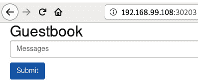
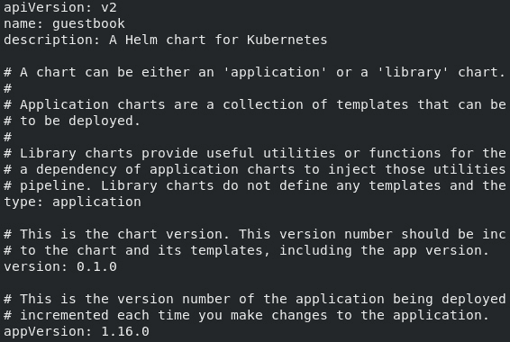
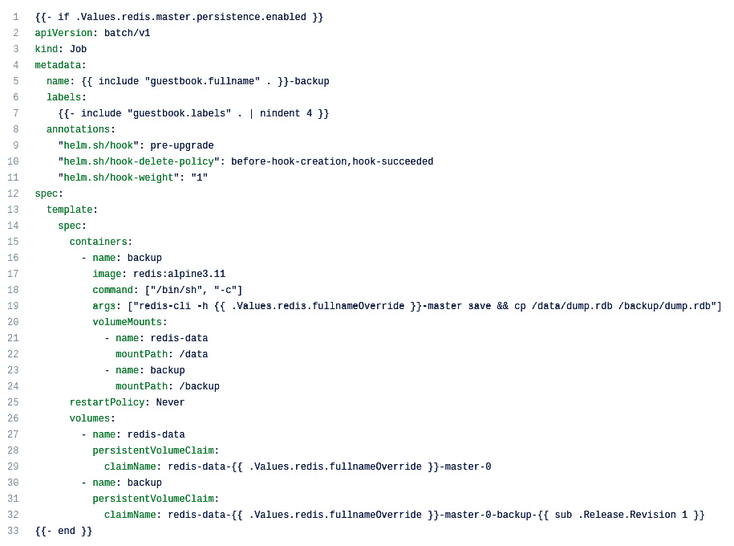
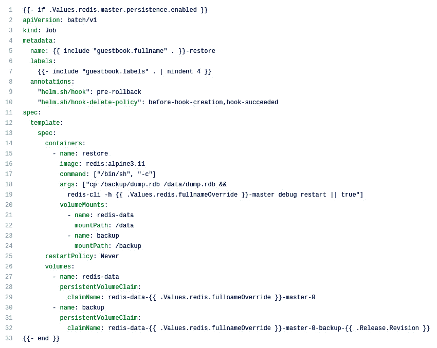
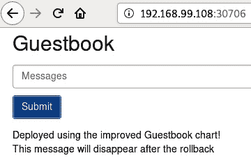
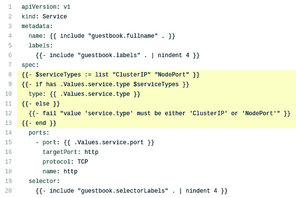
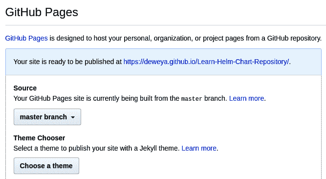
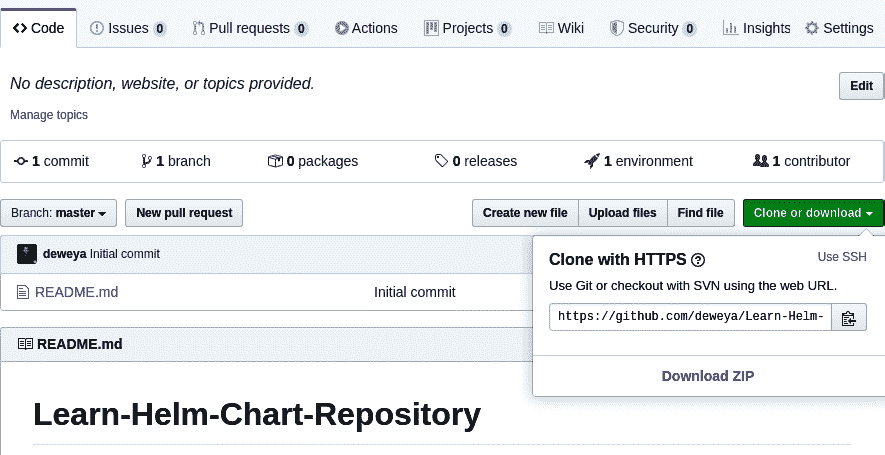

# *第五章*：构建您的第一个 Helm 图表

在上一章中，您了解了组成 Helm 图表的各个方面。现在，是时候将这些知识付诸实践，构建一个 Helm 图表了。学会构建 Helm 图表将使您能够以简单的方式打包复杂的 Kubernetes 应用程序。

在本章中，您将学习如何构建一个 Helm 图表，用于部署`guestbook`应用程序，这是 Kubernetes 社区中广泛使用的快速入门应用程序。通过遵循 Kubernetes 和 Helm 图表开发的最佳实践，构建此图表将提供一个编写良好且易于维护的自动化部分。在开发此图表的过程中，您将学习许多不同的技能，可以应用于构建自己的 Helm 图表。在本章结束时，您将学习如何打包您的 Helm 图表并将其部署到图表存储库，以便最终用户可以轻松访问。

本章涵盖的主要主题如下：

+   了解 Guestbook 应用程序

+   创建 Guestbook Helm 图表

+   改进 Guestbook Helm 图表

+   将 Guestbook 图表发布到图表存储库

# 技术要求

本章需要以下技术：

+   `minikube`

+   `kubectl`

+   `helm`

除了前面提到的工具之外，您还会发现本书的 GitHub 存储库位于[`github.com/PacktPublishing/-Learn-Helm`](https://github.com/PacktPublishing/-Learn-Helm)。我们将引用本章中包含的`helm-charts/charts/guestbook`文件夹。

建议您拥有自己的 GitHub 帐户，以便完成本章的最后一节*创建图表存储库*。有关如何创建您自己的帐户的说明将在该部分提供。

# 了解 Guestbook 应用程序

在本章中，您将创建一个 Helm 图表，用于部署 Kubernetes 社区提供的 Guestbook 教程应用程序。该应用程序在 Kubernetes 文档的以下页面中介绍：[`kubernetes.io/docs/tutorials/stateless-application/guestbook/`](https://kubernetes.io/docs/tutorials/stateless-application/guestbook/)

Guestbook 应用程序是一个简单的**PHP：超文本预处理器**（**PHP**）前端，旨在将消息持久保存到 Redis 后端。前端包括对话框和**提交**按钮，如下截图所示：



图 5.1：Guestbook PHP 前端

用户可以按照以下步骤与该应用程序进行交互：

1.  在**消息**对话框中输入一条消息。

1.  单击**提交**按钮。

1.  当单击**提交**按钮时，消息将被保存到 Redis 数据库中。

Redis 是一个内存中的键值数据存储，本章中将被用于数据复制的集群。该集群将包括一个主节点，Guestbook 前端将向其写入数据。一旦写入，主节点将在多个从节点之间复制数据，Guestbook 前端将从中读取。

以下图描述了 Guestbook 前端与 Redis 后端的交互方式：


图 5.2：Guestbook 前端和 Redis 交互

在对 Guestbook 前端和 Redis 后端的交互有了基本了解之后，让我们设置一个 Kubernetes 环境来开始开发 Helm 图表。在开始之前，让我们首先启动 minikube 并为本章创建一个专用的命名空间。

# 设置环境

为了看到您的图表运行情况，您需要按照以下步骤创建您的 minikube 环境：

1.  通过运行`minikube start`命令来启动 minikube，如下所示：

```
$ minikube start
```

1.  创建一个名为`chapter5`的新命名空间，如下所示：

```
$ kubectl create namespace chapter5
```

在部署 Guestbook 图表时，我们将使用这个命名空间。现在环境已经准备好，让我们开始编写图表。

# 创建 Guestbook Helm 图表

在本节中，我们将创建一个 Helm 图表来部署 Guestbook 应用程序。最终的图表已经发布在 Packt 存储库的`helm-charts/charts/guestbook`文件夹下。随时参考这个位置，以便您可以跟随示例。

我们将首先搭建 Guestbook Helm 图表，以创建图表的初始文件结构。

## 搭建初始文件结构

正如您可能还记得的*第四章*，*理解 Helm 图表*，Helm 图表必须遵循特定的文件结构才能被视为有效。换句话说，一个图表必须包含以下必需文件：

+   `Chart.yaml`：用于定义图表元数据

+   `values.yaml`：用于定义默认图表值

+   `templates/`：用于定义图表模板和要创建的 Kubernetes 资源

我们在*第四章*，*理解 Helm 图表*中提供了图表可能包含的每个文件的列表，但前面提到的三个文件是开始开发新图表所必需的文件。虽然这三个文件可以从头开始创建，但 Helm 提供了`helm create`命令，可以更快地搭建一个新的图表。除了创建之前列出的文件外，`helm create`命令还会生成许多不同的样板模板，可以更快地编写您的 Helm 图表。让我们使用这个命令来搭建一个名为`guestbook`的新 Helm 图表。

`helm create`命令将 Helm 图表的名称（`guestbook`）作为参数。在本地命令行上运行以下命令来搭建这个图表：

```
$ helm create guestbook
```

运行此命令后，您将在您的机器上看到一个名为`guestbook/`的新目录。这是包含您 Helm 图表的目录。在目录中，您将看到以下四个文件：

+   `charts/`

+   `Chart.yaml`

+   `templates/`

+   `values.yaml`

正如你所看到的，`helm create`命令创建了一个`charts/`目录，除了必需的`Chart.yaml`、`values.yaml`和`templates/`文件。`charts/`目录目前是空的，但以后当我们声明一个图表依赖时，它将自动填充。您可能还注意到其他提到的文件已经自动填充了默认设置。在本章的开发`guestbook`图表过程中，我们将利用许多这些默认设置。

如果您探索`templates/`目录下的内容，您会发现许多不同的模板资源已经默认包含在内。这些资源将节省创建这些资源所需的时间。虽然生成了许多有用的模板，我们将删除`templates/tests/`文件夹。这个文件夹用于包含您 Helm 图表的测试，但我们将专注于在*第六章*，*测试 Helm 图表*中编写您自己的测试。运行以下命令来删除`templates/tests/`文件夹：

```
$ rm -rf guestbook/templates/tests
```

现在`guestbook`图表已经被搭建好了，让我们继续评估生成的`Chart.yaml`文件。

## 评估图表定义

图定义，或`Chart.yaml`文件，用于包含 Helm 图的元数据。我们在*第四章*中讨论了`Chart.yaml`文件的每个可能选项，*了解 Helm 图*，但让我们回顾一下典型图定义中包含的一些主要设置，如下所示：

+   `apiVersion`：设置为`v1`或`v2`（`v2`是 Helm 3 的首选选项）

+   `version`：Helm 图的版本。这应该是符合**语义化版本规范**（**SemVer**）的版本。

+   `appVersion`：Helm 图部署的应用程序的版本

+   `name`：Helm 图的名称

+   `description`：Helm 图的简要描述及其设计部署的内容

+   `type`：设置为`application`或`library`。`Application`图用于部署特定应用程序。`Library`图包含一组辅助函数（也称为“命名模板”），可在其他图中使用，以减少样板文件。

+   `dependencies`：Helm 图依赖的图列表

如果你观察你的脚手架`Chart.yaml`文件，你会注意到每个字段（除了 dependencies）已经被设置。这个文件可以在以下截图中看到：



图 5.3：脚手架 Chart.yaml 文件

我们暂时将文件中包含的每个设置保持为默认值（尽管如果你愿意，可以随意编写更有创意的描述）。在本章后面，当这些默认值变得相关时，我们将更新其中的一些默认值。

默认图定义中未包含的另一个设置是`dependencies`。我们将在下一节中更详细地讨论这一点，其中将添加一个 Redis 依赖项，以简化开发工作。

## 添加 Redis 图依赖

正如在*了解留言板应用程序*部分提到的，这个 Helm 图必须能够部署一个 Redis 数据库，用来保存应用程序的状态。如果你完全从头开始创建这个图，你需要对 Redis 的工作原理和如何正确部署到 Kubernetes 有适当的了解。你还需要创建相应的图模板来部署 Redis。

或者，通过包含已包含逻辑和所需图表模板的 Redis 依赖项，您可以大大减少创建`guestbook` Helm 图表所涉及的工作量。让我们通过添加 Redis 依赖项来修改生成的`Chart.yaml`文件，以简化图表开发。

添加 Redis 图表依赖的过程可以通过以下步骤完成：

1.  通过运行以下命令在 Helm Hub 存储库中搜索 Redis 图表：

```
$ helm search hub redis
```

1.  将显示的图表之一是 Bitnami 的 Redis 图表。这是我们将用作依赖项的图表。如果您尚未在*第三章*中添加`bitnami`图表存储库，请使用`helm add repo`命令立即添加此图表存储库。请注意，存储库**统一资源定位符**（**URL**）是从 Helm Hub 存储库中 Redis 图表的页面中检索的。代码可以在以下片段中看到：

```
$ helm add repo bitnami https://charts.bitnami.com
```

1.  确定您想要使用的 Redis 图表的版本。可以通过运行以下命令找到版本号列表：

```
$ helm search repo redis --versions
NAME                        	CHART VERSION	APP VERSION
bitnami/redis               	10.5.14       	5.0.8
bitnami/redis               	10.5.13       	5.0.8
bitnami/redis               	10.5.12       	5.0.8
bitnami/redis               	10.5.11       	5.0.8
```

您必须选择的版本是图表版本，而不是应用程序版本。应用程序版本仅描述 Redis 版本，而图表版本描述实际 Helm 图表的版本。

依赖项允许您选择特定的图表版本，或者使用诸如`10.5.x`之类的通配符。使用通配符可以轻松地使您的图表与匹配该通配符的最新 Redis 版本保持更新（在本例中，该版本为`10.5.14`）。在本例中，我们将使用版本`10.5.x`。

1.  将`dependencies`字段添加到`Chart.yaml`文件中。对于`guestbook`图表，我们将使用以下最低要求字段配置此字段（其他字段在*第四章*，*了解 Helm 图表*中讨论）：

`name`：依赖图的名称

`version`：依赖图的版本

`repository`：依赖图的存储库 URL

将以下**YAML 不是标记语言**（**YAML**）代码添加到您的`Chart.yaml`文件的末尾，提供您已收集的有关 Redis 图表的信息以配置依赖项的设置：

```
dependencies:
  - name: redis
    version: 10.5.x
    repository: https://charts.bitnami.com
```

添加依赖项后，您的完整`Chart.yaml`文件应如下所示（为简洁起见，已删除注释和空行）：

```
apiVersion: v2
name: guestbook
description: A Helm chart for Kubernetes
type: application
version: 0.1.0
appVersion: 1.16.0
dependencies:
  - name: redis
    version: 10.5.x
    repository: https://charts.bitnami.com
```

该文件也可以在 P[ackt repository at https://github.com/PacktPublishing/-Learn-Helm/blob/master/helm-charts/charts/g](https://github.com/PacktPublishing/-Learn-Helm/blob/master/helm-charts/charts/guestbook/Chart.yaml)uestbook/Chart.yaml 中进行查看（请注意，版本和`appVersion`字段可能不同，因为我们将在本章后面修改这些字段）。

现在您的依赖已经添加到图表定义中，让我们下载这个依赖，以确保它已经正确配置。

### 下载 Redis 图表依赖

首次下载依赖时，应使用`helm dependency update`命令。此命令将下载您的依赖到`charts/`目录，并将生成`Chart.lock`文件，该文件指定了已下载的图表的元数据。

运行`helm dependency update`命令来下载您的 Redis 依赖。该命令以 Helm 图表的位置作为参数，并可以在以下代码片段中看到：

```
$ helm dependency update guestbook
Hang tight while we grab the latest from your chart repositories...
...Successfully got an update from the 'bitnami' chart repository
Update Complete.  Happy Helming!
Saving 1 charts
Downloading redis from repo https://charts.bitnami.com
Deleting outdated charts
```

您可以通过确保 Redis 图表出现在`charts/`文件夹下来验证下载是否成功，如下所示：

```
$ ls guestbook/charts
redis-10.5.14.tgz
```

现在 Redis 依赖已经包含，让我们继续修改`values.yaml`文件。在这里，我们将覆盖特定于配置 Redis 以及 Guestbook 前端应用程序的值。

## 修改 values.yaml 文件

Helm chart 的`values.yaml`文件用于提供一组默认参数，这些参数在整个图表模板中被引用。当用户与 Helm 图表交互时，他们可以使用`--set`或`--values`标志覆盖这些默认值。除了提供一组默认参数外，一个写得好的 Helm 图表应该是自说明的，包含每个值的直观名称和解释难以实现的值的注释。编写一个自说明的`value.yaml`文件允许用户和维护者简单地参考这个文件，以便了解图表的值。

`helm create`命令生成一个值文件，其中包含许多在 Helm 图表开发中常用的样板值。让我们通过在文件末尾添加一些额外的值来完成配置 Redis 依赖。之后，我们将专注于修改一些样板值，以配置 Guestbook 前端资源。

### 添加值以配置 Redis 图表

虽然添加依赖项可以防止您需要创建其图表模板，但您可能仍然需要覆盖一些值以对其进行配置。在这种情况下，需要覆盖一些 Redis 图表的值，以使其能够与`guestbook`图表的其余部分无缝配合。

让我们首先了解一下 Redis 图表的值。这可以通过对下载的 Redis 图表运行`helm show values`命令来完成，如下所示：

```
$ helm show values charts/redis-10.5.14.tgz
```

请确保修改命令以匹配您下载的 Redis 图表版本。显示值列表后，让我们识别需要被覆盖的值，如下所示：

1.  Redis 图表中需要被覆盖的第一个值是`fullnameOverride`。此值显示在`helm show values`输出中，如下所示：

```
## String to fully override redis.fullname template
##
# fullnameOverride:
```

图表通常在一个名为`$CHART_NAME.fullname`的命名模板中使用这个值，以便轻松生成它们的 Kubernetes 资源名称。当设置了`fullnameOverride`时，命名模板将评估为这个值。否则，此模板的结果将基于`.Release.Name`对象，或者安装时提供的 Helm 发布的名称。

Redis 依赖项使用`redis.fullname`模板来帮助设置 Redis 主和 Redis 从服务的名称。

以下片段显示了在 Redis 图表中生成 Redis 主服务名称的示例：

```
name: {{ template 'redis.fullname' . }}-master
```

Guestbook 应用程序需要将 Redis 服务命名为`redis-master`和`redis-slave`。因此，`fullnameOverride`值应设置为`redis`。

如果您有兴趣了解`redis.fullname`模板的工作原理以及它在整个 Redis 图表中的应用方式，您可以在`charts/`文件夹下解压 Redis 依赖项。在该文件夹中，您将在`templates/_helpers.tpl`文件中找到`redis.fullname`模板，并注意其在每个 YAML 模板中的调用。 （事实证明，您生成的`guestbook`图表中也包含一个类似的模板在`_helpers.tpl`文件中，但一般来说，最好参考依赖项的资源，以防其维护者定制了模板。）

如果您有兴趣了解 Guestbook 应用程序的工作原理，可以在 GitHub 上找到源代码。以下文件定义了所需的 Redis 服务名称：

https://github.com/kubernetes/examples/blob/master/guestbook/php-redis/guestbook.php

1.  需要从 Redis 图表中覆盖的下一个值是`usePassword`。以下代码片段显示了`helm show values`输出中这个值的样子：

```
## Use password authentication
usePassword: true
```

Guestbook 应用程序已经编写为无需身份验证即可访问 Redis 数据库，因此我们将希望将此值设置为`false`。

1.  我们需要覆盖的最后一个值是`configmap`。以下是`helm show values`输出中此值的样子：

```
## Redis config file
## ref: https://redis.io/topics/config
##
configmap: |-
  # Enable AOF https://redis.io/topics/persistence#append-only-file
  appendonly yes
  # Disable RDB persistence, AOF persistence already enabled.
  save ''
```

默认的`configmap`值将启用 Redis 可以使用的两种持久性类型，**追加日志文件**（**AOF**）和**Redis 数据库文件**（**RDF**）持久性。Redis 中的 AOF 持久性通过将新数据条目添加到类似于更改日志的文件中来提供更改历史。RDF 持久性通过在一定间隔内将数据复制到文件中，以创建数据快照。

在本章后面，我们将创建简单的生命周期钩子，允许用户将 Redis 数据库备份和恢复到先前的快照。因为只有 RDB 持久性与快照文件一起工作，我们将覆盖`configmap`值以读取`appendonly no`，这将禁用 AOF 持久性。

识别每个 Redis 值后，将这些值添加到图表的`values.yaml`文件的末尾，如下面的代码块所示：

```
redis:
  # Override the redis.fullname template
  fullnameOverride: redis
  # Enable unauthenticated access to Redis
  usePassword: false
  # Disable AOF persistence
  configmap: |-
    appendonly no
```

请记住*第四章**,* *理解 Helm 图表*，从图表依赖中覆盖的值必须在该图表名称下进行范围限定。这就是为什么每个这些值将被添加到`redis:`段下面。

您可以通过参考位于 https://github.com/PacktPublishing/-Learn-Helm/blob/master/helm-charts/charts/guestbook/values.yaml 的 Packt 存储库中的`values.yaml`文件，检查是否正确配置了 Redis 值。

重要提示

与 Redis 无关的一些值可能与您的`values.yaml`文件不同，因为我们将在下一节中修改这些值。

配置了 Redis 依赖项的值后，让我们继续修改`helm create`生成的默认值，以部署 Guestbook 前端。

### 修改值以部署 Guestbook 前端

当您在本章开头运行`helm create`命令时，它创建的一些项目是`templates/`目录下的默认模板和`values.yaml`文件中的默认值。

以下是创建的默认模板列表：

+   `deployment.yaml`：用于将 Guestbook 应用程序部署到 Kubernetes。

+   `ingress.yaml`：提供了一种从 Kubernetes 集群外部访问 Guestbook 应用程序的选项。

+   `serviceaccount.yaml`：用于为 Guestbook 应用程序创建一个专用的`serviceaccount`。

+   `service.yaml`：用于在 Guestbook 应用程序的多个实例之间进行负载平衡。还可以提供一种从 Kubernetes 集群外部访问 Guestbook 应用程序的选项。

+   _helpers.tp：提供了一组在 Helm 图表中广泛使用的常见模板。

+   `NOTES.txt`：提供了安装后访问应用程序所使用的一组说明。

每个模板都由图表的值配置。虽然`helm create`命令为部署 Guestbook 应用程序提供了一个很好的起点，但它没有提供所需的每个默认值。为了用所需的值替换默认值，我们可以观察生成的图表模板并相应地修改它们的参数。

让我们逐步了解指示需要进行修改的模板位置。

第一个位置在`deployment.yaml`图表模板中。在该文件中，有一行指示要部署的容器映像，如下所示：

```
image: '{{ .Values.image.repository }}:{{ .Chart.AppVersion }}'
```

如您所见，image 由`image.repository`值和`AppVersion`图表设置确定。如果您查看您的`values.yaml`文件，您会看到`image.repository`值当前配置为默认部署`nginx`映像，如下所示：

```
image:
  repository: nginx
```

同样，如果您查看`Chart.yaml`文件，您会看到`AppVersion`目前设置为`1.16.0`，如下所示：

```
appVersion: 1.16.0
```

由于 Guestbook 应用程序起源于 Kubernetes 教程，您可以在 Kubernetes 文档中找到需要部署的特定映像，网址为 https://kubernetes.io/docs/tutorials/stateless-application/guestbook/#creating-the-guestbook-frontend-deployment。在文档中，您可以看到必须指定映像如下：

```
image: gcr.io/google-samples/gb-frontend:v4
```

因此，为了正确生成 image 字段，`image.repository`值必须设置为`gcr.io/google-samples/gb-frontend`，并且`AppVersion`图表设置必须设置为`v4`。

必须进行修改的第二个位置是`service.yaml`图表模板。在这个文件中，有一行确定服务类型的代码，如下所示：

```
type: {{ .Values.service.type }}
```

根据`service.type`的值，该服务将默认为`ClusterIP`服务类型，如`values.yaml`文件中所示：

```
service:
  type: ClusterIP
```

对于`guestbook`图表，我们将修改此值，以创建一个`NodePort`服务。这将允许在 minikube 环境中更容易地访问应用程序，通过在 minikube 虚拟机（VM）上暴露一个端口。连接到端口后，我们可以访问 Guestbook 前端。

请注意，虽然`helm create`生成了一个`ingress.yaml`模板，也允许访问，但在 minikube 环境中工作时，更常见的建议是使用`NodePort`服务，因为不需要附加组件或增强功能。幸运的是，生成的图表默认禁用了入口资源的创建，因此无需禁用此功能。

现在我们已经确定了需要更改的默认设置，让我们首先按照以下方式更新`values.yaml`文件：

1.  将`image.repository`值替换为`gcr.io/google-samples/gb-frontend`。整个`image:`部分现在应该如下所示：

```
image:
  repository: gcr.io/google-samples/gb-frontend
  pullPolicy: IfNotPresent
```

1.  将`service.type`值替换为`NodePort`。整个`service:`部分现在应该如下所示：

```
service:
  type: NodePort
  port: 80
```

1.  您可以通过参考 Packt 存储库中的文件来验证您的`values.yaml`文件是否已正确修改。

接下来，让我们更新`Chart.yaml`文件，以便部署正确的 Guestbook 应用程序版本，如下所示：

1.  将`appVersion`字段替换为`v4`。`appVersion`字段现在应该如下所示：

```
appVersion: v4
```

1.  您可以通过参考 Packt 存储库中的文件来验证您的`Chart.yaml`文件是否已正确修改。

现在图表已经使用正确的值和设置进行了更新，让我们通过将其部署到 minikube 环境中来看看这个图表的运行情况。

## 安装 Guestbook 图表

要安装您的`guestbook`图表，请在`guestbook/`目录之外运行以下命令：

```
$ helm install my-guestbook guestbook -n chapter5
```

如果安装成功，将显示以下消息：

```
NAME: my-guestbook
LAST DEPLOYED: Sun Apr 26 09:57:52 2020
NAMESPACE: chapter5
STATUS: deployed
REVISION: 1
NOTES:
1\. Get the application URL by running these commands:
  export NODE_PORT=$(kubectl get --namespace chapter5 -o jsonpath='{.spec.ports[0].nodePort}' services my-guestbook)
  export NODE_IP=$(kubectl get nodes --namespace chapter5 -o jsonpath='{.items[0].status.addresses[0].address}')
  echo http://$NODE_IP:$NODE_PORT
```

安装成功后，您可能会发现留言板和 Redis pods 并不立即处于“准备就绪”状态。当一个 Pod 没有准备就绪时，它还不能被访问。

您还可以通过传入`--wait`标志来强制 Helm 等待这些 Pod 准备就绪。`--wait`标志可以与`--timeout`标志一起使用，以增加 Helm 等待 Pod 准备就绪的时间（以秒为单位）。默认设置为 5 分钟，这对于这个应用程序来说已经足够了。

您可以通过检查每个 Pod 的状态来确保所有的 Pod 都已准备就绪，而不使用`--wait`标志，如下所示：

```
$ kubectl get pods -n chapter5
```

当每个 Pod 准备就绪时，您将能够观察到每个 Pod 在`READY`列下报告为`1/1`，如下所示：


图 5.4：当每个 Pod 准备就绪时，kubectl get pods –n chapter5 的输出

一旦 Pod 准备就绪，您可以运行发布说明中显示的命令。如果需要，可以通过运行以下代码再次显示它们：

```
$ helm get notes my-guestbook -n chapter5
NOTES:
1\. Get the application URL by running these commands:
  export NODE_PORT=$(kubectl get --namespace chapter5 -o jsonpath='{.spec.ports[0].nodePort}' services my-guestbook)
  export NODE_IP=$(kubectl get nodes --namespace chapter5 -o jsonpath='{.items[0].status.addresses[0].address}')
  echo http://$NODE_IP:$NODE_PORT
```

将留言板 URL（从`echo`命令的输出中复制并粘贴）到您的浏览器中，留言板**用户界面**（**UI**）应该显示出来，如下截图所示：


图 5.5：留言板前端

尝试在对话框中输入一条消息，然后单击**提交**。留言板前端将在**提交**按钮下显示消息，这表明消息已保存到 Redis 数据库，如下截图所示：


图 5.6：留言板前端显示先前发送的消息

如果您能够编写一条消息并在屏幕上看到它显示出来，那么您已成功构建和部署了您的第一个 Helm 图表！如果您无法看到您的消息，那么您的 Redis 依赖项可能没有正确设置。在这种情况下，请确保您的 Redis 值已经正确配置，并且您的 Redis 依赖已经在`Chart.yaml`文件中正确声明。

当您准备好时，使用`helm uninstall`命令卸载此图表，就像这样：

```
$ helm uninstall my-guestbook -n chapter5
```

您还需要手动删除 Redis **PersistentVolumeClaims**（**PVCs**），因为 Redis 依赖于使用`StatefulSet`使数据库持久化（在删除时不会自动删除 PVCs）。

运行以下命令以删除 Redis PVCs：

```
$ kubectl delete pvc -l app=redis -n chapter5
```

在下一节中，我们将探讨改进`guestbook`图表的方法。

# 改进 Guestbook Helm 图表

在上一节中创建的图表成功部署了 Guestbook 应用程序。然而，与任何类型的软件一样，Helm 图表总是可以改进的。在本节中，我们将专注于以下两个功能，以改进`guestbook`图表：

+   生命周期钩子备份和恢复 Redis 数据库

+   输入验证以确保只提供有效的值

让我们首先专注于添加生命周期钩子。

## 创建 pre-upgrade 和 pre-rollback 生命周期钩子

在本节中，我们将创建两个生命周期钩子，如下：

1.  第一个钩子将出现在`pre-upgrade`生命周期阶段。这个阶段发生在运行`helm upgrade`命令之后，但在任何 Kubernetes 资源被修改之前。这个钩子将用于在执行升级之前对 Redis 数据库进行数据快照，确保在升级出现错误时可以备份数据库。

1.  第二个钩子将出现在`pre-rollback`生命周期阶段。这个阶段发生在运行`helm rollback`命令之后，但在任何 Kubernetes 资源被回滚之前。这个钩子将把 Redis 数据库恢复到先前的数据快照，并确保 Kubernetes 资源配置被恢复到快照被拍摄时的状态。

在本节结束时，您将更加熟悉生命周期钩子以及它们可以执行的一些强大功能。请记住，本节中创建的钩子非常简单，仅用于探索 Helm 钩子的基本功能。不建议尝试在生产环境中直接使用这些钩子。

让我们来看看如何创建`pre-upgrade`生命周期钩子。

### 创建 pre-upgrade 钩子以进行数据快照

在 Redis 中，数据快照包含在`dump.rdb`文件中。我们可以通过创建一个钩子来备份这个文件，该钩子首先在 Kubernetes 命名空间中创建一个新的 PVC。然后，该钩子可以创建一个`job`资源，将`dump.rdb`文件复制到新的`PersistentVolumeClaim`中。

虽然`helm create`命令生成了一些强大的资源模板，可以快速创建初始的`guestbook`图表，但它没有生成任何可用于此任务的钩子。因此，您可以通过以下步骤从头开始创建预升级钩子：

1.  首先，您应该创建一个新的文件夹来包含钩子模板。虽然这不是技术要求，但它有助于将钩子模板与常规图表模板分开。它还允许您按功能对钩子模板进行分组。

在您的`guestbook`文件结构中创建一个名为`templates/backup`的新文件夹，如下所示：

```
$ mkdir guestbook/templates/backup
```

1.  接下来，您应该创建两个模板，以执行备份所需的两个模板。所需的第一个模板是`PersistentVolumeClaim`模板，将用于包含复制的`dump.rdb`文件。第二个模板将是一个作业模板，用于执行复制操作。

创建两个空模板文件作为占位符，如下所示：

```
$ touch guestbook/templates/backup/persistentvolumeclaim.yaml
$ touch guestbook/templates/backup/job.yaml
```

1.  您可以通过参考 Packt 存储库来仔细检查您的工作。您的文件结构应该与 https://github.com/PacktPublishing/-Learn-Helm/tree/master/helm-charts/charts/guestbook/templates/backup 中找到的结构完全相同。

1.  接下来，让我们创建`persistentvolumeclaim.yaml`模板。将下面文件的内容复制到您的`backup/persistentvolumeclaim.yaml`文件中（此文件也可以从 Packt 存储库 https://github.com/PacktPublishing/-Learn-Helm/blob/master/helm-charts/charts/guestbook/templates/backup/persistentvolumeclaim.yaml 中复制。请注意，空格由`空格`组成，而不是制表符，符合有效的 YAML 语法。文件的内容可以在这里看到：

图 5.7：备份/persistentvolumeclaim.yaml 模板

在继续之前，让我们浏览`persistentvolumeclaim.yaml`文件的一部分，以帮助理解它是如何创建的。

此文件的*第 1*行和*第 17*行由一个`if`操作组成。由于该操作封装了整个文件，这表明只有在`redis.master.persistence.enabled`值设置为`true`时，才会包括此资源。在 Redis 依赖图中，此值默认为`true`，可以使用`helm show values`命令观察到。

*第 5 行*确定新 PVC 备份的名称。其名称基于 Redis 依赖图创建的 Redis 主 PVC 的名称，即`redis-data-redis-master-0`，以便明确指出这是设计为备份的 PVC。其名称还基于修订号。因为此钩子作为预升级钩子运行，它将尝试使用正在升级的修订号。`sub`函数用于从此修订号中减去`1`，以便明确指出此 PVC 包含先前修订的数据快照。

*第 9 行*创建一个注释，将此资源声明为`pre-upgrade`钩子。*第 10 行*创建一个`helm.sh/hook-weight`注释，以确定此资源应与其他预升级钩子相比的创建顺序。权重按升序运行，因此此资源将在其他预升级资源之前创建。

1.  创建`persistentvolumeclaim.yaml`文件后，我们将创建最终的预升级模板`job.yaml`。将以下内容复制到您的`backup/job.yaml`文件中（此文件也可以从 Packt 存储库 https://github.com/PacktPublishing/-Learn-Helm/blob/master/helm-charts/charts/guestbook/templates/backup/job.yaml 中复制）：



图 5.8：备份/job.yaml 模板

让我们逐步了解`job.yaml`模板的部分内容，以了解它是如何创建的。

*第 9 行*再次定义此模板为预升级钩子。*第 11 行*将钩子权重设置为`1`，表示此资源将在其他预升级`PersistentVolumeClaim`之后创建。

第 10 行设置了一个新的注释，以确定何时应删除此作业。默认情况下，Helm 不管理钩子的创建之外的内容，这意味着当运行`helm uninstall`命令时，它们不会被删除。`helm.sh/hook-delete-policy`注释用于确定资源应该在何种条件下被删除。该作业包含`before-hook-creation`删除策略，这表明如果它已经存在于命名空间中，它将在`helm upgrade`命令期间被删除，从而允许创建一个新的作业。该作业还将具有`hook-succeeded`删除策略，如果成功运行，则将导致其被删除。

第 19 行执行`dump.rdb`文件的备份。它连接到 Redis 主服务器，保存数据库的状态，并将文件复制到备份 PVC。

第 29 行和第 32 行分别定义了 Redis 主 PVC 和备份 PVC。这些 PVC 被作业挂载，以便复制`dump.rdb`文件。

如果您已经按照前面的每个步骤进行操作，那么您已经为 Helm 图表创建了预升级钩子。让我们继续下一节，创建预回滚钩子。之后，我们将重新部署`guestbook`图表，以查看这些钩子的作用。

### 创建预回滚钩子以恢复数据库

而预升级钩子是用来从 Redis 主 PVC 复制`dump.rdb`文件到备份 PVC，`pre-rollback`钩子可以编写以执行相反的操作，将数据库恢复到先前的快照。

按照以下步骤创建预回滚钩子：

1.  创建`templates/restore`文件夹，用于包含预回滚钩子，如下所示：

```
$ mkdir guestbook/templates/restore
```

1.  接下来，创建一个空的`job.yaml`模板，用于恢复数据库，如下所示：

```
$ touch guestbook/templates/restore/job.yaml
```

1.  您可以通过引用 Packt 存储库来检查是否已创建了正确的结构[`github.com/PacktPublishing/-Learn-Helm/tree/master/helm`](https://github.com/PacktPublishing/-Learn-Helm/tree/master/helm-charts/charts/guestbook/templates/restore)-charts/charts/guestbook/templates/restore。

1.  接下来，让我们向`job.yaml`文件添加内容。将以下内容复制到您的`restore/job.yaml`文件中（此文件也可以从 Packt 存储库 https://github.com/PacktPublishing/-Learn-Helm/blob/master/helm-charts/c](https://github.com/PacktPublishing/-Learn-Helm/blob/master/helm-charts/charts/guestbook/templates/restore/job.yaml)harts/guestbook/templates/restore/job.yaml)中复制）：



图 5.9：回滚/job.yaml 模板

此模板的*第 7 行*将此资源声明为`pre-rollback`钩子。

实际的数据恢复在*第 18 行*和*第 19 行*执行。*第 18 行*将`dump.rdb`文件从备份 PVC 复制到 Redis 主 PVC。复制后，*第 19 行*重新启动数据库，以便重新加载快照。用于重新启动 Redis 数据库的命令将返回失败的退出代码，因为与数据库的连接将意外终止，但可以通过在命令后添加`|| true`来解决这个问题，这将否定退出代码。

*第 29 行*定义了 Redis 主卷，*第 32 行*定义了所需的备份卷，这取决于要回滚到的修订版本。

创建了升级前和回滚前的生命周期钩子后，让我们在 minikube 环境中运行它们，看看它们的作用。

### 执行生命周期钩子

为了运行您创建的生命周期钩子，您必须首先通过运行`helm install`命令再次安装您的图表，如下所示：

```
$ helm install my-guestbook guestbook -n chapter5
```

当每个 Pod 报告`1/1` `Ready`状态时，通过遵循显示的发布说明访问您的 Guestbook 应用程序。请注意，访问应用程序的端口将与以前不同。

访问 Guestbook 前端后写一条消息。示例消息可以在以下截图中看到：


图 5.10：安装 Guestbook 图表并输入消息后的 Guestbook 前端

一旦写入消息并且其文本显示在**提交**按钮下方，运行`helm upgrade`命令触发 pre-upgrade 钩子。`helm upgrade`命令将暂时挂起，直到备份完成，并且可以在这里看到：

```
$ helm upgrade my-guestbook guestbook -n chapter5
```

当命令返回时，您应该会发现 Redis 主 PVC 以及一个新创建的 PVC，名为`redis-data-redis-master-0-backup-1`，可以在这里看到：

```
$ kubectl get pvc -n chapter5
NAME                                 STATUS
redis-data-redis-master-0            Bound
redis-data-redis-master-0-backup-1   Bound
```

此 PVC 包含一个数据快照，可用于在预回滚生命周期阶段恢复数据库。

现在，让我们继续向 Guestbook 前端添加额外的消息。您应该在**提交**按钮下看到两条消息，如下面的截图所示：



图 5.11：运行回滚前的 Guestbook 消息

现在，运行`helm rollback`命令以恢复到第一个修订版。此命令将暂时挂起，直到恢复过程完成，并且可以在这里看到：

```
$ helm rollback my-guestbook 1 -n chapter5
```

当此命令返回时，请在浏览器中刷新您的 Guestbook 前端。您会看到您在升级后添加的消息消失，因为在进行数据备份之前它不存在，如下面的截图所示：


图 5.12：在预回滚生命周期阶段完成后的 Guestbook 前端

虽然这个备份和恢复场景只是一个简单的用例，但它演示了向图表添加 Helm 生命周期钩子可以提供的许多可能性之一。

重要提示

通过在相应的生命周期命令（`helm install`、`helm upgrade`、`helm rollback`或`helm uninstall`）中添加`--no-hooks`标志，可以跳过钩子。应用此命令的命令将跳过该生命周期的钩子。

现在，我们将专注于用户输入验证以及如何进一步改进 Guestbook 图表以帮助防止提供不当值。

## 添加输入验证

在使用 Kubernetes 和 Helm 时，当创建新资源时，Kubernetes **应用程序编程接口**（**API**）服务器会自动执行输入验证。这意味着如果 Helm 创建了无效的资源，API 服务器将返回错误消息，导致安装失败。尽管 Kubernetes 执行原生输入验证，但图表开发人员仍可能希望在资源到达 API 服务器之前执行验证。

让我们开始探索如何使用`guestbook` Helm 图表中的`fail`函数执行输入验证。

### 使用 fail 函数

`fail`函数用于立即失败模板渲染。这个函数可以用在用户提供了无效值的情况下。在本节中，我们将实现一个限制用户输入的示例用例。

你的`guestbook`图表的`values.yaml`文件包含一个名为`service.type`的值，用于确定应该为前端创建什么类型的服务。这个值可以在这里看到：

```
service:
  type: NodePort
```

我们将这个值默认设置为`NodePort`，但从技术上讲，也可以使用其他服务类型。假设你想将服务类型限制为只有`NodePort`和`ClusterIP`服务。这个操作可以通过使用`fail`函数来执行。

按照以下步骤来限制`guestbook`图表中的服务类型：

1.  找到`templates/service.yaml`服务模板。这个文件包含一行，根据`service.type`值设置服务类型，如下所示：

```
type: {{ .Values.service.type }}
```

我们应该首先检查`service.type`值是否等于`ClusterIP`或`NodePort`，然后再设置服务类型。这可以通过将一个变量设置为正确设置的列表来实现。然后，可以进行检查以确定`service.type`值是否包含在有效设置的列表中。如果是，那么就继续设置服务类型。否则，图表渲染应该被停止，并向用户返回错误消息，通知他们有效的`service.type`输入。

1.  复制下面的`service.yaml`文件来实现*步骤 1*中描述的逻辑。这个文件也可以从 Packt 仓库 https://github.com/PacktPublishing/-Learn-Helm/blob/master/helm-charts/charts/guestbook/templates/service.yaml 中复制：



图 5.13：在 service.yaml 模板中实现的 service.type 验证

*第 8 行*到*第 13 行*代表了输入验证。*第 8 行*创建了一个名为`serviceTypes`的变量，它等于正确的服务类型列表。*第 9 行*到*第 13 行*代表了一个`if`操作。*第 9 行*中的`has`函数将检查`service.type`值是否包含在`serviceTypes`中。如果是，那么渲染将继续到*第 10 行*来设置服务的类型。否则，渲染将继续到*第 12 行*。*第 12 行*使用`fail`函数来停止模板渲染，并向用户显示关于有效服务类型的消息。

尝试通过提供无效的服务类型来升级你的`my-guestbook`发布（如果你已经卸载了你的发布，重新安装也可以）。为此，请运行以下命令：

```
$ helm upgrade my-guestbook . -n chapter5 --set service.type=LoadBalancer
```

如果你在前面的*步骤 2*中的更改成功了，你应该会看到类似以下的消息：

```
Error: UPGRADE FAILED: template: guestbook/templates/service.yaml:12:6: executing 'guestbook/templates/service.yaml' at <fail 'value 'service.type' must be either 'ClusterIP' or 'NodePort''>: error calling fail: value 'service.type' must be either 'ClusterIP' or 'NodePort'
```

使用`fail`验证用户输入是确保提供的值符合一定约束的好方法，但也有时候需要确保用户首先提供了某些值。这可以通过使用下一节中解释的`required`函数来实现。

### 使用`required`函数

`required`函数和`fail`一样，也用于停止模板渲染。不同之处在于，`required`函数用于确保在图表模板渲染时值不为空。

回想一下，你的图表中包含一个名为`image.repository`的值，如下所示：

```
image:
  repository: gcr.io/google-samples/gb-frontend
```

这个值用于确定将部署的镜像。考虑到这个值对 Helm 图表的重要性，我们可以用`required`函数来确保在安装图表时它始终有一个值。虽然我们目前在这个图表中提供了一个默认值，但添加`required`函数可以让你在需要确保用户始终提供自己的容器镜像时删除这个默认值。

按照以下步骤对`image.repository`值实施`required`函数：

1.  找到`templates/deployment.yaml`图表模板。该文件包含一行，根据`image.repository`的值设置容器镜像（`appName`图表设置也有助于设置容器镜像，但在这个例子中，我们只关注`image.repository`），如下所示：

```
image: '{{ .Values.image.repository }}:{{ .Chart.AppVersion }}'
```

1.  `required`函数接受以下两个参数：

+   显示错误消息，指出是否提供了该值 必须提供的值

给定这两个参数，修改`deployment.yaml`文件，使`image.repository`的值是必需的。

要添加这个验证，你可以从以下代码片段中复制，或者参考 Packt 仓库 https://github.com/PacktPublishing/-Learn-Helm/blob/master/helm-charts/charts/guestbook/templates/deployment.yaml 中的内容：


图 5.14：使用第 28 行上所需功能的 deployment.yaml 片段

1.  尝试通过提供空的`image.repository`值来升级您的`my-guestbook`发布，如下所示：

```
$ helm upgrade my-guestbook . -n chapter5 --set image.repository=''
```

如果您的更改成功，您应该会看到类似以下的错误消息：

```
Error: UPGRADE FAILED: execution error at (guestbook/templates/deployment.yaml:28:21): value 'image.repository' is required
```

到目前为止，您已成功编写了您的第一个 Helm 图表，包括生命周期挂钩和输入验证！

在下一节中，您将学习如何使用 GitHub Pages 创建一个简单的图表存储库，该存储库可用于使您的`guestbook`图表对世界可用。

# 将 Guestbook 图表发布到图表存储库

现在您已经完成了 Guestbook 图表的开发，该图表可以发布到存储库，以便其他用户可以轻松访问。让我们首先创建图表存储库。

## 创建图表存储库

图表存储库是包含两个不同组件的服务器，如下所示：

+   Helm 图表，打包为`tgz`存档

+   一个包含存储库中包含的图表的元数据的`index.yaml`文件

基本的图表存储库要求维护者生成自己的`index.yaml`文件，而更复杂的解决方案，如 Helm 社区的`ChartMuseum`工具，在推送新图表到存储库时动态生成`index.yaml`文件。在这个例子中，我们将使用 GitHub Pages 创建一个简单的图表存储库。GitHub Pages 允许维护者从 GitHub 存储库创建一个简单的静态托管站点，该站点可用于创建一个基本的图表存储库来提供 Helm 图表。

您需要一个 GitHub 帐户来创建 GitHub Pages 图表存储库。[如果您已经有一个 Gi](https://github.com/login)tHub 帐户，您可以在 https://githu[b.com/login 登录。否则，](https://github.com/join)您可以在 https://github.com/join 创建一个新帐户。

一旦您登录 GitHub，按照[这些步骤创建](https://github.com/new)您的图表存储库：

1.  跟随 https://github.com/new 链接访问**创建新存储库**页面。

1.  为您的图表存储库提供一个名称。我们建议使用名称`Learn-Helm-Chart-Repository`。

1.  选择**使用 README 初始化此存储库**旁边的复选框。这是必需的，因为 GitHub 不允许您创建静态站点，如果它不包含任何内容。

1.  您可以将其余设置保留为默认值。请注意，为了利用 GitHub Pages，除非您拥有付费的 GitHub Pro 帐户，否则必须将隐私设置保留为**公共**。

1.  单击**创建存储库**按钮完成存储库创建过程。

1.  尽管您的存储库已创建，但在启用 GitHub Pages 之前，它无法提供 Helm 图表的服务。单击存储库内的**设置**选项卡以访问存储库设置。

1.  在**设置**页面（和**选项**选项卡）的**GitHub Pages**部分中找到它，它出现在页面底部。

1.  在**来源**下，从下拉列表中选择**主分支**选项。这将允许 GitHub 创建一个提供主分支内容的静态站点。

1.  如果您成功配置了 GitHub Pages，您将收到屏幕顶部显示的消息，上面写着**GitHub Pages 源已保存**。您还将能够看到您静态站点的 URL，如下面的示例截图所示：



图 5.15：GitHub Pages 设置和示例 URL

配置好 GitHub 存储库后，您应该将其克隆到本地计算机。按照以下步骤克隆存储库：

1.  通过选择页面顶部的**Code**选项卡导航到存储库的根目录。

1.  选择绿色的**克隆或下载**按钮。这将显示您的 GitHub 存储库的 URL。请注意，此 URL 与您的 GitHub Pages 静态站点不同。

如果需要，您可以使用以下示例截图来查找您的 GitHub 存储库 URL：



图 5.16：单击克隆或下载按钮即可找到您的 GitHub 存储库 URL

1.  一旦您获得了存储库的`git`引用，就将存储库克隆到本地计算机。确保在运行以下命令时不在`guestbook`目录内，因为我们希望该存储库与`guestbook`图表分开。

```
$ git clone $REPOSITORY_URL
```

一旦您克隆了存储库，继续下一节将`guestbook`图表发布到您的图表存储库。

## 发布 Guestbook Helm 图表

Helm 提供了几个不同的命令来使发布 Helm 图表成为一个简单的任务。然而，在运行这些命令之前，您可能会发现需要增加您的图表的`version`字段在`Chart.yaml`文件中。对您的图表进行版本控制是发布过程的重要部分，就像其他类型的软件一样。

修改您的图表的`Chart.yaml`文件中的版本字段为 1.0.0，如下所示：

```
version: 1.0.0
```

一旦您的`guestbook`图表的版本已经增加，您可以继续将您的图表打包成一个`tgz`存档。这可以通过使用`helm package`命令来完成。从您本地`guestbook`目录的上一级运行此命令，如下所示：

```
$ helm package guestbook
```

如果成功，这将创建一个名为`guestbook-1.0.0.tgz`的文件。

重要提示

在处理包含依赖关系的图表时，`helm package`命令需要将这些依赖关系下载到`charts/`目录中，以便成功打包图表。如果您的`helm package`命令失败了，请检查您的 Redis 依赖是否已经下载到`charts/`目录中。如果没有，您可以在`helm package`中添加`--dependency-update`标志，这将在同一命令中下载依赖并打包您的 Helm 图表。

一旦您的图表被打包，通过运行以下命令将生成的`tgz`文件复制到您的 GitHub 图表仓库的克隆中：

```
$ cp guestbook-1.0.0.tgz $GITHUB_CHART_REPO_CLONE
```

当这个文件被复制后，您可以使用`helm repo index`命令为您的 Helm 仓库生成`index.yaml`文件。这个命令以您的图表仓库克隆的位置作为参数。运行以下命令来生成您的`index.yaml`文件：

```
$ helm repo index $GITHUB_CHART_REPO_CLONE
```

这个命令会悄悄地成功，但是你会在`Learn-Helm-Chart-Repository`文件夹内看到新的`index.yaml`文件。这个文件的内容提供了`guestbook`图表的元数据。如果这个仓库中还包含其他图表，它们的元数据也会出现在这个文件中。

您的 Helm 图表仓库现在应该包含`tgz`存档和`index.yaml`文件。通过使用以下`git`命令将这些文件推送到 GitHub：

```
$ git add --all
$ git commit -m 'feat: adding the guestbook helm chart'
$ git push origin master
```

您可能会被提示输入您的 GitHub 凭据。一旦提供，您的本地内容将被推送到远程仓库，您的`guestbook` Helm 图表将从 GitHub Pages 静态站点提供服务。

接下来，让我们将您的图表仓库添加到本地的 Helm 客户端中。

## 添加您的图表仓库

与其他图表存储库的过程类似，您必须首先知道您的 GitHub Pages 图表存储库的 URL，以便将其添加到本地。 此 URL 显示在“设置”选项卡中，如“创建图表存储库”部分所述。

一旦您知道您的图表存储库的 URL，您可以使用`helm repo add`命令将此存储库添加到本地，如下所示：

```
$ helm repo add learnhelm $GITHUB_PAGES_URL
```

此命令将允许您的本地 Helm 客户端与名为`learnhelm`的存储库进行交互。 您可以通过搜索您的本地配置的存储库来验证您的图表是否已发布。 可以通过运行以下命令来完成此操作：

```
$ helm search repo guestbook
```

您应该在搜索输出中找到`learnhelm/guestbook`图表。

成功发布`guestbook`图表后，让我们通过清理 minikube 环境来结束。

# 清理

您可以通过删除`chapter5`命名空间来清理环境，方法如下：

```
$ kubectl delete namespace chapter5
```

如果您已经完成工作，还可以使用`minikube stop`命令停止您的 minikube 集群。

# 摘要

在本章中，您学会了如何通过编写一个部署 Guestbook 应用程序的图表来从头开始构建 Helm 图表。 您首先创建了一个部署 Guestbook 前端和 Redis 依赖图表的图表，然后通过编写生命周期挂钩和添加输入验证来改进了此图表。 最后，通过使用 GitHub Pages 构建自己的图表存储库并将`guestbook`图表发布到此位置来结束了本章。

在下一章中，您将学习有关测试和调试 Helm 图表的策略，以帮助您进一步加强图表开发技能。

# 进一步阅读

有关 Guestbook 应用程序的其他信息，请参阅 Kubernetes 文档中的“使用 Redis 部署 PHP Guestbook 应用程序”教程，网址为 https://kubernetes.io/docs/tutorials/stateless-application/guestbook/。

要了解有关开发 Helm 图表模板的更多信息，请参考以下链接：

+   Helm 文档中的图表开发指南：https://helm.sh/docs/chart_template_guide/getting_started/

+   来自 Helm 文档的最佳实践列表：https://helm.sh/docs/topics/chart_best_practices/conventions/

+   有关图表钩子的附加信息：https://helm.sh/docs/topics/charts_hooks/

+   图表存储库的信息：https://helm.sh/docs/topics/chart_repository/

# 问题

1.  可以使用哪个命令来创建一个新的 Helm 图表脚手架？

1.  在开发`guestbook`图表时，声明 Redis 图表依赖提供了哪些关键优势？

1.  可以使用哪个注释来设置给定生命周期阶段的钩子的执行顺序？

1.  使用`fail`函数的常见用例是什么？`required`函数呢？

1.  为了将 Helm 图表发布到 GitHub Pages 图表存储库，涉及哪些 Helm 命令？

1.  图表存储库中的`index.yaml`文件的目的是什么？
