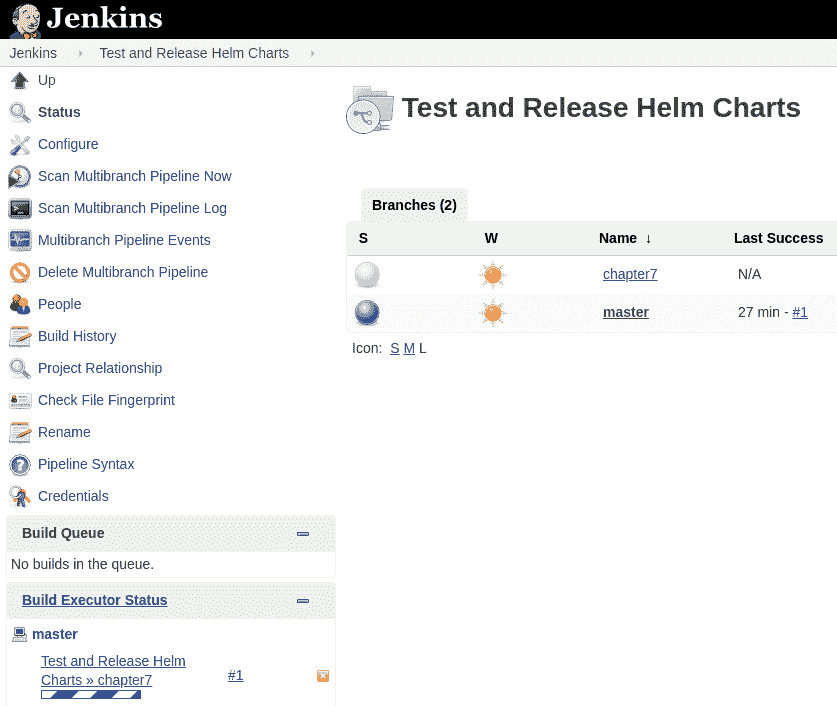
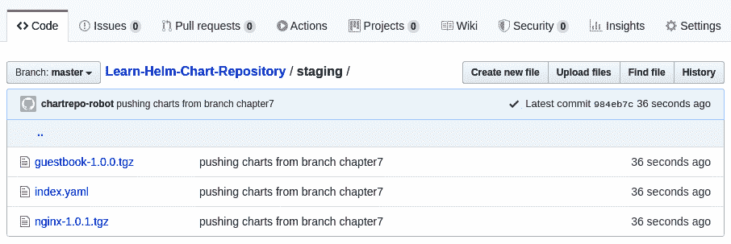
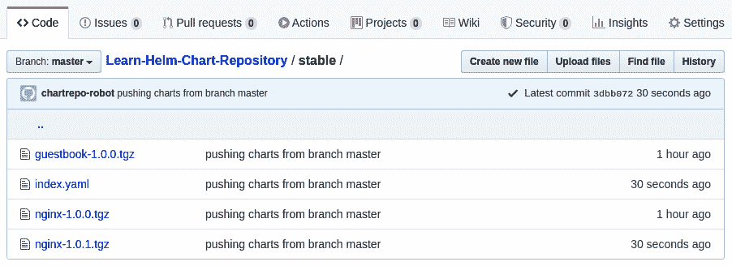

# 第七章：使用 CI/CD 和 GitOps 自动化 Helm 流程

在本书中，我们迄今为止讨论了两个高级流程。首先，我们探讨了使用 Helm 作为最终用户，利用 Helm 作为软件包管理器将各种复杂性的应用程序部署到 Kubernetes。其次，我们探讨了作为图表开发人员开发和测试 Helm 图表，这涉及将 Kubernetes 的复杂性封装在 Helm 图表中，并对图表进行测试，以确保所需的功能成功交付给最终用户。

这两个流程都涉及调用各种不同的 Helm CLI 命令。这些 Helm CLI 命令在执行各自的任务时非常有效，但需要从命令行手动调用。手动调用在管理多个不同的图表或应用程序时可能会成为一个痛点，并且可能会使大型企业难以扩展。因此，我们应该探索提供额外自动化的替代选项，以在 Helm 已经提供的基础上提供额外的自动化。在本章中，我们将调查与**持续集成**和**持续交付**（**CI**/**CD**）以及`GitOps`相关的概念，这些方法可以自动调用 Helm CLI 以及其他命令，以执行针对 Git 存储库的自动化工作流。这些工作流可以用于使用 Helm 自动部署应用程序，并在图表开发生命周期中构建、测试和打包 Helm 图表。

在本章中，我们将涵盖以下主题：

+   理解 CI/CD 和 GitOps

+   设置我们的环境

+   创建用于构建 Helm 图表的 CI 流水线

+   使用 Helm 创建 CD 流水线以部署应用程序

+   清理

# 技术要求

本章需要您在本地机器上安装以下技术：

+   Minikube

+   Helm

+   kubectl

+   Git

除了这些工具，您还应该在 GitHub 的 Packt 存储库中找到与本章中使用的示例相关的资源，网址为[`github.com/PacktPublishing/-Learn-Helm`](https://github.com/PacktPublishing/-Learn-Helm)。本存储库将在本章中被引用。

# 理解 CI/CD 和 GitOps

到目前为止，我们已经讨论了许多与 Helm 开发相关的关键概念——构建、测试和部署。然而，我们的探索仅限于手动配置和调用 Helm CLI。当您希望将图表移入类似生产环境时，有几个问题需要考虑，包括以下内容：

+   我如何确保图表开发和部署的最佳实践得到执行？

+   合作者参与开发和部署过程的影响是什么？

这些观点适用于任何软件项目，不仅适用于 Helm 图表开发。虽然我们已经涵盖了许多最佳实践，但在接纳新的合作者时，他们可能对这些主题没有相同的理解，或者没有执行这些关键步骤的纪律。通过使用自动化和可重复的流程，诸如 CI/CD 之类的概念已经被建立起来，以解决其中的一些挑战。

## CI/CD

需要一个自动化的软件开发流程，每次软件发生变化时都能遵循，这导致了 CI 的产生。CI 不仅确保了最佳实践的遵守，而且还有助于消除许多开发人员面临的常见挑战，正如“它在我的机器上可以运行”所体现的。我们之前讨论过的一个因素是使用版本控制系统，比如`git`，来存储源代码。通常，每个用户都会有自己独立的源代码副本，这使得在增加贡献者时难以管理代码库。

CI 是通过使用自动化工具来正确启用的，其中源代码在发生更改时经历一组预定的步骤。对于正确的自动化工具的需求导致了专门为此目的设计的软件的兴起。一些 CI 工具的例子包括 Jenkins、TeamCity 和 Bamboo，以及各种基于软件即服务（SaaS）的解决方案。通过将任务的责任转移到第三方组件，开发人员更有可能频繁提交代码，项目经理可以对团队的技能和产品的健壮性感到自信。

大多数这些工具中都具有的一个关键特性是能够及时通知项目当前状态的能力。通过使用持续集成，不是在软件开发周期的后期才发现破坏性变化，而是在变化被整合后立即执行流程并向相关方发送通知。通过利用快速通知，它为引入变化的用户提供了解决问题的机会，而兴趣所在的领域正处于头脑前沿，而不是在交付过程的后期，当时他们可能已经在其他地方忙碌。

将 CI 的许多概念应用于整个软件交付生命周期，随着应用程序向生产环境推进，导致了 CD 的产生。CD 是一组定义的步骤，编写用于推进软件通过发布过程（更常被称为流水线）。CI 和 CD 通常一起配对，因为执行 CI 的许多相同引擎也可以实现 CD。CD 在许多组织中得到了接受和流行，这些组织强制执行适当的变更控制，并要求批准，以便软件发布过程能够进展到下一个阶段。由于 CI/CD 周围的许多概念都是以可重复的方式自动化的，团队可以寻求完全消除手动批准步骤的需要，一旦他们确信已经建立了可靠的框架。

在没有任何人为干预的情况下实施完全自动化的构建、测试、部署和发布过程的过程被称为**持续部署**。虽然许多软件项目从未完全实现持续部署，但通过实施 CI/CD 强调的概念，团队能够更快地产生真正的业务价值。在下一节中，我们将介绍 GitOps 作为改进应用程序及其配置管理的机制。

## 将 CI/CD 提升到下一个级别，使用 GitOps

Kubernetes 是一个支持声明式配置的平台。与任何编程语言编写的应用程序（如 Python、Golang 或 Java）通过 CI/CD 流水线的方式一样，Kubernetes 清单也可以实现许多相同的模式。清单也应该存储在源代码仓库（如 Git）中，并且可以经历相同类型的构建、测试和部署实践。在 Git 存储库中管理 Kubernetes 集群配置的生命周期的流行度上升，然后以自动化的方式应用这些资源，导致了 GitOps 的概念。GitOps 最早由软件公司 WeaveWorks 在 2017 年首次引入，自那时以来，作为管理 Kubernetes 配置的一种方式，GitOps 的流行度一直在增加。虽然 GitOps 在 Kubernetes 的背景下最为人所知，但其原则可以应用于任何云原生环境。

与 CI/CD 类似，已经开发了工具来管理 GitOps 流程。这些包括 Intuit 的 ArgoCD 和 WeaveWorks 的 Flux，这个组织负责创造 GitOps 这个术语。您不需要使用专门设计用于 GitOps 的工具，因为任何自动化工具，特别是设计用于管理 CI/CD 流程的工具，都可以被利用。传统 CI/CD 工具和专为 GitOps 设计的工具之间的关键区别在于 GitOps 工具能够不断观察 Kubernetes 集群的状态，并在当前状态与 Git 存储中定义的期望状态不匹配时应用所需的配置。这些工具利用了 Kubernetes 本身的控制器模式。

由于 Helm 图表最终被渲染为 Kubernetes 资源，它们也可以用于参与 GitOps 流程，并且许多前述的 GitOps 工具本身原生支持 Helm。我们将在本章的其余部分中看到如何利用 CI/CD 和 GitOps 来使用 Helm 图表，利用 Jenkins 作为 CI 和 CD 的首选工具。

# 设置我们的环境

在本章中，我们将开发两种不同的流水线，以演示如何自动化 Helm 周围的不同流程。

开始设置本地环境的步骤如下：

1.  首先，鉴于本章的内存要求增加，如果在[*第二章*]（B15458_02_Final_JM_ePub.xhtml#_idTextAnchor098）中未使用 4g 内存初始化`minikube`集群，则应删除该集群并使用 4g 内存重新创建。可以通过运行以下命令来完成：

```
$ minikube delete
$ minikube start --memory=4g
```

1.  Minikube 启动后，创建一个名为`chapter7`的新命名空间：

```
$ kubectl create namespace chapter7
```

此外，您还应该 fork Packt 存储库，这将允许您根据这些练习中描述的步骤对存储库进行修改：

1.  通过单击 Git 存储库上的**Fork**按钮来创建 Packt 存储库的分支：

图 7.1 - 选择 Fork 按钮来创建 Packt 存储库的分支

您必须拥有 GitHub 帐户才能 fork 存储库。创建新帐户的过程在[*第五章*]（B15458_05_Final_JM_ePub.xhtml#_idTextAnchor265）中有描述，*构建您的第一个 Helm 图表*。

1.  创建 Packt 存储库的分支后，通过运行以下命令将此分支克隆到本地计算机：

```
$ git clone https://github.com/$GITHUB_USERNAME/-Learn-Helm.git Learn-Helm
```

除了创建 Packt 存储库的分支外，您可能还希望从您的 Helm 存储库中删除`guestbook`图表，该图表是从您的 GitHub Pages 存储库中提供的，我们在[*第五章*]（B15458_05_Final_JM_ePub.xhtml#_idTextAnchor265）中创建了*构建您的第一个 Helm 图表*。虽然这并不是绝对必要的，但本章中的示例将假定一个干净的状态。

使用以下步骤从图表存储库中删除此图表：

1.  导航到 Helm 图表存储库的本地克隆。您会记得，我们建议的图表存储库的名称是`Learn-Helm-Chart-Repository`，因此在本章中我们将使用这个名称来引用您的基于 GitHub Pages 的图表存储库：

```
$ cd $LEARN_HELM_CHART_REPOSITORY_DIR
$ ls
guestbook-1.0.0.tgz   index.yaml   README.md
```

1.  从图表存储库中删除`guestbook-1.0.0.tgz`和`index.yaml`文件：

```
$ rm guestbook-1.0.0.tgz index.yaml
$ ls
README.md
```

1.  将这些更改推送到您的远程存储库：

```
$ git add --all
$ git commit -m 'Preparing for chapter 7'
$ git push origin master
```

1.  您应该能够在 GitHub 中确认您的图表和索引文件已被删除，只留下`README.md`文件：

图 7.2 - 您在图表存储库中应该看到的唯一文件是 README.md 文件

](image/Figure_7.2.jpg)

图 7.2 - 您在图表存储库中应该看到的唯一文件是 README.md 文件

现在您已经启动了 Minikube，创建了 Packt 存储库的一个分支，并从`Learn-Helm-Chart-Repository`中删除了 Guestbook 图表，让我们开始学习如何创建一个 CI 流水线来发布 Helm 图表。

# 创建一个 CI 流水线来构建 Helm 图表

CI 的概念可以应用于构建、测试、打包和发布 Helm 图表到图表存储库的图表开发人员的视角。在本节中，我们将描述使用端到端 CI 流水线来简化这个过程可能是什么样子，以及如何通过构建一个示例流水线来引导您。第一步是设计示例流水线所需的组件。

## 设计流水线

在之前的章节中，开发 Helm 图表主要是一个手动过程。虽然 Helm 提供了在 Kubernetes 集群中创建`test`钩子的自动化，但在代码更改后手动执行`helm lint`、`helm test`或`ct lint-and-install`命令以确保测试仍然通过。一旦代码更改后继续通过 linting 和测试，图表就可以通过运行`helm package`命令进行打包。如果使用 GitHub Pages 存储库（比如在*第五章*中创建的那个，*构建您的第一个 Helm 图表*），则通过运行`helm repo index`创建`index.yaml`文件，并将`index.yaml`文件以及打包的图表推送到 GitHub 存储库。

虽然手动调用每个命令当然是可行的，但随着您开发更多的 Helm 图表或添加更多的贡献者，这种工作流程可能变得越来越难以维持。使用手动工作流程，很容易允许未经测试的更改被应用到您的图表中，并且很难确保贡献者遵守测试和贡献指南。幸运的是，通过创建一个自动化发布流程的 CI 流水线，可以避免这些问题。

以下步骤概述了使用本书中讨论的命令和工具来进行示例 CI 工作流。它将假定生成的图表保存在 GitHub Pages 存储库中：

1.  图表开发人员对`git` monorepo 中的一个图表或一组图表进行代码更改。

1.  开发人员将更改推送到远程存储库。

1.  已修改的图表会通过运行`ct lint`和`ct install`命令在 Kubernetes 命名空间中自动进行 linting 和测试。

1.  如果 linting 和测试成功，图表将自动使用`helm package`命令打包。

1.  `index.yaml`文件将使用`helm repo index`命令自动生成。

1.  打包的图表和更新的`index.yaml`文件将自动推送到存储库。它们将被推送到`stable`或`staging`，具体取决于作业运行的分支。

在下一节中，我们将使用**Jenkins**执行这个过程。让我们首先了解一下 Jenkins 是什么以及它是如何工作的。

## 了解 Jenkins

Jenkins 是一个用于执行自动化任务和工作流程的开源服务器。它通常用于通过 Jenkins 的**管道即代码**功能创建 CI/CD 流水线，该功能在一个名为`Jenkinsfile`的文件中编写，该文件定义了 Jenkins 流水线。

Jenkins 流水线是使用 Groovy**领域特定语言**（**DSL**）编写的。Groovy 是一种类似于 Java 的语言，但与 Java 不同的是，它可以用作面向对象的脚本语言，适合编写易于阅读的自动化。在本章中，我们将带您了解两个已经为您准备好的`Jenkinsfile`文件。您不需要有任何关于从头开始编写`Jenkinsfile`文件的经验，因为深入研究 Jenkins 超出了本书的范围。话虽如此，到本章结束时，您应该能够将学到的概念应用到您选择的自动化工具中。虽然本章中介绍了 Jenkins，但其概念也可以应用于任何其他自动化工具。

当创建一个`Jenkinsfile`文件时，工作流程的一组定义的步骤将在 Jenkins 服务器本身上执行，或者委托给运行该作业的单独代理。还可以通过自动调度 Jenkins 代理作为单独的 Pod 集成额外的功能，每当启动构建时，简化代理的创建和管理。代理完成后，可以配置为自动终止，以便下一个构建可以在一个新的、干净的 Pod 中运行。在本章中，我们将使用 Jenkins 代理运行示例流水线。

Jenkins 还非常适合 GitOps 的概念，因为它提供了扫描源代码存储库以查找`Jenkinsfile`文件的能力。对于每个包含`Jenkinsfile`文件的分支，将自动配置一个新作业，该作业将从所需分支克隆存储库开始。这样可以很容易地测试新功能和修复，因为新作业可以自动创建并与其相应的分支一起使用。

在对 Jenkins 有基本了解之后，让我们在 Minikube 环境中安装 Jenkins。

安装 Jenkins

与许多通常部署在 Kubernetes 上的应用程序一样，Jenkins 可以使用来自 Helm Hub 的许多不同社区 Helm 图之一进行部署。在本章中，我们将使用来自**Codecentric**软件开发公司的 Jenkins Helm 图。添加`codecentric`图存储库以开始安装 Codecentric Jenkins Helm 图：

```
$ helm repo add codecentric https://codecentric.github.io/helm-charts
```

在预期的与 Kubernetes 相关的值中，例如配置资源限制和服务类型，`codecentric` Jenkins Helm 图包含其他用于自动配置不同 Jenkins 组件的 Jenkins 相关值。

由于配置这些值需要对超出本书范围的 Jenkins 有更深入的了解，因此为您提供了一个`values`文件，该文件将自动准备以下 Jenkins 配置：

+   添加未包含在基本镜像中的相关 Jenkins 插件。

+   配置所需的凭据以与 GitHub 进行身份验证。

+   配置专门设计用于测试和安装 Helm 图的 Jenkins 代理。

+   配置 Jenkins 以根据`Jenkinsfile`文件的存在自动创建新作业。

+   跳过通常在新安装启动时发生的手动提示。

+   禁用身份验证，以简化本章中对 Jenkins 的访问。

`values`文件还将配置以下与 Kubernetes 相关的细节：

+   针对 Jenkins 服务器设置资源限制。

+   将 Jenkins 服务类型设置为`NodePort`。

+   创建 Jenkins 和 Jenkins 代理在 Kubernetes 环境中运行作业和部署 Helm 图所需的 ServiceAccounts 和 RBAC 规则。

+   将 Jenkins 的`PersistentVolumeClaim`大小设置为`2Gi`。

该 values 文件可在[`github.com/PacktPublishing/-Learn-Helm/blob/master/jenkins/values.yaml`](https://github.com/PacktPublishing/-Learn-Helm/blob/master/jenkins/values.yaml)找到。浏览这些值的内容时，您可能会注意到`fileContent`下定义的配置包含 Go 模板。该值的开头如下所示：


图 7.3 - Jenkins Helm 图表的`values.yaml`文件包含 Go 模板

虽然 Go 模板通常在`values.yaml`文件中无效，但 Codecentric Jenkins Helm 图表向模板函数`tpl`提供了`fileContent`配置。在模板方面，这看起来如下所示：

```
{{- tpl .Values.fileContent }}
```

`tpl`命令将解析`fileContent`值作为 Go 模板，使其可以包含 Go 模板，即使它是在`values.yaml`文件中定义的。

在本章中，`fileContent`配置中定义的 Go 模板有助于确保 Jenkins 安装方式符合本章的要求。换句话说，模板将需要在安装过程中提供以下附加值：

+   `githubUsername`：GitHub 用户名

+   `githubPassword`：GitHub 密码

+   `githubForkUrl`：您的 Packt 存储库分支的 URL，该分支在本章的*技术要求*部分中提取

+   `githubPagesRepoUrl`：您的 GitHub Pages Helm 存储库的 URL，该存储库是在*第五章*结束时创建的，*构建您的第一个 Helm 图表*

请注意，这不是您静态站点的 URL，而是 GitHub 存储库本身的 URL，例如，https://github.com/$GITHUB_USERNAME/Learn-Helm-Chart-Repository.git。

前述列表中描述的四个值可以使用`--set`标志提供，也可以使用`--values`标志从额外的`values`文件中提供。如果选择创建单独的`values`文件，请确保不要将该文件提交和推送到源代码控制，因为它包含敏感信息。本章的示例偏向于使用`--set`标志来提供这四个值。除了上述描述的值之外，还应该使用`--values`标志提供 Packt 存储库中包含的`values.yaml`文件。

使用以下示例作为参考，使用`helm install`命令安装您的`Jenkins`实例：

```
$ helm install jenkins codecentric/jenkins \
  -n chapter7 --version 1.5.1 \
  --values Learn-Helm/jenkins/values.yaml \
  --set githubUsername=$GITHUB_USERNAME \
  --set githubPassword=$GITHUB_PASSWORD \
  --set githubForkUrl=https://github.com/$GITHUB_USERNAME/-Learn-Helm.git \
  --set githubPagesRepoUrl=https://github.com/$GITHUB_USERNAME/Learn-Helm-Chart-Repository.git
```

您可以通过对`chapter7`命名空间中的 Pod 运行监视来监视安装。

```
$ kubectl get Pods -n chapter7 -w
```

请注意，在极少数情况下，您的 Pod 可能会在`Init:0/1`阶段卡住。如果外部依赖出现可用性问题，比如 Jenkins 插件站点及其镜像正在经历停机时间，就会发生这种情况。如果发生这种情况，请尝试在几分钟后删除您的发布并重新安装它。

一旦您的 Jenkins Pod 在`READY`列下报告`1/1`，您的`Jenkins`实例就可以被访问了。复制并粘贴显示的安装后说明的以下内容以显示 Jenkins URL：

```
$ export NODE_PORT=$(kubectl get service --namespace chapter7 -o jsonpath='{.spec.ports[0].nodePort}' jenkins-master)
$ export NODE_IP=$(kubectl get nodes --namespace chapter7 -o jsonpath='{.items[0].status.addresses[0].address}')
echo "http://$NODE_IP:$NODE_PORT"
```

当您访问 Jenkins 时，您的首页应该看起来类似于以下屏幕截图：


图 7.4-运行 Helm 安装后的 Jenkins 主页

如果图表安装正确，您会注意到一个名为**测试和发布 Helm 图表**的新作业被创建。在页面的左下角，您会注意到**构建执行器状态**面板，用于提供当前正在运行的活动作业的概览。当作业被创建时，将自动触发该作业，这就是为什么当您登录到 Jenkins 实例时会看到它正在运行。

现在 Jenkins 已安装并且其前端已经验证，让我们浏览一下 Packt 存储库中的示例`Jenkinsfile`文件，以了解 CI 管道的工作原理。请注意，本章节中我们不会显示`Jenkinsfile`文件的全部内容，因为我们只想简单地突出感兴趣的关键领域。文件的全部内容可以在 Packt 存储库中查看[`github.com/PacktPublishing/-Learn-Helm/blob/master/helm-charts/Jenkinsfile`](https://github.com/PacktPublishing/-Learn-Helm/blob/master/helm-charts/Jenkinsfile)。

## 理解管道

触发“测试和部署 Helm 图表”作业时发生的第一件事是创建一个新的 Jenkins 代理。通过利用`Learn-Helm/jenkins/values.yaml`中提供的值，Jenkins 图表安装会自动配置一个名为`chart-testing-agent`的 Jenkins 代理。以下一行指定该代理为此`Jenkinsfile`文件的代理：

```
agent { label 'chart-testing-agent' }
```

此代理由 Jenkins 图表值配置，使用 Helm 社区提供的图表测试图像运行。位于`quay.io/helmpack/chart-testing`的图表测试图像包含了*第六章*中讨论的许多工具，*测试 Helm 图表*。具体来说，该图像包含以下工具：

+   `helm`

+   `ct`

+   `yamllint`

+   `yamale`

+   `git`

+   `Kubectl`

由于此图像包含测试 Helm 图表所需的所有工具，因此可以将其用作执行 Helm 图表的 CI 的主要图像。

当 Jenkins 代理运行时，它会使用`githubUsername`和`githubPassword`进行身份验证，隐式地克隆您的 GitHub 分支，由`githubForkUrl`值指定。Jenkins 会自动执行此操作，因此不需要在`Jenkinsfile`文件中指定任何代码来执行此操作。

Jenkins 代理克隆您的存储库后，将开始执行`Jenkinsfile`文件中定义的阶段。阶段是管道中的逻辑分组，可以帮助可视化高级步骤。将执行的第一个阶段是 lint 阶段，其中包含以下命令：

```
sh 'ct lint'
```

前述命令中的`sh`部分是用于运行 bash shell 或脚本并调用`ct`工具的`lint`子命令。您会记得，此命令会针对已修改的所有图表的`Chart.yaml`和`values.yaml`文件对主分支进行检查，我们在*第六章*中已经讨论过这一点，*测试 Helm 图表*。

如果 linting 成功，流水线将继续进行到测试阶段，并执行以下命令：

```
sh 'ct install --upgrade'
```

这个命令也应该很熟悉。它会从主分支上的版本安装每个修改的图表，并执行定义的测试套件。它还确保从上一个版本的任何升级都成功，有助于防止回归。

请注意，前两个阶段可以通过运行单个`ct lint-and-install --upgrade`命令来合并。这仍然会导致有效的流水线，但这个示例将它们分成单独的阶段，可以更好地可视化执行的操作。

如果测试阶段成功，流水线将继续进行到打包图表阶段，执行以下命令：

```
sh 'helm package --dependency-update helm-charts/charts/*'
```

在这个阶段，命令将简单地打包`helm-charts/charts`文件夹下包含的每个图表。它还将更新和下载每个声明的依赖项。

如果打包成功，管道将继续进行到最后一个阶段，称为`推送图表到存储库`。这是最复杂的阶段，所以我们将把它分解成较小的步骤。第一步可以在这里看到：

```
// Clone GitHub Pages repository to a folder called 'chart-repo'
sh "git clone ${env.GITHUB_PAGES_REPO_URL} chart-repo"
// Determine if these charts should be pushed to 'stable' or 'staging' based on the branch
def repoType
if (env.BRANCH_NAME == 'master') {
  repoType = 'stable'
} else {
  repoType = 'staging'
}
// Create the corresponding 'stable' or 'staging' folder if it does not exist
def files = sh(script: 'ls chart-repo', returnStdout: true)
if (!files.contains(repoType)) {
  sh "mkdir chart-repo/${repoType}"
}
```

由于 Helm 图表存储库是一个单独的 GitHub Pages 存储库，我们必须克隆该存储库，以便我们可以添加新的图表并推送更改。一旦克隆了 GitHub Pages 存储库，就会设置一个名为`repoType`的变量，具体取决于 CI/CD 管道针对的分支。该变量用于确定前一阶段打包的图表应该推送到`stable`或`staging`图表存储库。

对于这个管道，`stable`意味着图表已经经过测试、验证并合并到主分支中。`staging`意味着图表正在开发中，尚未合并到主分支，也尚未正式发布。或者，您可以在切换到发布分支时在稳定存储库中发布图表，但是在这个例子中，我们将采用假设每次合并到主分支都是一个新发布的前一种方法。

`stable`和`staging`作为两个单独的图表存储库提供；这可以通过在 GitHub Pages 存储库的顶层创建两个单独的目录来完成：

```
Learn-Helm-Repository/
  stable/
  staging/
```

然后，稳定和暂存文件夹包含它们自己的`index.yaml`文件，以区分它们作为单独的图表存储库。

为了方便起见，前述管道摘录的最后一部分会在管道执行依赖于其存在的分支时自动创建`stable`或`staging`文件夹。

现在确定了图表应该推送到的存储库类型，我们继续进行管道的下一个阶段，如下所示：

```
// Move charts from the packaged-charts folder to the corresponding 'stable' or 'staging' folder
sh "mv packaged-charts/*.tgz chart-repo/${repoType}"
// Generate the updated index.yaml
sh "helm repo index chart-repo/${repoType}"
// Update git config details
sh "git config --global user.email 'chartrepo-robot@example.com'"
sh "git config --global user.name 'chartrepo-robot'"
```

第一条命令将从前一阶段复制每个打包的图表到`stable`或`staging`文件夹。接下来，使用`helm repo index`命令更新`stable`或`staging`的`index.yaml`文件，以反映已更改或添加的图表。

需要记住的一点是，如果我们使用不同的图表存储库解决方案，比如**ChartMuseum**（由 Helm 社区维护的图表存储库解决方案），则不需要使用`helm repo index`命令，因为当 ChartMuseum 接收到新的打包 Helm 图表时，`index.yaml`文件会自动更新。对于不会自动计算`index.yaml`文件的实现，比如 GitHub Pages，`helm repo index`命令是必要的，正如我们在这个管道中所看到的。

前面片段的最后两个命令设置了`git`的`username`和`email`，这些是推送内容到`git`存储库所必需的。在本例中，我们将用户名设置为`chartrepo-robot`，以表示 CI/CD 过程促进了`git`交互，我们将设置邮箱为`(mailto:chartrepo-robot@example.com)`作为示例值。您可能希望邮箱代表负责维护图表存储库的组织。

最后一步是推送更改。这个操作在最终的管道片段中被捕获，如下所示：

```
// Add and commit the changes
sh 'git add --all'
sh "git commit -m 'pushing charts from branch ${env.BRANCH_NAME}'"
withCredentials([usernameColonPassword(credentialsId: 'github-auth', variable: 'USERPASS')]) {
    script {
    // Inject GitHub auth and push to the master branch, where the charts are being served
    def authRepo = env.GITHUB_PAGES_REPO_URL.replace('://', "://${USERPASS}@")
    sh "git push ${authRepo} master"
    }
}
```

打包的图表首先使用`git add`和`git commit`命令添加和提交。接下来，使用`git push`命令对存储库进行推送，使用名为`github-auth`的凭据。这个凭据是在安装过程中从`githubUsername`和`githubPassword`值创建的。`github-auth`凭据允许您安全地引用这些机密，而不会在管道代码中以明文形式打印出来。

请注意，Helm 社区发布了一个名为`Chart Releaser`的工具（[`github.com/helm/chart-releaser`](https://github.com/helm/chart-releaser)），可以作为使用`helm repo index`命令生成`index.yaml`文件并使用`git push`上传到 GitHub 的替代方案。`Chart Releaser`工具旨在通过管理包含在 GitHub Pages 中的 Helm 图表来抽象一些额外的复杂性。

我们决定在本章中不使用这个工具来实现管道，因为在撰写本文时，`Chart Releaser`不支持 Helm 3。

既然我们已经概述了 CI 管道，让我们通过一个示例执行来运行一遍。

## 运行管道

正如我们之前讨论的，当我们安装 Jenkins 时，这个流水线的第一次运行实际上是自动触发的。该作业针对主分支运行，并且可以通过单击 Jenkins 登陆页面上的**测试和发布 Helm Charts**链接来查看。您会注意到有一个成功的作业针对主分支运行了：


图 7.5 - 流水线的第一次运行

Jenkins 中的每个流水线构建都有一个关联的日志，其中包含执行的输出。您可以通过在左侧选择蓝色圆圈旁边的**#1**链接，然后在下一个屏幕上选择**控制台输出**来访问此构建的日志。此构建的日志显示第一个阶段`Lint`成功，显示了这条消息：

```
All charts linted successfully
----------------------------------
No chart changes detected.
```

这是我们所期望的，因为从主分支的角度来看，没有任何图表发生变化。在安装阶段也可以看到类似的输出：

```
All charts installed successfully
-----------------------------------
No chart changes detected.
```

因为 Lint 和 Install 阶段都没有错误，所以流水线继续到了 Package Charts 阶段。在这里，您可以查看输出：

```
+ helm package --dependency-update helm-charts/charts/guestbook helm-charts/charts/nginx
Successfully packaged chart and saved it to: /home/jenkins/agent/workspace/t_and_Release_Helm_Charts_master/guestbook-1.0.0.tgz
Successfully packaged chart and saved it to: /home/jenkins/agent/workspace/t_and_Release_Helm_Charts_master/nginx-1.0.0.tgz
```

最后，流水线通过克隆您的 GitHub Pages 存储库，在其中创建一个`stable`文件夹，将打包的图表复制到`stable`文件夹中，将更改提交到 GitHub Pages 存储库本地，并将更改推送到 GitHub。我们可以观察到每个添加到我们存储库的文件都在以下行中输出：

```
+ git commit -m 'pushing charts from branch master'
[master 9769f5a] pushing charts from branch master
 3 files changed, 32 insertions(+)
 create mode 100644 stable/guestbook-1.0.0.tgz
 create mode 100644 stable/index.yaml
 create mode 100644 stable/nginx-1.0.0.tgz
```

您可能会好奇在自动推送后您的 GitHub Pages 存储库是什么样子。您的存储库应该如下所示，其中包含一个新的`stable`文件夹，其中包含 Helm 图表：


图 7.6 - CI 流水线完成后存储库的状态

在`stable`文件夹中，您应该能够看到三个不同的文件，两个单独的图表和一个`index.yaml`文件：


图 7.7 - `stable`文件夹的内容

这个第一个流水线构建成功地创建了一组初始的`stable`图表，但没有演示在被认为是稳定并且可以供最终用户使用之前，新图表如何进行 linting 和测试。为了演示这一点，我们需要从主分支切出一个功能分支来修改一个或多个图表，将更改推送到功能分支，然后在 Jenkins 中启动一个新的构建。

首先，从主分支创建一个名为 `chapter7` 的新分支：

```
$ cd $PACKT_FORK_DIR
$ git checkout master
$ git checkout -b chapter7
```

在这个分支上，我们将简单地修改`ngnix`图表的版本以触发图表的 linting 和测试。NGINX 是一个 Web 服务器和反向代理。它比我们在本书中一直使用的 Guestbook 应用程序要轻量得多，因此，为了避免 Jenkins 在您的 Minikube 环境中运行时可能出现的任何资源限制，我们将在本示例中使用 Packt 存储库中的`ngnix`图表。

在`helm-charts/charts/nginx/Chart.yaml`文件中，将图表的版本从`1.0.0`更改为`1.0.1`：

```
version: 1.0.1
```

运行 `git status` 确认已检测到变化：

```
$ git status
On branch chapter7
Changes not staged for commit:
  (use 'git add <file>...' to update what will be committed)
  (use 'git checkout -- <file>...' to discard changes in working directory)
        modified:   helm-charts/charts/nginx/Chart.yaml
no changes added to commit (use 'git add' and/or 'git commit -a')
```

注意`ngnix`的`Chart.yaml`文件已经被修改。添加文件，然后提交更改。最后，您可以继续将更改推送到您的分支：

```
$ git add helm-charts
$ git commit -m 'bumping NGINX chart version to demonstrate chart testing pipeline'
$ git push origin chapter7
```

在 Jenkins 中，我们需要触发仓库扫描，以便 Jenkins 可以检测并针对此分支启动新的构建。转到**测试和发布 Helm Charts**页面。您可以通过点击顶部标签栏上的**测试和发布 Helm Charts**标签轻松实现：


图 7.8 – 测试和发布 Helm Charts 页面

选择后，点击左侧菜单中的**立即扫描多分支流水线**按钮。这允许 Jenkins 检测到您的新分支并自动启动新的构建。扫描应在大约 10 秒内完成。刷新页面，新的`chapter7`分支应如下出现在页面上：



图 7.9 – 扫描新的`chapter7`分支后的测试和部署 Helm Charts 页面

由于`chapter7`作业包含经过修改的 Helm 图表，并使用图表测试工具进行测试，因此`chapter7`作业的运行时间将比主作业长。您可以通过导航到`chapter7`的控制台输出来观察此流水线的运行情况。从**测试和发布 Helm 图表**概述页面，选择*第七章*分支，然后在左下角选择**#1**链接。最后，选择**控制台输出**链接。如果您在流水线仍在运行时导航到此页面，您将实时收到日志更新。等到流水线结束，在那里应该显示以下消息：

```
Finished: SUCCESS
```

在控制台输出日志的开始处，注意`ct lint`和`ct install`命令是针对`ngnix`图表运行的，因为这是唯一发生更改的图表：

```
Charts to be processed:
---------------------------------------------------------------
 nginx => (version: '1.0.1', path: 'helm-charts/charts/nginx')
```

每个命令的附加输出应该已经很熟悉，因为它与*第六章*中描述的输出相同，*测试 Helm 图表*。

在您的 GitHub Pages 存储库中，您应该看到`staging`文件夹中的`ngnix`图表的新版本，因为它没有构建在主分支上：



图 7.10 - `staging`文件夹的内容

要发布`nginx-1.0.1.tgz`图表，您需要将`chapter7`分支合并到主分支，这将导致该图表被推送到稳定存储库。在命令行上，将您的`chapter7`分支合并到主分支并将其推送到`remote`存储库：

```
$ git checkout master
$ git merge chapter7
$ git push origin master
```

在 Jenkins 中，通过返回到**测试和发布 Helm 图表**页面并点击**master**作业来导航到主流水线作业。您的屏幕应该如下所示：


图 7.11 - 测试和发布 Helm 图表项目的主作业

一旦进入此页面，点击左侧的**立即构建**链接。再次注意日志中的内容，图表测试被跳过，因为图表测试工具将克隆与主分支进行了比较。由于内容相同，工具确定没有需要测试的内容。构建完成后，导航到您的 GitHub Pages 存储库，确认新的`nginx-1.0.1.tgz`图表位于`stable`存储库下：



图 7.12 - 添加新的`nginx`图表后存储库的状态

您可以通过在本地添加`helm repo add`来验证这些图表是否已正确部署到 GitHub Pages 的`stable`存储库。在*第五章*中，*构建您的第一个 Helm 图表*，您添加了 GitHub Pages 存储库的根位置。但是，我们修改了文件结构以包含`stable`和`staging`文件夹。如果仍然配置，您可以通过运行以下命令来删除此存储库：

```
$ helm repo remove learnhelm
```

可以使用`stable`存储库的更新位置再次添加存储库：

```
$ helm repo add learnhelm $GITHUB_PAGES_SITE_URL/stable
```

请注意，`$GITHUB_PAGES_SITE_URL`的值引用 GitHub 提供的静态站点，而不是您实际的`git`存储库。您的 GitHub Pages 站点 URL 应该类似于[`$GITHUB_USERNAME.github.io/Learn-Helm-Repository/stable`](https://$GITHUB_USERNAME.github.io/Learn-Helm-Repository/stable)。确切的链接可以在 GitHub Pages 存储库的**设置**选项卡中找到。

在添加`stable`存储库后，运行以下命令查看在两个主构建过程中构建和推送的每个图表：

```
$ helm search repo learnhelm --versions
```

您应该看到三个结果，其中两个包含构建和推送的`nginx`图表的两个版本：


图 7.13 - `helm search repo`命令的结果

在本节中，我们讨论了如何通过 CI 管道管理 Helm 图表的生命周期。通过使用提供的示例遵循自动化工作流程，您可以在发布图表给最终用户之前轻松执行常规的 linting 和测试。

虽然本节主要关注 Helm 图表的 CI，但 CD 和 GitOps 也可以用于将 Helm 图表部署到不同的环境。我们将在下一节中探讨如何构建 CD 管道。

# 创建一个使用 Helm 部署应用程序的 CD 管道

CD 管道是一组可重复部署到一个或多个不同环境的步骤。在本节中，我们将创建一个 CD 管道，以部署我们在上一节中测试并推送到 GitHub Pages 存储库的`nginx`图表。还将通过引用保存到`git`存储库的`values`文件来利用 GitOps。

让我们设计需要包括在此管道中的高级步骤。

## 设计管道

在以前的章节中，使用 Helm 部署到 Kubernetes 环境是一个手动过程。然而，这个 CD 管道旨在在抽象使用 Helm 的同时部署到多个不同的环境。

以下步骤描述了我们将在本节中涵盖的 CD 工作流程。

1.  添加包含`nginx`图表发布的稳定 GitHub Pages 存储库。

1.  将`nginx`图表部署到开发环境。

1.  将`nginx`图表部署到**质量保证**（**QA**）环境。

1.  等待用户批准管道以继续进行生产部署。

1.  将`nginx`图表部署到生产环境。

CD 工作流包含在单独的`Jenkinsfile`文件中，与先前为 CI 管道创建的文件不同。在创建`Jenkinsfile`文件之前，让我们更新 Minikube 和 Jenkins 环境，以便执行 CD 流程。

## 更新环境

开发、QA 和生产环境将由本地 Minikube 集群中的不同命名空间建模。虽然我们通常不建议允许非生产（开发和 QA）和生产环境共存于同一集群中，但为了演示我们的示例 CD 流程，我们将这三个环境放在一起。

创建`dev`、`qa`和`prod`命名空间来表示每个环境：

```
$ kubectl create ns dev
$ kubectl create ns qa
$ kubectl create ns prod
```

您还应该删除在上一节中创建的`chapter7`分支。应删除此分支，因为当创建新的 CD 管道时，Jenkins 将尝试针对存储库的每个分支运行它。为简单起见，并避免资源限制，我们建议仅使用主分支进行推进。

使用以下命令从存储库中删除`chapter7`分支：

```
$ git push -d origin chapter7
$ git branch -D chapter7
```

最后，您需要升级您的 Jenkins 实例以设置一个名为`GITHUB_PAGES_SITE_URL`的环境变量。这是您在 GitHub Pages 中图表存储库的位置，格式为[`$GITHUB_USERNAME.github.io/Learn-Helm-Chart-Repository/stable`](https://$GITHUB_USERNAME.github.io/Learn-Helm-Chart-Repository/stable)。CD 流水线中引用了该环境变量，以通过`helm repo add`添加`stable` GitHub Pages 图表存储库。要添加此变量，您可以通过使用`--reuse-values`标志重新使用先前应用的值，同时使用`--set`指定一个名为`githubPagesSiteUrl`的附加值。

执行以下命令来升级您的 Jenkins 实例：

```
$ helm upgrade jenkins codecentric/jenkins \
  -n chapter7 --version 1.5.1 \
  --reuse-values --set githubPagesSiteUrl=$GITHUB_PAGES_SITE_URL
```

此次升级将导致 Jenkins 实例重新启动。您可以通过针对`chapter7`命名空间的 Pod 运行 watch 来等待 Jenkins Pod 准备就绪：

```
$ kubectl get Pods -n chapter7 -w
```

当 Jenkins Pod 指示`1/1`个容器已准备就绪时，该 Jenkins Pod 可用。

一旦 Jenkins 准备就绪，通过使用上一节中相同的 URL 访问 Jenkins 实例。您应该会找到另一个作业，名为`Deploy NGINX Chart`，它代表了 CD 流水线：


图 7.14-升级 Jenkins 版本后的 Jenkins 首页

当设置了 GITHUB_PAGES_SITE_URL 时，此作业将在`values.yaml`文件中配置为创建（以帮助改进本章流程）。

请注意，与 CI 流水线一样，CD 流水线也会自动启动，因为它是首次被检测到。在我们审查此流水线的日志之前，让我们先来看看构成 CD 流水线的过程。

## 理解流水线

在本节中，我们将仅审查流水线的关键领域，但完整的 CD 流水线已经编写好，并位于[`github.com/PacktPublishing/-Learn-Helm/blob/master/nginx-cd/Jenkinsfile`](https://github.com/PacktPublishing/-Learn-Helm/blob/master/nginx-cd/Jenkinsfile)。

与之前的 CI 流水线一样，为了测试和发布 Helm 图表，CD 流水线首先通过动态创建一个新的 Jenkins 代理作为运行图表测试镜像的 Kubernetes Pod 来开始：

```
agent { label 'chart-testing-agent' }
```

虽然我们在这个流水线中没有使用`ct`工具，但是图表测试镜像包含了执行`nginx`部署所需的 Helm CLI，因此该镜像足以用于这个示例 CD 流水线。然而，也可以创建一个更小的镜像，删除未使用的工具也是可以接受的。

一旦代理被创建，Jenkins 会隐式克隆您的分支，就像在 CI 流水线中一样。

流水线的第一个明确定义的阶段称为“设置”，它将托管在 GitHub Pages 上的您的`stable`图表存储库添加到 Jenkins 代理上的本地 Helm 客户端中。

```
sh "helm repo add learnhelm ${env.GITHUB_PAGES_SITE_URL}"
```

一旦存储库被添加，流水线就可以开始将 NGINX 部署到不同的环境中。下一个阶段称为“部署到开发环境”，将 NGINX 图表部署到您的`dev`命名空间：

```
dir('nginx-cd') {
  sh "helm upgrade --install nginx-${env.BRANCH_NAME} learnhelm/nginx --values common-values.yaml --values dev/values.yaml -n dev --wait"
}
```

您可能注意到这个阶段的第一个细节是`dir('nginx-cd')`闭包。这是`Jenkinsfile`语法，用于设置其中包含的命令的工作目录。我们将很快更详细地解释`nginx-cd`文件夹。

您还可以看到，这个阶段使用提供的`--install`标志运行`helm upgrade`命令。`helm upgrade`通常针对已经存在的发布执行，并且如果尝试针对不存在的发布执行则会失败。然而，`--install`标志会在发布不存在时安装图表。如果发布已经存在，`helm upgrade`命令会升级发布。`--install`标志对于自动化流程非常方便，比如本节中描述的 CD 流水线，因为它可以避免您需要执行检查来确定发布的存在。

关于这个`helm upgrade`命令的另一个有趣细节是它两次使用了`--values`标志——一次针对名为`common-values.yaml`的文件，一次针对名为`dev/values.yaml`的文件。这两个文件都位于`nginx-cd`文件夹中。以下内容位于`nginx-cd`文件夹中：

```
nginx-cd/
  dev/
    values.yaml
  qa/
    values.yaml
  prod/
    values.yaml
  common-values.yaml
  Jenkinsfile
```

在将应用程序部署到不同的环境时，您可能需要稍微修改应用程序的配置，以使其能够与环境中的其他服务集成。`dev`、`qa`和`prod`文件夹下的每个`values`文件都包含一个环境变量，该变量根据部署的环境设置在 NGINX 部署上。例如，这里显示了`dev/values.yaml`文件的内容：

```
env:
 - name: ENVIRONMENT
   value: dev
```

类似地，这里显示了`qa/values.yaml`文件的内容：

```
env:
 - name: ENVIRONMENT
   value: qa
```

`prod/values.yaml`文件的内容如下：

```
env:
 - name: ENVIRONMENT
   value: prod
```

虽然在这个示例中部署的 NGINX 图表是直接的，并且不严格要求指定这些值，但您会发现将环境特定的配置分开放在单独的`values`文件中，使用这里展示的方法对于复杂的真实用例非常有帮助。然后可以通过将相应的 values 文件传递给`helm upgrade --install`命令来应用安装，其中`${env}`表示`dev`、`qa`或`prod`。

正如其名称所示，`common-values.yaml`文件用于所有部署环境中通用的值。这个示例的`common-values.yaml`文件写成如下形式：

```
service:
 type: NodePort
```

这个文件表示在安装图表期间创建的每个 NGINX 服务都应该具有`NodePort`类型。由于它们没有在`common-values.yaml`文件或单独的`values.yaml`环境文件中被覆盖，NGINX 图表的`values.yaml`文件中设置的所有其他默认值也被应用到每个环境中。

重要的一点是，您的应用程序应该在每个部署环境中尽可能相同地部署。任何改变运行中的 Pod 或容器的物理属性的值都应该在`common-values.yaml`文件中指定。这些配置包括但不限于以下内容：

+   副本计数

+   资源请求和限制

+   服务类型

+   镜像名称

+   镜像标签

+   `ImagePullPolicy`

+   卷挂载

修改与特定环境服务集成的配置可以在单独的环境`values`文件中进行修改。这些配置可能包括以下内容：

+   指标或监控服务的位置

+   数据库或后端服务的位置

+   应用/入口 URL

+   通知服务

回到 CD 流水线的`Deploy to Dev`阶段中使用的 Helm 命令，`--values common-values.yaml`和`--values dev/values.yaml`标志的组合将这两个`values`文件合并到`dev`中安装`nginx`图表。该命令还使用`-n dev`标志表示部署应该在`dev`命名空间中执行。此外，`--wait`标志用于暂停`nginx` Pod，直到它被报告为`ready`。

继续进行流水线，部署到`dev`后的下一个阶段是烟雾测试。该阶段运行以下命令：

```
sh 'helm test nginx -n dev'
```

NGINX 图表包含一个测试钩子，用于检查 NGINX Pod 的连接。如果`test`钩子能够验证可以与 Pod 建立连接，则测试将返回为成功。虽然`helm test`命令通常用于图表测试，但它也可以作为在 CD 过程中执行基本烟雾测试的良好方法。烟雾测试是部署后进行的测试，以确保应用的关键功能按设计工作。由于 NGINX 图表测试不会以任何方式干扰正在运行的应用程序或部署环境的其余部分，因此`helm test`命令是确保 NGINX 图表成功部署的适当方法。

烟雾测试后，示例 CD 流水线运行下一个阶段，称为`部署到 QA`。该阶段包含一个条件，评估流水线正在执行的当前分支是否是主分支，如下所示：

```
when {
  expression {
    return env.BRANCH_NAME == 'master'
  }
}
```

该条件允许您使用功能分支来测试`values.yaml`文件中包含的部署代码，而无需将其提升到更高的环境。这意味着只有主分支中包含的 Helm 值应该是生产就绪的，尽管这不是您在 CD 流水线中发布应用时可以采取的唯一策略。另一种常见的策略是允许在以`release/`前缀开头的发布分支上进行更高级别的推广。

`部署到 QA`阶段中使用的 Helm 命令显示如下：

```
dir('nginx-cd') {
    sh "helm upgrade --install nginx-${env.BRANCH_NAME} learnhelm/nginx --values common-values.yaml --values qa/values.yaml -n qa --wait"
}
```

鉴于您对`部署到 Dev`阶段和常见值与特定环境值的分离的了解，`部署到 QA`的代码是可以预测的。它引用了`qa/values.yaml`文件中的 QA 特定值，并传递了`-n qa`标志以部署到`qa`命名空间。

在部署到`qa`或类似的测试环境之后，您可以再次运行前面描述的烟雾测试，以确保`qa`部署的基本功能正常工作。您还可以在这个阶段包括任何其他自动化测试，以验证在部署到`prod`之前应用的功能是否正常。这些细节已从此示例流水线中省略。

流水线的下一个阶段称为`等待输入`：

```
stage('Wait for Input') {
    when {
        expression {
            return env.BRANCH_NAME == 'master'
        }
    }
    steps {
        container('chart-testing') {
            input 'Deploy to Prod?'
        }
    }
}
```

这个输入步骤暂停了 Jenkins 流水线，并用“部署到生产环境？”的问题提示用户。在运行作业的控制台日志中，用户有两个选择 - “继续”和“中止”。虽然可以自动执行生产部署而无需此手动步骤，但许多开发人员和公司更喜欢在“非生产”和“生产”部署之间设置一个人为的门。这个“输入”命令为用户提供了一个机会，让用户决定是否继续部署或在`qa`阶段之后中止流水线。

如果用户决定继续，将执行最终阶段，称为“部署到生产环境”：

```
dir('nginx-cd') {
  sh "helm upgrade --install nginx-${env.BRANCH_NAME} learnhelm/nginx --values common-values.yaml --values prod/values.yaml -n prod --wait"
}
```

这个阶段几乎与“部署到 Dev”和“部署到 QA”阶段相同，唯一的区别是生产特定的`values`文件和作为`helm upgrade --install`命令的一部分定义的`prod`命名空间。

现在示例 CD 流水线已经概述，让我们观察流水线运行，该流水线是在您升级 Jenkins 实例时启动的。

## 运行流水线

要查看此 CD 流水线的运行情况，请导航到“部署 NGINX 图”作业的主分支。在 Jenkins 首页，点击**部署 NGINX 图**和**主分支**。您的屏幕应该如下所示：


图 7.15 - 部署 NGINX 图 CD 流水线的主分支

一旦您导航到此页面，请点击**＃1**链接并导航到控制台日志：


图 7.16 - 部署 NGINX 图 CD 流水线的控制台输出页面

当您导航到日志时，您应该会看到一个提示，上面写着“部署到生产环境？”。我们很快会解决这个问题。首先，让我们回顾一下日志的开头，以便查看到目前为止流水线的执行情况。

您可以看到的第一个部署是`dev`部署：

```
+ helm upgrade --install nginx-master learnhelm/nginx --values common-values.yaml --values dev/values.yaml -n dev --wait
Release 'nginx-master' does not exist. Installing it now.
NAME: nginx-master
LAST DEPLOYED: Thu Apr 30 02:07:55 2020
NAMESPACE: dev
STATUS: deployed
REVISION: 1
NOTES:
1\. Get the application URL by running these commands:
  export NODE_PORT=$(kubectl get --namespace dev -o jsonpath='{.spec.ports[0].nodePort}' services nginx-master)
  export NODE_IP=$(kubectl get nodes --namespace dev -o jsonpath='{.items[0].status.addresses[0].address}')
  echo http://$NODE_IP:$NODE_PORT
```

然后，您应该会看到由`helm test`命令运行的冒烟测试：

```
+ helm test nginx-master -n dev
Pod nginx-master-test-connection pending
Pod nginx-master-test-connection pending
Pod nginx-master-test-connection succeeded
NAME: nginx-master
LAST DEPLOYED: Thu Apr 30 02:07:55 2020
NAMESPACE: dev
STATUS: deployed
REVISION: 1
TEST SUITE:     nginx-master-test-connection
Last Started:   Thu Apr 30 02:08:03 2020
Last Completed: Thu Apr 30 02:08:05 2020
Phase:          Succeeded
```

冒烟测试之后是`qa`部署：

```
+ helm upgrade --install nginx-master learnhelm/nginx --values common-values.yaml --values qa/values.yaml -n qa --wait
Release 'nginx-master' does not exist. Installing it now.
NAME: nginx-master
LAST DEPLOYED: Thu Apr 30 02:08:09 2020
NAMESPACE: qa
STATUS: deployed
REVISION: 1
```

这将带我们到输入阶段，我们在首次打开日志时看到的：


图 7.17 - 部署到生产环境之前的输入步骤

点击**继续**链接以继续流水线执行，点击**中止**将导致流水线失败，并阻止生产部署的发生。然后您将看到`prod`部署发生：

```
+ helm upgrade --install nginx-master learnhelm/nginx --values common-values.yaml --values prod/values.yaml -n prod --wait
Release 'nginx-master' does not exist. Installing it now.
NAME: nginx-master
LAST DEPLOYED: Thu Apr 30 03:46:22 2020
NAMESPACE: prod
STATUS: deployed
REVISION: 1
```

最后，如果生产部署成功，您将在流水线结束时看到以下消息：

```
[Pipeline] End of Pipeline
Finished: SUCCESS
```

您可以手动验证部署是否成功。运行 `helm list` 命令查找 `nginx-master` 发布版本：

```
$ helm list -n dev
$ helm list -n qa
$ helm list -n prod
```

每个命令都应该列出每个命名空间中的 `nginx` 发布版本：

```
NAME 	            NAMESPACE	    REVISION  	
nginx-master	      dev      	    1
```

您还可以使用 `kubectl` 列出每个命名空间中的 Pod，并验证 NGINX 是否已部署：

```
$ kubectl get Pods -n dev
$ kubectl get Pods -n qa
$ kubectl get Pods -n prod
```

每个命名空间的结果将类似于以下内容（`dev` 还将有一个在冒烟测试阶段执行的已完成测试 Pod）：

```
NAME                    READY   STATUS    RESTARTS   AGE
nginx-fcb5d6b64-rmc2j   1/1     Running   0          46m
```

在本节中，我们讨论了如何在 Kubernetes 中的 CD 流水线中使用 Helm 来部署应用程序到多个环境中。该流水线依赖于 GitOps 实践，将配置（`values.yaml`文件）存储在源代码控制中，并引用这些文件来正确配置 NGINX。了解了 Helm 如何在 CD 环境中使用后，您现在可以清理您的 Minikube 集群。

# 清理

要清理本章练习中的 Minikube 集群，请删除 `chapter7`、`dev`、`qa` 和 `prod` 命名空间：

```
$ kubectl delete ns chapter7
$ kubectl delete ns dev
$ kubectl delete ns qa
$ kubectl delete ns prod
```

您还可以关闭您的 Minikube 虚拟机：

```
$ minikube stop
```

# 摘要

在 CI 和 CD 流水线中调用 Helm CLI 是进一步抽象 Helm 提供的功能的有效方式。图表开发人员可以通过编写 CI 流水线来自动化端到端的图表开发过程，包括代码检查、测试、打包和发布到图表存储库。最终用户可以编写 CD 流水线，使用 Helm 在多个不同的环境中部署图表，利用 GitOps 来确保应用程序可以作为代码部署和配置。编写流水线有助于开发人员和公司通过抽象和自动化过程更快、更轻松地扩展应用程序，避免了可能变得繁琐并引入人为错误的过程。

在下一章中，我们将介绍另一种抽象 Helm CLI 的选项——编写 Helm operator。

# 进一步阅读

要了解有关图表测试容器映像的更多信息，请访问[`helm.sh/blog/chart-testing-intro/`](https://helm.sh/blog/chart-testing-intro/)。

要了解更多关于 Jenkins 和 Jenkins 流水线的信息，请查阅 Jenkins 项目文档（[`jenkins.io/doc/`](https://jenkins.io/doc/)）、Jenkins 流水线文档（[`jenkins.io/doc/book/pipeline/`](https://jenkins.io/doc/book/pipeline/)）和多分支流水线插件文档（[`plugins.jenkins.io/workflow-multibranch/`](https://plugins.jenkins.io/workflow-multibranch/)）。

# 问题

1.  CI 和 CD 之间有什么区别？

1.  CI/CD 和 GitOps 之间有什么区别？

1.  CI/CD 流水线创建和发布 Helm 图表包括哪些高级步骤？

1.  CI 给图表开发者带来了哪些优势？

1.  CD 流水线部署 Helm 图表包括哪些高级步骤？

1.  CD 流水线给图表的最终用户带来了哪些优势？

1.  如何将应用程序的配置作为代码在多个环境中进行维护？如何减少`values`文件中的样板代码？
