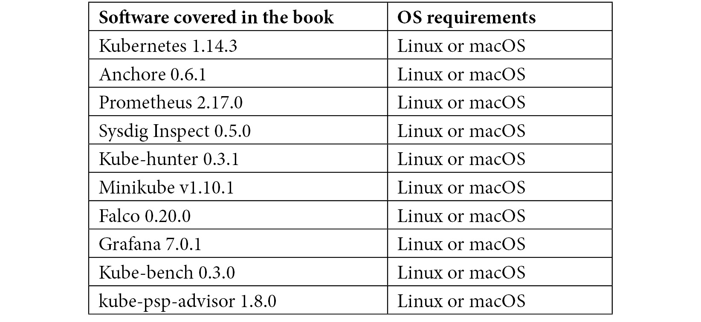

# 前言

现实世界应用程序的不断复杂性和可扩展性已经导致了从单体架构向微服务架构的过渡。Kubernetes 已成为部署微服务的事实编排平台。作为一个开发者友好的平台，Kubernetes 可以启用不同的配置以适应不同的用例，使其成为大多数 DevOps 工程师的首选。Kubernetes 的开放性和高度可配置的特性增加了其复杂性。增加的复杂性会导致配置错误和安全问题，如果被利用，可能会对组织造成重大经济影响。如果您计划在您的环境中使用 Kubernetes，那么这本书就是为您准备的。

在这本书中，您将学习如何保护您的 Kubernetes 集群。我们在前两章中简要介绍了 Kubernetes（我们希望您在开始之前已经对 Kubernetes 有基本的了解）。然后，我们讨论了不同 Kubernetes 组件和对象的默认配置。Kubernetes 中的默认配置通常是不安全的。我们讨论了不同的方法来正确配置您的集群，以确保其安全。我们深入探讨了 Kubernetes 提供的不同内置安全机制，如准入控制器、安全上下文和网络策略，以帮助保护您的集群。我们还讨论了一些开源工具，这些工具可以补充 Kubernetes 中现有的工具包，以提高您的集群的安全性。最后，我们将看一些 Kubernetes 集群中的真实攻击和漏洞的例子，并讨论如何加固您的集群以防止此类攻击。

通过这本书，我们希望您能够在您的 Kubernetes 集群中安全地部署复杂的应用程序。Kubernetes 正在快速发展。通过我们提供的示例，我们希望您能学会如何为您的环境合理配置。

# 这本书适合谁

这本书适用于已经开始将 Kubernetes 作为他们主要的部署/编排平台并且对 Kubernetes 有基本了解的 DevOps/DevSecOps 专业人士。这本书也适用于希望学习如何保护和加固 Kubernetes 集群的开发人员。

# 这本书涵盖了什么

*第一章*, *Kubernetes 架构*，介绍了 Kubernetes 组件和 Kubernetes 对象的基础知识。

【第二章】介绍了 Kubernetes 的网络模型，并深入探讨了微服务之间的通信。

【第三章】讨论了 Kubernetes 中的重要资产、威胁者以及如何为部署在 Kubernetes 中的应用程序进行威胁建模。

【第四章】讨论了 Kubernetes 中的安全控制机制，帮助在两个领域实施最小特权原则：Kubernetes 主体的最小特权和 Kubernetes 工作负载的最小特权。

【第五章】讨论了 Kubernetes 集群中的安全域和安全边界。还介绍了加强安全边界的安全控制机制。

【第六章】讨论了 Kubernetes 组件中的敏感配置，如`kube-apiserver`、`kubelet`等。介绍了使用`kube-bench`来帮助识别 Kubernetes 集群中的配置错误。

【第七章】讨论了 Kubernetes 中的认证和授权机制。还介绍了 Kubernetes 中流行的准入控制器。

【第八章】讨论了使用 CIS Docker 基准来加固图像。介绍了 Kubernetes 安全上下文、Pod 安全策略和`kube-psp-advisor`，它有助于生成 Pod 安全策略。

【第九章】介绍了 DevOps 流水线中的图像扫描的基本概念和容器图像以及漏洞。还介绍了图像扫描工具 Anchore Engine 以及如何将其集成到 DevOps 流水线中。

*第十章*, *Kubernetes 集群的实时监控和资源管理*，介绍了资源请求/限制和 LimitRanger 等内置机制。它还介绍了 Kubernetes 仪表板和指标服务器等内置工具，以及 Prometheus 和名为 Grafana 的第三方监控工具。

*第十一章*, *深度防御*，讨论了与深度防御相关的各种主题：Kubernetes 审计、Kubernetes 的高可用性、密钥管理、异常检测和取证。

*第十二章*, *分析和检测加密货币挖矿攻击*，介绍了加密货币和加密货币挖矿攻击的基本概念。然后讨论了使用 Prometheus 和 Falco 等开源工具检测加密货币挖矿攻击的几种方法。

*第十三章*, *从 Kubernetes CVE 中学习*，讨论了四个众所周知的 Kubernetes CVE 以及一些相应的缓解策略。它还介绍了开源工具`kube-hunter`，帮助识别 Kubernetes 中已知的漏洞。

# 要充分利用本书

在开始阅读本书之前，我们希望您对 Kubernetes 有基本的了解。在阅读本书时，我们希望您以安全的心态看待 Kubernetes。本书有很多关于加固和保护 Kubernetes 工作负载配置和组件的示例。除了尝试这些示例之外，您还应该思考这些示例如何映射到不同的用例。我们在本书中讨论了如何使用不同的开源工具。我们希望您花更多时间了解每个工具提供的功能。深入了解工具提供的不同功能将帮助您了解如何为不同的环境配置每个工具：

如果您使用本书的数字版本，我们建议您自己输入代码或通过 GitHub 存储库访问代码（链接在下一节中提供）。这样做将有助于避免与复制/粘贴代码相关的潜在错误。

# 请下载示例代码文件

您可以从[www.packt.com](http://www.packt.com)的帐户中下载本书的示例代码文件。如果您在其他地方购买了本书，可以访问[www.packtpub.com/support](http://www.packtpub.com/support)并注册，文件将直接发送到您的邮箱。

您可以按照以下步骤下载代码文件：

1.  在[www.packt.com](http://www.packt.com)上登录或注册。

1.  选择**支持**选项卡。

1.  点击**代码下载**。

1.  在**搜索**框中输入书名，然后按照屏幕上的说明操作。

下载文件后，请确保使用最新版本的解压软件解压文件夹：

+   WinRAR/7-Zip 适用于 Windows

+   Zipeg/iZip/UnRarX 适用于 Mac

+   7-Zip/PeaZip 适用于 Linux

本书的代码包也托管在 GitHub 上，网址为[`github.com/PacktPublishing/Learn-Kubernetes-Security`](https://github.com/PacktPublishing/Learn-Kubernetes-Security)。如果代码有更新，将在现有的 GitHub 存储库中进行更新。

我们还有其他代码包，来自我们丰富的图书和视频目录，可在[`github.com/PacktPublishing/`](https://github.com/PacktPublishing/)上找到。去看看吧！

# 代码实例

本书的代码实例视频可在[`bit.ly/2YZKCJX`](https://bit.ly/2YZKCJX)上观看。

# 下载彩色图片

我们还提供了一个 PDF 文件，其中包含本书中使用的屏幕截图/图表的彩色图片。您可以在这里下载：[`www.packtpub.com/sites/default/files/downloads/9781839216503_ColorImages.pdf`](http://www.packtpub.com/sites/default/files/downloads/9781839216503_ColorImages.pdf)。

# 使用的约定

本书中使用了许多文本约定。

`文本中的代码`：表示文本中的代码字词、数据库表名、文件夹名、文件名、文件扩展名、路径名、虚拟 URL、用户输入和 Twitter 用户名。例如："此属性也在`PodSecurityContext`中可用，它在 Pod 级别生效。"

代码块设置如下：

[PRE0]

当我们希望引起您对代码块的特定部分的注意时，相关行或项目将以粗体显示：

[PRE1]

任何命令行输入或输出都以以下方式编写：

[PRE2]

**粗体**：表示新术语、重要词汇或屏幕上看到的词语。例如，菜单或对话框中的词语在文本中显示为这样。例如："屏幕截图显示了由 Prometheus 和 Grafana 监控的**insecure-nginx** pod 的 CPU 使用情况。"

提示或重要说明

就像这样。
