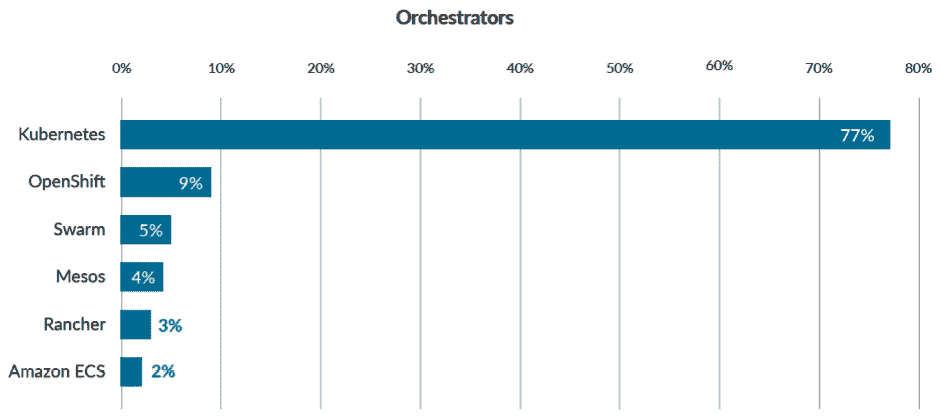
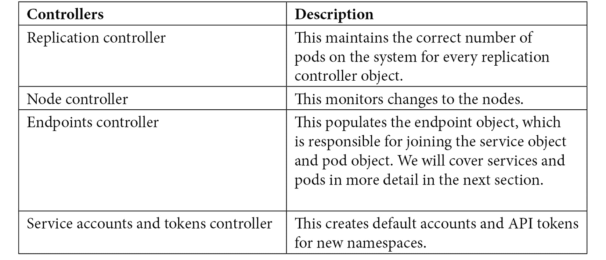

# 第一章：Kubernetes 架构

传统应用程序，如 Web 应用程序，通常遵循模块化架构，将代码分为应用层、业务逻辑、存储层和通信层。尽管采用了模块化架构，但组件被打包并部署为单体。单体应用虽然易于开发、测试和部署，但难以维护和扩展。这导致了微服务架构的增长。像 Docker 和 Linux 容器（LXC）这样的容器运行时的开发已经简化了应用程序作为微服务的部署和维护。

微服务架构将应用部署分为小型且相互连接的实体。微服务架构的日益流行导致了诸如 Apache Swarm、Mesos 和 Kubernetes 等编排平台的增长。容器编排平台有助于在大型和动态环境中管理容器。

Kubernetes 是一个开源的容器化应用编排平台，支持自动化部署、扩展和管理。它最初由 Google 在 2014 年开发，现在由云原生计算基金会（CNCF）维护。Kubernetes 是 2018 年首个毕业于 CNCF 的项目。成立的全球组织，如 Uber、Bloomberg、Blackrock、BlaBlaCar、纽约时报、Lyft、eBay、Buffer、Ancestry、GolfNow、高盛等，都在大规模生产中使用 Kubernetes。大型云服务提供商，如 Amazon 的弹性 Kubernetes 服务、微软的 Azure Kubernetes 服务、谷歌的谷歌 Kubernetes 引擎和阿里巴巴的阿里云 Kubernetes，都提供自己的托管 Kubernetes 服务。

在微服务模型中，应用程序开发人员确保应用程序在容器化环境中正常工作。他们编写 Docker 文件来打包他们的应用程序。DevOps 和基础设施工程师直接与 Kubernetes 集群进行交互。他们确保开发人员提供的应用程序包在集群中顺利运行。他们监视节点、Pod 和其他 Kubernetes 组件，以确保集群健康。然而，安全性需要双方和安全团队的共同努力。要了解如何保护 Kubernetes 集群，我们首先必须了解 Kubernetes 是什么以及它是如何工作的。

在本章中，我们将涵盖以下主题：

+   Docker 的崛起和微服务的趋势

+   Kubernetes 组件

+   Kubernetes 对象

+   Kubernetes 的变种

+   Kubernetes 和云服务提供商

# Docker 的崛起和微服务的趋势

在我们开始研究 Kubernetes 之前，了解微服务和容器化的增长是很重要的。随着单体应用程序的演变，开发人员面临着不可避免的问题：

+   **扩展**：单体应用程序很难扩展。已经证明解决可扩展性问题的正确方法是通过分布式方法。

+   **运营成本**：随着单体应用程序的复杂性增加，运营成本也会增加。更新和维护需要在部署之前进行仔细分析和足够的测试。这与可扩展性相反；你不能轻易地缩减单体应用程序，因为最低资源需求很高。

+   **发布周期更长**：对于单体应用程序，维护和开发的障碍非常高。对于开发人员来说，当出现错误时，在复杂且不断增长的代码库中识别根本原因需要很长时间。测试时间显著增加。回归、集成和单元测试在复杂的代码库中需要更长的时间才能通过。当客户的请求到来时，一个功能要发布需要几个月甚至一年的时间。这使得发布周期变长，并且对公司的业务产生重大影响。

这激励着将单片应用程序拆分为微服务。好处是显而易见的：

+   有了明确定义的接口，开发人员只需要关注他们拥有的服务的功能。

+   代码逻辑被简化了，这使得应用程序更容易维护和调试。此外，与单片应用程序相比，微服务的发布周期大大缩短，因此客户不必等待太长时间才能获得新功能。

当单片应用程序分解为许多微服务时，这增加了 DevOps 方面的部署和管理复杂性。这种复杂性是显而易见的；微服务通常使用不同的编程语言编写，需要不同的运行时或解释器，具有不同的软件包依赖关系、不同的配置等，更不用说微服务之间的相互依赖了。这正是 Docker 出现的合适时机。

让我们来看一下 Docker 的演变。进程隔离长期以来一直是 Linux 的一部分，以**控制组**（**cgroups**）和**命名空间**的形式存在。通过 cgroup 设置，每个进程都有限制的资源（CPU、内存等）可供使用。通过专用的进程命名空间，命名空间内的进程不会知道在同一节点但在不同进程命名空间中运行的其他进程。通过专用的网络命名空间，进程在没有适当的网络配置的情况下无法与其他进程通信，即使它们在同一节点上运行。

Docker 简化了基础设施和 DevOps 工程师的进程管理。2013 年，Docker 公司发布了 Docker 开源项目。DevOps 工程师不再需要管理命名空间和 cgroups，而是通过 Docker 引擎管理容器。Docker 容器利用 Linux 中的这些隔离机制来运行和管理微服务。每个容器都有专用的 cgroup 和命名空间。

相互依赖的复杂性仍然存在。编排平台是试图解决这个问题的平台。Docker 还提供了 Docker Swarm 模式（后来更名为 Docker 企业版，或 Docker EE）来支持集群容器，与 Kubernetes 大致同时期。

## Kubernetes 采用状态

根据 Sysdig 在 2019 年进行的容器使用报告（[`sysdig.com/blog/sysdig-2019-container-usage-report`](https://sysdig.com/blog/sysdig-2019-container-usage-report)），一家容器安全和编排供应商表示，Kubernetes 在使用的编排器中占据了惊人的 77%的份额。如果包括 OpenShift（来自 Red Hat 的 Kubernetes 变体），市场份额接近 90%：



图 1.1 –编排平台的市场份额

尽管 Docker Swarm 与 Kubernetes 同时发布，但 Kubernetes 现在已成为容器编排平台的事实选择。这是因为 Kubernetes 能够在生产环境中很好地工作。它易于使用，支持多种开发人员配置，并且可以处理高规模环境。

## Kubernetes 集群

Kubernetes 集群由多台机器（或**虚拟机**（**VMs**））或节点组成。有两种类型的节点：主节点和工作节点。主控制平面，如`kube-apiserver`，运行在主节点上。每个工作节点上运行的代理称为`kubelet`，代表`kube-apiserver`运行，并运行在工作节点上。Kubernetes 中的典型工作流程始于用户（例如，DevOps），与主节点中的`kube-apiserver`通信，`kube-apiserver`将部署工作委派给工作节点。在下一节中，我们将更详细地介绍`kube-apiserver`和`kubelet`：


图 1.2 – Kubernetes 部署

上图显示用户如何向主节点（`kube-apiserver`）发送部署请求，`kube-apiserver`将部署执行委派给一些工作节点中的`kubelet`。

# Kubernetes 组件

Kubernetes 遵循客户端-服务器架构。在 Kubernetes 中，多个主节点控制多个工作节点。每个主节点和工作节点都有一组组件，这些组件对于集群的正常工作是必需的。主节点通常具有`kube-apiserver`、`etcd`存储、`kube-controller-manager`、`cloud-controller-manager`和`kube-scheduler`。工作节点具有`kubelet`、`kube-proxy`、**容器运行时接口（CRI）**组件、**容器存储接口（CRI）**组件等。我们现在将详细介绍每一个：

+   `kube-apiserver`：Kubernetes API 服务器（`kube-apiserver`）是一个控制平面组件，用于验证和配置诸如 pod、服务和控制器等对象的数据。它使用 REST 请求与对象交互。

+   `etcd`：`etcd`是一个高可用的键值存储，用于存储配置、状态和元数据等数据。`etcd`的 watch 功能使 Kubernetes 能够监听配置的更新并相应地进行更改。

+   `kube-scheduler`：`kube-scheduler`是 Kubernetes 的默认调度程序。它监视新创建的 pod 并将 pod 分配给节点。调度程序首先过滤可以运行 pod 的一组节点。过滤包括根据用户设置的可用资源和策略创建可能节点的列表。一旦创建了这个列表，调度程序就会对节点进行排名，找到最适合 pod 的节点。

+   `kube-controller-manager`：Kubernetes 控制器管理器是一组核心控制器，它们监视状态更新并相应地对集群进行更改。目前随 Kubernetes 一起提供的控制器包括以下内容：



+   `cloud-controller-manager`：云容器管理器是在 v1.6 中引入的，它运行控制器与底层云提供商进行交互。这是为了将云供应商的代码与 Kubernetes 的代码解耦。

+   `kubelet`：`kubelet`在每个节点上运行。它向 API 服务器注册节点。`kubelet`监视使用 Podspecs 创建的 pod，并确保 pod 和容器健康。

+   `kube-proxy`：`kube-proxy`是在每个节点上运行的网络代理。它管理每个节点上的网络规则，并根据这些规则转发或过滤流量。

+   `kube-dns`：DNS 是在集群启动时启动的内置服务。从 v1.12 开始，CoreDNS 成为推荐的 DNS 服务器，取代了`kube-dns`。CoreDNS 使用单个容器（而不是`kube-dns`使用的三个容器）。它使用多线程缓存，并具有内置的负缓存，因此在内存和性能方面优于`kube-dns`。

在本节中，我们看了 Kubernetes 的核心组件。这些组件将存在于所有的 Kubernetes 集群中。Kubernetes 还有一些可配置的接口，允许对集群进行修改以适应组织的需求。

## Kubernetes 接口

Kubernetes 旨在灵活和模块化，因此集群管理员可以修改网络、存储和容器运行时能力，以满足组织的需求。目前，Kubernetes 提供了三种不同的接口，集群管理员可以使用这些接口来使用集群中的不同功能。

### 容器网络接口

Kubernetes 有一个默认的网络提供程序 `kubenet`，其功能有限。`kubenet` 只支持每个集群 50 个节点，显然无法满足大规模部署的任何要求。同时，Kubernetes 利用**容器网络接口**（**CNI**）作为网络提供程序和 Kubernetes 网络组件之间的通用接口，以支持大规模集群中的网络通信。目前支持的提供程序包括 Calico、Flannel、`kube-router` 等。

### 容器存储接口

Kubernetes 在 v1.13 中引入了容器存储接口。在 1.13 之前，新的卷插件是核心 Kubernetes 代码的一部分。容器存储接口提供了一个接口，用于向 Kubernetes 公开任意块和文件存储。云提供商可以使用 CSI 插件向 Kubernetes 公开高级文件系统。MapR 和 Snapshot 等插件在集群管理员中很受欢迎。

### 容器运行时接口

在 Kubernetes 的最低级别，容器运行时确保容器启动、工作和停止。最流行的容器运行时是 Docker。容器运行时接口使集群管理员能够使用其他容器运行时，如 `frakti`、`rktlet` 和 `cri-o`。

# Kubernetes 对象

系统的存储和计算资源被分类为反映集群当前状态的不同对象。对象使用 `.yaml` 规范进行定义，并使用 Kubernetes API 来创建和管理这些对象。我们将详细介绍一些常见的 Kubernetes 对象。

## Pods

Pod 是 Kubernetes 集群的基本构建块。它是一个或多个容器的组，这些容器预期在单个主机上共存。Pod 中的容器可以使用本地主机或**进程间通信**（**IPC**）相互引用。

## 部署

Kubernetes 部署可以根据标签和选择器来扩展或缩减 pod。部署的 YAML 规范包括 `replicas`，即所需的 pod 实例数量，以及 `template`，与 pod 规范相同。

## 服务

Kubernetes 服务是应用程序的抽象。服务为 pod 提供网络访问。服务和部署共同工作，以便简化不同应用程序的不同 pod 之间的管理和通信。

## 副本集

副本集确保系统中始终运行指定数量的 pod。最好使用部署而不是副本集。部署封装了副本集和 pod。此外，部署提供了进行滚动更新的能力。

## 卷

容器存储是暂时的。如果容器崩溃或重新启动，它会从启动时的原始状态开始。Kubernetes 卷有助于解决这个问题。容器可以使用卷来存储状态。Kubernetes 卷的生命周期与 pod 相同；一旦 pod 消失，卷也会被清理掉。一些支持的卷包括`awsElasticBlockStore`、`azureDisk`、`flocker`、`nfs`和`gitRepo`。

## 命名空间

命名空间帮助将物理集群划分为多个虚拟集群。多个对象可以在不同的命名空间中进行隔离。默认的 Kubernetes 附带三个命名空间：`default`、`kube-system`和`kube-public`。

## 服务账户

需要与`kube-apiserver`交互的 pod 使用服务账户来标识自己。默认情况下，Kubernetes 配置了一系列默认服务账户：`kube-proxy`、`kube-dns`、`node-controller`等。可以创建额外的服务账户来强制执行自定义访问控制。

## 网络策略

网络策略定义了一组规则，规定了一组 pod 如何允许与彼此和其他网络端点进行通信。所有传入和传出的网络连接都受网络策略的控制。默认情况下，一个 pod 可以与所有 pod 进行通信。

## Pod 安全策略

Pod 安全策略是一个集群级资源，定义了必须满足的一组条件，才能在系统上运行 pod。Pod 安全策略定义了 pod 的安全敏感配置。这些策略必须对请求用户或目标 pod 的服务账户可访问才能生效。

# Kubernetes 变体

在 Kubernetes 生态系统中，Kubernetes 是各种变体中的旗舰。然而，还有一些其他起着非常重要作用的船只。接下来，我们将介绍一些类似 Kubernetes 的平台，在生态系统中发挥不同的作用。

## Minikube

Minikube 是 Kubernetes 的单节点集群版本，可以在 Linux、macOS 和 Windows 平台上运行。Minikube 支持标准的 Kubernetes 功能，如`LoadBalancer`、服务、`PersistentVolume`、`Ingress`、容器运行时，以及开发人员友好的功能，如附加组件和 GPU 支持。

Minikube 是一个很好的起点，可以让您亲身体验 Kubernetes。它也是一个很好的地方来在本地运行测试，特别是集群依赖或工作在概念验证上。

## K3s

K3s 是一个轻量级的 Kubernetes 平台。其总大小不到 40MB。它非常适合边缘计算，物联网（IoT）和 ARM，先前是高级 RISC 机器，最初是 Acorn RISC Machine 的一系列用于各种环境的精简指令集计算（RISC）架构的计算机处理器。它应该完全符合 Kubernetes。与 Kubernetes 的一个重要区别是，它使用`sqlite`作为默认存储机制，而 Kubernetes 使用`etcd`作为其默认存储服务器。

## OpenShift

OpenShift 3 版本采用了 Docker 作为其容器技术，Kubernetes 作为其容器编排技术。在第 4 版中，OpenShift 切换到 CRI-O 作为默认的容器运行时。看起来 OpenShift 应该与 Kubernetes 相同；然而，它们之间有相当多的区别。

### OpenShift 与 Kubernetes

Linux 和 Red Hat Linux 之间的联系可能首先看起来与 OpenShift 和 Kubernetes 之间的联系相同。现在，让我们来看一下它们的一些主要区别。

#### 命名

在 Kubernetes 中命名的对象在 OpenShift 中可能有不同的名称，尽管有时它们的功能是相似的。例如，在 Kubernetes 中，命名空间称为 OpenShift 中的项目，并且项目创建附带默认对象。在 Kubernetes 中，Ingress 称为 OpenShift 中的路由。路由实际上比 Ingress 对象更早引入。在 OpenShift 下，路由由 HAProxy 实现，而在 Kubernetes 中有许多 Ingress 控制器选项。在 Kubernetes 中，部署称为`deploymentConfig`。然而，在底层实现上有很大的不同。

#### 安全性

Kubernetes 默认是开放的，安全性较低。OpenShift 相对封闭，并提供了一些良好的安全机制来保护集群。例如，在创建 OpenShift 集群时，DevOps 可以启用内部镜像注册表，该注册表不会暴露给外部。同时，内部镜像注册表充当受信任的注册表，图像将从中拉取和部署。OpenShift 项目在某些方面比`kubernetes`命名空间做得更好——在 OpenShift 中创建项目时，可以修改项目模板并向项目添加额外的对象，例如`NetworkPolicy`和符合公司政策的默认配额。这也有助于默认加固。

#### 成本

OpenShift 是 Red Hat 提供的产品，尽管有一个名为 OpenShift Origin 的社区版本项目。当人们谈论 OpenShift 时，他们通常指的是得到 Red Hat 支持的付费 OpenShift 产品。Kubernetes 是一个完全免费的开源项目。

# Kubernetes 和云提供商

很多人相信 Kubernetes 是基础设施的未来，也有一些人相信一切都会最终转移到云上。然而，这并不意味着你必须在云上运行 Kubernetes，但它确实在云上运行得非常好。

## Kubernetes 作为服务

容器化使应用程序更具可移植性，因此不太可能与特定的云提供商绑定。尽管有一些出色的开源工具，如`kubeadm`和`kops`，可以帮助 DevOps 创建 Kubernetes 集群，但云提供商提供的 Kubernetes 作为服务仍然很有吸引力。作为 Kubernetes 的原始创建者，Google 自 2014 年起就提供了 Kubernetes 作为服务。它被称为**Google Kubernetes Engine**（**GKE**）。2017 年，微软推出了自己的 Kubernetes 服务，称为**Azure Kubernetes Service**（**AKS**）。AWS 在 2018 年推出了**Elastic Kubernetes Service**（**EKS**）。

Kubedex（[`kubedex.com/google-gke-vs-microsoft-aks-vs-amazon-eks/`](https://kubedex.com/google-gke-vs-microsoft-aks-vs-amazon-eks/)）对云 Kubernetes 服务进行了很好的比较。以下表格列出了这三者之间的一些差异：


前面列表中值得强调的一些亮点如下：

+   **可扩展性**：GKE 支持每个集群最多 5000 个节点，而 AKS 和 EKS 只支持少量节点或更少。

+   **高级安全选项**：GKE 支持 Istio 服务网格、Sandbox、二进制授权和入口管理的**安全套接字层**（**SSL**），而 AKS 和 EKS 则不支持。

如果计划在由云提供商提供的 Kubernetes 集群中部署和管理微服务，您需要考虑云提供商提供的可扩展性能力以及安全选项。如果您使用由云提供商管理的集群，则存在一些限制：

+   云提供商默认情况下会执行一些集群配置和加固，并且可能无法更改。

+   您失去了管理 Kubernetes 集群的灵活性。例如，如果您想要启用 Kubernetes 的审计策略并将审计日志导出到`splunk`，您可能需要对`kube-apiserver`清单进行一些配置更改。

+   对运行`kube-apiserver`的主节点的访问受到限制。如果您专注于部署和管理微服务，这种限制完全是有意义的。在某些情况下，您需要启用一些准入控制器，然后还需要对`kube-apiserver`清单进行更改。这些操作需要访问主节点。

如果您想要访问集群节点的 Kubernetes 集群，可以使用一个开源工具——`kops`。

## Kops

**Kubernetes 操作**（**kops**）有助于通过命令行创建、销毁、升级和维护高可用的生产级 Kubernetes 集群。它正式支持 AWS，并在 beta 版本中支持 GCE 和 OpenStack。与在云 Kubernetes 服务上提供 Kubernetes 集群的主要区别在于，提供是从 VM 层开始的。这意味着使用`kops`可以控制您想要使用的操作系统映像，并设置自己的管理员 SSH 密钥以访问主节点和工作节点。在 AWS 中创建 Kubernetes 集群的示例如下：

```
  # Create a cluster in AWS that has HA masters. This cluster
  # will be setup with an internal networking in a private VPC.
  # A bastion instance will be setup to provide instance access.
  export NODE_SIZE=${NODE_SIZE:-m4.large}
  export MASTER_SIZE=${MASTER_SIZE:-m4.large}
  export ZONES=${ZONES:-'us-east-1d,us-east-1b,us-east-1c'}
  export KOPS_STATE_STORE='s3://my-state-store'
  kops create cluster k8s-clusters.example.com \
  --node-count 3 \
  --zones $ZONES \
  --node-size $NODE_SIZE \
  --master-size $MASTER_SIZE \
  --master-zones $ZONES \
  --networking weave \
  --topology private \
  --bastion='true' \
  --yes
```

通过前面的`kops`命令，创建了一个包含三个工作节点的 Kubernetes 集群。用户可以选择主节点和 CNI 插件的大小。

## 为什么要担心 Kubernetes 的安全性？

Kubernetes 在 2018 年正式推出，并且仍在快速发展。还有一些功能仍在开发中，尚未达到 GA 状态（alpha 或 beta）。这表明 Kubernetes 本身远未成熟，至少从安全的角度来看。但这并不是我们需要关注 Kubernetes 安全性的主要原因。

Bruce Schneier 在 1999 年的一篇名为《简化的请求》的文章中最好地总结了这一点，他说“*复杂性是安全的最大敌人*”，准确预测了我们今天遇到的网络安全问题。为了满足稳定性、可扩展性、灵活性和安全性的所有主要编排需求，Kubernetes 被设计成复杂但紧密的方式。这种复杂性无疑带来了一些安全问题。

可配置性是 Kubernetes 平台对开发人员的主要优势之一。开发人员和云提供商可以自由配置他们的集群以满足他们的需求。Kubernetes 的这一特性是企业日益增加的安全担忧的主要原因之一。Kubernetes 代码的不断增长和 Kubernetes 集群的组件使得 DevOps 难以理解正确的配置。默认配置通常不安全（开放性确实为 DevOps 尝试新功能带来了优势）。

随着 Kubernetes 的使用增加，它因各种安全漏洞和缺陷而成为新闻头条：

+   Palo Alto Networks 的研究人员发现了 40,000 个 Docker 和 Kubernetes 容器暴露在互联网上。这是由于配置错误导致的结果。

+   攻击者利用了特斯拉的未加密管理控制台来运行加密挖矿设备。

+   在 Kubernetes 版本中发现了特权升级漏洞，允许经过精心设计的请求通过 API 服务器与后端建立连接并发送任意请求。

+   在生产环境中使用 Kubernetes 元数据测试版功能导致了对流行的电子商务平台 Shopify 的**服务器端请求伪造**（**SSRF**）攻击。这个漏洞暴露了 Kubernetes 元数据，揭示了 Google 服务帐户令牌和`kube-env`详细信息，使攻击者能够 compromise 集群。

The New Stack 最近的一项调查（[`thenewstack.io/top-challenges-kubernetes-users-face-deployment/`](https://thenewstack.io/top-challenges-kubernetes-users-face-deployment/)）显示，安全是运行 Kubernetes 的企业的主要关注点：


图 1.3 - Kubernetes 用户的主要关注点

Kubernetes 默认情况下不安全。我们将在后面的章节中详细解释这一点。安全成为用户的主要关注点之一是完全有道理的。这是一个需要妥善解决的问题，就像其他基础设施或平台一样。

# 摘要

微服务的趋势和 Docker 的兴起使得 Kubernetes 成为 DevOps 部署、扩展和管理容器化应用程序的事实标准平台。Kubernetes 将存储和计算资源抽象为 Kubernetes 对象，由`kube-apiserver`、`kubelet`、`etcd`等组件管理。

Kubernetes 可以在私有数据中心或云上或混合环境中创建。这使得 DevOps 可以与多个云提供商合作，而不会被锁定在任何一个云提供商上。尽管 Kubernetes 在 2018 年已经成熟，但它仍然年轻，并且发展非常迅速。随着 Kubernetes 受到越来越多的关注，针对 Kubernetes 的攻击也变得更加显著。

在下一章中，我们将介绍 Kubernetes 网络模型，并了解微服务在 Kubernetes 中如何相互通信。

# 问题

1.  单体架构的主要问题是什么？

1.  Kubernetes 的主要组件是什么？

1.  部署是什么？

1.  Kubernetes 的一些变体是什么？

1.  我们为什么关心 Kubernetes 的安全性？

# 进一步阅读

以下链接包含有关 Kubernetes、`kops`和 OpenShift 平台的更详细信息。在开始构建 Kubernetes 集群时，您会发现它们很有用：

+   [`kubernetes.io/docs/concepts/`](https://kubernetes.io/docs/concepts/)

+   [`kubernetes.io/docs/tutorials/`](https://kubernetes.io/docs/tutorials/)

+   [`github.com/kubernetes/kops`](https://github.com/kubernetes/kops)

+   [`docs.openshift.com/container-platform/4.2`](https://docs.openshift.com/container-platform/4.2)

+   [`cloud.google.com/kubernetes-engine/docs/concepts/kubernetes-engine-overview`](https://cloud.google.com/kubernetes-engine/docs/concepts/kubernetes-engine-overview)
