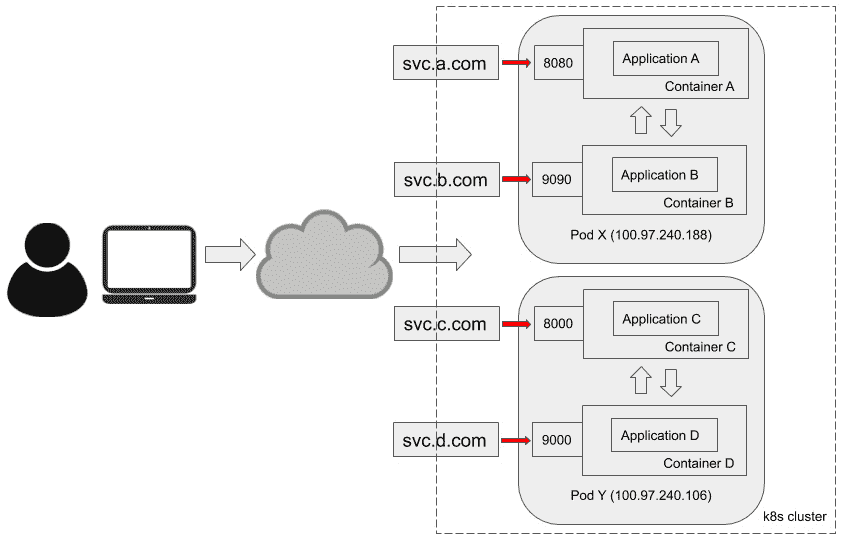
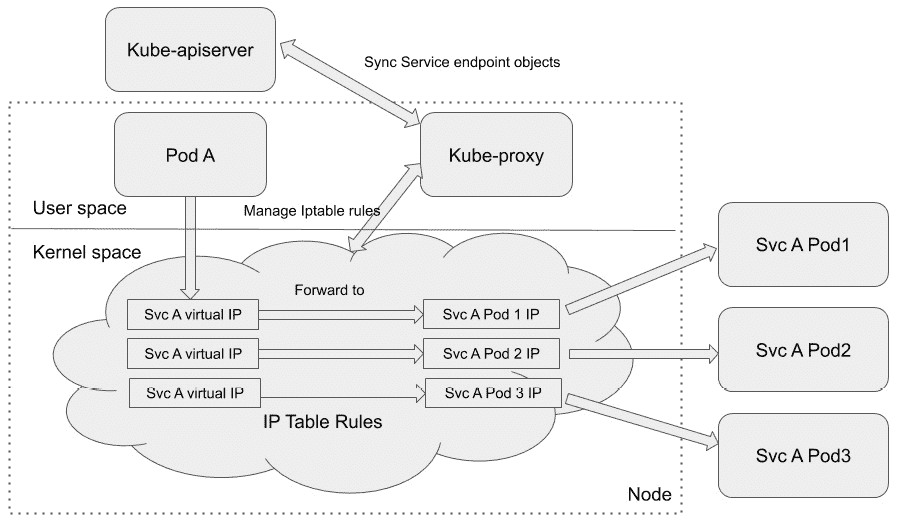
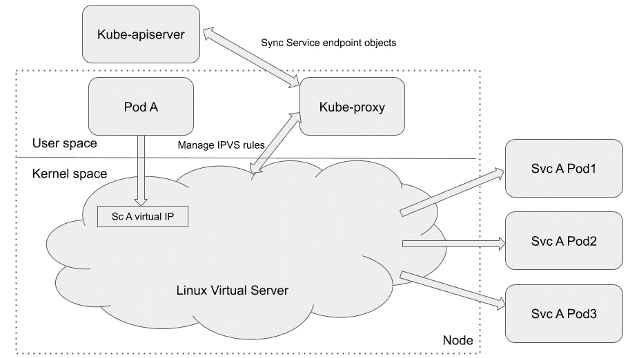
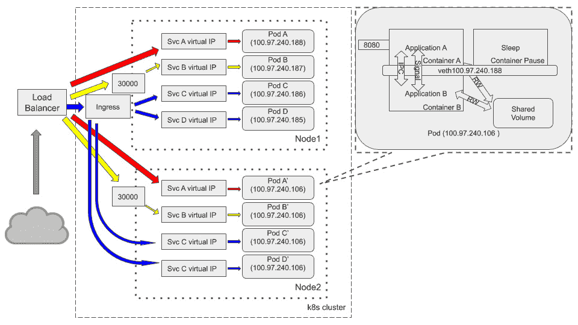

# 第二章：Kubernetes 网络

当成千上万的微服务在 Kubernetes 集群中运行时，您可能会好奇这些微服务如何相互通信以及与互联网通信。在本章中，我们将揭示 Kubernetes 集群中所有通信路径。我们希望您不仅了解通信是如何发生的，还要以安全意识查看技术细节：常规通信渠道总是可以作为 kill 链的一部分被滥用。

在本章中，我们将涵盖以下主题：

+   Kubernetes 网络模型概述

+   在 pod 内部通信

+   在 pod 之间通信

+   引入 Kubernetes 服务

+   引入 CNI 和 CNI 插件

# Kubernetes 网络模型概述

在 Kubernetes 集群上运行的应用程序应该可以从集群内部或外部访问。从网络的角度来看，这意味着应用程序可能与**统一资源标识符**（**URI**）或**互联网协议**（**IP**）地址相关联。多个应用程序可以在同一 Kubernetes 工作节点上运行，但它们如何在不与彼此冲突的情况下暴露自己呢？让我们一起来看看这个问题，然后深入了解 Kubernetes 网络模型。

## 端口共享问题

传统上，如果在同一台机器上运行两个不同的应用程序，其中机器 IP 是公共的，并且这两个应用程序是公开访问的，那么这两个应用程序不能在机器上监听相同的端口。如果它们都尝试在同一台机器的相同端口上监听，由于端口被使用，一个应用程序将无法启动。下图提供了这个问题的简单说明：

图 2.1 - 节点上的端口共享冲突（应用程序）

为了解决端口共享冲突问题，这两个应用程序需要使用不同的端口。显然，这里的限制是这两个应用程序必须共享相同的 IP 地址。如果它们有自己的 IP 地址，但仍然位于同一台机器上会怎样？这就是纯 Docker 的方法。如果应用程序不需要外部暴露自己，这将有所帮助，如下图所示：

图 2.2 - 节点上的端口共享冲突（容器）

在上图中，两个应用程序都有自己的 IP 地址，因此它们都可以监听端口 80。它们可以相互通信，因为它们位于同一个子网中（例如，一个 Docker 桥接）。然而，如果两个应用程序都需要通过将容器端口绑定到主机端口来在外部公开自己，它们就不能绑定在相同的端口 80 上。至少一个端口绑定将失败。如上图所示，容器 B 无法绑定到主机端口 80，因为主机端口 80 被容器 A 占用。端口共享冲突问题仍然存在。

动态端口配置给系统带来了很多复杂性，涉及端口分配和应用程序发现；然而，Kubernetes 并不采取这种方法。让我们讨论一下 Kubernetes 解决这个问题的方法。

## Kubernetes 网络模型

在 Kubernetes 集群中，每个 Pod 都有自己的 IP 地址。这意味着应用程序可以在 Pod 级别相互通信。这种设计的美妙之处在于，它提供了一个清晰、向后兼容的模型，其中 Pod 在端口分配、命名、服务发现、负载平衡、应用程序配置和迁移方面的表现就像虚拟机（VM）或物理主机一样。同一 Pod 内的容器共享相同的 IP 地址。很少有类似的应用程序会在同一 Pod 内使用相同的默认端口（如 Apache 和 nginx）。实际上，捆绑在同一容器内的应用程序通常具有依赖性或提供不同的目的，这取决于应用程序开发人员将它们捆绑在一起。一个简单的例子是，在同一个 Pod 中，有一个超文本传输协议（HTTP）服务器或一个 nginx 容器来提供静态文件，以及一个用于提供动态内容的主 Web 应用程序。

Kubernetes 利用 CNI 插件来实现 IP 地址分配、管理和 Pod 通信。然而，所有插件都需要遵循以下两个基本要求：

1.  节点上的 Pod 可以与所有节点上的所有 Pod 进行通信，而无需使用网络地址转换（NAT）。

1.  诸如`kubelet`之类的代理可以与同一节点上的 Pod 进行通信。

这两个先前的要求强制了在虚拟机内迁移应用程序到 Pod 的简单性。

分配给每个 pod 的 IP 地址是一个私有 IP 地址或集群 IP 地址，不对公众开放。那么，一个应用程序如何在不与集群中的其他应用程序发生冲突的情况下变得对公众可访问呢？Kubernetes 服务就是将内部应用程序暴露给公众的方式。我们将在后面的章节中更深入地探讨 Kubernetes 服务的概念。现在，用下面的图表总结本章内容将会很有用：

图 2.3 - 服务暴露给互联网

在上一个图表中，有一个**k8s 集群**，其中有四个应用程序在两个 pod 中运行：**应用程序 A**和**应用程序 B**在**Pod X**中运行，并共享相同的 pod IP 地址—**100.97.240.188**—它们分别在端口**8080**和**9090**上监听。同样，**应用程序 C**和**应用程序 D**在**Pod Y**中运行，并分别在端口**8000**和**9000**上监听。所有这四个应用程序都可以通过以下面向公众的 Kubernetes 服务进行访问：**svc.a.com**，**svc.b.com**，**svc.c.com**和**svc.d.com**。这个图表中的 pod（X 和 Y）可以部署在一个单独的工作节点上，也可以在 1000 个节点上复制。然而，从用户或服务的角度来看，这并没有什么区别。尽管图表中的部署方式相当不寻常，但仍然需要在同一个 pod 内部部署多个容器。现在是时候来看看同一个 pod 内部容器之间的通信了。

# 在 pod 内部通信

同一个 pod 内的容器共享相同的 pod IP 地址。通常，将容器映像捆绑在一起并解决可能的资源使用冲突（如端口监听）是应用程序开发人员的责任。在本节中，我们将深入探讨容器内部通信的技术细节，并强调超出网络层面的通信。

## Linux 命名空间和暂停容器

Linux 命名空间是 Linux 内核的一个特性，用于分区资源以进行隔离。使用分配的命名空间，一组进程看到一组资源，而另一组进程看到另一组资源。命名空间是现代容器技术的一个重要基本方面。读者理解这个概念对于深入了解 Kubernetes 很重要。因此，我们列出了所有的 Linux 命名空间并进行了解释。自 Linux 内核版本 4.7 以来，有七种类型的命名空间，如下所示：

+   **cgroup**：隔离 cgroup 和根目录。cgroup 命名空间虚拟化了进程 cgroup 的视图。每个 cgroup 命名空间都有自己的 cgroup 根目录集。

+   **IPC**：隔离 System V 进程间通信（IPC）对象或 POSIX 消息队列。

+   **网络**：隔离网络设备、协议栈、端口、IP 路由表、防火墙规则等。

+   **挂载**：隔离挂载点。因此，每个挂载命名空间实例中的进程将看到不同的单目录层次结构。

+   **PID**：隔离进程 ID（PIDs）。不同 PID 命名空间中的进程可以具有相同的 PID。

+   **用户**：隔离用户 ID 和组 ID、根目录、密钥和功能。在用户命名空间内外，进程可以具有不同的用户和组 ID。

+   Unix 时间共享（UTS）：隔离两个系统标识符：主机名和网络信息服务（NIS）域名。

尽管每个命名空间都很强大，并且在不同资源上提供隔离目的，但并非所有命名空间都适用于同一 Pod 内的容器。同一 Pod 内的容器至少共享相同的 IPC 命名空间和网络命名空间；因此，K8s 需要解决端口使用可能的冲突。将创建一个回环接口，以及分配给 Pod 的 IP 地址的虚拟网络接口。更详细的图表将如下所示：

图 2.4 - Pod 内的容器

在这个图表中，有一个**Pause**容器与容器**A**和**B**一起运行在同一个 pod 中。如果您通过**Secure Shell**（**SSH**）进入 Kubernetes 集群节点并在节点内运行`docker ps`命令，您将看到至少一个使用`pause`命令启动的容器。`pause`命令会暂停当前进程，直到接收到信号。基本上，这些容器什么也不做，只是休眠。尽管没有活动，**Pause**容器在 pod 中扮演着关键的角色。它作为一个占位符，为同一个 pod 中的所有其他容器持有网络命名空间。与此同时，**Pause**容器获取了一个 IP 地址，用于所有其他容器之间以及与外部世界通信的虚拟网络接口。

## 超越网络通信

我们决定在同一个 pod 中的容器之间稍微超越网络通信。这样做的原因是通信路径有时可能成为杀伤链的一部分。因此，了解实体之间可能的通信方式非常重要。您将在*第三章*中看到更多相关内容，*威胁建模*。

在一个 pod 内，所有容器共享相同的 IPC 命名空间，以便容器可以通过 IPC 对象或 POSIX 消息队列进行通信。除了 IPC 通道，同一个 pod 内的容器还可以通过共享挂载卷进行通信。挂载的卷可以是临时内存、主机文件系统或云存储。如果卷被 Pod 中的容器挂载，那么容器可以读写卷中的相同文件。最后但并非最不重要的是，在 1.12 Kubernetes 版本的 beta 版中，`shareProcessNamespace`功能最终在 1.17 版本中稳定。用户可以简单地在 Podspec 中设置`shareProcessNamespace`选项，以允许 pod 内的容器共享一个公共 PID 命名空间。其结果是**Container A**中的**Application A**现在能够看到**Container B**中的**Application B**。由于它们都在相同的 PID 命名空间中，它们可以使用诸如 SIGTERM、SIGKILL 等信号进行通信。这种通信可以在以下图表中看到：

图 2.5 - pod 内部容器之间可能的通信

As the previous diagram shows, containers inside the same pod can communicate to each other via a network, an IPC channel, a shared volume, and through signals.

# Communicating between pods

Kubernetes pods are dynamic beings and ephemeral. When a set of pods is created from a deployment or a DaemonSet, each pod gets its own IP address; however, when patching happens or a pod dies and restarts, pods may have a new IP address assigned. This leads to two fundamental communication problems, given a set of pods (frontend) needs to communicate to another set of pods (backend), detailed as follows:

+   Given that the IP addresses may change, what are the valid IP addresses of the target pods?

+   Knowing the valid IP addresses, which pod should we communicate to?

Now, let's jump into the Kubernetes service as it is the solution for these two problems.

## The Kubernetes service

The Kubernetes service is an abstraction of a grouping of sets of pods with a definition of how to access the pods. The set of pods targeted by a service is usually determined by a selector based on pod labels. The Kubernetes service also gets an IP address assigned, but it is virtual. The reason to call it a virtual IP address is that, from a node's perspective, there is neither a namespace nor a network interface bound to a service as there is with a pod. Also, unlike pods, the service is more stable, and its IP address is less likely to be changed frequently. Sounds like we should be able to solve the two problems mentioned earlier. First, define a service for the target sets of pods with a proper selector configured; secondly, let some magic associated with the service decide which target pod is to receive the request. So, when we look at pod-to-pod communication again, we're in fact talking about pod-to-service (then to-pod) communication.

So, what's the magic behind the service? Now, we'll introduce the great network magician: the `kube-proxy` component.

## kube-proxy

你可以根据`kube-proxy`的名称猜到它的作用。一般来说，代理（不是反向代理）的作用是在客户端和服务器之间通过两个连接传递流量：从客户端到服务器的入站连接和从服务器到客户端的出站连接。因此，`kube-proxy`为了解决前面提到的两个问题，会将所有目标服务（虚拟 IP）的流量转发到由服务分组的 pod（实际 IP）；同时，`kube-proxy`会监视 Kubernetes 控制平面，以便添加或删除服务和端点对象（pod）。为了很好地完成这个简单的任务，`kube-proxy`已经发展了几次。

### 用户空间代理模式

用户空间代理模式中的`kube-proxy`组件就像一个真正的代理。首先，`kube-proxy`将在节点上的一个随机端口上作为特定服务的代理端口进行监听。任何对代理端口的入站连接都将被转发到服务的后端 pod。当`kube-proxy`需要决定将请求发送到哪个后端 pod 时，它会考虑服务的`SessionAffinity`设置。其次，`kube-proxy`将安装**iptables 规则**，将任何目标服务（虚拟 IP）的流量转发到代理端口，代理端口再将流量转发到后端端口。来自 Kubernetes 文档的以下图表很好地说明了这一点：

图 2.6 - kube-proxy 用户空间代理模式

默认情况下，用户空间模式中的`kube-proxy`使用循环算法来选择要将请求转发到的后端 pod。这种模式的缺点是显而易见的。流量转发是在用户空间中完成的。这意味着数据包被编组到用户空间，然后在代理的每次传输中被编组回内核空间。从性能的角度来看，这种解决方案并不理想。

### iptables 代理模式

iptables 代理模式中的`kube-proxy`组件将转发流量的工作交给了`netfilter`，使用 iptables 规则。在 iptables 代理模式中的`kube-proxy`只负责维护和更新 iptables 规则。任何针对服务 IP 的流量都将根据`kube-proxy`管理的 iptables 规则由`netfilter`转发到后端 pod。来自 Kubernetes 文档的以下图表说明了这一点：

图 2.7 - kube-proxy iptables 代理模式

与用户空间代理模式相比，iptables 模式的优势是显而易见的。流量不再经过内核空间到用户空间，然后再返回内核空间。相反，它将直接在内核空间中转发。开销大大降低。这种模式的缺点是需要错误处理。例如，如果`kube-proxy`在 iptables 代理模式下运行，如果第一个选择的 pod 没有响应，连接将失败。然而，在用户空间模式下，`kube-proxy`会检测到与第一个 pod 的连接失败，然后自动重试与不同的后端 pod。

### IPVS 代理模式

**IP Virtual Server**（**IPVS**）代理模式中的`kube-proxy`组件管理和利用 IPVS 规则，将目标服务流量转发到后端 pod。就像 iptables 规则一样，IPVS 规则也在内核中工作。IPVS 建立在`netfilter`之上。它作为 Linux 内核的一部分实现传输层负载均衡，纳入**Linux Virtual Server**（**LVS**）中。LVS 在主机上运行，并充当一组真实服务器前面的负载均衡器，任何传输控制协议（TCP）或用户数据报协议（UDP）流量都将被转发到真实服务器。这使得真实服务器的 IPVS 服务看起来像单个 IP 地址上的虚拟服务。IPVS 与 Kubernetes 服务完美匹配。以下来自 Kubernetes 文档的图表说明了这一点：

图 2.8 - kube-proxy IPVS 代理模式

与 iptables 代理模式相比，IPVS 规则和 iptables 规则都在内核空间中工作。然而，iptables 规则会对每个传入的数据包进行顺序评估。规则越多，处理时间越长。IPVS 的实现与 iptables 不同：它使用由内核管理的哈希表来存储数据包的目的地，因此具有比 iptables 规则更低的延迟和更快的规则同步。IPVS 模式还提供了更多的负载均衡选项。使用 IPVS 模式的唯一限制是必须在节点上有可供`kube-proxy`使用的 IPVS Linux。

# 介绍 Kubernetes 服务

Kubernetes 部署动态创建和销毁 pod。对于一般的三层 Web 架构，如果前端和后端是不同的 pod，这可能是一个问题。前端 pod 不知道如何连接到后端。Kubernetes 中的网络服务抽象解决了这个问题。

Kubernetes 服务使一组逻辑 pod 能够进行网络访问。通常使用标签来定义一组逻辑 pod。当对服务发出网络请求时，它会选择所有具有特定标签的 pod，并将网络请求转发到所选 pod 中的一个。

使用**YAML Ain't Markup Language** (**YAML**)文件定义了 Kubernetes 服务，如下所示：

[PRE0]

在这个 YAML 文件中，以下内容适用：

1.  `type`属性定义了服务如何向网络公开。

1.  `selector`属性定义了 Pod 的标签。

1.  `port`属性用于定义在集群内部公开的端口。

1.  `targetPort`属性定义了容器正在侦听的端口。

服务通常使用选择器来定义，选择器是附加到需要在同一服务中的 pod 的标签。服务可以在没有选择器的情况下定义。这通常是为了访问外部服务或不同命名空间中的服务。没有选择器的服务将使用端点对象映射到网络地址和端口，如下所示：

[PRE1]

此端点对象将路由流量`192:123.1.22:3909`到附加的服务。

## 服务发现

要找到 Kubernetes 服务，开发人员可以使用环境变量或**Domain Name System** (**DNS**)，详细如下：

1.  **环境变量**：创建服务时，在节点上创建了一组环境变量，形式为`[NAME]_SERVICE_HOST`和`[NAME]_SERVICE_PORT`。其他 pod 或应用程序可以使用这些环境变量来访问服务，如下面的代码片段所示：

[PRE2]

1.  **DNS**：DNS 服务作为附加组件添加到 Kubernetes 中。Kubernetes 支持两个附加组件：CoreDNS 和 Kube-DNS。DNS 服务包含服务名称到 IP 地址的映射。Pod 和应用程序使用此映射来连接到服务。

客户端可以通过环境变量和 DNS 查询来定位服务 IP，而且有不同类型的服务来为不同类型的客户端提供服务。

## 服务类型

服务可以有四种不同的类型，如下所示：

+   **ClusterIP**：这是默认值。此服务只能在集群内访问。可以使用 Kubernetes 代理来外部访问 ClusterIP 服务。使用`kubectl`代理进行调试是可取的，但不建议用于生产服务，因为它需要以经过身份验证的用户身份运行`kubectl`。

+   **NodePort**：此服务可以通过每个节点上的静态端口访问。NodePorts 每个端口暴露一个服务，并需要手动管理 IP 地址更改。这也使得 NodePorts 不适用于生产环境。

+   **LoadBalancer**：此服务可以通过负载均衡器访问。通常每个服务都有一个节点负载均衡器是一个昂贵的选择。

+   **ExternalName**：此服务有一个关联的**规范名称记录**（**CNAME**），用于访问该服务。

有几种要使用的服务类型，它们在 OSI 模型的第 3 层和第 4 层上工作。它们都无法在第 7 层路由网络请求。为了路由请求到应用程序，如果 Kubernetes 服务支持这样的功能将是理想的。那么，让我们看看 Ingress 对象如何在这里帮助。

## 用于路由外部请求的 Ingress

Ingress 不是一种服务类型，但在这里值得一提。Ingress 是一个智能路由器，为集群中的服务提供外部**HTTP/HTTPS**（**超文本传输安全协议**）访问。除了 HTTP/HTTPS 之外的服务只能暴露给 NodePort 或 LoadBalancer 服务类型。Ingress 资源是使用 YAML 文件定义的，就像这样：

[PRE3]

这个最小的 Ingress 规范将`testpath`路由的所有流量转发到`service-1`路由。

Ingress 对象有五种不同的变体，列举如下：

+   **单服务 Ingress**：通过指定默认后端和没有规则来暴露单个服务，如下面的代码块所示：

[PRE4]

这个 Ingress 暴露了一个专用 IP 地址给`service-1`。

+   **简单的分流**：分流配置根据**统一资源定位符**（**URL**）将来自单个 IP 的流量路由到多个服务，如下面的代码块所示：

[PRE5]

这个配置允许`foo.com/foo`的请求到达`service-1`，并且`foo.com/bar`连接到`service-2`。

+   **基于名称的虚拟主机**：此配置使用多个主机名来达到一个 IP 到达不同服务的目的，如下面的代码块所示：

[PRE6]

这个配置允许`foo.com`的请求连接到`service-1`，`bar.com`的请求连接到`service-2`。在这种情况下，两个服务分配的 IP 地址是相同的。

+   传输层安全性（TLS）：可以向入口规范添加一个秘密以保护端点，如下面的代码块所示：

[PRE7]

通过这个配置，`secret-tls`提供了端点的私钥和证书。

+   负载平衡：负载平衡入口提供负载平衡策略，其中包括所有入口对象的负载平衡算法和权重方案。

在本节中，我们介绍了 Kubernetes 服务的基本概念，包括入口对象。这些都是 Kubernetes 对象。然而，实际的网络通信魔术是由几个组件完成的，比如`kube-proxy`。接下来，我们将介绍 CNI 和 CNI 插件，这是为 Kubernetes 集群的网络通信提供服务的基础。

# 介绍 CNI 和 CNI 插件

在 Kubernetes 中，CNI 代表容器网络接口。CNI 是云原生计算基金会（CNCF）的一个项目-您可以在 GitHub 上找到更多信息：[`github.com/containernetworking/cni`](https://github.com/containernetworking/cni)。基本上，这个项目有三个东西：一个规范，用于编写插件以配置 Linux 容器中的网络接口的库，以及一些支持的插件。当人们谈论 CNI 时，他们通常指的是规范或 CNI 插件。CNI 和 CNI 插件之间的关系是 CNI 插件是可执行的二进制文件，实现了 CNI 规范。现在，让我们高层次地看看 CNI 规范和插件，然后我们将简要介绍 CNI 插件之一，Calico。

## CNI 规范和插件

CNI 规范只关注容器的网络连接性，并在容器删除时移除分配的资源。让我更详细地解释一下。首先，从容器运行时的角度来看，CNI 规范为**容器运行时接口**（**CRI**）组件（如 Docker）定义了一个接口，用于与之交互，例如在创建容器时向网络接口添加容器，或者在容器死亡时删除网络接口。其次，从 Kubernetes 网络模型的角度来看，由于 CNI 插件实际上是 Kubernetes 网络插件的另一种类型，它们必须符合 Kubernetes 网络模型的要求，详细如下：

1.  节点上的 pod 可以与所有节点上的所有 pod 进行通信，而无需使用 NAT。

1.  `kubelet`等代理可以与同一节点中的 pod 进行通信。

有一些可供选择的 CNI 插件，比如 Calico、Cilium、WeaveNet、Flannel 等。CNI 插件的实施各不相同，但总的来说，CNI 插件的功能类似。它们执行以下任务：

+   管理容器的网络接口

+   为 pod 分配 IP 地址。这通常是通过调用其他**IP 地址管理**（**IPAM**）插件（如`host-local`）来完成的。

+   实施网络策略（可选）

CNI 规范中不要求实施网络策略，但是当 DevOps 选择要使用的 CNI 插件时，考虑安全性是很重要的。Alexis Ducastel 的文章（[`itnext.io/benchmark-results-of-kubernetes-network-plugins-cni-over-10gbit-s-network-36475925a560`](https://itnext.io/benchmark-results-of-kubernetes-network-plugins-cni-over-10gbit-s-network-36475925a560)）在 2019 年 4 月进行了主流 CNI 插件的良好比较。安全性比较值得注意，如下截图所示：

图 2.9 - CNI 插件比较

您可能会注意到列表中大多数 CNI 插件都不支持加密。Flannel 不支持 Kubernetes 网络策略，而`kube-router`仅支持入口网络策略。

由于 Kubernetes 默认使用`kubenet`插件，为了在 Kubernetes 集群中使用 CNI 插件，用户必须通过`--network-plugin=cni`命令行选项传递，并通过`--cni-conf-dir`标志或在`/etc/cni/net.d`默认目录中指定配置文件。以下是在 Kubernetes 集群中定义的示例配置，以便`kubelet`知道要与哪个 CNI 插件交互：

[PRE8]

CNI 配置文件告诉`kubelet`使用 Calico 作为 CNI 插件，并使用`host-local`来为 pod 分配 IP 地址。在列表中，还有另一个名为`portmap`的 CNI 插件，用于支持`hostPort`，允许容器端口在主机 IP 上暴露。

在使用**Kubernetes Operations**（**kops**）创建集群时，您还可以指定要使用的 CNI 插件，如下面的代码块所示：

[PRE9]

在此示例中，集群是使用`calico` CNI 插件创建的。

## Calico

Calico 是一个开源项目，可以实现云原生应用的连接和策略。它与主要的编排系统集成，如 Kubernetes、Apache Mesos、Docker 和 OpenStack。与其他 CNI 插件相比，Calico 有一些值得强调的优点：

1.  Calico 提供了一个扁平的 IP 网络，这意味着 IP 消息中不会附加 IP 封装（没有覆盖）。这也意味着分配给 pod 的每个 IP 地址都是完全可路由的。无需覆盖即可运行的能力提供了出色的吞吐特性。

1.  根据 Alexis Ducastel 的实验，Calico 具有更好的性能和更少的资源消耗。

1.  与 Kubernetes 内置的网络策略相比，Calico 提供了更全面的网络策略。Kubernetes 的网络策略只能定义白名单规则，而 Calico 网络策略可以定义黑名单规则（拒绝）。

将 Calico 集成到 Kubernetes 中时，您会看到以下三个组件在 Kubernetes 集群中运行：

+   `calico/node`是一个 DaemonSet 服务，这意味着它在集群中的每个节点上运行。它负责为本地工作负载编程和路由内核路由，并强制执行集群中当前网络策略所需的本地过滤规则。它还负责向其他节点广播路由表，以保持集群中 IP 路由的同步。

+   CNI 插件二进制文件。这包括两个可执行二进制文件（`calico`和`calico-ipam`）以及一个配置文件，直接与每个节点上的 Kubernetes `kubelet`进程集成。它监视 pod 创建事件，然后将 pod 添加到 Calico 网络中。

+   Calico Kubernetes 控制器作为一个独立的 pod 运行，监视 Kubernetes **应用程序编程接口**（**API**）以保持 Calico 同步。

Calico 是一个流行的 CNI 插件，也是**Google Kubernetes Engine**（**GKE**）中的默认 CNI 插件。Kubernetes 管理员完全可以自由选择符合其要求的 CNI 插件。只需记住安全性是至关重要的决定因素之一。在前面的章节中，我们已经谈了很多关于 Kubernetes 网络的内容。在你忘记之前，让我们快速回顾一下。

## 总结

在 Kubernetes 集群中，每个 pod 都被分配了一个 IP 地址，但这是一个内部 IP 地址，无法从外部访问。同一 pod 中的容器可以通过名称网络接口相互通信，因为它们共享相同的网络命名空间。同一 pod 中的容器还需要解决端口资源冲突的问题；然而，这种情况发生的可能性非常小，因为应用程序在同一 pod 中的不同容器中运行，目的是特定的。此外，值得注意的是，同一 pod 中的容器可以通过共享卷、IPC 通道和进程信号进行网络通信。

Kubernetes 服务有助于稳定 pod 之间的通信，因为 pod 通常是短暂的。该服务也被分配了一个 IP 地址，但这是虚拟的，意味着没有为服务创建网络接口。`kube-proxy`网络魔术师实际上将所有流量路由到目标服务的后端 pod。`kube-proxy`有三种不同的模式：用户空间代理、iptables 代理和 IPVS 代理。Kubernetes 服务不仅提供了对 pod 之间通信的支持，还能够实现来自外部源的通信。

有几种方法可以公开服务，使其可以从外部源访问，例如 NodePort、LoadBalancer 和 ExternalName。此外，您可以创建一个 Ingress 对象来实现相同的目标。最后，虽然很难，但我们将使用以下单个图表来尝试整合我们在本章中要强调的大部分知识：

图 2.10 - 通信：pod 内部，pod 之间，以及来自外部来源

几乎每个 Kubernetes 集群前面都有一个负载均衡器。根据我们之前提到的不同服务类型，这可能是一个通过负载均衡器公开的单个服务（这是服务**A**），或者它可以通过 NodePort 公开。这是服务**B**，在两个节点上使用节点端口**30000**来接受外部流量。虽然 Ingress 不是一种服务类型，但与 LoadBalancer 类型服务相比，它更强大且成本效益更高。服务**C**和服务**D**的路由由同一个 Ingress 对象控制。集群中的每个 pod 可能在前面的标注图中有一个内部通信拓扑。

# 总结

在本章中，我们首先讨论了典型的端口资源冲突问题，以及 Kubernetes 网络模型如何在避免这一问题的同时保持对从 VM 迁移到 Kubernetes pod 的应用程序的良好兼容性。然后，我们讨论了 pod 内部的通信，pod 之间的通信，以及来自外部来源到 pod 的通信。

最后但并非最不重要的是，我们介绍了 CNI 的基本概念，并介绍了 Calico 在 Kubernetes 环境中的工作原理。在前两章中，我们希望您对 Kubernetes 组件的工作方式以及各个组件之间的通信有了基本的了解。

在下一章中，我们将讨论威胁建模 Kubernetes 集群。

# 问题

1.  在 Kubernetes 集群中，IP 地址分配给 pod 还是容器？

1.  在同一个 pod 内部，哪些 Linux 命名空间将被容器共享？

1.  暂停容器是什么，它有什么作用？

1.  Kubernetes 服务有哪些类型？

1.  除了 LoadBalancer 类型的服务，使用 Ingress 的优势是什么？

# 进一步阅读

如果您想构建自己的 CNI 插件或评估 Calico 更多，请查看以下链接：

+   [`github.com/containernetworking/cni`](https://github.com/containernetworking/cni)

+   [`docs.projectcalico.org/v3.11/reference/architecture/`](https://docs.projectcalico.org/v3.11/reference/architecture/)

+   [`docs.projectcalico.org/v3.11/getting-started/kubernetes/installation/integration`](https://docs.projectcalico.org/v3.11/getting-started/kubernetes/installation/integration)
