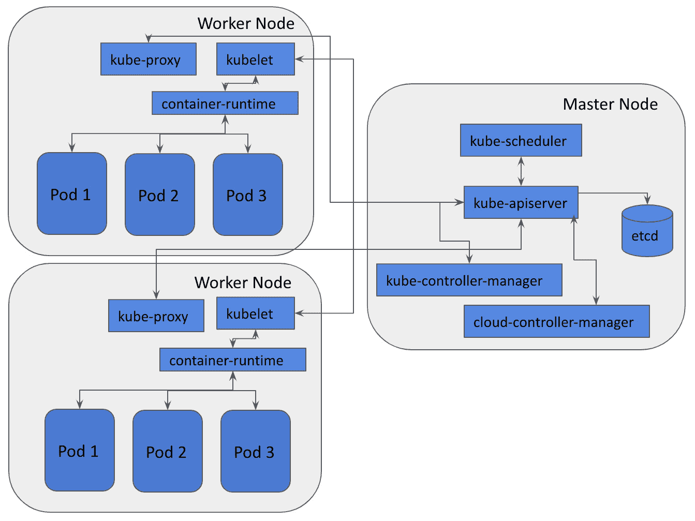
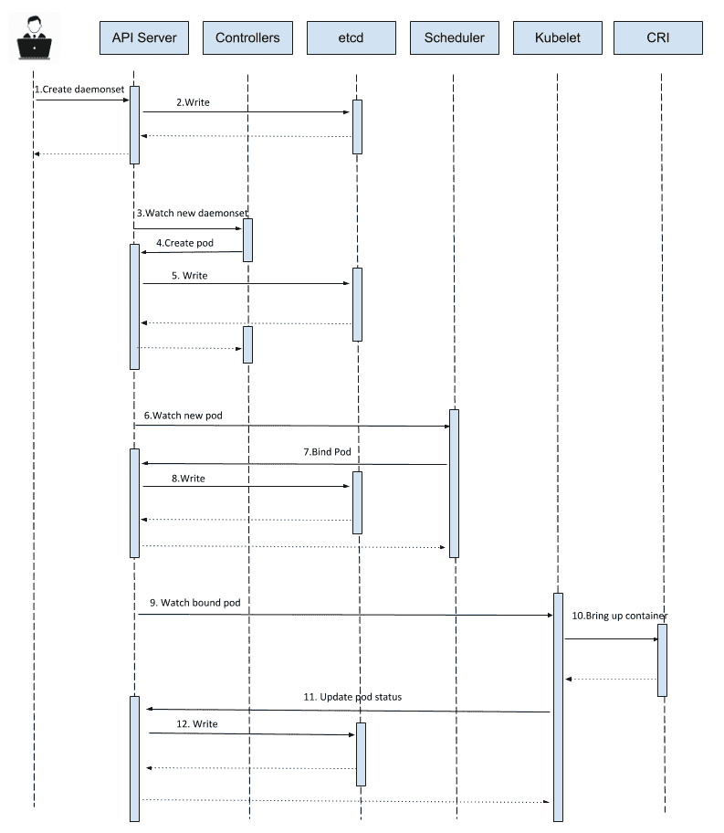
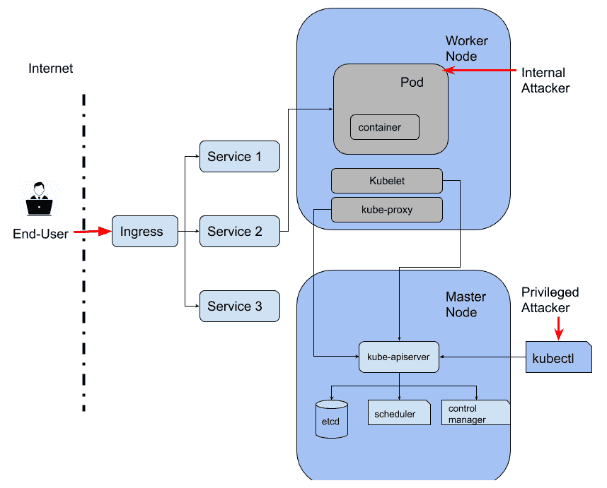
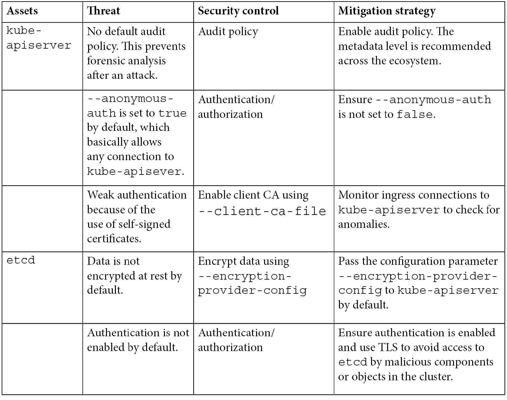
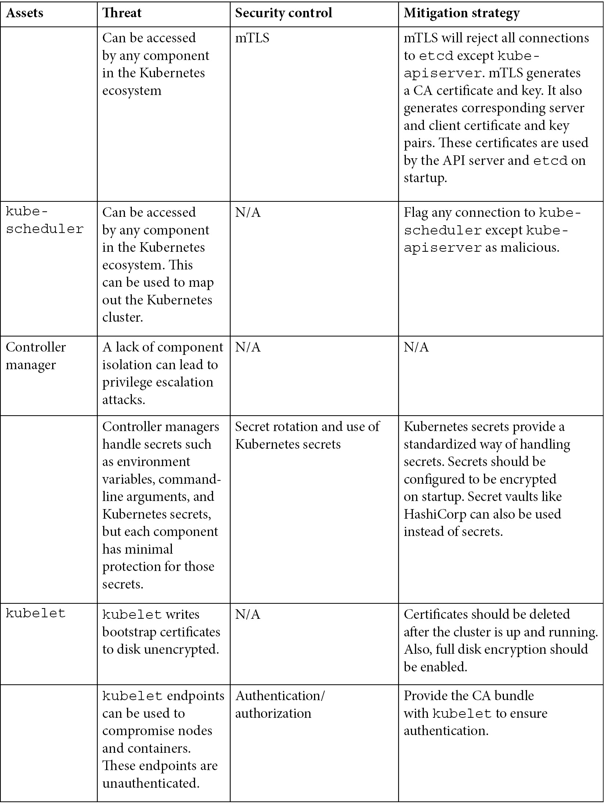
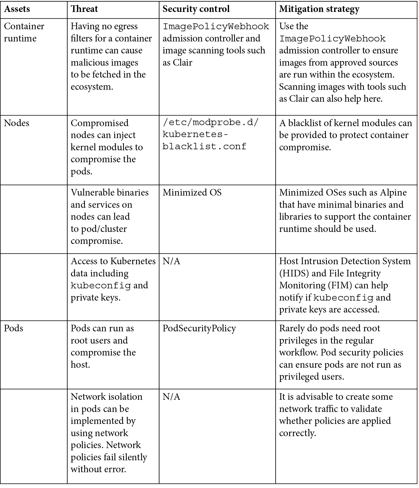
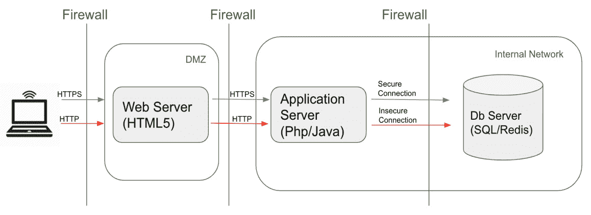
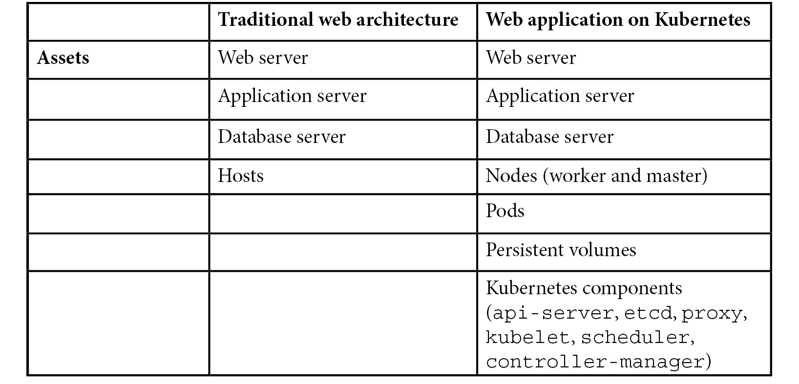

# *第三章*：威胁建模

Kubernetes 是一个庞大的生态系统，包括多个组件，如`kube-apiserver`、`etcd`、`kube-scheduler`、`kubelet`等。在第一章中，我们强调了不同 Kubernetes 组件的基本功能。在默认配置中，Kubernetes 组件之间的交互会导致开发人员和集群管理员应该意识到的威胁。此外，在 Kubernetes 中部署应用程序会引入应用程序与之交互的新实体，为应用程序的威胁模型增加新的威胁行为者和攻击面。

在本章中，我们将从简要介绍威胁建模开始，讨论 Kubernetes 生态系统内的组件交互。我们将研究默认 Kubernetes 配置中的威胁。最后，我们将讨论在 Kubernetes 生态系统中对应用进行威胁建模如何引入额外的威胁行为者和攻击面。

本章的目标是帮助您了解，默认的 Kubernetes 配置不足以保护您部署的应用免受攻击者的侵害。Kubernetes 是一个不断发展和由社区维护的平台，因此本章要突出的一些威胁并没有相应的缓解措施，因为威胁的严重程度会随着每个环境的不同而变化。

本章旨在突出 Kubernetes 生态系统中的威胁，其中包括 Kubernetes 集群中的 Kubernetes 组件和工作负载，以便开发人员和 DevOps 工程师了解其部署的风险，并制定已知威胁的风险缓解计划。在本章中，我们将涵盖以下主题：

+   威胁建模介绍

+   组件交互

+   Kubernetes 环境中的威胁行为者

+   Kubernetes 组件/对象威胁模型

+   在 Kubernetes 中对应用程序进行威胁建模

# 威胁建模介绍

威胁建模是在**软件开发生命周期**（**SDLC**）的设计阶段分析系统作为整体，以主动识别系统的风险的过程。威胁建模用于在开发周期的早期考虑安全需求，以从一开始减轻风险的严重性。威胁建模涉及识别威胁，了解每个威胁的影响，最终为每个威胁制定缓解策略。威胁建模旨在将生态系统中的风险突出显示为一个简单的矩阵，其中包括风险的可能性和影响，以及相应的风险缓解策略（如果存在）。

成功的威胁建模会使您能够定义以下内容：

1.  **资产**：生态系统中需要保护的财产。

1.  **安全控制**：系统的属性，用于保护资产免受已识别风险的影响。这些是对资产风险的防护措施或对策。

1.  **威胁行为者**：威胁行为者是利用风险的实体或组织，包括脚本小子、国家级攻击者和黑客活动分子。

1.  **攻击面**：威胁行为者与系统交互的部分。它包括威胁行为者进入系统的入口点。

1.  **威胁**：对资产的风险。

1.  **缓解**：缓解定义了如何减少对资产的威胁的可能性和影响。

行业通常遵循以下威胁建模方法之一：

+   **STRIDE**：STRIDE 模型于 1999 年由微软发布。它是欺骗、篡改、否认、信息泄露、拒绝服务和特权升级的首字母缩略词。STRIDE 模型威胁系统，以回答“系统可能出现什么问题？”的问题。

+   **PASTA**：攻击模拟和威胁分析过程是一种以风险为中心的威胁建模方法。PASTA 遵循以攻击者为中心的方法，由业务和技术团队开发以资产为中心的缓解策略。

+   **VAST**：Visual, Agile, and Simple Threat modeling 旨在将威胁建模整合到应用程序和基础架构开发中，与 SDLC 和敏捷软件开发相结合。它提供了一种可视化方案，为开发人员、架构师、安全研究人员和业务执行人员提供可操作的输出。

威胁建模还有其他方法，但前面三种是行业内最常用的方法。

如果威胁模型的范围没有明确定义，威胁建模可能是一个无限长的任务。在开始识别生态系统中的威胁之前，重要的是清楚地了解每个组件的架构和工作方式，以及组件之间的交互。

在前几章中，我们已经详细了解了每个 Kubernetes 组件的基本功能。现在，我们将在调查 Kubernetes 生态系统内的威胁之前，先看一下 Kubernetes 中不同组件之间的交互。

# 组件交互

Kubernetes 组件共同工作，以确保集群内运行的微服务能够如预期般运行。如果将微服务部署为 DaemonSet，则 Kubernetes 组件将确保每个节点上都有一个运行微服务的 pod，不多不少。那么在幕后会发生什么？让我们看一下高层次上组件之间的交互的图表：

图 3.1 - Kubernetes 组件之间的交互

这些组件的快速回顾：

+   kube-apiserver：Kubernetes API 服务器（`kube-apiserver`）是一个控制平面组件，用于验证和配置对象的数据。

+   etcd：`etcd`是一个高可用的键值存储，用于存储配置、状态和元数据等数据。

+   kube-scheduler：`kube-scheduler`是 Kubernetes 的默认调度程序。它监视新创建的 pod，并将 pod 分配给节点。

+   kube-controller-manager：Kubernetes 控制器管理器是一组核心控制器，它们监视状态更新并相应地对集群进行更改。

+   cloud-controller-manager：云控制器管理器运行控制器，与底层云提供商进行交互。

+   kubelet：`kubelet`向 API 服务器注册节点，并监视使用 Podspecs 创建的 pod，以确保 pod 和容器健康。

值得注意的是，只有`kube-apiserver`与`etcd`通信。其他 Kubernetes 组件，如`kube-scheduler`、`kube-controller-manager`和`cloud-controller manager`与运行在主节点上的`kube-apiserver`进行交互，以履行它们的责任。在工作节点上，`kubelet`和`kube-proxy`都与`kube-apiserver`通信。

让我们以 DaemonSet 创建为例，展示这些组件如何相互通信：

图 3.2 - 在 Kubernetes 中创建 DaemonSet

要创建一个 DaemonSet，我们使用以下步骤：

1.  用户通过 HTTPS 向`kube-apiserver`发送请求以创建 DaemonSet 工作负载。

1.  经过身份验证、授权和对象验证后，`kube-apiserver`在`etcd`数据库中为 DaemonSet 创建工作负载对象信息。默认情况下，`etcd`中的数据在传输和静止状态下都不加密。

1.  DaemonSet 控制器监视新的 DaemonSet 对象的创建，然后向`kube-apiserver`发送 pod 创建请求。请注意，DaemonSet 基本上意味着微服务将在每个节点的 pod 中运行。

1.  `kube-apiserver`重复*步骤 2*中的操作，并在`etcd`数据库中为 pod 创建工作负载对象信息。

1.  `kube-scheduler`监视新的 pod 的创建，然后根据节点选择标准决定在哪个节点上运行该 pod。之后，`kube-scheduler`向`kube-apiserver`发送有关 pod 将在哪个节点上运行的请求。

1.  `kube-apiserver`接收来自`kube-scheduler`的请求，然后使用 pod 的节点分配信息更新`etcd`。

1.  运行在工作节点上的`kubelet`监视分配给该节点的新 pod，然后向**容器运行时接口**（**CRI**）组件（如 Docker）发送请求以启动容器。之后，`kubelet`将 pod 的状态发送回`kube-apiserver`。

1.  `kube-apiserver`从目标节点上的`kubelet`接收 pod 的状态信息，然后更新`etcd`数据库中的 pod 状态。

1.  一旦创建了（来自 DaemonSet 的）pod，这些 pod 就能够与其他 Kubernetes 组件进行通信，微服务应该已经启动并运行。

请注意，并非所有组件之间的通信都默认安全。这取决于这些组件的配置。我们将在*第六章*中更详细地介绍这一点，*保护集群组件*。

# Kubernetes 环境中的威胁行为者

威胁行为者是系统中执行的应该受到保护的资产的实体或代码。从防御的角度来看，你首先需要了解你的潜在敌人是谁，否则你的防御策略将太模糊。Kubernetes 环境中的威胁行为者可以大致分为三类：

1.  终端用户：可以连接到应用程序的实体。该参与者的入口点通常是负载均衡器或入口。有时，Pod、容器或 NodePorts 可能直接暴露在互联网上，为终端用户增加了更多的入口点。

1.  内部攻击者：在 Kubernetes 集群内部具有有限访问权限的实体。集群内生成的恶意容器或 Pod 是内部攻击者的示例。

1.  特权攻击者：在 Kubernetes 集群内部具有管理员访问权限的实体。基础设施管理员、被 compromise 的`kube-apiserver`实例和恶意节点都是特权攻击者的示例。

威胁参与者的示例包括脚本小子、骇客活动分子和国家行为者。所有这些参与者都属于前面提到的三类，取决于参与者在系统中的位置。

以下图表突出了 Kubernetes 生态系统中的不同参与者：

图 3.3– Kubernetes 环境中的威胁参与者

正如您在此图表中所看到的，终端用户通常与入口控制器、负载均衡器或 Pod 暴露的 HTTP/HTTPS 路由进行交互。终端用户权限最低。另一方面，内部攻击者对集群内部的资源具有有限访问权限。特权攻击者权限最高，并且有能力修改集群。这三类攻击者有助于确定威胁的严重程度。涉及终端用户的威胁比涉及特权攻击者的威胁具有更高的严重性。尽管这些角色在图表中似乎是孤立的，但攻击者可以通过权限提升攻击从终端用户变为内部攻击者。

# Kubernetes 集群中的威胁

通过对 Kubernetes 组件和威胁参与者的新理解，我们将继续进行 Kubernetes 集群的威胁建模之旅。在下表中，我们涵盖了主要的 Kubernetes 组件、节点和 Pod。节点和 Pod 是运行工作负载的基本 Kubernetes 对象。请注意，所有这些组件都是资产，应该受到威胁的保护。这些组件中的任何一个被 compromise 都可能导致攻击的下一步，比如权限提升。还要注意，`kube-apiserver`和`etcd`是 Kubernetes 集群的大脑和心脏。如果它们中的任何一个被 compromise，那将是游戏结束。

下表突出了默认 Kubernetes 配置中的威胁。该表还突出了开发人员和集群管理员如何保护其资产免受这些威胁的影响：

这张表只突出了一些威胁。还有更多的威胁，将在后面的章节中进行讨论。我们希望前面的表格能激发您对需要在 Kubernetes 集群中保护什么以及如何保护的思考。

# 在 Kubernetes 中进行威胁建模应用

现在我们已经看过 Kubernetes 集群中的威胁，让我们继续讨论在 Kubernetes 上部署的应用程序的威胁建模将会有何不同。在 Kubernetes 中部署会给威胁模型增加额外的复杂性。Kubernetes 增加了额外的考虑因素、资产、威胁行为者和需要在调查部署应用程序的威胁之前考虑的新安全控制。

让我们来看一个简单的三层 Web 应用的例子：

图 3.4 - 传统 Web 应用的威胁模型

在 Kubernetes 环境中，同一应用看起来有些不同：

图 3.5 - Kubernetes 中三层 Web 应用的威胁模型

](image/B15566_03_005.jpg)

图 3.5 - Kubernetes 中三层 Web 应用的威胁模型

如前图所示，Web 服务器、应用服务器和数据库都在 pod 中运行。让我们对传统 Web 架构和云原生架构之间的威胁建模进行高层比较：

总结前面的比较，您会发现在云原生架构中需要保护更多的资产，并且在这个领域会面临更多的威胁行为者。Kubernetes 提供了更多的安全控制，但也增加了更多的复杂性。更多的安全控制并不一定意味着更安全。请记住：复杂性是安全的敌人。

# 总结

在本章中，我们首先介绍了威胁建模的基本概念。我们讨论了 Kubernetes 环境中的重要资产、威胁和威胁行为者。我们讨论了不同的安全控制和缓解策略，以改善您的 Kubernetes 集群的安全状况。

然后我们通过应用程序威胁建模，考虑了部署在 Kubernetes 中的应用程序，并将其与传统的单片应用程序的威胁建模进行了比较。Kubernetes 设计引入的复杂性使威胁建模变得更加复杂，正如我们所展示的：需要保护的资产更多，威胁行为者也更多。而更多的安全控制并不一定意味着更安全。

您应该记住，尽管威胁建模可能是一个漫长而复杂的过程，但值得去了解您环境的安全状况。同时进行应用程序威胁建模和基础设施威胁建模对于更好地保护您的 Kubernetes 集群非常必要。

在下一章中，为了帮助您了解如何将您的 Kubernetes 集群安全性提升到更高水平，我们将讨论最小特权原则以及如何在 Kubernetes 集群中实施它。

# 问题

1.  何时开始对应用程序进行威胁建模？

1.  Kubernetes 环境中有哪些不同的威胁行为者？

1.  提到默认 Kubernetes 部署的最严重的威胁之一。

1.  为什么在 Kubernetes 环境中威胁建模更加困难？

1.  Kubernetes 部署的攻击面与传统架构中的部署相比如何？

# 进一步阅读

Trail of Bits 和 Atredis Partners 在 Kubernetes 组件的威胁建模方面做得很好。他们的白皮书详细介绍了每个 Kubernetes 组件中的威胁。您可以在[`github.com/kubernetes/community/blob/master/wg-security-audit/findings/Kubernetes%20Threat%20Model.pdf`](https://github.com/kubernetes/community/blob/master/wg-security-audit/findings/Kubernetes%20Threat%20Model.pdf)找到这份白皮书。

请注意，前述白皮书的威胁建模的意图、范围和方法是不同的。因此，结果会有些不同。
