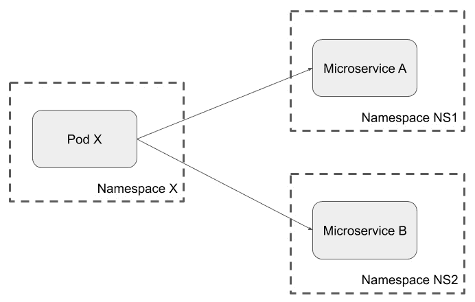
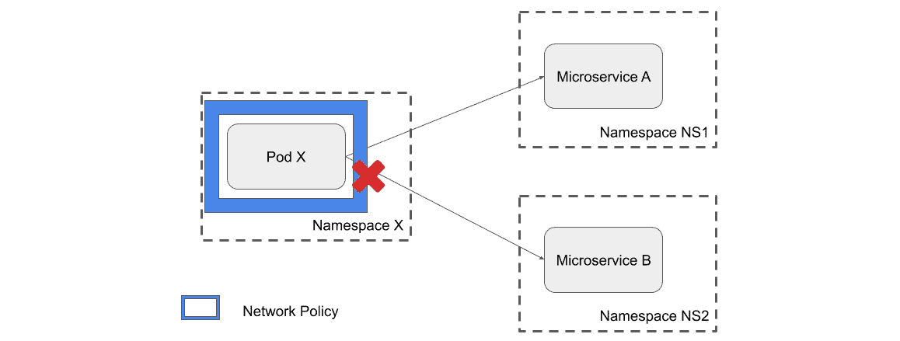

# *第四章*：在 Kubernetes 中应用最小权限原则

最小权限原则规定生态系统的每个组件在其功能运行所需的数据和资源上应具有最小的访问权限。在多租户环境中，不同用户或对象可以访问多个资源。最小权限原则确保在这种环境中，如果用户或对象行为不端，对集群造成的损害是最小的。

在本章中，我们将首先介绍最小权限原则。鉴于 Kubernetes 的复杂性，我们将首先研究 Kubernetes 主题，然后是主题可用的权限。然后，我们将讨论 Kubernetes 对象的权限以及限制它们的可能方式。本章的目标是帮助您理解一些关键概念，如最小权限原则和基于角色的访问控制（RBAC）。在本章中，我们将讨论不同的 Kubernetes 对象，如命名空间、服务账户、角色和角色绑定，以及 Kubernetes 安全特性，如安全上下文、PodSecurityPolicy 和 NetworkPolicy，这些特性可以用来实现 Kubernetes 集群的最小权限原则。

在本章中，我们将涵盖以下主题：

+   最小权限原则

+   Kubernetes 主题的最小权限

+   Kubernetes 工作负载的最小权限

# 最小权限原则

特权是执行操作的权限，例如访问资源或处理一些数据。最小特权原则是任何主体、用户、程序、进程等都应该只具有执行其功能所需的最低特权的想法。例如，Alice，一个普通的 Linux 用户，能够在自己的主目录下创建文件。换句话说，Alice 至少具有在她的主目录下创建文件的特权或权限。然而，Alice 可能无法在另一个用户的目录下创建文件，因为她没有这样做的特权或权限。如果 Alice 的日常任务中没有一个实际行使在主目录中创建文件的特权，但她确实有这样做的特权，那么机器的管理员就没有遵守最小特权原则。在本节中，我们将首先介绍授权模型的概念，然后我们将讨论实施最小特权原则的好处。

## 授权模型

当我们谈论最小特权时，大多数时候我们是在授权的背景下谈论的，在不同的环境中，会有不同的授权模型。例如，**访问控制列表**（**ACL**）广泛用于 Linux 和网络防火墙，而 RBAC 用于数据库系统。环境的管理员也有责任定义授权策略，以确保基于系统中可用的授权模型的最小特权。以下列表定义了一些流行的授权模型：

+   **ACL**：ACL 定义了与对象关联的权限列表。它指定了哪些主体被授予对对象的访问权限，以及对给定对象允许的操作。例如，`-rw`文件权限是文件所有者的读写权限。

+   RBAC：授权决策基于主体的角色，其中包含一组权限或特权。例如，在 Linux 中，用户被添加到不同的组（如`staff`）以授予对文件夹的访问权限，而不是单独被授予对文件系统上文件夹的访问权限。

+   **基于属性的访问控制（ABAC）**：授权决策基于主体的属性，例如标签或属性。基于属性的规则检查用户属性，如`user.id="12345"`，`user.project="project"`和`user.status="active"`，以决定用户是否能够执行任务。

Kubernetes 支持 ABAC 和 RBAC。尽管 ABAC 功能强大且灵活，但在 Kubernetes 中的实施使其难以管理和理解。因此，建议在 Kubernetes 中启用 RBAC 而不是 ABAC。除了 RBAC，Kubernetes 还提供了多种限制资源访问的方式。在接下来的部分中我们将探讨 Kubernetes 中的 RBAC 和 ABAC 之前，让我们讨论确保最小特权的好处。

## 最小特权原则的奖励

尽管可能需要相当长的时间来理解主体的最低特权是为了执行其功能，但如果最小特权原则已经在您的环境中实施，奖励也是显著的：

+   **更好的安全性**：通过实施最小特权原则，可以减轻内部威胁、恶意软件传播、横向移动等问题。爱德华·斯诺登的泄密事件发生是因为缺乏最小特权。

+   **更好的稳定性**：鉴于主体只被适当地授予必要的特权，主体的活动变得更加可预测。作为回报，系统的稳定性得到了加强。

+   **改进的审计准备性**：鉴于主体只被适当地授予必要的特权，审计范围将大大减少。此外，许多常见的法规要求实施最小特权原则作为合规要求。

既然您已经看到了实施最小特权原则的好处，我也想介绍一下挑战：Kubernetes 的开放性和可配置性使得实施最小特权原则变得繁琐。让我们看看如何将最小特权原则应用于 Kubernetes 主体。

# Kubernetes 主体的最小特权

Kubernetes 服务账户、用户和组与`kube-apiserver`通信，以管理 Kubernetes 对象。启用 RBAC 后，不同的用户或服务账户可能具有操作 Kubernetes 对象的不同特权。例如，`system:master`组中的用户被授予`cluster-admin`角色，这意味着他们可以管理整个 Kubernetes 集群，而`system:kube-proxy`组中的用户只能访问`kube-proxy`组件所需的资源。首先，让我们简要介绍一下 RBAC 是什么。

## RBAC 简介

正如前面讨论的，RBAC 是一种基于授予用户或组角色的资源访问控制模型。从 1.6 版本开始，Kubernetes 默认启用了 RBAC。在 1.6 版本之前，可以通过使用带有`--authorization-mode=RBAC`标志的**应用程序编程接口**（**API**）服务器来启用 RBAC。RBAC 通过 API 服务器简化了权限策略的动态配置。

RBAC 的核心元素包括以下内容：

1.  **主体**：请求访问 Kubernetes API 的服务账户、用户或组。

1.  **资源**：需要被主体访问的 Kubernetes 对象。

1.  **动词**：主体在资源上需要的不同类型访问，例如创建、更新、列出、删除。

Kubernetes RBAC 定义了主体和它们在 Kubernetes 生态系统中对不同资源的访问类型。

## 服务账户、用户和组

Kubernetes 支持三种类型的主体，如下：

+   **普通用户**：这些用户是由集群管理员创建的。它们在 Kubernetes 生态系统中没有对应的对象。集群管理员通常使用**轻量级目录访问协议**（**LDAP**）、**Active Directory**（**AD**）或私钥来创建用户。

+   **服务账户**：Pod 使用服务账户对`kube-apiserver`对象进行身份验证。服务账户是通过 API 调用创建的。它们受限于命名空间，并且有关联的凭据存储为`secrets`。默认情况下，pod 使用`default`服务账户进行身份验证。

+   **匿名用户**：任何未与普通用户或服务账户关联的 API 请求都与匿名用户关联。

集群管理员可以通过运行以下命令创建与 pod 关联的新服务账户：

```
$ kubectl create serviceaccount new_account
```

在默认命名空间中将创建一个`new_account`服务账户。为了确保最小权限，集群管理员应将每个 Kubernetes 资源与具有最小权限的服务账户关联起来。

## 角色

角色是权限的集合——例如，命名空间 A 中的角色可以允许用户在命名空间 A 中创建 pods 并列出命名空间 A 中的 secrets。在 Kubernetes 中，没有拒绝权限。因此，角色是一组权限的添加。

角色受限于命名空间。另一方面，ClusterRole 在集群级别工作。用户可以创建跨整个集群的 ClusterRole。ClusterRole 可用于调解对跨集群的资源的访问，例如节点、健康检查和跨多个命名空间的对象，例如 pods。以下是一个角色定义的简单示例：

```
kind: Role
apiVersion: rbac.authorization.k8s.io/v1
metadata:
  namespace: default
  name: role-1
rules:
- apiGroups: [""]
  resources: ["pods"]
  verbs: ["get"]
```

这个简单的规则允许`get`操作超越默认命名空间中的`pods`资源。可以通过执行以下命令使用 kubectl 创建此角色：

```
$ kubectl apply -f role.yaml
```

如果以下任一条件为真，则用户只能创建或修改角色：

+   用户在相同范围（命名空间或整个集群）中拥有角色中包含的所有权限。

+   用户与给定范围内的升级角色相关联。

这可以防止用户通过修改用户角色和权限来执行权限升级攻击。

## RoleBinding

RoleBinding 对象用于将角色与主体关联。与 ClusterRole 类似，ClusterRoleBinding 可以向跨命名空间的主体授予一组权限。让我们看几个例子：

1.  创建一个 RoleBinding 对象，将“custom-clusterrole”集群角色与默认命名空间中的`demo-sa`服务账户关联起来，就像这样：

```
kubectl create rolebinding new-rolebinding-sa \
     --clusterrole=custom-clusterrole \
     --serviceaccount=default:demo-sa
```

1.  创建一个 RoleBinding 对象，将`custom-clusterrole`集群角色与`group-1`组关联起来，就像这样：

```
kubectl create rolebinding new-rolebinding-group \
     --clusterrole=custom-clusterrole \
     --group=group-1 \
     --namespace=namespace-1
```

RoleBinding 对象将角色链接到主体，并使角色可重用且易于管理。

## Kubernetes 命名空间

命名空间是计算机科学中的一个常见概念，为相关资源提供了逻辑分组。命名空间用于避免名称冲突；同一命名空间内的资源应具有唯一名称，但跨命名空间的资源可以共享名称。在 Linux 生态系统中，命名空间允许隔离系统资源。

在 Kubernetes 中，命名空间允许多个团队和项目在逻辑上共享单个集群。使用 Kubernetes 命名空间，以下内容适用：

+   它们允许不同的应用程序、团队和用户在同一个集群中工作。

+   它们允许集群管理员为应用程序使用命名空间资源配额。

+   它们使用 RBAC 策略来控制对命名空间内特定资源的访问。RoleBinding 帮助集群管理员控制对命名空间内用户授予的权限。

+   它们允许在命名空间中使用网络策略进行网络分割。默认情况下，所有 pod 可以跨不同命名空间相互通信。

默认情况下，Kubernetes 有三个不同的命名空间。运行以下命令查看它们：

```
$ kubectl get namespace
NAME          STATUS    AGE
default       Active    1d
kube-system   Active    1d
kube-public   Active    1d
```

三个命名空间的描述如下：

+   `default`：不属于任何其他命名空间的资源的命名空间。

+   `kube-system`：Kubernetes 创建的对象的命名空间，如`kube-apiserver`、`kube-scheduler`、`controller-manager`和`coredns`。

+   `kube-public`：此命名空间内的资源对所有人都是可访问的。默认情况下，此命名空间中不会创建任何内容。

让我们看看如何创建一个命名空间。

### 创建命名空间

可以使用以下命令在 Kubernetes 中创建新的命名空间：

```
$ kubectl create namespace test
```

创建新的命名空间后，可以使用`namespace`属性将对象分配给命名空间，如下所示：

```
$ kubectl apply --namespace=test -f pod.yaml
```

同样地，可以使用`namespace`属性访问命名空间内的对象，如下所示：

```
$ kubectl get pods --namespace=test
```

在 Kubernetes 中，并非所有对象都有命名空间。低级别对象如`Nodes`和`persistentVolumes`跨越多个命名空间。

## 为 Kubernetes 主体实现最小特权

到目前为止，您应该熟悉 ClusterRole/Role、ClusterRoleBinding/RoleBinding、服务账户和命名空间的概念。为了为 Kubernetes 主体实现最小特权，您可以在创建 Kubernetes 中的 Role 或 RoleBinding 对象之前问自己以下问题：

+   主体是否需要在命名空间内或跨命名空间拥有权限？

这很重要，因为一旦主体具有集群级别的权限，它可能能够在所有命名空间中行使权限。

+   权限应该授予用户、组还是服务账户？

当您向一个组授予一个角色时，这意味着组中的所有用户将自动获得新授予角色的特权。在向组授予角色之前，请确保您了解其影响。其次，Kubernetes 中的用户是为人类而设，而服务账户是为 pod 中的微服务而设。请确保您了解 Kubernetes 用户的责任，并相应地分配特权。另外，请注意，一些微服务根本不需要任何特权，因为它们不直接与`kube-apiserver`或任何 Kubernetes 对象进行交互。

+   主体需要访问哪些资源？

在创建角色时，如果不指定资源名称或在`resourceNames`字段中设置`*`，则意味着已授予对该资源类型的所有资源的访问权限。如果您知道主体将要访问的资源名称，请在创建角色时指定资源名称。

Kubernetes 主体使用授予的特权与 Kubernetes 对象进行交互。了解您的 Kubernetes 主体执行的实际任务将有助于您正确授予特权。

# Kubernetes 工作负载的最小特权

通常，将会有一个（默认）服务账户与 Kubernetes 工作负载相关联。因此，pod 内的进程可以使用服务账户令牌与`kube-apiserver`通信。DevOps 应该仔细地为服务账户授予必要的特权，以实现最小特权的目的。我们在前一节已经介绍过这一点。

除了访问`kube-apiserver`来操作 Kubernetes 对象之外，pod 中的进程还可以访问工作节点上的资源以及集群中的其他 pod/微服务（在*第二章*，*Kubernetes 网络*中有介绍）。在本节中，我们将讨论对系统资源、网络资源和应用程序资源进行最小特权访问的可能实现。

## 访问系统资源的最小特权

请记住，运行在容器或 pod 内的微服务只是工作节点上的一个进程，在其自己的命名空间中隔离。根据配置，pod 或容器可以访问工作节点上的不同类型的资源。这由安全上下文控制，可以在 pod 级别和容器级别进行配置。配置 pod/容器安全上下文应该是开发人员的任务清单（在安全设计和审查的帮助下），而限制 pod/容器访问集群级别系统资源的另一种方式——pod 安全策略，应该是 DevOps 的任务清单。让我们深入了解安全上下文、Pod 安全策略和资源限制控制的概念。

### 安全上下文

安全上下文提供了一种方式来定义与访问系统资源相关的 pod 和容器的特权和访问控制设置。在 Kubernetes 中，pod 级别的安全上下文与容器级别的安全上下文不同，尽管它们有一些重叠的属性可以在两个级别进行配置。总的来说，安全上下文提供了以下功能，允许您为容器和 pod 应用最小特权原则：

+   自主访问控制（DAC）：这是用来配置将哪个用户 ID（UID）或组 ID（GID）绑定到容器中的进程，容器的根文件系统是否为只读等。强烈建议不要在容器中以 root 用户（UID = 0）身份运行您的微服务。安全影响是，如果存在漏洞并且容器逃逸到主机，攻击者立即获得主机上的 root 用户权限。

+   安全增强 Linux（SELinux）：这是用来配置 SELinux 安全上下文的，它为 pod 或容器定义了级别标签、角色标签、类型标签和用户标签。通过分配 SELinux 标签，pod 和容器可能会受到限制，特别是在能够访问节点上的卷方面。

+   特权模式：这是用来配置容器是否在特权模式下运行。特权容器内运行的进程的权限基本上与节点上的 root 用户相同。

+   **Linux 功能：** 这是为容器配置 Linux 功能。不同的 Linux 功能允许容器内的进程执行不同的活动或在节点上访问不同的资源。例如，`CAP_AUDIT_WRITE`允许进程写入内核审计日志，而`CAP_SYS_ADMIN`允许进程执行一系列管理操作。

+   **AppArmor：** 这是为 Pod 或容器配置 AppArmor 配置文件。AppArmor 配置文件通常定义了进程拥有哪些 Linux 功能，容器可以访问哪些网络资源和文件等。

+   **安全计算模式（seccomp）：** 这是为 Pod 或容器配置 seccomp 配置文件。seccomp 配置文件通常定义了允许执行的系统调用白名单和将被阻止在 Pod 或容器内执行的系统调用黑名单。

+   **AllowPrivilegeEscalation：** 这是用于配置进程是否可以获得比其父进程更多的权限。请注意，当容器以特权运行或具有`CAP_SYS_ADMIN`功能时，`AllowPrivilegeEscalation`始终为真。

我们将在*第八章*中更多地讨论安全上下文，*保护 Pods*。

### PodSecurityPolicy

PodSecurityPolicy 是 Kubernetes 集群级别的资源，用于控制与安全相关的 Pod 规范属性。它定义了一组规则。当要在 Kubernetes 集群中创建 Pod 时，Pod 需要遵守 PodSecurityPolicy 中定义的规则，否则将无法启动。PodSecurityPolicy 控制或应用以下属性：

+   允许运行特权容器

+   允许使用主机级别的命名空间

+   允许使用主机端口

+   允许使用不同类型的卷

+   允许访问主机文件系统

+   要求容器运行只读根文件系统

+   限制容器的用户 ID 和组 ID

+   限制容器的特权升级

+   限制容器的 Linux 功能

+   需要使用 SELinux 安全上下文

+   将 seccomp 和 AppArmor 配置文件应用于 Pod

+   限制 Pod 可以运行的 sysctl

+   允许使用`proc`挂载类型

+   限制 FSGroup 对卷的使用

我们将在《第八章》《Securing Kubernetes Pods》中更多地介绍 PodSecurityPolicy。PodSecurityPolicy 控制基本上是作为一个准入控制器实现的。您也可以创建自己的准入控制器，为您的工作负载应用自己的授权策略。**Open Policy Agent**（**OPA**）是另一个很好的选择，可以为工作负载实现自己的最小特权策略。我们将在《第七章》《Authentication, Authorization, and Admission Control》中更多地了解 OPA。

现在，让我们看一下 Kubernetes 中的资源限制控制机制，因为您可能不希望您的微服务饱和系统中的所有资源，比如**Central Processing Unit**（**CPU**）和内存。

### 资源限制控制

默认情况下，单个容器可以使用与节点相同的内存和 CPU 资源。运行加密挖矿二进制文件的容器可能会轻松消耗节点上其他 Pod 共享的 CPU 资源。为工作负载设置资源请求和限制始终是一个良好的实践。资源请求会影响调度器分配 Pod 的节点，而资源限制设置了容器终止的条件。为您的工作负载分配更多的资源请求和限制以避免驱逐或终止始终是安全的。但是，请记住，如果您将资源请求或限制设置得太高，您将在集群中造成资源浪费，并且分配给您的工作负载的资源可能无法充分利用。我们将在《第十章》《Real-Time Monitoring and Resource Management of a Kubernetes Cluster》中更多地介绍这个话题。

## 封装访问系统资源的最小特权

当 pod 或容器以特权模式运行时，与非特权 pod 或容器不同，它们具有与节点上的管理员用户相同的特权。如果您的工作负载以特权模式运行，为什么会这样？当一个 pod 能够访问主机级别的命名空间时，该 pod 可以访问主机级别的资源，如网络堆栈、进程和**进程间通信**（**IPC**）。但您真的需要授予主机级别的命名空间访问权限或设置特权模式给您的 pod 或容器吗？此外，如果您知道容器中的进程需要哪些 Linux 功能，最好放弃那些不必要的功能。您的工作负载需要多少内存和 CPU 才能完全正常运行？请考虑这些问题，以实现对您的 Kubernetes 工作负载的最小特权原则。正确设置资源请求和限制，为您的工作负载使用安全上下文，并为您的集群强制执行 PodSecurityPolicy。所有这些都将有助于确保您的工作负载以最小特权访问系统资源。

## 访问网络资源的最小特权

默认情况下，同一 Kubernetes 集群中的任何两个 pod 可以相互通信，如果在 Kubernetes 集群外没有配置代理规则或防火墙规则，一个 pod 可能能够与互联网通信。Kubernetes 的开放性模糊了微服务的安全边界，我们不应忽视容器或 pod 可以访问的其他微服务提供的 API 端点等网络资源。

假设您的工作负载（pod X）在名称空间 X 中只需要访问名称空间 NS1 中的另一个微服务 A；同时，名称空间 NS2 中有微服务 B。微服务 A 和微服务 B 都公开其**表述状态传输**（**REST**ful）端点。默认情况下，您的工作负载可以访问微服务 A 和 B，假设微服务级别没有身份验证或授权，以及名称空间 NS1 和 NS2 中没有强制执行网络策略。请看下面的图表，说明了这一点：



图 4.1-没有网络策略的网络访问

在前面的图中，**Pod X**能够访问这两个微服务，尽管它们位于不同的命名空间中。还要注意，**Pod X**只需要访问**NS1**命名空间中的**Microservice A**。那么，我们是否可以做一些事情，以限制**Pod X**仅出于最小特权的目的访问**Microservice A**？是的：Kubernetes 网络策略可以帮助。我们将在*第五章*中更详细地介绍网络策略，*配置 Kubernetes 安全边界*。一般来说，Kubernetes 网络策略定义了一组 Pod 允许如何相互通信以及与其他网络端点通信的规则。您可以为您的工作负载定义入口规则和出口规则。

注意

入口规则：定义哪些来源被允许与受网络策略保护的 Pod 通信的规则。

出口规则：定义哪些目的地被允许与受网络策略保护的 Pod 通信的规则。

在下面的示例中，为了在**Pod X**中实现最小特权原则，您需要在**Namespace X**中定义一个网络策略，其中包含一个出口规则，指定只允许**Microservice A**：



图 4.2 - 网络策略阻止对微服务 B 的访问

在前面的图中，**Namespace X**中的网络策略阻止了来自**Pod X**对**Microservice B**的任何请求，而**Pod X**仍然可以访问**Microservice A**，这是预期的。在您的网络策略中定义出口规则将有助于确保您的工作负载访问网络资源的最小特权。最后但同样重要的是，我们仍然需要从最小特权的角度关注应用程序资源级别。

## 访问应用程序资源的最小特权

虽然这个话题属于应用程序安全的范畴，但在这里提起也是值得的。如果有应用程序允许您的工作负载访问，并支持具有不同特权级别的多个用户，最好检查您的工作负载所代表的用户被授予的特权是否是必要的。例如，负责审计的用户不需要任何写入特权。应用程序开发人员在设计应用程序时应牢记这一点。这有助于确保您的工作负载访问应用程序资源的最小特权。

# 总结

在本章中，我们讨论了最小特权的概念。然后，我们讨论了 Kubernetes 中的安全控制机制，帮助在两个领域实现最小特权原则：Kubernetes 主体和 Kubernetes 工作负载。值得强调的是，全面实施最小特权原则的重要性。如果在任何领域中都忽略了最小特权，这可能会留下一个攻击面。

Kubernetes 提供了内置的安全控制，以实现最小特权原则。请注意，这是从开发到部署的一个过程：应用程序开发人员应与安全架构师合作，为与应用程序关联的服务账户设计最低特权，以及最低功能和适当的资源分配。在部署过程中，DevOps 应考虑使用 PodSecurityPolicy 和网络策略来强制执行整个集群的最小特权。

在下一章中，我们将从不同的角度看待 Kubernetes 的安全性：了解不同类型资源的安全边界以及如何加固它们。

# 问题

1.  在 Kubernetes 中，什么是 Role 对象？

1.  在 Kubernetes 中，什么是 RoleBinding 对象？

1.  RoleBinding 和 ClusterRoleBinding 对象之间有什么区别？

1.  默认情况下，Pod 无法访问主机级命名空间。列举一些允许 Pod 访问主机级命名空间的设置。

1.  如果您想限制 Pod 访问外部网络资源（例如内部网络或互联网），您可以做什么？

# 进一步阅读

您可能已经注意到，我们在本章中讨论的一些安全控制机制已经存在很长时间：SELinux 多类别安全/多级安全（MCS/MLS），AppArmor，seccomp，Linux 功能等。已经有许多书籍或文章介绍了这些技术。我鼓励您查看以下材料，以更好地了解如何使用它们来实现 Kubernetes 中的最小特权目标：

+   SELinux MCS: [`access.redhat.com/documentation/en-us/red_hat_enterprise_linux/5/html/deployment_guide/sec-mcs-getstarted`](https://access.redhat.com/documentation/en-us/red_hat_enterprise_linux/5/html/deployment_guide/sec-mcs-getstarted)

+   AppArmor: [`ubuntu.com/server/docs/security-apparmor`](https://ubuntu.com/server/docs/security-apparmor)

+   Linux 能力：[`man7.org/linux/man-pages/man7/capabilities.7.html`](http://man7.org/linux/man-pages/man7/capabilities.7.html)

+   帮助定义 RBAC 权限授予：[`github.com/liggitt/audit2rbac`](https://github.com/liggitt/audit2rbac)
