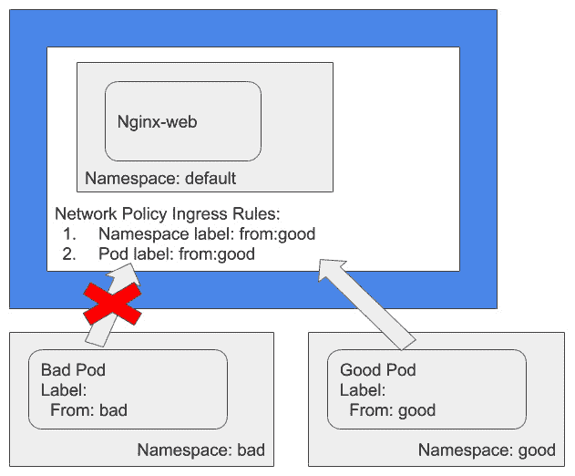

# 第五章：配置 Kubernetes 安全边界

安全边界分隔了安全域，其中一组实体共享相同的安全关注和访问级别，而信任边界是程序执行和数据改变信任级别的分界线。安全边界中的控制确保在边界之间移动的执行不会在没有适当验证的情况下提升信任级别。如果数据或执行在没有适当控制的情况下在安全边界之间移动，安全漏洞就会出现。

在本章中，我们将讨论安全和信任边界的重要性。我们将首先重点介绍介绍，以澄清安全和信任边界之间的任何混淆。然后，我们将深入了解 Kubernetes 生态系统中的安全域和安全边界。最后，我们将看一些增强 Kubernetes 中应用程序安全边界的功能。

您应该了解安全域和安全边界的概念，并了解基于底层容器技术以及内置安全功能（如 PodSecurityPolicy 和 NetworkPolicy）构建的 Kubernetes 周围的安全边界。

本章将涵盖以下主题：

+   安全边界的介绍

+   安全边界与信任边界

+   Kubernetes 安全域

+   Kubernetes 实体作为安全边界

+   系统层的安全边界

+   网络层的安全边界

# 安全边界的介绍

安全边界存在于数据层、网络层和系统层。安全边界取决于 IT 部门或基础设施团队使用的技术。例如，公司使用虚拟机来管理他们的应用程序- hypervisor 是虚拟机的安全边界。Hypervisor 确保在虚拟机中运行的代码不会逃离虚拟机或影响物理节点。当公司开始采用微服务并使用编排器来管理他们的应用程序时，容器是安全边界之一。然而，与虚拟机监视器相比，容器并不提供强大的安全边界，也不打算提供。容器在应用程序层强制执行限制，但不能阻止攻击者从内核层绕过这些限制。

在网络层，传统上，防火墙为应用程序提供了强大的安全边界。在微服务架构中，Kubernetes 中的 Pod 可以相互通信。网络策略用于限制 Pod 和服务之间的通信。

数据层的安全边界是众所周知的。内核限制对系统或 bin 目录的写访问仅限于 root 用户或系统用户是数据层安全边界的一个简单例子。在容器化环境中，chroot 防止容器篡改其他容器的文件系统。Kubernetes 重新构建了应用程序部署的方式，可以在网络和系统层上强制执行强大的安全边界。

# 安全边界与信任边界

安全边界和信任边界经常被用作同义词。虽然相似，但这两个术语之间有微妙的区别。**信任边界**是系统改变其信任级别的地方。执行信任边界是指指令需要不同的特权才能运行的地方。例如，数据库服务器在`/bin`中执行代码就是执行越过信任边界的一个例子。同样，数据信任边界是指数据在不同信任级别的实体之间移动的地方。用户插入到受信任数据库中的数据就是数据越过信任边界的一个例子。

而**安全边界**是不同安全域之间的分界点，安全域是一组在相同访问级别内的实体。例如，在传统的 Web 架构中，面向用户的应用程序是安全域的一部分，而内部网络是不同安全域的一部分。安全边界有与之相关的访问控制。将信任边界看作墙，将安全边界看作围绕墙的栅栏。

在生态系统中识别安全和信任边界是很重要的。这有助于确保在指令和数据跨越边界之前进行适当的验证。在 Kubernetes 中，组件和对象跨越不同的安全边界。了解这些边界对于在攻击者跨越安全边界时制定风险缓解计划至关重要。CVE-2018-1002105 是一个缺少跨信任边界验证而导致的攻击的典型例子；API 服务器中的代理请求处理允许未经身份验证的用户获得对集群的管理员特权。同样，CVE-2018-18264 允许用户跳过仪表板上的身份验证过程，以允许未经身份验证的用户访问敏感的集群信息。

现在让我们来看看不同的 Kubernetes 安全领域。

# Kubernetes 安全领域

Kubernetes 集群可以大致分为三个安全领域：

+   **Kubernetes 主组件**：Kubernetes 主组件定义了 Kubernetes 生态系统的控制平面。主组件负责决策，以确保集群的顺利运行，如调度。主组件包括`kube-apiserver`、`etcd`、`kube-controller`管理器、DNS 服务器和`kube-scheduler`。Kubernetes 主组件的违规行为可能会危及整个 Kubernetes 集群。

+   **Kubernetes 工作组件**：Kubernetes 工作组件部署在每个工作节点上，确保 Pod 和容器正常运行。Kubernetes 工作组件使用授权和 TLS 隧道与主组件进行通信。即使工作组件受到损害，集群也可以正常运行。这类似于环境中的一个恶意节点，在识别后可以从集群中移除。

+   **Kubernetes 对象**：Kubernetes 对象是表示集群状态的持久实体：部署的应用程序、卷和命名空间。Kubernetes 对象包括 Pods、Services、卷和命名空间。这些是由开发人员或 DevOps 部署的。对象规范为对象定义了额外的安全边界：使用 SecurityContext 定义 Pod、与其他 Pod 通信的网络规则等。

高级安全领域划分应该帮助您专注于关键资产。记住这一点，我们将开始查看 Kubernetes 实体和围绕它们建立的安全边界。

# Kubernetes 实体作为安全边界

在 Kubernetes 集群中，您与之交互的 Kubernetes 实体（对象和组件）都有其自己内置的安全边界。这些安全边界源自实体的设计或实现。了解实体内部或周围构建的安全边界非常重要：

+   **容器**：容器是 Kubernetes 集群中的基本组件。容器使用 cgroups、Linux 命名空间、AppArmor 配置文件和 seccomp 配置文件为应用程序提供最小的隔离。

+   **Pods**：Pod 是一个或多个容器的集合。与容器相比，Pod 隔离更多资源，例如网络和 IPC。诸如 SecurityContext、NetworkPolicy 和 PodSecurityPolicy 之类的功能在 Pod 级别工作，以确保更高级别的隔离。

+   **节点**：Kubernetes 中的节点也是安全边界。可以使用`nodeSelectors`指定 Pod 在特定节点上运行。内核和虚拟化程序强制执行运行在节点上的 Pod 的安全控制。诸如 AppArmor 和 SELinux 之类的功能可以帮助改善安全姿态，以及其他主机加固机制。

+   **集群**：集群是一组 Pod、容器以及主节点和工作节点上的组件。集群提供了强大的安全边界。在集群内运行的 Pod 和容器在网络和系统层面上与其他集群隔离。

+   **命名空间**：命名空间是隔离 Pod 和服务的虚拟集群。LimitRanger 准入控制器应用于命名空间级别，以控制资源利用和拒绝服务攻击。网络策略可以应用于命名空间级别。

+   **Kubernetes API 服务器**：Kubernetes API 服务器与所有 Kubernetes 组件交互，包括`etcd`、`controller-manager`和集群管理员用于配置集群的`kubelet`。它调解与主组件的通信，因此集群管理员无需直接与集群组件交互。

我们在*第三章*中讨论了三种不同的威胁行为者，*威胁建模*：特权攻击者、内部攻击者和最终用户。这些威胁行为者也可能与前述的 Kubernetes 实体进行交互。我们将看到攻击者面对这些实体的安全边界：

+   **最终用户**：最终用户与入口、暴露的 Kubernetes 服务或直接与节点上的开放端口进行交互。对于最终用户，节点、Pod、`kube-apiserver`和外部防火墙保护集群组件免受危害。

+   **内部攻击者**：内部攻击者可以访问 Pod 和容器。由`kube-apiserver`强制执行的命名空间和访问控制可以防止这些攻击者提升权限或者危害集群。网络策略和 RBAC 控制可以防止横向移动。

+   **特权攻击者**：`kube-apiserver`是唯一保护主控件组件免受特权攻击者危害的安全边界。如果特权攻击者危害了`kube-apiserver`，那就完了。

在本节中，我们从用户的角度看了安全边界，并向您展示了 Kubernetes 生态系统中如何构建安全边界。接下来，让我们从微服务的角度来看系统层的安全边界。

# 系统层的安全边界

微服务运行在 Pod 内，Pod 被调度在集群中的工作节点上运行。在之前的章节中，我们已经强调容器是分配了专用 Linux 命名空间的进程。一个容器或 Pod 消耗了工作节点提供的所有必要资源。因此，了解系统层的安全边界以及如何加固它是很重要的。在本节中，我们将讨论基于 Linux 命名空间和 Linux 能力一起为微服务构建的安全边界。

## Linux namespaces 作为安全边界

Linux namespaces 是 Linux 内核的一个特性，用于分隔资源以进行隔离。分配了命名空间后，一组进程看到一组资源，而另一组进程看到另一组资源。我们已经在*第二章*，*Kubernetes Networking*中介绍了 Linux namespaces。默认情况下，每个 Pod 都有自己的网络命名空间和 IPC 命名空间。同一 Pod 中的每个容器都有自己的 PID 命名空间，因此一个容器不知道同一 Pod 中运行的其他容器。同样，一个 Pod 不知道同一工作节点中存在其他 Pod。

一般来说，默认设置在安全方面为微服务提供了相当好的隔离。然而，允许在 Kubernetes 工作负载中配置主机命名空间设置，更具体地说，在 Pod 规范中。启用这样的设置后，微服务将使用主机级别的命名空间：

+   **HostNetwork**：Pod 使用主机的网络命名空间。

+   **HostIPC**：Pod 使用主机的 IPC 命名空间。

+   **HostPID**：Pod 使用主机的 PID 命名空间。

+   **shareProcessNamespace**：同一 Pod 内的容器将共享一个 PID 命名空间。

当您尝试配置工作负载以使用主机命名空间时，请问自己一个问题：为什么您必须这样做？当使用主机命名空间时，Pod 在同一工作节点中对其他 Pod 的活动有完全的了解，但这也取决于为容器分配了哪些 Linux 功能。总的来说，事实是，您正在削弱其他微服务的安全边界。让我举个快速的例子。这是容器内可见的进程列表：

```
root@nginx-2:/# ps aux
USER         PID %CPU %MEM    VSZ   RSS TTY      STAT START   TIME COMMAND
root           1  0.1  0.0  32648  5256 ?        Ss   23:47   0:00 nginx: master process nginx -g daemon off;
nginx          6  0.0  0.0  33104  2348 ?        S    23:47   0:00 nginx: worker process
root           7  0.0  0.0  18192  3248 pts/0    Ss   23:48   0:00 bash
root          13  0.0  0.0  36636  2816 pts/0    R+   23:48   0:00 ps aux
```

正如您所看到的，在`nginx`容器内，只有`nginx`进程和`bash`进程从容器中可见。这个`nginx` Pod 没有使用主机 PID 命名空间。让我们看看如果一个 Pod 使用主机 PID 命名空间会发生什么：

```
root@gke-demo-cluster-default-pool-c9e3510c-tfgh:/# ps axu
USER         PID %CPU %MEM    VSZ   RSS TTY      STAT START   TIME COMMAND
root           1  0.2  0.0  99660  7596 ?        Ss   22:54   0:10 /usr/lib/systemd/systemd noresume noswap cros_efi
root          20  0.0  0.0      0     0 ?        I<   22:54   0:00 [netns]
root          71  0.0  0.0      0     0 ?        I    22:54   0:01 [kworker/u4:2]
root         101  0.0  0.1  28288  9536 ?        Ss   22:54   0:01 /usr/lib/systemd/systemd-journald
201          293  0.2  0.0  13688  4068 ?        Ss   22:54   0:07 /usr/bin/dbus-daemon --system --address=systemd: --nofork --nopidfile 
274          297  0.0  0.0  22520  4196 ?        Ss   22:54   0:00 /usr/lib/systemd/systemd-networkd
root         455  0.0  0.0      0     0 ?        I    22:54   0:00 [kworker/0:3]
root        1155  0.0  0.0   9540  3324 ?        Ss   22:54   0:00 bash /home/kubernetes/bin/health-monitor.sh container-runtime
root        1356  4.4  1.5 1396748 118236 ?      Ssl  22:56   2:30 /home/kubernetes/bin/kubelet --v=2 --cloud-provider=gce --experimental
root        1635  0.0  0.0 773444  6012 ?        Sl   22:56   0:00 containerd-shim -namespace moby -workdir /var/lib/containerd/io.contai
root        1660  0.1  0.4 417260 36292 ?        Ssl  22:56   0:03 kube-proxy --master=https://35.226.122.194 --kubeconfig=/var/lib/kube-
root        2019  0.0  0.1 107744  7872 ?        Ssl  22:56   0:00 /ip-masq-agent --masq-chain=IP-MASQ --nomasq-all-reserved-ranges
root        2171  0.0  0.0  16224  5020 ?        Ss   22:57   0:00 sshd: gke-1a5c3c1c4d5b7d80adbc [priv]
root        3203  0.0  0.0   1024     4 ?        Ss   22:57   0:00 /pause
root        5489  1.3  0.4  48008 34236 ?        Sl   22:57   0:43 calico-node -felix
root        6988  0.0  0.0  32648  5248 ?        Ss   23:01   0:00 nginx: master process nginx -g daemon off;
nginx       7009  0.0  0.0  33104  2584 ?        S    23:01   0:00 nginx: worker process
```

前面的输出显示了在`nginx`容器中运行的进程。在这些进程中有系统进程，如`sshd`、`kubelet`、`kube-proxy`等等。除了 Pod 使用主机 PID 命名空间外，您还可以向其他微服务的进程发送信号，比如向一个进程发送`SIGKILL`来终止它。

## Linux 功能作为安全边界

Linux 功能是从传统的 Linux 权限检查演变而来的概念：特权和非特权。特权进程绕过所有内核权限检查。然后，Linux 将与 Linux 超级用户关联的特权划分为不同的单元- Linux 功能。有与网络相关的功能，比如`CAP_NET_ADMIN`、`CAP_NET_BIND_SERVICE`、`CAP_NET_BROADCAST`和`CAP_NET_RAW`。还有审计相关的功能：`CAP_AUDIT_CONTROL`、`CAP_AUDIT_READ`和`CAP_AUDIT_WRITE`。当然，还有类似管理员的功能：`CAP_SYS_ADMIN`。

如*第四章*中所述，*在 Kubernetes 中应用最小特权原则*，您可以为 Pod 中的容器配置 Linux 功能。默认情况下，以下是分配给 Kubernetes 集群中容器的功能列表：

+   `CAP_SETPCAP`

+   `CAP_MKNOD`

+   `CAP_AUDIT_WRITE`

+   `CAP_CHOWN`

+   `CAP_NET_RAW`

+   `CAP_DAC_OVERRIDE`

+   `CAP_FOWNER`

+   `CAP_FSETID`

+   `CAP_KILL`

+   `CAP_SETGID`

+   `CAP_SETUID`

+   `CAP_NET_BIND_SERVICE`

+   `CAP_SYS_CHROOT`

+   `CAP_SETFCAP`

对于大多数微服务来说，这些功能应该足以执行它们的日常任务。您应该放弃所有功能，只添加所需的功能。与主机命名空间类似，授予额外的功能可能会削弱其他微服务的安全边界。当您在容器中运行`tcpdump`命令时，以下是一个示例输出：

```
root@gke-demo-cluster-default-pool-c9e3510c-tfgh:/# tcpdump -i cali01fb9a4e4b4 -v
tcpdump: listening on cali01fb9a4e4b4, link-type EN10MB (Ethernet), capture size 262144 bytes
23:18:36.604766 IP (tos 0x0, ttl 64, id 27472, offset 0, flags [DF], proto UDP (17), length 86)
    10.56.1.14.37059 > 10.60.0.10.domain: 35359+ A? www.google.com.default.svc.cluster.local. (58)
23:18:36.604817 IP (tos 0x0, ttl 64, id 27473, offset 0, flags [DF], proto UDP (17), length 86)
    10.56.1.14.37059 > 10.60.0.10.domain: 35789+ AAAA? www.google.com.default.svc.cluster.local. (58)
23:18:36.606864 IP (tos 0x0, ttl 62, id 8294, offset 0, flags [DF], proto UDP (17), length 179)
    10.60.0.10.domain > 10.56.1.14.37059: 35789 NXDomain 0/1/0 (151)
23:18:36.606959 IP (tos 0x0, ttl 62, id 8295, offset 0, flags [DF], proto UDP (17), length 179)
    10.60.0.10.domain > 10.56.1.14.37059: 35359 NXDomain 0/1/0 (151)
23:18:36.607013 IP (tos 0x0, ttl 64, id 27474, offset 0, flags [DF], proto UDP (17), length 78)
    10.56.1.14.59177 > 10.60.0.10.domain: 7489+ A? www.google.com.svc.cluster.local. (50)
23:18:36.607053 IP (tos 0x0, ttl 64, id 27475, offset 0, flags [DF], proto UDP (17), length 78)
    10.56.1.14.59177 > 10.60.0.10.domain: 7915+ AAAA? www.google.com.svc.cluster.local. (50)
```

前面的输出显示，在容器内部，有`tcpdump`在网络接口`cali01fb9a4e4b4`上监听，该接口是为另一个 Pod 的网络通信创建的。通过授予主机网络命名空间和`CAP_NET_ADMIN`，您可以在容器内部从整个工作节点嗅探网络流量。一般来说，对容器授予的功能越少，对其他微服务的安全边界就越安全。

## 在系统层包装安全边界

默认情况下，为容器或 Pod 分配的专用 Linux 命名空间和有限的 Linux 功能为微服务建立了良好的安全边界。但是，用户仍然可以配置主机命名空间或为工作负载添加额外的 Linux 功能。这将削弱在同一工作节点上运行的其他微服务的安全边界。您应该非常小心地这样做。通常，监控工具或安全工具需要访问主机命名空间以执行其监控工作或检测工作。强烈建议使用`PodSecurityPolicy`来限制对主机命名空间以及额外功能的使用，以加强微服务的安全边界。

接下来，让我们从微服务的角度来看网络层设置的安全边界。

# 网络层的安全边界

Kubernetes 网络策略定义了不同组的 Pod 之间允许通信的规则。在前一章中，我们简要讨论了 Kubernetes 网络策略的出口规则，可以利用它来强制执行微服务的最小特权原则。在本节中，我们将更详细地介绍 Kubernetes 网络策略，并重点关注入口规则。我们将展示网络策略的入口规则如何帮助建立微服务之间的信任边界。

## 网络策略

如前一章所述，根据网络模型的要求，集群内的 Pod 可以相互通信。但从安全角度来看，您可能希望将您的微服务限制为只能被少数服务访问。我们如何在 Kubernetes 中实现这一点呢？让我们快速看一下以下 Kubernetes 网络策略示例：

```
apiVersion: networking.k8s.io/v1
kind: NetworkPolicy
metadata:
  name: test-network-policy
  namespace: default
spec:
  podSelector:
    matchLabels:
      role: db
  policyTypes:
  - Ingress
  - Egress
  ingress:
  - from:
    - ipBlock:
        cidr: 172.17.0.0/16
        except:
        - 172.17.1.0/24
    - namespaceSelector:
        matchLabels:
          project: myproject
    - podSelector:
        matchLabels:
          role: frontend
    ports:
    - protocol: TCP
      port: 6379
  egress:
  - to:
    - ipBlock:
        cidr: 10.0.0.0/24
    ports:
    - protocol: TCP
      port: 5978
```

`NetworkPolicy`策略命名为`test-network-policy`。网络策略规范中值得一提的一些关键属性列在这里，以帮助您了解限制是什么：

+   `podSelector`：基于 Pod 标签，应用策略的 Pod 的分组。

+   `Ingress`：适用于顶层`podSelector`中指定的 Pod 的入口规则。`Ingress`下的不同元素如下所述：

- `ipBlock`：允许与入口源进行通信的 IP CIDR 范围

- `namespaceSelector`：基于命名空间标签，允许作为入口源的命名空间

- `podSelector`：基于 Pod 标签，允许作为入口源的 Pod

- `ports`：所有 Pod 应允许通信的端口和协议

+   出口规则：适用于顶层`podSelector`中指定的 Pod 的出口规则。`Ingress`下的不同元素如下所述：

- `ipBlock`：允许作为出口目的地进行通信的 IP CIDR 范围

- `namespaceSelector`：基于命名空间标签，允许作为出口目的地的命名空间

- `podSelector`：基于 Pod 标签，允许作为出口目的地的 Pod

- `ports`：所有 Pod 应允许通信的目标端口和协议

通常，`ipBlock`用于指定允许在 Kubernetes 集群中与微服务交互的外部 IP 块，而命名空间选择器和 Pod 选择器用于限制在同一 Kubernetes 集群中微服务之间的网络通信。

为了从网络方面加强微服务的信任边界，您可能希望要么指定来自外部的允许的`ipBlock`，要么允许来自特定命名空间的微服务。以下是另一个示例，通过使用`namespaceSelector`和`podSelector`来限制来自特定 Pod 和命名空间的入口源：

```
apiVersion: networking.k8s.io/v1
kind: NetworkPolicy
metadata:
  name: allow-good
spec:
  podSelector:
    matchLabels:
      app: web
  policyTypes:
  - Ingress
  ingress:
  - from:
    - namespaceSelector:
        matchLabels:
          from: good
      podSelector:
        matchLabels:
          from: good
```

请注意，在`podSelector`属性前面没有`-`。这意味着入口源只能是具有标签`from: good`的命名空间中的 Pod。这个网络策略保护了默认命名空间中具有标签`app: web`的 Pod：



图 5.1 - 通过 Pod 和命名空间标签限制传入流量的网络策略

在前面的图表中，`good`命名空间具有标签`from: good`，而`bad`命名空间具有标签`from: bad`。它说明只有在具有标签`from: good`的命名空间中的 Pod 才能访问默认命名空间中的`nginx-web`服务。其他 Pod，无论它们是否来自`good`命名空间但没有标签`from: good`，或者来自其他命名空间，都无法访问默认命名空间中的`nginx-web`服务。

# 摘要

在本章中，我们讨论了安全边界的重要性。了解 Kubernetes 生态系统中的安全域和安全边界有助于管理员了解攻击的影响范围，并制定限制攻击造成的损害的缓解策略。了解 Kubernetes 实体是巩固安全边界的起点。了解系统层中构建的安全边界与 Linux 命名空间和功能的能力是下一步。最后但同样重要的是，了解网络策略的威力也是构建安全细分到微服务中的关键。

在这一章中，您应该掌握安全领域和安全边界的概念。您还应该了解 Kubernetes 中的安全领域、常见实体，以及在 Kubernetes 实体内部或周围构建的安全边界。您应该知道使用内置安全功能（如 PodSecurityPolicy 和 NetworkPolicy）来加固安全边界，并仔细配置工作负载的安全上下文的重要性。

在下一章中，我们将讨论如何保护 Kubernetes 组件的安全。特别是，有一些配置细节需要您注意。

# 问题

1.  Kubernetes 中的安全领域是什么？

1.  您与哪些常见的 Kubernetes 实体进行交互？

1.  如何限制 Kubernetes 用户访问特定命名空间中的对象？

1.  启用 hostPID 对于 Pod 意味着什么？

1.  尝试配置网络策略以保护您的服务，只允许特定的 Pod 作为入口源。

# 进一步参考

+   Kubernetes 网络策略：[`kubernetes.io/docs/concepts/services-networking/network-policies/`](https://kubernetes.io/docs/concepts/services-networking/network-policies/)

+   CVE-2018-18264: [`groups.google.com/forum/#!searchin/kubernetes-announce/CVE-2018-18264%7Csort:date/kubernetes-announce/yBrFf5nmvfI/gUO60KIlCAAJ`](https://groups.google.com/forum/#!searchin/kubernetes-announce/CVE-2018-18264%7Csort:date/kubernetes-announce/yBrFf5nmvfI/gUO60KIlCAAJ)

+   CVE-2018-1002105: [`groups.google.com/forum/#!topic/kubernetes-announce/GVllWCg6L88`](https://groups.google.com/forum/#!topic/kubernetes-announce/GVllWCg6L88)
