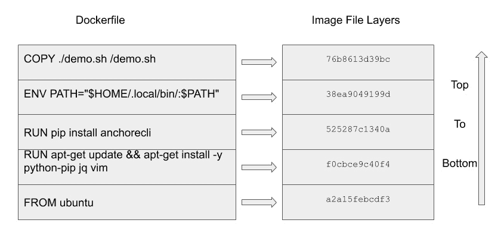
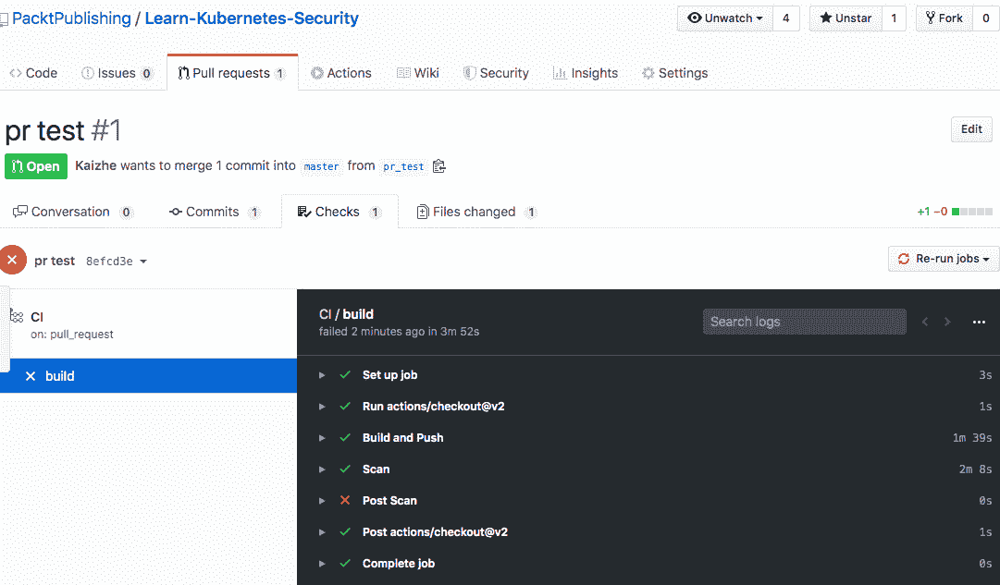

# 第九章：DevOps 流水线中的图像扫描

在开发生命周期的早期阶段发现缺陷和漏洞是一个好的做法。在早期阶段识别问题并加以修复有助于提高应用程序的稳健性和稳定性。它还有助于减少生产环境中的攻击面。保护 Kubernetes 集群必须覆盖整个 DevOps 流程。与加固容器图像和在工作负载清单中限制强大的安全属性类似，图像扫描可以帮助改善开发方面的安全姿态。但是，图像扫描绝对可以做得更多。

在本章中，首先，我们将介绍图像扫描和漏洞的概念，然后我们将讨论一个名为 Anchore Engine 的流行开源图像扫描工具，并向您展示如何使用它进行图像扫描。最后但同样重要的是，我们将向您展示如何将图像扫描集成到 CI/CD 流水线中。

在本章之后，您应该熟悉图像扫描的概念，并且可以放心地使用 Anchore Engine 进行图像扫描。更重要的是，如果您还没有这样做，您需要开始考虑将图像扫描集成到您的 CI/CD 流水线中的策略。

在本章中，我们将涵盖以下主题：

+   介绍容器图像和漏洞

+   使用 Anchore Engine 扫描图像

+   将图像扫描集成到 CI/CD 流水线中

# 介绍容器图像和漏洞

图像扫描可用于识别图像内部的漏洞或违反最佳实践（取决于图像扫描器的能力）。漏洞可能来自图像内的应用程序库或工具。在我们开始图像扫描之前，最好先了解一些关于容器图像和漏洞的知识。

## 容器图像

容器镜像是一个文件，其中包含了微服务二进制文件、其依赖项、微服务的配置等。如今，应用程序开发人员不仅编写代码来构建微服务，还需要构建一个镜像来容器化应用程序。有时，应用程序开发人员可能不遵循安全最佳实践来编写代码，或者从未经认证的来源下载库。这意味着您自己的应用程序或应用程序依赖的包可能存在漏洞。但不要忘记您使用的基础镜像，其中可能包含另一组脆弱的二进制文件和软件包。因此，首先让我们看一下镜像的样子：

[PRE0]

上面的输出显示了镜像`kaizheh/anchore-cli`的文件层（使用`--no-trunc`标志显示完整命令）。您可能注意到每个文件层都有一个创建它的相应命令。每个命令之后都会创建一个新的文件层，这意味着镜像的内容已经逐层更新（基本上，Docker 是按写时复制工作的），您仍然可以看到每个文件层的大小。这很容易理解：当您安装新的软件包或向基础添加文件时，镜像的大小会增加。`missing`镜像 ID 是一个已知的问题，因为 Docker Hub 只存储叶层的摘要，而不是父镜像中的中间层。然而，上述镜像历史确实说明了镜像在 Dockerfile 中的情况，如下所示：

[PRE1]

上述 Dockerfile 的工作原理描述如下：

1.  构建`kaizheh/anchore-cli`镜像时，我选择从`ubuntu`构建。

1.  然后，我安装了`python-pip`，`jq`和`vim`软件包。

1.  接下来，我使用`pip`安装了`anchore-cli`，这是我在上一步中安装的。

1.  然后我配置了环境变量路径。

1.  最后，我将一个名为`demo.sh`的 shell 脚本复制到了镜像中。

下图显示了镜像文件层映射到 Dockerfile 指令：

图 9.1 - Dockerfile 指令映射到镜像文件层

你不必记住每一层添加了什么。最终，容器镜像是一个压缩文件，其中包含了应用程序所需的所有二进制文件和软件包。当从镜像创建容器时，容器运行时会提取镜像，然后为镜像的提取内容创建一个目录，然后在启动之前为镜像中的入口应用程序配置 chroot、cgroup、Linux 命名空间、Linux 权限等。

现在你知道了容器运行时启动容器的魔法。但你仍然不确定你的镜像是否存在漏洞，以至于可以轻易被黑客攻击。让我们看看镜像扫描到底是做什么。

## 检测已知漏洞

人们会犯错误，开发人员也一样。如果应用程序中的缺陷是可以利用的，这些缺陷就会成为安全漏洞。漏洞有两种类型，一种是已经被发现的，而另一种则是未知的。安全研究人员、渗透测试人员等都在努力寻找安全漏洞，以减少潜在的妥协。一旦安全漏洞被修补，开发人员会将补丁作为应用程序的更新。如果这些更新没有及时应用，应用程序就有被攻击的风险。如果这些已知的安全问题被恶意人员利用，将给公司造成巨大损失。

在这一部分，我们不会讨论如何寻找安全漏洞。让安全研究人员和道德黑客去做他们的工作。相反，我们将讨论如何通过执行漏洞管理来发现和管理那些由镜像扫描工具发现的已知漏洞。此外，我们还需要了解漏洞是如何在社区中跟踪和共享的。因此，让我们谈谈 CVE 和 NVD。

### 漏洞数据库简介

CVE 代表通用漏洞和暴露。当发现漏洞时，会为其分配一个唯一的 ID，并附有描述和公共参考。通常，描述中会包含受影响的版本信息。这就是一个 CVE 条目。每天都会发现数百个漏洞，并由 MITRE 分配唯一的 CVE ID。

NVD 代表国家漏洞数据库。它同步 CVE 列表。一旦 CVE 列表有新的更新，新的 CVE 将立即显示在 NVD 中。除了 NVD，还有一些其他的漏洞数据库可用，比如 Synk。

简单来说，图像扫描工具的魔法是：图像扫描工具提取图像文件，然后查找图像中所有可用的软件包和库，并在漏洞数据库中查找它们的版本。如果有任何软件包的版本与漏洞数据库中的任何 CVE 描述匹配，图像扫描工具将报告图像中存在漏洞。如果在容器图像中发现漏洞，您不应感到惊讶。那么，您打算怎么处理呢？您需要做的第一件事是保持冷静，不要惊慌。

### 漏洞管理

当您有漏洞管理策略时，就不会惊慌。一般来说，每个漏洞管理策略都将从理解漏洞的可利用性和影响开始，这是基于 CVE 详细信息的。NVD 提供了一个漏洞评分系统，也被称为通用漏洞评分系统（CVSS），以帮助您更好地了解漏洞的严重程度。

根据您对漏洞的理解，需要提供以下信息来计算漏洞分数：

+   攻击向量：利用程序是网络攻击、本地攻击还是物理攻击

+   攻击复杂性：利用漏洞的难度有多大

+   所需权限：利用程序是否需要任何权限，如 root 或非 root

+   用户交互：利用程序是否需要任何用户交互

+   范围：利用程序是否会导致跨安全域

+   机密性影响：利用程序对软件机密性的影响程度

+   完整性影响：利用程序对软件完整性的影响程度

+   可用性影响：利用程序对软件可用性的影响程度

CVSS 计算器可在[`nvd.nist.gov/vuln-metrics/cvss/v3-calculator`](https://nvd.nist.gov/vuln-metrics/cvss/v3-calculator)找到：

图 9.2 - CVSS 计算器

尽管前面截图中的输入字段只涵盖了基本分数指标，但它们作为决定漏洞严重程度的基本因素。还有另外两个指标可以用来评估漏洞的严重程度，但我们不打算在本节中涵盖它们。根据 CVSS（第 3 版），分数有四个范围：

+   **低**: 0.1-3.9

+   **中等**: 4-6.9

+   **高**: 7-8.9

+   **关键**: 9-10

通常，图像扫描工具在报告图像中的任何漏洞时会提供 CVSS 分数。在采取任何响应措施之前，漏洞分析至少还有一步。你需要知道漏洞的严重程度也可能受到你自己环境的影响。让我举几个例子：

+   漏洞只能在 Windows 中被利用，但基本操作系统镜像不是 Windows。

+   漏洞可以从网络访问中被利用，但图像中的进程只发送出站请求，从不接受入站请求。

上述情景展示了 CVSS 分数并不是唯一重要的因素。你应该专注于那些既关键又相关的漏洞。然而，我们的建议仍然是明智地优先处理漏洞，并尽快修复它们。

如果在图像中发现漏洞，最好及早修复。如果在开发阶段发现漏洞，那么你应该有足够的时间来做出响应。如果在运行生产集群中发现漏洞，应该在补丁可用时立即修补图像并重新部署。如果没有补丁可用，那么有一套缓解策略可以防止集群受到损害。

这就是为什么图像扫描工具对你的 CI/CD 流水线至关重要。在一节中涵盖漏洞管理并不现实，但我认为对漏洞管理的基本理解将帮助你充分利用任何图像扫描工具。有一些流行的开源图像扫描工具可用，比如 Anchore、Clair、Trivvy 等等。让我们看一个这样的图像扫描工具和例子。

# 使用 Anchore Engine 扫描图像

Anchore Engine 是一个开源的图像扫描工具。它不仅分析 Docker 图像，还允许用户定义接受图像扫描策略。在本节中，我们将首先对 Anchore Engine 进行高层介绍，然后我们将展示如何使用 Anchore 自己的 CLI 工具`anchore-cli`部署 Anchore Engine 和 Anchore Engine 的基本图像扫描用例。

## Anchore Engine 简介

当图像提交给 Anchore Engine 进行分析时，Anchore Engine 将首先从图像注册表中检索图像元数据，然后下载图像并将图像排队进行分析。以下是 Anchore Engine 将要分析的项目：

+   图像元数据

+   图像层

+   操作系统软件包，如`deb`、`rpm`、`apkg`等

+   文件数据

+   应用程序依赖包：

- Ruby 宝石

- Node.js NPMs

- Java 存档

- Python 软件包

+   文件内容

要在 Kubernetes 集群中使用 Helm 部署 Anchore Engine——CNCF 项目，这是 Kubernetes 集群的软件包管理工具，请运行以下命令：

[PRE2]

Anchore Engine 由几个微服务组成。在 Kubernetes 集群中部署时，您会发现以下工作负载正在运行：

[PRE3]

Anchore Engine 将图像扫描服务解耦为前面日志中显示的微服务：

+   **API**：接受图像扫描请求

+   **目录**：维护图像扫描作业的状态

+   **策略**：加载图像分析结果并执行策略评估

+   **Analyzer**：从图像注册表中拉取图像并执行分析

+   **Simplequeue**：排队图像扫描任务

+   **PostgreSQL**：存储图像分析结果和状态

现在 Anchore Engine 已成功部署在 Kubernetes 集群中，让我们看看如何使用`anchore-cli`进行图像扫描。

## 使用 anchore-cli 扫描图像

Anchore Engine 支持从 RESTful API 和`anchore-cli`访问。`anchore-cli`在迭代使用时非常方便。`anchore-cli`不需要在 Kubernetes 集群中运行。您需要配置以下环境变量以启用对 Anchore Engine 的 CLI 访问：

+   `ANCHORE_CLI_URL`：Anchore Engine API 端点

+   `ANCHORE_CLI_USER`：访问 Anchore Engine 的用户名

+   `ANCHORE_CLI_PASS`：访问 Anchore Engine 的密码

一旦您成功配置了环境变量，您可以使用以下命令验证与 Anchore Engine 的连接：

[PRE4]

输出应该如下所示：

[PRE5]

`anchore-cli` 能够与 Kubernetes 集群中的 Anchore Engine 进行通信。现在让我们使用以下命令扫描一个镜像：

[PRE6]

输出应该如下所示：

[PRE7]

您将从镜像中获得镜像摘要、完整标签等信息。根据镜像大小，Anchore Engine 分析镜像可能需要一些时间。一旦分析完成，您将看到 `Analysis Status` 字段已更新为 `analyzed`。使用以下命令检查镜像扫描状态：

[PRE8]

输出应该如下所示：

[PRE9]

我们之前简要提到了 Anchore Engine 策略；Anchore Engine 策略允许您根据漏洞的严重程度不同定义规则来处理漏洞。在默认的 Anchore Engine 策略中，您将在默认策略中找到以下两条规则。第一条规则如下：

[PRE10]

第一条规则定义了任何具有中等级漏洞的软件包仍将将策略评估结果设置为通过。第二条规则如下：

[PRE11]

第二条规则定义了任何具有高或关键漏洞的软件包将会将策略评估结果设置为失败。镜像分析完成后，使用以下命令检查策略：

[PRE12]

输出应该如下所示：

[PRE13]

因此，镜像 `docker.io/kaizheh/nginx-docker:latest` 未通过默认策略评估。这意味着必须存在一些高或关键级别的漏洞。使用以下命令列出镜像中的所有漏洞：

[PRE14]

输出应该如下所示：

[PRE15]

上述列表显示了镜像中的所有漏洞，包括 CVE ID、软件包名称、严重程度、是否有修复可用以及参考信息。Anchore Engine 策略基本上帮助您过滤掉较不严重的漏洞，以便您可以专注于更严重的漏洞。然后，您可以开始与安全团队进行漏洞分析。

注意

有时，如果一个软件包或库中的高级或关键级别漏洞没有修复可用，您应该寻找替代方案，而不是继续使用有漏洞的软件包。

在接下来的部分，我们将讨论如何将镜像扫描集成到 CI/CD 流水线中。

# 将镜像扫描集成到 CI/CD 流水线中

镜像扫描可以在 DevOps 流水线的多个阶段触发，我们已经讨论了在流水线早期阶段扫描镜像的优势。然而，新的漏洞将被发现，您的漏洞数据库应该不断更新。这表明，即使在构建阶段通过了镜像扫描，也不意味着在运行时阶段会通过，如果发现了新的关键漏洞，并且该漏洞也存在于镜像中。当发生这种情况时，您应该停止工作负载部署，并相应地应用缓解策略。在深入集成之前，让我们看一下适用于镜像扫描的 DevOps 阶段的大致定义:

+   **构建**: 当镜像在 CI/CD 流水线中构建时

+   **部署**: 当镜像即将部署到 Kubernetes 集群时

+   **运行时**: 在镜像部署到 Kubernetes 集群并且容器正在运行时

虽然有许多不同的 CI/CD 流水线和许多不同的镜像扫描工具供您选择，但整合镜像扫描到 CI/CD 流水线中的概念是确保 Kubernetes 工作负载和 Kubernetes 集群的安全。

## 构建阶段的扫描

有许多 CI/CD 工具，例如 Jenkins、Spinnaker 和 Screwdriver，供您使用。在本节中，我们将展示如何将镜像扫描集成到 GitHub 工作流程中。GitHub 中的工作流程是一个可配置的自动化流程，包含多个作业。这类似于 Jenkins 流水线的概念，但是以 YAML 格式定义。具有镜像扫描的简单工作流程就像定义触发器。通常在拉取请求或提交推送时完成，设置构建环境，例如 Ubuntu。

然后在工作流程中定义步骤:

1.  检出 PR 分支。

1.  从分支构建镜像。

1.  将镜像推送到注册表-这是可选的。当本地构建镜像时，应该能够启动镜像扫描器来扫描镜像。

1.  扫描新构建或推送的镜像。

1.  如果违反策略，则失败工作流。

以下是 GitHub 中定义的示例工作流程:

[PRE16]

在构建流水线的第一步中，我使用了`checkout` GitHub 操作来检出分支。GitHub 操作对于工作流程就像编程语言中的函数一样。它封装了您不需要知道的细节，但为您执行任务。它可以接受输入参数并返回结果。在第二步中，我们运行了一些命令来构建图像`kaizheh/anchore-cli`并将图像推送到注册表。在第三步中，我们使用`anchore-cli`来扫描图像（是的，我们使用 Anchore Engine 来扫描我们自己的`anchore-cli`图像）。

请注意，我配置了 GitHub secrets 来存储诸如 Docker Hub 访问令牌、Anchore 用户名和密码等敏感信息。在最后一步，我们故意失败以进行演示。但通常，最后一步会随着评论建议的图像扫描结果而带来通知和响应。您将在 GitHub 中找到工作流程的结果详细信息，如下所示：

图 9.3 – GitHub 图像扫描工作流程

前面的屏幕截图显示了工作流程中每个步骤的状态，当您点击进入时，您将找到每个步骤的详细信息。Anchore 还提供了一个名为 Anchore Container Scan 的图像扫描 GitHub 操作。它在新构建的图像上启动 Anchore Engine 扫描程序，并返回漏洞、清单和可以用于失败构建的通过/失败策略评估。

## 在部署阶段进行扫描

尽管部署是一个无缝的过程，但我想在一个单独的部分提出关于在部署阶段进行图像扫描的两个原因：

+   将应用程序部署到 Kubernetes 集群时，可能会发现新的漏洞，即使它们在构建时通过了图像扫描检查。最好在它们在 Kubernetes 集群中运行时发现漏洞之前阻止它们。

+   图像扫描可以成为 Kubernetes 中验证准入过程的一部分。

我们已经在*第七章*中介绍了`ValidatingAdmissionWebhook`的概念，*身份验证、授权和准入控制*。现在，让我们看看图像扫描如何帮助通过在 Kubernetes 集群中运行之前扫描其图像来验证工作负载。图像扫描准入控制器是来自 Sysdig 的开源项目。它扫描即将部署的工作负载中的图像。如果图像未通过图像扫描策略，工作负载将被拒绝。以下是工作流程图：

图 9.4 - 图像扫描准入工作流

前面的图表显示了基于图像扫描验证的工作负载准入过程：

1.  有一个工作负载创建请求发送到`kube-apiserver`。

1.  `kube-apiserver`根据验证 webhook 配置将请求转发到注册的验证 webhook 服务器。

1.  验证 webhook 服务器从工作负载的规范中提取图像信息，并将其发送到 Anchore Engine API 服务器。

1.  根据图像扫描策略，Anchore Engine 将验证决定作为验证决定返回给服务器。

1.  验证 webhook 服务器将验证决定转发给`kube-apiserver`。

1.  `kube-apiserver`根据来自图像扫描策略评估结果的验证决定，要么允许要么拒绝工作负载。

要部署图像扫描准入控制器，首先要检出 GitHub 存储库（[`github.com/sysdiglabs/image-scanning-admission-controller`](https://github.com/sysdiglabs/image-scanning-admission-controller)），然后运行以下命令：

[PRE17]

然后你应该找到 webhook 服务器和服务已经创建：

[PRE18]

除了 webhook 服务器部署，该脚本还创建了一个`ValidatingWebhookConfiguration`对象来注册图像扫描准入 webhook 服务器，该对象在`generic-validatingewebhookconfig.yaml`中定义到`kube-apiserver`：

[PRE19]

验证 webhook 配置对象基本上告诉`kube-apiserver`将任何 pod 创建请求转发到`image-scan-webhook-system`命名空间中的`webhook-server-service`，并使用`/validating-create-pod` URL 路径。

您可以使用图像扫描准入控制器提供的测试用例来验证您的设置，如下所示：

[PRE20]

在测试中，将在 Kubernetes 集群中部署三个不同的 pod。其中一个存在关键漏洞，违反了图像扫描策略。因此，具有关键漏洞的工作负载将被拒绝。

[PRE21]

前面的输出显示，带有图像`kaizheh/apache-struts2-cve-2017-5638`的工作负载被拒绝了。该图像运行 Apache Struts 2 服务，其中包含一个 CVSS 评分为 10 的关键漏洞（[`nvd.nist.gov/vuln/detail/CVE-2017-5638`](https://nvd.nist.gov/vuln/detail/CVE-2017-5638)）。尽管测试中的 CVE 是旧的，但您应该能够在早期发现它。然而，新的漏洞将被发现，漏洞数据库将不断更新。为即将部署在 Kubernetes 集群中的任何工作负载设置一个门卫是至关重要的。图像扫描作为验证入场是 Kubernetes 部署的一个良好安全实践。现在，让我们谈谈在 Kubernetes 集群中运行时阶段的图像扫描。

## 运行时阶段的扫描

干得好！工作负载的图像在构建和部署阶段通过了图像扫描策略评估。但这并不意味着图像没有漏洞。请记住，新的漏洞将被发现。通常，图像扫描器使用的漏洞数据库将每隔几个小时更新一次。一旦漏洞数据库更新，您应该触发图像扫描器扫描在 Kubernetes 集群中正在运行的图像。有几种方法可以做到这一点：

+   直接在每个工作节点上扫描拉取的图像。要在工作节点上扫描图像，您可以使用诸如 Sysdig 的`secure-inline-scan`工具（[`github.com/sysdiglabs/secure-inline-scan`](https://github.com/sysdiglabs/secure-inline-scan)）。

+   定期在注册表中扫描图像，直接在漏洞数据库更新后进行扫描。

再次强调，一旦发现正在使用的图像中存在重大漏洞，您应该修补易受攻击的图像并重新部署，以减少攻击面。

# 总结

在本章中，我们首先简要讨论了容器图像和漏洞。然后，我们介绍了一个开源图像扫描工具 Anchore Engine，并展示了如何使用`anchore-cli`进行图像扫描。最后但同样重要的是，我们讨论了如何将图像扫描集成到 CI/CD 流水线的三个不同阶段：构建、部署和运行时。图像扫描在保护 DevOps 流程方面表现出了巨大的价值。一个安全的 Kubernetes 集群需要保护整个 DevOps 流程。

现在，您应该可以轻松部署 Anchore Engine 并使用`anchore-cli`来触发图像扫描。一旦您在图像中发现任何漏洞，请使用 Anchore Engine 策略将其过滤掉，并了解其真正影响。我知道这需要时间，但在您的 CI/CD 流水线中设置图像扫描是必要且很棒的。通过这样做，您将使您的 Kubernetes 集群更加安全。

在下一章中，我们将讨论 Kubernetes 集群中的资源管理和实时监控。

# 问题

让我们使用一些问题来帮助您更好地理解本章内容：

1.  哪个 Docker 命令可以用来列出图像文件层？

1.  根据 CVSS3 标准，哪个漏洞评分范围被认为是高风险的？

1.  `anchore-cli`命令是什么，用于开始扫描图像？

1.  `anchore-cli`命令是什么，用于列出图像的漏洞？

1.  `anchore-cli`命令是什么，用于评估符合 Anchore Engine 策略的图像？

1.  为什么将图像扫描集成到 CI/CD 流水线中如此重要？

# 进一步参考

+   要了解更多关于 Anchore Engine 的信息，请阅读：[`docs.anchore.com/current/docs/engine/general/`](https://docs.anchore.com/current/docs/engine/general/)

+   要了解更多关于 Anchore 扫描操作的信息：[`github.com/marketplace/actions/anchore-container-scan`](https://github.com/marketplace/actions/anchore-container-scan)

+   要了解更多关于 Sysdig 的图像扫描准入控制器的信息：[`github.com/sysdiglabs/image-scanning-admission-controller`](https://github.com/sysdiglabs/image-scanning-admission-controller)

+   要了解更多关于 GitHub actions 的信息：[`help.github.com/en/actions`](https://help.github.com/en/actions)
