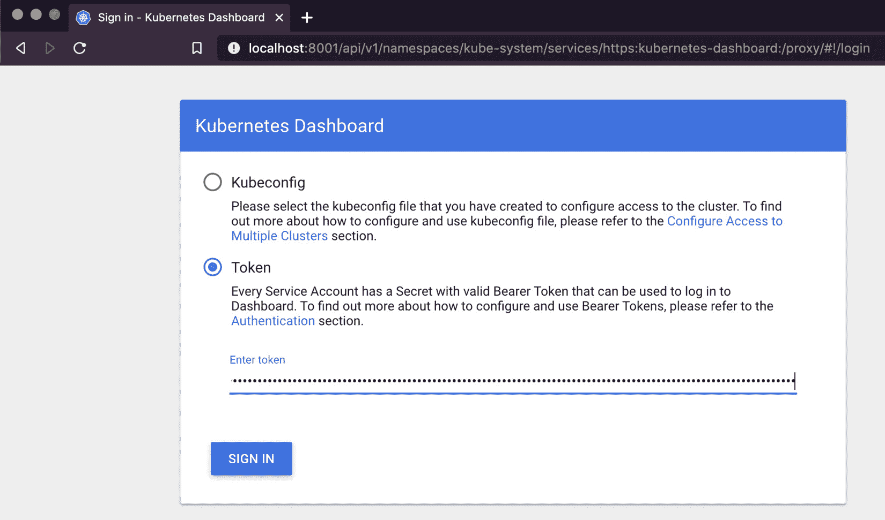
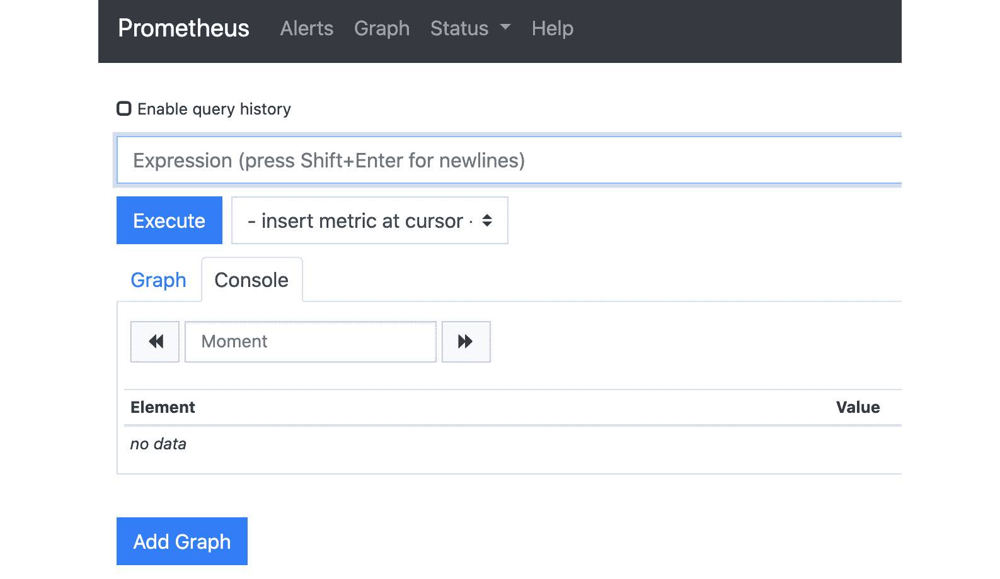
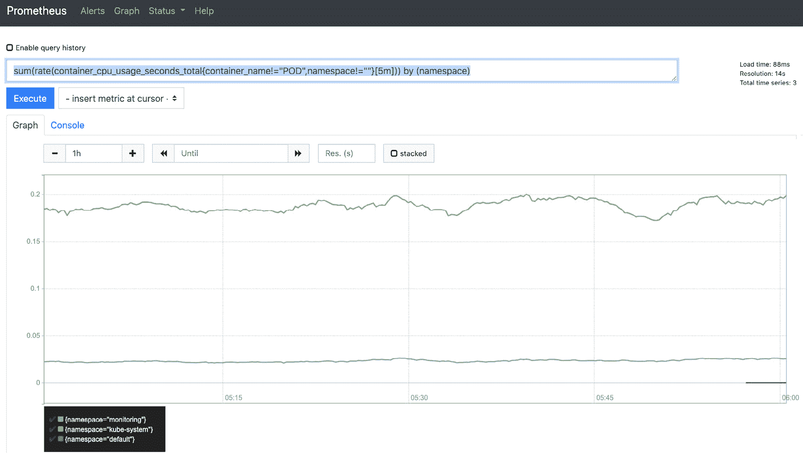
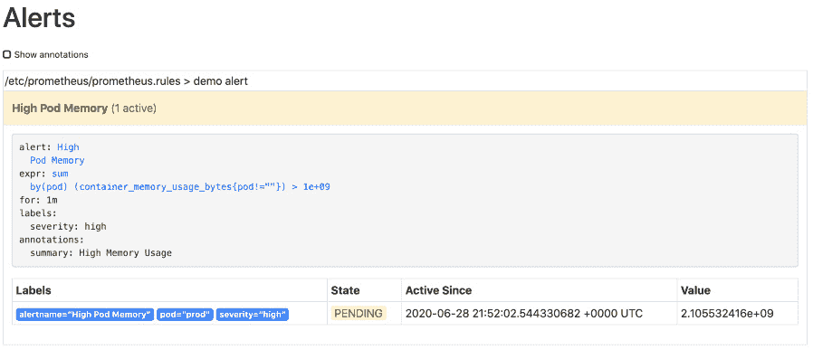
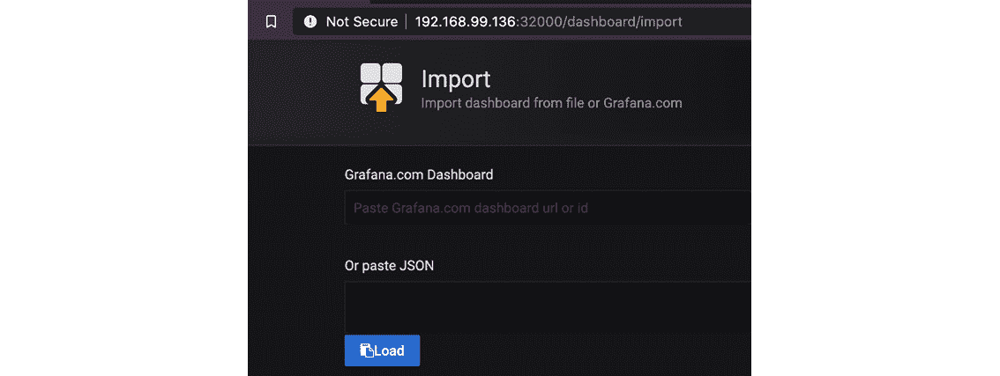
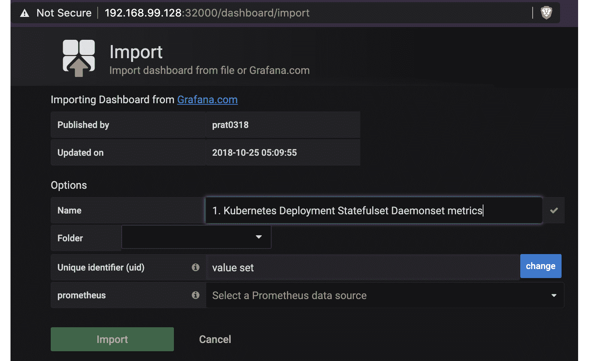
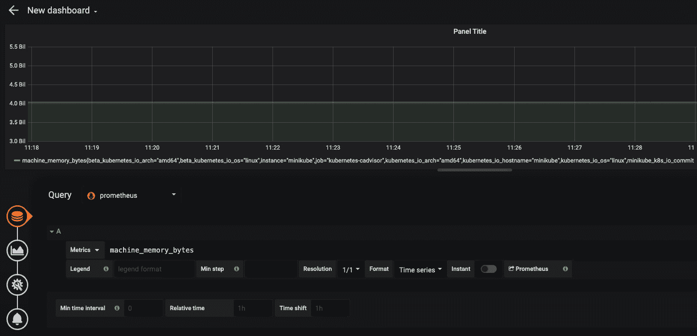
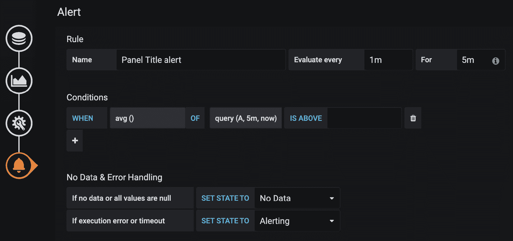

# *第十章*：Kubernetes 集群的实时监控和资源管理

服务的可用性是**机密性、完整性和可用性**（**CIA**）三要素中的关键组成部分之一。曾经有许多恶意攻击者使用不同的技术来破坏用户服务的可用性。一些对关键基础设施的攻击，如电力网络和银行，导致了经济上的重大损失。其中最显著的攻击之一是对亚马逊 AWS Route 53 基础设施的攻击，导致全球核心 IT 服务中断。为了避免这样的问题，基础设施工程师实时监控资源使用和应用程序健康状况，以确保组织提供的服务的可用性。实时监控通常与警报系统相结合，当观察到服务中断的症状时通知利益相关者。

在本章中，我们将讨论如何确保 Kubernetes 集群中的服务始终正常运行。我们将首先讨论单体环境中的监控和资源管理。接下来，我们将讨论资源请求和资源限制，这是 Kubernetes 资源管理的核心概念。然后，我们将看看 Kubernetes 提供的诸如`LimitRanger`之类的工具，用于资源管理，然后将重点转移到资源监控。我们将研究内置监视器，如 Kubernetes 仪表板和 Metrics Server。最后，我们将研究一些开源工具，如 Prometheus 和 Grafana，用于监视 Kubernetes 集群的状态。

在本章中，我们将讨论以下内容：

+   在单体环境中进行实时监控和管理

+   在 Kubernetes 中管理资源

+   在 Kubernetes 中监控资源

# 在单体环境中进行实时监控和管理

资源管理和监控在单体环境中同样很重要。在单体环境中，基础设施工程师经常将 Linux 工具（如`top`、`ntop`和`htop`）的输出导入数据可视化工具，以监视虚拟机的状态。在托管环境中，内置工具如 Amazon CloudWatch 和 Azure 资源管理器有助于监视资源使用情况。

除了资源监控之外，基础设施工程师还会主动为进程和其他实体分配最低资源需求和使用限制。这确保了服务有足够的资源可用。此外，资源管理还确保不良行为或恶意进程不会占用资源并阻止其他进程工作。对于单体部署，诸如 CPU、内存和生成的进程等资源会被限制在不同的进程中。在 Linux 上，可以使用`prlimit`来限制进程的限制：

```
$prlimit --nproc=2 --pid=18065
```

这个命令设置了父进程可以生成的子进程的限制为`2`。设置了这个限制后，如果一个 PID 为`18065`的进程尝试生成超过`2`个子进程，它将被拒绝。

与单体环境类似，Kubernetes 集群运行多个 pod、部署和服务。如果攻击者能够生成 Kubernetes 对象，比如 pod 或部署，攻击者可以通过耗尽 Kubernetes 集群中可用的资源来发动拒绝服务攻击。如果没有足够的资源监控和资源管理，集群中运行的服务不可用可能会对组织造成经济影响。

# 在 Kubernetes 中管理资源

Kubernetes 提供了主动分配和限制 Kubernetes 对象可用资源的能力。在本节中，我们将讨论资源请求和限制，这构成了 Kubernetes 中资源管理的基础。接下来，我们将探讨命名空间资源配额和限制范围。使用这两个功能，集群管理员可以限制不同 Kubernetes 对象可用的计算和存储资源。

## 资源请求和限制

正如我们在*第一章*中讨论的那样，*Kubernetes 架构*中，默认的调度程序是`kube-scheduler`，它运行在主节点上。`kube-scheduler`会找到最适合的节点来运行未调度的 pod。它通过根据 pod 请求的存储和计算资源来过滤节点来实现这一点。如果调度程序无法为 pod 找到节点，pod 将保持在挂起状态。此外，如果节点的所有资源都被 pod 利用，节点上的`kubelet`将清理死掉的 pod - 未使用的镜像。如果清理不能减轻压力，`kubelet`将开始驱逐那些消耗更多资源的 pod。

资源请求指定了 Kubernetes 对象保证获得的资源。不同的 Kubernetes 变体或云提供商对资源请求有不同的默认值。可以在工作负载的规范中指定 Kubernetes 对象的自定义资源请求。资源请求可以针对 CPU、内存和 HugePages 进行指定。让我们看一个资源请求的例子。

让我们创建一个没有在 `yaml` 规范中指定资源请求的 Pod，如下所示：

```
apiVersion: v1
kind: Pod
metadata:
  name: demo
spec:
  containers:
  - name: demo
```

Pod 将使用部署的默认资源请求：

```
$kubectl get pod demo —output=yaml
apiVersion: v1
kind: Pod
metadata:
  annotations:
    kubectl.kubernetes.io/last-applied-configuration: |
      {"apiVersion":"v1","kind":"Pod","metadata":{"annotations":{},"name":"demo","namespace":"default"},"spec":{"containers":[{"image":"nginx","name":"demo"}]}}
    kubernetes.io/limit-ranger: 'LimitRanger plugin set: cpu request for container
      demo'
  creationTimestamp: "2020-05-07T21:54:47Z"
  name: demo
  namespace: default
  resourceVersion: "3455"
  selfLink: /api/v1/namespaces/default/pods/demo
  uid: 5e783495-90ad-11ea-ae75-42010a800074
spec:
  containers:
  - image: nginx
    imagePullPolicy: Always
    name: demo
    resources:
      requests:
        cpu: 100m
```

对于前面的例子，Pod 的默认资源请求是 0.1 CPU 核心。现在让我们向 `.yaml` 规范中添加一个资源请求并看看会发生什么：

```
apiVersion: v1
kind: Pod
metadata:
  name: demo
spec:
  containers:
  - name: demo
    image: nginx
    resources:
      limits:
          hugepages-2Mi: 100Mi
      requests:
        cpu: 500m         memory: 300Mi         hugepages-2Mi: 100Mi 
```

这个规范创建了一个具有 0.5 CPU 核心、300 MB 和 `hugepages-2Mi` 的 100 MB 的资源请求的 Pod。您可以使用以下命令检查 Pod 的资源请求：

```
$kubectl get pod demo —output=yaml
apiVersion: v1
kind: Pod
metadata:
  creationTimestamp: "2020-05-07T22:02:16Z"
  name: demo-1
  namespace: default
  resourceVersion: "5030"
  selfLink: /api/v1/namespaces/default/pods/demo-1
  uid: 6a276dd2-90ae-11ea-ae75-42010a800074
spec:
  containers:
  - image: nginx
    imagePullPolicy: Always
    name: demo
    resources:
      limits:
        hugepages-2Mi: 100Mi
      requests:
        cpu: 500m
        hugepages-2Mi: 100Mi
        memory: 300Mi
```

从输出中可以看出，Pod 使用了 0.5 CPU 核心、300 MB `内存` 和 100 MB 2 MB `hugepages` 的自定义资源请求，而不是默认的 1 MB。

另一方面，限制是 Pod 可以使用的资源的硬限制。限制指定了 Pod 应该被允许使用的最大资源。如果需要的资源超过了限制中指定的资源，Pod 将受到限制。与资源请求类似，您可以为 CPU、内存和 HugePages 指定限制。让我们看一个限制的例子：

```
$ cat stress.yaml
apiVersion: v1
kind: Pod
metadata:
  name: demo
spec:
  containers:
  - name: demo
    image: polinux/stress
    command: ["stress"]
    args: ["--vm", "1", "--vm-bytes", "150M", "--vm-hang", "1"]
```

这个 Pod 启动一个尝试在启动时分配 `150M` 内存的压力进程。如果 `.yaml` 规范中没有指定限制，Pod 将可以正常运行：

```
$ kubectl create -f stress.yaml pod/demo created
$ kubectl get pods NAME         READY   STATUS             RESTARTS   AGE demo         1/1     Running            0          3h
```

限制被添加到 Pod 的 `yaml` 规范的容器部分：

```
containers:
  - name: demo
    image: polinux/stress
    resources:
      limits:
        memory: "150Mi"
    command: ["stress"]
args: ["--vm", "1", "--vm-bytes", "150M", "--vm-hang", "1"]
```

压力进程无法运行，Pod 进入 `CrashLoopBackOff` 状态：

```
$ kubectl get pods
NAME     READY   STATUS             RESTARTS   AGE
demo     1/1     Running            0          44s
demo-1   0/1     CrashLoopBackOff   1          5s
```

当您描述 Pod 时，可以看到 Pod 被终止并出现 `OOMKilled` 错误：

```
$ kubectl describe pods demo
Name:         demo
Namespace:    default
...
Containers:
  demo:
    Container ID:  docker://a43de56a456342f7d53fa9752aa4fa7366 cd4b8c395b658d1fc607f2703750c2
    Image:         polinux/stress
    Image ID:      docker-pullable://polinux/stress@sha256:b61 44f84f9c15dac80deb48d3a646b55c7043ab1d83ea0a697c09097aaad21aa
...
    Command:
      stress
    Args:
      --vm
      1
      --vm-bytes
      150M
      --vm-hang
      1
    State:          Waiting
      Reason:       CrashLoopBackOff
    Last State:     Terminated
      Reason:       OOMKilled
      Exit Code:    1
      Started:      Mon, 04 May 2020 10:48:14 -0700
      Finished:     Mon, 04 May 2020 10:48:14 -0700
```

资源请求和限制被转换、映射到 `docker` 参数——`—cpu-shares` 和 `—memory` 标志——并传递给容器运行时。

我们看了资源请求和限制如何为 Pod 工作的例子，但是相同的例子也适用于 DaemonSet、Deployments 和 StatefulSets。接下来，我们将看一下命名空间资源配额如何帮助设置命名空间可以使用的资源的上限。

## 命名空间资源配额

命名空间的资源配额有助于定义命名空间内所有对象可用的资源请求和限制。使用资源配额，您可以限制以下内容：

+   `request.cpu`：命名空间中所有对象的 CPU 的最大资源请求。

+   `request.memory`：命名空间中所有对象的内存的最大资源请求。

+   `limit.cpu`：命名空间中所有对象的 CPU 的最大资源限制。

+   `limit.memory`：命名空间中所有对象的内存的最大资源限制。

+   `requests.storage`：命名空间中存储请求的总和不能超过这个值。

+   `count`：资源配额也可以用来限制集群中不同 Kubernetes 对象的数量，包括 pod、服务、PersistentVolumeClaims 和 ConfigMaps。

默认情况下，云提供商或不同的变体对命名空间应用了标准限制。在**Google Kubernetes Engine**（**GKE**）上，`cpu`请求被设置为 0.1 CPU 核心：

```
$ kubectl describe namespace default
Name:         default
Labels:       <none>
Annotations:  <none>
Status:       Active
Resource Quotas
 Name:                       gke-resource-quotas
 Resource                    Used  Hard
 --------                    ---   ---
 count/ingresses.extensions  0     100
 count/jobs.batch            0     5k
 pods                        2     1500
 services                    1     500
Resource Limits
 Type       Resource  Min  Max  Default Request  Default Limit  Max Limit/Request Ratio
 ----       --------  ---  ---  ---------------  -------------  -----------------------
 Container  cpu       -    -    100m             -              -
```

让我们看一个例子，当资源配额应用到一个命名空间时会发生什么：

1.  创建一个命名空间演示：

```
$ kubectl create namespace demo
namespace/demo created
```

1.  定义一个资源配额。在这个例子中，配额将 CPU 的资源请求限制为`1` CPU：

```
$ cat quota.yaml
apiVersion: v1
kind: ResourceQuota
metadata:
  name: compute-resources
spec:
  hard:
    requests.cpu: "1"
```

1.  通过以下命令将配额应用到命名空间：

```
$ kubectl apply -f quota.yaml --namespace demo
resourcequota/compute-resources created
```

1.  您可以通过执行以下命令来检查资源配额是否成功应用到命名空间：

```
$ kubectl describe namespace demo
Name:         demo
Labels:       <none>
Annotations:  <none>
Status:       Active
Resource Quotas
 Name:         compute-resources
 Resource      Used  Hard
 --------      ---   ---
 requests.cpu  0     1
 Name:                       gke-resource-quotas
 Resource                    Used  Hard
 --------                    ---   ---
 count/ingresses.extensions  0     100
 count/jobs.batch            0     5k
 pods                        0     1500
 services                    0     500
```

1.  现在，如果我们尝试创建使用`1` CPU 的两个 pod，第二个请求将失败，并显示以下错误：

```
$ kubectl apply -f nginx-cpu-1.yaml --namespace demo
Error from server (Forbidden): error when creating "nginx-cpu-1.yaml": pods "demo-1" is forbidden: exceeded quota: compute-resources, requested: requests.cpu=1, used: requests.cpu=1, limited: requests.cpu=1
```

资源配额确保了命名空间中 Kubernetes 对象的服务质量。

## LimitRanger

我们在*第七章*中讨论了`LimitRanger`准入控制器，*身份验证、授权和准入控制*。集群管理员可以利用限制范围来确保行为不端的 pod、容器或`PersistentVolumeClaims`不会消耗所有可用资源。

要使用限制范围，启用`LimitRanger`准入控制器：

```
$ ps aux | grep kube-api
root      3708  6.7  8.7 497216 345256 ?       Ssl  01:44   0:10 kube-apiserver --advertise-address=192.168.99.116 --allow-privileged=true --authorization-mode=Node,RBAC --client-ca-file=/var/lib/minikube/certs/ca.crt --enable-admission-plugins=NamespaceLifecycle,LimitRanger,ServiceAccount,DefaultStorageClass,DefaultTolerationSeconds,NodeRestriction,MutatingAdmissionWebhook,ValidatingAdmissionWebhook,ResourceQuota
```

使用 LimitRanger，我们可以对存储和计算资源强制执行`default`、`min`和`max`限制。集群管理员为诸如 pod、容器和 PersistentVolumeClaims 等对象创建一个限制范围。对于任何对象创建或更新的请求，LimitRanger 准入控制器会验证请求是否违反了任何限制范围。如果请求违反了任何限制范围，将发送 403 Forbidden 响应。

让我们看一个简单限制范围的例子：

1.  创建一个将应用限制范围的命名空间：

```
$kubectl create namespace demo
```

1.  为命名空间定义一个`LimitRange`：

```
$ cat limit_range.yaml
apiVersion: "v1"
kind: "LimitRange"
metadata:
  name: limit1
  namespace: demo
spec:
  limits:
  - type: "Container"
    max:
      memory: 512Mi
      cpu: 500m
    min:
      memory: 50Mi
      cpu: 50m
```

1.  验证`limitrange`是否被应用：

```
$ kubectl get limitrange -n demo
NAME     CREATED AT
limit1   2020-04-30T02:06:18Z
```

1.  创建一个违反限制范围的 pod：

```
$cat nginx-bad.yaml
apiVersion: v1
kind: Pod
metadata:
  name: nginx-bad
spec:
  containers:
  - name: nginx-bad
    image: nginx-bad
    resources:
      limits:
        memory: "800Mi"
        cpu: "500m"
```

这个请求将被拒绝：

```
$ kubectl apply -f nginx-bad.yaml -n demo
Error from server (Forbidden): error when creating "nginx-bad.yaml": pods "nginx-bad" is forbidden: maximum memory usage per Container is 512Mi, but limit is 800M
```

如果 LimitRanger 指定了 CPU 或内存，所有的 pod 和容器都应该有 CPU 或内存的请求或限制。LimitRanger 在 API 服务器接收到创建或更新对象的请求时起作用，但在运行时不起作用。如果一个 pod 在限制被应用之前就违反了限制，它将继续运行。理想情况下，限制应该在命名空间创建时应用。

现在我们已经看了一些可以用于积极资源管理的功能，我们转而看一些可以帮助我们监控集群并在事态恶化之前通知我们的工具。

# 监控 Kubernetes 资源

正如我们之前讨论的，资源监控是确保集群中服务可用性的重要步骤。资源监控可以发现集群中服务不可用的早期迹象或症状。资源监控通常与警报管理相结合，以确保利益相关者在观察到集群中出现任何问题或与任何问题相关的症状时尽快收到通知。

在这一部分，我们首先看一些由 Kubernetes 提供的内置监视器，包括 Kubernetes Dashboard 和 Metrics Server。我们将看看如何设置它，并讨论如何有效地使用这些工具。接下来，我们将看一些可以插入到您的 Kubernetes 集群中并提供比内置工具更深入的洞察力的开源工具。

## 内置监视器

让我们来看一些由 Kubernetes 提供的用于监控 Kubernetes 资源和对象的工具 - Metrics Server 和 Kubernetes Dashboard。

### Kubernetes Dashboard

Kubernetes Dashboard 为集群管理员提供了一个 Web UI，用于创建、管理和监控集群对象和资源。集群管理员还可以使用仪表板创建 pod、服务和 DaemonSets。仪表板显示了集群的状态和集群中的任何错误。

Kubernetes 仪表板提供了集群管理员在集群中管理资源和对象所需的所有功能。鉴于仪表板的功能，应该将对仪表板的访问限制在集群管理员范围内。从 v1.7.0 版本开始，仪表板具有登录功能。2018 年，仪表板中发现了一个特权升级漏洞（CVE-2018-18264），允许未经身份验证的用户登录到仪表板。对于这个问题，尚无已知的野外利用，但这个简单的漏洞可能会对许多 Kubernetes 发行版造成严重破坏。

当前的登录功能允许使用服务账户和 `kubeconfig` 登录。建议使用服务账户令牌来访问 Kubernetes 仪表板：


图 10.1 – Kubernetes 仪表板

为了允许服务账户使用 Kubernetes 仪表板，您需要将 `cluster-admin` 角色添加到服务账户中。让我们看一个示例，说明如何使用服务账户来访问 Kubernetes 仪表板：

1.  在默认命名空间中创建一个服务账户：

```
$kubectl create serviceaccount dashboard-admin-sa
```

1.  将 `cluster-admin` 角色与服务账户关联：

```
$kubectl create clusterrolebinding dashboard-admin-sa --clusterrole=cluster-admin --serviceaccount=default:dashboard-admin-sa
```

1.  获取服务账户的令牌：

```
$ kubectl describe serviceaccount dashboard-admin-sa
Name:                dashboard-admin-sa
Namespace:           default
Labels:              <none>
Annotations:         <none>
Image pull secrets:  <none>
Mountable secrets:   dashboard-admin-sa-token-5zwpw
Tokens:              dashboard-admin-sa-token-5zwpw
Events:              <none>
```

1.  使用以下命令获取服务账户的令牌：

```
$ kubectl describe secrets dashboard-admin-sa-token-5zwpw
Name:         dashboard-admin-sa-token-5zwpw
Namespace:    default
Labels:       <none>
Annotations:  kubernetes.io/service-account.name: dashboard-admin-sa
              kubernetes.io/service-account.uid: 83218a92-915c-11ea-b763-42010a800022
Type:  kubernetes.io/service-account-token
Data
====
ca.crt:     1119 bytes
namespace:  7 bytes
token:      <token>
```

1.  使用服务账户令牌登录到仪表板：



图 10.2 – Kubernetes 仪表板登录

使用 Kubernetes 仪表板，管理员可以了解资源可用性、资源分配、Kubernetes 对象和事件日志：


图 10.3 – Kubernetes 仪表板 – 资源分配

上述截图显示了节点上资源请求和限制的资源分配情况。以下截图突出显示了 Kubernetes 仪表板上节点的事件：


图 10.4 – Kubernetes 仪表板 – 事件日志

Kubernetes 仪表板作为一个容器在主节点上运行。您可以通过枚举主节点上的 Docker 容器来查看这一点：

```
$ docker ps | grep dashboard
a963e6e6a54b        3b08661dc379           "/metrics-sidecar"       4 minutes ago       Up 4 minutes                            k8s_dashboard-metrics-scraper_dashboard-metrics-scraper-84bfdf55ff-wfxdm_kubernetes-dashboard_5a7ef2a8-b3b4-4e4c-ae85-11cc8b61c1c1_0
c28f0e2799c1        cdc71b5a8a0e           "/dashboard --insecu…"   4 minutes ago       Up 4 minutes                            k8s_kubernetes-dashboard_kubernetes-dashboard-bc446cc64-czmn8_kubernetes-dashboard_40630c71-3c6a-447b-ae68-e23603686ede_0
10f0b024a13f        k8s.gcr.io/pause:3.2   "/pause"                 4 minutes ago       Up 4 minutes                            k8s_POD_dashboard-metrics-scraper-84bfdf55ff-wfxdm_kubernetes-dashboard_5a7ef2a8-b3b4-4e4c-ae85-11cc8b61c1c1_0
f9c1e82174d8        k8s.gcr.io/pause:3.2   "/pause"                 4 minutes ago       Up 4 minutes                            k8s_POD_kubernetes-dashboard-bc446cc64-czmn8_kubernetes-dashboard_40630c71-3c6a-447b-ae68-e23603686ede_0
```

仪表板进程在主节点上以一组参数运行：

```
$ ps aux | grep dashboard
dbus     10727  0.9  1.1 136752 46240 ?        Ssl  05:46   0:02 /dashboard --insecure-bind-address=0.0.0.0 --bind-address=0.0.0.0 --namespace=kubernetes-dashboard --enable-skip-login --disable-settings-authorizer
docker   11889  0.0  0.0  11408   556 pts/0    S+   05:51   0:00 grep dashboard
```

确保仪表板容器使用以下参数运行：

+   **禁用不安全端口**：`--insecure-port`允许 Kubernetes 仪表板接收 HTTP 请求。确保在生产环境中禁用它。

+   **禁用不安全的地址**：应禁用`--insecure-bind-address`，以避免 Kubernetes 仪表板可以通过 HTTP 访问的情况。

+   **将地址绑定到本地主机**：`--bind-address`应设置为`127.0.0.1`，以防止主机通过互联网连接。

+   **启用 TLS**：使用`tls-cert-file`和`tls-key-file`来通过安全通道访问仪表板。

+   **确保启用令牌身份验证模式**：可以使用`--authentication-mode`标志指定身份验证模式。默认情况下，它设置为`token`。确保仪表板不使用基本身份验证。

+   **禁用不安全登录**：当仪表板可以通过 HTTP 访问时，会使用不安全登录。这应该默认禁用。

+   **禁用跳过登录**：跳过登录允许未经身份验证的用户访问 Kubernetes 仪表板。`--enable-skip-login`启用跳过登录；这在生产环境中不应存在。

+   **禁用设置授权器**：`--disable-settings-authorizer`允许未经身份验证的用户访问设置页面。在生产环境中应禁用此功能。

### Metrics Server

Metrics Server 使用每个节点上的`kubelet`公开的摘要 API 聚合集群使用数据。它使用`kube-aggregator`在`kube-apiserver`上注册。Metrics Server 通过 Metrics API 公开收集的指标，这些指标被水平 Pod 自动缩放器和垂直 Pod 自动缩放器使用。用于调试集群的`kubectl top`也使用 Metrics API。Metrics Server 特别设计用于自动缩放。

在某些 Kubernetes 发行版上，默认情况下启用了 Metrics Server。您可以使用以下命令在`minikube`上启用它：

```
$ minikube addons enable metrics-server
```

您可以使用以下命令检查 Metrics Server 是否已启用：

```
$ kubectl get apiservices | grep metrics
v1beta1.metrics.k8s.io                 kube-system/metrics-server   True        7m17s
```

启用 Metrics Server 后，需要一些时间来查询摘要 API 并关联数据。您可以使用`kubectl top node`来查看当前的指标：

```
$ kubectl top node
NAME       CPU(cores)   CPU%   MEMORY(bytes)   MEMORY%
minikube   156m         7%     1140Mi          30%
$ kubectl top pod
NAME         CPU(cores)   MEMORY(bytes)
nginx-good   0m           2Mi
```

与其他服务和组件类似，Metrics Server 也有配置参数。在生产集群中，请确保 Metrics Server 不使用`--kubelet-insecure-tls`标志，该标志允许 Metrics Server 跳过 CA 对证书的验证。

## 第三方监控工具

第三方监控工具集成到 Kubernetes 中，提供了更多功能和对 Kubernetes 资源健康的洞察。在本节中，我们将讨论 Prometheus 和 Grafana，它们是开源社区中最流行的监控工具。

## Prometheus 和 Grafana

Prometheus 是由 SoundCloud 开发并被 CNCF 采用的开源仪表和数据收集框架。Prometheus 可以用来查看不同数据点的时间序列数据。Prometheus 使用拉取系统。它发送一个称为抓取的 HTTP 请求，从系统组件（包括 API 服务器、`node-exporter`和`kubelet`）获取数据。抓取的响应和指标存储在 Prometheus 服务器上的自定义数据库中。

让我们看看如何设置 Prometheus 来监视 Kubernetes 中的一个命名空间：

1.  创建一个命名空间：

```
$kubectl create namespace monitoring
```

1.  定义一个集群角色来读取 Kubernetes 对象，如 pods、nodes 和 services，并将角色绑定到一个服务账户。在这个例子中，我们使用默认的服务账户：

```
$ cat prometheus-role.yaml
apiVersion: rbac.authorization.k8s.io/v1beta1
kind: ClusterRole
metadata:
  name: prometheus
rules:
- apiGroups: [""]
  resources:
  - nodes
  - nodes/proxy
  - services
  - endpoints
  - pods
  verbs: ["get", "list", "watch"]
- apiGroups:
  - extensions
  resources:
  - ingresses
  verbs: ["get", "list", "watch"]
- nonResourceURLs: ["/metrics"]
  verbs: ["get"]
$ kubectl create -f prometheus-role.yaml
clusterrole.rbac.authorization.k8s.io/prometheus created
```

现在，我们创建一个角色绑定，将角色与默认服务账户关联起来：

```
$ cat prometheus-rolebinding.yaml
apiVersion: rbac.authorization.k8s.io/v1beta1
kind: ClusterRoleBinding
metadata:
  name: prometheus
roleRef:
  apiGroup: rbac.authorization.k8s.io
  kind: ClusterRole
  name: prometheus
subjects:
- kind: ServiceAccount
  name: default
  namespace: monitoring
```

1.  Prometheus 使用 ConfigMap 来指定抓取规则。以下规则抓取`kube-apiserver`。可以定义多个抓取来获取指标：

```
$ cat config_prometheus.yaml apiVersion: v1
kind: ConfigMap
metadata:
  name: prometheus-server-conf
  labels:
    name: prometheus-server-conf
  namespace: monitoring
data:
  prometheus.yml: |-
    global:
      scrape_interval: 5s
      evaluation_interval: 5s
  scrape_configs:    - job_name: 'kubernetes-apiservers'
      kubernetes_sd_configs:
      - role: endpoints
      scheme: https
      tls_config:
        ca_file: /var/run/secrets/kubernetes.io/serviceaccount/ca.crt
      bearer_token_file: /var/run/secrets/kubernetes.io/serviceaccount/token
      relabel_configs:
      - source_labels: [__meta_kubernetes_namespace, __meta_kubernetes_service_name, __meta_kubernetes_endpoint_port_name]
        action: keep
        regex: default;kubernetes;https
```

1.  为 Prometheus 创建一个部署：

```
spec:
      containers:
        - name: prometheus
          image: prom/prometheus:v2.12.0
          args:
            - "--config.file=/etc/prometheus/prometheus.yml"
            - "--storage.tsdb.path=/prometheus/"
          ports:
            - containerPort: 9090
          volumeMounts:
            - name: prometheus-config-volume
              mountPath: /etc/prometheus/
            - name: prometheus-storage-volume
              mountPath: /prometheus/
      volumes:
        - name: prometheus-config-volume
          configMap:
            defaultMode: 420
            name: prometheus-server-conf
        - name: prometheus-storage-volume
          emptyDir: {}
```

1.  部署成功后，可以使用端口转发或 Kubernetes 服务来访问仪表板：

```
$ kubectl port-forward <prometheus-pod> 8080:9090 -n monitoring
```

这样可以为 Prometheus pod 启用端口转发。现在，您可以使用端口`8080`上的集群 IP 来访问它：



图 10.5 – Prometheus 仪表板

查询可以输入为表达式，并查看结果为**图形**或**控制台**消息。使用 Prometheus 查询，集群管理员可以查看由 Prometheus 监视的集群、节点和服务的状态。

让我们看一些对集群管理员有帮助的 Prometheus 查询的例子：

+   Kubernetes CPU 使用率：

```
sum(rate(container_cpu_usage_seconds_total{container_name!="POD",pod_name!=""}[5m]))
```

+   Kubernetes 命名空间的 CPU 使用率：

```
sum(rate(container_cpu_usage_seconds_total{container_name!="POD",namespace!=""}[5m])) by (namespace)
```

+   按 pod 的 CPU 请求：

```
sum(kube_pod_container_resource_requests_cpu_cores) by (pod)
```

让我们看一下演示集群的命名空间的 CPU 使用率：



图 10.6 – 命名空间的 CPU 使用率

Prometheus 还允许集群管理员使用 ConfigMaps 设置警报：

```
prometheus.rules: |-
    groups:
    - name: Demo Alert
      rules:
      - alert: High Pod Memory
        expr: sum(container_memory_usage_bytes{pod!=""})  by (pod) > 1000000000
        for: 1m
        labels:
          severity: high
        annotations:
          summary: High Memory Usage
```

当容器内存使用大于`1000` MB 并持续`1`分钟时，此警报将触发一个带有`high`严重性标签的警报：



图 10.7 – Prometheus 警报

使用`Alertmanager`与 Prometheus 有助于对来自诸如 Prometheus 的应用程序的警报进行去重、分组和路由，并将其路由到集成客户端，包括电子邮件、OpsGenie 和 PagerDuty。

Prometheus 与其他增强数据可视化和警报管理的第三方工具很好地集成。Grafana 就是这样的工具。Grafana 允许对从 Prometheus 检索的数据进行可视化、查询和警报。

现在让我们看看如何使用 Prometheus 设置 Grafana：

1.  Grafana 需要一个数据源进行摄入；在本例中，它是 Prometheus。数据源可以使用 UI 添加，也可以使用 ConfigMap 指定：

```
$ cat grafana-data.yaml                                   apiVersion: v1
kind: ConfigMap
metadata:
  name: grafana-datasources
  namespace: monitoring
data:
  prometheus.yaml: |-
    {
        "apiVersion": 1,
        "datasources": [
            {
               "access":"proxy",
                "editable": true,
                "name": "prometheus",
                "orgId": 1,
                "type": "prometheus",
                "url": "http://192.168.99.128:30000",
                "version": 1
            }
        ]
    }
```

1.  为 Grafana 创建一个部署：

```
apiVersion: apps/v1
kind: Deployment
metadata:
  name: grafana
  namespace: monitoring
spec:
  replicas: 1
  selector:
    matchLabels:
      app: grafana
  template:
    metadata:
      name: grafana
      labels:
        app: grafana
    spec:
      containers:
      - name: grafana
        image: grafana/grafana:latest
        ports:
        - name: grafana
          containerPort: 3000
        volumeMounts:
          - mountPath: /var/lib/grafana
            name: grafana-storage
          - mountPath: /etc/grafana/provisioning/datasources
            name: grafana-datasources
            readOnly: false
      volumes:
        - name: grafana-storage
          emptyDir: {}
        - name: grafana-datasources
          configMap:
              name: grafana-datasources
```

1.  然后可以使用端口转发或 Kubernetes 服务来访问仪表板：

```
apiVersion: v1
kind: Service
metadata:
  name: grafana
  namespace: monitoring
  annotations:
      prometheus.io/scrape: 'true'
      prometheus.io/port:   '3000'
spec:
  selector:
    app: grafana
  type: NodePort
  ports:
    - port: 3000
      targetPort: 3000
      nodePort: 32000
```

1.  默认情况下，仪表板的用户名和密码为`admin`。登录后，您可以设置一个新的仪表板，或者从 Grafana 导入一个仪表板。要导入一个仪表板，您可以点击**+ > 导入**，然后会出现以下屏幕。在第一个文本框中输入`315`，以从 Grafana 导入仪表板 315：

图 10.8 – 在 Grafana 中导入仪表板

1.  这个仪表板是由 Instrumentisto 团队创建的。导入时，下一个屏幕上的所有字段将自动填充：

图 10.9 – Grafana 仪表板 – 315

1.  也可以使用自定义的 Prometheus 查询创建一个新的仪表板：

图 10.10 – 自定义仪表板

1.  与 Prometheus 类似，您可以在每个仪表板上设置警报：



图 10.11 – Grafana 中的新警报

还有其他与 Prometheus 集成的工具，使其成为 DevOps 和集群管理员的宝贵工具。

# 总结

在本章中，我们讨论了可用性作为 CIA 三要素的重要组成部分。我们从安全的角度讨论了资源管理和实时资源监控的重要性。然后，我们介绍了资源请求和限制，这是 Kubernetes 资源管理的核心概念。接下来，我们讨论了资源管理以及集群管理员如何积极确保 Kubernetes 对象不会表现不端。

我们深入研究了命名空间资源配额和限制范围的细节，并看了如何设置它的示例。然后我们转向资源监控。我们看了一些作为 Kubernetes 一部分提供的内置监视器，包括 Dashboard 和 Metrics Server。最后，我们看了一些第三方工具 - Prometheus 和 Grafana - 这些工具更强大，大多数集群管理员和 DevOps 工程师更喜欢使用。

通过资源管理，集群管理员可以确保 Kubernetes 集群中的服务有足够的资源可用于运行，并且恶意或行为不端的实体不会独占所有资源。另一方面，资源监控有助于实时识别问题和症状。与资源监控一起使用的警报管理可以在发生问题时通知利益相关者，例如磁盘空间不足或内存消耗过高，从而确保停机时间最小化。

在下一章中，我们将详细讨论深度防御。我们将看看集群管理员和 DevOps 工程师如何通过分层安全配置、资源管理和资源监控来增强安全性。深度防御将引入更多的工具包，以确保在生产环境中可以轻松检测和减轻攻击。

# 问题

1.  资源请求和限制之间有什么区别？

1.  定义一个将内存限制限制为 500 mi 的资源配额。

1.  限制范围与资源配额有何不同？

1.  Kubernetes Dashboard 的推荐认证方法是什么？

1.  哪个是最广泛推荐的资源监控工具？

# 更多参考资料

您可以参考以下链接，了解本章涵盖的主题的更多信息：

+   电力系统的拒绝服务攻击：[`www.cnbc.com/2019/05/02/ddos-attack-caused-interruptions-in-power-system-operations-doe.html`](https://www.cnbc.com/2019/05/02/ddos-attack-caused-interruptions-in-power-system-operations-doe.html)

+   亚马逊 Route53 DDoS：[`www.cpomagazine.com/cyber-security/ddos-attack-on-amazon-web-services-raises-cloud-safety-concerns/`](https://www.cpomagazine.com/cyber-security/ddos-attack-on-amazon-web-services-raises-cloud-safety-concerns/)

+   Limit Ranger 设计文档: [`github.com/kubernetes/community/blob/master/contributors/design-proposals/resource-management/admission_control_limit_range.md`](https://github.com/kubernetes/community/blob/master/contributors/design-proposals/resource-management/admission_control_limit_range.md)

+   Kubernetes Dashboard: [`github.com/kubernetes/dashboard/blob/master/docs/README.md`](https://github.com/kubernetes/dashboard/blob/master/docs/README.md)

+   使用 Kubernetes Dashboard 进行特权升级: [`sysdig.com/blog/privilege-escalation-kubernetes-dashboard/`](https://sysdig.com/blog/privilege-escalation-kubernetes-dashboard/)

+   Metrics Server: [`github.com/kubernetes-sigs/metrics-server`](https://github.com/kubernetes-sigs/metrics-server)

+   聚合 API 服务器: [`github.com/kubernetes/community/blob/master/contributors/design-proposals/api-machinery/aggregated-api-servers.md`](https://github.com/kubernetes/community/blob/master/contributors/design-proposals/api-machinery/aggregated-api-servers.md)

+   Prometheus 查询: [`prometheus.io/docs/prometheus/latest/querying/examples/`](https://prometheus.io/docs/prometheus/latest/querying/examples/)

+   Grafana 文档: [`grafana.com/docs/grafana/latest/`](https://grafana.com/docs/grafana/latest/)
