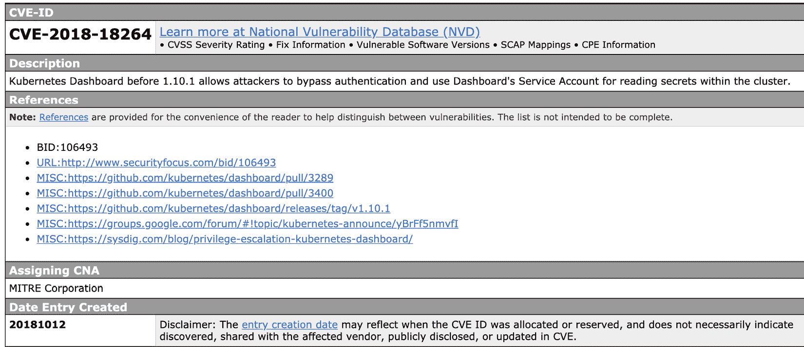
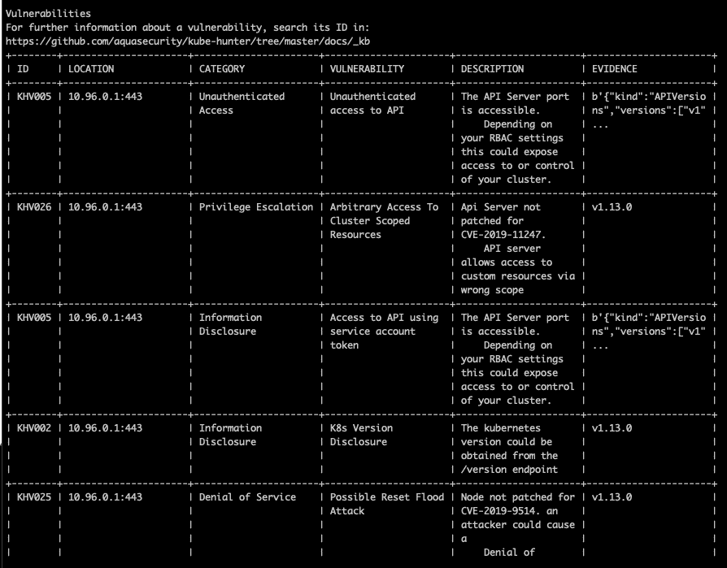

# 第十三章：从 Kubernetes CVEs 中学习

**通用漏洞和暴露**（**CVEs**）是对广为人知的安全漏洞和暴露的标识，这些漏洞和暴露存在于流行的应用程序中。CVE ID 由`CVE`字符串后跟漏洞的年份和 ID 号组成。CVE 数据库是公开可用的，并由 MITRE 公司维护。CVE 条目包括每个问题的简要描述，有助于了解问题的根本原因和严重程度。这些条目不包括问题的技术细节。CVE 对于 IT 专业人员协调和优先更新是有用的。每个 CVE 都有与之相关的严重性。MITRE 使用**通用漏洞评分系统**（**CVSS**）为 CVE 分配严重性评级。建议立即修补高严重性的 CVE。让我们看一个在[cve.mitre.org](http://cve.mitre.org)上的 CVE 条目的例子。

如下截图所示，CVE 条目包括 ID、简要描述、参考文献、**CVE 编号管理机构**（**CNA**）的名称以及条目创建日期：

图 13.1 - CVE-2018-18264 的 MITRE 条目

对于安全研究人员和攻击者来说，CVE 条目最有趣的部分是**参考文献**部分。CVE 的参考文献是指研究人员发布的博客链接，涵盖了问题的技术细节，以及问题描述和拉取请求的链接。安全研究人员研究这些参考文献，以了解漏洞并开发类似问题的缓解措施，或者针对尚未修复的已知问题。另一方面，攻击者研究这些参考文献，以找到未修补的问题变体。

在本章中，我们将讨论 Kubernetes 的四个公开已知安全漏洞。首先，我们将看一下路径遍历问题-CVE-2019-11246。这个问题允许攻击者修改客户端的内容，这可能导致数据泄露或在集群管理员的机器上执行代码。接下来，我们将讨论 CVE-2019-1002100，它允许用户对 API 服务器进行**拒绝服务**（DoS）攻击。然后，我们将讨论 CVE-2019-11253，它允许未经身份验证的用户对`kube-apiserver`进行 DoS 攻击。最后，我们将讨论 CVE-2019-11247，它允许具有命名空间权限的用户修改集群范围的资源。我们将讨论每个 CVE 的缓解策略。升级到 Kubernetes 和`kubectl`的最新版本，以修补漏洞，应该是您的首要任务。Kubernetes 的最新稳定版本可以在[`github.com/kubernetes/kubernetes/releases`](https://github.com/kubernetes/kubernetes/releases)找到。我们将讨论的缓解策略将有助于加强您的集群对类似性质的攻击。最后，我们将介绍`kube-hunter`，它可以用于扫描已知安全漏洞的 Kubernetes 集群。

在本章中，我们将涵盖以下主题：

+   kubectl cp 中的路径遍历问题-CVE-2019-11246

+   JSON 解析中的 DoS 问题-CVE-2019-1002100

+   YAML 解析中的 DoS 问题-CVE-2019-11253

+   角色解析中的特权升级问题-CVE-2019-11247

+   使用 kube-hunter 扫描已知漏洞

# kubectl cp 中的路径遍历问题-CVE-2019-11246

开发人员经常为调试目的将文件复制到或从 Pod 中的容器中。 `kubectl cp`允许开发人员从 Pod 中的容器复制文件，或者将文件复制到 Pod 中的容器（默认情况下，这是在 Pod 中的第一个容器中完成的）。

要将文件复制到 Pod，您可以使用以下方法：

[PRE0]

要从 Pod 复制文件，您可以使用以下方法：

[PRE1]

当文件从一个 pod 中复制时，Kubernetes 首先创建文件内部的文件的 TAR 归档。然后将 TAR 归档复制到客户端，最后为客户端解压 TAR 归档。2018 年，研究人员发现了一种方法，可以使用`kubectl cp`来覆盖客户端主机上的文件。如果攻击者可以访问一个 pod，这个漏洞可以被用来用恶意文件替换 TAR 归档。当畸形的 TAR 文件被复制到主机时，它可以在解压时覆盖主机上的文件。这可能导致数据泄露和主机上的代码执行。

让我们看一个例子，攻击者修改 TAR 归档，使其包含两个文件：`regular.txt`和`foo/../../../../bin/ps`。在这个归档中，`regular.txt`是用户期望的文件，`ps`是一个恶意二进制文件。如果这个归档被复制到`/home/user/admin`，恶意二进制文件将覆盖`bin`文件夹中的众所周知的`ps`二进制文件。这个问题的第一个补丁是不完整的，攻击者找到了一种利用符号链接的方法来利用相同的问题。研究人员找到了一种绕过符号链接修复的方法，最终在 1.12.9、1.13.6 和 1.14.2 版本中解决了这个问题，并被分配了 CVE-2019-11246。

## 缓解策略

您可以使用以下策略来加固您的集群，以防止这个问题和类似于 CVE-2019-11246 的问题：

+   **始终使用更新版本的 kubectl**：您可以使用以下命令找到`kubectl`二进制文件的最新版本：

[PRE2]

+   **使用准入控制器限制 kubectl cp 的使用**：正如我们在*第七章*中讨论的那样，*身份验证、授权和准入控制*，Open Policy Agent 可以用作准入控制器。让我们看一个拒绝调用`kubectl cp`的策略：

[PRE3]

这个策略拒绝了 pod 中 TAR 二进制文件的执行，从而禁用了所有用户的`kubectl cp`。您可以更新此策略，以允许特定用户或组的`kubectl cp`。

+   为客户端应用适当的访问控制：如果您是生产集群的管理员，您的工作机器上有许多攻击者可能想要访问的机密信息。理想情况下，构建机器不应该是您的工作笔记本电脑。管理员可以`ssh`到的专用硬件来访问 Kubernetes 集群是一个良好的做法。您还应确保构建机器上的任何敏感数据都具有适当的访问控制。

+   为所有 pod 设置安全上下文：如*第八章*中所讨论的，*保护 Kubernetes Pod*，确保 pod 具有`readOnlyRootFilesystem`，这将防止攻击者在文件系统中篡改文件（例如，覆盖`/bin/tar`二进制文件）。

[PRE4]

+   使用 Falco 规则检测文件修改：我们在*第十一章*中讨论了 Falco，*深度防御*。Falco 规则（可以在[`github.com/falcosecurity/falco/blob/master/rules/falco_rules.yaml`](https://github.com/falcosecurity/falco/blob/master/rules/falco_rules.yaml)找到）可以设置为执行以下操作：

检测 pod 中二进制文件的修改：使用默认的 Falco 规则中的`Write below monitored dir`来检测对 TAR 二进制文件的更改：

[PRE5]

检测使用易受攻击的 kubectl 实例：`kubectl`版本 1.12.9、1.13.6 和 1.14.2 已修复了此问题。使用早于此版本的任何版本都将触发以下规则：

[PRE6]

CVE-2019-11246 是为什么您需要跟踪安全公告并阅读技术细节以添加减轻策略到您的集群以确保如果发现问题的任何变化，您的集群是安全的一个很好的例子。接下来，我们将看看 CVE-2019-1002100，它可以用于在`kube-apiserver`上引起 DoS 问题。

# JSON 解析中的 DoS 问题-CVE-2019-1002100

修补是一种常用的技术，用于在运行时更新 API 对象。开发人员使用`kubectl patch`在运行时更新 API 对象。一个简单的例子是向 pod 添加一个容器：

[PRE7]

前面的补丁文件允许一个 pod 被更新以拥有一个新的 Redis 容器。`kubectl patch`允许补丁以 JSON 格式。问题出现在`kube-apiserver`的 JSON 解析代码中，这允许攻击者发送一个格式错误的`json-patch`实例来对 API 服务器进行 DoS 攻击。在*第十章*中，*Kubernetes 集群的实时监控和资源管理*，我们讨论了 Kubernetes 集群中服务可用性的重要性。这个问题的根本原因是`kube-apiserver`对`patch`请求的未经检查的错误条件和无限制的内存分配。

## 缓解策略

你可以使用以下策略来加固你的集群，以防止这个问题和类似 CVE-2019-100210 的问题：

+   **在 Kubernetes 集群中使用资源监控工具**：如*第十章*中所讨论的，*Kubernetes 集群的实时监控和资源管理*，资源监控工具如 Prometheus 和 Grafana 可以帮助识别主节点内存消耗过高的问题。在 Prometheus 指标图表中，高数值可能如下所示：

[PRE8]

这些资源图表显示了`kube-apiserver`在 5 分钟间隔内的最大内存、CPU 和网络使用情况。这些使用模式中的任何异常都是`kube-apiserver`受到攻击的迹象。

+   **建立高可用性的 Kubernetes 主节点**：我们在*第十一章*中学习了高可用性集群，*深度防御*。高可用性集群有多个 Kubernetes 组件的实例。如果一个组件的负载很高，其他实例可以被使用，直到负载减少或第一个实例重新启动。

使用`kops`，你可以使用`--master-zones={zone1, zone2}`来拥有多个主节点：

[PRE9]

正如您所看到的，这个集群中有多个`kube-apiserver` pods 在运行。

+   **使用 RBAC 限制用户权限**：用户的权限也应该遵循最小权限原则，这在*第四章*中已经讨论过，*在 Kubernetes 中应用最小权限原则*。如果用户不需要访问任何资源的`PATCH`权限，角色应该被更新以便他们没有访问权限。

+   **在暂存环境中测试您的补丁**：暂存环境应设置为生产环境的副本。开发人员并不完美，因此开发人员可能会创建格式不正确的补丁。如果在暂存环境中测试集群的补丁或更新，就可以在不影响生产服务的情况下发现补丁中的错误。

DoS 通常被认为是低严重性问题，但如果发生在集群的核心组件上，您应该认真对待。对`kube-apiserver`的 DoS 攻击可能会破坏整个集群的可用性。接下来，我们将看看针对 API 服务器的另一种 DoS 攻击。未经身份验证的用户可以执行此攻击，使其比 CVE-2019-1002100 更严重。

# YAML 解析中的 DoS 问题 - CVE-2019-11253

XML 炸弹或十亿笑攻击在任何 XML 解析代码中都很受欢迎。与 XML 解析问题类似，这是发送到`kube-apiserver`的 YAML 文件中的解析问题。如果发送到服务器的 YAML 文件具有递归引用，它会触发`kube-apiserver`消耗 CPU 资源，从而导致 API 服务器的可用性问题。在大多数情况下，由`kube-apiserver`解析的请求受限于经过身份验证的用户，因此未经身份验证的用户不应该能够触发此问题。在 Kubernetes 版本 1.14 之前的版本中有一个例外，允许未经身份验证的用户使用`kubectl auth can-i`来检查他们是否能执行操作。

这个问题类似于 CVE-2019-1002100，但更严重，因为未经身份验证的用户也可以触发此问题。

## 缓解策略

您可以使用以下策略来加固您的集群，以防止此问题和类似于 CVE-2019-11253 的尚未发现的问题：

+   **在 Kubernetes 集群中使用资源监控工具**：类似于 CVE-2019-1002100，资源监控工具（如 Prometheus 和 Grafana）可以帮助识别主节点内存消耗过高的问题，我们在*第十章*中讨论了*实时监控和资源管理的 Kubernetes 集群*。

+   **启用 RBAC**：漏洞是由`kube-apiserver`在 YAML 文件中对递归实体的处理不当以及未经身份验证的用户与`kube-apiserver`交互的能力引起的。我们在*第七章*中讨论了 RBAC，*身份验证、授权和准入控制*。RBAC 在当前版本的 Kubernetes 中默认启用。您也可以通过将`--authorization-mode=RBAC`传递给`kube-apiserver`来启用它。在这种情况下，未经身份验证的用户不应被允许与`kube-apiserver`交互。对于经过身份验证的用户，应遵循最小特权原则。

+   **为未经身份验证的用户禁用 auth can-i（对于 v1.14.x）**：不应允许未经身份验证的用户与`kube-apiserver`交互。在 Kubernetes v1.14.x 中，您可以使用[`github.com/kubernetes/kubernetes/files/3735508/rbac.yaml.txt`](https://github.com/kubernetes/kubernetes/files/3735508/rbac.yaml.txt)中的 RBAC 文件禁用未经身份验证的服务器的`auth can-i`：

[PRE10]

第二个命令禁用了`clusterrolebinding`的自动更新，这将确保在重新启动时不会覆盖更改。

+   **kube-apiserver 不应暴露在互联网上**：允许来自受信任实体的 API 服务器访问使用防火墙或 VPC 是一个良好的做法。

+   **禁用匿名身份验证**：我们在*第六章*中讨论了`anonymous-auth`作为一个应该在可能的情况下禁用的选项，*保护集群组件*。匿名身份验证在 Kubernetes 1.16+中默认启用以用于传统策略规则。如果您没有使用任何传统规则，建议默认禁用`anonymous-auth`，方法是将`--anonymous-auth=false`传递给 API 服务器。

正如我们之前讨论的，对`kube-apiserver`的 DoS 攻击可能会导致整个集群的服务中断。除了使用包含此问题补丁的最新版本的 Kubernetes 之外，重要的是遵循这些缓解策略，以避免集群中出现类似问题。接下来，我们将讨论授权模块中触发经过身份验证用户特权升级的问题。

# 角色解析中的特权升级问题 – CVE-2019-11247

我们在*第七章*中详细讨论了 RBAC，*认证、授权和准入控制*。角色和角色绑定允许用户获得执行某些操作的特权。这些特权是有命名空间的。如果用户需要集群范围的特权，则使用集群角色和集群角色绑定。这个问题允许用户进行集群范围的修改，即使他们的特权是有命名空间的。准入控制器的配置，比如 Open Policy Access，可以被具有命名空间角色的用户修改。

## 缓解策略

您可以使用以下策略来加固您的集群，以防止这个问题和类似 CVE-2019-11247 的问题：

+   **避免在角色和角色绑定中使用通配符**：角色和集群角色应该特定于资源名称、动词和 API 组。在 `roles` 中添加 `*` 可以允许用户访问他们本不应该访问的资源。这符合我们在*第四章*中讨论的最小特权原则，*在 Kubernetes 中应用最小特权原则*。

+   **启用 Kubernetes 审计**：我们在*第十一章*中讨论了 Kubernetes 的审计和审计策略，*深度防御*。Kubernetes 的审计可以帮助识别集群中的任何意外操作。在大多数情况下，这样的漏洞会被用来修改和删除集群中的任何额外控制。您可以使用以下策略来识别这类利用的实例：

[PRE11]

此策略记录了在 `kube-system` 或 `monitoring` 命名空间中删除或修改 pod 的任何实例。

这个问题确实很有趣，因为它突显了 Kubernetes 提供的安全功能如果配置错误也可能会带来危害。接下来，我们将讨论 `kube-hunter`，这是一个开源工具，用于查找集群中已知的安全问题。

# 使用 kube-hunter 扫描已知的漏洞

Kubernetes 发布的安全公告和公告（[`kubernetes.io/docs/reference/issues-security/security/`](https://kubernetes.io/docs/reference/issues-security/security/)）是跟踪 Kubernetes 中发现的新安全漏洞的最佳方式。这些公告和咨询电子邮件可能会有点压倒性，很可能会错过重要的漏洞。为了避免这些情况，定期检查集群中是否存在已知 CVE 的工具就派上用场了。`kube-hunter`是一个由 Aqua 开发和维护的开源工具，可帮助识别您的 Kubernetes 集群中已知的安全问题。

设置`kube-hunter`的步骤如下：

1.  克隆存储库：

[PRE12]

1.  在您的集群中运行`kube-hunter` pod：

[PRE13]

1.  查看日志以查找集群中的任何问题：

[PRE14]

以下输出显示了 Kubernetes v1.13.0 中已知的漏洞列表：

图 13.2 - kube-hunter 的结果

这个截图突出显示了`kube-hunter`在 Kubernetes v1.13.0 集群中发现的一些问题。`kube-hunter`发现的问题应该被视为关键，并应立即解决。

# 摘要

在本章中，我们讨论了 CVE 的重要性。这些公开已知的标识对于集群管理员、安全研究人员和攻击者都很重要。我们讨论了由 MITRE 维护的 CVE 条目的重要方面。然后我们看了四个知名的 CVE，并讨论了每个 CVE 的问题和缓解策略。作为集群管理员，升级`kubectl`客户端和 Kubernetes 版本应该始终是您的首要任务。然而，添加缓解策略以检测和防止由未公开报告的类似问题引起的利用同样重要。最后，我们讨论了一个开源工具`kube-hunter`，它可以定期识别您的 Kubernetes 集群中的问题。这消除了集群管理员密切关注 Kubernetes 的安全公告和公告的额外负担。

现在，您应该能够理解公开披露的漏洞的重要性，以及这些公告如何帮助加强您的 Kubernetes 集群的整体安全姿态。阅读这些公告将帮助您识别集群中的任何问题，并有助于加固您的集群。

# 问题

1.  CVE 条目对集群管理员、安全研究人员和攻击者来说最重要的部分是什么？

1.  为什么客户端安全问题，如 CVE-2019-11246 对 Kubernetes 集群很重要？

1.  为什么 kube-apiserver 中的 DoS 问题被视为高严重性问题？

1.  比较 API 服务器中经过身份验证与未经身份验证的 DoS 问题。

1.  讨论`kube-hunter`的重要性。

# 更多参考资料

+   CVE 列表：[`cve.mitre.org/cve/search_cve_list.html`](https://cve.mitre.org/cve/search_cve_list.html)

+   使用 Falco 检测 CVE-2019-11246：[`sysdig.com/blog/how-to-detect-kubernetes-vulnerability-cve-2019-11246-using-falco/`](https://sysdig.com/blog/how-to-detect-kubernetes-vulnerability-cve-2019-11246-using-falco/)

+   使用 OPA 防止 CVE-2019-11246：[`blog.styra.com/blog/investigate-and-correct-cves-with-the-k8s-api`](https://blog.styra.com/blog/investigate-and-correct-cves-with-the-k8s-api)

+   CVE-2019-1002100 的 GitHub 问题：[`github.com/kubernetes/kubernetes/issues/74534`](https://github.com/kubernetes/kubernetes/issues/74534)

+   CVE-2019-11253 的 GitHub 问题：[`github.com/kubernetes/kubernetes/issues/83253`](https://github.com/kubernetes/kubernetes/issues/83253)

+   CVE-2019-11247 的 GitHub 问题：[`github.com/kubernetes/kubernetes/issues/80983`](https://github.com/kubernetes/kubernetes/issues/80983)

+   `kube-hunter`：[`github.com/aquasecurity/kube-hunter`](https://github.com/aquasecurity/kube-hunter)

+   CVE 2020-8555 的 GitHub 问题：[`github.com/kubernetes/kubernetes/issues/91542`](https://github.com/kubernetes/kubernetes/issues/91542)

+   CVE 2020-8555 的 GitHub 问题：[`github.com/kubernetes/kubernetes/issues/91507`](https://github.com/kubernetes/kubernetes/issues/91507)
